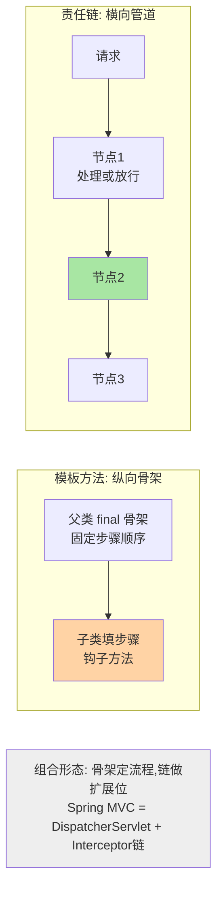
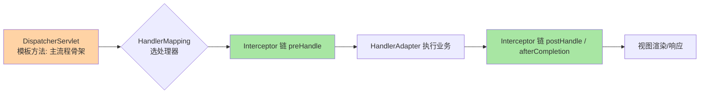
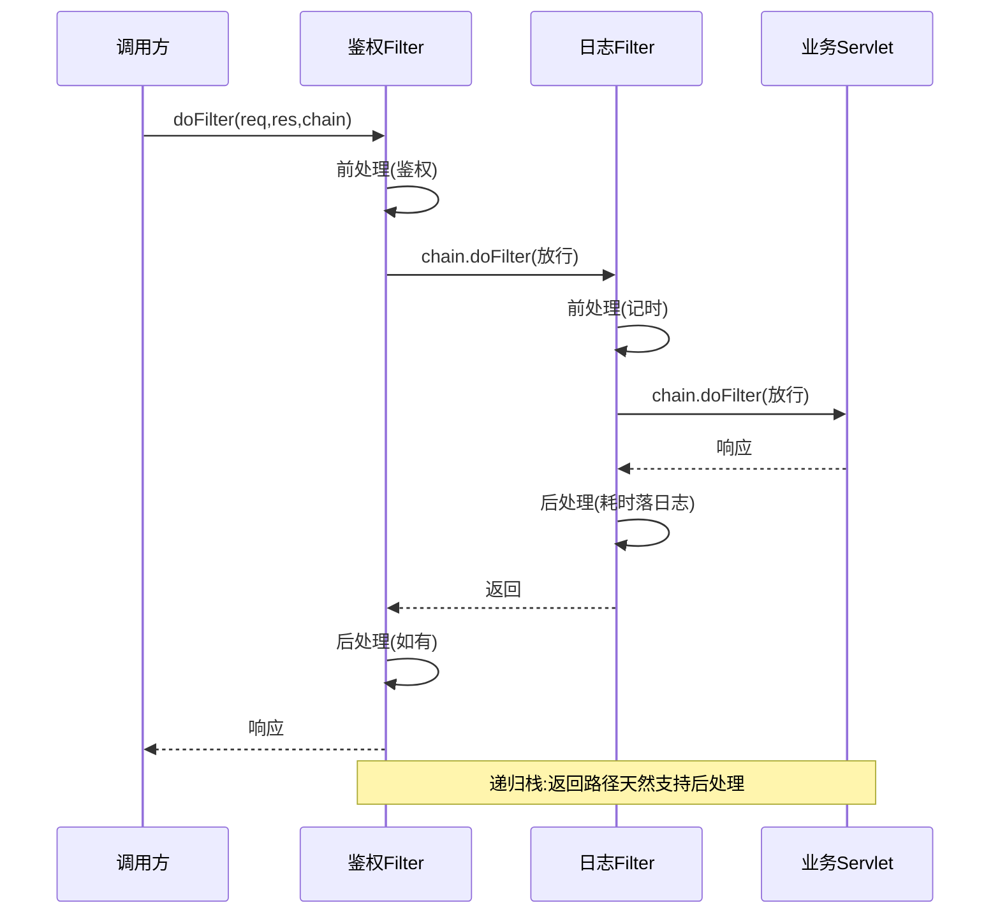

# 模板方法与责任链：骨架固化与链式传递的机制与治理

> 模板方法把「流程不变、步骤可变」固化成父类骨架；责任链把「多个处理者依次尝试」串成链。一个是继承纵向扩展，一个是组合横向扩展——框架源码里出镜率最高的双雄。本篇拆两者机制（钩子方法 / FilterChain 推进）、框架真实形态（JdbcTemplate / Servlet Filter / 网关过滤器）、各自的失控形态与治理硬线。

> **本文核心**：模板方法的机制本质是「流程控制权上收父类，步骤实现下放子类」（Hollywood Principle：别调用我们，我们会调用你）；责任链的机制本质是「请求沿处理者序列传递，每个节点决定处理或放行」。两者的失控都在**结构约束**：模板方法被继承绑定（一绑终身、无法运行期组合），责任链被顺序绑定（顺序即语义，隐式顺序是事故源）——治理方向都是把约束显式化。

## 一句话摘要

模板方法（Template Method）：抽象父类的 final 骨架方法固定算法流程，流程中的可变步骤声明为抽象方法或带默认实现的钩子方法，子类只填步骤——JdbcTemplate（获取连接/异常转换固定，SQL 执行回调填充）、Servlet 的 service 分发、Spring 容器 refresh 骨架都是它。责任链（Chain of Responsibility）：处理者组成链，请求从头进入，每节点「处理则止 / 不处理传递」（Servlet Filter 链的 doFilter 递归推进、网关过滤器链、审批流）。两者常组合出现：框架用模板方法定主流程，流程中的横切步骤用责任链扩展（Spring MVC：DispatcherServlet 是骨架，Interceptor 链是扩展位）。

## 🎯 本文核心（机制坐标）

## 一、源码关键路径：两模式的机制内核

**模板方法的钩子谱系**：抽象方法（子类必须实现，流程必需步骤）、钩子方法（父类给默认实现，子类可选覆盖，通常是流程中的「可选动作位」）、模板方法本身（final，防子类改流程）。JdbcTemplate 的 execute 是教科书样本：获取连接 → 组装语句 → `action.doInPreparedStatement(ps)` 回调（变化点）→ 异常转译 → 释放资源——资源管理与异常转译这些「永远不变的复杂度」被固化一次，业务只写 SQL 回调。**模板方法的价值计量单位是「被固化的重复复杂度」**：没有重复复杂度的场景套模板是空转。

**责任链的推进机制**：Servlet Filter 链是递归形态——`FilterChain.doFilter` 让每个 Filter 决定「前处理 → 放行 → 后处理」，放行即调用链上下一节点；网关过滤器链多为迭代形态——循环里逐节点判断「命中则处理并可能中断」。递归形态天然支持「后处理」（返回路径再走一遍），迭代形态要显式保存「前处理标记」才能做后处理——两种推进方式的差异决定了各自适合的增强类型。

组合形态的框架实例（Spring MVC 架构）：

## 二、与策略模式、组合模式的区别辨析

| 维度 | 模板方法 | 策略 | 责任链 |
|---|---|---|---|
| 扩展方向 | 继承（编译期绑定） | 组合（运行期替换） | 组合序列（运行期编排） |
| 数量关系 | 一个骨架多个填法 | 一次选一个实现 | 一次穿一串节点 |
| 顺序语义 | 骨架固定 | 无顺序概念 | 顺序即语义 |

与策略的分界：模板方法在「类的内部」固化流程（继承），策略在「类的外部」替换实现（组合）——GoF 时代模板方法是主流，组合优先的现代实践里策略常能替代模板（流程骨架做成函数，步骤做成策略参数）；模板方法退守到「流程本身需要被框架强约束」的场景。与组合模式的分界：组合是「树形部分-整体」（一对多递归结构），责任链是「线性传递」（一维顺序结构）——链上节点也可以是组合根，但结构语义不同。

责任链的递归推进与后处理能力：

## 三、典型使用场景

- **框架主流程**：Servlet service 分发、Spring refresh、MyBatis Executor 骨架——框架的「不变协议」全靠模板方法钉住
- **Web 过滤链**：鉴权 → 日志 → 限流 → 业务 → 异常翻译，Filter/Interceptor 链是责任链的最大存量现场
- **网关插件**：路由、改写、熔断插件链式编排，插件顺序即请求语义
- **审批/工单流**：逐级审批（本级处理或上报），责任链的 workflow 形态
- **数据装配管道**：清洗 → 校验 → 转换 → 加固，ETL 步骤链

## 四、事故叙事两则

**叙事一：Filter 顺序错位，限流在鉴权后白限。**某网关的过滤器注册顺序被一次依赖排序变更打乱：限流过滤器排到了鉴权之后——未登录的恶意流量先穿鉴权（大量 401 响应）才到限流器，限流统计的全是「已被拒绝的请求」，真实攻击流量在鉴权层就打满了资源。排查靠「限流计数与网关 QPS 对不上」的数据异常发现。修复：过滤器顺序从「注册顺序碰运气」改为「显式 order 分层」（鉴权组 order=100、限流组=200、业务=300），并加顺序断言测试。复盘沉淀：**链式系统的顺序是语义，必须显式声明 + 断言守护**——依赖注入容器的排序规则（@Order、注册序）不是顺序契约，只是当前事实。

**叙事二：钩子方法被覆盖，对账流程漏跑一步。**某对账框架的模板方法里有三个钩子（拉数据、比对、差异上报），新业务接入时开发者「临时」覆盖了差异上报钩子做本地处理，忘了恢复——该业务线对账差异静默不上报一个季度，直到财务侧发现账实差异。复盘沉淀：**钩子方法的默认实现是「业务契约」不是「示例代码」**——覆盖钩子的代码必须显式说明「为什么默认行为不适用」，且对账类模板把「不可跳过步骤」做成抽象方法（不实现就编译不过）而不是可覆盖钩子。**「必需步骤用抽象方法，可选步骤才用钩子」是模板方法设计的第一分界。**

## 五、追问链：把「继承固化」与「链式传递」问穿一层

- **追问一：模板方法用继承绑定，现代实践为什么不推荐了？**——继承是编译期强绑定：流程要变就得改父类（影响全部子类），步骤要运行期换做不到，「一个骨架一个子类」的组合自由度归零。组合替代（骨架函数 + 步骤策略参数）把这些全打开——代价是「骨架的强约束感」消失，流程一致性从语言机制降级为约定。**强约束场景（框架协议）仍该用模板方法，自由组合场景用组合**——按「流程要不要强制统一」选。
- **再追问：责任链里一个节点「处理了但没放行」和「放行了但没处理」怎么区分语义？**——这是链上最模糊的语义点：Servlet 链的放行必经（不放行 = 响应已自行处理，如缓存命中直接返回）；审批链的处理即终止（本级批完不再上报）。两种链的节点契约完全不同——**设计链的第一件事是定义「终止语义」**（什么算处理完、什么算放行、什么算拒绝），没定义终止语义的链，运行期全是「怎么走到这的」悬案。
- **打破砂锅：链能动态增删节点，是不是越灵活越好？**——运行期改链 = 请求语义在运行期变化，可观测与回滚都复杂化。收敛的惯例：链结构配置化但**变更走发布**（配置即代码，有评审有回滚），运行期只允许「开关已有节点」不允许「热插拔新节点」——灵活性的边界在可回滚性。

## 六、反方案分析：不套模式的替代

- **为什么「函数组合」常优于模板方法**：流程骨架写成高阶函数（步骤作为函数参数传入），无需继承、无需子类——Java 里用函数接口/lambda 组合，测试性直接拉满（每步独立可测）。模板方法的存量价值在框架协议（父类契约是公共 API），新写业务流程优先函数组合
- **为什么审批流不该手写责任链**：审批场景天然有「流程定义外部化 + 运行期人工干预 + 回退跳转」诉求，手写链会逐步长成残缺工作流引擎——直接用工作流引擎（或状态机框架）把流程语义交给成熟件，代码只写节点行为
- **为什么网关不用 if-else 按序调用**：插件的启停与排序需要统一治理面（监控、热开关、顺序配置）——链结构 + 显式 order 是把「调用序列」升格为「可治理资产」的最小机制，if-else 让序列散进代码无法盘点

## 七、设计思想：控制权与灵活性的分配

模板方法与责任链代表控制权分配的两个极：模板方法把控制权**全给骨架**（流程强制统一，扩展只能填空），责任链把控制权**全给编排**（流程可任意重组，约束只在节点契约）。这套「控制权分层分配」的思想是框架架构设计的核心课题，Spring MVC 是教科书样本：骨架层用模板方法保证协议（DispatcherServlet 的主流程），扩展层用责任链提供自由（HandlerInterceptor 链）——**「不变的用继承钉死，可变的用编排开放」**。这条「控制权分层分配」的思想是框架设计的核心课题：控制权给多了系统僵化，给少了协议失守，框架的品味体现在分界线画在哪。

## 八、不同量级的思考：链与骨架的规模治理

- **十万级 QPS 以下**：约束来源是正确性与可读性——链节点少（个位数）、模板骨架稳定，治理需求弱。这一档的核心问题是「节点契约与钩子语义是否清晰」
- **百万级 QPS / 长链路**：约束来源是链路开销与排查——每节点的前后处理都在热路径，链长直接放大延迟；排查需要「链上逐节点耗时」视图——递归形态（Servlet 链）天然带前后处理两个插入点，迭代形态（多数网关）要显式区分「前处理标记」，实现前先画清节点的生命周期。这一档的核心问题是「链的可观测」，解法是节点级耗时打点 + 链路快照（请求命中的节点序列落日志）
- **千万级 QPS / 网关级**：约束来源是编排治理——插件市场式扩张后，顺序配置、启停灰度、版本共存成为常态。这一档的核心问题是「链结构的变更治理」，解法是编排配置版本化 + 顺序断言测试 + 灰度面

**自下而上与触发升级**：先量链长与单节点耗时占比，个位数节点无感就不治理；触发升级的信号是「链上耗时占比进入剖析 top」「顺序事故出现第一次」「插件数量失控」——约束从正确性迁到链路观测再迁到编排治理，机制跟着升级，不预先建治理面。

## 九、业内惯例

- 框架惯例：模板方法的骨架方法 final（Servlet 的 service 可覆写是历史例外）；钩子默认实现即契约，覆盖需注释说明理由
- 链上节点统一基类/接口（before/after 生命周期钩子齐全），order 显式声明 + 顺序断言测试进 CI
- 网关与中间件的插件链配置版本化，变更走发布流程；链路快照（本次请求经过的节点序列）进访问日志，排查的第一入口
- 「必需步骤抽象方法、可选步骤钩子」写进框架扩展指南——这是模板方法设计的第一分界线

## 你们可能会问

**Q1：JdbcTemplate 为什么不用连接池池化 + 模板，性能不是差吗？**
模板方法管的是「资源获取/释放的流程固化」，连接池管「连接复用」——两者正交，JdbcTemplate 之下就是连接池。模板的回调形态（lambda 传 SQL 动作）在现代 Java 里零额外开销，性能问题从来不在模板层。

**Q2：责任链节点之间能通信吗？**
能但要克制：链上共享上下文（Request/Response 属性）是标准机制，但节点间通过上下文隐式传数据 = 节点耦合（上游改 key，下游静默失效）。纪律：上下文 key 集中定义 + 节点声明「我读哪些写哪些」，把隐式依赖显式化到可 review。

**Q3：模板方法和「组合优先」原则冲突吗？**
冲突且现代实践多选组合——但框架协议场景例外：骨架即公共契约时，继承的强约束是特性不是缺陷（子类想偏离都难）。判断题不是「继承还是组合」，是「这个流程要不要强制统一」。

## 十、什么时候用 / 不用

- ✅ 模板方法：框架协议固化（流程必须统一）、重复复杂度真实存在（资源管理/异常转译）
- ✅ 责任链：横切步骤可插拔、顺序有语义、节点独立可测（Web 链、网关、校验管道）
- ❌ 不用模板：流程步骤会运行期重组——组合（函数/策略）替代
- ❌ 不用手写审批责任链：流程定义/人工干预/回退诉求出现即转工作流引擎
- ❌ 不建超长链：节点数失控先分层（前置组/业务组/后置组），一维链扛不住治理

## Trade-off：强约束与自由度的交换

模板方法用继承刚性换「流程不可被破坏」——协议安全的代价是扩展僵硬；责任链用编排自由换「扩展即插拔」——灵活的代价是顺序语义与治理负担。框架的分界艺术在分层混用（骨架钉协议 + 链开放扩展），业务的选型依据是「流程统一性强不强」。**结构与治理成正比：选了自由度更高的结构，治理面就是必配项而不是可选项**——这条账算清，模板与链的选型不再纠结。

### 演进视角：这两个模式的十年变迁

过去十年，模板方法在业务代码里的份额持续让位给组合方案（函数组合、策略注入、响应式管道），守住的地盘是框架协议层——「公共契约需要强制统一」的场景天然属于继承骨架。责任链则反向扩张：从 Web 过滤器扩张到网关插件、Sidecar 扩展、数据管道编排——「可编排的处理序列」的需求面在服务网格时代被放大。一缩一张的背后是同一个趋势：**业务代码从「定义流程」转向「编排流程」**，控制权的粒度从类级下沉到节点级。理解这个趋势，就能预判自己手上的流程代码该往哪个形态演进：强协议的守骨架，重编排的上链，两者都不是的用函数组合轻装走。

## 开放问题

- 虚拟线程下 Filter 链的阻塞语义变化（链上任意节点可低成本挂起），异步链与同步链的实现分界在重画
- 插件编排平台化（网关插件市场、Sidecar 扩展）让「链结构」从应用内走向跨进程，编排治理面在升级为独立基础设施

## 💡 实战提示

- 💡 必需步骤用抽象方法（不实现编不过），可选步骤才用钩子——覆盖钩子必须注释「为什么默认不适用」
- 💡 链的终止语义先定义：放行/处理完/拒绝三种出口写进节点契约，没定义就别写链
- 💡 过滤器顺序显式 order 分层 + 顺序断言测试——注册序不是契约
- 💡 链路快照（命中节点序列）进访问日志——链上排查的第一入口
- 💡 新业务流程默认函数组合，模板方法留给「流程要强制统一」的场景

### 链上节点的测试策略

链式结构测试的关键是把「节点行为」与「链的编排」分开测：节点行为用普通单测（mock 上下文直接调节点方法）；编排语义用专门的「链测试」——按生产配置组装真实链，喂标准请求，断言「节点命中序列 + 最终效果 + 顺序敏感节点的前后关系」。编排测试的价值在防回归：依赖排序变更、新增节点、order 调整这类「没改任何业务代码」的变更，恰恰是链式系统最常见的破坏源——顺序断言测试就是为它们准备的哨兵。每个链在 CI 里的最小守护是一条「黄金路径用例」：一次标准请求的全链行为快照，变了就人工确认。

## 自测三问

1. 模板方法的钩子谱系是什么？「必需步骤用抽象方法」为什么是第一分界？
2. Servlet 链（递归）与网关链（迭代）的推进差异，如何影响各自的增强能力？
3. 责任链的「终止语义」指什么？没定义会发生什么？

## 🎯 核心带走

- **核心一句话**：模板方法把控制权给骨架（流程钉死、填空扩展），责任链把控制权给编排（节点自由、顺序即语义）——框架的做法是骨架钉协议 + 链开放扩展
- **机制内核**：钩子谱系（抽象方法/钩子/final 骨架）｜链的递归与迭代推进（后处理能力不同）
- **哪里会坏**：覆盖钩子漏跑契约步骤、Filter 顺序错位、链上隐式上下文耦合
- **边界**：流程要统一才用模板；审批类链直接上工作流引擎；超长链先分层再治理
- **量级迁移**：十万级问契约、百万级问可观测、千万级问编排治理

### MyBatis 的 Executor 骨架：组合形态的工业样本

MyBatis 的执行体系是「模板 + 装饰链」的复合：BaseExecutor 用模板方法固化「一级缓存查询 → 事务提交判定 → 清理句柄」的骨架，`doQuery/doUpdate` 留给子类填（Simple/Reuse/Batch 三种执行器）；CacheExecutor 再用装饰器把二级缓存包在执行器外层；拦截器插件（Interceptor，责任链形态）可在四大对象的方法上织入分页、审计等增强。读透这一套，模板、装饰、责任链三种结构如何在同一个执行引擎里各司其职就有了具体坐标：**骨架定协议（BaseExecutor）、装饰加能力（缓存）、链做扩展（插件）**——三种结构不互斥，按各自擅长的问题分层叠加，这是读框架源码时最值得带走的设计图式。

## 📌 数据与事实声明

- 写于 2026-09-15；两模式定义以 GoF《设计模式》为准；Servlet Filter 与 Spring MVC Interceptor 机制以官方规范/文档公开口径为准
- 事故叙事为业内高频缺陷模式的匿名化叙事，非特定公司事件
- 免责：框架行为以对应版本文档为准

## 📚 参考资料

| 类型 | 标题 | 来源 |
|---|---|---|
| 经典书 | GoF《设计模式》（Template Method / Chain of Responsibility 章） | 公开出版 |
| 官方规范 | Jakarta Servlet 规范（Filter 链） | jakarta.ee |
| 官方文档 | Spring Framework Web MVC（Interceptor 与 DispatcherServlet） | docs.spring.io |
| 官方源码 | spring-framework（JdbcTemplate / DispatcherServlet） | github.com/spring-projects/spring-framework |
| 系列内 | 0_系列导读 | 本目录 |
