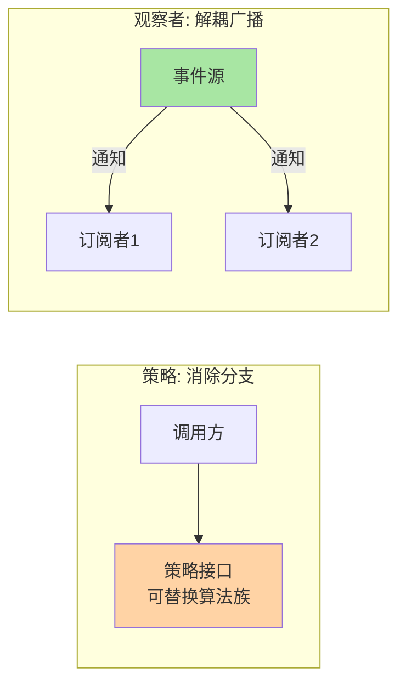
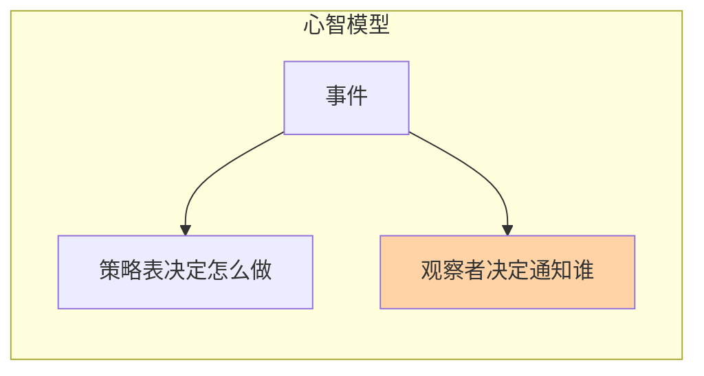
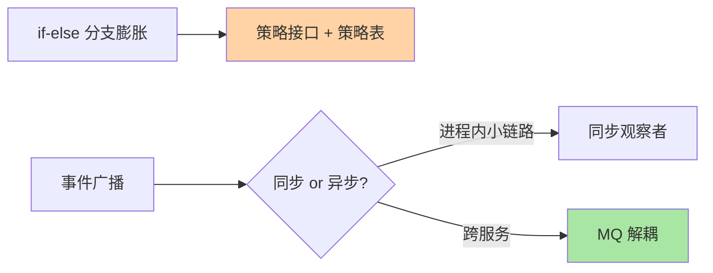

# 深入理解策略与观察者系列

> 策略消除 if-else 分支，观察者解耦事件广播——这两个行为型模式是业务代码里出场率最高的一对。本系列讲它们的机制、代价与滥用边界。

## 这个目录讲什么

策略模式把「同一件事的多种做法」封装成可替换的算法族；观察者模式把「一件事发生后谁要知道」变成订阅关系。两者都消耦合，但各自有代价：策略带来类数量膨胀与选择逻辑转移，观察者带来执行顺序不可控与事件链排查困难。正文把收益与代价摆在一起讲。

## 这个目录下有哪些文章

| 篇目 | 类型 | 一句话重点 |
|---|---|---|
| 1_策略模式与观察者模式-特性 | 特性 | 两模式的机制拆解；if-else 消除的正确姿势；事件监听的失控风险与治理 |
## 我能得到什么

- 掌握策略模式消除分支的正确场景与「策略表」工程化写法
- 理解观察者的发布-订阅机制与同步/异步执行的取舍
- 识别两个模式的滥用信号（两个分支也抽象策略、事件链超过三层）

## 我想看哪一篇

- **按方向**：系统学习 → 通读篇 1，两模式各占一半
- **按问题**：「if-else 太多怎么办」→ 篇 1 策略节；「事件监听器越加越多失控」→ 篇 1 观察者治理节
- **按阶段**：快速回顾 → 篇 1 追问链 + 两模式对比表

## 📌 维护说明

新增文章必须同步更新本导航表，并在「我想看哪一篇」中补充对应阅读路径。

## 选型一览与 Trade-off

两个模式的主战场都在跨系统边界（消息、领域事件、支付渠道路由）。Trade-off：观察者把执行顺序与失败传播的控制权交了出去，链路一长排查成本跨期上升——进程内短链路用同步观察者，跨服务一律 MQ 化，量级越大这条纪律越硬。
这是事件驱动架构里观察者的原生位置。

## 📌 数据与事实声明

- 写于 2026-09-15（系列导读）；模式机制描述以 GoF《设计模式》与 JDK/Spring 官方文档公开口径为准
- 免责：框架行为以实际版本源码为准

## 📚 参考资料

| 类型 | 标题 | 来源 |
|---|---|---|
| 经典书 | 《设计模式：可复用面向对象软件的基础》（GoF） | 公开出版 |
| 官方文档 | Spring Framework AOP / Core | docs.spring.io |
