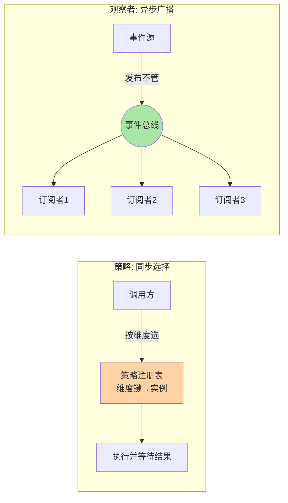
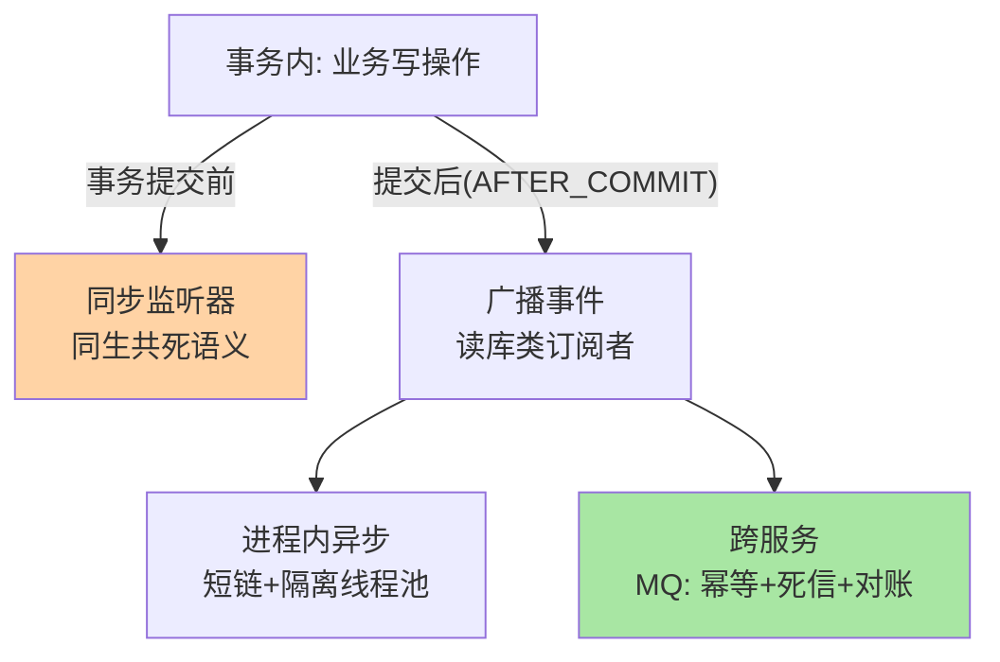
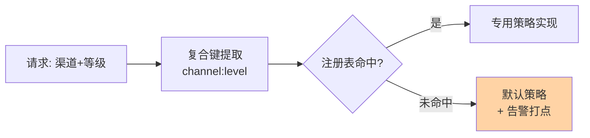

# 策略与观察者：分支消除与事件解耦的正道与滥用边界

> 策略与观察者是业务代码出场率最高的两个行为型模式——一个消除「怎么做」的分支，一个解耦「谁知道」的通知。它们同源（都是多态替换硬编码），走向两个方向：策略管「可选动作的切换」，观察者管「动作结果的广播」。本篇拆两者的机制、工程化写法（策略注册表 / 事件总线）、失控信号与治理。

> **本文核心**：两者的机制本质都是「用接口多态替换硬编码依赖」，分界在**控制流方向**——策略是同步调用（调用方主动选择并等待结果），观察者是反向控制（被通知方被动响应，调用方不等待不关心）。策略的失控形态是「类数量膨胀 + 选择逻辑转移」，观察者的失控形态是「事件链不可控 + 执行顺序隐式」——两者的治理都靠把隐式的东西显式化：选择逻辑进注册表，订阅关系进声明清单。

## 一句话摘要

策略模式把「同一件事的多种做法」封装成实现同一接口的可替换算法族，调用方持上下文引用策略接口；工程化形态是「策略注册表」——启动期把「维度键 → 策略实例」注册进 Map，运行期按业务维度 O(1) 选取。观察者模式把「事件发生后谁需要知道」从事件源代码里剥离：事件源只发布事件，订阅者各自注册回调；同步形态是进程内监听器列表遍历，异步形态演进为事件总线与消息中间件。两者常被并列讨论，因为都消 if-else——但策略是「选择后同步执行」，观察者是「发布后不管」，**控制流方向决定它们解决的是两类问题，也各自长出不同的失控方式**。

## 🎯 本文核心（机制坐标）



## 一、源码关键路径：策略注册表的工程化写法

```java
// 声明: 每个策略自注册, 新增=新增一个类
@Component
public class AlipayHandler implements PayChannelHandler {
    @PostConstruct
    public void register() {
        PayChannelRegistry.register(Channel.ALIPAY, this);
    }
    public PayResult pay(PayRequest req) { /* 渠道逻辑 */ }
}

// 使用: 调用方零分支
PayChannelHandler h = PayChannelRegistry.get(req.getChannel());
PayResult r = h.pay(req);   // 未注册渠道在 get 处显式失败,不静默
```

三条工程纪律：①注册表带**启动期校验**（重复注册抛异常、必选维度缺失打告警）——装配错误在启动期炸不在线上飘；②未注册键的失败要**显式**（抛业务异常或走显式 fallback 策略），禁止返回 null 让 NPE 延迟到调用深处；③策略实现**无状态**（参数从请求带入），有状态的策略在并发下是隐蔽事故源。Spring 生态的惯用变体：注入 `List<PayChannelHandler>` 后在聚合类构造器里自建 Map——注册表不新建全局静态，收进容器管理。

## 二、观察者的两种形态与各自的坑

**同步观察者**（进程内监听器列表）：发布即遍历调用。坑在三点——执行顺序隐式（注册序 = 执行序，重构即变）；一个订阅者抛异常中断整条链（Spring 事件默认行为，需 try-per-listener 或统一异常策略）；事务语义混乱（发布者在事务内，订阅者读不到未提交写入——事件在事务提交后发是硬纪律）。

**异步观察者**（事件总线 / MQ）：发布后进入队列或直接投递，订阅者各自消费。它解决同步形态的顺序与异常传染问题，引入新问题：**投递语义**（至少一次 → 订阅者必须幂等）与**延迟可见性**（订阅者看到事件的时间不可控，依赖「刚发布就能查到」的代码全是隐患）。进程内异步（Spring @Async / EventBus）与跨服务 MQ 的分界线：**一致性诉求跨不跨进程**——跨进程就走 MQ，别用进程内总线假装分布式事件。

观察者的事务边界与分层处置：



## 三、与工厂模式、消息队列的区别辨析

| 维度 | 策略 | 观察者（进程内） | 消息队列（跨服务） |
|---|---|---|---|
| 控制流 | 同步选择执行 | 同步/异步遍历 | 异步投递 |
| 耦合对象 | 接口（调用方知道策略存在） | 事件（订阅者知道事件类型） | Topic（完全解耦） |
| 失败传播 | 直接抛给调用方 | 链上传染（可隔离） | 重试/死信自持 |
| 一致性 | 强（同事务） | 发布者事务内 | 最终一致 |

判别口诀：**同进程选实现用策略，同进程广播用观察者，跨进程一切走 MQ**。把观察者当 MQ 用（跨服务语义用进程内总线）是最常见的架构错位。

策略注册表的维度复合形态（键组合可控时）：



复合键的纪律：组合维度要有「默认策略」兜底（新组合出现不炸）；键组合数量有预算（每加一个维度先算乘积），组合爆炸前先做维度正交化——两个单维策略表优于一个笛卡尔积策略表。

## 四、典型使用场景

- **渠道路由**：支付/推送/存储渠道按维度选实现（策略），业务迭代只加策略类
- **订单状态联动**：状态变更后积分、通知、风控各自响应（观察者），状态机不认识任何下游
- **审批流/风控规则**：规则即策略，规则集按配置装载（策略 + 注册表 + 配置中心）
- **领域事件**：聚合变更发布事件，跨模块订阅消解模块间直接依赖（观察者的 DDD 形态）

## 五、事故叙事两则

**叙事一：策略表缺注册校验，新渠道静默走 fallback。**某推送系统策略注册表没有启动校验，新渠道实现类的 @PostConstruct 因前置 Bean 初始化失败未执行——注册表里没有这个渠道，运行期全部走默认短信通道，用户收到错渠道的通知持续两小时，靠客服反馈才发现。修复：注册表启动期校验「配置声明的渠道必须有注册实现」，缺一个启动即失败。复盘沉淀：**注册完整性必须启动期验证**——「配置说有、注册表没有」的落差是策略体系的头号静默故障。

**叙事二：同步事件链上一个监听器拖垮下单。**订单创建的同步事件链上挂了七个监听器（积分、通知、风控、统计……），某个统计监听器改为同步调外部服务后，下单接口 P99 从 80ms 涨到 1.2s——事件链是串行的，一个慢全链慢。修复：统计类监听器改异步 + 隔离线程池；同步链只保留「必须同事务完成」的两个。复盘沉淀：**同步观察者链是隐式的串行调用链**，链上成员要按「是否必须同步完成」年度审计一次，杂物件全部外迁。

## 六、追问链：把「消除 if-else」问穿一层

- **追问一：策略表消掉了调用方的分支，分支去哪了？**——转移到注册与选择机制里：维度键的提取（从请求里抽渠道键）仍是显式代码，维度的**组合爆炸**还会以「复合键策略」形态回来（渠道 × 用户等级 = 键组合数量翻倍）。策略消除的是「选择的书写」，不消除「选择的维度设计」——维度设计错了（键粒度不对），策略表只是把乱码装箱。
- **再追问：两个分支也抽象成策略吗？**——不算成本账的策略抽象是伪洁癖：抽象的成本是「实现跳转两跳 + 注册机制一套」，收益是「新增不改动」。分支数量稳定且语义清晰时，if-else 的直读性是正资产；**分支清单开始高频变更**才是策略化的启动信号——变更频率是唯一可信的判据。
- **打破砂锅：观察者模式是不是就是 MQ 的思想源头？**——是，且这条演化链值得看清：观察者（同步、进程内、强耦合时序）→ 事件总线（异步、进程内）→ 消息中间件（异步、跨进程、持久化、投递语义）。每一跳都在解上一跳的失控（顺序传染 → 时序耦合 → 跨进程不可靠）。理解演化链，就理解「我现在这个规模该停在哪一跳」——不是越靠右越先进。

## 七、反方案分析：不抽象的替代与过度抽象的回退

- **为什么「分支 + 注释」有时更好**：两个分支、变更频率年度级的场景，直读分支的维护成本低于「跳两跳找策略实现」——抽象必须由变更频率付账
- **为什么回退也是选项**：发现策略类 80% 是「每个类三行、永不新增」时，合并成配置表（Map<维度, 参数>）比保留类结构诚实——**策略封装的是行为变化，参数变化用参数表**，把行为变化误判成参数变化（或反之）是抽象方向错误
- **为什么观察者链要设上限**：事件驱动的扩展惯性会让监听器无限生长，「谁在听这个事件」逐渐无人能答。治理硬线：单事件订阅者超过阈值（业内常见 5-10 个）必须出「订阅清单 + 职责说明」并评审——**订阅关系是资产，要盘点不是放养**

## 八、设计思想：隐式知识的显式化

两个模式的失控都源于**知识隐式化**：策略的选择知识散在调用分支里，观察者的订阅知识散在注册调用里。工程化的正道就是把它们重新显式化——注册表让选择知识集中可校验，订阅清单让广播知识集中可盘点。这条思想在架构域反复出现——从方法内的分支治理到跨系统的事件契约，粒度在变、原则不变：配置中心显式化「参数知识」、链路追踪显式化「调用知识」、事件契约显式化「schema 知识」。**模式本身不产生好架构，「隐式知识显式化并加以治理」才是**——模式只是这次显式化的抓手之一。

## 九、不同量级的思考：从方法内分支到事件生态

- **十万级 QPS 以下**：约束来源是可读性——方法内分支或简单策略表即可，观察者用 Spring 事件同步形态足够。这一档的核心问题是「分支与订阅是否清晰」，而不是「扩展机制是否完备」
- **百万级 QPS / 模块化**：约束来源是模块边界与链路长度——策略跨模块分发（各模块自注册），观察者按「必须同步 / 可异步」拆链，异步监听器隔离线程池防传染。这一档的核心问题是「链上成员的同步属性审计」，解法是订阅清单 + 年度审查
- **千万级 QPS / 跨服务**：约束来源是一致性与治理——进程内事件升级为领域事件走 MQ（幂等、死信、对账全套配齐，互指事件驱动系列），策略选择带健康度反馈成为动态路由。这一档的核心问题是「事件的契约与治理」，事件从实现细节升格为公共契约

**自下而上与触发升级**：先测分支变更频率与链路耗时占比，决定当前档位；触发升级的信号是「新增维度要改多处」「同步链 P99 被监听器拉长」「跨模块实现开始互相 import」——约束从可读性迁到链路治理再迁到契约治理，机制跟着换挡。

## 十、业内惯例

- Spring 事件机制的惯例：领域事件用 ApplicationEventPublisher 发布、@TransactionalEventListener(AFTER_COMMIT) 保证「提交后可见」——这是「事务内不发事件」纪律的框架化表达
- 策略注册表的框架化：Spring 注入 List 接口收集全部实现 + 构造器建 Map，避免自造全局静态注册表（测试与容器语义更干净）
- 事件命名与 schema 治理进团队规范：过去式命名、版本化、只加不改——事件从「进程内通知」升级为「契约」时，纪律随升级

## 你们可能会问

**Q1：策略模式和「多态」有什么区别？多态本身不就消除了分支吗？**
多态是语言机制（调用哪个实现由对象类型决定），策略模式是设计决策（把「选哪个实现」从调用方剥离成可注册可配置的机制）。没有策略机制的多态，选择逻辑仍散在调用方——模式的价值在机制化选择，不在多态本身。

**Q2：同步观察者的事务到底应该「事务内发」还是「提交后发」？**
按订阅者的诉求拆：读库类订阅者必须「提交后」（否则读不到写入）；与主操作同生共死的订阅者「事务内」（同回滚）。两种共存时发两次（事务内发同步事件 + 提交后发广播事件）并把语义写进事件类型名——语义混在一个事件里是事故之源。

**Q3：事件链排查困难，有什么工程手段？**
最小三件：事件 ID 贯穿全链路日志（发布与消费带同一 trace）；订阅清单自动化导出（启动期扫描注册表生成文档）；每个订阅者的耗时与失败率单独打点——三件齐了，事件链从「不可知」变「可盘点」。

## 十一、什么时候用 / 不用

- ✅ 策略：同维度的实现 ≥3 个且持续新增、选择维度清晰、实现无状态
- ✅ 观察者：一个变更确有多方关心、下游可异步、模块间不希望直接依赖
- ❌ 不用策略：分支 ≤2 且稳定、实现有重状态——直写分支更诚实
- ❌ 不用观察者：下游必须同步完成且就一两个——直接调用，别为了「解耦」把同步语义拆散
- ❌ 不跨级使用：跨服务诉求不上进程内总线，进程内小事不上 MQ——各回各的层级

## Trade-off：扩展自由与系统可知性的交换

策略与观察者都在买「扩展不用改核心」的自由，支付的是**系统可知性**：策略表多了「这个请求为什么走这条实现」要查注册日志，观察者多了「这个事件到底谁在听」要查订阅清单。**自由度与可知性此消彼长，治理件（注册校验、订阅清单、链路追踪）就是买自由的对价**。评估时把治理件算进成本——不算的团队会在半年后用故障补课。

## 开放问题

- 响应式流（Reactor 等）把观察者的「背压」问题带进进程内事件——订阅者处理不过来时的反压策略成为事件 API 设计的新维度
- 策略选择与配置中心/特性开关平台融合，「运行期改变选择逻辑」从代码发布降级为配置变更——策略的灰度与回滚语义进入工程视野

## 💡 实战提示

- 💡 策略注册表启动期校验完整性：配置声明的维度必须有实现，缺一个启动即失败
- 💡 策略实现无状态：状态从请求带入——有状态策略在并发下是隐蔽事故源
- 💡 同步观察者链年度审计一次：按「是否必须同步完成」分类，杂物件迁异步
- 💡 事务内不发广播事件：提交后发，或用 AFTER_COMMIT 监听器——订阅者读不到未提交写入
- 💡 事件 ID 贯穿 + 订阅清单自动导出——事件链可盘点才有治理起点

### 策略与观察者的组合形态

两者常组合成「事件驱动 + 策略路由」的完整形态：事件发布（观察者）后，监听器内部按维度选处理策略（策略）——领域事件的处理器路由就是典型。组合时的分界纪律：事件的「订阅关系」与「处理策略」是两份独立资产，各自有清单与治理（订阅清单管谁在听，策略注册表管怎么处理），混在一张表里会让「取消订阅」和「下线策略」两种变更互相误伤。组合形态的正确画法：事件总线层只关心订阅，监听器内部才是策略选择的地盘——**层级分清，资产分治**。

## 自测三问

1. 策略与观察者的控制流方向差异是什么？各解决什么问题？
2. 策略注册表的三条工程纪律是什么？缺校验的典型事故是什么？
3. 同步观察者的事务纪律为什么是「提交后发」？什么时候例外？

## 🎯 核心带走

- **核心一句话**：策略管同步选择、观察者管反向广播——同源（多态替换硬编码）不同向（控制流方向分界），治理靠隐式知识显式化（注册表 + 订阅清单）
- **工程形态**：策略注册表（启动校验 + 显式失败）／观察者分层（同步短链 + 异步隔离 + 跨服务走 MQ）
- **哪里会坏**：注册缺失静默 fallback、慢监听器拖垮同步链、事务内发事件读不到、复合维度键爆炸
- **边界**：分支数量与变更频率决定要不要抽象；进程内与跨进程是硬分界
- **量级迁移**：十万级问清晰、百万级问链路审计、千万级问契约治理

### 事件溯源视角的观察者终态

观察者的演化终点是事件溯源（互指事件驱动系列篇 4）：事件从「通知」升格为「事实存储」，订阅变成「投影」——事件链的顺序、重放、审计问题在范式层一次解决。这个终态的价格是整套事件存储基建，普通业务不需要走到；但它标记了方向——**当事件链治理成本逼近事件存储成本时，升级范式比继续打补丁划算**。识别信号：订阅者开始各自维护「事件副本表」、事件补偿脚本多于业务代码、审计要求开始逐个事件倒查——三条中两条，就该认真评估范式升级了。

### 监听器异常隔离的三种策略

同步观察者链上单个监听器抛异常的处置，按业务语义三选一：①**隔离策略**（每个监听器独立 try，失败记日志不影响后续）——默认推荐，广播语义本就是「各自消化」；②**中断策略**（异常上抛终止链）——只在链上监听器有「必须全部成功」的一致性诉求时用，且要配套补偿；③**聚合策略**（收集全部异常统一上报）——批处理场景友好，调用方拿全量失败清单。默认值选隔离是行业收敛（Spring 事件的 multcaster 可配置），但「默认隔离」不等于「异常可以吞」——每个监听器的失败必须有独立打点与告警，否则隔离变成静默丢失，排查时链路上「少了一个监听器的效果」无处可查。**隔离保可用，打点保可知**，两者必须成对出现。

## 📌 数据与事实声明

- 写于 2026-09-15；Spring 事件机制语义以官方文档公开口径为准
- 事故叙事为业内高频缺陷模式的匿名化叙事，非特定公司事件
- 免责：框架行为以对应版本文档为准

## 📚 参考资料

| 类型 | 标题 | 来源 |
|---|---|---|
| 经典书 | GoF《设计模式》（Strategy / Observer 章） | 公开出版 |
| 官方文档 | Spring Framework Core（事件与 @TransactionalEventListener） | docs.spring.io |
| 系列内 | 0_系列导读 | 本目录 |
| 关联系列 | 工厂模式（策略的装配与事件驱动系列（观察者的跨服务形态） | 特性层同目录 / 事件驱动系列 |
