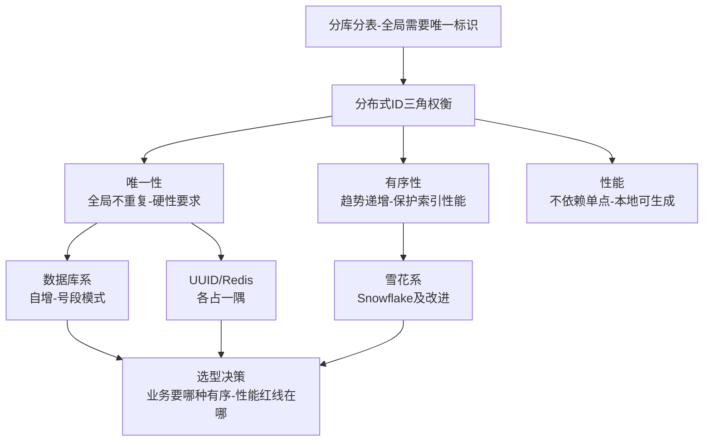
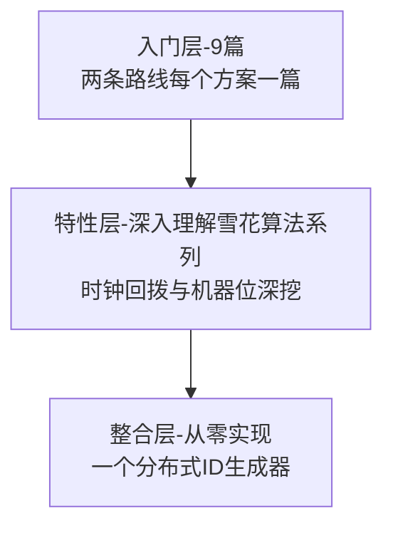

# 分布式 ID 系列导读 · 唯一性与有序性的权衡

> 📖 本系列共 9 篇（0_导读 + 8 正文），覆盖分布式 ID 整个知识面：认知与问题域、数据库系（自增/号段）、雪花系（Snowflake 及改进）、选型与订单号实战。
> 本篇是第 0 篇导读：先建立「唯一性 + 有序性 + 性能三角权衡」的心智模型，再决定读哪条路。

## 一、为什么需要这套系列

分库分表之后，「一个数据库说了算」的自增主键失效了：两个库各自从 1 开始编号，全局就重了。分布式 ID 是所有拆分场景的第一块基石——订单号、流水号、消息 ID、traceId，全部依赖它。但学分布式 ID 常见两种极端：

- **只背结论**：「用雪花算法」，但回答不了「时钟回拨了怎么办、机器 ID 怎么分配」——上线后第一次时钟漂移就翻车
- **忽略有序性**：「UUID 全球唯一」，但不知道无序主键在 InnoDB 聚簇索引下造成的页分裂，写放大到怀疑人生

这套系列的设计思路：**先建立「唯一性 / 有序性 / 性能」三角权衡的心智模型，再按「数据库系 → 雪花系」两条技术路线逐个拆解**。主线是「鱼与熊掌的取舍」，支线是每条路线的具体方案。先会「看清权衡」，再会「选对方案」，最后会「设计一套生产可用的订单号规则」。

## 二、全局心智模型：三角权衡

理解这个模型的三个要点：

1. **唯一性是底线，有序性是性能**：所有方案都满足唯一性，差别在有序性——InnoDB 主键有序则顺序写页（快），无序则随机插入频繁页分裂（慢）。趋势递增是「对索引友好的折中」，严格递增是「号段模式的特长但牺牲可用性」。
2. **两条路线对应两种哲学**：数据库系（自增/号段）「集中发号、严格有序」，依赖 DB 但实现简单；雪花系（Snowflake）「本地生成、高性能」，不依赖外部但要处理时钟回拨。没有绝对赢家，只有业务匹配。
3. **ID 是信息泄露的暗门**：连续自增的订单号会暴露业务量（今天比昨天多了 3 万单），对外 ID 要么加密、要么用无规律方案——「信息安全」是三角之外的第四个隐藏维度。

> tips：(有序性即索引性能) 分布式 ID 为什么执着于「趋势递增」？InnoDB 聚簇索引按主键物理排序存储：递增主键永远追加到 B+ 树最右侧页（顺序写、页写满才开新页）；随机主键（UUID）每次都插到随机位置（页分裂、缓存命中率暴跌）。这就是「UUID 不适合做 InnoDB 主键」的根本原因，也是雪花算法存在的理由。

## 三、系列导航表（9 篇）

| 序号 | 篇目 | 深度 | 一句话定位 | 对标参考 |
|---|---|---|---|---|
| 0 | 系列导读 | 全景 | 三角权衡心智模型 + 阅读路径 | - |
| 1 | 分布式 ID 是什么与为什么需要 | 入门 | 单机自增失效 → 全局唯一 + 趋势递增 + 信息安全 | 凤凰架构 |
| 2 | 分布式 ID 方案全景 | 入门 | UUID/自增/号段/雪花/Redis 全谱系 | 凤凰架构 |
| 3 | 数据库自增 ID | 入门 | 单库自增、多库自增步长、性能瓶颈 | MySQL 文档 |
| 4 | 号段模式 | 入门 | 号段分配、双 buffer、Leaf segment 思想 | 美团技术博客 |
| 5 | 雪花算法原理 | 入门 | 64 位结构、时间戳+机器位+序列位、时钟回拨 | Snowflake 源码 |
| 6 | 雪花算法改进 | 入门 | Leaf snowflake、UidGenerator 的时间回拨与机器位处理 | 百度 UidGenerator |
| 7 | 分布式 ID 选型决策 | 入门 | 唯一性/有序性/性能/长度/信息泄露决策树 | 综合应用 |
| 8 | 订单号流水号设计实战 | 入门 | 金融订单号/流水号的规则设计与脱敏 | 综合应用 |

## 四、从点到面：进阶路径

| 层级 | 定位 | 规模 | 适合 |
|---|---|---|---|
| 入门层 | 点：每个方案一篇，建立完整认知 | 9 篇 | 所有读者必读 |
| 特性层 | 点 × 深：雪花算法时钟回拨/机器位拆到实现级 | 1 个子系列 | 要自研发号器 |
| 整合层 | 体系：从零实现号段 + 雪花双模式 | 1 个 demo | 动手派 |

> 本系列没有专题层：分布式 ID 的「面」就是选型决策（入门层第 7 篇已覆盖），不像事务/缓存那样有独立的组合场景。

## 五、入门读者最容易踩的 3 个认知误区

### 误区 1：以为 UUID 是「万金油」

UUID 确实全球唯一、生成零依赖，但代价常被忽略：128 位太长（索引空间浪费）、完全无序（InnoDB 页分裂，写性能暴跌）、无业务含义。UUID 适合「只要唯一不要有序」的场景（traceId、幂等键），不适合做数据库主键。「简单方案」和「正确方案」不是一回事。

### 误区 2：以为雪花算法「拿来就用」

雪花算法的原版实现有几个生产级坑：时钟回拨（NTP 校准往回调就重复发号）、机器 ID 分配（手工分配在千节点集群必然出错）、时间戳依赖（系统时间被改就乱套）。原版 Snowflake 已归档停更，生产落地都要改造——Leaf 加了 rpc 兜底时钟、UidGenerator 加了历史未来时间处理。第 5-6 篇专门拆这些坑，「知道坑在哪」比「记住 64 位结构」更重要。

### 误区 3：以为号段模式「有了双 buffer 就高枕无忧」

号段模式（数据库批量发号 + 双 buffer 预加载）把 DB 访问从每次发号降为每次号段用尽，性能很好。但它仍是「集中式」的：DB 挂了（或主从延迟）发号就停、扩容迁移时号段边界要对齐、重启用号段会有「跳号」。跳号对订单号无害（业务只要求唯一），对「要连续的流水」是致命的——第 4 篇会讲清楚哪些业务不能接受跳号。

> tips：(路线判断) 选型的第一个分叉不是「哪个算法」，而是「能不能接受趋势递增（非严格）」：能 → 雪花系（性能最优）；要严格递增 → 号段系（接受集中式依赖）。这个分叉定了，剩下的都是细节。

## 六、怎么读这套系列

- **零基础/刚入行**：从 0 按顺序读到 8，每天 2 篇，几天建立完整认知
- **在做分库分表**：重点读 4（号段）、5-6（雪花及改进）、7（选型）——直接对应「给分表定主键策略」的日常场景
- **金融/订单场景**：第 8 篇「订单号流水号设计实战」是收束篇——规则设计 + 信息脱敏（订单号不暴露业务量），配合第 7 篇选型直接落地

---

下一篇将讲 **1_分布式 ID 是什么与为什么需要**：从「分库之后主键撞了」说起，全局唯一、趋势递增、信息安全三个诉求怎么来的——待正文落盘后补链接。
