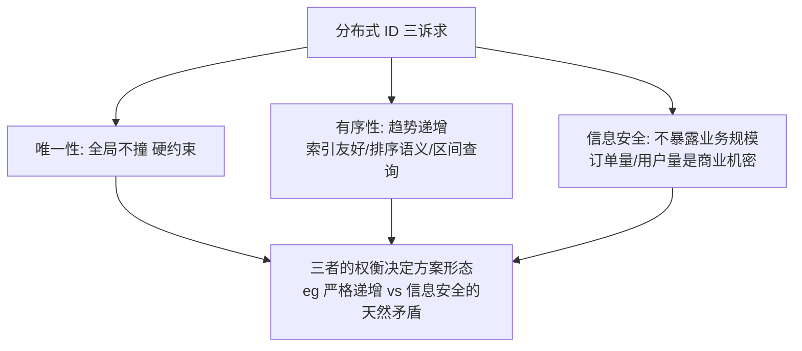

# 分布式 ID 是什么与为什么需要

> **一句话摘要**：分布式 ID 是多节点环境下给每条数据发「全球唯一身份证」的机制——单机自增主键在分库分表后失效（两个库都从 1 开始），分布式 ID 用「唯一性 + 趋势递增 + 信息安全」三项诉求重新定义这个老问题；它是分库分表、异步链路、跨服务数据关联的地基组件。

> **本文核心**：机制链一句话——**分库分表打碎「单一自增计数器」→ 唯一性必须由算法/服务重建 → 重建时连带出有序性（索引友好）与安全性（不泄露规模）两个新约束** → 三诉求的权衡决定一切方案形态。全系列 8 篇就是这三诉求在不同方案里的取舍史。

前置阅读：[分布式理论系列](../../../distributed-theory/入门层/从零开始认识分布式理论系列/1_分布式系统是什么与为什么难-入门.md)。分库分表为什么拆，工程侧见[分布式系统设计系列](../../../distributed-system-design/入门层/从零开始认识分布式系统设计系列/8_高扩展设计-入门.md)。

## 1. 背景：单机自增为什么到分布式就失效

单机数据库的自增主键是个完美的 ID：唯一、递增、短、连续——数据库替你管了一切。它成立的前提只有一个：**全世界只有一个计数器**。分库分表之后：

- **两个库各自从 1 开始**——订单 1 在 A 库、订单 1 也在 B 库，主键冲突（唯一性失效）；
- **跨库排序失义**——A 库的第 100 号可能比 B 库的第 5 号晚创建，「按 ID 排序」不再等于「按时间排序」（有序性失效）；
- **迁移与合并噩梦**——两个业务线合并数据，ID 撞了无法合并。

「给每条数据发全球唯一 ID」从数据库的免费赠品，变成了应用层必须自建的组件——分布式 ID。

## 2. 核心机制：三诉求与它们的冲突

三诉求逐条说透（以及它们为什么互相打架）：

- **唯一性（硬约束）**：撞了就是资损或数据覆盖，没有商量余地。实现路径两条——「集中发号」（一台 DB/服务发号，天然唯一但有瓶颈）或「本地算法」（UUID/雪花，各节点自己算，唯一性由空间划分保证）。
- **有序性（趋势递增）**：为什么排序这么重要？三个工程理由——① **B+ 树友好**：自增 ID 顺序插入不分裂页，随机 ID（UUID）导致页分裂与写放大（MySQL 主键用随机值，写入性能差数倍是常见量级认知）；② **排序语义**：「按 ID 排序 ≈ 按时间排序」是大量业务查询的隐含假设；③ **区间查询**：按时间段的 ID 范围扫描。注意诉求是「趋势递增」不是「严格连续」——连续在分布式下代价极高（要全局同步），趋势（大体递增、偶有回退）就够。
- **信息安全**：连续自增的订单号会把业务规模裸奔给外界——竞对下单两次就知道你的日单量；遍历 ID 可以爬全量数据。所以对外暴露的 ID 往往要「无规律」（加密/扰动）——这与「有序」天然矛盾：**内部 ID 要有序，对外 ID 要无序**，两者常是两个 ID。

追问链（为什么这么设计）：**为什么不用 UUID 一劳永逸？**——唯一性满分，但无序（索引差）+ 太长（128 位）+ 无业务语义；**为什么不用「时间戳就够」？**——同一毫秒多个请求撞车（缺序列空间），且时钟会回拨（见[分布式时钟篇](../../../distributed-theory/入门层/从零开始认识分布式理论系列/9_分布式时钟-入门.md)）；**为什么趋势递增比严格递增好接受？**——严格连续要求全局锁步，性能崩塌，业务上「大体有序」已满足排序与索引需求。

## 3. 落地实践：评估你的 ID 需求

接入任何 ID 方案前，先答四问：

1. **QPS 量级**：百级（数据库发号都够）还是十万级（必须本地算法）？
2. **有序性要求**：主键插入性能敏感吗？业务依赖「按 ID 排序」吗？
3. **暴露面**：这个 ID 会出现在 URL/对外接口吗？（会 → 信息安全要求入场）
4. **长度与类型约束**：数据库列类型（BIGINT？）、下游系统（老接口只吃数字？）、前端 JS 精度（超过 2^53 的 Long 会丢精度——雪花 ID 直传前端的经典坑）。

四问答案组合基本锁定候选方案（下一篇全景图）。

## 4. 生产视角：ID 出问题的形态

- **前端精度丢失**：雪花 ID（64 位长整型）直传 JSON，JS 的 Number 只有 53 位精度——末尾几位变 0，用户看到的订单号与库里不一致，「查无此单」。行业惯例：对外序列化成字符串。
- **撞号事故**：自研发号服务的机器位分配错误（两台实例同 machineId）——雪花 ID 撞号，数据互相覆盖。机器位分配与心跳校验是发号服务的命门（雪花篇细讲）。
- **ID 泄露规模**：连续订单号被竞对用来监控日单量，或遍历爬取——安全审计里「ID 可枚举」是常见发现项。内外双 ID（内部有序、对外加密映射）是标准防御。
- **发号服务故障的全站瘫痪**：所有业务依赖一个发号服务，它挂了全站不能下单——发号服务的可用性设计（缓存号段/本地降级）是号段模式的核心议题（号段篇细讲）。

## 5. 主流方案怎么做：谱系预览

| 谱系 | 代表 | 一句话机制 | 主代价 |
|---|---|---|---|
| 通用算法 | UUID | 128 位随机/时间戳组合，本地生成 | 无序、太长、字符串 |
| 数据库系 | 自增/号段（美团 Leaf segment） | DB 发号/批量取号段到内存 | 依赖 DB、发号服务可用性 |
| 雪花系 | Snowflake/Leaf snowflake/百度 UidGenerator | 时间戳+机器位+序列位本地拼装 | 时钟回拨、机器位管理 |
| 中间件系 | Redis INCR/ MongoDB ObjectId | 中间件原子计数/内建 ObjectId | 依赖中间件可用性 |

全谱系的机制对比与选型是下一篇的主题；各方案的深水区（步长划分/双 buffer/回拨防护）在组 2、组 3 展开。

## 6. 典型场景

- **订单主键**（交易级）：分库分表后的主键——唯一 + 趋势递增（索引友好）+ 内外双 ID（对外脱敏）。
- **链路追踪 TraceID**（观测级）：跨服务串联一次请求——唯一即可，无序可接受（UUID/雪花皆常见）。
- **对外业务单号**（安全级）：面向用户的订单号/流水号——无规律、带校验位、可读性好（订单号实战篇专讲，它常是「另一个 ID」）。

## 7. 与相邻概念的区别

- **分布式 ID vs 主键**：主键是数据库行标识（本地概念）；分布式 ID 是跨库全局标识——分库后主键 ≈ 分布式 ID，但「对外 ID」与「主键」常分离。
- **分布式 ID vs 业务单号**：ID 是技术标识（机器友好）；单号是对外业务凭证（人类友好 + 防伪）——订单号实战篇专讲两者的分离设计。
- **趋势递增 vs 严格递增**：趋势 = 大体递增容忍回退（雪花跨节点）；严格 = 全局连续（需集中发号）——性能差一个量级，业务多数只需趋势。
- **本组件 vs 分布式时钟**：雪花算法内嵌时间戳——时钟回拨直接威胁 ID 唯一性，是分布式时钟问题在 ID 域的投影（时钟篇的回拨纪律在此具象化）。

## 8. 常见误区与不适用

- **「唯一性是唯一重要的」**：把 UUID 当万能解——索引写放大、排序失效、长度膨胀三个账都没算。唯一是底线，有序与安全决定体验与成本。
- **「趋势递增 = 连续」**：为连续性上集中发号的重架构，业务其实只按 ID 排序——先问「连续给谁看」，多数场景趋势即可。
- **「ID 就是主键，一个 ID 走天下」**：内部主键（有序）与对外凭证（无序防枚举）混用——ID 泄露规模的根源；内外分离是安全基线。
- **「Long 传前端没问题」**：JS 精度陷阱（>2^53 丢精度）——序列化字符串是跨团队共识级惯例，新项目第一天就该做。
- **不适用**：单库小系统（自增足矣，别为想象中的分库上发号架构）；一次性临时数据（UUID 最省事，无需权衡）。

## 9. 你们可能会问

- **UUID 的版本怎么选（v4 随机 / v7 时间有序）？** v4 随机无序（索引差）；v7（2024 进标准）时间前缀有序——新系统若选 UUID 路线，v7 明显优于 v4；存量 v4 的索引代价在超大表才显著。
- **为什么大厂都自研发号服务而不直接用 UUID？** 核心是「有序 + 短 + 业务语义」三件事 UUID 给不了，且发号服务可顺带承载业务规则（分片路由位等）。
- **雪花 ID 的 41 位时间戳用完了怎么办（69 年）？** 惯例：自定义纪元（起始时间往后挪）、或预留位扩展——69 年是设计冗余，真实风险是时钟回拨不是用完。
- **ID 生成应该在应用层还是数据库层？** 应用层（雪花/号段客户端）主流——数据库层发号（自增/序列）有性能与耦合天花板；判断标尺是 QPS 与分库形态。
- **怎么向业务方解释「内外双 ID」的成本？** 一句话：内部 ID 保性能，对外 ID 保安全，映射表保两者兼得——成本是一张映射与一次查询，收益是规模不泄露 + 防遍历。

## 10. 一句话总结 + 5W 速记卡 + 自测三问

**🎯 核心带走**：

- **核心一句话**：分布式 ID = 分库打碎单一计数器后，用「唯一性 × 趋势递增 × 信息安全」三诉求重建发号机制。
- **链条复述**：分库 → 唯一性失效 → 重建（集中发号 or 本地算法）→ 连带有序性与安全约束 → 三诉求权衡定方案。
- **失效点与边界**：单库不需要；「内外双 ID」是安全基线不是可选优化；Long 传前端必踩精度坑。

**5W 速记卡**：

| 维度 | 内容 |
|---|---|
| What | 全局唯一标识 + 三诉求（唯一/趋势递增/安全） |
| Why | 分库分表使单机自增失效 |
| When | 分库立项、新数据实体设计、对外 ID 暴露评审 |
| Where | 主键、TraceID、对外单号 |
| How | 四问评估（QPS/有序/暴露/长度）→ 锁定候选方案 |

💡 **实战提示**：Long 序列化字符串进前端；内外双 ID 防枚举；机器位分配留心跳校验；先答四问再看方案。

**开放问题**：如果 NewSQL（内置全局有序主键）普及，「应用层发号」的整个组件域会被存储层收编吗——还有哪些场景必须应用层自持？

**决策（何时用）**：分库分表/跨服务标识推荐接入本系列方案谱系；单库推荐留在自增；推荐「四问评估」固化为新实体设计 checklist。

**Trade-off（代价与反方案）**：自建 ID 体系用「组件复杂度」换「有序 + 安全 + 可扩展」；反方案——不拆库（保自增，代价是扩展上限）、UUID 硬扛（保简单，代价是索引与安全）、外部发号服务（保省心，代价是可用性依赖与第三方绑定）。

**演进视角**：从数据库自增（单机时代）到 UUID（早期微服务）到雪花家族（Leaf/UidGenerator 工程化）再到 v7 UUID 进标准（2024）——「有序性」的价值随数据量增长被反复重估，趋势十年未变。

---

**下篇预告**：全景地图——下一篇[分布式 ID 方案全景](./2_分布式ID方案全景-入门.md)把 UUID/自增/号段/雪花/Redis 一次看全。

---

## 📌 数据与事实声明

本文三诉求框架与失效场景为分布式 ID 领域公开共识（美团 Leaf、百度 UidGenerator 技术文章的机制级概括）；UUID v7 标准（2024，RFC 9562）为公开标准；JS 精度、索引写放大为业内通用认知量级。以官方文档与基准实测为准。

## 📚 参考资料

| 类型 | 标题 | 来源 |
|---|---|---|
| 文章 | Leaf——美团点评分布式 ID 生成系统 | tech.meituan.com |
| 文章 | 百度 UidGenerator | github.com/baidu/uid-generator |
| 标准 | RFC 9562（UUID 版本含 v7） | ietf.org |
| 图书 | 数据密集型应用系统设计（DDIA）第 9 章 | O'Reilly（2017 中译） |
