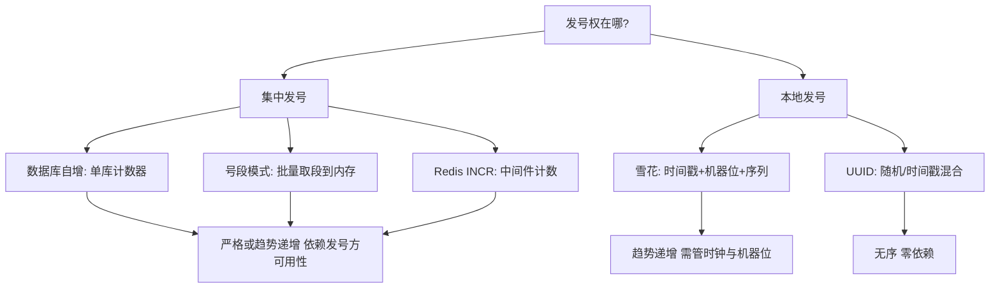
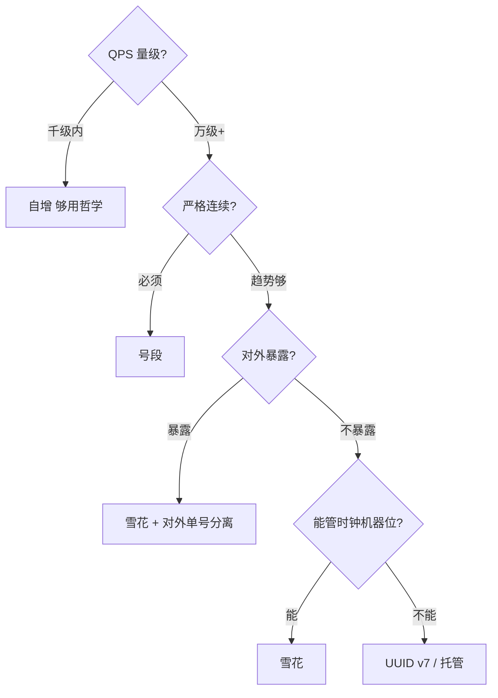

# 分布式 ID 方案全景

> **一句话摘要**：所有分布式 ID 方案都在「**性能 × 有序性 × 依赖度**」谱系上取点——UUID 本地生成零依赖但无序；数据库系（自增/号段）严格有序但要扛发号压力；雪花系趋势递增高性能但要管时钟与机器位；本篇是全系列的总地图，组 2/组 3 再进深水区。

> **本文核心**：机制链 = **发号权在哪（集中 vs 本地）× 有序性怎么来（计数器 vs 时间戳）**两个正交决策，导出全部方案形态——集中+计数器=数据库自增、集中+批量=号段、本地+时间戳=雪花、本地+随机=UUID；选型 = 先选发号权，再选有序来源。

前置阅读：[分布式 ID 是什么与为什么需要](./1_分布式ID是什么与为什么需要-入门.md)。各方案深水区见组 2（自增/号段）与组 3（雪花/改进）。

## 1. 背景：方案为什么长成这几类

按「发号权在哪」分两大阵营：**集中发号**（DB/Redis/发号服务统一发，天然唯一、天然有序、天然是瓶颈）与**本地发号**（各节点自己算，无瓶颈、无依赖，但要自己解决唯一性）。再按「有序性来源」细分：计数器（严格递增）vs 时间戳（趋势递增）vs 随机（无序）。两个决策的笛卡尔积，就是方案全景图——理解了生成逻辑，不需要背方案。

## 2. 核心机制：全景图与五方案对照

五方案四维对照（性能/有序/依赖/信息安全的速查）：

| 方案 | 性能（单实例量级） | 有序性 | 外部依赖 | 信息安全 | 主要坑 |
|---|---|---|---|---|---|
| UUID v4 | 极高（本地） | 无序 | 无 | 好（不可枚举） | 长、索引差、无语义 |
| 数据库自增 | 低（百~千级 QPS） | 严格连续 | 数据库 | 差（可枚举） | 分库失效、暴露规模 |
| 号段模式 | 高（本地内存发放） | 趋势（段内连续） | 发号 DB（低频） | 差（可枚举） | 发号服务高可用、 worker 重启跳号 |
| 雪花 | 极高（本地算） | 趋势（按节点内严格） | 无（时钟） | 中（时间可读，机器位无语义） | 时钟回拨、机器位分配 |
| Redis INCR | 高（Redis 单点上限） | 严格连续 | Redis | 差 | 持久化丢失风险、网络往返 |

追问链：**号段为什么能把数据库发号的性能翻几个量级？**——把「每发一个号问一次 DB」变成「一次取一段（如 1 万个）缓存在内存」——DB 只承受「每号段一次」的压力，发号 QPS 上限=段大小 × 取段频率；**雪花为什么不需要依赖？**——唯一性由「时间戳+机器位」的空间划分保证，不需要任何人协调（代价：时钟与机器位成为新的信任基础）；**Redis INCR 的原子性从哪来？**——Redis 单线程命令执行，天然原子（但持久化策略决定宕机后是否丢号——RDB 快照回放会重复发号）。

## 3. 落地实践：四问到方案的映射

接上一篇的四问评估，映射关系：

| 你的答案 | 指向 |
|---|---|
| QPS 高 + 有序必要 + 能管机器位 | 雪花系（组 3 深入） |
| QPS 中 + 要严格递增/连续语义 | 号段模式（组 2 深入） |
| QPS 低 + 已有单库 | 数据库自增（够用哲学） |
| 无序可接受 + 快速接入 | UUID v4/v7 |
| 已有 Redis 且 QPS 中等 | Redis INCR（评估持久化策略后） |

映射不是终点——组合形态更常见（见第 6 节场景）。

## 4. 生产视角：方案组合与迁移形态

- **内外双 ID 组合**：内部主键用雪花（索引友好），对外凭证用加密映射/带校验位的单号——两个 ID 各自最优（首篇的三诉求分离原则）。
- **雪花 + 号段双活**：核心交易用雪花（本地零依赖），低频运营数据用号段（严格递增便于对账）——按链路特性分配，不强求统一。
- **从自增迁到雪花的迁移窗口**：新旧 ID 并存期（新数据雪花、老数据自增）——ID 空间不重叠（雪花值域远大于自增）或加版本位区分；迁移期查询要兼容两种 ID 的查询路径。
- **Redis INCR 的灾备真相**：RDB 快照回放导致重复发号——用它的团队要么 AOF everysec（丢 1 秒内号）、要么接受「发号重复由业务唯一约束兜底」——没有免费的严格唯一。

## 5. 主流系统怎么做：开源发号器谱系

| 开源方案 | 谱系 | 机制亮点 | tips |
|---|---|---|---|
| 美团 Leaf | 号段 + 雪花双模式 | segment 双 buffer 消除取段毛刺；snowflake 用 zookeeper 管机器位 | 组 2/组 3 的实现参照系 |
| 百度 UidGenerator | 雪花改进 | DefaultUidGenerator 用秒级+扩展位；CachedUidGenerator 用 RingBuffer 预生成 | 时间位结构与回拨处理有独到设计 |
| tinyid（滴滴） | 号段改进 | 双号段异步加载 + HTTP/SDK 双接入 | 号段模式的轻量参考 |
| MongoDB ObjectId | 本地（时间+机器+进程+计数） | 12 字节，时间有序 | 「嵌入式雪花」的另一种切分 |
| UUID v7（RFC 9562） | 本地（毫秒时间戳前缀+随机） | 时间有序，补上 UUID 的最大短板 | 新系统选 UUID 的首选版本 |

规律：**开源发号器 = 谱系里的成熟点位**——机制理解后，自研与复用都是低风险决策；不理解机制，选哪个都是黑盒。

## 6. 典型场景

- **交易主键**（交易级）：雪花——QPS 高、有序必要、本地无依赖。
- **订单号（对外）**（安全级）：带校验位的规则单号（实战篇）——与内部主键分离。
- **TraceID/临时对象**（观测级）：UUID v4/v7——无序可接受，接入成本最低。
- **批量任务编号**（运营级）：号段/Redis——严格递增便于对账与排序，频率低付得起依赖。

## 7. 与相邻概念的区别

- **发号器 vs ID 算法**：算法（雪花）是纯函数；发号器（Leaf）是服务（含高可用、监控、机器位管理）——用算法可以没有发号器，用号段必须有。
- **全景 vs 各方案篇**：本篇给生成逻辑的正交分类；组 2/组 3 给每类的深水区（步长/双 buffer/回拨防护）——先有分类学再有细节。
- **本篇 vs 选型决策（篇 7）**：本篇「方案有哪些、机制差在哪」；篇 7「决策树与边界条件」——全景是知识，选型是操作。
- **Redis INCR vs 号段**：同为集中计数——Redis 在内存（快但持久化弱），号段在 DB（稳但重）；号段的「批量取段」本质是把 Redis 的内存优势搬到了应用内存。

## 8. 常见误区与不适用

- **「选一个方案全公司统一」**：不同链路的三诉求权重不同——强求统一必然在某些链路过度设计、另一些欠设计；按链路分配是常态。
- **「UUID 无序无所谓」**：单表百万级时索引代价不显，千万级后写放大显形——「先 v4 上线、大了再迁」的迁移成本远高于起步就用有序 ID。
- **「Redis INCR 挂了就挂了，重启就好」**：重启=丢号段=重复发号——持久化策略与业务兜底（唯一约束）必须配套，不是「重启」二字能带过的。
- **「开源发号器拿来即用」**：机器位管理（Leaf 依赖 ZK）、时钟回拨策略——部署形态与运维义务要先读懂；发号器是「组件+一套运维纪律」。
- **不适用**：单库系统（自增）；非关键路径的临时标识（UUID 最省）；纯展示随机串（随机数即可，不用发号器）。

## 9. 你们可能会问

- **为什么「发号权」是第一决策而不是性能？** 发号权决定依赖形态与故障域（集中=发号方是单点关注，本地=时钟机器位是信任基础）——它决定了运维义务的归属，性能只是结果。
- **号段模式和 Redis INCR 怎么二选一？** 已有 Redis 且能接受持久化语义 → INCR 最轻；要严格连续且不依赖中间件 → 号段；两者都可用时按团队运维熟悉度。
- **雪花的时间戳为什么用毫秒不用秒？** 毫秒给序列位留并发空间（同秒并发过高序列位不够用）；秒级变体（UidGenerator Default）用扩展位换——位分配的本质是「时间精度 × 序列容量 × 机器数」的三方分账。
- **怎么评估一个开源发号器能不能上生产？** 五查：机器位分配机制（冲突检测）、回拨策略、双 buffer 实现、监控暴露（号段水位/回拨事件）、死掉之后的降级路径。
- **本篇和「分布式时钟」什么关系？** 雪花系方案的唯一性押在时钟单调性上——时钟篇的回拨纪律是雪花系的安全前提；两篇连读。

## 10. 一句话总结 + 5W 速记卡 + 自测三问

**🎯 核心带走**：

- **核心一句话**：方案全景 = 「发号权（集中/本地）× 有序来源（计数器/时间戳/随机）」的正交组合——五方案是四个组合的实例化。
- **链条复述**：发号权决策 → 有序来源决策 → 得到方案 → 按四问（QPS/有序/暴露/长度）匹配链路 → 按链路混用。
- **失效点与边界**：单库不需要谱系；「统一一个方案」是反模式；Redis INCR 的持久化语义必须显式评估。

**5W 速记卡**：

| 维度 | 内容 |
|---|---|
| What | 五方案（UUID/自增/号段/雪花/Redis）的生成逻辑与四维对照 |
| Why | 发号权与有序来源两个正交决策导出全部形态 |
| When | 新实体 ID 选型、发号器选型评审 |
| Where | 交易主键/对外单号/TraceID/批量编号 |
| How | 正交分类 → 四问匹配 → 按链路混用 |

💡 **实战提示**：内外双 ID 组合是常态；开源发号器五查再上生产；UUID 场景选 v7；Redis INCR 配唯一约束兜底。

**开放问题**：v7 UUID 普及后，「自研发号器」还有多少生存空间——会在什么业务边界内继续存在？

**决策（何时用）**：按第 3 节映射表对号入座；推荐「主链路雪花、运营链路号段、观测链路 UUID」的三分组合作为默认起点。

**Trade-off（代价与反方案）**：谱系本身是 Trade-off 总表——集中发号用「依赖与瓶颈」换「严格有序」，本地发号用「信任基础（时钟/机器位）」换「性能与无依赖」；反方案是「不拆库」（回自增）或「外购发号云服务」（运维外包，代价是绑定与延迟）。

**演进视角**：方案谱系近十年两次扩容——雪花家族工程化（Leaf/UidGenerator）与 UUID v7 标准化（2024）；「时间戳+本地拼装」成为主流范式，集中发号收缩到严格连续场景。

---

**下篇预告**：进入数据库系深水区——下一篇[数据库自增 ID](./3_数据库自增ID-入门.md)讲单机自增的机制、多库步长划分的玩法与天花板。

---

## 📌 数据与事实声明

五方案机制与开源发号器特性（Leaf/UidGenerator/tinyid/ObjectId/UUID v7）为各官方文档与项目公开资料；性能量级为业内通用认知（以自身压测为准）；RFC 9562（2024）为公开标准。以官方文档为准。

## 📚 参考资料

| 类型 | 标题 | 来源 |
|---|---|---|
| 文章 | Leaf——美团点评分布式 ID 生成系统 | tech.meituan.com |
| 项目 | baidu/uid-generator · didi/tinyid | github.com |
| 标准 | RFC 9562 | ietf.org |
| 系列文章 | 数据库自增 / 号段 / 雪花（本系列后续） | 本仓库同系列 |
