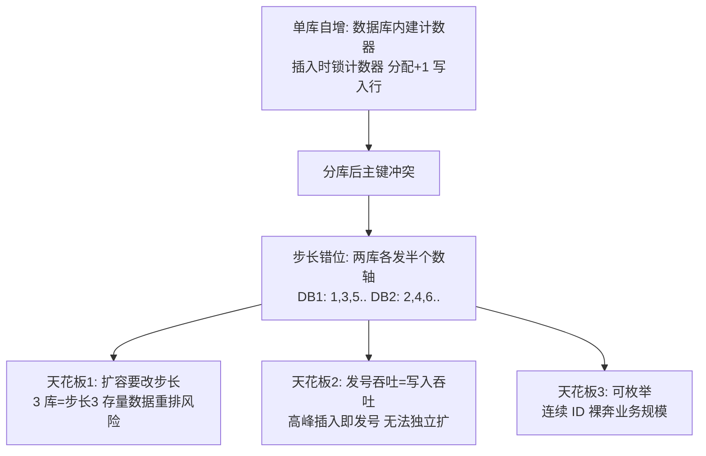
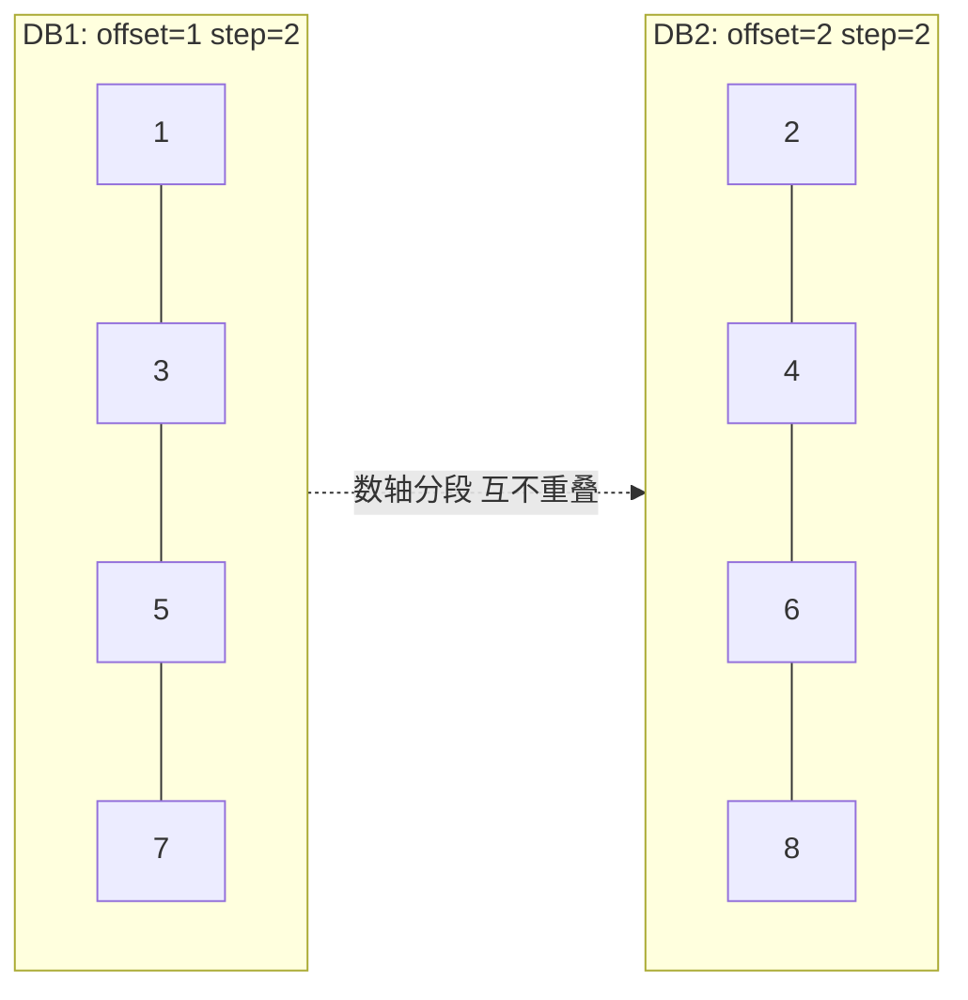

# 数据库自增 ID

> **一句话摘要**：数据库自增是分布式 ID 的起点与陪跑者——单库内它是完美的（唯一/严格递增/免费）；多库后用「步长错位」续命（1、3、5…与 2、4、6…），但扩容要改步长、发号扛不住高峰、规模泄露照旧——理解它的天花板，才知道号段与雪花为什么长成那样。

> **本文核心**：机制链 = **自增 = 数据库内置的单线程计数器（锁保护）→ 多库靠步长错位重建唯一性（DB1 奇数/DB2 偶数）→ 三个天花板（扩容改步长/发号吞吐/枚举泄露）**——它是「集中计数」谱系的原点，号段模式是它「批量预取」的第一代改良。

前置阅读：[方案全景](./2_分布式ID方案全景-入门.md)。MySQL 自增的存储机制（内存计数器/持久化行为）归本仓库 MySQL 系列。

## 1. 背景：最老的方案为什么还在场

自增主键与关系数据库同龄。它至今仍在场的理由三条：**零开发成本**（数据库自带）、**严格递增**（业务排序/对账友好）、**行为绝对可靠**（几十年打磨）。分布式场景下它常被「一票否决」，但 dismissing 之前值得看清它的机制与三个天花板——很多团队的「低频内部系统」，自增 + 单库其实够用到天荒地老。

## 2. 核心机制：自增的实现与步长错位

- **单库机制**：自增值由数据库在插入时分配（计数器 + 锁保护并发）——「发号」与「插入」是同一个动作，免费但耦合。
- **步长错位（多库续命）**：两台 DB 设 `auto_increment_offset`（起点）与 `auto_increment_increment`（步长）——DB1 从 1 起步长 2（奇数），DB2 从 2 起步长 2（偶数）；N 库同理步长 N。唯一性由「数轴分段」保证，无需协调。
- **三个天花板**：① **扩容**——3 库方案要改步长为 3，且已用的奇偶数与新分段冲突需要规划（经典做法：一开始就把步长设大，如步长 16 只用前 2 段，为扩容留位）；② **吞吐**——发号吞吐 = 插入吞吐，高峰期发号压力与业务写压力同涨且互相挤占；③ **枚举**——连续 ID 把订单量写在了脸上。

追问链：**为什么不一开始就设超大步长？**——可以（业界惯例如步长 2048 预留 11 个库位），代价是单库 ID 稀疏（视觉不连续，对账无碍）；**为什么不能「发号 DB 与业务 DB 分离」？**——可以（独立的发号表 + `REPLACE INTO` + `LAST_INSERT_ID` 技巧），这就是「数据库发号服务」雏形，但它仍是集中计数器——性能天花板只挪没消，下一个进化（号段）才是质变。

## 3. 落地实践：什么场景继续用自增

1. **单库且可预期的中小系统**：管理后台、内容站、日订单万级以下——自增 + 定期归档，无需任何发号组件。
2. **用「发号表」而非行自增**：需要跨表/跨服务发号时，建独立发号表（`REPLACE INTO sequence_table(stub) VALUES('a'); SELECT LAST_INSERT_ID();`）——集中计数器的标准 SQL 实现，比行自增灵活（可多序列、可独立扩容）。
3. **步长预留纪律**：预判分库时，第一天就把 offset/increment 按终态库数配置（步长 16 起步）——扩容免改配置。
4. **对外 ID 脱敏**：若 ID 出现在 URL，外层套加密映射（内外双 ID，首篇原则）。

## 4. 生产视角：自增方案的事故形态

- **扩容夜的分段冲突**：从 2 库扩 3 库，新库起点算错（与存量号段重叠）——插入报主键冲突，回滚扩容。预案：扩容前跑「数轴占用核查」，新分段必须从未用区间起。
- **发号表热点**：所有业务挤一张发号表——行锁排队把发号 QPS 压到千级以下。解法：按业务拆发号表/多条 stub 轮转/直接升级号段模式。
- **双主切换的计数器回退**：主从切换后新主的自增计数器落后（未同步的已发号被重发）——`innodb_autoinc_lock_mode` 与主从延迟的联合作用，切换后要用 `AUTO_INCREMENT=N` 手工拨前。这是「集中计数器」状态的可用性代价具象（对照共识系统的任期机制——[分布式理论系列](../../../distributed-theory/入门层/从零开始认识分布式理论系列/7_Raft共识算法-入门.md)）。
- **信息安全审计发现**：对外接口的连续 ID 被标记「可枚举」——补内外双 ID 的映射层，返工成本高于第一天就分离。

## 5. 主流系统怎么做：各数据库的自增/序列

| 数据库 | 机制 | tips |
|---|---|---|
| MySQL | `AUTO_INCREMENT`（表级计数器） | InnoDB 持久化行为版本间有差异（8.0 重启保持）——迁移前核版本行为 |
| PostgreSQL | `SEQUENCE` 序列对象 | 独立对象（可多表共享）；`nextval` 与事务回滚的关系（号会被跳过——序列不回滚）是常见认知点 |
| Oracle | `SEQUENCE` + cache | cache 预取一批进内存（实例崩溃丢一段号——「跳号」是特性不是 bug） |
| SQL Server | `IDENTITY` + `SEQUENCE` | 双机制并存，序列对象为主流 |

规律：**各家都实现了「计数器 + 预取」两个元素**——Oracle 的 cache 与号段模式的双 buffer 是同一思想在不同层的重演（下一篇的主角）。

## 6. 典型场景

- **中小单库业务**（够用级）：自增 + 归档——零成本的完美方案。
- **独立发号表**（过渡级）：跨表/跨服务需要数字 ID 的低频场景——集中计数器的最小实现，未来平滑升级号段。
- **遗留系统兼容**（现实级）：下游接口吃连续数字 ID——自增保留在内部，对外加映射。

## 7. 与相邻概念的区别

- **自增 vs 号段**：逐个发 vs 批量取——号段把「发号频率」与「业务频率」解耦（号段篇），自增的每一次发号都是一次数据库交互。
- **自增 vs 序列（SEQUENCE）**：表绑定 vs 独立对象——序列可以跨表共享、可以手动 nextval，是「计数器」从行属性升级为一等公民。
- **步长错位 vs 分片路由**：步长决定「号段在哪发」，分片键决定「数据去哪库」——两者独立设计；用 ID 取模路由时，步长方案天然兼容（ID 均匀分布）。
- **跳号 vs 重复**：跳号（回滚/缓存丢失，无害——唯一性不破坏）vs 重复（计数器回退，致命）——运维要分清两件事的严重级。

## 8. 常见误区与不适用

- **「自增 ID 就是分布式不可用」**：单库/低频场景它仍是最优解——「分布式必换」是教条；换方案的判据是三个天花板是否真的被触碰。
- **「步长错位后就没有唯一性问题了」**：它只是把唯一性押在「配置正确」上——配置漂移（新库忘配 offset）即冲突；配置管理要进变更流程。
- **「发号表加个索引就能扛高并发」**：行锁计数器的串行性是机制级的——千级 QPS 是天花板量级（行业认知），优化方向是换模式不是调索引。
- **「ID 跳号说明有 bug」**：事务回滚跳号是正常行为（序列不回滚）——把跳号当故障排查是新手常见浪费；只有「重复」是故障。
- **不适用**：分库分表高频写入（号段/雪花）；对外直接暴露（映射层必须）；多主写入拓扑（计数器回退风险）。

## 9. 你们可能会问

- **发号表方案的 QPS 天花板怎么估？** 单行计数器受行锁串行限制——单条语句毫秒级延迟 → 理论千级 QPS，压测定准；多条 stub 轮转可线性扩到万级，再往上换号段。
- **步长方案怎么支持「只读从库」？** 从库不发号（自增只在主库分配）——读写分离不影响发号；双主写入才是步长方案的主场（各主不同 offset）。
- **MySQL 8.0 的自增持久化变化是什么？** 8.0 起计数器随 redo 持久化（重启不再回退到 max(id) 重算）——重启跳号行为消失，但「计数器回退」风险在主从切换时仍需关注。
- **Oracle cache 丢号要不要紧？** 要不要紧看业务——跳号无害（唯一性完好），「连续性」诉求的业务（发票号等监管场景）要 `NOCACHE` 或用专门的号段服务。
- **从自增迁到雪花的存量数据怎么办？** 存量保留自增值、增量用雪花（值域天然不重叠）+ 视图/双查询兼容——大爆炸式改 ID 是禁手。

## 10. 一句话总结 + 5W 速记卡 + 自测三问

**🎯 核心带走**：

- **核心一句话**：自增 = 数据库内置计数器，单库免费完美；多库靠步长错位续命，三个天花板（扩容/吞吐/枚举）决定何时退场。
- **链条复述**：单库完美 → 分库冲突 → 步长错位 → 天花板渐显 → 发号表（过渡）→ 号段/雪花（升级）。
- **失效点与边界**：跳号无害重复致命；步长方案押注配置正确；高频分库场景不适用。

**5W 速记卡**：

| 维度 | 内容 |
|---|---|
| What | 内置计数器 + 步长错位 + 三天花板 |
| Why | 零成本严格递增，是所有方案的对照基线 |
| When | 单库中小系统、低频发号、遗留兼容 |
| Where | 业务库主键 / 独立发号表 |
| How | 判天花板 → 触碰前规划升级路径 → 步长预留纪律 |

💡 **实战提示**：第一天按终态库数设步长；跳号是特性重复是事故；双主切换后核查计数器；对外 ID 永远套映射。

**开放问题**：如果「数据库原生分布式序列」（NewSQL 的全局序列）普及，步长错位这类应用层技巧会不会成为历史名词？

**决策（何时用）**：单库/低频推荐继续自增；多库高频推荐号段或雪花；推荐「天花板触碰信号」（发号延迟/扩容计划/安全审计）作为升级触发器。

**Trade-off（代价与反方案）**：自增用「扩展性」换「零成本与严格递增」；反方案——号段（批量预取换吞吐，代价是发号服务）、雪花（本地化换极限性能，代价是时钟与机器位管理）、保持单库（保自增，代价是扩展上限）。

**演进视角**：自增三十年从「默认主键」退到「对照基线」——每个新方案都拿它当性能与简单性的度量衡；它的退场方式是成为标尺，而非消失。

---

**下篇预告**：给集中计数器装上批量预取——下一篇[号段模式](./4_号段模式-入门.md)讲双 buffer 如何把数据库发号的吞吐翻三个量级。

---

## 📌 数据与事实声明

自增机制（AUTO_INCREMENT/SEQUENCE/cache）为各数据库官方文档内容；「发号表千级 QPS」「双主计数器回退」为公开工程共识与 MySQL 官方文档已知行为；步长预留惯例为业界实践。以官方文档与自身压测为准。

## 📚 参考资料

| 类型 | 标题 | 来源 |
|---|---|---|
| 文档 | MySQL: AUTO_INCREMENT / InnoDB AUTO_INCREMENT Handling | dev.mysql.com |
| 文档 | PostgreSQL: SEQUENCE | postgresql.org |
| 系列文章 | 号段模式（下一篇） | 本仓库同系列 |
| 系列文章 | 分布式时钟（计数器回退对照） | 本仓库 distributed-theory/ |
