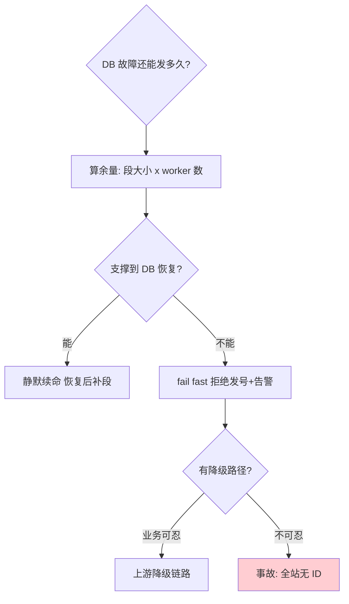

# 号段模式

> **一句话摘要**：号段模式 = 「批量预取」对集中计数器的革命——一次从数据库取一段号（如 1 万个）缓存在应用内存，之后本地发放、零数据库交互；双 buffer（两个号段并行加载）再把「取段瞬间的毛刺」也抹平。它是数据库系的天花板方案（美团 Leaf segment 的核心思想），性能逼近本地算法、有序性优于雪花。

> **本文核心**：机制链 = **DB 一次发一段（update+select 原子取段）→ 应用内存逐个发放 → 快用完时异步预取下一段（双 buffer 交替）→ DB 只承受「每号段一次」压力**——性能 = 段大小 × 取段频率；可用性 = DB 挂后内存余量决定还能发多久。

前置阅读：[数据库自增 ID](./3_数据库自增ID-入门.md)（它批量化的直接升级）。实现参照美团 Leaf segment 与滴滴 tinyid。

## 1. 背景：为什么「逐个发号」是错的

自增/发号表（上一篇）的死穴：每发一个号一次 DB 交互——发号 QPS 与 DB 行锁串行正面硬扛。但观察业务事实：**没有任何业务需要「发号的瞬间必须落库」**——ID 只要唯一有序即可，谁在乎它是刚从 DB 拿的还是十分钟前拿的？号段模式抓住这个松动：**把「每号一次交互」摊薄成「每段一次交互」**——取段的 DB 压力除以段大小（如 1 万），同一套数据库、吞吐直接翻三个量级。

## 2. 核心机制：取段、发放与双 buffer

```mermaid
sequenceDiagram
    participant APP as 应用(worker)
    participant DB as 号段表(数据库)
    participant BIZ as 业务调用方
    APP->>DB: 1 初次取段: UPDATE set max_id=max_id+step WHERE biz_tag='order'; SELECT max_id
    DB-->>APP: 号段 [1, 10000] (内存持有)
    BIZ->>APP: 2 要 ID -> 本地返回 1, 2, 3... (零DB交互)
    APP->>APP: 3 内存号段用到 90% -> 异步预取下一段
    APP->>DB: 4 取下一段 [10001, 20000] (后台)
    Note over APP,DB: 双 buffer: 两个号段交替服务<br/>取段毛刺被异步化抹平
```

机制四要点：

- **取段原子性**：`UPDATE ... SET max_id = max_id + step` 一条语句原子完成「占段」（DB 行锁保证不重不漏）——号段表按 biz_tag 一行一个业务（订单/优惠券各自独立段，互不干扰）。
- **本地发放**：内存里 `当前值++` 即可——纯内存操作，单机发号上限取决于内存与 CPU，常见单实例轻松万级 QPS。
- **双 buffer（Leaf 的关键改良）**：单号段模式下「号段用尽 → 阻塞取段 → DB 抖动则发号卡顿」——毛刺不可控。双 buffer 让当前段用到阈值（如 10%-90% 区间触发）就**异步**预取下一段，两段交替——取段的延迟被移出请求路径。代价：多一倍内存 + 段尾浪费（切换时旧段剩余作废）。
- **可用性语义**：DB 挂掉后，应用靠**内存余量**继续发号——「还能发多久 = 余量 ÷ 发号速率」；段越大抗故障越久，但代价是「DB 恢复后段尾浪费越大 + worker 重启跳号越多」。**段大小是性能 × 可用性 × 浪费的三方旋钮**。

追问链：**为什么不用「单 buffer + 取段快一点」？**——快慢不解决「同步依赖」，请求路径上有 DB 就有毛刺；**段大小为什么常在几千到几万？**——太小（取段频繁，DB 压力回来了）、太大（重启跳号与 DB 恢复期浪费放大）；**worker 重启为什么会跳号？**——内存里未用完的段随进程消失，重启重新取段，中间的号没人用（跳号无害，唯一性不破坏——与自增跳号同理）。

## 3. 落地实践：搭一个号段服务

```sql
CREATE TABLE leaf_alloc (
  biz_tag VARCHAR(64) PRIMARY KEY,  -- 业务标识: order/coupon/...
  max_id BIGINT NOT NULL DEFAULT 1, -- 当前段尾
  step INT NOT NULL DEFAULT 10000,  -- 段大小
  description VARCHAR(256)
);
-- 取段(原子): UPDATE leaf_alloc SET max_id = max_id + step WHERE biz_tag = 'order';
--            SELECT max_id, step FROM leaf_alloc WHERE biz_tag = 'order';
```

落地四纪律：① **接入方无感化**——业务通过 SDK 拿号，段策略（大小/预取阈值）由服务端统一管理，调优不惊动业务；② **监控三指标**——号段水位（内存余量可支撑时长）、取段耗时、跳号率；③ **DB 高可用**——号段表所在 DB 是发号服务的「软依赖」（挂了靠内存续命），主从+快速切换即可，无需过度建设；④ **worker 无状态化**——worker 挂了重启取新段即可（跳号接受），不要为「段不浪费」引入 worker 状态持久化（复杂度不值）。

## 4. 生产视角：号段模式的事故形态

- **DB 长时间故障的「号段熔断」**：内存余量耗尽、DB 仍未恢复——发号服务拒绝服务（fail fast）还是降级（跨段乱序发放）？行业惯例 fail fast + 告警，让上游走降级链路；「乱序发放」破坏有序性承诺，慎用。
- **段大小与流量错配**：大促前没调大段——平时 1 万的段在高 QPS 下几分钟用完，取段频率暴涨打回 DB。段大小要随流量预案调整（大促预扩段），或按「预估 QPS × 期望支撑时长」动态计算。
- **biz_tag 滥用**：每个小功能都开一个 biz_tag——号段表膨胀 + 段资源（DB 行）碎片化；惯例是按「业务域」聚合 tag，域内细分用偏移。
- **监控缺失的静默降级**：双 buffer 的预取失败被静默重试，无人知晓号段水位只剩 5%——下一波流量直接打穿。水位告警（低于 30% 预警/10% 告急）是号段服务的生命线。

## 5. 主流系统怎么做：Leaf 与 tinyid 的机制选择

| 实现 | 机制选择 | 亮点 | tips |
|---|---|---|---|
| 美团 Leaf segment | 双 buffer + 动态步长 | 步长随流量自适应（QPS 高则自动调大段）；DB 挂后可配 max 免疫时长 | 业界参照系；Leaf 同时提供 snowflake 模式（组 3） |
| 滴滴 tinyid | 双号段异步 + 多 DB 支持 | HTTP/SDK 双接入；号段持久化到多个 DB 容灾 | 轻量、代码量小、易自研借鉴 |

规律：**号段服务的演进 = 在「段大小 × 预取策略 × 容灾」三个旋钮上做自动化**——Leaf 的动态步长与 tinyid 的多 DB 是两个方向的代表；理解三旋钮，自研与选型都是半天的决策。

## 6. 典型场景

- **交易订单 ID**（高频级）：QPS 万级、需要趋势递增（对账/排序）但「严格连续不必须」——号段的标准主场。
- **券码/批次号**（运营级）：批量发放的编号——号段的「段」与业务的「批次」天然同构。
- **需要数字 ID 的跨服务场景**（集成级）：下游只吃 BIGINT——雪花超长或 UUID 字符串不满足时，号段是最平滑的数字方案。

## 7. 与相邻概念的区别

- **号段 vs 自增/发号表**：逐个发 vs 段发放——性能差三个量级，有序语义从「严格连续」变「段内连续、段间趋势」（号段切换瞬间可能乱序，排序敏感业务要知晓）。
- **号段 vs 雪花**：集中预取 vs 本地算法——号段有序性更好（趋势+段内严格）且无时钟问题，代价是发号服务依赖；雪花零依赖但需管时钟机器位（组 3 的对照主题）。
- **双 buffer vs 预取**：预取是动作（提前取），双 buffer 是结构（两段并行持有）——预取也可以单 buffer（取完再取下一段），双 buffer 保证「当前段耗尽的瞬间下段已就绪」零等待。
- **跳号 vs 断号**：跳号（重启丢弃余量，无害）；断号（DB 故障段未持久化？不存在——段在 DB 已持久，应用消失只丢本地余量）——号段模式没有「重复」风险（取段原子），这是它优于 Redis INCR 的地方。

## 8. 常见误区与不适用

- **「号段模式依赖 DB，所以可用性差」**：依赖被降级为「低频软依赖」（每段一次），DB 挂后靠内存续命——可用性语义与自增/发号表完全不同，别拿旧印象判死刑。
- **「段越大越好」**：段的浪费（切换丢弃 + 重启跳号）与 DB 故障恢复后的回收成本随段增大——按「QPS × 抗故障时长」计算，不拍脑袋。
- **「发号服务可以随便重启」**：重启跳号无害，但**频繁重启跳号会让「按 ID 排序」失真加剧 + 监控跳号率飙升**——跳号率是服务健康度指标，不是无害的背景噪音。
- **「号段保证全局严格递增」**：多 worker 并行持段时，worker A 的号可能晚于 worker B 的号被业务使用——「趋势递增」不是「全局严格递增」；需要严格连续的场景回到集中单点发号（性能代价自知）。
- **不适用**：QPS 极低且已有单库（自增够用）；需要无规律对外 ID（号段连续可枚举——外层加映射）；无中心 DB 可用的环境（雪花才是零依赖解）。

## 9. 你们可能会问

- **动态步长的算法是什么思路？** Leaf 的做法：按最近若干次取段的「消耗速率」调整下一段大小——QPS 高则自动增段，低则缩段；本质是「段大小 = 速率 × 目标支撑时长」的自动求解。
- **双 buffer 的预取阈值设多少？** Leaf 默认 10%（用到 90% 时预取）——阈值太低预取频繁、太高失去缓冲意义；按取段耗时 P99 与流量突增幅度调。
- **号段模式和「批量自增」是一回事吗？** 机制同源（都是集中计数器批量预取）——号段模式是它的「服务化形态」（SDK/服务 + 双 buffer + 监控 + 多业务管理）；概念与产品的关系。
- **DB 挂 30 分钟，号段服务还能撑吗？** 算账：总余量 = Σ(worker 内存段余量)，撑得住时长 = 余量 ÷ QPS——答案因段大小与 worker 数而异；这道算术题应该在容量规划里预先做（发号服务的容量水位）。
- **迁移到雪花值得吗？** 看三诉求：需要「零依赖/极限 QPS」值得（接受时钟机器位管理）；号段的有序性优势（段内严格、无时钟问题）是雪花没有的——不是单向升级，是谱系选择。

## 10. 一句话总结 + 5W 速记卡 + 自测三问

**🎯 核心带走**：

- **核心一句话**：号段模式 = 批量预取对逐个发号的革命——DB 压力除以段大小，双 buffer 把取段毛刺移出请求路径。
- **链条复述**：原子取段（update+select）→ 内存发放 → 阈值触发异步预取 → 双 buffer 交替 → DB 只扛「每段一次」。
- **失效点与边界**：段耗尽且 DB 挂 = fail fast；多 worker 无全局严格递增；连续可枚举需外层映射。

**5W 速记卡**：

| 维度 | 内容 |
|---|---|
| What | 原子取段 + 内存发放 + 双 buffer 预取 |
| Why | 逐个发号的 DB 串行交互是吞吐天花板 |
| When | 万级 QPS、数字 ID、趋势递增够用的链路 |
| Where | 发号服务（DB 号段表 + worker + SDK） |
| How | 按流量定段 → 阈值预取 → 水位监控 → fail fast |

💡 **实战提示**：段大小 = QPS × 抗故障时长；水位告警是生命线；跳号率是健康度指标；biz_tag 按业务域聚合。

**开放问题**：号段的「段」概念与 Kafka 的 batch、Oracle 的 cache 同构——「批量预取」还能在哪些发号/分配类场景被重演？

**决策（何时用）**：数字 ID + 中高 QPS 推荐号段；极限 QPS/零依赖推荐雪花；推荐「水位监控 + 段动态化」作为号段服务的两条生命线投入。

**Trade-off（代价与反方案）**：号段用「发号服务建设 + DB 软依赖」换「三个量级吞吐 + 数字有序」；反方案——雪花（去服务化，代价是时钟机器位）、Redis INCR（更轻，代价是持久化语义）、自增（更简，代价是吞吐）；段大小的反方案权衡：大段（抗故障）vs 小段（少浪费少跳号）。

**演进视角**：号段模式从 Oracle cache（1980s 预取思想）到 Leaf/tinyid 的服务化（2017 前后）再到动态步长的自适应——「批量预取」四十年只被精化未被替代；它是集中发号的终点形态。

---

**下篇预告**：切换到本地算法阵营——下一篇[雪花算法原理](./5_雪花算法原理-入门.md)讲 64 位怎么切、为什么它零依赖又趋势递增。

---



## 📌 数据与事实声明

号段模式机制（取段 SQL/双 buffer/动态步长）出自美团 Leaf 官方技术文章与滴滴 tinyid 项目文档；QPS 量级与阈值默认值为公开工程惯例；Oracle cache 的类比关系为机制对照。以官方资料与自身压测为准。

## 📚 参考资料

| 类型 | 标题 | 来源 |
|---|---|---|
| 文章 | Leaf——美团点评分布式 ID 生成系统 | tech.meituan.com |
| 项目 | didi/tinyid | github.com/didi/tinyid |
| 系列文章 | 数据库自增 / 雪花原理（本系列） | 本仓库同系列 |
