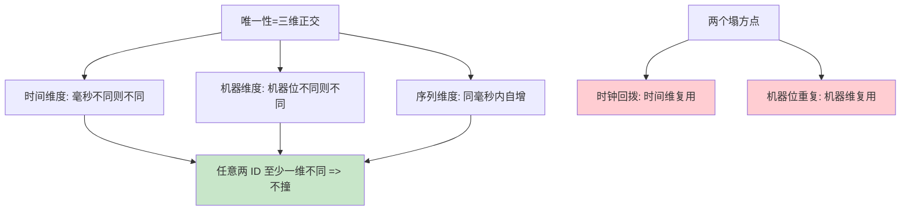

# 雪花算法原理

> **一句话摘要**：雪花算法（Snowflake）= 用一个 64 位 long 的位切分，把「时间戳 + 机器 ID + 序列号」拼进一个数字——本地毫秒级生成、趋势递增、零外部依赖；它的全部安全性押在两件事上：**时钟不回拨**与**机器位不重复**——这两件事的管理成本，就是「零依赖」的真实价格。

> **本文核心**：机制链 = **64 位切分（1 符号 + 41 时间戳 + 10 机器 + 12 序列）→ 同毫秒内序列自增、跨毫秒时间戳前移 → 唯一性由「时间 × 机器 × 序列」三维空间划分保证**——无协调、无锁、无 IO；两个信任前提（时钟单调、机器位唯一）分别对应回拨防护与分配机制两大工程主题。

前置阅读：[方案全景](./2_分布式ID方案全景-入门.md)。时钟回拨的公理级背景见[分布式时钟篇](../../../distributed-theory/入门层/从零开始认识分布式理论系列/9_分布式时钟-入门.md)。

## 1. 背景：Twitter 为什么发明它

> 量级分档意识：本文方法在十万级 QPS、千万级用户、亿级流量的场景下均需重新评估——量级变化时架构与参数需同步调整。


Twitter 早期用 MySQL 自增——分库后同样撞上「唯一性失效」（首篇的问题定义）；试过 UUID（无序伤索引）。2010 年公开 Snowflake：既然业务要「**短（64 位）、有序（趋势）、快（本地生成）**」，那就把这三样直接编进一个数字里——时间戳给有序、机器位给唯一、序列位给并发。它证明了「本地算法」可以同时满足交易级 ID 的全部核心诉求，从此成为高并发 ID 的事实范式（Leaf snowflake、UidGenerator 都是它的工程化后裔）。

## 2. 核心机制：64 位的切分与生成流程

```mermaid
flowchart LR
    subgraph BITS ["64 位切分(标准 Snowflake)"]
        S["1 bit 符号位(恒 0)"] --- T["41 bit 时间戳<br/>毫秒级 相对自定义纪元<br/>可用约 69 年"]
        T --- M["10 bit 机器位<br/>1024 个节点"] --- SQ["12 bit 序列号<br/>同毫秒 4096 个"]
    end
    GEN[生成流程] --> G1[取当前毫秒时间戳]
    G1 --> G2{与上次同毫秒?}
    G2 -->|是| G3[序列+1 溢出4096则等到下一毫秒]
    G2 -->|否| G4[序列归零 新毫秒新批次]
    G3 & G4 --> OUT[拼装: 符号<<63 | 时间戳<<22 | 机器<<12 | 序列]
```

三个设计选择的为什么（追问链）：

- **为什么 41 位时间戳**：41 位 = 2^41 毫秒 ≈ 69 年——从自定义纪元（如项目上线日）起算足够；精度选毫秒是「时间精度 × 序列容量」的分账（秒级并发不够、纳秒位不够分）。
- **为什么 10 位机器位 / 12 位序列**：1024 节点对当年 Twitter 足够；4096/毫秒 = 单机 409 万 QPS 上限——**位分配是「机器数 × 单机并发 × 服务年限」的三方分账**，业务可自行重切（UidGenerator 就重切了，下一篇）。
- **序列溢出为什么是「等到下一毫秒」而不是排队**：同一毫秒 4096 个发满 = 单机极限已到——自旋等待下一毫秒是最简单的流控；这也是「理论上限 409 万 QPS」的由来（纯理论值，别当容量规划依据）。

**唯一性的数学**：不同节点机器位不同 → 跨机不撞；同机不同毫秒时间戳不同 → 跨时不撞；同机同毫秒序列不同 → 并发不撞——三维正交，无需任何协调。**趋势递增的来源**：时间戳在高位，时间前进 ID 必然增大（跨机器间因时钟微差可能轻微乱序——趋势而非严格）。

## 3. 落地实践：接入前的三件准备

1. **机器位分配方案**（最重要）：静态配置（配置中心下发，人工保证唯一——小型集群可行）；集中协调（ZK/DB 顺序节点自动分配——Leaf 的做法，集群规模大或弹性扩缩容必备）；启动自检（启动时上报 machineId 指纹，冲突即拒绝启动）——**三选一，且必须有冲突检测兜底**。
2. **纪元（epoch）设定**：自定义起始时间戳（建议项目上线日），写死在常量——改纪元 = ID 全变，永不再改。
3. **序列化纪律**：对外 JSON 一律字符串（JS 53 位精度坑）；数据库 BIGINT 存储原生兼容。

## 4. 生产视角：雪花的事故形态

- **时钟回拨撞号**（头号事故）：NTP 校时回拨 3 秒 → 同一机器生成「过去用过的」时间戳 → 三维空间重叠 → **ID 撞了**，数据互相覆盖。防护谱系（下一篇展开）：小幅回拨等待追平、大回拨拒绝服务/切换备用位、运行期时钟监控告警。
- **机器位重复**：容器环境 IP 变化导致按 IP 取模的 machineId 撞车；或运维复制配置漏改——两台实例同 machineId，同毫秒并发即撞。教训：**机器位分配必须机制化（自动分配 + 冲突检测），人工保证必失效**。
- **容量误判**：把「409 万 QPS 理论上限」当实际容量——真实瓶颈在序列自旋（热点毫秒）与调用方 RT；容量按压测，不按位宽算。
- **时间语义的误用**：从 ID 反解时间戳做业务判断（「这单是几点创建的」）——ID 里的时间是「生成时刻」不是「业务发生时刻」（重试/缓冲会让两者偏离）；需要业务时间请落业务字段。

## 5. 主流系统怎么做：雪花家族谱系

| 实现 | 位分配 / 关键差异 | tips |
|---|---|---|
| Twitter Snowflake（原版） | 1/41/10/12 标准切分 | Scala 实现；概念原点 |
| 美团 Leaf snowflake | 同标准切分 + ZK 管机器位 + 回拨告警 | workerID 自动分配的工程范本 |
| 百度 UidGenerator Default | 秒级时间戳 28 位 + 机器 22 位 + 序列 13 位 | 重切分案例：机器数与并发的重新分账 |
| 百度 UidGenerator Cached | RingBuffer 预生成 | 预生成思想与号段双 buffer 同源（批量预取的又一次重演） |
| 索尼 Sonyflake | 39 位时间（10 年×更细）+16 序列 | 不同场景重新分账的另一例 |

规律：**雪花是一族算法不是一个算法**——位切分即业务参数；照抄位宽不如理解「三方分账」后按自己业务重切。

## 6. 典型场景

- **分库分表交易主键**（旗舰级）：QPS 高、趋势递增索引友好、无外部依赖——雪花的旗舰主场。
- **海量对象标识**（存储级）：图片/文件/消息的的对象 ID——量大 + 无严格连续需求。
- **TraceID**（观测级）：本地生成 + 唯一 + 可反解生成时间（排障时顺带知道请求发起时刻——时间语义要按「生成时刻」用）。

## 7. 与相邻概念的区别

- **雪花 vs 号段**：本地算 vs 集中预取——雪花零依赖但时钟是信任基础；号段有序性更强（段内严格）但依赖发号服务；选型标尺=「愿意管时钟还是愿意管服务」（号段篇对照）。
- **雪花 vs UUID v7**：同为「时间前缀本地算法」——雪花 64 位整型（索引友好、位可自切），v7 是 128 位标准（生态通用、位不可控）——自有体系 vs 通用标准的选择。
- **趋势递增 vs 全局有序**：跨机器时钟微差 + 无全局协调 → 只能趋势；需要全局严格有序要共识/集中发号（性能代价自知）——「递增」二字的精确度要进设计文档。
- **本篇 vs 分布式时钟篇**：雪花是「时钟不可信问题」在 ID 域的投影——时钟篇讲公理与防护总纲，本篇看投影的具体形态（回拨=撞号）。

## 8. 常见误区与不适用

- **「雪花算法零依赖零成本」**：零外部依赖 = 时钟与机器位内部化——防护成本只是从「运维组件」变成了「代码与流程」；没有免费的发号。
- **「理论上限 409 万 QPS 当容量」**：序列自旋、时钟精度、调用链路都会先于位宽成为瓶颈——容量按压测，位宽只给「绝不可能超」的安全垫。
- **「机器位按 IP 取模就行」**：容器环境 IP 漂移、多网卡、重启换 IP——按 IP 分配是撞号重灾区；机制化分配（协调中心 + 冲突检测）才是正解。
- **「时钟回拨概率太低不用管」**：NTP 校时是常态运维动作，回拨不是小概率——「回拨防护缺失」在发号器评审里等同「没有密码学随机」级别的硬伤。
- **不适用**：需要严格连续（发票/监管序列——集中发号）；QPS 低且已有单库（自增）；无法做时钟运维的边缘设备（号段或 UUID）。

## 9. 你们可能会问

- **回拨发生时「等待追平」要等多久？** 等待时长 = 回拨幅度（如回拨 2 秒就自旋 2 秒）——小幅度（秒级内）可等；大幅度等待不可行（服务不可用），切「拒绝发号告警」或「扩展位策略」（下一篇的改进谱系）。
- **同一毫秒 4096 个用完的真实概率？** 单机毫秒 4096 并发 = 409 万 QPS 瞬时——常规业务远达不到；若达到，位切分就该重审（序列位加大/时间精度改秒级扩展位）。
- **多机房部署机器位怎么规划？** 机器位再分「机房位 + 机器位」（如 10 位拆 3+7）——机房级前缀保证跨机房不撞；规划在位切分阶段一次做对。
- **怎么验证我的雪花实现是对的？** 三测：并发唯一性（多线程生成全局去重计数）、回拨注入（改系统时钟验证防护路径）、机器位冲突注入（双实例同 ID 验证启动拒绝）——发号器上线的三道门。
- **ID 能反解出机器号定位问题实例吗？** 能——机器位可读出（运维福利）；前提是机器位分配表有登记（自动分配方案天然带登记），这也是「机器位机制化」的附带收益。

## 10. 一句话总结 + 5W 速记卡 + 自测三问

**🎯 核心带走**：

- **核心一句话**：雪花 = 64 位三维空间划分（时间×机器×序列）——本地零依赖发号，安全性押在时钟单调与机器位唯一两个前提上。
- **链条复述**：位切分（三方分账）→ 同毫秒序列自增/跨毫秒时间前移 → 唯一性三维正交 → 趋势递增由时间高位保证 → 回拨与撞机位是仅有的两个塌方点。
- **失效点与边界**：时钟回拨=撞号；机器位重复=撞号；趋势非严格；理论位宽上限非实际容量。

**5W 速记卡**：

| 维度 | 内容 |
|---|---|
| What | 64 位切分 + 生成流程 + 两个信任前提 |
| Why | 「短/有序/快」三诉求的本地算法解 |
| When | 分库分表主键、海量对象 ID、高并发发号 |
| Where | 应用进程内（无外部组件） |
| How | 位切分按业务定 → 机器位机制化 → 回拨防护 → 三道测试门 |

💡 **实战提示**：机器位分配机制化 + 冲突检测；回拨防护必做（等待/拒绝/备用位）；对外字符串化；ID 生成时间不等于业务时间。

**开放问题**：如果云厂商提供「单调时钟服务」（硬件保证不回拨），雪花的前提成本会归零吗——信任基础从自建到云托管会改变什么？

**决策（何时用）**：高并发 + 可接受趋势递增 + 有能力管时钟与机器位推荐雪花；推荐「三道测试门」（并发唯一/回拨注入/冲突注入）作为上线硬门禁。

**Trade-off（代价与反方案）**：雪花用「时钟与机器位的信任管理」换「零依赖 + 极致性能 + 趋势递增」；反方案——号段（管服务不管时钟）、UUID v7（标准通用但位不可控、128 位长）、集中发号（严格有序，代价是瓶颈）。

**演进视角**：从 Twitter 2010 的 Scala 原版到 Leaf/UidGenerator 的工程化重切，到 v7 UUID 吸收时间前缀思想（2024）——「时间戳+空间划分」的本地算法范式十五年未变，变化的只有位分配的业务定制。

---

**下篇预告**：撞号的两个塌方点怎么补——下一篇[雪花算法改进](./6_雪花算法改进-入门.md)讲 Leaf/UidGenerator 的回拨防护与机器位管理的工程答案。

---



## 📌 数据与事实声明

Snowflake 位结构与生成流程出自 Twitter 公开工程文章（2010）；Leaf/UidGenerator/Sonyflake 的位分配差异为各项目公开文档；69 年/4096 序列等数值为位宽推算；时钟回拨场景为公开运维实践归纳。以各项目源码与文档为准。

## 📚 参考资料

| 类型 | 标题 | 来源 |
|---|---|---|
| 文章 | Announcing Snowflake（Twitter Engineering） | blog.twitter.com（2010） |
| 项目 | baidu/uid-generator（位切分变体） | github.com |
| 系列文章 | 分布式时钟（回拨公理） | 本仓库 distributed-theory/ |
| 系列文章 | 雪花改进（下一篇） | 本仓库同系列 |
