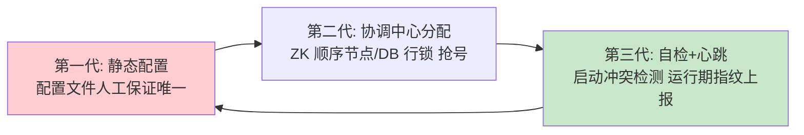

# 雪花算法改进

> **一句话摘要**：雪花的安全前提（时钟单调、机器位唯一）在真实机房里都会破——工程化的改进沿三条线展开：**回拨防护**（等待/拒绝/扩展位/混合逻辑时钟）、**机器位管理**（ZK 协调/数据库分配/容器态方案）、**位结构重切**（UidGenerator 的秒级+RingBuffer）——本篇把两大塌方点的行业答案一次收拢。

> **本文核心**：机制链 = **原版的两个前提 → 各家按机房现实补丁：回拨防护四策略（按幅度分级响应）+ 机器位三种分配（人工→协调→自检）+ 位结构按业务重切**——改进的公共思路是「把押注在外部环境（时钟/配置）的前提，换成自己可控的机制」。

前置阅读：[雪花算法原理](./5_雪花算法原理-入门.md)。实现参照美团 Leaf snowflake 与百度 UidGenerator。

## 1. 背景：原版的两个前提为什么撑不住

> 量级分档意识：本文方法在十万级 QPS、千万级用户、亿级流量的场景下均需重新评估——量级变化时架构与参数需同步调整。


标准雪花押注两个「理论上成立、机房里常破」的前提：

- **时钟单调**：真实世界的时钟被 NTP 校时（可能回拨）、被虚拟化暂停（跳变）、被运维误操作（手动改时间）——[分布式时钟篇](../../../distributed-theory/入门层/从零开始认识分布式理论系列/9_分布式时钟-入门.md)的公理在发号场景的直接后果：**回拨 = 时间戳复用 = ID 撞号**。
- **机器位唯一**：原版说「你们 1024 台机器商量好各自用哪个号」——容器弹性扩缩容、IP 漂移、配置复制粘贴，都在打破「商量好」。

改进史 = 把这两个外部前提逐一替换成内部机制的历史。

## 2. 核心机制一：回拨防护的四策略谱系

```mermaid
flowchart TD
    D[检测到时钟回拨] --> Q{回拨幅度?}
    Q -->|毫秒到秒级小回拨| A[策略1: 自旋等待追平<br/>Leaf 默认(5s 内)]
    Q -->|秒到分钟级| B[策略2: 拒绝发号+告警<br/>fail fast 不赌]
    Q -->|大回拨或常态回拨环境| C[策略3: 扩展位方案<br/>备用位/回拨计数位ID 仍唯一]
    Q -->|要求绝对单调| E[策略4: 混合逻辑时钟<br/>HLC 思想: 物理兜底+逻辑保序]
    A & B & C & E --> G[共同底线: 永不生成重复时间戳]
```

四策略的机制与代价：

- **自旋等待**：回拨 N 毫秒就等 N 毫秒（时钟追平后继续）——最简单，代价是回拨期间发号停摆（服务不可用窗口）；只适合小幅。
- **拒绝发号**：超阈值直接抛异常——把「撞号风险」换成「发号不可用」，配合告警人工介入；可用性换正确性的显式选择。
- **扩展位方案**：预留几个 bit 做「回拨代际」——检测到回拨就代际 +1，时间戳复用但代际不同，ID 仍唯一。代价：挤占其他位（时间/序列变短）；代表：各家「备用 bit」设计。
- **混合逻辑时钟（HLC 思想）**：物理时间做主体、检测到回拨时逻辑计数器保序——物理部分兜「接近真实时间」，逻辑部分保「永不重复」；代价是实现复杂度。学术源头见[分布式时钟篇](../../../distributed-theory/入门层/从零开始认识分布式理论系列/9_分布式时钟-入门.md)。

**选型口诀：按「回拨频率与幅度」的机房现实选策略**——时钟管理严格的团队（禁止大回拨 + 告警体系）用策略 1+2 就够；时钟不可控环境（大量虚机/边缘节点）策略 3/4 是必需品。

## 3. 核心机制二：机器位分配的三代方案



- **静态配置（第一代，禁手）**：人工写配置——复制粘贴漏改、容器弹性无解；只在「实例数固定且少」的小集群勉强可用。
- **协调中心分配（第二代，主流）**：Leaf 的做法——worker 启动到 ZK 注册**顺序节点**（/snowflake/{app}/worker-000001），序号即机器位；会话过期节点删除、重启重抢。冲突由 ZK 顺序性机制性保证（不靠人）。代价：引入 ZK 依赖（协调服务的可用性义务，见[协调服务选型](../../../distributed-theory/入门层/从零开始认识分布式理论系列/15_协调服务选型-入门.md)）。
- **数据库分配（第二代变体）**：发号 DB 里一张 worker 表，启动时 `INSERT ... ON DUPLICATE` 或行锁抢号 + 心跳续期——给没有 ZK 的团队。
- **自检兜底（第三代，必备补充）**：无论哪代方案，启动时做**冲突检测**（向公共存储登记 machineId 指纹，发现同号双活即拒绝启动）+ 运行期心跳指纹上报——**机器位唯一性从「分配时正确」升级为「全生命周期被验证」**。

## 4. 生产视角：改进方案的事故形态

- **ZK 抖动连带发号停摆**：Leaf 依赖 ZK 做 workerID——ZK 短暂不可用时新 worker 起不来（拿不到号）。解法：workerID 本地缓存（拿过就落盘，重启沿用）——ZK 只管「首次分配与冲突检测」，日常运行不依赖。
- **回拨防护的策略组合拳缺失**：只做了「等待追平」，某天遇到 5 分钟回拨——发号停摆 5 分钟全站下单失败。防护必须**分级**（小等/中拒/大扩展位），单策略都是单点。
- **容器弹性的机器位风暴**：HPA 一波扩容 200 个 Pod，ZK 上 200 个顺序节点注册——并发抢号的瞬间冲突与惊群；预分配号段式的「worker 池」或本地缓存能削峰。
- **时钟监控的缺位**：防护再好，回拨频发的机器本身就该摘除——时钟偏移量监控（NTP 状态 + 本地偏差曲线）是发号机器的基础体检，缺失 = 防护在黑暗中运行。

## 5. 主流系统怎么做：改进谱系对照

| 实现 | 回拨防护 | 机器位管理 | 位结构 |
|---|---|---|---|
| Twitter 原版 | 无（信任机房） | 外部手工 | 1/41/10/12 |
| 美团 Leaf snowflake | 等待(5s 内)+告警拒绝 | ZK 顺序节点 + 本地缓存 | 标准 1/41/10/12 |
| UidGenerator Default | 抛异常拒绝 | 应用实例数静态（弹性差） | 秒级 28/机器 22/序列 13 |
| UidGenerator Cached | RingBuffer 预生成缓冲 | 同上 | 秒级 + 预生成 |
| Sonyflake | 等待+可配置 | 手工/外部 | 39/16/8（重切） |

规律：**各家差异集中在「两个前提的处理深度」**——Leaf 强在机器位自动化，UidGenerator 强在位结构重切与预生成；没有全项满分的实现，按自己机房现实取长组合。

## 6. 典型场景

- **大规模弹性集群**（容器级）：HPA 频繁扩缩——ZK/DB 协调 + 本地缓存 + 冲突自检的全套方案；位结构按峰值机器数预留。
- **时钟环境恶劣**（虚机/边缘）：扩展位或 HLC 方案——「时钟不可信」作为设计输入而不是运维整改项。
- **金融级发号**（严格级）：分级防护 + 时钟监控 + 回拨演练进发布流程——正确性压倒可用性的场景。

## 7. 与相邻概念的区别

- **改进 vs 重设计**：改进保「雪花骨架」换前提为机制（本篇）；重设计换骨架（UidGenerator 的秒级重切、Sonyflake）——位分账变了但范式未变。
- **回拨扩展位 vs HLC**：扩展位是「事件计数」思路（回拨一次 +1），HLC 是「物理+逻辑双字段」——扩展位简单但代际会耗尽（回拨次数上限），HLC 通用但复杂；环境决定选择。
- **workerID 协调 vs 发号服务**：机器位协调只在「启动时」用协调中心（低频），号段模式的服务是「运行时」依赖（高频）——依赖频率不同，可用性设计完全不同。
- **本篇 vs 号段双 buffer**：UidGenerator Cached 的 RingBuffer 与 Leaf segment 的双 buffer 是同一思想（批量预取）在本地算法与集中发号两界的各自重演——跨谱系的同构。

## 8. 常见误区与不适用

- **「加了等待策略就安全了」**：等待只覆盖小幅回拨——分级防护缺级 = 在某一级上裸奔；按机房时钟现实画防护分级表。
- **「ZK 分配了 workerID 就永久有效」**：会话过期 workerID 会被回收再分配——长暂停（GC/挂起）恢复的实例可能拿的是「已被别人领走的旧号」；本地缓存 + 运行期指纹自检闭环这一环不能省。
- **「扩展位越大越好」**：扩展位挤占时间/序列位——代际容量与发号容量此消彼长；按「回拨频率上限」定扩展位宽，不是越多越保险。
- **「时钟监控是运维的事，发号器不管」**：回拨防护的触发依赖「检测到回拨」——发号器自己不读时钟偏差，防护就是事后诸葛；时钟监控要进发号组件的自身指标。
- **不适用**：时钟管理严格的物理机小集群（原版+基础防护够用）；能接受服务化依赖的团队（号段模式绕开全部时钟问题）——改进是为「必须本地算法 + 机房现实恶劣」的组合准备的。

## 9. 你们可能会问

- **回拨阈值（等待 vs 拒绝的分界）怎么定？** 按「业务可容忍的发号停顿时长」定等待上限（Leaf 默认 5 秒量级）——超过即拒绝；分界值是可用性预算，不是技术常量。
- **扩展位的代际会用完吗？** 会——每位 2 个代际，3 位 = 8 次「大回拨」额度；额度耗尽前必须完成时钟治理（根因修复），扩展位是缓冲带不是永久解。
- **HLC 在 ID 场景的落地形态？** 时间戳字段 = max(物理时间, 上次值+1)——物理回拨时自动用「上次值+1」保单调；实现约 30 行代码，通用性好；代价是 ID 时间部分可能略微「超前于现实」。
- **容器环境的 machineId 指纹怎么定义？** 「分配中心返回的 ID + 实例启动标识」的组合——指纹上报到公共存储做双活检测；指纹方案要防「同时启动互检竞态」（登记带唯一约束）。
- **存量雪花系统怎么补防护？** 三步走：先加检测与告警（看清现状）→ 再补分级防护（停损）→ 最后评估机器位机制化改造（治本）——顺序不能倒，先有眼睛再动手。

## 10. 一句话总结 + 5W 速记卡 + 自测三问

**🎯 核心带走**：

- **核心一句话**：雪花改进 = 把「时钟单调、机器位唯一」两个外部押注换成内部机制——回拨四级防护 + 机器位三代分配 + 位结构按业务重切。
- **链条复述**：检测回拨 → 按幅度分级（等/拒/扩展位/HLC）→ 机器位协调分配 + 指纹自检闭环 → 位结构按三方分账重切 → 时钟监控进组件自身指标。
- **失效点与边界**：单策略防护必缺级；扩展位代际有上限（根因仍要治理）；ZK 依赖要本地缓存降耦。

**5W 速记卡**：

| 维度 | 内容 |
|---|---|
| What | 回拨四策略 + 机器位三代分配 + 位重切案例 |
| Why | 原版两个前提在真实机房必然被打破 |
| When | 容器弹性、虚机/边缘时钟恶劣、金融级发号场景 |
| Where | 发号组件内（防护逻辑）+ 协调中心（机器位）+ 监控 |
| How | 分级防护 + 协调分配 + 指纹自检 + 时钟监控四件套 |

💡 **实战提示**：防护分级表按机房现实画；workerID 本地缓存降 ZK 依赖；时钟偏差进发号器自身指标；上生产前注入演练（改时钟/双实例同号）。

**开放问题**：如果语言运行时/云平台未来提供「进程级单调时钟原语」，回拨防护会不会被标准化进基础设施——发号组件还能剩多少自有逻辑？

**决策（何时用）**：容器/虚机/边缘场景推荐全套改进；物理机小集群推荐基础防护；推荐「回拨注入 + 冲突注入」双演练作为发号组件的准出标准。

**Trade-off（代价与反方案）**：防护与协调用「实现复杂度 + 协调依赖」换「撞号风险归零」；反方案——号段模式（绕开时钟，代价是服务化）、时钟治理（根因解决，代价是组织协调成本）、容忍小概率撞号（不建议——唯一性是硬约束）。扩展位的权衡：代际容量 vs 位宽预算。

**演进视角**：雪花改进史是「分布式系统前提管理」的微缩教材——每个前提破洞都催生一层机制（等待→分级→扩展位→HLC），而 HLC 的引入标志着 ID 域与分布式时钟理论的正式合流；前提内部化的方向从未逆转。

---

**下篇预告**：全谱系的机制都学完了——下一篇[分布式 ID 选型决策](./7_分布式ID选型决策-入门.md)用一棵决策树把 UUID/自增/号段/雪花/改进全部收拢。

---

## 📌 数据与事实声明

Leaf snowflake（ZK 分配/等待阈值）与 UidGenerator（位重切/RingBuffer）机制出自两项目官方文档与源码；HLC 思想源自 Kulkarni 等（2014）公开论文；事故形态为公开运维实践归纳。以官方文档与源码为准。

## 📚 参考资料

| 类型 | 标题 | 来源 |
|---|---|---|
| 文章 | Leaf——美团点评分布式 ID 生成系统 | tech.meituan.com |
| 项目 | baidu/uid-generator | github.com |
| 论文 | Logical Physical Clocks（HLC） | Kulkarni et al.（2014） |
| 系列文章 | 雪花原理 / 分布式时钟 | 本仓库同系列与 distributed-theory/ |
