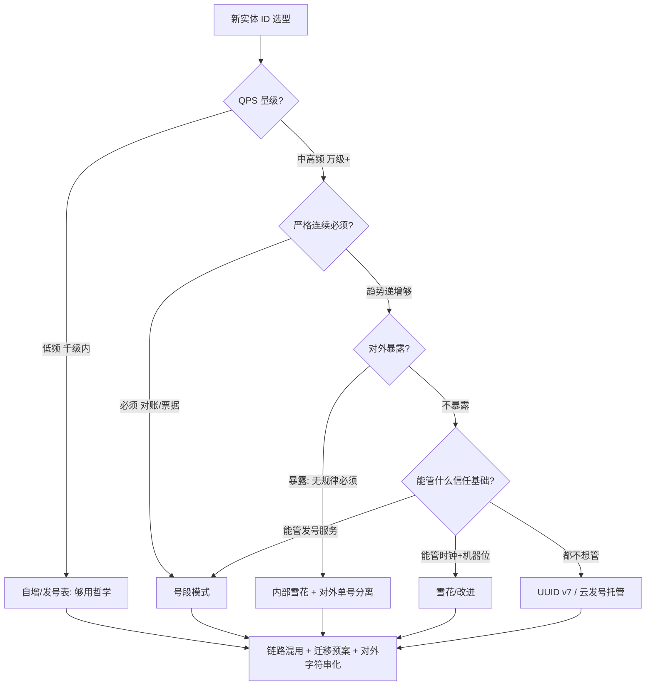

# 分布式 ID 选型决策

> **一句话摘要**：选型的决策变量收敛为五个——**QPS 量级、有序性要求、对外暴露、长度/类型约束、团队能管的信任基础（时钟/服务/协调中心）**——前四个是业务约束（翻译自首篇三诉求），第五个是现实约束；本篇把 UUID/自增/号段/雪花/改进装进一棵决策树，并给出「主链雪花 + 运营号段 + 观测 UUID」的行业默认组合。

> **本文核心**：机制链 = **业务约束四问 → 排除法收敛 → 信任基础终审（愿管时钟选雪花、愿管服务选号段、都不愿选 UUID v7/托管）→ 对外 ID 另走单号设计 → 混用组合 + 迁移预案**——选型错误的高发点不在方案内部，在「没有显式回答第五问」。

前置阅读：[方案全景](./2_分布式ID方案全景-入门.md)与各方案篇（3-6）。三诉求定义见[首篇](./1_分布式ID是什么与为什么需要-入门.md)。

## 1. 背景：选型为什么容易变成信仰之争

「我们用雪花」「UUID 够了」「必须号段」——ID 选型的争论常退化为本位主义，因为**争论的双方没有先对齐约束**。QPS 千级和百万级的团队争论雪花与 UUID，等于不在一个物理世界。本篇的决策树先把约束显式化（四问 + 一审），让方案作为答案自然浮现——争论应该发生在「约束是什么」，而不是「方案是什么」。

## 2. 核心机制：五问决策树



五问逐条：

- **Q1 QPS 量级**：千级以内任何方案都够（包括自增）——这问淘汰「过度设计」；万级以上才进入真正的分布式 ID 语境。
- **Q2 严格连续**：票据号、发票号等监管场景要连续（号段段内连续/集中发号）；交易主键趋势递增即可（雪花）——「连续」二字的业务定义要逐字确认。
- **Q3 对外暴露**：ID 出现在 URL/单据上 → 无规律要求入场（内外双 ID 分离，首篇原则）；纯内部主键 → 有序性优先。
- **Q4 长度/类型**：下游只吃 BIGINT → 号段/雪花；JS 前端直传 → 字符串化纪律；128 位 UUID 的存储与索引代价要计入。
- **终审·信任基础（第五问，最易漏）**：每个方案的可用性押注不同——雪花押「时钟+机器位管理能力」、号段押「发号服务运维」、UUID 押「长度与索引容忍」、托管押「厂商依赖」——**选型 = 选你团队能管好的那种押注**；五问不回答，四问的答案就是空中楼阁。

## 3. 落地实践：行业默认组合 + 迁移预案

**默认组合**（多数业务系统的起点）：

```text
交易主键(分库):     雪花/改进  —— 高 QPS + 趋势递增 + 本地零依赖
运营/对账编号:      号段      —— 严格递增便于人工对账, 频率低付得起服务
对外单号:           规则单号(实战篇) —— 无规律 + 校验位 + 人类可读
TraceID/临时对象:   UUID v7   —— 接入零成本, 无序可接受
```

**迁移预案**（从自增/UUID 迁出的标准路径）：

1. **双轨期**：新数据用新 ID，存量保留旧 ID（值域不重叠——雪花值域远大于自增）。
2. **查询兼容**：接口层同时接受新旧 ID（格式判断路由）。
3. **对外恒定**：对外单号不变（映射层吸收内部 ID 的变更）——外部无感是迁移的红线。
4. **下线旧路径**：存量数据归档完毕、双轨查询占比归零后下线。

## 4. 生产视角：选型失误的复盘形态

- **按「技术先进」全上雪花，结果没人管时钟**：回拨防护缺失 + 时钟监控没有——撞号事故后回看，「第五问」当时无人回答。修复顺序：先补防护与监控（止损），再评估是否真的需要雪花（可能号段更合适）。
- **低频系统强行发号服务**：QPS 50 的内部系统搭了一套 Leaf 集群——发号服务成为新的故障点与运维负担。「够用哲学」的缺失是过度设计的高发区。
- **对外 ID 直接用内部主键**：上线一年被安全审计标记「可枚举」——内外分离的返工（映射表 + 全链路改造）比第一天分离贵十倍。
- **混用无全局规范**：三个团队各自选型，一个订单三个 ID 字段（雪花主键 + 号段流水 + UUID trace）互相没有关联规范——混用的前提是**编号规范**（谁在哪用哪个、如何关联），不是各选各的。

## 5. 主流系统怎么做：业界组合案例的机制级归纳

| 业界形态 | 组合 | 机制级原因 |
|---|---|---|
| 电商交易 | 雪花主键 + 规则单号 + 对账号段 | 高并发主键本地化、对外安全、对账严格 |
| 内容/社交 | UUID v7 或雪花（对象 ID） | 无严格连续需求，通用性优先 |
| 金融核心 | 集中发号/号段 + 流水号规则 | 严格连续 + 可审计 + 差错定位（实战篇） |
| SaaS 多租户 | 雪花（租户位预留切分） | 位切分天然带租户隔离语义 |

规律：**组合是终态**——公开架构分享里几乎找不到「全公司一个 ID 方案」的案例；差异在组合的形态，共性在「按链路分级」。

## 6. 典型场景

- **新系统立项**（绿地级）：五问全流程 + 默认组合起点——从简起步，按量级演进。
- **存量改造**（迁移级）：迁移四步预案（双轨/兼容/恒定/下线）——对外单号恒定是红线。
- **架构评审**（守门级）：五问 checklist 过堂——第五问（信任基础）无人回答的选型直接退回。

## 7. 与相邻概念的区别

- **本篇 vs 方案全景（篇 2）**：全景是分类学（方案有哪些、机制差在哪），本篇是决策学（约束怎么翻译成选择）——知识与操作。
- **本篇 vs 首篇三诉求**：三诉求是「评价维度」，五问是「度量方式」——把维度变成可答的问题，选型才可操作。
- **选型 vs 单号设计（篇 8）**：内部 ID 选型与对外单号设计是两条线——混用组合里两者并存，决策树只管前者。
- **选型决策 vs 一致性选型（理论系列）**：同一方法论（约束翻译→排除法→信任基础终审）在两个组件域的重演——学过一遍，这遍很快。

## 8. 常见误区与不适用

- **「先选方案再补约束」**：顺序反了——约束四问五分钟答完，方案换了五次都来得及；先锁方案会让约束「迁就方案」被合理化。
- **「第五问可以以后再说」**：信任基础的运维义务从第一天就开始累积（时钟监控、机器位分配表、发号服务告警）——「以后再说」累积的是无主运维债。
- **「混用 = 混乱」**：混乱来自「无规范的混用」——编号规范（命名/关联/使用场景）一张表就能治理；统一的诱惑要抵制。
- **「迁移必须一次到位」**：双轨期是大爆炸迁移的解药——对外恒定 + 值域隔离 + 查询兼容三件套齐了，迁移就是流水作业。
- **不适用**：单库小系统（自增，决策树一问即出）；纯内部临时标识（UUID 最省，无需五问全流程）。

## 9. 你们可能会问

- **五问最快多久答完？** 团队对齐良好时一次会议 30 分钟——QPS/暴露/长度看需求文档，连续性问业务方，信任基础问运维；答不完说明前置信息缺失，那本身就是发现。
- **「云发号服务」可信吗？** 机制上可用（托管了号段/雪花的运维），代价是延迟、绑定与配额——把「厂商依赖」当第五问的一种押注来评估，而不是默认信任或默认拒绝。
- **存量系统怎么补「编号规范」？** 盘点现有全部 ID（主键/单号/流水）→ 画关系图（谁关联谁）→ 补文档 + 新增 ID 走规范审批——盘点本身常能发现重复建设的 ID。
- **雪花和号段能互为降级吗？** 能且值得设计：发号服务故障时降级本地雪花（语义差异告知下游）、雪花时钟故障时降级号段——互为备份的代价是下游要兼容两种 ID 格式，按业务容忍度定。
- **怎么评审别人的 ID 选型？** 五问答案逐条核对 + 三个硬检查：对外字符串化了吗、内外分离了吗、防护/监控配套了吗——三检查缺一退回。

## 10. 一句话总结 + 5W 速记卡 + 自测三问

**🎯 核心带走**：

- **核心一句话**：ID 选型 = 业务约束四问 + 信任基础终审——方案是答案，约束是问题；混用是常态，规范是前提。
- **链条复述**：QPS → 连续性 → 暴露 → 长度 → 信任基础 → 决策树出方案 → 默认组合分配链路 → 迁移预案 + 编号规范收口。
- **失效点与边界**：单库一问即出；第五问不答 = 选型悬浮；迁移红线是对外恒定。

**5W 速记卡**：

| 维度 | 内容 |
|---|---|
| What | 五问决策树 + 默认组合 + 迁移四步 |
| Why | 争论源于约束未对齐；第五问（信任基础）是高发遗漏 |
| When | 新实体立项、存量改造、架构评审 |
| Where | 各业务链路的 ID 分配与编号规范 |
| How | 约束翻译 → 排除收敛 → 信任终审 → 混用 + 规范 |

💡 **实战提示**：评审三硬检查（字符串化/内外分离/防护配套）；对外恒定是迁移红线；互为降级要下游兼容评估。

**开放问题**：云托管与 v7 标准普及后，「信任基础」这问的答案会不会趋同——ID 选型会退化成「长度与语义」的两问吗？

**决策（何时用）**：一切新 ID 需求的立项与评审；推荐五问 checklist 固化进团队设计模板，推荐默认组合作为讨论起点（改它比从零发明快）。

**Trade-off（代价与反方案）**：结构化选型用「流程」换「可追溯与少返工」；反方案——拍板（快，风险未知）、跟随大厂（省思考，机房现实可能不同）、全托管（省运维，代价绑定）；混用与统一之争：显式的多方案 vs 隐藏的单方案债，前者赢在长期。

**演进视角**：ID 选型从「用什么算法」演进到「管什么信任基础」——方案饱和后，决策的重心永远落在约束与运维现实上；这一趋势与全仓库所有组件域的选型学同构。

---

**下篇预告**：对外的那一个 ID 怎么设计——下一篇[订单号流水号设计实战](./8_订单号流水号设计实战-入门.md)讲规则单号的结构、校验位与防伪。

---


## 📌 数据与事实声明

本文决策框架为全系列方案公开机制的工程化归纳；业界组合形态综合自电商/金融领域公开架构分享（机制级概括，不指向具体公司）；迁移路径为通用工程实践。以自身业务验证为准。

## 📚 参考资料

| 类型 | 标题 | 来源 |
|---|---|---|
| 系列文章 | 方案全景 / 各方案篇（本系列 2-6） | 本仓库同系列 |
| 系列文章 | 一致性方案选型（方法论同构） | 本仓库 distributed-theory/ |
| 方法 | Architecture Decision Records | adr.github.io |
