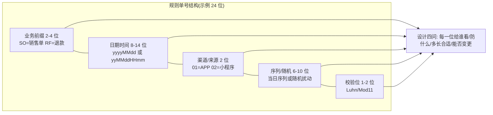
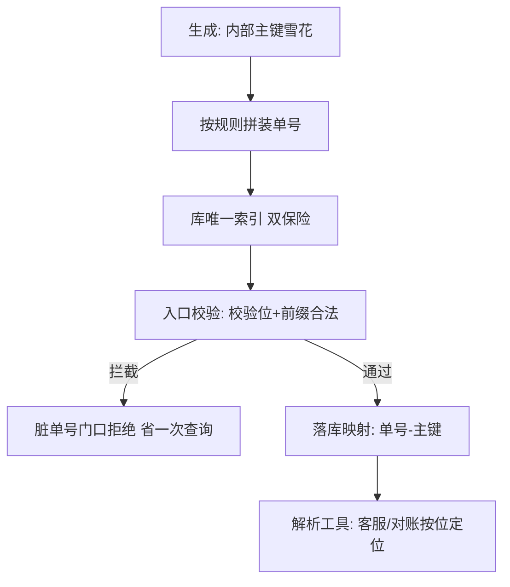

# 订单号流水号设计实战

> **一句话摘要**：对外订单号/流水号是「另一个 ID」——它不追求唯一性算法（内部主键已保证），追求的是**人类可读、防枚举、可定位、防伪**：规则单号 = 「业务前缀 + 时间 + 来源 + 随机/序列 + 校验位」的结构化拼装；本篇是全系列的实战收束——内部 ID 与对外单号的分离设计、规则位怎么切、校验位怎么算、防伪与风控怎么配合。

> **本文核心**：机制链 = **内外分离（主键管唯一、单号管表达）→ 结构化拼装（每位都有业务含义）→ 校验位防手误 → 扰动防枚举 → 可解析定位（客服/对账按号路由）**——单号的每一位都是「给某个读者（人/系统/风控）」设计的，没有装饰位。

前置阅读：[分布式 ID 是什么与为什么需要](./1_分布式ID是什么与为什么需要-入门.md)（内外双 ID 原则）。内部 ID 的生成用全系列任何方案（雪花/号段）——单号与之分离。

## 1. 背景：为什么对外单号不能直接用内部 ID

> 量级分档意识：本文方法在十万级 QPS、千万级用户、亿级流量的场景下均需重新评估——量级变化时架构与参数需同步调整。

内部主键（雪花/自增）的三项特征在「对外」语境全部变味：

- **可枚举**：连续/趋势递增的 ID 暴露业务规模，且可被遍历爬取（首篇的信息安全诉求）；
- **无校验**：用户手输一位错，系统无法察觉——查无此单的客诉从「输入错误」开始；
- **无语义**：客服/运营看到一个裸数字，无法直接判断「哪个业务线、哪天、哪个渠道」——定位靠查库。

对外单号的设计目标因此反转：**不是给机器效率（那是主键的事），是给人与风控效率**——可读、可定位、可校验、不可猜。

## 2. 核心机制：结构化拼装与校验位

**逐位设计要点**：

- **业务前缀**：跨系统排障第一眼分流（退款单 vs 销售单走不同队列）；前缀表全局登记（新增业务线申请新前缀——编号规范的落点）。
- **时间位**：粒度按单量定——日粒度（yyyyMMdd，8 位）配足够序列位；秒级高频场景用 yyMMddHHmmss。**注意时区与“按自然日重置序列”的约定要写进规范**。
- **来源/渠道位**：客服定位「这是哪个入口的单」、风控按渠道做规则——2 位字符码性价比极高。
- **序列/随机位**：段内区分同秒单据；**随机成分决定防枚举强度**（纯序列可猜，随机 8 位以上则不可遍历）；随机源用发号器（号段/雪花序列位）而非随机数——保证段内唯一。
- **校验位**：Luhn（信用卡同款，检 1 位错误与相邻换位）或 Mod11（检错率更高）——「用户抄错一位」在入口即被拦截，客服工单量骤降。

追问链：**为什么不用纯随机串（安全最高）？**——丢失可定位性（日期/渠道解析不出来）与可读性（客服报单号）；**为什么位宽别超长？**——用户要抄写/口述，20-24 位是体验上限（行业惯例）；**时间位会不会泄露规模？**——泄露「何时活跃」但不含总量；防规模泄露靠「无总量含义」（序列当日重置）+ 无规律随机位，两者配合。

## 3. 落地实践：从设计到落地

1. **写单号规范文档**：每一位的定义、前缀表、序列重置规则、校验算法、有效期约定（多久可复用）——单号规范是与「编号规范」（选型篇）并列的文档资产。
2. **生成实现**：内部主键（雪花）生成 → 按规则拼装单号 → 唯一性双保险（结构唯一 + 库唯一索引）→ 单号与主键的映射落库。
3. **入口校验**：所有对外接口先过校验位 + 前缀合法性——脏单号在门口拦截（省一次查询）。
4. **可解析工具化**：内部工具输入单号直接输出「业务线/时间/渠道」——客服与对账的日常效率工具，也是规范执行的试金石（解析不出来的位=死位）。

## 4. 生产视角：单号设计失误的形态

- **序列当日重置后撞号**：序列按日重置但唯一索引没含日期位（或跨年逻辑漏改）——同日序列循环撞号。规范里「重置粒度」与唯一约束的覆盖范围必须一一对应。
- **时间位用了本地时钟跨机房不一致**：异地多活的两个机房生成的单号时间位相差（时钟偏差/时区配置不一）——按时间位对账出现「昨天的单子在今天的段里」。时间位用 UTC 或统一时区写入规范。
- **前缀表失控**：各团队自造前缀（两个业务线都用 "SO"）——排障分流失效。前缀申请-登记-唯一性检查要进编号规范的治理流程。
- **校验位算法选错**：含字母的单号用了只支持数字的 Luhn——校验形同虚设；字母数字混合单号用 Mod 37,2 一类扩展算法。

## 5. 主流系统怎么做：行业单号形态对照

| 形态 | 结构特征 | tips |
|---|---|---|
| 快递运单 | 前缀 + 长序列 + 校验位 | 扫码场景为主，位宽偏长但可扫 |
| 支付流水号 | 渠道码 + 时间 + 序列 + 校验 | 对账与差错定位是首要设计目标（与[对账篇](../../../distributed-transaction/入门层/从零开始认识分布式事务系列/11_最终一致性与对账-入门.md)的核销键衔接） |
| 电商订单号 | 时间 + 渠道 + 序列 | 客服可读与防枚举平衡 |
| 银行回单号 | 分支机构码 + 日期 + 序列 + 校验 | 审计定位优先，位宽最长 |

规律：**单号结构 = 「该业务最高频的读者」决定的**——客服主导选可读、对账主导选可解析、风控主导选防伪；先问读者再切位。

## 6. 典型场景

- **电商订单号**（零售级）：时间 + 渠道 + 随机序列 + 校验位——客服与用户体验平衡的经典切法。
- **支付流水号**（资金级）：渠道位 + 强时间位 + 核销友好——对账键的质量决定差错处理速度（金融实战篇的三本账靠它串）。
- **工单/合同号**（合规级）：机构码 + 类型 + 序列 + 强校验——审计定位与防篡改优先。

## 7. 与相邻概念的区别

- **单号 vs 内部主键**：读者不同（人/风控 vs 数据库）——分离设计（首篇原则）的落地形态；两者用映射表关联。
- **校验位 vs 加密签名**：校验位防「无意错误」（抄写/传输），签名防「有意伪造」——威胁模型不同；防伪等级高的场景两者都要（校验位给用户、签名给系统）。
- **规则单号 vs 纯随机单号**：可解析 vs 防猜测的极致——纯随机的定位性丧失（只能全库查），规则单号的枚举风险靠随机位长度压低；按「读者需求 vs 风控需求」的权重切。
- **本篇 vs ID 选型（篇 7）**：选型管「内部 ID 的机制」，本篇管「对外表达的设计」——决策树选完内部方案，单号规范独立设计。

## 8. 常见误区与不适用

- **「单号越长越安全」**：长度与安全非线性（随机位才是熵源）——位宽超标伤害可读性与录入，安全靠随机位与校验位结构。
- **「时间位用本地日期就行」**：跨机房时区/时钟偏差让时间位失真——时区进规范、写入统一；时间位是「定位锚」不是「事实时间」（业务时间另有字段）。
- **「校验位可有可无」**：它是投入产出比最高的一位——拦截手误的成本一位，收益是客诉与误查的持续下降。
- **「单号规范写完就完事」**：规范的生命力在治理——前缀申请流程、解析工具、规范评审会；无治理的规范半年就漂移。
- **不适用**：内部系统间标识（主键直用，无需单号层）；扫码为主、无需人工读的单据（位宽约束放松，结构可简化）。

## 9. 你们可能会问

- **校验位算法怎么选？** 纯数字单号选 Luhn（简单普及）或 Mod11（检错更强）；含字母选 Mod 37,2 一类——判据是「字母表」与「要拦截的错误类型」（单错/相邻换位）。
- **单号会重复吗，唯一性靠什么？** 结构唯一（时间+序列+随机）+ 数据库唯一索引双保险——结构与约束必须覆盖同一粒度（同日重置序列则索引含日期位）。
- **随机位的熵怎么估算够不够？** 防枚举强度 ≈ 随机位组合数 ÷ 单位时间可尝试次数——按「攻击者每天能试多少次」倒推随机位宽；8 位字母数字混合是常见安全起点。
- **历史单号规则要变更怎么办？** 版本化：新规则只管新单（前缀或时间位天然分段），老单按老规则解析——解析工具支持多版本规则并存；禁止「改规则补历史」。
- **单号要能反解出内部主键吗？** 不要——可反解 = 可枚举内部空间；映射表查询才是正解（多一跳查询，买断安全与解耦）。

## 10. 一句话总结 + 5W 速记卡 + 自测三问

**🎯 核心带走**：

- **核心一句话**：对外单号 = 结构化拼装的业务表达——每位都有读者（人/系统/风控），校验位防手误、随机位防枚举、可解析定位、规范治理保鲜。
- **链条复述**：内外分离 → 按读者切位（前缀/时间/渠道/序列/校验）→ 双保险唯一 → 入口校验 → 解析工具 + 规范治理。
- **失效点与边界**：内部系统不需要；重置粒度与唯一约束错位=撞号；前缀无治理=分流失效。

**5W 速记卡**：

| 维度 | 内容 |
|---|---|
| What | 结构化拼装 + 校验位 + 内外分离 + 规范治理 |
| Why | 对外语境要可读/可定位/防枚举/防手误——内部 ID 全都不给 |
| When | 对外单据/流水/凭证类实体的设计期 |
| Where | 用户界面、客服系统、对账系统、风控规则 |
| How | 定读者 → 切位 → 选校验算法 → 双保险唯一 → 规范治理 |

💡 **实战提示**：重置粒度与唯一索引一一对应；时间位统一时区；前缀表走申请治理；解析工具是规范执行的试金石。

**开放问题**：扫码与 API 普及后，「人类可读」的价值会持续贬值吗——单号的读者重心从人转向风控后，结构会怎么变？

**决策（何时用）**：一切对外凭证类 ID 推荐规则单号；内部标识推荐直接主键；推荐「单号规范 + 前缀治理 + 解析工具」三件套作为对外 ID 的标配交付物。

**Trade-off（代价与反方案）**：规则单号用「结构化位宽 + 规范治理」换「可读可定位防枚举」；反方案——纯随机（安全极致，定位性丧失）、纯序列（可读，泄露规模）、直接暴露主键（零成本，安全裸奔）；位宽权衡：用户体验上限（20-24 位）vs 随机熵需求，两者挤压语义位的预算。

**演进视角**：单号设计从纯序列（账本时代）到加校验位（支付卡时代）到结构化拼装 + 防枚举（电商时代）——读者结构的变化（人→系统→风控）持续重塑位结构；「每位都有读者」是设计不变式。

---

## 本系列全 8 篇收官

问题定义（1）→ 全景（2）→ 数据库系（3-4）→ 雪花系（5-6）→ 选型（7）→ 实战（8）——内部 ID 的机制谱系与对外单号的表达设计已闭环；配套关系：分库分表背景见[分布式系统设计系列](../../../distributed-system-design/入门层/从零开始认识分布式系统系列/8_高扩展设计-入门.md)，时钟公理见[分布式时钟篇](../../../distributed-theory/入门层/从零开始认识分布式理论系列/9_分布式时钟-入门.md)。

---

## 📌 数据与事实声明

本文结构化拼装与校验位算法（Luhn/Mod11/Mod 37,2）为公开标准与行业惯例；位宽/熵估算为通用安全工程认知；行业单号形态为公开体系的机制级概括，不指向具体机构。以自身业务验证为准。

## 📚 参考资料

| 类型 | 标题 | 来源 |
|---|---|---|
| 标准 | ISO 7064（校验字符系统）/ Luhn algorithm | 公开标准与算法资料 |
| 系列文章 | 本系列 1-7 篇 | 本仓库同系列 |
| 系列文章 | 最终一致性与对账（核销键衔接） | 本仓库 distributed-transaction/ |
