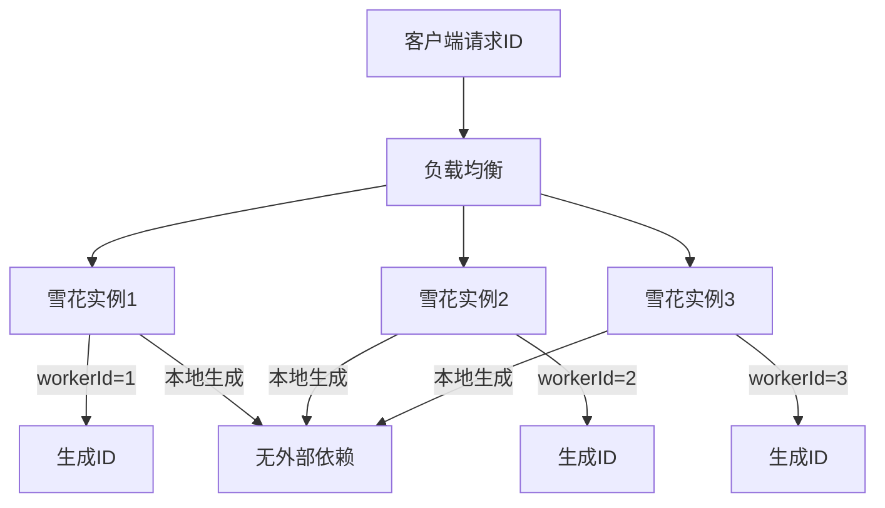

# 从零实现分布式 ID 生成器（号段 + 雪花）

> **一句话摘要**：用代码实现两种 ID 生成机制——号段（DB 分配）和雪花（本地生成），理解各自的工程实践。
> **本文核心**：**实现 = ID 生成器 + 分配策略 + 缓存优化**。

前置阅读：[号段模式](../分布式ID/入门层/从零开始认识分布式ID系列/4_号段模式-入门.md)、[雪花算法深度解析](./特性层/深入理解雪花系列/1_雪花算法深度解析-特性.md)。本篇将理论转化为可运行代码。

## 1. 背景：为什么要实现

> 量级分档意识：本文方法在十万级 QPS、千万级用户、亿级流量的场景下均需重新评估——量级变化时架构与参数需同步调整。


看懂 ID 算法不等于会用——实现过程才能理解：

- 号段的 DB 压力如何优化
- 雪花算法的性能瓶颈在哪
- 两种机制怎么选

## 2. 核心机制：号段模式实现

### 2.1 号段分配器

```java
// 号段分配器
public class SegmentIdGenerator {
    
    // 号段缓存
    private LoadingCache<String, Segment> segmentCache;
    
    // DB 中的号段表
    // CREATE TABLE id_segment (
    //     biz_type VARCHAR(32) PRIMARY KEY,  -- 业务类型
    //     max_id BIGINT,                       -- 当前最大ID
    //     step INT,                            -- 号段步长
    //     delta INT,                           -- 步长增量
    //     version INT                          -- 版本号（乐观锁）
    // );
    
    public long nextId(String bizType) {
        Segment segment = segmentCache.get(bizType);
        
        if (segment.isExhausted()) {
            // 号段耗尽，从DB获取新的
            segment = fetchNewSegment(bizType);
            segmentCache.put(bizType, segment);
        }
        
        return segment.generateId();
    }
    
    private Segment fetchNewSegment(String bizType) {
        // DB 乐观锁更新
        int updated = db.update(
            "UPDATE id_segment SET max_id = max_id + step, version = version + 1 " +
            "WHERE biz_type = ? AND version = ?",
            bizType, currentVersion
        );
        if (updated == 0) {
            // 冲突，重试
            return fetchNewSegment(bizType);
        }
        return new Segment(startId, step);
    }
}
```

### 2.2 双 Buffer 优化

```java
// 双 Buffer 模式：后台异步加载新号段
public class SegmentIdGenerator {
    
    private Segment currentSegment;   // 当前号段
    private Segment nextSegment;      // 下一个号段（预加载）
    
    public long nextId(String bizType) {
        if (currentSegment.isExhausted()) {
            // 当前号段耗尽，切换到下一个
            currentSegment = nextSegment;
            // 异步预加载新的号段
            preloadNewSegment(bizType);
        }
        return currentSegment.generateId();
    }
    
    private void preloadNewSegment(String bizType) {
        // 异步从DB获取新号段
        executor.submit(() -> {
            nextSegment = fetchNewSegment(bizType);
        });
    }
}
```

**双 Buffer 优势**：
- 请求时不需要等 DB
- DB 压力降低到原来的 1/step
- 预加载消除毛刺

## 3. 核心机制：雪花算法实现

### 3.1 雪花 ID 生成器

```java
// 雪花算法实现
public class SnowflakeIdGenerator {
    
    private static final long EPOCH = 1609459200000L; // 2021-01-01
    private static final long WORKER_BITS = 10L;
    private static final long SEQUENCE_BITS = 12L;
    
    private static final long MAX_WORKER_ID = ~(-1L << WORKER_BITS); // 1023
    private static final long MAX_SEQUENCE = ~(-1L << SEQUENCE_BITS); // 4095
    
    private long workerId;
    private long sequence = 0L;
    private long lastTimestamp = -1L;
    
    public SnowflakeIdGenerator(long workerId) {
        this.workerId = workerId;
    }
    
    public synchronized long nextId() {
        long timestamp = System.currentTimeMillis();
        
        // 时钟回拨检测
        if (timestamp < lastTimestamp) {
            throw new RuntimeException("时钟回拨: " + (lastTimestamp - timestamp) + "ms");
        }
        
        if (timestamp == lastTimestamp) {
            sequence = (sequence + 1) & MAX_SEQUENCE;
            if (sequence == 0) {
                // 序列位耗尽，等待下一毫秒
                timestamp = tilNextMillis(lastTimestamp);
            }
        } else {
            sequence = 0L;
        }
        
        lastTimestamp = timestamp;
        
        // 64位结构: timestamp - epoch << 22 | workerId << 12 | sequence
        return ((timestamp - EPOCH) << (WORKER_BITS + SEQUENCE_BITS))
                | (workerId << SEQUENCE_BITS)
                | sequence;
    }
    
    private long tilNextMillis(long lastTimestamp) {
        long timestamp = System.currentTimeMillis();
        while (timestamp <= lastTimestamp) {
            timestamp = System.currentTimeMillis();
        }
        return timestamp;
    }
}
```

### 3.2 性能优化

```java
// 优化：原子类保证线程安全 + 时间戳缓存
public class OptimizedSnowflake {
    
    private final AtomicLong lastTimestamp = new AtomicLong(-1);
    private final AtomicLong sequence = new AtomicLong(0);
    private final long workerId;
    
    // 使用 System.nanoTime() 减少时间戳获取开销
    public long nextId() {
        long timestamp = System.currentTimeMillis();
        long seq = sequence.get();
        long lastTs = lastTimestamp.get();
        
        if (timestamp == lastTs) {
            seq = (seq + 1) & MAX_SEQUENCE;
            if (seq == 0) {
                timestamp = tilNextMillis(lastTs);
            }
        } else {
            seq = 0;
        }
        
        if (lastTimestamp.compareAndSet(lastTs, timestamp)) {
            sequence.set(seq);
            return ((timestamp - EPOCH) << 22) | (workerId << 12) | seq;
        }
        return nextId(); // CAS 失败重试
    }
}
```

## 4. 落地实践：完整实现

### 4.1 架构设计



### 4.2 两种机制混合使用

```java
// 混合ID生成器：内部用雪花，对外用业务号
public class MixedIdGenerator {
    
    private SnowflakeIdGenerator snowflake;
    private SegmentIdGenerator segment;
    
    // 内部ID（雪花）：用于数据库索引
    public long generateInternalId() {
        return snowflake.nextId();
    }
    
    // 对外ID（号段）：用于业务展示
    public String generateExternalId(String bizType) {
        long id = segment.nextId(bizType);
        return bizType + "-" + id;
    }
}
```

## 5. 生产视角：实现踩坑

- **踩坑 1**：单点雪花——单实例有性能瓶颈，需要多实例
- **踩坑 2**：机器位分配——如何保证 workerId 唯一
- **踩坑 3**：时钟回拨——NTP 校准导致
- **踩坑 4**：号段耗尽——DB 挂了无法获取新号段
- **踩坑 5**：ID 乱序——雪花在同一毫秒内序列乱序

**生产最佳实践**：

1. 雪花多实例部署（每台机器一个 workerId）
2. 号段使用双 Buffer
3. 时钟回拨四级防护
4. 监控 ID 生成速率
5. 内部 ID 用雪花，对外用号段

## 6. 典型场景

| 场景 | 方案 | 理由 |
|---|---|---|
| 订单ID | 雪花 | 趋势递增，全局唯一 |
| 追踪ID | 雪花 | 全局唯一，短 |
| 内部流水号 | 雪花 | 性能要求高 |
| 对外单号 | 号段 | 可读、可格式化 |
| 金融交易号 | 混合 | 雪花 + 业务前缀 |

## 7. 你们可能会问

- **雪花和号段能混用吗？** 能——内部用雪花，对外用号段
- **雪花 ID 能保证趋势递增吗？** 趋势递增，但同一毫秒内乱序
- **机器位耗尽怎么办？** 扩展到多 bit 或用 IP
- **DB 挂了号段还能用吗？** 号段耗尽后不能用——需要缓存机制

## 8. 一句话总结 + 5W 速记卡 + 自测三问

**一句话总结**：实现 = 号段（DB分配）+ 雪花（本地生成）——混合使用是最佳实践。

**5W 速记卡**：

| 维度 | 内容 |
|---|---|
| What | 号段 + 雪花 |
| Why | 理解两种机制的工程实践 |
| When | 实现阶段 |
| Where | 所有分布式系统 |
| How | 号段(DB+双buffer) + 雪花(位运算) |

**自测三问**：

1. 你的号段用双 Buffer 了吗？
2. 你的雪花处理时钟回拨了吗？
3. 你的内部 ID 和对外单号分别用什么？

---

**整合层完结**：从零实现分布式 ID 生成器的完整实践已建立。

**🎯 核心带走**：

- **核心一句话**：内部ID用雪花（趋势递增），对外单号用号段（可读）——混合使用
- **链条复述**：号段(DB分配+双buffer) / 雪花(位运算+时钟回拨防护)
- **失效点与边界**：号段DB不可用；雪花时钟回拨

💡 **实战提示**：混合使用是生产常态——雪花给机器用，号段给人用。

**开放问题**：分布式 ID 能完全去中心化吗？答案是：能——Redis 分布式 ID、ZooKeeper 分配 workerId 都是方案。

**决策（何时用）**：趋势递增用雪花；对人可读用号段；金融用混合。

## 📌 数据与事实声明

- 写于 2026-09-11
- 免责：以官方文档为准

## 📚 参考资料

| 类型 | 标题 | 来源 |
|---|---|---|
| 官方文档 | 官方文档 | 官方站点 |
