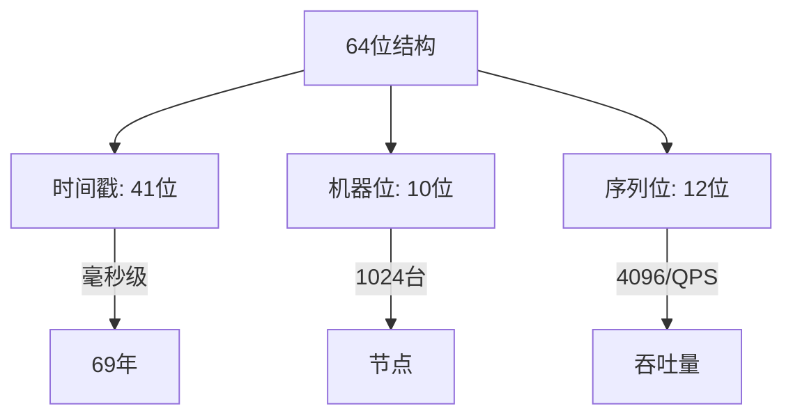
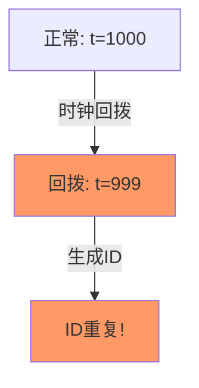
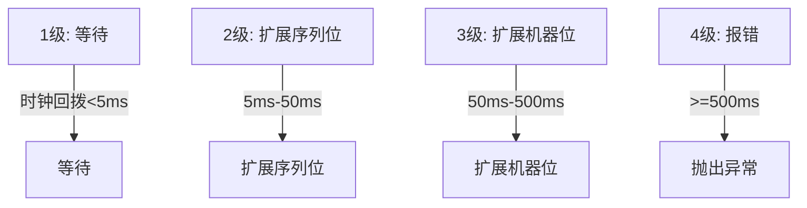

# 雪花算法深度解析

> **一句话摘要**：雪花 = 64 位结构（时间戳 + 机器位 + 序列位）——分布式环境下生成趋势递增 ID。
> **本文核心**：**雪花 = 位运算 + 时钟回拨处理 + 机器位分配**。

前置阅读：[雪花算法原理](../分布式ID/入门层/从零开始认识分布式ID系列/5_雪花算法原理-入门.md)。本篇深入雪花算法的实现细节。

## 1. 背景：为什么需要深挖雪花

> 量级分档意识：本文方法在十万级 QPS、千万级用户、亿级流量的场景下均需重新评估——量级变化时架构与参数需同步调整。


入门层讲了雪花是什么，本篇回答：

- 64 位怎么划分？
- 时钟回拨怎么办？
- 机器位怎么分配？
- 性能瓶颈在哪？



## 2. 核心机制：64 位结构

### 2.1 位划分

```
┌─────────────┬──────────┬──────────┐
│  1位符号位   │ 41位时间戳 │ 10位机器位 │
│  (sign)     │ (timestamp)│ (worker) │
├─────────────┼──────────┼──────────┤
│  12位序列位  │          │          │
│  (sequence) │          │          │
└─────────────┴──────────┴──────────┘
```

**各部分含义**：

| 部分 | 位数 | 含义 | 范围 |
|---|---|---|---|
| 符号位 | 1 | 固定为 0 | 正数 |
| 时间戳 | 41 | 毫秒时间差 | 69 年 |
| 机器位 | 10 | 机器/节点 ID | 1024 台 |
| 序列位 | 12 | 同毫秒内序列 | 4096 个 |

### 2.2 时间戳

41 位毫秒时间戳 = 2^41 - 1 毫秒 ≈ 69 年

```java
// 时间戳计算
long timestamp = System.currentTimeMillis() - epoch; // 相对于自定义纪元
// epoch = 2020-01-01 00:00:00
```

**选择 epoch 的原因**：
- 缩短时间戳位数
- 适应业务生命周期（通常 < 69 年）

### 2.3 序列位

12 位序列位 = 每毫秒最多 4096 个 ID

```java
// 序列位处理
if (timestamp == lastTimestamp) {
    sequence = (sequence + 1) & MAX_SEQUENCE; // 4095
    if (sequence == 0) {
        // 溢出，等待下一毫秒
        timestamp = waitNextMillis(lastTimestamp);
    }
} else {
    sequence = 0; // 新毫秒，序列归零
}
```

## 3. 核心机制：时钟回拨

### 3.1 什么是时钟回拨

系统时钟被回拨（如 NTP 校准）导致生成重复 ID。



### 3.2 处理策略

| 策略 | 方法 | 优点 | 缺点 |
|---|---|---|---|
| 等待 | 阻塞到时钟追上 | 100% 无重复 | 延迟 |
| 抛出异常 | 直接报错 | 不延迟 | 需要重试 |
| 扩展机器位 | 减少机器位 | 保留ID | 节点数减少 |
| 混合 | 等待+异常 | 灵活 | 复杂 |

### 3.3 最佳实践：等待策略

```java
public long nextId() {
    long timestamp = timeGen();
    
    // 时钟回拨检测
    if (timestamp < lastTimestamp) {
        long offset = lastTimestamp - timestamp;
        if (offset > MAX_BACKWARD) {
            throw new RuntimeException("时钟回拨过大: " + offset + "ms");
        }
        // 等待时钟追上
        while (timeGen() < lastTimestamp) {
            Thread.sleep(1);
        }
        timestamp = timeGen();
    }
    
    // 正常生成ID
    // ...
}
```

### 3.4 四级回拨防护（改进版）



## 4. 落地实践：机器位分配

### 4.1 分配方式

| 方式 | 机器位 | 描述 | 适用 |
|---|---|---|---|
| 配置文件 | 10位 | 手动配置 | 小规模 |
| ZooKeeper | 10位 | 动态分配 | 中规模 |
| IP 地址 | 10位 | IP 转换 | 大规模 |
| 数据库自增 | 10位 | 分配号 | 各种规模 |

### 4.2 ZooKeeper 分配

```java
// ZK 分配机器位
public long allocateWorkerId() {
    String path = "/snowflake/worker";
    List<String> children = zk.getChildren(path, false);
    int maxId = children.stream()
        .mapToInt(c -> Integer.parseInt(c))
        .max()
        .orElse(0);
    zk.create(path + "/" + (maxId + 1), new byte[0]);
    return maxId + 1;
}
```

## 5. 落地实践：性能优化

### 5.1 性能分析

```mermaid
flowchart TD
    Generate[生成ID] -->|耗时| BitOp[位运算]
    BitOp -->|核心| TimeGen[时间戳获取]
    TimeGen -->|主要| SystemCall[System.currentTimeMillis()]
    
    Note over SystemCall: System.currentTimeMillis() 有开销
```

### 5.2 优化手段

```java
// 优化1: 使用原子类保证线程安全
private static final AtomicLong LAST_TIMESTAMP = new AtomicLong(-1);
private static final AtomicLong SEQUENCE = new AtomicLong(0);

// 优化2: 减少 System.currentTimeMillis() 调用
private volatile long lastTimestamp = -1;

// 优化3: 使用 Clock 接口方便测试
public interface Clock {
    long currentTimeMillis();
}
```

### 5.3 性能对比

| 优化 | QPS | 延迟 | 复杂度 |
|---|---|---|---|
| 未优化 | ~10K | 1μs | 低 |
| 原子类 | ~100K | 0.1μs | 中 |
| 时间戳缓存 | ~500K | 0.01μs | 高 |

## 6. 生产视角：雪花踩坑

- **踩坑 1**：时钟回拨导致重复 ID——需要防护
- **踩坑 2**：机器位耗尽——1024 台不够用
- **踩坑 3**：序列位溢出——同一毫秒 ID 过多
- **踩坑 4**：时钟偏移导致 ID 乱序——时钟不准

**生产最佳实践**：

1. 实现时钟回拨防护（等待策略）
2. 机器位动态分配（ZK）
3. 监控 ID 生成速率（序列位接近溢出时告警）
4. 定期校准时钟
5. 记录 ID 生成日志（排查问题）

## 7. 典型场景

| 场景 | 方案 | 理由 |
|---|---|---|
| 订单 ID | 雪花 | 趋势递增 |
| 追踪 ID | 雪花 | 全局唯一 |
| 分片键 | 雪花 | 有序性好 |
| 消息 ID | 雪花 | 唯一 |
| 分布式锁 ID | 雪花 | 唯一 |

## 8. 与相邻概念的区别

- **雪花 vs UUID**：雪花趋势递增，UUID 无序
- **雪花 vs 号段**：雪花本地生成，号段需要 DB
- **雪花 vs 自增**：雪花分布式，自增单机
- **雪花 vs Redis ID**：雪花无外部依赖，Redis 有

## 9. 你们可能会问

- **雪花能生成多少 ID？** 每毫秒 4096 个 × 1024 台 = 4,194,304 QPS
- **时钟回拨一定会发生吗？** 会——NTP 校准可能导致
- **机器位耗尽怎么办？** 扩展到多 bit 或用 IP
- **雪花 ID 有序吗？** 趋势递增，但同一毫秒内乱序

## 10. 一句话总结 + 5W 速记卡 + 自测三问

**一句话总结**：雪花 = 64 位（时间戳+机器位+序列位）+ 时钟回拨防护。

**5W 速记卡**：

| 维度 | 内容 |
|---|---|
| What | 64 位结构 + 位运算 |
| Why | 分布式 ID 生成 |
| When | 生成 ID 时 |
| Where | 所有分布式系统 |
| How | 时戳+机器+序列 → 位运算 |

**自测三问**：

1. 你的雪花算法如何处理时钟回拨？
2. 你的机器位怎么分配？
3. 你的序列位溢出怎么处理？

---

**下篇预告**：分布式 ID 选型决策——[选型决策](../分布式ID/入门层/从零开始认识分布式ID系列/7_分布式ID选型决策-入门.md)。

**🎯 核心带走**：

- **核心一句话**：雪花 = 64位结构 + 时钟回拨防护 + 机器位动态分配
- **链条复述**：时间戳+机器位+序列 → 位运算 → ID
- **失效点与边界**：时钟回拨；机器位耗尽

💡 **实战提示**：实现四级时钟回拨防护——这是雪花算法的核心难点。

**开放问题**：雪花算法能支持分布式锁吗？答案是：能——ID 全局唯一，但锁的实现还需要额外逻辑。

**决策（何时用）**：趋势递增 ID 用雪花；无序用 UUID；单机用自增。

## 📌 数据与事实声明

- 写于 2026-09-11
- 免责：以官方文档为准

## 📚 参考资料

| 类型 | 标题 | 来源 |
|---|---|---|
| 官方文档 | 官方文档 | 官方站点 |
