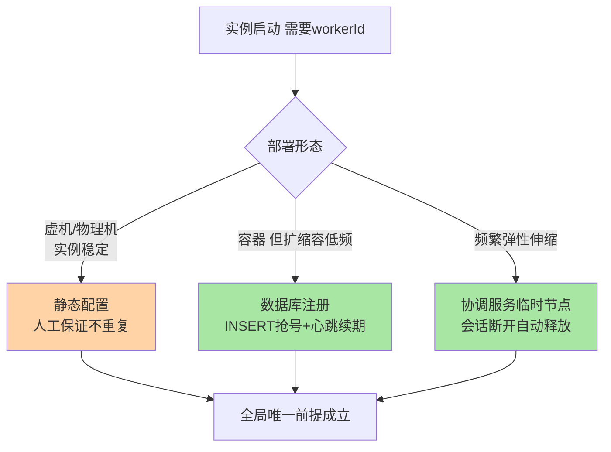
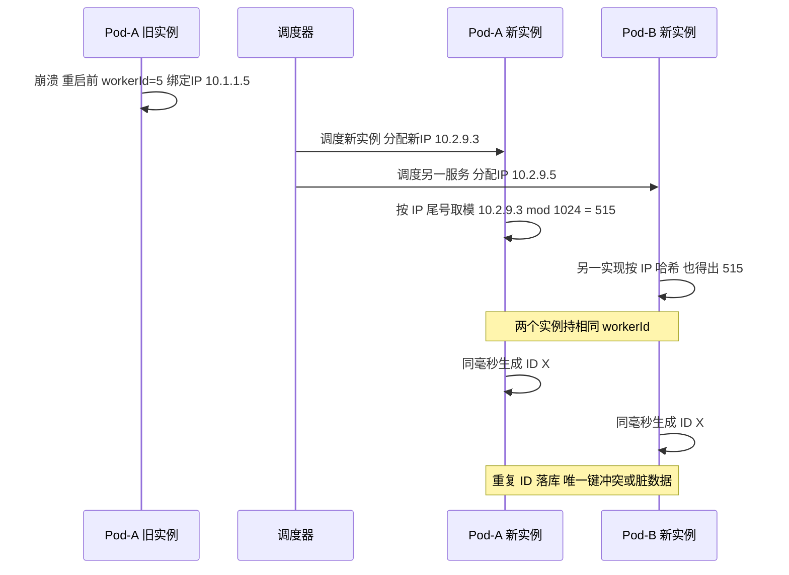
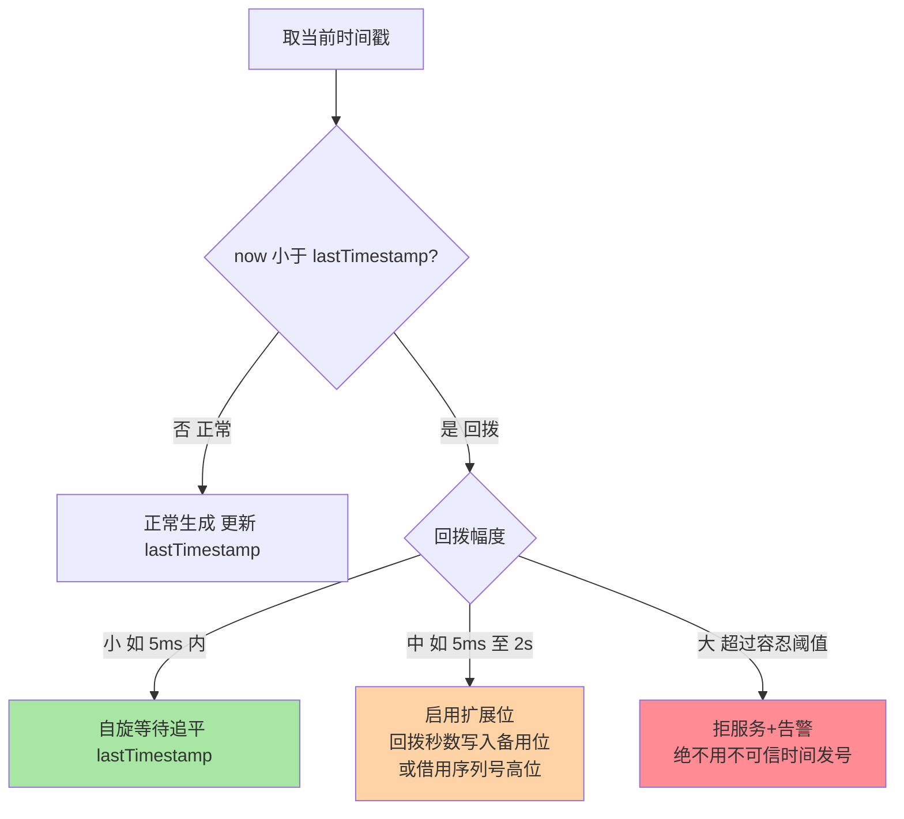

# 机器ID分配与容器化漂移：workerId 的注册、漂移与时钟

> 篇 1 讲清了雪花算法的 64 位结构，但真正的生产事故几乎都不在位运算里——而在**那 10 位机器位怎么分**：容器一重启 IP 就变了，按 IP 算 workerId 的服务立刻可能拿到一个别人也在用的编号，两台机器开始发出一模一样的 ID。这篇把 workerId 分配的三条路线、容器化漂移的事故形态、时钟回拨的防护与 K8s 环境的落地方案一次讲透。

## 一句话摘要

雪花算法的全局唯一性不靠算法本身，靠**workerId 全局不重复**这个前提——而这个前提在容器化时代被系统性削弱：IP 漂移让「按 IP 取模」失效、快速扩缩容让「静态配置」失效、镜像克隆让「进程内自增」失效。主流解法三条路线：**静态配置**（人工保证不重复）、**数据库注册**（INSERT 抢号 + 心跳续期）、**协调服务注册**（ZooKeeper/etcd 临时节点，断连自动释放）。时钟回拨是另一条独立的防线：检测到回拨就等待或借用扩展位，绝不能「当没看见」继续发号。**K8s 下最稳的组合是 StatefulSet 稳定序号 + 启动期注册校验 + 心跳续期**。

## 🎯 本文核心

**核心一句话：雪花的唯一性 = workerId 分配机制 + 时钟单调性两个前提，容器化同时攻击这两个前提——IP 漂移破坏 workerId 唯一性，宿主机时钟同步破坏单调性；分配机制的本质是「谁负责保证全局不重复」这个责任的归属（人工/数据库/协调服务），漂移事故的本质是「把易变的 IP 当成了稳定身份」。**

机制链：workerId 的三种责任归属（静态配置/数据库注册/临时节点）→ 容器重启的漂移链条（IP 变 → 推导变 → 撞号 → 重复 ID）→ 时钟回拨的检测与三档响应（等待/借用位/告警拒服）→ K8s 环境的稳定序号方案。全文一句话可重构：「**ID 唯一性的防线不在位运算，在身份管理——给实例一个稳定身份，比什么都重要**」。

## 前置阅读

- 本系列篇 1《[雪花算法深度解析](./1_雪花算法深度解析-特性.md)》：64 位结构与位运算细节
- 入门层《[雪花算法原理](../../入门层/从零开始认识分布式ID系列/5_雪花算法原理-入门.md)》：为什么需要分布式 ID

## 目标导向

本文是什么：workerId 分配机制与容器化漂移、时钟回拨的工程防线。功能是什么：让「为什么容器重启后 ID 重复了」「时钟回拨到底怎么处理」可归因、可预防。能得到什么：三条分配路线的选型依据、漂移事故的排查路径、时钟回拨的三档响应策略、K8s 落地的参数清单。为什么用：ID 生成服务的容器化改造、重复 ID 线上事故复盘、K8s 迁移评估，必看。

## 一、边界：篇 1 讲过什么，本文讲什么

| 内容 | 篇 1 | 本文 |
|---|---|---|
| 64 位结构划分与位运算 | ✅ 讲过 | 不重复 |
| workerId 怎么分配、谁保证唯一 | 提了一句 | **本文核心一** |
| 容器化 IP 漂移的事故形态 | 未讲 | **本文核心二** |
| 时钟回拨的检测与防护 | 提了一句 | **本文核心三** |
| K8s 环境的落地组合 | 未讲 | **本文核心四** |

## 二、workerId 的三条分配路线

10 位机器位提供 1024 个编号，问题是：**谁来保证每个实例拿到的编号互不相同**？这是责任归属问题，不是技术问题——三条路线对应三种责任主体：

| 路线 | 责任主体 | 典型做法 | 适用形态 |
|---|---|---|---|
| 静态配置 | 人工/发布系统 | 配置文件或环境变量写死 workerId | 虚机/物理机，实例少且稳定 |
| 数据库注册 | 数据库唯一约束 | 启动 INSERT 抢号 + 心跳续期 + 借出超时回收 | 中小规模，不想引入新组件 |
| 协调服务注册 | 临时节点语义 | ZooKeeper/etcd 创建临时顺序节点，会话断开自动删除 | 动态扩缩容频繁的集群 |



### 数据库注册的完整语义

数据库注册不是「插一行就完」，一套完整的租约语义至少四步：**启动时 INSERT**（唯一索引兜底，冲突则换下一个号）；**周期心跳**（UPDATE 心跳时间戳，证明自己活着）；**借出超时**（超过阈值无心跳的号视为可回收）；**回收策略**（要么直接复用，要么标记后延迟复用）。漏掉任何一步都会退化成「看起来有注册、实际不管用」：

```java
// 注册语义骨架（伪代码）
long acquireWorkerId() {
    for (int candidate = 0; candidate < 1024; candidate++) {
        try {
            // 唯一索引冲突 = 编号被占，试下一个
            jdbc.insert("INSERT INTO worker_id(node_ip, worker_id, lease_at) VALUES(?,?,NOW())",
                        myIp, candidate);
            return candidate;
        } catch (DuplicateKeyException e) {
            // 已被占用：若心跳超时（持有方疑似死亡）可走回收流程，否则跳过
            continue;
        }
    }
    throw new IllegalStateException("1024 个编号耗尽：实例数超过机器位容量");
}
```

这里有个反直觉的细节：**冲突时直接「跳过下一个」是不够的，必须区分「活人占着」和「死人占着」**——心跳超时的编号若不回收，多次滚动发布后 1024 个号会被「僵尸持有者」逐渐吃光，新实例全部启动失败。

### 协调服务路线的代价与收益

ZooKeeper 临时节点的语义天然契合 workerId：会话在、节点在；会话断（进程死亡、网络分区）、节点自动删除，编号自动回收。收益是**租约语义由基础设施保证**，代价是 ID 服务多了一个强依赖——协调服务集群不可用时，新实例拿不到号、无法启动（已启动实例不受影响，编号在内存里）。要不要为「发 ID」这件事引入一个协调集群，是典型的 Trade-off：规模小用数据库注册更轻，规模大且已有 ZK/etcd 存量则顺势复用。

## 三、容器化之后：IP 漂移如何制造重复 ID

虚拟机时代「IP = 身份」大体成立：机器不重启，IP 基本不变。容器化后这条公理被打破——**Pod 的 IP 是调度器的临时决定**，重启一次变一次，滚动发布全体变一遍。所有「从 IP 推导 workerId」的方案在这一刻集体失效。这是部署形态演进击穿上游假设的典型案例：上游发号组件假设「IP 是稳定身份」，下游调度架构早已把 IP 变成临时资源——上下游对「身份」的认知错位，就是漂移事故的根源。

### 漂移事故的完整链条



### 事故叙事：一次滚动发布后的主键冲突

> 某平台团队把 ID 生成服务从虚机迁到容器平台，实现里留了一段历史代码：`workerId = ipToLong(localIp) % 1024`。上线后两周的某次滚动发布中，两个不同服务的 Pod 恰好被调度到「IP 对 1024 取模同余」的地址上，双发开始。现象是偶发的订单表主键冲突报警，每次只出现几条，重启 Pod 后消失——典型的「漂移撞号」。排查走了三步：先从冲突记录反推两台来源机器的 IP；再核对两者的 workerId 推导结果确认同余；最后定位到「无注册、纯推导」的历史实现。修复方案：换成数据库注册 + 心跳续期，并把「workerId 必须有注册语义」写进评审清单。复盘结论一句话：**IP 是地址不是身份，容器时代用地址当身份必然翻车**。

这次事故的价值在于暴露了一个普遍误区：撞号是**概率事件**（两个 IP 同余才触发），所以表现为「偶发、难复现、重启就好」——这类「重启自愈」的故障最容易被误判为网络抖动，实际是身份管理缺陷。

### 为什么不能「重启时检查一下有没有冲突」？

追问一层：既然撞号是两个实例同毫秒同序列才会暴露，能不能运行时互相探测？答案是**原理上不可行**：workerId 的使用是纯内存行为，不发消息、不占端口，两个持有相同编号的实例互相完全不可见。唯一能发现的时刻是重复 ID 已经产生并落库——那时损失已经发生。所以防线必须前移到**分配时刻**：编号必须来自一个「全局可见、互斥发放」的地方（数据库唯一约束/临时节点），推导式方案没有这个时刻，就没有防线。再深一层：有些团队用「发号中心」集中生成所有 ID（段号/号段模式）绕开 workerId 问题——那是另一套取舍（中心服务的可用性与性能），本篇仍聚焦「去中心化自生成」形态下怎么把 workerId 管住。

## 四、时钟回拨：物理时钟不可信的防线

雪花的时间位取自 `System.currentTimeMillis()`——操作系统时钟，而操作系统时钟靠 NTP 校准。NTP 有两种校准方式：**渐变（slewing）**以微小步长慢慢调，毫秒级影响可忽略；**步进（stepping）**直接跳到目标时间，跳幅可以到秒级。运维场景（时钟漂移修正、虚机迁移、宿主机时钟异常）都可能触发步进回拨——**时间倒退后，同一 workerId 会再次走过「已经用过的毫秒值」，重复 ID 从此产生**。

### 三档响应策略



| 档位 | 幅度（业内常见口径，按业务定） | 响应 | 代价 |
|---|---|---|---|
| 小幅 | 毫秒级 | 自旋等待时钟追平 | 该实例短暂发不出 ID |
| 中幅 | 秒级以内 | 扩展位/序列号借位，容忍回拨继续发 | 64 位结构被挤占，总量变少 |
| 大幅 | 超过容忍阈值 | 拒绝发号 + 告警人工介入 | 服务暂不可用，唯一性保住 |

三档的共同底线是：**宁可暂时发不出 ID，也绝不用可疑时间继续发**——「继续发」省下的是几分钟不可用，赌上的是唯一性这个不可撤销的承诺。

### 追问：为什么不直接用单调时钟？

质疑者会问：操作系统不是有单调递增时钟（monotonic clock）吗，为什么不用？两个原因：其一，单调时钟不跨重启——进程重启后归零，而雪花的时间位必须与真实时间对齐（业务要按 ID 反推大致时间）；其二，Java 的 `System.nanoTime()` 只保证同一次 JVM 内单调，跨进程、跨重启无意义。所以正确姿势是**真实时钟 + 回拨检测**的组合：真实时钟负责语义（时间有序、可读），检测机制负责兜底（异常时不信任它）。

## 五、K8s 环境的落地方案

K8s 同时加剧了两个问题（IP 更易变、实例更易重启），也提供了新工具（稳定身份原语）。可用方案对比：

| 方案 | 稳定性 | 依赖 | 适用 |
|---|---|---|---|
| StatefulSet 稳定序号 | 高（Pod 名有序且重启不变） | 必须用 StatefulSet 部署 | ID 服务专属 StatefulSet |
| Downward API 注入 | 中（值来自序号/标签） | 部署清单维护 | 与 StatefulSet 配合使用 |
| init 容器 + 数据库注册 | 高（注册语义 + 唯一约束兜底） | 一张注册表 | 通用性最好 |
| 临时节点注册（ZK/etcd） | 高（租约自动释放） | 协调服务存量 | 已有协调集群的团队 |

生产组合的推荐形态：**StatefulSet（稳定序号做初始 workerId）+ 启动期注册校验（把序号写入注册表，发现占用即报警或顺延）+ 心跳续期（持有期间持续证明存活）**。三层各管一段：序号管「正常情况下稳定」，注册管「异常情况下可发现」，续期管「死亡后可回收」。任何一层单独用都有缺口——只靠序号，人工扩容改副本数时可能撞历史序号；只靠注册，注册表故障时新实例无法启动；只靠续期，没有初始值。

### 源码关键路径

主流开源实现的分配逻辑都能沿同一条路径读下来（以通用实现骨架为口径）：

- **启动入口**：初始化 workerId——静态配置直接读环境变量；注册式先走「查注册表 → 抢号 → 绑定」流程
- **抢占**：数据库路线唯一索引冲突处理（试下一个号 / 判定借出超时）；ZK 路线临时节点创建冲突处理
- **发号循环**：`nextId()` 内的三段判定——时间戳回拨检测 → 同毫秒序列自增（超 4096 等下一毫秒）→ 位运算拼装
- **续期心跳**：独立线程周期 UPDATE 心跳字段；停止心跳即视为死亡，编号进入可回收状态

阅读建议：拿「Pod 重启前后」当剧本走一遍——启动入口怎么拿号、内存里怎么持有、重启后旧号怎么被回收，三个节点连起来就是分配机制的完整生命周期。

## 典型场景

- **ID 服务容器化改造**：从虚机静态配置迁到 K8s，核心动作是把「配置文件写死」换成「StatefulSet 序号 + 注册校验」，滚动发布期重点观察注册表的并发抢号
- **混合部署（虚机 + 容器共存）**：两套环境的编号必须共享一个全局注册表或分段管理（虚机占 0-511、容器占 512-1023 之类），否则两套机制各自为政必然撞号
- **多机房容灾**：每个机房独立雪花集群时，机器位要做机房分段（前几位机房号 + 后几位机内号），跨机房撞号等于唯一性全线失守

### 第二个事故叙事：时钟回拨的「集体沉默」

> 某团队的一次真实故障（业内同类形态高发）：宿主机时钟异常被 NTP 强制步进回拨约 1.5 秒，该宿主机上所有 Pod 的 ID 服务同毫秒开始重复发号。当时的更糟之处在于实现里回拨处理是「直接用旧时间戳继续发」——等于检测了但不设防。事后复盘补齐三件事：回拨检测从「仅告警」升级为「小额等待 + 大额拒服」；发号服务挂载宿主机时钟监控（步进事件推送）；压测加入「模拟回拨」用例。复盘教训：**回拨处理代码写了「检测」不等于写了「防护」，响应档位才是防线本身**。

## 业内惯例

> 💡 **实战提示**
>
> 💡 workerId 没有注册语义的实现一律视为隐患——推导式（IP/主机名/随机）在容器环境只是「还没撞上」，不是「不会撞」
> 💡 心跳间隔与借出超时的经验口径：心跳 10-30 秒，借出超时取心跳间隔的 3 倍以上——超时太短会把慢实例的号回收掉，制造新的撞号
> 💡 回拨容忍阈值按业务定：金额/库存类宁可拒服，日志类可用扩展位宽容——先分清 ID 承载的业务对重复的容忍度是零还是低
> 💡 滚动发布前先看注册表水位：僵尸编号占比高说明回收链路有 bug，先修回收再发布
> 💡 把「模拟回拨」写进发号服务的例行压测——回拨是低频事件，没演练过的防线等于没有

行业现状两条（业内认知口径）：其一，多数团队已把 ID 生成收敛为独立服务或平台组件，业务方不再自己拼雪花实现——workerId 管理只在平台层做一次；其二，数据库注册是容器化初期落地最快的方案，协调服务方案在已有 ZK/etcd 存量的团队更常见——「为发号新建协调集群」的案例极少，为一件小事引入重依赖不划算。

### 不同量级的思考：架构约束驱动解法

量级不是数字标签，是约束的边界——每一档的底层矛盾不同，解法不能套用：

- **十万级（日 ID 量十万级，实例个位数）**：约束来自「实例少且稳定」；这一档的核心问题是「别过度设计」，而不是「选哪个注册组件」——静态配置 + 发布流程卡点即可，加注册表属于提前消费复杂度。思考方式是「流程驱动」
- **百万级（实例数十，开始容器化）**：约束来自「实例身份开始漂移」；这一档的核心问题是「身份必须可注册、可回收」，而不是「推导公式怎么更均匀」——数据库注册 + 心跳是性价比拐点。思考方式是「租约驱动」
- **千万级（发号服务集群化，弹性伸缩常态化）**：约束来自「实例集合一小时内可换一轮」；这一档的核心问题是「租约语义交给谁保」，而不是「心跳间隔调多少」——临时节点/托管注册服务接管租约，注册表退化为审计视图。思考方式是「基础设施驱动」
- **亿级（多机房多业务线共用 ID 平台）**：约束来自「跨机房时延与机房自治」；这一档的核心问题是「机房内自洽 + 机房间不撞」，而不是「单机房怎么扩」——机器位做机房分段，每机房独立配额独立注册。思考方式是「分段驱动」

思考方式总结：十万级靠「流程卡点」，百万级靠「租约语义」，千万级靠「基础设施接管」，亿级靠「分段自治」——每一档的约束来源不同（部署形态/身份漂移速度/伸缩频率/地理时延），思考方式必须跟着约束换挡。解法是约束的产物，不是组件的堆砌。

**自下而上与触发升级**：先实测三件事再定档——实例数量与重启频率、当前实现的分配方式（推导还是注册）、ID 重复告警的历史次数；触发升级的信号：容器化改造启动、实例数翻倍、出现第一次重复 ID——任一信号出现，分配机制必须随档升级，滞留在推导式方案里的每一天都是裸奔。

## 反方案：为什么不选「推导式分配」？

推导式（IP 取模、主机名哈希、随机数）的吸引力是零依赖零维护，为什么在容器环境必须放弃：

- **无互斥时刻**：推导是各实例独立计算，没有「全局可见的发放点」——两个实例算出同值没有任何机制能拦住
- **撞号概率随规模上升**：抽屉原理决定实例数接近编号空间时碰撞概率陡增；滚动发布让「全部实例同时换号」，一次发布就是一次全量重新洗牌
- **不可审计**：撞号发生后无法从注册数据反推原因——连「谁和谁撞了」都要靠日志考古

为什么不用「集中式发号中心」替代雪花自生成？集中式（号段/Leaf 类模式）确实消掉了 workerId 问题，但把可用性压在中心服务上——发号服务一抖，全部写路径跟着抖。两条路线的取舍是「去中心化自生成（管好身份）vs 中心化集中发（管好可用性）」，本篇的立场是：选了前者，身份管理就是必答题，不是可选项。

## 六、常见误区

- **「容器里配了静态 workerId 就安全」**：静态配置的前提是「副本数可控」——Deployment 扩容出的新 Pod 全部继承同一个配置值，扩容那一刻就开始撞号
- **「时钟回拨靠 NTP 保证不会发生」**：NTP 恰恰是回拨的来源之一（步进校准）；「校准过」和「单调」是两回事，检测机制不能省
- **「回拨检测写了就等于防护有了」**：检测只是发现，响应档位（等待/扩展位/拒服）才是防线——只告警不设防的检测是摆设
- **「workerId 冲突会在启动时报错」**：推导式方案没有冲突检查这一步——冲突不报错，只在重复 ID 落库时以业务故障的形态出现，发现即滞后
- **不适用**：单机应用不需要这套机制（时间戳 + 自增序列足够）；对 ID 无趋势递增要求的场景，UUID/号段模式可能比雪花更简单——先确认要不要雪花，再谈怎么管 workerId

## 七、与相邻机制的关系

- 本系列篇 1：位结构是本文的前提——时间位/机器位/序列位的容量边界决定分配机制的设计空间
- 号段模式（集中发号）：另一个极端——中心服务管一切，workerId 问题不存在但可用性问题出现
- K8s StatefulSet：稳定身份的载体——本文第五节的组合本质是「把 StatefulSet 的稳定序号与注册表的一致性校验拼起来」

## 你们可能会问

**Q1：注册表本身挂了怎么办？**
已持有编号的实例不受影响（编号在内存，续期失败进入宽限期）；受影响的是新实例启动。所以注册存储按「可用性优先」配置（多副本、允许短暂降级读），宽限期内续期失败只告警不立刻回收——注册存储故障叠加误回收才是真事故。

**Q2：StatefulSet 序号和注册表冲突时听谁的？**
听注册表的。序号只是「高效获取初始值的捷径」，唯一性裁判必须是注册表——序号方案上线初期可能撞上历史注册未清理的编号，此时顺延或等待，绝不能「序号优先、注册从旁记录」。

**Q3：时钟回拨用扩展位会不会影响排序？**
会。扩展位挤占的是序列号或机器位，同毫秒内的总量变小；且回拨期间产生的 ID 时间序与真实时间有偏差。业务侧若依赖「ID 严格等于发生顺序」（如资金流水对账），回拨期间应拒服而不是扩展位宽容——先确认下游对「趋势递增」的依赖强度再选档。

**Q4：为什么机器位是 10 位而不是更多？**
历史设计取的平衡（公开口径：原始方案按千级规模设计）——位宽是零和的，机器位加宽就要挤时间位或序列位。1024 不够的现代解法不是改位宽，是机房分段（见第五节）或换号段模式，改位宽要兼容存量 ID 的解析逻辑，代价常被低估。从 2010 年前后方案定型到 2025 年的容器化主流形态，位宽没变、部署形态彻底演变——十年间变的是身份管理的架构要求，不变的是位宽约束下的分配难题。

## 八、自测三问

1. 数据库注册的完整租约语义有哪四步？缺回收一步会发生什么？
2. 容器 IP 漂移导致重复 ID 的完整链条是什么？为什么运行时互相探测防不住？
3. 时钟回拨三档响应的底线是什么？为什么「只告警不设防」等于没有防护？

## 开放问题

- 宿主机时钟源日益多样（云厂商的 PTP 时钟、虚拟化时钟同步策略差异），「回拨检测」是否应下沉为平台层统一能力而非每个发号实现各写一遍，值得跟踪。
- 独立 ID 服务与「数据库自增 + 号段」的融合形态（业务无感切换）在社区长期讨论，workerId 管理可能被平台化后彻底隐藏——但隐藏不等于消失，事故形态不会变。

## 🎯 核心带走

- **核心一句话**：雪花的唯一性靠 workerId 全局不重复这个前提，容器化摧毁了「IP=身份」的旧公理——防线必须前移到分配时刻：注册互斥发放 + 心跳续期回收 + 时钟回拨三档响应
- **机制链**：三条分配路线（静态/数据库/临时节点）→ 漂移事故链条（IP 变 → 撞号 → 重复 ID）→ 回拨响应（等待/扩展位/拒服）→ K8s 组合（序号 + 注册 + 续期三层拼装）
- **哪里会坏**：推导式分配（容器化必撞）、心跳无回收（僵尸占号）、回拨只告警不设防、机房间机器位不分段
- **边界**：本篇管 workerId 与时钟；位结构容量在篇 1；中心化发号（号段模式）的取舍是另一条路线，不是本篇防线的替代品

## 📌 数据与事实声明

- 写于 2026-09-18，机制以主流开源实现通用骨架与官方文档口径为准
- 1024 编号容量、4096 序列容量为 64 位标准划分的计算结果；回拨档位阈值、心跳间隔为业内常见经验口径，需按业务自行标定
- 事故叙事为多案例合成的匿名化形态，不指向任何特定公司；「业内认知/公开口径」标注处均非精确实测数字

## 📚 参考资料

| 类型 | 标题 | 来源 |
|---|---|---|
| 系列内 | 本系列篇 1《雪花算法深度解析》 | 仓库 docs/architecture/system-design/distributed-id/ |
| 官方文档 | Kubernetes StatefulSet / Downward API | kubernetes.io/docs |
| 官方文档 | Apache ZooKeeper 临时节点与会话 | zookeeper.apache.org |
| 原理书 | 《数据密集型应用系统设计》（时钟与有序性章） | 公开出版 |
