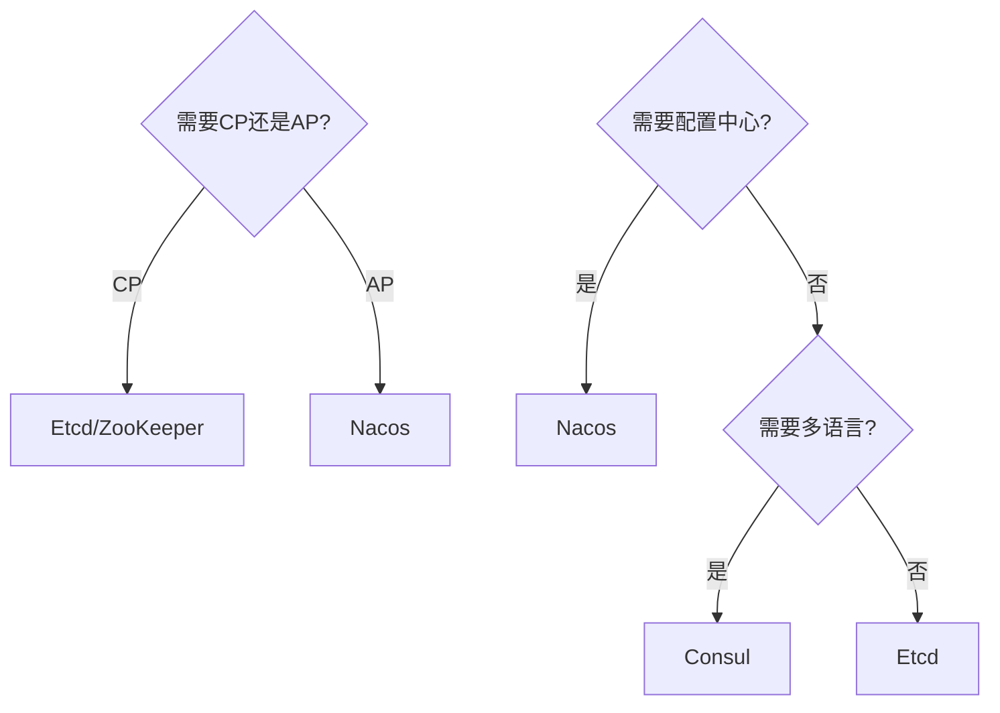
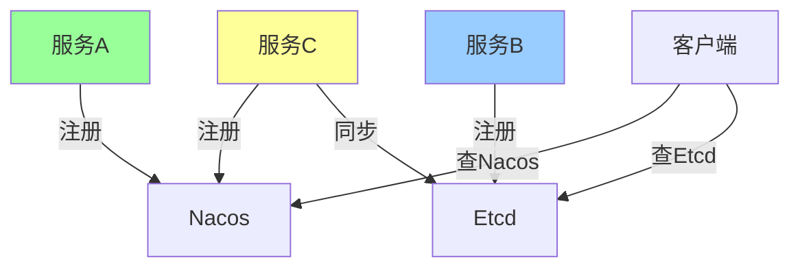

# 服务发现架构实战

> **一句话摘要**：实战 = 选型 + 部署 + 治理——从理论到生产级服务发现系统的完整实践。
> **本文核心**：**实战 = Nacos/Etcd + 多注册中心 + 流量治理**。

前置阅读：[服务治理架构总结](../特性层/服务发现深化系列/7_服务治理架构总结-特性.md)。本篇将治理理论落地到服务发现实战。

## 1. 背景：为什么需要实战

> 量级分档意识：本文方法在十万级 QPS、千万级用户、亿级流量的场景下均需重新评估——量级变化时架构与参数需同步调整。


入门层讲了「服务发现是什么」，特性层讲了「怎么治理」，本篇回答「怎么落地」：

- 用什么注册中心？Nacos 还是 Etcd？
- 多注册中心怎么协同？
- 大促时怎么保障服务发现的可用性？

## 2. 核心机制：选型决策

### 2.1 注册中心选型



**选型矩阵**：

| 维度 | Nacos | Etcd | Consul | ZooKeeper |
|---|---|---|---|---|
| 一致性 | AP | CP | CP | CP |
| 配置中心 | ✅ | ❌ | ✅ | ❌ |
| 多语言 | ✅ | ✅ | ✅ | ✅ |
| 社区活跃 | 高 | 高 | 中 | 中 |
| 适合场景 | 微服务 | K8s/强一致 | 多云 | 传统 |

### 2.2 多注册中心协同



## 3. 落地实践：Nacos 部署

### 3.1 集群部署

```yaml
# Nacos 集群配置
server:
  port: 8848

spring:
  cloud:
    nacos:
      discovery:
        server-addr: nacos1:8848,nacos2:8848,nacos3:8848
        namespace: prod
        group: DEFAULT_GROUP
```

### 3.2 服务注册

```java
// 服务注册
@SpringBootApplication
@EnableDiscoveryClient
public class OrderServiceApplication {
    public static void main(String[] args) {
        SpringApplication.run(OrderServiceApplication.class, args);
    }
}

// 服务发现
@RestController
public class OrderController {
    @Autowired
    private DiscoveryClient discoveryClient;
    
    public List<ServiceInstance> getInstances() {
        return discoveryClient.getInstances("order-service");
    }
}
```

## 4. 落地实践：大促保障

### 4.1 注册中心高可用

```mermaid
flowchart TD
    Nacos1[Nacos 节点1] -->|同步| Nacos2[Nacos 节点2]
    Nacos2 -->|同步| Nacos3[Nacos 节点3]
    
    Client[客户端] -->|负载均衡| Nacos1
    Client -->|负载均衡| Nacos2
    Client -->|负载均衡| Nacos3
    
    Note over Nacos1,Nacos3: 3节点集群,AP 架构
```

### 4.2 服务发现降级

```java
// 服务发现降级
@SentinelResource(value = "discovery", fallback = "fallback")
public List<ServiceInstance> getInstances(String serviceName) {
    return discoveryClient.getInstances(serviceName);
}

public List<ServiceInstance> fallback(String serviceName) {
    // 降级方案：从本地缓存获取
    return localCache.get(serviceName);
}
```

### 4.3 客户端缓存

```java
// 客户端缓存 + 定时刷新
@Component
public class ServiceDiscoveryCache {
    private Map<String, List<ServiceInstance>> cache = new ConcurrentHashMap<>();
    
    @Scheduled(fixedDelay = 30000) // 30秒刷新
    public void refresh() {
        for (String service : services) {
            cache.put(service, discoveryClient.getInstances(service));
        }
    }
    
    public List<ServiceInstance> get(String service) {
        return cache.get(service);
    }
}
```

## 5. 落地实践：K8s 服务发现

```yaml
# K8s Service + Endpoints
apiVersion: v1
kind: Service
metadata:
  name: order-service
spec:
  selector:
    app: order-service
  ports:
    - port: 8080
      targetPort: 8080
  type: ClusterIP
```

**K8s + Nacos 混合**：

```yaml
# K8s 服务 + Nacos 注册
apiVersion: v1
kind: Service
metadata:
  name: order-service
  annotations:
    alibabacloud.com/nacos-enabled: "true"
spec:
  selector:
    app: order-service
  ports:
    - port: 8080
```

## 6. 生产视角：实战踩坑

- **踩坑 1**：注册中心单点——Nacos 挂了所有服务发现失败
- **踩坑 2**：客户端缓存不一致——心跳超时导致误判
- **踩坑 3**：大促时注册中心压力——注册/心跳请求暴增
- **踩坑 4**：多注册中心数据不一致——两个注册中心的数据不同步

**生产最佳实践**：

1. 注册中心集群部署（3/5 节点）
2. 客户端本地缓存 + 定时刷新
3. 服务发现降级方案（本地缓存兜底）
4. 监控注册中心状态
5. 大促前预热注册中心缓存

## 7. 典型场景

| 场景 | 方案 | 理由 |
|---|---|---|
| 微服务架构 | Nacos | AP + 配置中心 |
| K8s 环境 | Etcd | CP + K8s 原生 |
| 多云环境 | Consul | 多云支持 |
| 大促保障 | Nacos + 客户端缓存 | 高可用 |
| 混合云 | Nacos + Etcd | 多注册中心 |

## 8. 与相邻概念的区别

- **服务发现 vs 负载均衡**：发现是「找到谁」，均衡是「选哪个」
- **服务发现 vs 网关**：发现是底层能力，网关是入口层
- **Nacos vs Etcd**：Nacos AP + 配置中心，Etcd CP + K8s 原生
- **服务发现 vs DNS**：服务发现是应用层，DNS 是网络层

## 9. 你们可能会问

- **Nacos 和 Consul 怎么选？** Nacos 适合 Spring Cloud 生态，Consul 适合多云
- **大促时注册中心压力大怎么办？** 客户端缓存 + 读写分离
- **多注册中心怎么同步？** 异步同步 + 最终一致
- **服务发现挂了怎么办？** 客户端本地缓存兜底

## 10. 一句话总结 + 5W 速记卡 + 自测三问

**一句话总结**：实战 = 注册中心选型 + 集群部署 + 客户端缓存 + 降级方案。

**5W 速记卡**：

| 维度 | 内容 |
|---|---|
| What | Nacos/Etcd/Consul 选型 + 部署 |
| Why | 生产级服务发现 |
| When | 架构搭建阶段 |
| Where | 所有微服务 |
| How | 选型 → 部署 → 缓存 → 降级 |

**自测三问**：

1. 你的注册中心集群部署了吗？
2. 你的客户端有本地缓存吗？
3. 你的服务发现降级方案是什么？

---

**专题层完结**：服务发现架构实战已建立。

**🎯 核心带走**：

- **核心一句话**：服务发现实战 = 集群部署 + 客户端缓存 + 降级方案
- **链条复述**：选型 → 部署 → 注册/发现 → 缓存 → 降级
- **失效点与边界**：注册中心单点；客户端缓存不一致

💡 **实战提示**：Nacos 集群 + 客户端缓存 + 本地兜底 = 生产级服务发现。

**开放问题**：服务发现能完全去中心化吗？答案是：部分能——基于 DNS 的去中心化发现，但牺牲了动态性。

**决策（何时用）**：Spring Cloud 用 Nacos；K8s 用 Etcd；多云用 Consul。


> **演进视角**：服务发现架构实战 的实践经历了从早期探索到成熟落地的演进过程——理解这段历史有助于判断当前方案的适用边界。

## 📌 数据与事实声明

- 写于 2026-09-11
- 免责：以官方文档为准

## 📚 参考资料

| 类型 | 标题 | 来源 |
|---|---|---|
| 官方文档 | 官方文档 | 官方站点 |
