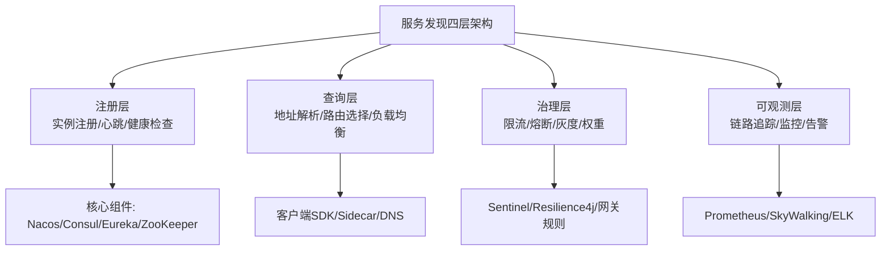
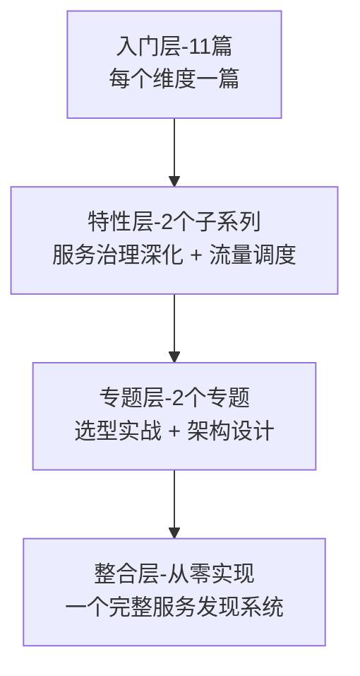

# 服务发现与注册系列导读 · 分布式系统的寻址层

> 📖 本系列共 11 篇（0_导读 + 10 正文），覆盖服务发现与注册整个知识面：从基础概念到主流组件、从注册中心选型到高可用架构、从流量治理到可观测性。
> 本篇是第 0 篇导读：先建立「服务发现 = 分布式系统的 DNS」的心智模型，再决定读哪条路。

## 一、为什么需要这套系列

> 量级分档意识：本文方法在十万级 QPS、千万级用户、亿级流量的场景下均需重新评估——量级变化时架构与参数需同步调整。

微服务环境下，系统拆分成了数十上百个独立进程。服务 A 怎么找到服务 B？IP 地址会变、实例会上下线、机房会故障——靠人工维护一份静态 IP 列表完全不现实。

服务发现与注册就是解决这个问题的**分布式寻址系统**：服务启动时注册自己的地址，调用方通过注册中心查询目标地址，中间的故障转移、负载均衡、流量治理都在这一层完成。

常见两种极端：
- **无注册中心**：调用方硬编码 IP 列表，实例变动要改配置重启——扩展性为零
- **全依赖注册中心**：注册中心挂了，整个系统不可用——单点风险

这套系列的设计思路：**先建立「服务发现 = 分布式系统的 DNS」的心智模型，再逐个维度深入机制**。主线是「服务怎么找到彼此」，支线是「找到之后怎么治理」。先搞清「为什么需要」，再搞清「怎么选」，最后搞清「怎么用」。

## 二、全局心智模型：服务发现的四层架构

理解这个模型的四个要点：

1. **注册是基础**：心跳 + 健康检查保证了注册表的可信度——过期实例被剔除，调用方不会打到已死的节点。
2. **查询是核心**：负载均衡策略（轮询/加权/一致性哈希）决定了流量分布，直接影响系统的均匀度和性能。
3. **治理是增值**：限流、熔断、灰度发布在服务发现的基础上叠加，让系统从「能跑」变成「能扛」。
4. **可观测兜底**：没有链路追踪和监控，服务发现就是黑箱——出了问题不知道哪个环节断了。

> tips：(寻址层是地基) 服务发现是微服务架构的地基组件，选型错误会导致全链路重构。先想清楚「我的场景需要什么」，再选组件——不是功能最多的最好，而是最贴合业务规模的最好。

## 三、系列导航表（11 篇）

| 序号 | 篇目 | 深度 | 一句话定位 | 对标参考 |
|---|---|---|---|---|
| 0 | 系列导读 | 全景 | 四层架构 + 阅读路径 | - |
| 1 | 服务发现是什么与为什么需要 | 入门 | DNS 类比 + 三大角色 + 心跳机制 | 《微服务设计》 |
| 2 | 注册中心选型全景 | 入门 | Nacos/Consul/Eureka/ZooKeeper 对比 | 官方文档 |
| 3 | 健康检查与故障剔除 | 入门 | 心跳检测/主动探活/故障转移 | 《架构整洁之道》 |
| 4 | 负载均衡策略 | 入门 | 轮询/加权/一致性哈希/自适应 | K8s Service |
| 5 | 服务注册与发现实现 | 入门 | 客户端发现 vs 服务端发现 | 《微服务模式》 |
| 6 | 流量治理与路由 | 入门 | 限流/熔断/灰度/权重 | Sentinel |
| 7 | 多注册中心与高可用 | 入门 | 双注册中心/多集群/故障切换 | 生产实践 |
| 8 | 服务发现与 K8s 集成 | 入门 | Service/Endpoint/Ingress/DNS | K8s 官方 |
| 9 | 可观测性与链路追踪 | 入门 | 监控/追踪/日志/告警 | Prometheus + SkyWalking |
| 10 | 服务发现架构总结 | 入门 | 选型决策树 + 落地 checklist | 综合应用 |

## 四、从点到面：四层进阶路径

| 层级 | 定位 | 规模 | 适合 |
|---|---|---|---|
| 入门层 | 点：每个维度一篇，建立完整认知 | 11 篇 | 所有读者必读 |
| 特性层 | 点 × 深：服务治理 / 流量调度拆到方案级 | 2 个子系列 | 按兴趣挑重点 |
| 专题层 | 面：选型实战 + 架构设计决策 | 2 个专题 | 解决实际架构问题 |
| 整合层 | 体系：从零实现一个服务发现系统 | 1 个 demo | 动手派 |

## 五、入门读者最容易踩的 3 个认知误区

### 误区 1：以为「注册中心只是查 IP」

注册中心不只是地址簿。它同时承载了健康检查、负载均衡元数据、灰度路由、鉴权等职责。只用它当 DNS 用，等于浪费了 80% 的能力。

### 误区 2：以为「选型就选最强的」

ZooKeeper 功能最强但运维最重，Eureka 最轻量但已停更，Nacos 最全面但版本迭代快。选型要看团队规模、运维能力、业务阶段——小团队用 Consul 够用，大厂才需要自研。

### 误区 3：以为「注册中心挂了系统就挂了」

客户端缓存 + 局部心跳可以让调用方在没有注册中心时继续工作（AP 策略）。注册中心是增强，不是唯一依赖——没有它系统降级可用，有它系统更智能。

---

**开放问题**：云原生环境下，K8s Service 已经提供了服务发现，为什么还需要 Nacos/Consul？答案是：K8s Service 解决的是「同一集群内」的服务发现，跨集群、跨环境、多云场景需要更高级的注册中心。

**决策（何时用）**：K8s 原生环境先用 K8s Service；需要灰度/金丝雀发布时加一层治理组件；多集群/混合云场景上 Nacos 或 Consul。

## 📌 数据与事实声明

- 写于 2026-09-11
- 免责：以官方文档为准

## 📚 参考资料

| 类型 | 标题 | 来源 |
|---|---|---|
| 官方文档 | 官方文档 | 官方站点 |
