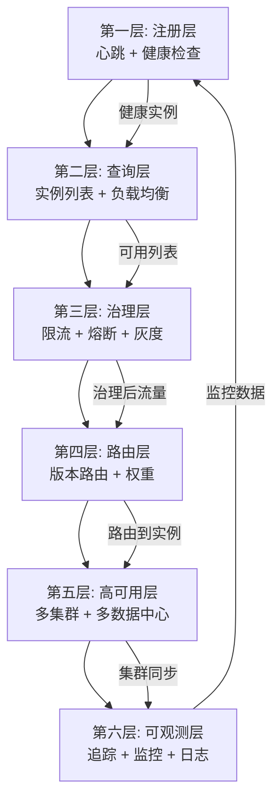
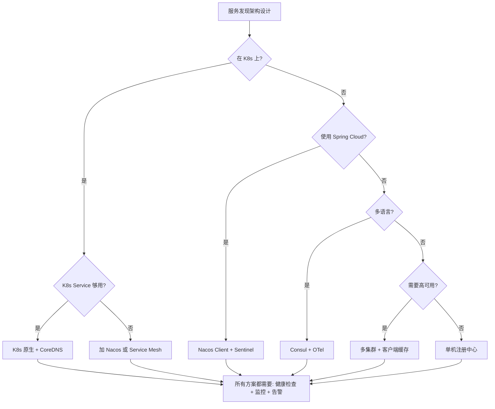

# 服务发现架构总结

> **一句话摘要**：服务发现 = 注册 + 查询 + 健康检查 + 负载均衡 + 流量治理 + 可观测性——六层协作构成完整的分布式寻址系统。
> **本文核心**：**选型决策树 + 落地 checklist + 常见模式**——从理论到实践的最后一公里。

前置阅读：本系列全部 10 篇入门文章的收官之作。

## 1. 背景：为什么需要总结

> 量级分档意识：本文方法在十万级 QPS、千万级用户、亿级流量的场景下均需重新评估——量级变化时架构与参数需同步调整。


10 篇文章分别讲了服务发现的各个维度——注册中心、健康检查、负载均衡、流量治理、K8s 集成、可观测性。但真正落地时，需要把这些知识串起来：

- 选型时：从哪些维度考虑？
- 落地时：每一步怎么配置？
- 运维时：出了问题怎么排查？

本篇作为系列总结，给出完整的决策框架。

## 2. 核心机制：六层架构



| 层级 | 职责 | 关键机制 | 代表组件 |
|---|---|---|---|
| 注册层 | 实例注册 + 健康 | 心跳 + 探活 | Nacos/Consul |
| 查询层 | 实例列表 + LB | 轮询/哈希/最少连接 | LoadBalancer |
| 治理层 | 限流 + 熔断 + 灰度 | 令牌桶 + 熔断器 | Sentinel |
| 路由层 | 版本路由 + 权重 | Header/Cookie/权重 | Gateway |
| 高可用层 | 多集群 + 切换 | Raft + 同步 | 多集群部署 |
| 可观测层 | 追踪 + 监控 + 日志 | traceId + 指标 | SkyWalking/Prometheus |

## 3. 落地实践：完整决策树



## 4. 落地实践：完整 Checklist

### 4.1 选型 Checklist

| 序号 | 问题 | 答案 | 选型 |
|---|---|---|---|
| 1 | 在 K8s 上吗？ | 是/否 | K8s Service vs Nacos/Consul |
| 2 | 主力语言？ | Java/Go/混合 | Nacos/Consul |
| 3 | 需要灰度吗？ | 是/否 | Nacos 或 Gateway |
| 4 | 需要多数据中心吗？ | 是/否 | Consul |
| 5 | 团队规模？ | 小/中/大 | Eureka/Nacos/自研 |
| 6 | 需要配置管理吗？ | 是/否 | Nacos |
| 7 | 有 Service Mesh 吗？ | 是/否 | Istio |

### 4.2 部署 Checklist

- [ ] 注册中心集群至少 3 节点
- [ ] 客户端启用缓存
- [ ] 健康检查配置（HTTP 探活 /health）
- [ ] 心跳间隔 = 10 秒，超时 = 30 秒
- [ ] 客户端负载均衡配置
- [ ] 限流规则配置（Nacos 配置中心推送）
- [ ] 熔断规则配置
- [ ] 告警规则配置
- [ ] 链路追踪接入（traceId）
- [ ] 监控大盘搭建（Grafana）

### 4.3 运维 Checklist

- [ ] 注册中心集群健康监控
- [ ] 客户端缓存刷新监控
- [ ] 实例注册/下线监控
- [ ] 健康检查失败告警
- [ ] 限流/熔断事件记录
- [ ] 链路追踪采样率配置
- [ ] 定期故障切换演练
- [ ] 注册中心数据备份

## 5. 典型场景完整方案

### 5.1 小团队快速起步

```
方案：Nacos 单机 + Spring Cloud LoadBalancer + Sentinel
成本：低
适用：<10 个服务，初创团队
```

### 5.2 中型生产环境

```
方案：Nacos 3 节点集群 + Sentinel + SkyWalking + Prometheus
成本：中
适用：20-100 个服务，中型团队
```

### 5.3 大型生产环境

```
方案：Nacos 多集群 + Service Mesh + 多数据中心 + 全链路追踪
成本：高
适用：100+ 服务，大型团队
```

## 6. 生产视角：架构评审清单

架构评审时必须回答的问题：

1. **服务发现选型**：用哪个注册中心？为什么？
2. **健康检查**：心跳间隔和超时阈值是多少？
3. **负载均衡**：什么策略？为什么？
4. **容灾方案**：注册中心挂了客户端怎么处理？
5. **可观测性**：traceId 怎么传递？监控覆盖哪些指标？
6. **治理规则**：限流阈值怎么定的？熔断窗口期多长？
7. **灰度方案**：如何控制灰度流量比例？
8. **扩容方案**：新实例注册后多久能被感知？

## 7. 与相邻概念的区别

- **服务发现 vs 配置中心**：发现管「在哪」，配置管「参数」
- **服务发现 vs API 网关**：发现管「内部寻址」，网关管「外部入口」
- **服务发现 vs Service Mesh**：发现是基础能力，Mesh 是增强层
- **服务发现 vs 域名系统**：发现是服务级别，DNS 是应用级别

## 8. 常见误区与不适用

- **「服务发现 = 注册中心」**：注册中心只是组件之一
- **「K8s 不需要服务发现」**：K8s Service 就是服务发现
- **「服务发现一次选型终身有效」**：业务增长后需要重新评估
- **「小团队不需要服务发现」**：小团队用最简单的方式（Nacos 单机）

## 9. 你们可能会问

- **服务发现系列学完能做什么？** 能设计选型方案、能配置部署、能排查故障
- **11 篇的顺序怎么读？** 按编号 0-10 顺序，或按需跳读
- **学完能面试吗？** 能——服务发现是后端面试的高频考点
- **下一步学什么？** 特性层（服务治理深化 / 流量调度）、专题层（选型实战 / 架构设计）

## 10. 一句话总结 + 5W 速记卡 + 自测三问

**一句话总结**：服务发现 = 注册 + 查询 + 健康 + LB + 治理 + 可观测——六层协作构成完整的分布式寻址系统。

**5W 速记卡**：

| 维度 | 内容 |
|---|---|
| What | 六层架构：注册/查询/治理/路由/高可用/可观测 |
| Why | 服务发现是微服务架构的寻址地基 |
| When | 微服务架构设计和运维的全生命周期 |
| Where | 所有分布式系统 |
| How | 选型→部署→配置→监控→演练 |

**自测三问**：

1. 你的架构评审时，服务发现选型回答了几问？
2. 你的部署 checklist 覆盖了哪些层？
3. 你的服务挂了，能快速定位是哪一层的问题吗？

---

**系列完结**：从入门到实践的完整知识图谱已建立。下一步可以进入特性层（服务治理深化 / 流量调度）或专题层（选型实战 / 架构设计）。

**🎯 核心带走**：

- **核心一句话**：六层协作 = 完整的服务发现系统
- **链条复述**：选型 → 部署 → 配置 → 监控 → 演练 → 优化
- **失效点与边界**：单点风险、缓存延迟、配置复杂

💡 **实战提示**：用 Checklist 确保不遗漏——架构评审和部署时逐项核对。

**开放问题**：服务发现和 AI 运维（AIOps）结合后，健康检查和故障剔除会更智能吗？答案是：基于机器学习的异常检测可以更早发现故障，但需要训练数据和时间窗口。

**决策（何时用）**：小团队用最简单方案，大团队用完整架构——按需选择，不贪大求全。


> **演进视角**：服务发现架构总结 的实践经历了从早期探索到成熟落地的演进过程——理解这段历史有助于判断当前方案的适用边界。

## 📌 数据与事实声明

- 写于 2026-09-11
- 免责：以官方文档为准

## 📚 参考资料

| 类型 | 标题 | 来源 |
|---|---|---|
| 官方文档 | 官方文档 | 官方站点 |
