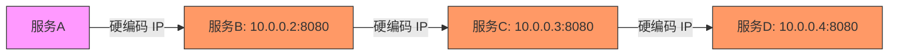
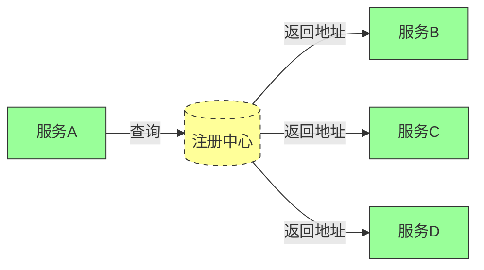
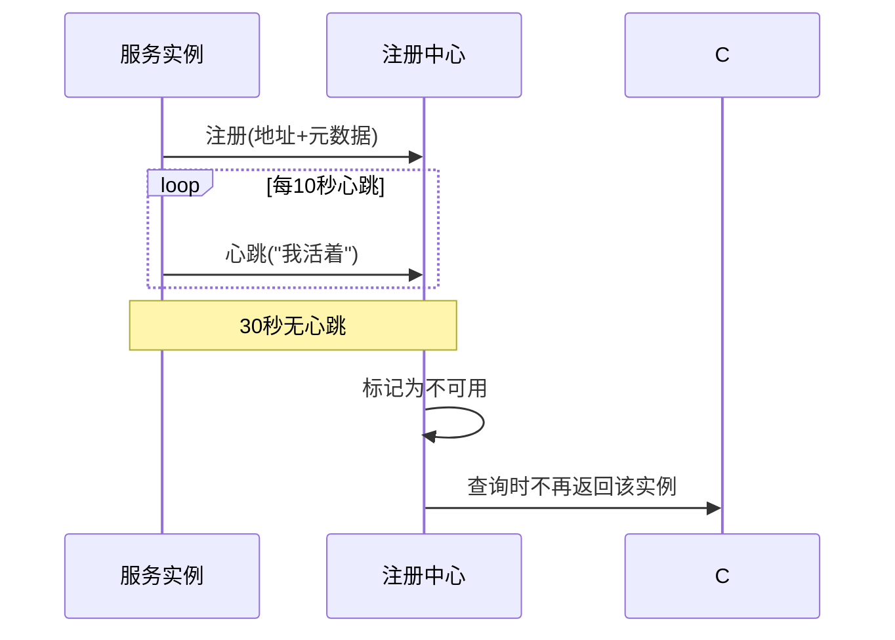
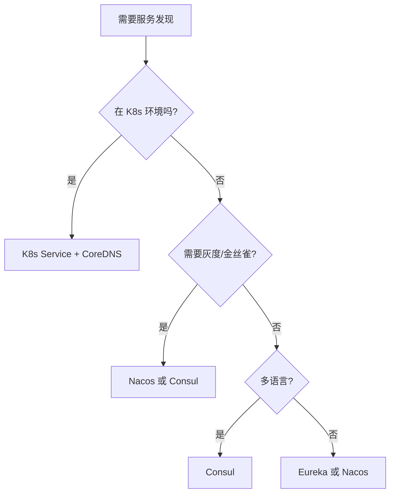

# 服务发现是什么与为什么需要

> **一句话摘要**：服务发现是分布式系统的 DNS——让服务实例在动态变化的环境中自动找到彼此；它解决的核心问题是「调用方怎么知道被调用方在哪」，背后依赖心跳、注册表、健康检查三件套。
> **本文核心**：**服务发现 = 注册 + 查询 + 健康检查**；没有它，微服务之间就是一台台孤岛。

前置阅读：[系列导读](./0_系列导读-全景.md)。分布式理论基石（CAP、Paxos、Raft）在[分布式理论系列](../../distributed-theory/入门层/从零开始认识分布式理论系列/1_分布式系统是什么与为什么难-入门.md)展开，本篇聚焦工程实现。

## 1. 背景：为什么需要服务发现

单体架构下，所有模块跑在同一进程里，函数调用就是内存地址跳转——不存在「找服务」的问题。拆成微服务后，服务 A 要调用服务 B，面临三个动态变化：

- **IP 变化**：容器销毁重建，IP 从 10.0.0.1 变成 10.0.0.2
- **实例扩缩**：大促时从 3 个实例扩到 30 个，缩到 1 个
- **机房切换**：同城双活或异地多活时，实例分布在不同网段

手动维护 IP 列表 = 每次发布改配置 = 运维噩梦。服务发现把这个问题自动化：服务启动时告诉注册中心「我在这里」，调用方向注册中心问「他在哪里」。

**没有服务发现的系统**：

**有服务发现的系统**：

## 2. 核心机制：三大角色与心跳

### 2.1 三大角色

| 角色 | 职责 | 类比 |
|---|---|---|
| 服务提供者 | 注册自己的地址和元数据 | 房东登记房源 |
| 服务消费者 | 查询地址并发起调用 | 租客找房 |
| 注册中心 | 维护地址列表、剔除故障实例 | 房产中介 |

三方角色可以共存也可以分离——客户端发现模式只有服务提供者和消费者，第三方发现模式多了专门的负载均衡层。

### 2.2 心跳机制

注册中心怎么知道某个实例还活着？靠心跳：

- **心跳上报**：服务实例每 5-30 秒向注册中心发一次心跳（"我还活着"）
- **超时剔除**：连续 N 次没收到心跳，注册中心认为实例已死，从列表中移除
- **主动探活**：注册中心主动向实例发探测请求（TCP/HTTP/自定义协议）

心跳间隔和超时阈值需要权衡：间隔太短 = 网络开销大；间隔太长 = 故障发现慢。生产常见配置：心跳 10 秒，30 秒无响应剔除。

### 2.3 服务元数据

不只是 IP:端口，现代注册中心还存储丰富的元数据：

- 版本号（灰度发布用）
- 权重（流量分配用）
- 区域/机房（就近路由用）
- 健康状态（活跃/不活跃）
- 元数据标签（DB 连接数、QPS 上限等）

元数据越丰富，流量治理越精细——从「找到一个实例」变成「找到最合适的实例」。

## 3. 落地实践：选型决策树

选型的第一步不是看功能，而是看场景：

决策逻辑：

- **K8s 原生场景**：Service + Endpoint 已经够用，不需要额外组件
- **需要灰度发布**：Nacos 支持权重路由和灰度规则
- **多语言混合**：Consul HTTP/DNS 接口通用性强
- **Spring Cloud 生态**：Eureka/Nacos 与 Spring Cloud 深度集成

## 4. 生产视角：没有服务发现长什么样

服务发现缺失或失效时，事故形态很典型：

- **硬编码 IP 的系统**：某实例重启后 IP 变了，调用方仍连旧地址，全链路超时
- **注册中心单点**：Nacos 挂掉后，新实例无法注册，旧实例无法剔除——系统逐渐不可用
- **心跳间隔过长**：实例挂了但 3 分钟才被发现，这 3 分钟所有流量打到已死节点
- **元数据缺失**：灰度发布时无法区分版本，所有流量打到新版本——发布变炸弹

生产环境的教训：**服务发现不是「有了更好」，是「必须有」——只是有单点风险时，需要做好降级方案**。

## 5. 主流方案怎么做：三种发现模式

| 模式 | 流程 | 优点 | 缺点 | 适用场景 |
|---|---|---|---|---|
| 客户端发现 | 客户端查注册中心 + 负载均衡 | 延迟低、灵活 | 客户端需维护 SDK | Spring Cloud |
| 服务端发现 | 客户端只发请求 + 服务端 LB | 客户端无感知 | LB 是单点 | K8s Service |
| DNS 发现 | 通过 DNS 解析服务名 | 最简单 | TTL 不可控 | K8s CoreDNS |

三种模式的核心区别是**「谁来做负载均衡」**：客户端自己算、中间层代理、还是 DNS 搞定。选型取决于团队的复杂度承受力——客户端模式最灵活但 SDK 侵入性最强，服务端模式最简单但多了中间层。

## 6. 典型场景

- **电商下单**：订单服务 → 库存服务 → 物流服务，服务发现贯穿全链路
- **微服务网关**：网关通过服务发现获取后端实例列表，动态路由
- **跨集群调用**：A 集群的服务发现 B 集群的服务，需要跨注册中心同步
- **混合云**：自建 IDC 的服务发现云上服务，需要统一注册中心

## 7. 与相邻概念的区别

- **服务发现 vs 负载均衡**：服务发现回答「在哪」，负载均衡回答「打哪个」——两者紧密耦合但职责分离
- **服务发现 vs DNS**：DNS 是服务发现的一种实现方式，但缺乏健康检查、权重、元数据等高级能力
- **服务发现 vs 配置中心**：配置中心管「参数」，服务发现管「地址」——Nacos 同时提供两者

## 8. 常见误区与不适用

- **「单体系统也需要服务发现」**：不需要——单体内部是函数调用，不是网络调用
- **「服务发现 = 注册中心」**：注册中心只是组件之一，健康检查和客户端 SDK 同样重要
- **「心跳越快越好」**：心跳频率需要权衡网络开销和故障发现速度，过快的心跳在网络抖动时反而引发误判
- **不适用场景**：同进程内调用（不需要网络寻址）、静态服务（IP 永不变化）

## 9. 你们可能会问

- **服务发现和注册中心是同一个东西吗？** 不是。注册中心是组件，服务发现是完整系统——包含注册、查询、健康检查、客户端逻辑。
- **心跳用什么协议？** 可以是 HTTP、TCP、自定义协议。Nacos 用 HTTP，Consul 支持 HTTP/DNS/Eureka 协议。
- **注册中心挂了怎么办？** 客户端缓存上次查询结果（AP 策略），注册中心恢复后自动同步。
- **服务发现能用于非微服务吗？** 可以——数据库主从发现、缓存节点发现、任何动态实例都需要服务发现。

## 10. 一句话总结 + 5W 速记卡 + 自测三问

**一句话总结**：服务发现 = 注册 + 查询 + 健康检查，是微服务架构的寻址地基；没有它，实例动态变化时调用方无从寻址。

**5W 速记卡**：

| 维度 | 内容 |
|---|---|
| What | 让服务实例自动被找到的系统（注册 + 查询 + 健康检查） |
| Why | 微服务 IP/实例动态变化，硬编码不可行 |
| When | 微服务架构中每次服务间通信 |
| Where | 所有分布式系统（不限于微服务） |
| How | 心跳上报 → 注册中心维护 → 消费者查询 → 负载均衡 |

**自测三问**：

1. 你的系统里，服务实例挂了多久能被感知？心跳间隔和超时阈值配是多少？
2. 注册中心挂了，客户端怎么降级？缓存策略是什么？
3. 你的服务元数据除了 IP:端口还有什么？灰度发布用得上吗？

---

**下篇预告**：主流注册中心 Nacos、Consul、Eureka、ZooKeeper 的深度对比——[注册中心选型全景](./2_注册中心选型全景-入门.md)。

**🎯 核心带走**：

- **核心一句话**：服务发现 = 注册 + 查询 + 健康检查，是微服务的寻址地基
- **链条复述**：实例注册 → 心跳保活 → 消费者查询 → 负载均衡 → 故障剔除
- **失效点与边界**：注册中心单点风险（需客户端缓存降级）；心跳间隔过大会导致故障窗口

💡 **实战提示**：选型先看是否在 K8s 上——K8s 原生 Service + CoreDNS 够用则不加；需要灰度/多语言再选 Nacos/Consul。

**开放问题**：同一个系统里，客户端发现和服务端发现能混用吗？答案是：能——网关用服务端发现，内部服务用客户端发现，各取所需。

**决策（何时用）**：K8s 环境先用原生 Service；需要灰度/金丝雀发布上 Nacos；非 K8s 多语言环境用 Consul。
