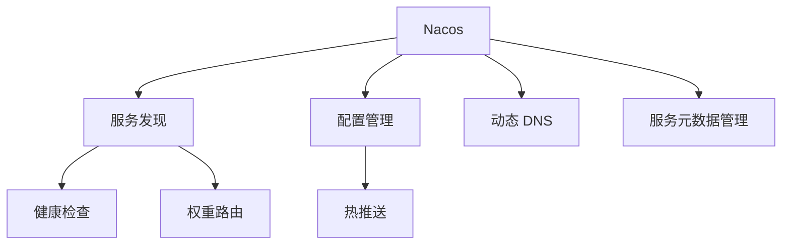
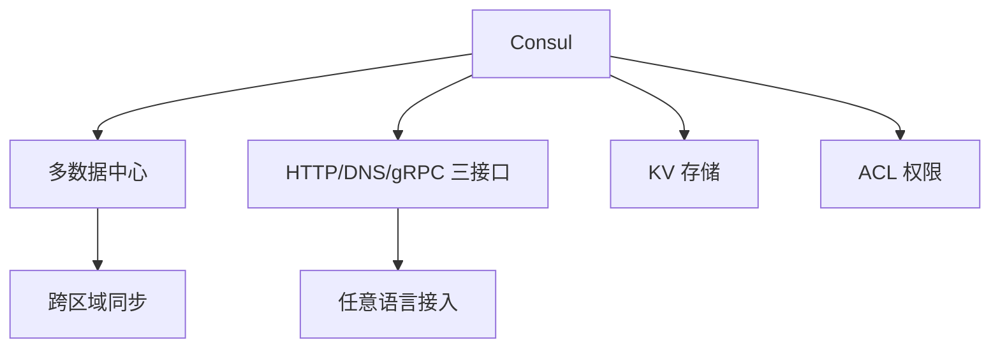
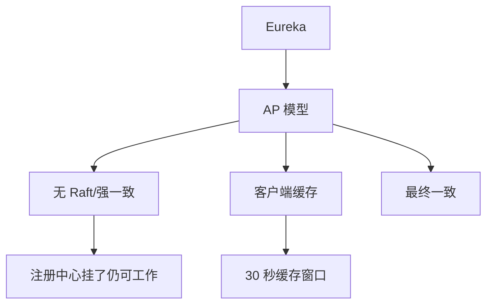
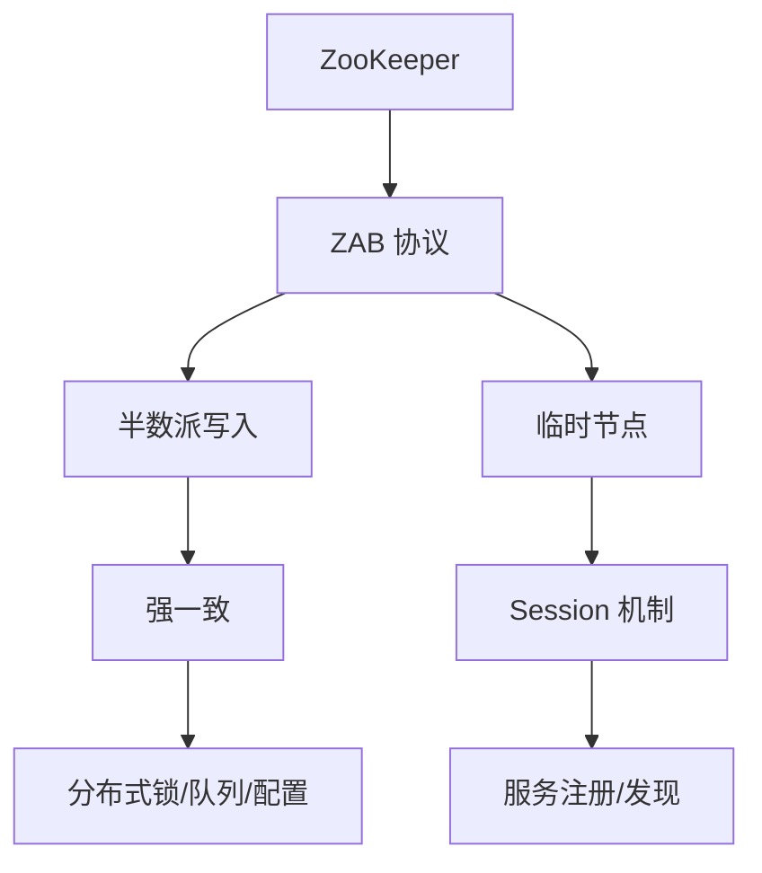
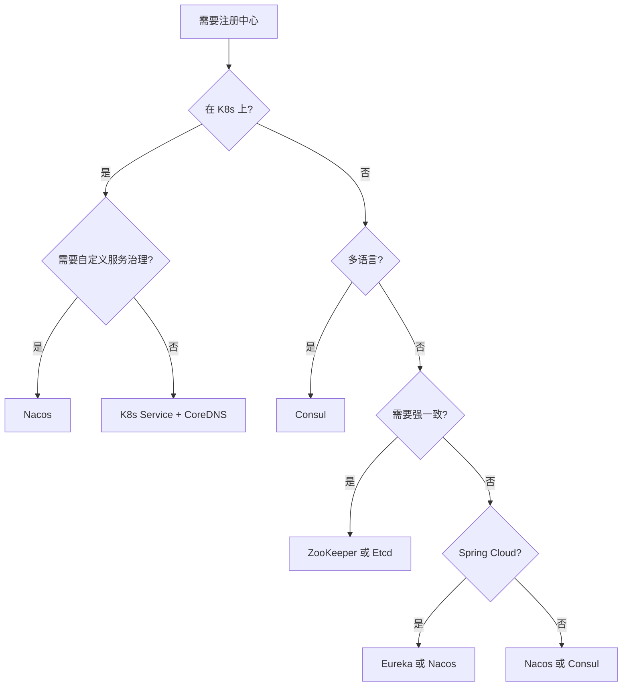

# 注册中心选型全景

> **一句话摘要**：主流注册中心 Nacos / Consul / Eureka / ZooKeeper 各有取舍——选型不是比功能，而是比「你的团队能运维什么」；Nacos 全面但版本迭代快，Consul 通用但性能一般，Eureka 轻量但已停更。
> **本文核心**：**选型 = 场景需求 × 团队能力 × 运维成本**；没有最好的组件，只有最贴合的选型。

前置阅读：[服务发现是什么与为什么需要](./1_服务发现是什么与为什么需要-入门.md)。底层理论（CAP、一致性算法）在[分布式理论系列](../../distributed-theory/入门层/从零开始认识分布式理论系列/2_CAP定理-入门.md)展开，本篇聚焦工程选型对比。

## 1. 背景：为什么选型这么难

> 量级分档意识：本文方法在十万级 QPS、千万级用户、亿级流量的场景下均需重新评估——量级变化时架构与参数需同步调整。

服务发现组件不像普通库——一旦选定，牵动全链路：客户端 SDK、部署拓扑、运维脚本、监控大盘、故障恢复预案全部要改。选型错误的代价是：

- **选型过轻**：业务增长后组件扛不住，推倒重来
- **选型过重**：小团队维护 ZooKeeper 集群，运维成本吃掉研发精力
- **选型错方向**：需要多语言支持但选了 Eureka（仅 Java）

选型的第一原则：**不是选最强的，而是选「运维得住的」**。

## 2. 核心机制：五大选型维度

| 维度 | 说明 | 为什么重要 |
|---|---|---|
| 一致性协议 | Raft / Gossip / 自定义 | 决定注册中心的可靠性和性能上限 |
| 多语言支持 | Client SDK 覆盖范围 | 非 Java 系统能否接入 |
| 健康检查 | TCP/HTTP/自定义 | 故障剔除的准确性 |
| 运维复杂度 | 部署/监控/扩缩 | 团队能否维护 |
| 云原生适配 | K8s / Service Mesh 集成 | 未来架构演进 |

每个维度上的差异决定了不同组件适合不同场景。

## 3. 主流注册中心全景对比

### 3.1 Nacos（阿里巴巴）

- **一致性协议**：Raft（临时实例）+ 自研（持久实例）
- **语言**：Java（服务端）；多语言通过 HTTP/gRPC
- **健康检查**：TCP / HTTP / MySQL / 客户端上报
- **特点**：同时支持服务发现 + 配置管理，与 Spring Cloud Alibaba 深度集成
- **运维**：部署相对简单，单机或集群模式
- **适合**：Java 微服务 + Spring Cloud Alibaba 生态

### 3.2 Consul（HashiCorp）

- **一致性协议**：Raft
- **语言**：Go（服务端）；多语言支持完善（HTTP/DNS/gRPC）
- **健康检查**：TCP / HTTP / Docker / 脚本 / gRPC
- **特点**：多语言友好、K8s 集成好、支持多数据中心
- **运维**：Go 语言编写，单二进制部署，易于维护
- **适合**：多语言混合架构、需要多数据中心

### 3.3 Eureka（Netflix）

- **一致性协议**：AP（最终一致，无 Raft）
- **语言**：Java（服务端和客户端）
- **健康检查**：客户端心跳
- **特点**：轻量、自带客户端库、Spring Cloud 原生
- **运维**：Eureka 2.x 已停更，社区维护 1.x
- **适合**：小规模 Java 微服务、不想引入强一致组件

### 3.4 ZooKeeper（Apache）

- **一致性协议**：ZAB（ZooKeeper Atomic Broadcast）
- **语言**：Java（服务端）；客户端库多语言
- **健康检查**：Session 机制（临时节点）
- **特点**：功能最强但最重，分布式锁/队列/命名服务一应俱全
- **运维**：需要运维 3/5 节点集群，运维成本高
- **适合**：需要强一致 + 多功能的场景（已逐渐被 Etcd/Nacos 替代）

### 3.5 Etcd（CoreOS）

- **一致性协议**：Raft
- **语言**：Go
- **健康检查**：Lease + TTL
- **特点**：K8s 核心组件，性能极高，强一致
- **运维**：设计为基础设施级别，运维简单
- **适合**：K8s 生态、强一致需求

## 4. 落地实践：选型决策树

**选型 checklist**（决策前必答）：

1. 团队主力语言是什么？Java → Nacos/Eureka，非 Java → Consul
2. 是否在 K8s 上？是 → 评估 K8s Service 是否够用
3. 需要多数据中心吗？需要 → Consul
4. 需要配置管理一体化？需要 → Nacos
5. 团队运维能力如何？弱 → Consul（单二进制）或 Eureka（轻量）
6. 预期规模多大？<50 实例 → Eureka/Nacos 单机即可，>100 实例 → 集群

## 5. 生产视角：选型踩坑实录

- **踩坑 1**：小团队选了 ZooKeeper——3 节点集群运维成本太高，最终迁移到 Nacos
- **踩坑 2**：选了 Eureka 2.x——发现已停更，社区没有安全更新，被迫迁移
- **踩坑 3**：多语言场景选了 Eureka——Python/Go 服务无法接入 Eureka 客户端 SDK，最终加了一层 Consul Bridge
- **踩坑 4**：K8s 环境上了 Nacos——K8s Service 已经解决了服务发现，Nacos 多余且增加复杂度

## 6. 典型场景

| 场景 | 推荐方案 | 理由 |
|---|---|---|
| Java Spring Cloud 微服务 | Nacos | 生态深度集成 |
| 多语言混合架构 | Consul | HTTP/DNS/gRPC 全覆盖 |
| K8s 原生服务 | K8s Service | 不需要额外组件 |
| 需要多数据中心 | Consul | 原生多数据中心支持 |
| 追求极致性能 | Etcd | Raft 实现，高性能 |
| 小团队快速起步 | Eureka/Nacos 单机 | 部署简单 |
| 需要配置 + 服务发现一体 | Nacos | 一个组件两个功能 |

## 7. 与相邻概念的区别

- **注册中心 vs 配置中心**：注册中心管「服务在哪」，配置中心管「参数是什么」。Nacos 两者都做，但设计上职责分离
- **注册中心 vs DNS**：DNS 是通用域名解析，注册中心是服务级别的精细寻址（含健康检查、权重等）
- **注册中心 vs 服务网格**：服务网格（Istio）的 Sidecar 替代了客户端 SDK，但底层仍依赖注册中心

## 8. 常见误区与不适用

- **「选型就选功能最多的」**：功能最多 = 运维最重 = 成本最高
- **「K8s 不需要注册中心」**：K8s Service 解决了基本发现，但灰度发布、金丝雀、流量镜像等需要额外组件
- **「Eureka 停更了就不可用」**：Eureka 1.x 稳定可用，停更不等于不能用，但长期看有技术债风险
- **不适用场景**：单体系统（不需要服务发现）、同进程调用（不需要网络寻址）

## 9. 你们可能会问

- **Nacos 和 Eureka 区别是什么？** Nacos 支持 CP+AP 双模式（持久实例 CP，临时实例 AP），Eureka 纯 AP
- **Consul 比 Nacos 好在哪？** Consul 多语言支持更好、多数据中心原生支持
- **ZooKeeper 还能用吗？** 能——但新项目不建议选，Etcd 或 Nacos 是更好的替代
- **注册中心本身怎么保证高可用？** Nacos 用 Raft 集群（3/5 节点），Consul 用 Raft，Eureka 是 AP（对等节点）

## 10. 一句话总结 + 5W 速记卡 + 自测三问

**一句话总结**：选型不是比功能，是比「你的团队能运维什么」；Nacos 全面、Consul 通用、Eureka 轻量、ZooKeeper 重、Etcd 精。

**5W 速记卡**：

| 维度 | 内容 |
|---|---|
| What | 5 大主流注册中心各有所长 |
| Why | 选型错误导致推倒重来或运维成本失控 |
| When | 微服务架构第一次搭建注册中心时 |
| Where | 所有微服务/分布式系统 |
| How | 先问场景（K8s? 多语言? 强一致?），再看团队能力 |

**自测三问**：

1. 你的团队主力语言是什么？选注册中心时是不是优先匹配了 SDK？
2. 你在 K8s 上吗？如果是，K8s Service 是否已经够用？
3. 你的注册中心挂了，客户端怎么降级？缓存策略和超时时间是多少？

---

**下篇预告**：注册中心如何保证「服务列表是准确的」——[健康检查与故障剔除](./3_健康检查与故障剔除-入门.md)。

**🎯 核心带走**：

- **核心一句话**：选型 = 场景需求 × 团队能力 × 运维成本，没有最好的只有最贴合的
- **链条复述**：明确场景 → 对比五大维度 → 决策树筛选 → 确认降级方案
- **失效点与边界**：选型过轻扛不住增长；选型过重运维成本失控

💡 **实战提示**：选型时先写「决策 checklist」——7 个问题全答完了，答案自然浮现。

**开放问题**：K8s Service + Ingress + Nacos 三层共存时，调用链路的优先级是什么？答案是：客户端先查 Nacos 获取 VIP，通过 K8s Service 转发，Ingress 负责外部入口——三层各司其职不冲突。

**决策（何时用）**：Java Spring Cloud 选 Nacos；多语言选 Consul；K8s 原生先用 Service；需要强一致选 Etcd。

## 📌 数据与事实声明

- 写于 2026-09-11
- 免责：以官方文档为准

## 📚 参考资料

| 类型 | 标题 | 来源 |
|---|---|---|
| 官方文档 | 官方文档 | 官方站点 |
