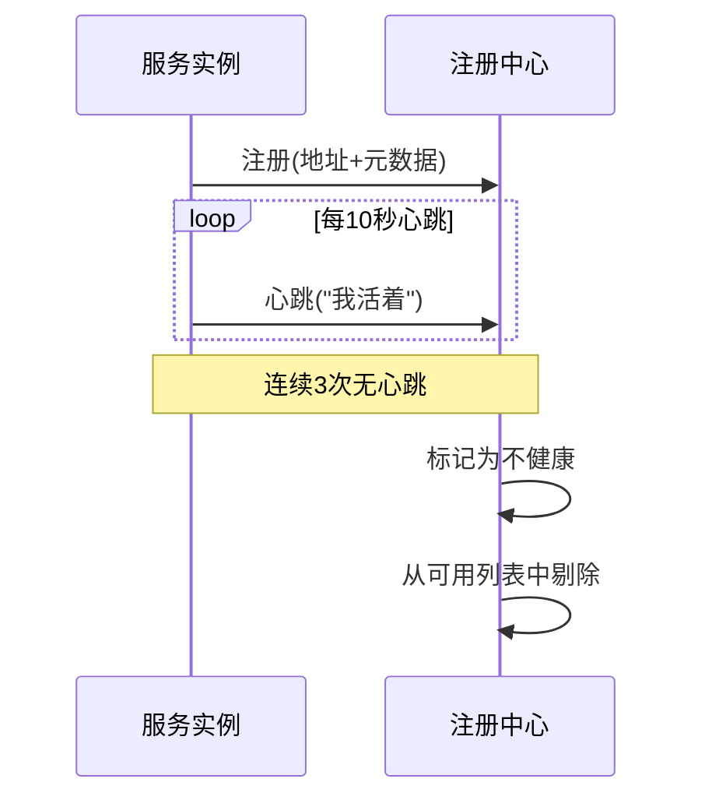
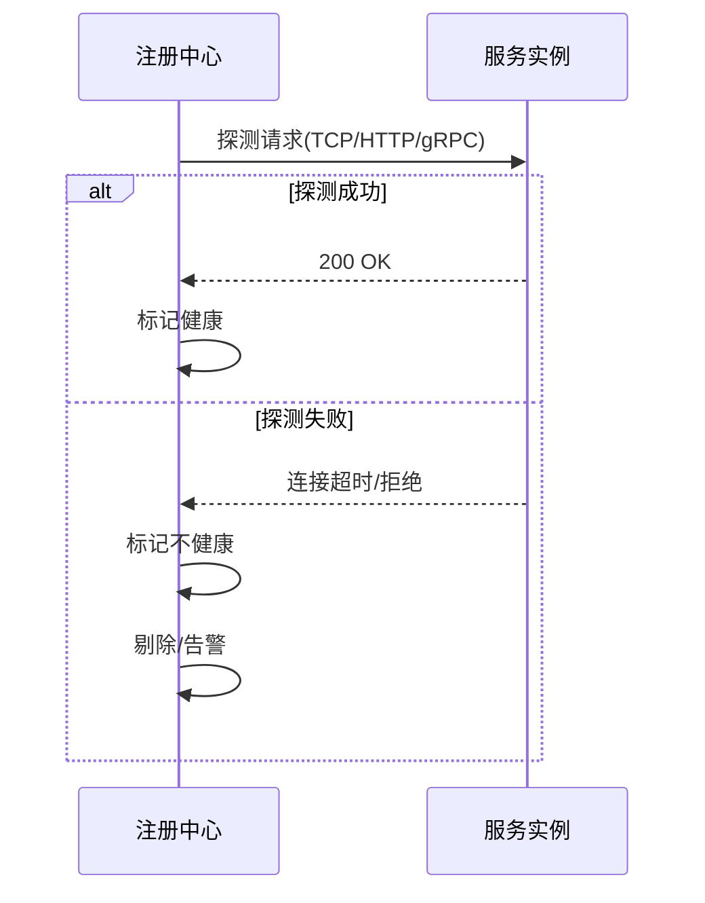
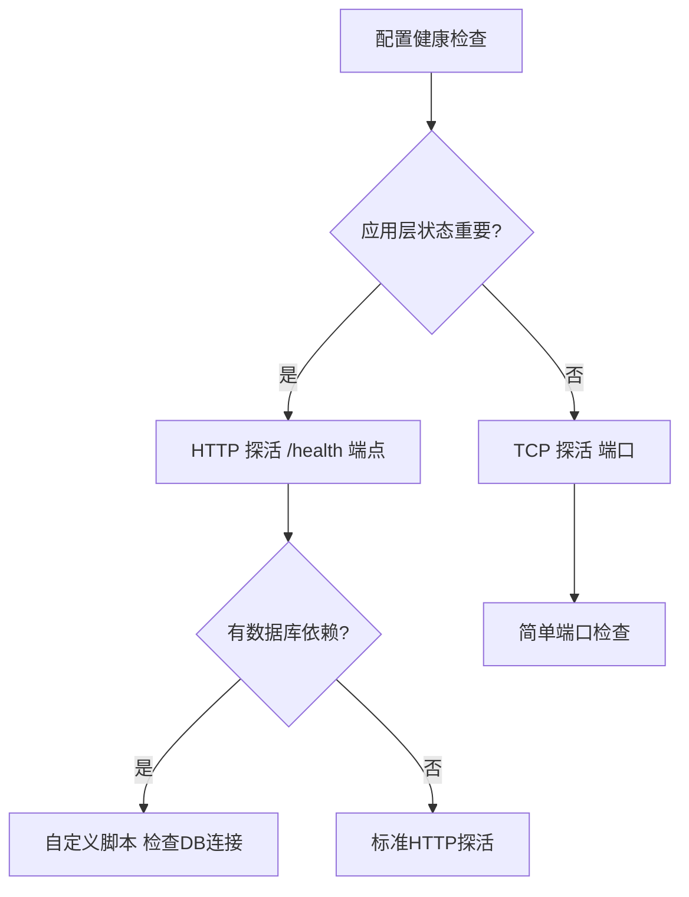
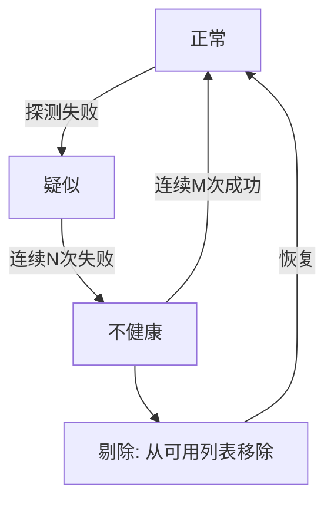

# 健康检查与故障剔除

> **一句话摘要**：注册中心通过心跳和主动探活保证服务列表的准确性——心跳是「主动上报我还活着」，探活是「我主动看看你还有没有反应」；两者结合决定了故障剔除的速度和准确性。
> **本文核心**：**健康检查 = 心跳 + 探活 + 故障转移**；没有可靠的健康检查，服务发现就是过期数据。

前置阅读：[服务发现是什么与为什么需要](./1_服务发现是什么与为什么需要-入门.md)。注册中心选型在[注册中心选型全景](./2_注册中心选型全景-入门.md)展开，本篇聚焦健康检查的具体机制。

## 1. 背景：为什么健康检查如此重要

> 量级分档意识：本文方法在十万级 QPS、千万级用户、亿级流量的场景下均需重新评估——量级变化时架构与参数需同步调整。


服务实例会宕机、重启、发布、网络分区——如果注册中心不知道，服务消费者的流量就会打到已死的实例上。健康检查是服务发现的**质量保证**：

- 没有健康检查：调用方可能打到已宕机的实例，全链路超时
- 健康检查太慢：实例挂了 30 秒才发现，这 30 秒所有请求都失败
- 健康检查太激进：网络抖动时误判健康状态，频繁剔除和恢复

健康检查的核心矛盾：**准确性 vs 灵敏度**——太灵敏导致误剔除，太迟钝导致故障窗口过大。

## 2. 核心机制：心跳 vs 主动探活

### 2.1 心跳上报（客户端主动）

服务实例定期向注册中心发送心跳信号：



**心跳机制的关键参数**：

| 参数 | 典型值 | 影响 |
|---|---|---|
| 心跳间隔 | 5-30 秒 | 越短故障发现越快，但网络开销越大 |
| 超时阈值 | 3 倍心跳间隔 | 决定故障剔除的速度 |
| 重试次数 | 2-3 次 | 避免网络抖动误判 |

**心跳的弱点**：实例自己说「我活着」不可信——实例可能 CPU 打满无法响应，但仍能发心跳。心跳只是「还活着」的证明，不是「还健康」的证明。

### 2.2 主动探活（注册中心主动）

注册中心主动向实例发送探测请求：



**探活协议选择**：

- **TCP 探活**：最简单，只检查端口可达性——但无法确认应用层是否正常
- **HTTP 探活**：检查特定健康端点（如 `/health`）——能确认应用逻辑层
- **gRPC 探活**：gRPC 原生健康检查协议，适用于 gRPC 服务
- **自定义脚本**：灵活，可以检查数据库连接等深层依赖

### 2.3 心跳 + 探活组合策略

生产环境通常组合使用：

| 策略 | 心跳 | 探活 | 优点 | 缺点 |
|---|---|---|---|---|
| 纯心跳 | ✅ | ❌ | 简单 | 不可信 |
| 纯探活 | ❌ | ✅ | 可信 | 延迟大 |
| 心跳 + 探活 | ✅ | ✅ | 快速且可靠 | 复杂度高 |

**推荐组合**：心跳保活（快速感知下线）+ 探活验证（确认应用层正常）——两者互补。

## 3. 落地实践：健康检查配置模板

典型的健康检查配置：

```yaml
# Nacos 健康检查配置示例
healthCheck:
  type: HTTP           # 探活协议
  path: /actuator/health  # 健康端点
  interval: 5000       # 探活间隔 5 秒
  timeout: 3000        # 超时 3 秒
  threshold: 3         # 连续 3 次失败剔除
  healthyThreshold: 2  # 连续 2 次成功恢复
```

**配置决策树**：



## 4. 故障剔除的三阶段模型

健康检查发现异常后，不是立刻剔除，而是经过三个阶段：



| 阶段 | 状态 | 行为 |
|---|---|---|
| 正常 | Healthy | 接收流量 |
| 疑似 | Suspect | 标记警告，可能剔除 |
| 不健康 | Unhealthy | 剔除，停止流量 |

三阶段模型的意义：**避免网络抖动导致频繁剔除**。单次失败只是「疑似」，连续 N 次才确认「不健康」。

## 5. 生产视角：健康检查踩坑

- **踩坑 1**：健康检查太灵敏——网络抖动 100ms，连续 3 次探测失败就剔除，然后立刻恢复，频繁上下线
- **踩坑 2**：健康检查太迟钝——实例挂了 2 分钟才被发现，2 分钟所有请求超时
- **踩坑 3**：健康检查只测 TCP——端口可达但应用层已死（数据库连接池耗尽），流量打入后全部报错
- **踩坑 4**：健康检查本身压垮实例——探测频率太高，实例处理健康检查消耗 CPU，影响正常请求

**生产最佳实践**：

1. 心跳 10 秒 + 超时 30 秒（故障发现窗口 30 秒）
2. HTTP 探活 `/health` 端点（确认应用层）
3. 连续 3 次失败才剔除（防抖动）
4. 连续 2 次成功才恢复（防频繁切换）
5. 健康检查限流（不压垮实例）

## 6. 典型场景

- **发布场景**：先下线实例 → 停止流量 → 发布 → 健康检查通过 → 重新上线
- **故障场景**：实例宕机 → 心跳超时 → 剔除 → 消费者自动路由到健康实例
- **缩容场景**：先标记为不健康 → 停止接收新请求 → 等待旧请求完成 → 移除
- **扩容场景**：新实例启动 → 健康检查通过 → 注册到可用列表 → 开始接收流量

## 7. 与相邻概念的区别

- **健康检查 vs 负载均衡**：健康检查决定「哪些实例可用」，负载均衡决定「流量打给哪个」——前者是筛选，后者是分配
- **健康检查 vs 熔断**：健康检查是「实例层面」的故障检测，熔断是「调用层面」的故障保护
- **主动探活 vs 被动探测**：主动探活是注册中心发起，被动探测是消费者发现超时后反馈——两者可以结合

## 8. 常见误区与不适用

- **「心跳就够了」**：心跳只能证明进程在跑，不能证明服务正常
- **「探活越频繁越好」**：过于频繁的探活本身会成为压力源
- **「健康检查 = 监控」**：健康检查用于自动剔除实例，监控用于告警——目的不同
- **不适用场景**：单实例系统（不需要健康检查）、静态服务（实例永不变化）

## 9. 你们可能会问

- **心跳和探活可以只选一个吗？** 可以——心跳适合网络层，探活适合应用层。生产推荐两者都用。
- **健康检查失败了会怎样？** 实例从可用列表剔除，流量路由到其他健康实例。如果所有实例都不健康，请求被拒绝。
- **健康检查会影响性能吗？** 轻微——每次探测消耗少量 CPU 和带宽，但合理配置下可忽略。
- **K8s 的健康检查是什么？** livenessProbe（存活检查，决定是否重启容器）+ readinessProbe（就绪检查，决定是否接收流量）。

## 10. 一句话总结 + 5W 速记卡 + 自测三问

**一句话总结**：健康检查 = 心跳 + 探活 + 三阶段故障剔除，是服务发现的准确性保障。

**5W 速记卡**：

| 维度 | 内容 |
|---|---|
| What | 心跳上报 + 主动探活 + 故障剔除三步 |
| Why | 没有健康检查 = 流量打到已死实例 |
| When | 每次服务实例状态变化时 |
| Where | 所有注册中心 |
| How | 心跳(10s) → 失败(3次) → 剔除 → 恢复(2次成功) |

**自测三问**：

1. 你的健康检查间隔和超时阈值是多少？为什么选这个值？
2. 你的健康检查能检测到应用层故障吗，还是只测端口？
3. 注册中心挂了，健康检查信息还在吗？客户端缓存的是什么？

---

**下篇预告**：查询到实例后，如何分配流量——[负载均衡策略](./4_负载均衡策略-入门.md)。

**🎯 核心带走**：

- **核心一句话**：心跳 + 探活 + 三阶段剔除 = 可靠的健康检查
- **链条复述**：实例注册 → 心跳保活 → 探活验证 → 失败标记 → 连续N次 → 剔除
- **失效点与边界**：心跳不可信（应用层死但进程活）；探活太频繁压垮实例

💡 **实战提示**：健康检查配置的关键是「连续 3 次失败才剔除」——宁可多等几秒，也别让网络抖动引发雪崩。

**开放问题**：K8s 的 livenessProbe 和 readinessProbe 和注册中心健康检查的关系是什么？答案是：livenessProbe 控制容器重启，readinessProbe 控制是否加入 Service 端点列表——两者互补，注册中心健康检查是另一层保障。

**决策（何时用）**：所有微服务都应配置 HTTP 探活 `/health` 端点；数据库依赖重的服务用自定义脚本；健康检查间隔不小于 5 秒。


> **演进视角**：健康检查与故障剔除 的实践经历了持续演进。

## 📌 数据与事实声明

- 写于 2026-09-11
- 免责：以官方文档为准

## 📚 参考资料

| 类型 | 标题 | 来源 |
|---|---|---|
| 官方文档 | 官方文档 | 官方站点 |
