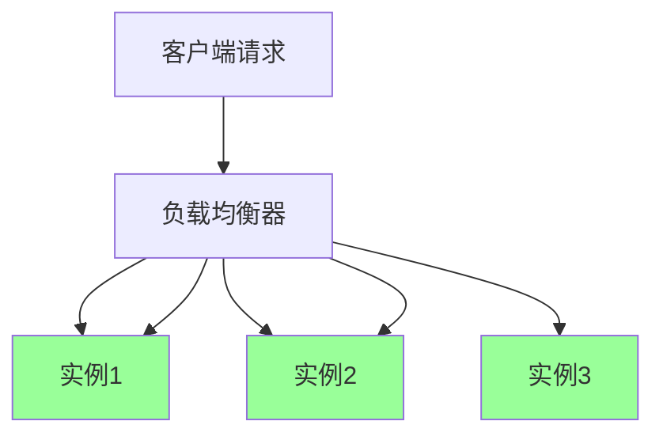
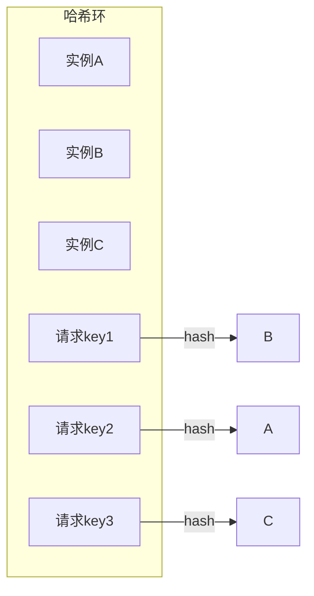
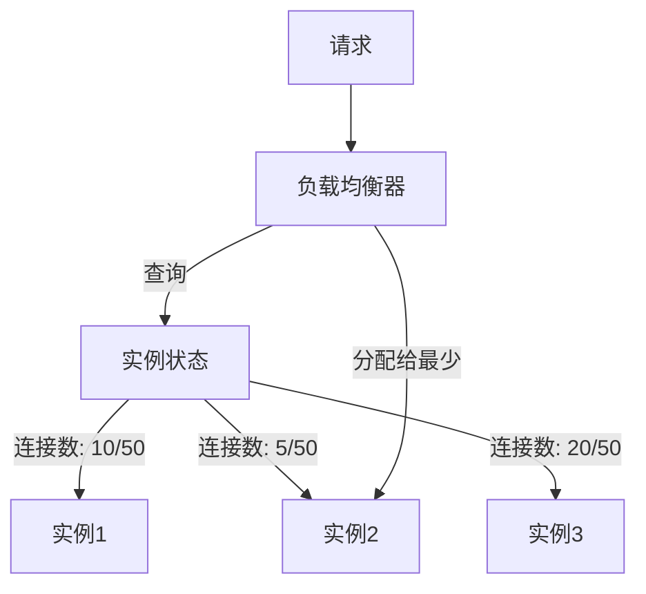
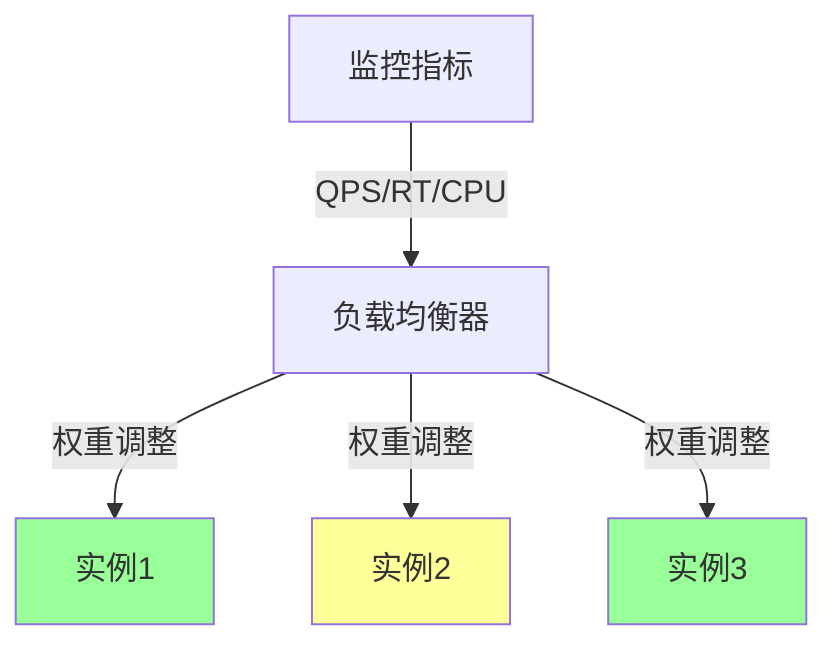
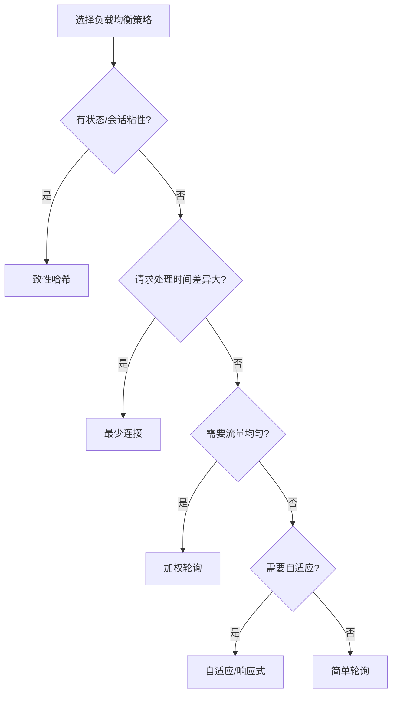

# 负载均衡策略

> **一句话摘要**：负载均衡决定「流量打给哪个实例」——从简单的轮询到自适应的一致性哈希，每种策略都有其适用场景和性能取舍。
> **本文核心**：**负载均衡 = 策略 + 权重 + 故障转移**；选错策略会导致流量倾斜和热点。

前置阅读：[健康检查与故障剔除](./3_健康检查与故障剔除-入门.md)。负载均衡是服务发现的下游——拿到可用实例列表后，决定流量怎么分配。

## 1. 背景：为什么负载均衡如此重要

> 量级分档意识：本文方法在十万级 QPS、千万级用户、亿级流量的场景下均需重新评估——量级变化时架构与参数需同步调整。


服务发现返回了可用实例列表后，流量需要分配到每个实例上。分配策略直接影响系统性能：

- **轮询策略**：流量均匀，但无法感知实例性能差异
- **加权策略**：可以按实例能力分配，但权重需要手动调整
- **一致性哈希**：保证同一请求始终到同一实例（缓存友好），但扩容时产生大量迁移

负载均衡策略的选择本质上是**「均匀性 vs 局部性 vs 自适应性」**的权衡。

## 2. 核心机制：常见策略对比

### 2.1 轮询（Round Robin）

按顺序轮流分配请求：



- **简单轮询**：每个实例轮流接收
- **加权轮询**：按权重分配（如 3:2:1）
- **加权随机**：按权重概率随机

**优点**：简单、流量均匀
**缺点**：无法感知实例实时状态

### 2.2 一致性哈希（Consistent Hashing）

将请求和实例都映射到哈希环上，同一请求始终到同一实例：



- **优点**：缓存友好（同一用户始终到同一实例）、扩容时只迁移部分流量
- **缺点**：新增实例导致部分流量迁移
- **虚拟节点**：每个实例对应多个虚拟节点，减少倾斜

**适用场景**：有状态服务、缓存依赖、会话粘性要求

### 2.3 最少连接（Least Connections）

将请求分配给当前连接数最少的实例：



- **优点**：自适应负载，适合长连接
- **缺点**：无法区分请求的处理时间

### 2.4 自适应/响应式

根据实例的实时性能动态分配：

- **响应时间加权**：响应快的实例获得更多流量
- **QPS 限流**：限制每个实例的最大 QPS
- **自适应并发**：根据 CPU/内存动态调整权重



## 3. 落地实践：策略选择决策树



**策略选择 checklist**：

1. 服务有状态吗？有 → 一致性哈希
2. 请求处理时间差异大吗？大 → 最少连接
3. 需要强均匀性吗？需要 → 加权轮询
4. 追求最佳性能？追求 → 自适应
5. 简单场景 → 轮询或随机

## 4. 落地实践：Nacos 负载均衡配置

Nacos + Spring Cloud LoadBalancer 示例：

```yaml
# 负载均衡配置
spring:
  cloud:
    loadbalancer:
      configurations:
        - default
        - retry

# 客户端负载均衡策略
service-A:
  ribbon:
    NFLoadBalancerRuleClassName: com.alibaba.cloud.nacos.ribbon.NacosRule
    # 可选: RoundRobinRule, RandomRule, BestAvailableRule, WeightResponseTimeRule
```

**常见配置组合**：

| 策略 | 适用场景 | Nacos 配置 |
|---|---|---|
| 轮询 | 无状态、均匀流量 | `NacosRule` 默认 |
| 随机 | 简单场景 | `RandomRule` |
| 权重 | 实例配置不同 | `WeightedResponseTimeRule` |
| 一致性哈希 | 有状态服务 | 自定义 Rule |

## 5. 生产视角：负载均衡踩坑

- **踩坑 1**：一致性哈希扩容导致大量缓存失效——虚拟节点数不够，倾斜严重
- **踩坑 2**：轮询策略下，某个实例处理慢导致请求堆积——应改用最少连接
- **踩坑 3**：权重配置后从不调整——新实例和老实例配置不同，权重没更新
- **踩坑 4**：负载均衡和熔断配合不当——负载均衡把流量打到已熔断的实例

**生产最佳实践**：

1. 无状态服务用加权轮询（简单可靠）
2. 有状态服务用一致性哈希 + 虚拟节点（最少 100 个/实例）
3. 长连接场景用最少连接
4. 定期 review 权重配置
5. 负载均衡 + 熔断配合使用

## 6. 典型场景

| 场景 | 推荐策略 | 理由 |
|---|---|---|
| 无状态 API | 加权轮询 | 流量均匀 |
| 会话粘性 | 一致性哈希 | 同一用户始终到同一实例 |
| 长连接/流式 | 最少连接 | 连接数最少的实例处理 |
| 大促流量 | 权重 + 限流 | 防止单实例被打满 |
| 异构实例 | 加权 | 按配置分配 |
| AI/推理服务 | 自适应 | 按 GPU 负载分配 |

## 7. 与相邻概念的区别

- **负载均衡 vs 服务发现**：服务发现回答「有哪些实例」，负载均衡回答「打哪个」
- **客户端 LB vs 服务端 LB**：客户端自己算（Spring Cloud LoadBalancer），服务端代理（K8s Service/Nginx）
- **负载均衡 vs 流量治理**：负载均衡决定分配，流量治理决定拦截/限流/灰度

## 8. 常见误区与不适用

- **「轮询最公平」**：实例性能不同，轮询不公平
- **「一致性哈希完美」**：扩容时仍需迁移数据，且虚拟节点数需要调优
- **「权重一成不变」**：实例状态变化时应动态调整权重
- **不适用场景**：只有 1 个实例（不需要负载均衡）、强一致性写（需要路由到主节点）

## 9. 你们可能会问

- **负载均衡在客户端还是服务端？** 两者都可以——客户端灵活但需 SDK，服务端简单但多了中间层
- **一致性哈希的虚拟节点数怎么选？** 100-200 个/实例，太多增加开销，太少倾斜严重
- **Nacos 支持哪些负载均衡策略？** 默认 NacosRule（加权轮询），可自定义 Rule
- **负载均衡和熔断怎么配合？** 负载均衡排除不健康实例，熔断防止级联故障——两层保护

## 10. 一句话总结 + 5W 速记卡 + 自测三问

**一句话总结**：负载均衡 = 策略选择 + 权重分配 + 故障转移——决定「流量打给谁」。

**5W 速记卡**：

| 维度 | 内容 |
|---|---|
| What | 流量分配策略：轮询/加权/一致性哈希/最少连接/自适应 |
| Why | 影响系统性能和均匀度 |
| When | 服务发现返回实例列表后 |
| Where | 客户端或服务端 |
| How | 根据场景选择策略 → 配置权重 → 配合健康检查 |

**自测三问**：

1. 你的服务有状态吗？一致性哈希的虚拟节点数配了多少？
2. 你的负载均衡策略能感知实例性能差异吗？
3. 实例扩容时，一致性哈希的迁移量是多少？

---

**下篇预告**：服务实例如何被发现——[服务注册与发现实现](./5_服务注册与发现实现-入门.md)。

**🎯 核心带走**：

- **核心一句话**：轮询均匀、哈希局部、最少连接自适应——策略匹配场景
- **链条复述**：实例列表 → 策略选择 → 权重分配 → 故障转移
- **失效点与边界**：一致性哈希扩容迁移；轮询无法感知性能差异

💡 **实战提示**：选负载均衡策略时先问「我的服务有状态吗？」——有状态 → 一致性哈希，无状态 → 轮询或加权。

**开放问题**：客户端负载均衡和服务端负载均衡能混用吗？答案是：能——网关用服务端，内部服务用客户端，各层各司其职。

**决策（何时用）**：无状态服务用加权轮询；有状态服务用一致性哈希；长连接用最少连接；追求最优用自适应。

## 📌 数据与事实声明

- 写于 2026-09-11
- 免责：以官方文档为准

## 📚 参考资料

| 类型 | 标题 | 来源 |
|---|---|---|
| 官方文档 | 官方文档 | 官方站点 |
