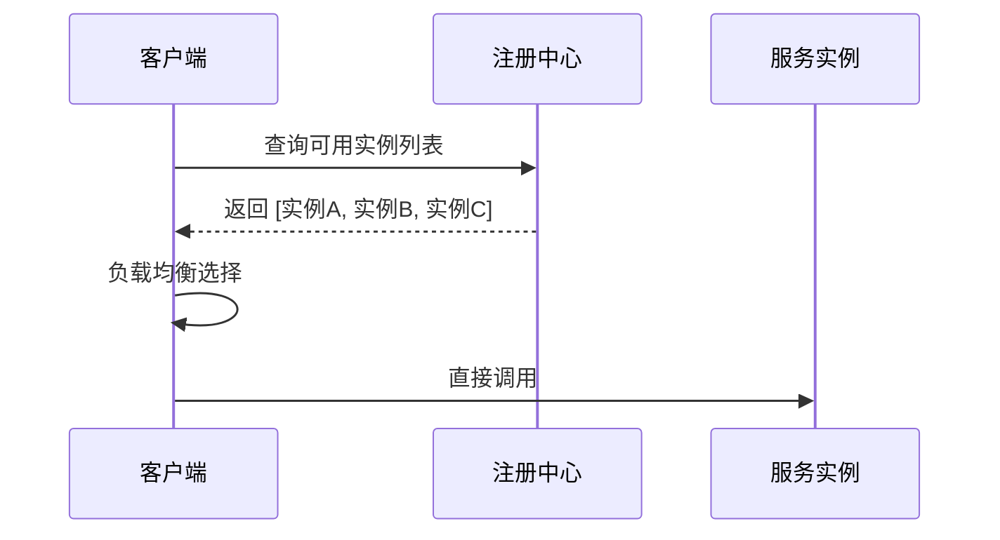
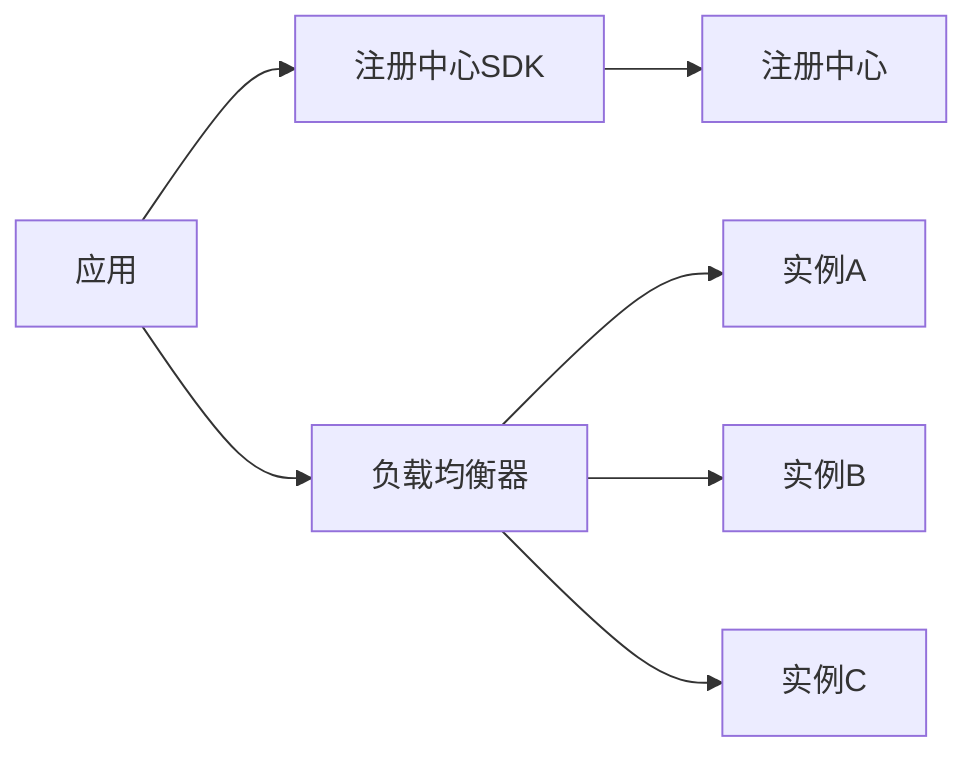
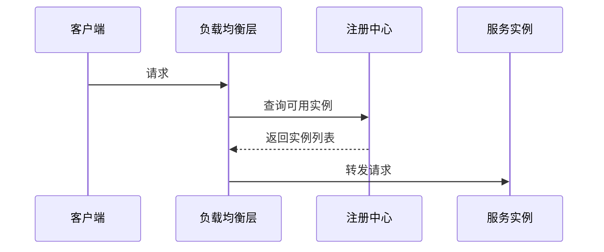
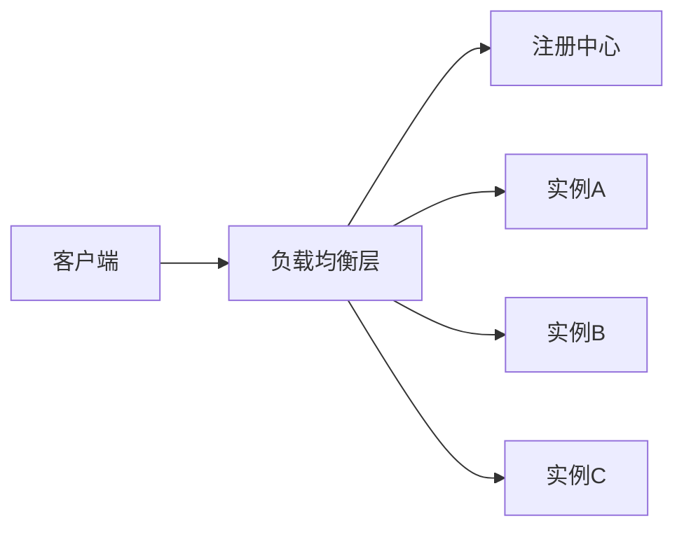
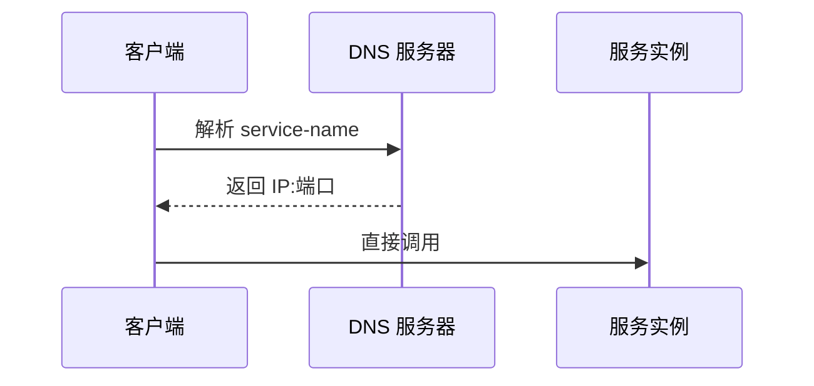
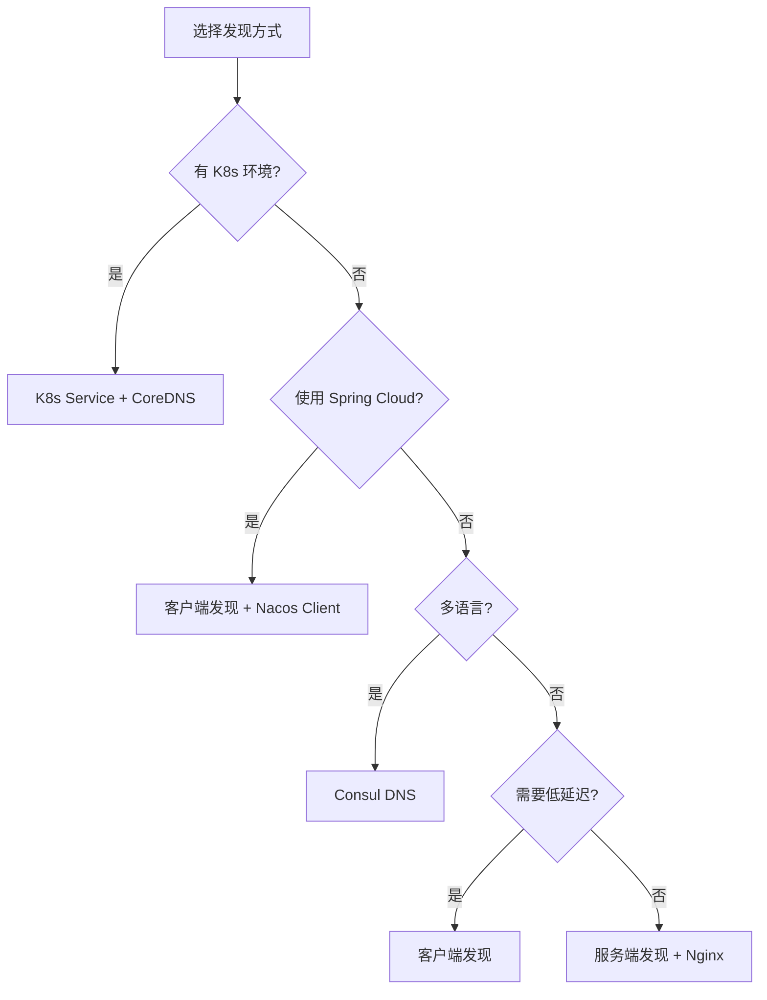

# 服务注册与发现实现

> **一句话摘要**：服务发现的实现方式有两种——客户端自己查注册中心（客户端发现）或由中间层代理查询（服务端发现）；两者各有优劣，选型取决于「谁来做负载均衡」。
> **本文核心**：**发现实现 = 客户端发现 + 服务端发现 + DNS 发现**；方式不同，架构复杂度和侵入性不同。

前置阅读：[负载均衡策略](./4_负载均衡策略-入门.md)。负载均衡策略决定了流量分配，本篇讲的是「流量分配前如何获取实例列表」。

## 1. 背景：为什么需要区分发现方式

> 量级分档意识：本文方法在十万级 QPS、千万级用户、亿级流量的场景下均需重新评估——量级变化时架构与参数需同步调整。


同样的服务发现目标，可以有不同的实现架构：

- **客户端发现**：客户端自己查注册中心，自己做负载均衡
- **服务端发现**：客户端只发请求，中间层（LB）查注册中心并转发
- **DNS 发现**：客户端通过 DNS 解析获取地址

三种方式的核心区别是**「谁持有注册中心的感知」**——客户端持有、中间层持有、还是 DNS 持有。

## 2. 核心机制：三种发现模式

### 2.1 客户端发现（Client-side Discovery）

客户端直接查询注册中心并做负载均衡：



**特点**：
- 客户端持有注册中心客户端 SDK
- 客户端负责负载均衡逻辑
- 延迟最低（无中间层）
- 客户端需要维护 SDK

**代表组件**：Spring Cloud LoadBalancer + Nacos Client



### 2.2 服务端发现（Server-side Discovery）

客户端不感知注册中心，由负载均衡层代理查询：



**特点**：
- 客户端无感知（不需要注册中心 SDK）
- 负载均衡层集中管理
- 中间层可能是单点
- 客户端简单但中间层复杂

**代表组件**：K8s Service + Endpoint Controller、Nginx + Consul Template



### 2.3 DNS 发现（DNS-based Discovery）

通过 DNS 解析服务名获取地址：



**特点**：
- 最简单（只需 DNS 支持）
- TTL 不可控（DNS 缓存）
- 无健康检查（DNS 不感知实例状态）
- 适合 K8s 环境

**代表组件**：K8s CoreDNS、Consul DNS Interface

### 2.4 三种模式对比

| 维度 | 客户端发现 | 服务端发现 | DNS 发现 |
|---|---|---|---|
| 侵入性 | 高（需 SDK） | 低 | 极低 |
| 延迟 | 低 | 中 | 中 |
| 健康检查 | 强 | 强 | 弱 |
| 单点风险 | 无 | 有（LB） | 无（DNS 集群） |
| 运维复杂度 | 中 | 中 | 低 |
| 适合场景 | Spring Cloud | K8s/Service Mesh | 简单场景 |

## 3. 落地实践：选型决策树



## 4. 落地实践：代码示例

### 4.1 客户端发现（Spring Cloud + Nacos）

```java
// 1. 引入依赖
// spring-cloud-starter-alibaba-nacos-discovery

// 2. 启用服务发现
@SpringBootApplication
@EnableDiscoveryClient
public class OrderService {
    public static void main(String[] args) {
        SpringApplication.run(OrderService.class, args);
    }
}

// 3. 使用 LoadBalancer 调用
@RestController
public class OrderController {
    @Autowired
    private LoadBalancerClient loadBalancer;

    public String callInventory() {
        ServiceInstance instance = loadBalancer.choose("inventory-service");
        return restTemplate.getForObject(
            instance.getUri() + "/stock", String.class);
    }
}
```

### 4.2 服务端发现（K8s Service）

```yaml
# K8s Service 定义
apiVersion: v1
kind: Service
metadata:
  name: inventory-service
spec:
  selector:
    app: inventory  # 自动匹配 Pod 标签
  ports:
    - port: 8080
      targetPort: 8080
  type: ClusterIP
```

```java
// 客户端无需任何 SDK
@RestController
public class OrderController {
    @Autowired
    private RestTemplate restTemplate;

    public String callInventory() {
        // 直接通过 K8s Service DNS 调用
        return restTemplate.getForObject(
            "http://inventory-service:8080/stock", String.class);
    }
}
```

### 4.3 DNS 发现（Consul）

```bash
# 通过 Consul DNS 查询服务
dig @127.0.0.1 -p 8600 inventory.service.consul
# 返回: inventory.service.consul. 30 IN A 10.0.0.2
```

## 5. 生产视角：发现方式踩坑

- **踩坑 1**：客户端 SDK 版本不一致——一个服务用 Nacos 2.x，另一个用 1.x，注册中心兼容性问题
- **踩坑 2**：服务端 LB 是单点——Nginx 挂了，整个调用链中断
- **踩坑 3**：DNS TTL 太长——实例变更后 DNS 缓存未更新，流量打到旧地址
- **踩坑 4**：客户端缓存过期——注册中心已剔除实例，客户端仍缓存旧列表

**生产最佳实践**：

1. K8s 环境优先用 K8s Service（最简单）
2. 客户端缓存 + 短 TTL（避免过期）
3. 服务端 LB 集群化（避免单点）
4. 定期验证 DNS 解析结果

## 6. 典型场景

| 场景 | 推荐方式 | 理由 |
|---|---|---|
| Spring Cloud 微服务 | 客户端发现 | SDK 集成简单 |
| K8s 原生服务 | DNS 发现 | 不需要额外组件 |
| 混合语言架构 | 服务端发现 | 客户端无感知 |
| 低延迟要求 | 客户端发现 | 无中间层 |
| 快速起步 | DNS 发现 | 配置最简单 |
| 多数据中心 | 服务端发现 | 集中管理 |

## 7. 与相邻概念的区别

- **客户端发现 vs 服务端发现**：谁来做负载均衡——客户端自己算 vs 中间层代理
- **服务发现 vs 服务治理**：发现是「找到谁」，治理是「怎么管控」
- **服务发现 vs API 网关**：网关是入口，发现是内部寻址

## 8. 常见误区与不适用

- **「客户端发现性能最好」**：性能差异在微秒级，不是主要考量因素
- **「服务端发现更安全」**：服务端 LB 本身可能成为单点故障
- **「DNS 发现太简单」**：K8s 环境下 DNS 发现完全够用
- **不适用场景**：同进程内调用（不需要网络发现）

## 9. 你们可能会问

- **客户端发现和 Spring Cloud LoadBalancer 是什么关系？** LoadBalancer 是客户端发现的实现框架，Nacos Client 是具体的注册中心客户端。
- **K8s Service 是服务端发现还是 DNS 发现？** 两者都是——K8s Service 是服务端发现，CoreDNS 是 DNS 发现，底层共享同一个 Endpoint 列表。
- **服务发现能跨集群吗？** 能——Nacos/Consul 支持多数据中心同步。
- **服务发现和 API 网关的关系？** 网关通过服务发现获取后端实例列表，然后路由到具体实例。

## 10. 一句话总结 + 5W 速记卡 + 自测三问

**一句话总结**：服务发现实现方式 = 客户端发现 + 服务端发现 + DNS 发现——谁持有注册中心感知，谁做负载均衡。

**5W 速记卡**：

| 维度 | 内容 |
|---|---|
| What | 客户端/服务端/DNS 三种发现模式 |
| Why | 不同场景需要不同的侵入性和复杂度 |
| When | 微服务架构设计时 |
| Where | 客户端、服务端、DNS 三层 |
| How | K8s → DNS；Spring Cloud → 客户端；混合 → 服务端 |

**自测三问**：

1. 你的系统用什么发现方式？客户端 SDK 还是中间层代理？
2. 你的发现方式有单点风险吗？缓存策略是什么？
3. 如果注册中心挂了，客户端还能工作吗？

---

**下篇预告**：流量治理如何让服务发现更智能——[流量治理与路由](./6_流量治理与路由-入门.md)。

**🎯 核心带走**：

- **核心一句话**：发现方式的选择取决于「谁来做负载均衡」——客户端、服务端还是 DNS
- **链条复述**：注册中心 → 客户端SDK/中间层/DNS → 实例列表 → 调用
- **失效点与边界**：DNS 缓存过期；客户端缓存不一致；LB 单点

💡 **实战提示**：K8s 环境直接用 Service，不加额外组件；非 K8s 环境才需要选客户端/服务端。

**开放问题**：Service Mesh 出现后，客户端发现和服务端发现会消失吗？答案是：Sidecar 替代了客户端 SDK，但底层仍是服务端发现——只是把 LB 从「显式组件」变成了「Sidecar 代理」。

**决策（何时用）**：K8s 用 DNS；Spring Cloud 用客户端；多语言用服务端；追求极简用 DNS。

## 📌 数据与事实声明

- 写于 2026-09-11
- 免责：以官方文档为准

## 📚 参考资料

| 类型 | 标题 | 来源 |
|---|---|---|
| 官方文档 | 官方文档 | 官方站点 |
