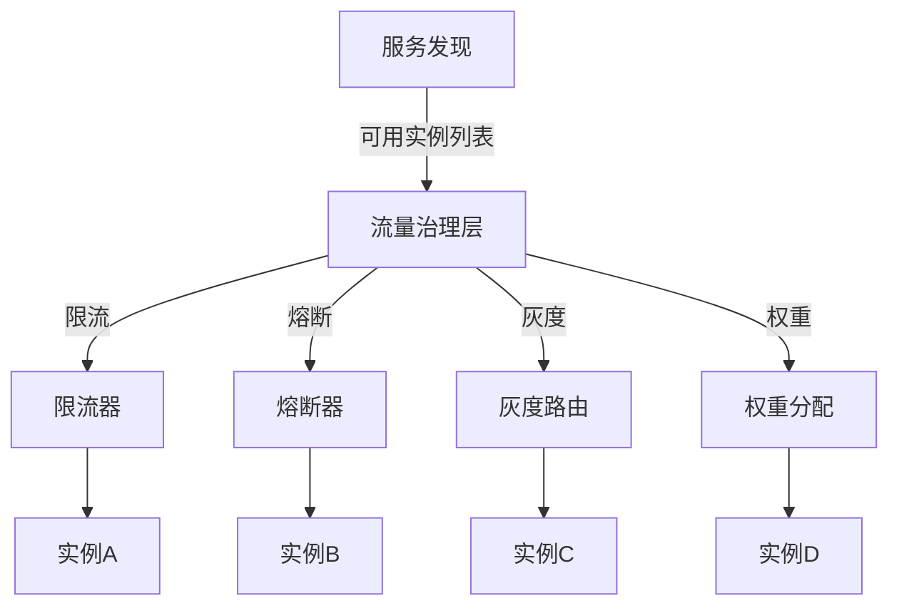
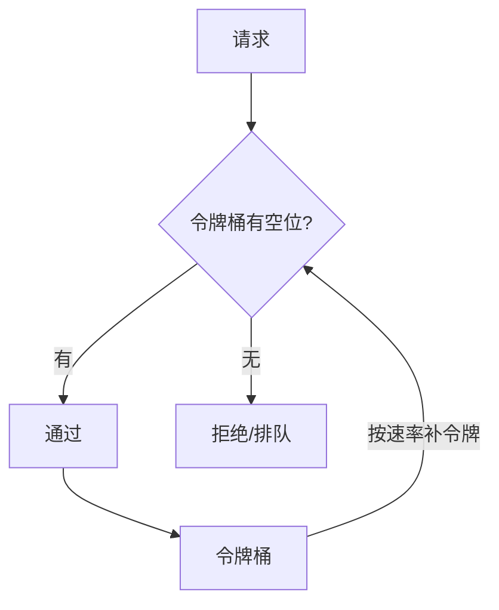
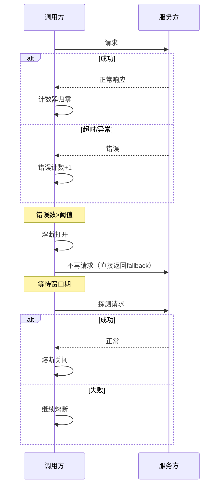
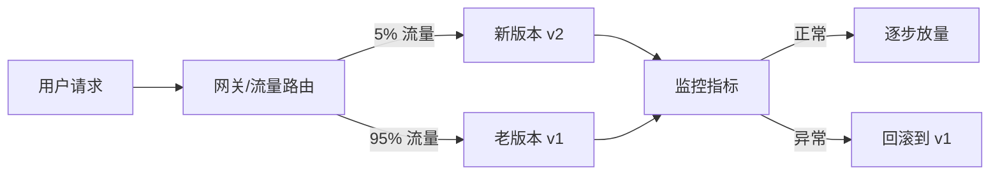
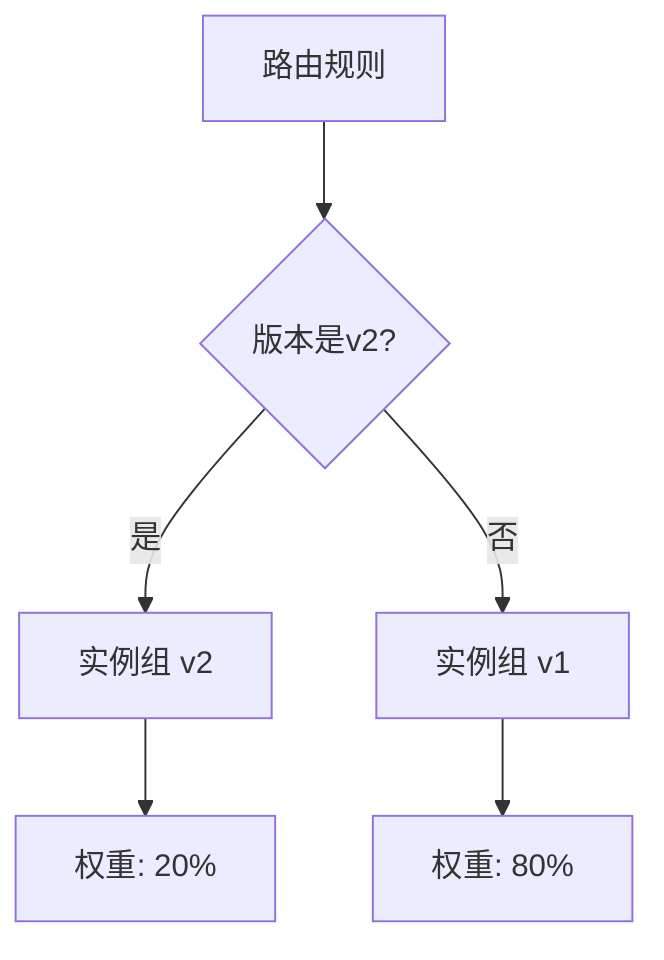
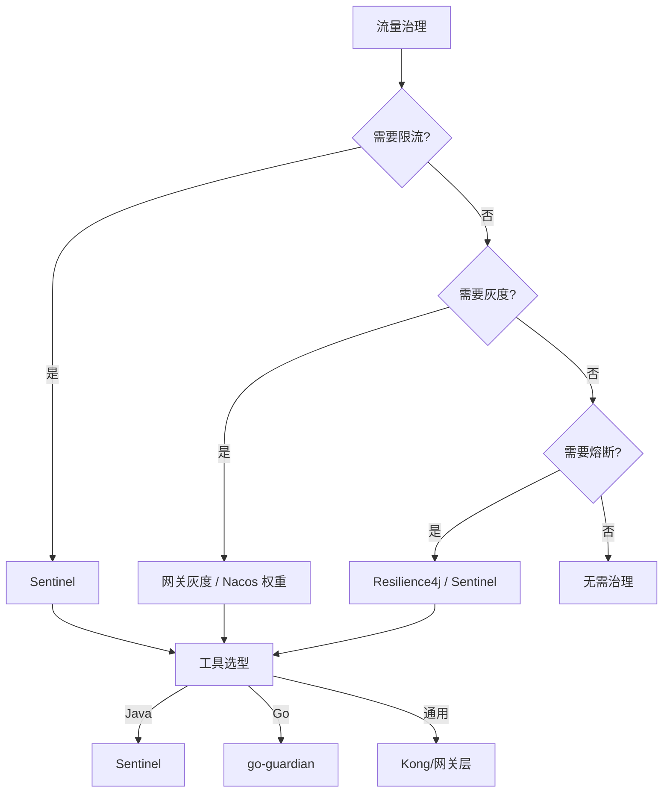

# 流量治理与路由

> **一句话摘要**：流量治理是在服务发现的基础上叠加的管控层——限流、熔断、灰度发布、权重路由，让系统从「能跑」变成「能扛」。
> **本文核心**：**流量治理 = 限流 + 熔断 + 灰度 + 路由**；没有治理的发现只是裸地址簿。

前置阅读：[服务注册与发现实现](./5_服务注册与发现实现-入门.md)。流量治理是服务发现的下游——拿到实例列表后，对流量进行管控。

## 1. 背景：为什么需要流量治理

服务发现解决了「找到谁」的问题，但没解决「怎么管控」的问题：

- 大促时所有流量打到同一个服务，服务扛不住
- 某个实例故障，流量仍打到该实例
- 新版本上线，需要灰度验证但不知道怎么控制流量比例
- 老版本需要逐步下线，但不知道存量流量在哪

流量治理就是在服务发现的地址簿上叠加一层管控逻辑：



## 2. 核心机制：四层治理

### 2.1 限流（Rate Limiting）

限制单位时间内的请求数量，防止系统被压垮：



**常见限流算法**：

| 算法 | 原理 | 优点 | 缺点 |
|---|---|---|---|
| 令牌桶 | 按速率生成令牌，桶满则丢弃 | 允许突发流量 | 需要调整桶大小 |
| 漏桶 | 请求流入桶，按固定速率流出 | 流量均匀 | 不允许突发 |
| 计数器 | 固定窗口计数 | 简单 | 窗口边界突发 |
| 滑动窗口 | 窗口滑动计数 | 平滑 | 实现复杂 |

**生产配置**：

```yaml
# Sentinel 限流配置
rules:
  - resource: inventory-service
    grade: QPS         # 限流维度
    count: 1000        # QPS 阈值
    controlBehavior: WARM_UP  # 预热模式
```

### 2.2 熔断（Circuit Breaking）

当服务故障率超过阈值时，自动切断调用，防止级联故障：



**熔断三态**：

| 状态 | 行为 | 触发条件 |
|---|---|---|
| 关闭 | 正常调用 | 错误率低于阈值 |
| 打开 | 拒绝所有调用 | 错误率超过阈值 |
| 半开 | 允许少量探测 | 窗口期后 |

### 2.3 灰度发布（Canary Release）

按比例将流量分发到不同版本：



**灰度实现方式**：

- **Header 路由**：按请求头区分版本
- **Cookie 路由**：按用户标识区分
- **权重路由**：按百分比分配
- **标签路由**：按实例标签区分

### 2.4 路由与权重

按规则将流量路由到不同实例：



## 3. 落地实践：Sentinel 配置模板

Sentinel 是阿里开源的流量治理组件，与 Nacos 深度集成：

```java
// 1. 限流规则
@RestController
public class InventoryController {
    @GetMapping("/stock")
    @SentinelResource(value = "stock", blockHandler = "fallback")
    public String getStock() {
        return stockService.get();
    }

    public String fallback(BlockException ex) {
        return "系统繁忙，请稍后重试";
    }
}

// 2. 熔断规则
@SentinelResource(value = "order", 
    fallback = "orderFallback",
    blockHandler = "blockHandler")
public String createOrder() { ... }

// 3. 灰度规则
// 在 Nacos 控制台配置：流量 → 路由规则 → 版本标签
```

**Sentinel + Nacos 联动**：

```yaml
# Nacos 配置中心推送限流规则
dataId: inventory-service-sentinel
group: DEFAULT_GROUP
content: |
  [
    {
      "resource": "/stock",
      "grade": 1,
      "count": 500,
      "controlBehavior": 1
    }
  ]
```

## 4. 落地实践：选型决策树



## 5. 生产视角：治理踩坑

- **踩坑 1**：限流阈值设得太低——正常流量也被拒绝，系统利用率低
- **踩坑 2**：熔断窗口期太短——刚恢复就被再次熔断，频繁开关
- **踩坑 3**：灰度 100% 一步到位——灰度变成全量，出了问题回滚慢
- **踩坑 4**：治理规则和代码耦合——规则改了需要发版

**生产最佳实践**：

1. 限流阈值 = 正常 QPS × 1.5 + 预留缓冲
2. 熔断窗口 = 60 秒（足够观察恢复）
3. 灰度从 1% → 5% → 20% → 50% → 100%
4. 治理规则放配置中心（Nacos），与代码解耦
5. 限流 + 熔断配合使用

## 6. 典型场景

| 场景 | 治理手段 | 理由 |
|---|---|---|
| 大促流量 | 限流 + 排队 | 防止系统被压垮 |
| 服务故障 | 熔断 + 降级 | 防止级联故障 |
| 新版本发布 | 灰度 + 权重 | 逐步验证 |
| 老版本下线 | 权重逐步归零 | 平滑迁移 |
| 读写分离 | 路由 + 权重 | 主从分离 |
| 多租户 | 路由 + 隔离 | 资源隔离 |

## 7. 与相邻概念的区别

- **流量治理 vs 负载均衡**：负载均衡分配流量，治理管控流量——分配是「怎么分」，治理是「分多少/能不能分」
- **流量治理 vs 服务降级**：治理是自动化的管控机制，降级是人工决策的预案
- **限流 vs 熔断**：限流是「限制进入量」，熔断是「停止调用」——限流是预防，熔断是止损

## 8. 常见误区与不适用

- **「限流就是把阈值设低」**：阈值过低导致正常请求被拒，应基于压测数据
- **「熔断后就不用管了」**：熔断后需要监控恢复状态，半开探测
- **「灰度就是 50/50」**：灰度比例应逐步递增，不是固定 50%
- **不适用场景**：单体系统（不需要治理）、简单调用链（治理成本高于收益）

## 9. 你们可能会问

- **限流和熔断的区别是什么？** 限流是「限制进入量」（预防），熔断是「停止调用」（止损）
- **Sentinel 和 Resilience4j 选哪个？** Java 选 Sentinel（阿里生态），轻量选 Resilience4j
- **灰度发布和蓝绿部署的区别？** 灰度是按比例分流，蓝绿是全量切换
- **治理规则怎么动态调整？** 放 Nacos 配置中心，动态推送，无需重启

## 10. 一句话总结 + 5W 速记卡 + 自测三问

**一句话总结**：流量治理 = 限流 + 熔断 + 灰度 + 路由——让系统从「能跑」变成「能扛」。

**5W 速记卡**：

| 维度 | 内容 |
|---|---|
| What | 限流/熔断/灰度/路由四种治理手段 |
| Why | 防止级联故障、实现平滑发布 |
| When | 服务上线和大促期间 |
| Where | 所有微服务入口 |
| How | Sentinel 配置规则 + 动态推送 |

**自测三问**：

1. 你的系统限流阈值是多少？是基于压测还是拍脑袋？
2. 你的熔断窗口期是多久？为什么是这个值？
3. 你的灰度发布流程是什么？从多少比例开始？

---

**下篇预告**：多注册中心和高可用架构——[多注册中心与高可用](./7_多注册中心与高可用-入门.md)。

**🎯 核心带走**：

- **核心一句话**：限流预防压垮、熔断止损、灰度验证、路由分配——四者协同
- **链条复述**：限流(限制进入) → 熔断(停止调用) → 灰度(逐步验证) → 路由(分配流量)
- **失效点与边界**：阈值过低误拒正常请求；窗口期过短频繁开关

💡 **实战提示**：Sentinel 规则放 Nacos 配置中心，动态调整无需重启——这是治理的生命线。

**开放问题**：限流和熔断同时存在时，哪个先触发？答案是：限流先触发（限制进入量），熔断后触发（调用失败累积）——两者是不同层面的保护。

**决策（何时用）**：高并发入口必须限流；依赖下游必须熔断；新版本必须灰度；所有服务都需要路由规则。
