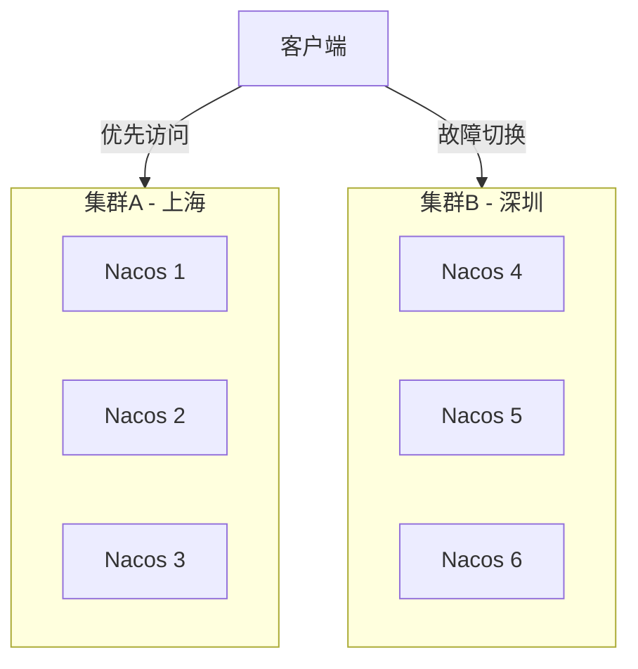
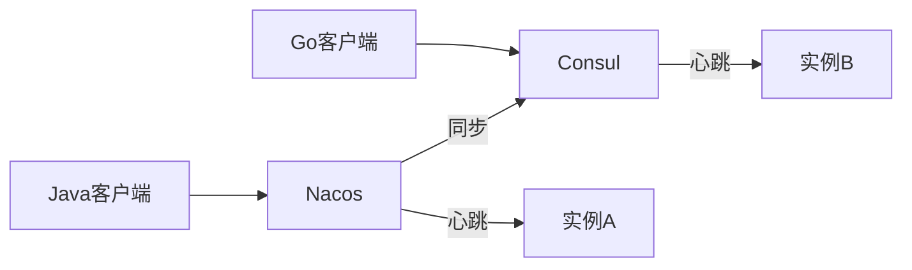
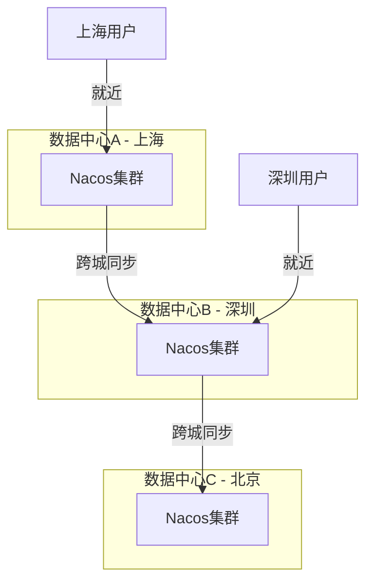
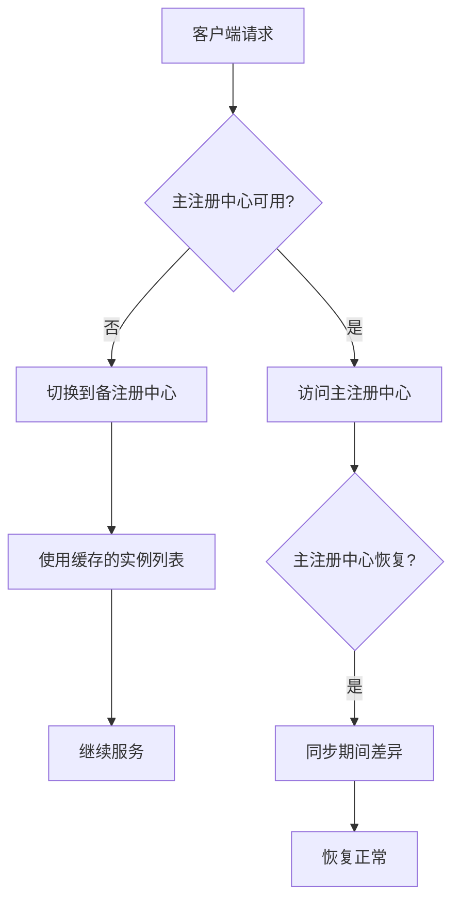

# 多注册中心与高可用

> **一句话摘要**：单机注册中心存在单点风险，多注册中心架构通过双活同步、故障切换、多集群部署来保证注册服务本身的高可用。
> **本文核心**：**注册中心高可用 = 多集群 + 同步 + 故障切换**；注册中心挂了，整个系统都会受影响。

前置阅读：[流量治理与路由](./6_流量治理与路由-入门.md)。多注册中心是服务发现的保障层——确保发现服务本身可靠。

## 1. 背景：为什么注册中心本身需要高可用

> 量级分档意识：本文方法在十万级 QPS、千万级用户、亿级流量的场景下均需重新评估——量级变化时架构与参数需同步调整。


服务发现是整个微服务架构的寻址层——如果注册中心挂了：

- 新实例无法注册（扩容失败）
- 旧实例无法被剔除（故障实例仍在列表中）
- 客户端获取不到最新列表（流量打到已下线实例）

**注册中心单点是架构级别的风险**——必须有多注册中心方案。

## 2. 核心机制：三种高可用方案

### 2.1 多集群部署

同一注册中心部署多个集群实例：



**特点**：同构集群，数据一致，客户端按优先级访问。

### 2.2 双注册中心同步

两个不同的注册中心之间同步数据：



**特点**：异构注册中心共存，适合多语言混合架构。

### 2.3 多数据中心

跨地域部署注册中心，支持异地多活：



**特点**：跨地域部署，延迟最低，数据最终一致。

## 3. 落地实践：故障切换策略



**故障切换的三种模式**：

| 模式 | 行为 | 适用场景 |
|---|---|---|
| 硬切换 | 主不可用立即切备 | 对可用性要求极高 |
| 软切换 | 短暂重试后再切 | 允许短暂延迟 |
| 缓存模式 | 用本地缓存继续 | 允许短暂不一致 |

**客户端缓存策略**：

```yaml
# Nacos 客户端缓存配置
nacos:
  discovery:
    cache-enabled: true        # 启用缓存
    cache-dir: ./nacos-cache   # 缓存目录
    refresh-interval: 30000    # 30秒刷新间隔
```

## 4. 落地实践：Nacos 多集群配置

```yaml
# Nacos 集群配置
server:
  port: 8848
spring:
  cloud:
    nacos:
      discovery:
        server-addr: nacos-cluster-a:8848,nacos-cluster-b:8848
        # 多个地址用逗号分隔
```

**多集群部署拓扑**：

```
┌─────────────────┐     ┌─────────────────┐
│   集群A (上海)    │     │   集群B (深圳)    │
│  3节点 Raft     │◄───►│  3节点 Raft     │
│  Nacos Server   │     │  Nacos Server   │
└─────────────────┘     └─────────────────┘
        │                       │
        └────── 跨城同步 ────────┘
```

## 5. 生产视角：踩坑实录

- **踩坑 1**：只有一个 Nacos 集群——Nacos Leader 挂了，整个注册中心不可用
- **踩坑 2**：多集群同步延迟——上海集群和深圳集群有 3 秒延迟，用户在深圳看到上海刚上的服务
- **踩坑 3**：客户端缓存过期——Nacos 挂了 5 分钟，客户端缓存了过期的实例列表
- **踩坑 4**：跨城网络抖动——上海和深圳之间网络闪断，集群间数据不一致

**生产最佳实践**：

1. 至少 3 节点 Raft 集群（单数据中心）
2. 跨城部署时，客户端优先访问本地集群
3. 客户端启用缓存 + 短刷新间隔
4. 监控集群间同步延迟
5. 定期演练注册中心故障切换

## 6. 典型场景

| 场景 | 方案 | 理由 |
|---|---|---|
| 单机房小规模 | 单集群 3 节点 | 简单够用 |
| 同城双活 | 多集群 + 同步 | 机房级容灾 |
| 异地多活 | 多数据中心 | 跨地域低延迟 |
| 多语言混合 | 双注册中心同步 | Nacos + Consul 各取所需 |
| 混合云 | 多云注册中心 | 不同云厂商 |

## 7. 与相邻概念的区别

- **多注册中心 vs 注册中心集群**：集群是同一软件的多个实例，多注册中心是不同软件的组合
- **注册中心高可用 vs 服务高可用**：前者保证发现服务可用，后者保证业务服务可用
- **多数据中心 vs 多集群**：数据中心是物理隔离，集群是逻辑隔离

## 8. 常见误区与不适用

- **「一个集群就够了」**：Leader 挂了集群不可用——Raft 只能容忍少数派挂掉
- **「多集群 = 数据一致」**：跨集群同步有延迟，不是实时一致
- **「跨城部署很简单」**：跨城网络延迟是最大挑战
- **不适用场景**：单体系统（不需要高可用）

## 9. 你们可能会问

- **Nacos 集群需要几台？** 至少 3 台（Raft 多数派）
- **跨城同步延迟能控制在多少？** 通常 1-3 秒，取决于网络
- **注册中心挂了客户端怎么处理？** 缓存 + 重试 + 降级
- **多数据中心和异地多活什么关系？** 多数据中心是基础设施，异地多活是业务架构

## 10. 一句话总结 + 5W 速记卡 + 自测三问

**一句话总结**：注册中心高可用 = 多集群 + 同步 + 故障切换 + 客户端缓存。

**5W 速记卡**：

| 维度 | 内容 |
|---|---|
| What | 多集群部署 + 跨城同步 + 故障切换 |
| Why | 注册中心单点 = 全系统不可用 |
| When | 服务发现架构设计时 |
| Where | 注册中心 + 客户端 |
| How | 3节点集群 → 多集群同步 → 客户端缓存 |

**自测三问**：

1. 你的注册中心有几台节点？挂了 Leader 会怎样？
2. 你的客户端有缓存策略吗？缓存多久过期？
3. 你的注册中心挂了客户端还能工作吗？能多久？

---

**下篇预告**：K8s 环境下的服务发现——[服务发现与 K8s 集成](./8_服务发现与K8s集成-入门.md)。

**🎯 核心带走**：

- **核心一句话**：注册中心高可用 = 多集群 + 客户端缓存 + 故障切换
- **链条复述**：多节点集群 → 客户端缓存 → 故障切换 → 恢复同步
- **失效点与边界**：跨城同步延迟；缓存过期导致不一致

💡 **实战提示**：至少 3 节点 Raft 集群 + 客户端缓存——这是服务发现高可用的底线。

**开放问题**：注册中心挂了，客户端用缓存继续工作期间，新上线的实例能被感知吗？答案是：不能——缓存期间客户端不知道新实例，这是可用性 vs 一致性的取舍。

**决策（何时用）**：小规模单集群 3 节点；同城双活多集群；异地多活多数据中心。


> **演进视角**：多注册中心与高可用 的实践经历了持续演进。

## 📌 数据与事实声明

- 写于 2026-09-11
- 免责：以官方文档为准

## 📚 参考资料

| 类型 | 标题 | 来源 |
|---|---|---|
| 官方文档 | 官方文档 | 官方站点 |
