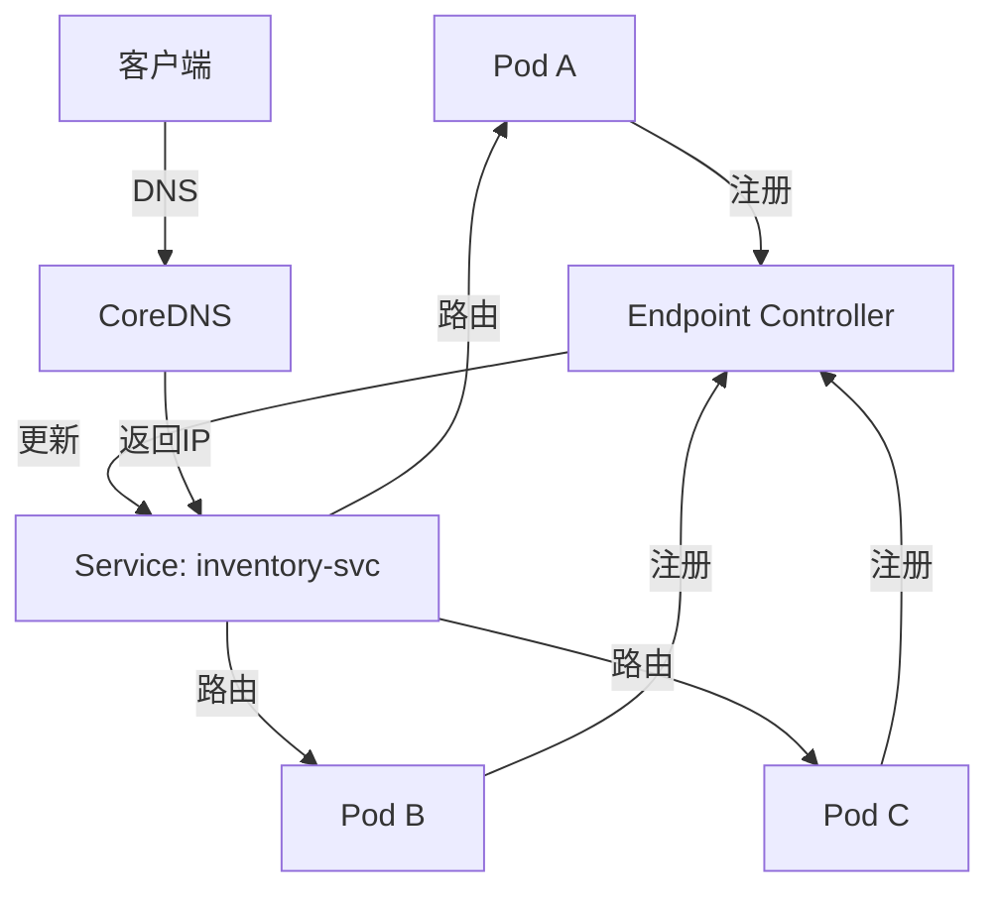

# 服务发现与 K8s 集成

> **一句话摘要**：K8s 原生提供了 Service + Endpoint + CoreDNS 的服务发现机制——理解了 K8s 服务发现，就理解了云原生架构的寻址层。
> **本文核心**：**K8s 服务发现 = Service + Endpoint + DNS**；这是最简单也是最强大的发现方案。

前置阅读：[多注册中心与高可用](./7_多注册中心与高可用-入门.md)。K8s 服务发现是云原生的标准方案——不需要额外组件。

## 1. 背景：K8s 为什么自带服务发现

> 量级分档意识：本文方法在十万级 QPS、千万级用户、亿级流量的场景下均需重新评估——量级变化时架构与参数需同步调整。


K8s 的核心设计理念之一是「声明式 API + 控制器」——Service 对象自动管理 Pod 的网络访问：

- Pod IP 不固定（创建/销毁/重启都会变）
- Pod 数量动态变化（Horizontal Pod Autoscaler）
- 需要一种机制将固定的 Service 名映射到动态的 Pod 列表

K8s 自己解决了这个问题：



## 2. 核心机制：三层模型

### 2.1 Service：抽象层

Service 是一个稳定的虚拟 IP 和 DNS 名：

```yaml
apiVersion: v1
kind: Service
metadata:
  name: inventory-service
spec:
  selector:
    app: inventory        # 匹配标签
  ports:
    - port: 8080
      targetPort: 8080
      protocol: TCP
  type: ClusterIP          # 集群内访问
```

**Service 类型**：

| 类型 | 访问范围 | 用途 |
|---|---|---|
| ClusterIP | 集群内 | 默认，内部服务调用 |
| NodePort | 集群外(节点端口) | 测试/快速暴露 |
| LoadBalancer | 外部(云LB) | 生产外部访问 |
| ExternalName | 外部(CNAME) | 指向外部服务 |

### 2.2 Endpoint：地址层

Endpoint Controller 监控 Pod 变化，自动更新 Endpoints 对象：

```yaml
apiVersion: v1
kind: Endpoints
metadata:
  name: inventory-service
subsets:
  - addresses:
      - ip: 10.244.1.2
      - ip: 10.244.1.3
      - ip: 10.244.1.4
    ports:
      - port: 8080
```

**Endpoint 生命周期**：

```mermaid
sequenceDiagram
    Controller[Endpoint Controller] -->|监控| Pod[Pod 列表]
    Pod-->|创建| Controller
    Controller-->|更新| EP[Endpoints对象]
    Pod-->|删除| Controller
    Controller-->|移除| EP
    Note over Controller,EP: 实时同步
```

### 2.3 CoreDNS：域名解析

CoreDNS 将 Service 名解析为 ClusterIP：

```
inventory-service.default.svc.cluster.local → 10.96.123.45
```

**DNS 域名格式**：

| 层级 | 格式 | 示例 |
|---|---|---|
| 服务名 | `<name>.<namespace>.svc.cluster.local` | `inventory.default.svc.cluster.local` |
| 简短 | `<name>.<namespace>` | `inventory.default` |
| 同命名空间 | `<name>` | `inventory` |

## 3. 落地实践：K8s 服务发现配置

### 3.1 基础 Service

```yaml
# service.yaml
apiVersion: v1
kind: Service
metadata:
  name: order-service
  namespace: default
spec:
  selector:
    app: order
    version: "1.0"
  ports:
    - port: 8080
      targetPort: 8080
  type: ClusterIP
---
# deployment.yaml
apiVersion: apps/v1
kind: Deployment
metadata:
  name: order-deployment
spec:
  replicas: 3
  selector:
    matchLabels:
      app: order
      version: "1.0"
  template:
    metadata:
      labels:
        app: order
        version: "1.0"
    spec:
      containers:
        - name: order
          image: order-service:v1.0
          ports:
            - containerPort: 8080
```

### 3.2 Headless Service（无头服务）

直接返回 Pod IP 列表（不代理）：

```yaml
apiVersion: v1
kind: Service
metadata:
  name: order-headless
spec:
  clusterIP: None        # 无头
  selector:
    app: order
  ports:
    - port: 8080
```

**适用场景**：StatefulSet、有状态服务、需要直接访问 Pod IP 的场景

### 3.3 外部服务发现

```yaml
apiVersion: v1
kind: Service
metadata:
  name: external-db
spec:
  type: ExternalName
  externalName: my-db.cloud.com  # CNAME 指向
```

## 4. 落地实践：K8s 服务发现 vs 外部注册中心

| 场景 | 方案 | 优点 | 缺点 |
|---|---|---|---|
| 纯 K8s | K8s Service | 简单、无额外组件 | 无灰度、无跨集群 |
| K8s + Nacos | 双注册 | 灰度+跨集群 | 复杂 |
| K8s + Service Mesh | Istio | 精细化治理 | 复杂度最高 |

**K8s 原生够用的场景**：

- 所有服务都在 K8s 内
- 不需要灰度发布
- 不需要跨集群
- 不需要复杂路由

**需要外部注册中心的场景**：

- 混合 K8s + 物理机
- 需要灰度/金丝雀发布
- 跨集群/多云
- 精细化流量治理

## 5. 生产视角：踩坑实录

- **踩坑 1**：Service 的 selector 和 Pod 标签不匹配——Endpoints 为空，服务不可达
- **踩坑 2**：DNS TTL 缓存——CoreDNS 响应被客户端缓存，实例变化后仍连接旧 IP
- **踩坑 3**：Session 亲和性导致流量倾斜——同一个客户端始终打到同一个 Pod
- **踩坑 4**：ExternalName 类型延迟高——DNS 解析有额外延迟

**生产最佳实践**：

1. 使用 `kubectl get endpoints <service>` 验证 Endpoints 是否正常
2. 客户端禁用 DNS 缓存或设置短 TTL
3. 不滥用 Session 亲和性
4. 定期验证 DNS 解析结果

## 6. 典型场景

| 场景 | 方案 | 理由 |
|---|---|---|
| 内部服务调用 | ClusterIP | 最简单 |
| 外部访问 | LoadBalancer | 云厂商 LB |
| 有状态服务 | Headless Service | 直接访问 Pod |
| 外部数据库 | ExternalName | CNAME 指向 |
| 跨命名空间 | `<name>.<namespace>` | 跨 NS 访问 |
| 网关入口 | Ingress | HTTP/HTTPS 路由 |

## 7. 与相邻概念的区别

- **K8s Service vs Nacos**：K8s Service 是平台内置，Nacos 是独立组件——K8s 环境优先用 Service
- **Service vs Ingress**：Service 是集群内发现，Ingress 是外部入口——各司其职
- **Service vs Headless Service**：前者代理到 ClusterIP，后者直接返回 Pod IP

## 8. 常见误区与不适用

- **「K8s 不需要注册中心」**：K8s Service 就是注册中心——只是内置了
- **「DNS 缓存不重要」**：DNS 缓存导致实例变化后延迟感知
- **「Headless Service 性能好」**：Headless 不代理，但失去了负载均衡和 ClusterIP 抽象
- **不适用场景**：非 K8s 环境（不能用 K8s Service）

## 9. 你们可能会问

- **K8s Service 的 ClusterIP 是怎么分配的？** 由 kube-proxy 通过 iptables/IPVS 实现
- **CoreDNS 的性能瓶颈在哪？** DNS 查询量——大规模集群需要考虑缓存和水平扩展
- **K8s 能做灰度吗？** 能——通过 Ingress + Nginx 权重或 Istio 实现
- **Service Mesh 和 K8s Service 的关系？** Service Mesh 在 K8s Service 之上叠加流量治理层

## 10. 一句话总结 + 5W 速记卡 + 自测三问

**一句话总结**：K8s Service = 内置服务发现——Service + Endpoint + CoreDNS 三层协作。

**5W 速记卡**：

| 维度 | 内容 |
|---|---|
| What | Service + Endpoint + CoreDNS |
| Why | Pod IP 不固定，需要稳定寻址 |
| When | K8s 环境中每次服务间调用 |
| Where | 所有 K8s Pod |
| How | Service selector → Endpoint → DNS |

**自测三问**：

1. 你的 Service 的 Endpoints 列表是否正确？`kubectl get endpoints` 验证过吗？
2. 你的客户端有 DNS 缓存吗？实例变化后多久能感知？
3. 你在 K8s 上还需要 Nacos 吗？K8s Service 够用吗？

---

**下篇预告**：服务发现的可观测性——[可观测性与链路追踪](./9_可观测性与链路追踪-入门.md)。

**🎯 核心带走**：

- **核心一句话**：K8s Service = Service + Endpoint + CoreDNS，是云原生的标准服务发现
- **链条复述**：Pod 注册 → Endpoint 更新 → CoreDNS 解析 → Service 路由
- **失效点与边界**：DNS 缓存延迟；标签不匹配导致 Endpoints 为空

💡 **实战提示**：K8s 环境优先用 K8s Service——不需要额外组件；需要灰度/治理再加 Nacos 或 Service Mesh。

**开放问题**：K8s Service 的 kube-proxy 和 Service Mesh 的 Sidecar 区别是什么？答案是：kube-proxy 在内核层做 iptables 规则，Sidecar 在应用层做代理——后者更灵活但消耗更多资源。

**决策（何时用）**：纯 K8s → 原生 Service；需要治理 → Nacos/Service Mesh；混合环境 → 双注册中心。


> **演进视角**：服务发现与K8s集成 的实践经历了持续演进。

## 📌 数据与事实声明

- 写于 2026-09-11
- 免责：以官方文档为准

## 📚 参考资料

| 类型 | 标题 | 来源 |
|---|---|---|
| 官方文档 | 官方文档 | 官方站点 |
