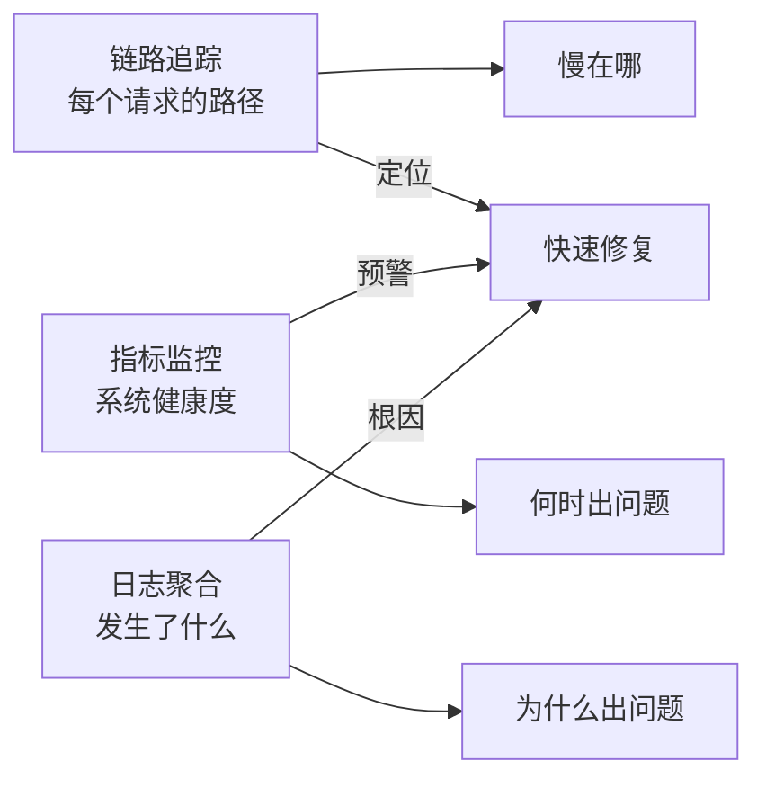
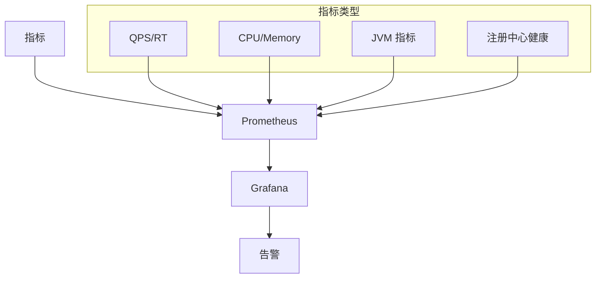
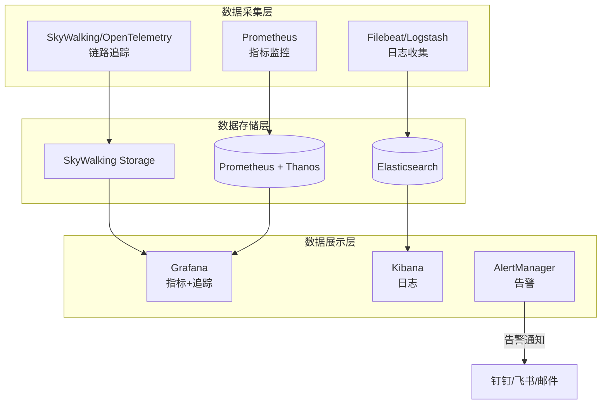

# 可观测性与链路追踪

> **一句话摘要**：没有可观测性的服务发现是黑箱——链路追踪 + 指标监控 + 日志聚合，让分布式系统的调用链路变得可见。
> **本文核心**：**可观测性 = 链路追踪 + 指标 + 日志**；三者结合才能快速定位故障。

前置阅读：[服务发现与 K8s 集成](./8_服务发现与K8s集成-入门.md)。可观测性是服务发现的上游——没有它，发现系统本身也不可见。

## 1. 背景：为什么需要可观测性

> 量级分档意识：本文方法在十万级 QPS、千万级用户、亿级流量的场景下均需重新评估——量级变化时架构与参数需同步调整。


微服务调用链可能跨越数十个实例——一个请求从网关到服务 A 到服务 B 到数据库，每个环节都可能出问题：

```
用户请求 → 网关 → 服务A → 服务B → 服务C → DB
  10ms    5ms   20ms   50ms    30ms   100ms
```

当一个请求超时 200ms，你知道是哪个环节慢的吗？没有可观测性，你只能「猜」。

可观测性让分布式系统的调用链路变得可见：



## 2. 核心机制：三大支柱

### 2.1 链路追踪（Distributed Tracing）

追踪一个请求在分布式系统中的完整路径：

```mermaid
sequenceDiagram
    User[用户] --> GW[网关]
    GW->>S1[服务A] trace_id=abc
    S1->>S2[服务B] trace_id=abc, span_id=2
    S2->>DB[(数据库)] trace_id=abc, span_id=3
    S1->>S3[服务C] trace_id=abc, span_id=4
    GW-->>User 响应
```

**三个核心概念**：

| 概念 | 定义 | 作用 |
|---|---|---|
| Trace | 一个请求的完整路径 | 全局标识 |
| Span | 一个操作单元 | 定位具体环节 |
| Span Context | Span 的元数据 | 跨服务传递 |

**主流方案**：

- **SkyWalking**：国产，Apache 项目，对 Java 友好
- **Jaeger**：CNCF 项目，与 K8s 集成好
- **Zipkin**：早期方案，简单轻量
- **OpenTelemetry**：统一标准，未来方向

### 2.2 指标监控（Metrics）

系统级指标监控：



**关键指标**：

| 类别 | 指标 | 告警阈值 |
|---|---|---|
| 请求 | QPS、TPS、P99 RT | RT > 500ms |
| 系统 | CPU、Memory、Disk | CPU > 80% |
| JVM | GC 次数、堆内存 | Full GC > 3次/分 |
| 服务 | 实例数、健康状态 | 实例数 < 期望值 |
| 注册中心 | 同步延迟、节点数 | 节点数 < 3 |

### 2.3 日志聚合（Logging）

集中收集和分析日志：

```mermaid
flowchart LR
    App[应用日志] --> ELK[(ELK)]
    App →|另一种| Loki[Loki]
    ELK -->|查询| Kibana[Kibana]
    Loki →|查询| Grafana
    
    subgraph ELK
        E[Elasticsearch]
        L[Logstash]
        K[Kibana]
    end
```

**日志规范**：

```json
{
  "timestamp": "2026-09-11T10:00:00Z",
  "level": "ERROR",
  "traceId": "abc-123",
  "spanId": "span-456",
  "service": "inventory-service",
  "message": "数据库连接超时",
  "error": "Connection timeout after 5000ms"
}
```

## 3. 落地实践：可观测性架构

### 3.1 常见架构组合



### 3.2 OpenTelemetry 统一标准

OpenTelemetry 正在成为可观测性的统一标准：

```yaml
# OTel Collector 配置
receivers:
  otlp:
    protocols:
      grpc:
      http:
exporters:
  prometheus:
  jaeger:
  logging:
service:
  pipelines:
    traces:
      receivers: [otlp]
      exporters: [jaeger]
    metrics:
      receivers: [otlp]
      exporters: [prometheus]
```

## 4. 落地实践：配置示例

### 4.1 SkyWalking + Prometheus + ELK

```yaml
# SkyWalking Agent 配置
agent:
  service_name: inventory-service
  sampling: 10000        # 100% 采样
  logging:
    level: INFO

# Prometheus 抓取配置
scrape_configs:
  - job_name: 'inventory-service'
    static_configs:
      - targets: ['inventory-service:9090']
```

### 4.2 告警规则

```yaml
# Prometheus 告警规则
groups:
  - name: service-discovery
    rules:
      - alert: ServiceDiscoveryError
        expr: up{job="nacos"} == 0
        for: 30s
        labels:
          severity: critical
        annotations:
          summary: "注册中心不可用"
      
      - alert: HighLatency
        expr: histogram_quantile(0.99, rate(http_request_duration_seconds_bucket[5m])) > 0.5
        for: 1m
        labels:
          severity: warning
```

## 5. 生产视角：踩坑实录

- **踩坑 1**：链路追踪采样率太高——100% 采样导致性能下降 15%
- **踩坑 2**：日志没有 traceId——无法关联请求链路
- **踩坑 3**：指标维度不够——QPS 有但没有按服务拆分
- **踩坑 4**：告警风暴——阈值太敏感，全天告警

**生产最佳实践**：

1. 链路追踪采样率 = 1%（生产）→ 100%（压测）
2. 所有日志带 traceId
3. 指标按服务+接口拆分
4. 告警分级：critical（立即通知）+ warning（关注）
5. 可观测性组件本身也需要监控

## 6. 典型场景

| 场景 | 工具 | 理由 |
|---|---|---|
| 调用链分析 | SkyWalking/Jaeger | 定位慢服务 |
| 系统监控 | Prometheus + Grafana | 系统健康度 |
| 日志排查 | ELK/Loki | 定位具体错误 |
| 告警通知 | AlertManager | 及时发现 |
| 性能瓶颈 | OTel + Profiler | 火焰图分析 |

## 7. 与相邻概念的区别

- **链路追踪 vs 日志**：追踪是请求级别的路径，日志是系统级别的事件
- **可观测性 vs 监控**：监控是「收集数据」，可观测性是「从数据中得出洞见」
- **链路追踪 vs 服务发现**：追踪记录「调用路径」，发现「服务在哪」

## 8. 常见误区与不适用

- **「100% 采样更好」**：100% 采样性能代价太大
- **「日志越多越好」**：海量日志难以分析，需要结构化
- **「告警越多越安全」**：告警风暴导致疲劳，关键告警被淹没
- **不适用场景**：单体系统（可观测性收益低）

## 9. 你们可能会问

- **链路追踪和日志怎么关联？** 日志中携带 traceId
- **SkyWalking 和 Jaeger 选哪个？** Java 选 SkyWalking，K8s 选 Jaeger
- **可观测性组件本身怎么监控？** 用 Prometheus 监控 Prometheus
- **采样率怎么选？** 生产 1%，压测/故障时 100%

## 10. 一句话总结 + 5W 速记卡 + 自测三问

**一句话总结**：可观测性 = 链路追踪 + 指标 + 日志——让分布式系统从黑箱变透明。

**5W 速记卡**：

| 维度 | 内容 |
|---|---|
| What | 追踪(路径) + 指标(健康) + 日志(事件) |
| Why | 没有它 = 故障时只能猜 |
| When | 服务上线前必须具备 |
| Where | 所有微服务 |
| How | OpenTelemetry + Prometheus + ELK |

**自测三问**：

1. 你的一个请求的完整链路能追踪吗？从网关到数据库？
2. 你的告警规则有分级吗？critical 和 warning 分开了吗？
3. 你的日志带 traceId 吗？能关联到具体请求吗？

---

**下篇预告**：服务发现架构总结——[服务发现架构总结](./10_服务发现架构总结-入门.md)。

**🎯 核心带走**：

- **核心一句话**：可观测性 = 链路追踪 + 指标 + 日志——分布式系统的三大支柱
- **链条复述**：请求 → traceId → 追踪链 → 指标 → 日志 → 告警
- **失效点与边界**：采样率影响数据完整性；告警风暴导致疲劳

💡 **实战提示**：所有日志带 traceId——这是排查分布式问题的第一步。

**开放问题**：OpenTelemetry 能否完全替代 Jaeger 和 SkyWalking？答案是：OTel 是标准，但存储和展示仍需第三方——未来趋势是统一采集，分层存储。

**决策（何时用）**：Java 服务用 SkyWalking；K8s 生态用 Jaeger；统一标准选 OpenTelemetry。


> **演进视角**：可观测性与链路追踪 的实践经历了持续演进。

## 📌 数据与事实声明

- 写于 2026-09-11
- 免责：以官方文档为准

## 📚 参考资料

| 类型 | 标题 | 来源 |
|---|---|---|
| 官方文档 | 官方文档 | 官方站点 |
