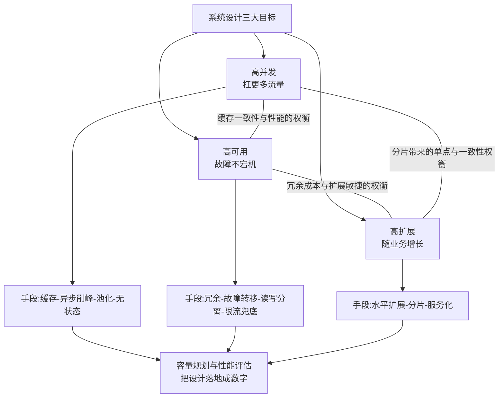
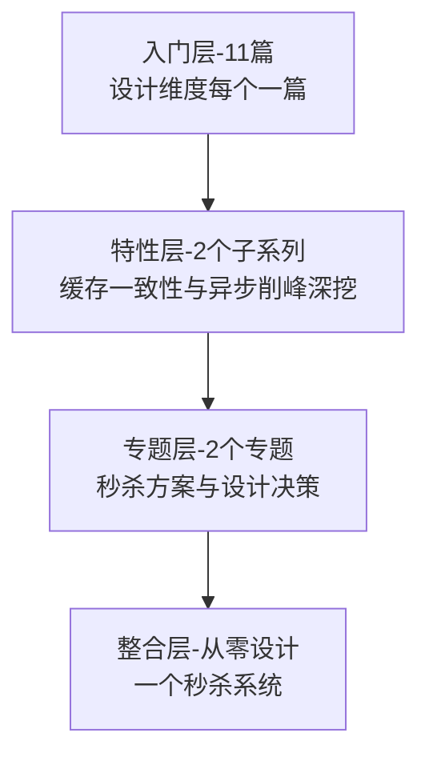

# 分布式系统设计系列导读 · 三大目标的权衡艺术

> 📖 本系列共 11 篇（0_导读 + 10 正文），覆盖分布式系统设计整个知识面：认知全景、高并发、高可用、高扩展、容量规划与设计方法论。
> 本篇是第 0 篇导读：先建立「三大目标相互制衡」的心智模型，再决定读哪条路。

## 一、为什么需要这套系列

系统设计是把「业务需求」翻译成「技术方案」的过程：一个秒杀活动怎么扛、一套账务系统怎么保不丢数据、一条核心链路怎么随业务涨——背后全部是同一批设计维度。但学系统设计常见两种极端：

- **只背方案**：知道「缓存、削峰、分库分表」这些词，但回答不了「这个场景到底该先上哪个」——方案没有接到问题
- **只凭感觉**：「加机器就行」，但不知道容量水位线在哪、瓶颈先出现在哪一层，加机器加在错误的地方

这套系列的设计思路：**先建立「高并发 / 高可用 / 高扩展三大目标相互制衡」的心智模型，再逐个维度铺设计手段**。主线是「三大目标的权衡」，支线是每个目标下的具体手段（缓存/异步/冗余/分片）。先会「看清目标冲突」，再会「选对手段」，最后会「用容量规划把设计落地成数字」。

## 二、全局心智模型：三大目标相互制衡

理解这个模型的三个要点：

1. **三大目标天然冲突**：要高并发就要加缓存（引入一致性挑战）、要高可用就要多副本（引入复制成本）、要高扩展就要分片（引入跨片事务）。设计不是「三个全要」，是「根据业务判断哪个优先、哪个可以让步」。
2. **手段服务目标，不独立存在**：缓存、异步削峰、读写分离、分片都是手段，先问「我在提升哪个目标、牺牲哪个目标」，再选手段——否则就是堆技术名词。
3. **容量规划是设计的收口**：所有设计最终要变成数字——预估 QPS、需要多少机器、水位线定多少。没有容量规划的方案是「感觉能扛」，不是设计。

> tips：(目标先于手段) 面试和评审里最常见的失分点是「上来就讲方案」。正确的表达顺序是：先说目标（这个场景高并发优先还是一致性优先）→ 再说权衡（牺牲了什么）→ 最后才是手段（用什么组件怎么落地）。手段是目标的函数，不是自由发挥。

## 三、系列导航表（11 篇）

| 序号 | 篇目 | 深度 | 一句话定位 | 对标参考 |
|---|---|---|---|---|
| 0 | 系列导读 | 全景 | 三大目标权衡的心智模型 + 阅读路径 | - |
| 1 | 系统设计是什么与三大目标 | 入门 | 高并发/高可用/高扩展的定义与权衡 | 凤凰架构 |
| 2 | 系统架构演进全景 | 入门 | 单体→垂直拆分→分布式→微服务演进线 | 大型网站技术架构 |
| 3 | 高并发设计 | 入门 | 缓存/异步/池化/无状态/水平扩展 | 凤凰架构 |
| 4 | 缓存架构 | 入门 | 多级缓存/缓存一致性/穿透击穿雪崩 | DDIA + Redis 系列 |
| 5 | 异步削峰 | 入门 | MQ 削峰填谷/异步解耦/消息堆积 | RocketMQ/Kafka 系列 |
| 6 | 高可用设计 | 入门 | 冗余/故障转移/幂等/限流熔断兜底 | 凤凰架构 |
| 7 | 读写分离 | 入门 | 主从复制/读写分离/一致性权衡 | MySQL 系列 |
| 8 | 高扩展设计 | 入门 | 水平扩展/无状态/分片/服务化 | 凤凰架构 |
| 9 | 容量规划与性能评估 | 入门 | QPS 估算/压测/容量水位线 | 凤凰架构 |
| 10 | 系统设计方法论总结 | 入门 | 设计步骤/设计模板/从需求到方案 | 综合应用 |

## 四、从点到面：四层进阶路径

| 层级 | 定位 | 规模 | 适合 |
|---|---|---|---|
| 入门层 | 点：每个设计维度一篇，建立完整认知 | 11 篇 | 所有读者必读 |
| 特性层 | 点 × 深：缓存一致性、异步削峰拆到方案级 | 2 个子系列 | 按兴趣挑重点 |
| 专题层 | 面：秒杀场景集大成 + 三目标取舍决策 | 2 个专题 | 解决实际设计 |
| 整合层 | 体系：从零设计一个秒杀系统 | 1 个 demo | 动手派 |

## 五、入门读者最容易踩的 3 个认知误区

### 误区 1：以为三大目标是「都要拉满」

「高并发高可用高扩展都要」等于没设计。三大目标天然互斥：缓存提升并发但伤害一致性，多副本提升可用但增加成本和复制延迟，分片提升扩展但制造跨片事务。真实的系统设计是**给目标排优先级**——支付链路可用性优先（宁可限流不可算错钱），营销活动并发优先（可容忍少量缓存不一致），判断依据是业务代价。

### 误区 2：以为架构演进是「越新越好」

微服务不是终极答案，单体也不是落后象征。架构演进每一步都在「解决上一阶段的问题 + 引入新问题」：单体部署简单但长成一坨，微服务扩展灵活但运维复杂度指数上升。**正确的判断依据是业务阶段和团队规模**：业务早期单体 + 模块化往往是最优解，「为百万并发做设计」而当前只有一万并发，是在为想象中的问题付真实的复杂度代价。

### 误区 3：以为设计 = 画架构图

「画了一张漂亮的架构图」不等于「完成了设计」。没有数字支撑的架构图是装饰画：QPS 估多少、缓存命中率多少、数据库连接池多大、水位线红线定在哪——容量规划才是把「方案」变成「工程」的一步。本系列第 9 篇专门讲怎么把设计落地成可验证的数字。

> tips：(权衡三问) 看任何系统设计方案，先问三个问题：这个方案在提升哪个目标？它牺牲了哪个目标的什么？它的容量依据是什么数字？三问答不出来，方案就还在「堆名词」阶段。

## 六、怎么读这套系列

- **零基础/刚入行**：从 0 按顺序读到 10，每天 2 篇，一周建立完整设计认知
- **有业务系统经验**：重点读 3-5（高并发三篇）、9（容量规划）——这三个直接对应「扛大促」「做容量评审」两类日常场景
- **要出完整方案**：读完入门层进专题层（秒杀高并发方案 / 系统设计决策），最后进整合层「从零设计一个秒杀系统」把全部维度串起来

---

下一篇将讲 **1_系统设计是什么与三大目标**：高并发、高可用、高扩展各自的定义、度量方式与冲突点——待正文落盘后补链接。
