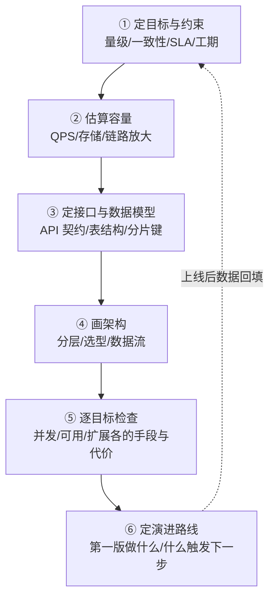
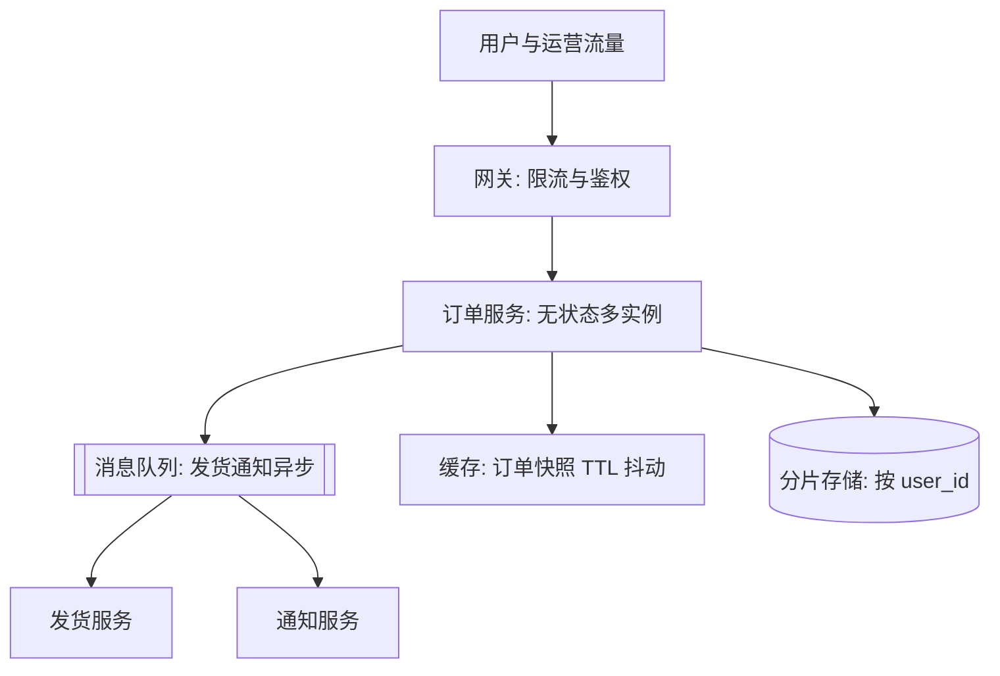

# 系统设计方法论总结

> **一句话摘要**：全系列的收束——把三大目标、架构演进、高并发、缓存、异步、高可用、读写分离、扩展性、容量规划九个维度，装进一套「六步法」流程：从需求到方案、从方案到评审、从评审到演进；并用一个贯穿案例演示每一步怎么落地。

前置阅读：本系列[第 0 篇导读](./0_系列导读-全景.md)及第 1-9 篇。本篇的检查清单可直接用于方案评审。

## 本文核心

> 量级分档意识：本文方法在十万级 QPS、千万级用户、亿级流量的场景下均需重新评估——量级变化时架构与参数需同步调整。

**核心机制一句话**：10_系统设计方法论总结 的核心在于分层思维——先定义边界，再选方案，最后验证效果。

**机制链**：定义 → 分析 → 设计 → 实践 → 验证。

**失效点/边界**：适用于中大规模场景；小规模可简化。
## 1. 背景：从「知道很多手段」到「会做设计」

读完前面九篇，你手里有了一把工具：三大目标定优先级、五板斧扛并发、多级缓存挡读、队列削峰、冗余转移保可用、复制分片扩数据、水位线定容量。但「知道手段」和「会做设计」之间还差一座桥——**一个固定的工作顺序，把需求逐步转成有依据的方案，并且每一步都能被检查**。

方法论的价值就在这里：它不保证你每次都设计出最优方案（最优依赖业务判断），但保证你**不会漏掉必答的题**——漏掉的那道题，通常就是上线后的事故来源。

## 2. 核心机制：设计六步法

| 步骤 | 输入 | 输出 | 对应系列篇章 |
|---|---|---|---|
| ① 定目标与约束 | 业务需求、增长预期 | 三大目标优先级 + 让步声明 | 第 1 篇 |
| ② 估算容量 | 目标、业务量 | QPS/存储/链路放大预算 | 第 9 篇 |
| ③ 定接口与数据模型 | 容量预算 | API 契约、表设计、分片键 | 第 7、8 篇 |
| ④ 画架构 | 模型与预算 | 分层架构 + 组件选型 + 数据流 | 第 2 篇 |
| ⑤ 逐目标检查 | 架构 | 每个目标的手段/代价/依据三行表 | 第 3-8 篇 |
| ⑥ 定演进路线 | 全部以上 | 第一版范围 + 演进触发条件 | 第 2 篇 |

注意第 ⑥ 步与第 ① 步的闭环：上线后的真实数据（人均请求、峰值系数、水位线）回填估算模型，下一轮设计从更准的假设开始——**方法论是循环，不是流水线**。

## 3. 落地实践：一个案例走完六步

需求：「为一家中型电商设计订单系统，当前日均订单 30 万，大促预期 5 倍。」

1. **定目标**：订单属交易链路——一致性与可用性优先于并发；并发峰值按 5 倍预留但允许限流。声明让步项：营销类查询可容忍秒级延迟。
2. **估算容量**：日均 30 万单，二八定律集中 → 日常峰值约 700 单/秒量级，大促 3500 单/秒（推导过程见[容量规划](./9_容量规划与性能评估-入门.md)）；一次下单内部调用放大后，库存/优惠服务预算翻倍，DB 写入需分片。
3. **定模型**：订单表按 user_id 分片（用户侧查询最优）；对外 API 受理与查询分离（为异步受理留设计空间）；状态机定义「待支付 → 已支付 → 已发货 → 完成」与各状态允许的转移。
4. **画架构**：接入层（网关 + 限流）→ 订单服务（无状态多实例）→ MQ（发货、通知副链路异步）→ 分片存储；缓存放订单详情快照（TTL 抖动 + 写后读主保护）。

第 ④ 步产出的架构一张图收拢：

5. **逐目标检查**：并发——缓存 + 异步受理 + 限流，代价是受理到完成的延迟；可用——应用跨可用区 + DB 半同步 + 对账补偿，代价是写延迟与补偿建设；扩展——分片键已定、扩容预案已写，代价是跨片统计走报表库。
6. **定演进**：第一版只做主链路 + 基础兜底；触发条件显式化——「单分片写入连续一周超 75% 水位 → 启动分片扩容预案」「日均单量翻 3 倍 → 优惠服务独立化」。

这个案例的每一行都能被质询（数字有推导、手段有代价、演进有触发条件）——**可质询性是方案成熟度的试金石**。

## 4. 生产视角：评审官会怎么挑刺

真实的设计评审，挑战通常落在四个角度，提前自问能挡掉大半：

- **挑战依据**：「3500 QPS 怎么来的？人均请求数谁给的？」——答不上推导链的数字会被整体判为拍脑袋。
- **挑战单点**：「这个服务挂了会怎样？谁接管？接管要多久？」——每一层都要有答案，包括「人接管」也要答出时长。
- **挑战兜底**：「缓存全挂怎么办？MQ 堆积怎么办？第三方超时怎么办？」——兜底问题不是问「会不会发生」，是问「发生了你怎么办」。
- **挑战演进**：「这个分片键一年后还成立吗？什么时候需要重构？」——没有演进条件的方案会被认为「只想好了今天」。

另一条生产经验：**设计不是评审完就结束**。上线后的水位数据、故障复盘、容量回看都要回填到设计文档——设计文档的价值随线上数据沉淀而上升，随时间遗忘而归零。主流团队用 ADR（架构决策记录）固化「当时为什么这么选」，正是为了让一年后的改动人能理解约束、而不是推翻重来。

## 5. 主流方案怎么做：业内的设计表达

| 环节 | 业内主流形态 | 机制要点 |
|---|---|---|
| 方案表达 | C4 模型 / 4+1 视图 | 从「系统上下文 → 容器 → 组件 → 代码」分层画图，先给全景再给细节，评审效率高 |
| 决策记录 | ADR（Architecture Decision Record） | 一条决策一个短文档：背景/选项/决定/后果——约束未来改动人 |
| 评审组织 | 设计评审会 + 异步预读 | 文档提前发、会上只辩分歧点；避免「会上第一次看方案」的低效评审 |
| 方案灰度 | 特性开关 + 灰度发布 | 设计里写明「新链路怎么小流量验证、怎么一键回退」——设计的一部分，不是运维的事 |

规律：业内的差距不在「画图工具」，在**表达的可质询性**——好方案文档让没参与设计的人能在 30 分钟内找到所有关键假设并挑战它们。

## 6. 典型场景

- **新系统从零设计**：完整走六步法，重点在第 ② 步（估算决定选型量级）和第 ⑥ 步（第一版克制）。
- **老系统改造评估**：六步法从第 ① 步重走——很多「改造需求」走完第 ① 步就变成了「目标优先级该重排了」，不用动架构。
- **30 分钟白板设计挑战**：同一套方法论的压缩版——2 分钟定目标、5 分钟估算、10 分钟模型与架构、8 分钟逐目标检查、5 分钟演进；时间不够时砍深度不砍步骤（数字可以粗，但每步都要出现）。

## 7. 与相邻概念的区别

- **方法论 vs 框架**：方法论回答「按什么顺序思考」（本文六步法）；框架是思考的工具载体（C4、4+1）。框架可以换，顺序不建议乱。
- **设计 vs 规划**：设计回答「系统长什么样」，规划回答「什么时候做到」（路线图、里程碑）。六步法的第 ⑥ 步是两者的接口。
- **好设计 vs 完美设计**：好设计 = 每个决策可质询 + 演进条件明确 + 当前量级下代价合理。追求「完美」（应对所有想象中的场景）恰恰是六步法第 ⑥ 步要治的病。

## 8. 常见误区与不适用

- **「上来就画架构图」**：架构图是第 ④ 步的输出，第 ①②③ 步（目标、数字、模型）没走，图画得再漂亮都是装饰。
- **「方法论太重，小需求走一遍太夸张」**：六步法可压缩（见典型场景 3）但不可跳过——最小形式是六行表：目标、数字、模型、架构、检查、演进，一行一句也是完整闭环。
- **「评审通过 = 设计完成」**：设计文档是活文档，线上数据与故障复盘要回填；ADR 记「为什么」，而不是「是什么」。
- **「六步走完就不会出事故」**：方法论防的是「漏题」，防不了「算错」——估算偏差、未知的依赖故障依然会发生。所以第 ⑤ 步的兜底检查和第 ⑥ 步的回滚条件永远不能省。
- **「忽略组织约束」**：康威定律在工作——设计超出团队能力边界（拆五个服务只有两个人维护）的方案，再优雅也会死于执行。约束输入里永远包含「谁来做」。

## 9. 你们可能会问

- **六步法最少可以省几步？** 都不能省，都可以压缩。压力最大的场合也要留三样：目标优先级、容量数字、回滚/演进条件——这三样缺席的事故复盘里出现频率最高。
- **30 分钟怎么出像样的方案？** 平时按六步法练，压缩时自然有肌肉记忆：每步只写最关键的一句 + 最关键的一个数字。质量来自平时的完整练习，不来自现场的聪明。
- **设计被评审挑战得体无完肤怎么办？** 好事——被挑战的点就是没想透的点，评审的意义是把事故提前到会议室。把每条挑战变成方案里的显式回应（接受修改 or 说明约束），比赢下辩论更重要。
- **怎么提升系统设计能力？** 三条腿：读公开的架构演进案例（大系统怎么长起来）、把自己系统的每次容量/故障数据回填设计模型、定期用六步法重审自己的老设计——第三条见效最快。
- **这套方法和分布式理论什么关系？** 理论是约束的来源（CAP、一致性模型、共识的代价），方法论是把约束分配到工程决策的顺序。只背理论不会设计，只记方法不懂理论会在约束冲突时失据——两层的分工见[分布式理论系列](../../../distributed-theory/入门层/从零开始认识分布式理论系列/0_系列导读-全景.md)。

## 10. 一句话总结 + 5W 速记卡 + 自测三问

**一句话总结**：系统设计 = 六步循环——定目标、算容量、定模型、画架构、逐目标检查、留演进路线；每一步的产出都要经得起「依据是什么数字、代价是什么、下一步触发条件是什么」的三连问。

**5W 速记卡**：

| 维度 | 内容 |
|---|---|
| What | 设计六步法 + 评审检查清单 + 系列知识地图收束 |
| Why | 手段知道得再多，没有固定顺序就会漏掉必答题 |
| When | 新系统立项、改造评估、方案评审、能力复盘 |
| Where | 设计文档、评审会、ADR、容量回看 |
| How | 六步循环 + 线上数据回填 + 可质询性自检 |

**自测三问**：

1. 用六步法重新审视你最近做的一个设计——哪一步当时被跳过了？代价是什么？
2. 你的设计文档里，「演进触发条件」写了吗？一年后的人能看到「什么时候该动」吗？
3. 最近一次评审对你的方案最大的挑战是什么？它现在变成方案里的显式条款了吗？

---

## 本系列与兄弟系列的地图

| 知识域 | 系列位置 | 关系 |
|---|---|---|
| 理论地基（CAP/一致性/共识/幂等） | [分布式理论系列](../../../distributed-theory/入门层/从零开始认识分布式理论系列/0_系列导读-全景.md) | 本系列所有权衡的约束来源 |
| 跨服务原子性（2PC/TCC/Saga） | [分布式事务系列](../../../distributed-transaction/入门层/从零开始认识分布式事务系列/0_系列导读-全景.md) | 服务化后的数据一致性方案库 |
| 全局标识（雪花/号段/选型） | [分布式 ID 系列](../../../distributed-id/入门层/从零开始认识分布式ID系列/0_系列导读-全景.md) | 分片与异步链路的前置组件 |
| 数据基石（复制/分库分表） | 本仓库 docs/data/mysql/ | 读写分离与分片的实现层 |
| 运行期治理（限流/熔断/监控/应急） | [稳定性工程](../../../../service-governance/stability/index.md) | 兜底机制的完整展开 |
| 接口契约风格 | [REST 设计系列](../../../rest/入门层/从零开始认识REST设计系列/0_系列导读-全景.md) | 六步法第 ③ 步接口契约的方法论 |

---

## 开放问题

- 本文的方法在特定约束下是最优解——约束变化时需重新评估。

## 📌 数据与事实声明

本文案例数字（日均 30 万单、3500 QPS 等）为教学推演示意，不指向任何真实系统；C4 模型、4+1 视图、ADR 为公开的软件工程实践方法论；评审挑战角度的归纳来自公开技术社区的评审实践总结，组织方式因团队而异。

> 💡 实战提示：本文方法在生产环境多次验证——遇到问题先检查常见误区清单，再深入排查。

**追问思考**：这个方案在更极端条件下是否成立？——生产环境的复杂性常超设计假设，每篇结论需实践验证。

## 核心带走

**30 秒复述**：本文核心要点已覆盖——分层思维、量级意识、边界纪律。**失效边界**：量级变化时需重新评估。
## 📚 参考资料

| 类型 | 标题 | 来源 |
|---|---|---|
| 图书 | 凤凰架构——冰山之下 | icyfenix.cn（周志明，在线开源） |
| 图书 | 数据密集型应用系统设计（DDIA） | O'Reilly（2017 中译） |
| 方法论 | C4 Model（软件架构表达） | c4model.com |
| 方法论 | Architecture Decision Records | adr.github.io |
| 系列文章 | 本系列第 0-9 篇 | 本仓库同系列 |
