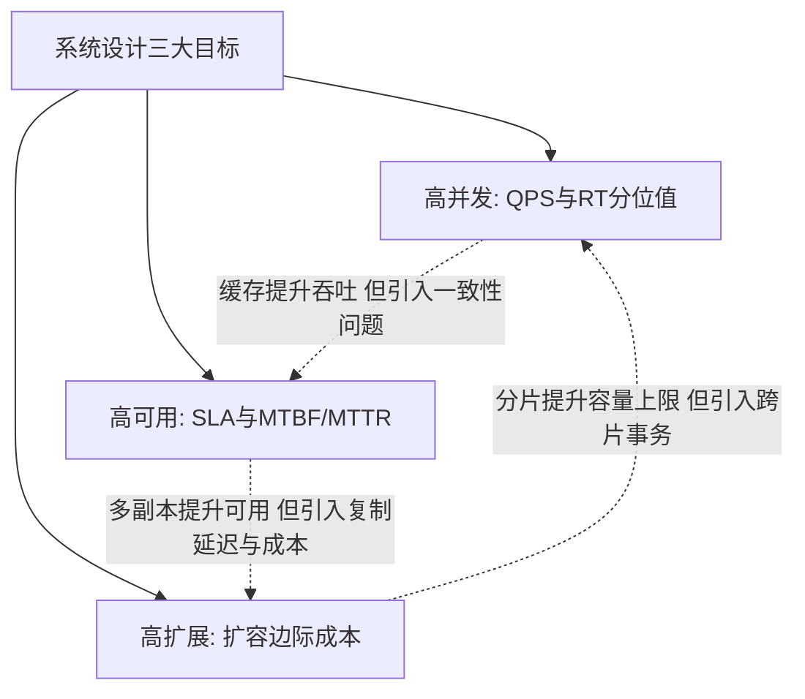
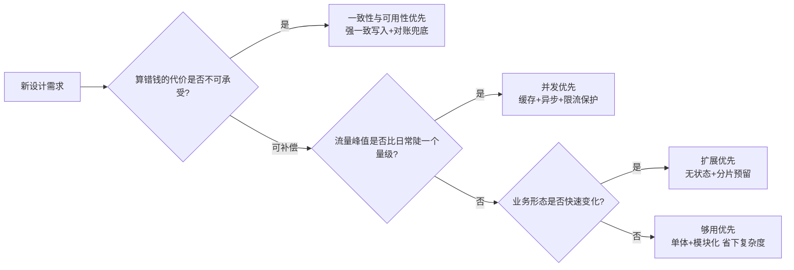

# 系统设计是什么与三大目标

> **一句话摘要**：系统设计是把「业务需求」翻译成「技术方案」的工程过程，高并发、高可用、高扩展是贯穿始终的三大目标；三者天然互斥，设计的起点不是选组件，而是给目标排优先级、明确让步项——这是全系列的心智地基。

前置阅读：[系列导读](./0_系列导读-全景.md)。互斥的理论根源（CAP 定理、一致性模型）在[分布式理论系列](../../../distributed-theory/入门层/从零开始认识分布式理论系列/2_CAP定理-入门.md)展开，本篇只讲它的工程投影。

## 本文核心

> 量级分档意识：本文方法在十万级 QPS、千万级用户、亿级流量的场景下均需重新评估——量级变化时架构与参数需同步调整。

**核心机制一句话**：1_系统设计是什么与三大目标 的核心在于分层思维——先定义边界，再选方案，最后验证效果。

**机制链**：定义 → 分析 → 设计 → 实践 → 验证。

**失效点/边界**：适用于中大规模场景；小规模可简化。
## 1. 背景：为什么需要系统设计

一个需求从产品侧出来时往往只有一句话：「做一个秒杀活动」「账务要对得上」「系统明年要支撑十倍增长」。系统设计就是把这「一句话」变成「一套可落地的方案」：流量多大、数据放哪、每一层用什么机制、坏了怎么办、涨了怎么扩。

不做设计直接开工的系统，通常以两种方式还债。**拍脑袋上线**：按「感觉能扛」的容量去接流量，大促当天数据库连接打满，全链路超时。**堆组件式开发**：听什么火就上什么，缓存、消息队列、微服务全堆上，结果每个组件都在引入新的失效模式，复杂度失控。系统设计的价值，就是把这两类债务提前到「写代码之前」暴露出来。

## 2. 核心机制：三大目标的定义、度量与互斥原理

### 2.1 三大目标各自怎么度量

| 目标 | 定义 | 度量方式 |
|---|---|---|
| 高并发 | 单位时间处理更多请求 | QPS / TPS、响应时间（尤其 P99 分位值） |
| 高可用 | 故障时不中断服务 | SLA（99.9% ≈ 年停机 8.76 小时；99.99% ≈ 52.6 分钟）、MTBF / MTTR |
| 高扩展 | 增长时能平滑扩容 | 扩容边际成本、扩容耗时、加机器后的能力提升比 |

度量是设计的锚：说「系统要快」没有意义，说「P99 < 200ms」才能评审、才能压测验证、才能上线后监控对账。

### 2.2 为什么三大目标天然互斥

三个目标不是「都要拉满」的并列项，而是互相牵制的三角：

每一对牵制背后是同一个底层原理：**你为某个目标引入的机制，会改变系统处理数据的方式，从而伤害另一个目标的约束**。缓存把数据从一份变成「DB 一份 + 缓存一份」，两份数据就有了不一致的时间窗口；冗余把数据复制成多份，复制就需要时间；分片把一张表切成 N 份，跨片查询和事务就要跨网络协调。这些不是实现瑕疵，是机制层面的必然——CAP 定理在工程里的样子。

### 2.3 设计 = 给目标排优先级

互斥推不出「躺平」，推出的是方法论：**先定哪个目标优先、哪个目标可以让步、让步的代价由谁承担**。支付链路宁可限流也不能算错钱——一致性优先级最高；营销活动页可以容忍缓存短暂不一致——并发优先级最高。优先级不同，同一套需求会导出完全不同的架构。

## 3. 落地实践：优先级怎么排、方案怎么表达

排优先级的标尺是**业务代价**，不是技术偏好：

评审和文档里表达方案的顺序也值得固定：**先说目标**（这个场景谁优先）→ **再说权衡**（牺牲了什么、代价是什么）→ **最后才是手段**（用什么组件、什么机制落地）。手段是目标的函数——直接从手段讲起，听者无法判断方案是否贴合业务，评审就退化成组件偏好之争。

## 4. 生产视角：目标错配长什么样

目标错配是线上事故里最「冤」的一类——每个组件都工作正常，但整体方向反了。两种典型形态：

- **把并发场景按账务标准做**：营销活动的每一次点击都走强一致扣减 + 事务锁，平时没事，大促流量一来数据库锁等待飙升、全链路超时。事后复盘发现：活动库存本允许少量误差、结束后有对账修正，根本不需要每一笔都强一致。
- **把账务场景按并发标准做**：资金链路为追求吞吐把关键校验放进异步链路，某次消息堆积期间出现重复扣款。资金的行业惯例是「宁可慢、不可错」，一致性让步的代价在这里是资损和监管问询。

两类事故的共同点：**目标优先级在方案里没有被显式声明**，团队各自按自己熟悉的默认值行事。生产系统的水位线、限流阈值、一致性级别，都应该能回答「这是在保哪个目标、牺牲哪个目标」。

## 5. 主流方案怎么做：不同系统的取舍图谱

看几类主流系统怎么定调（讲机制定位，组件细节归各自系列）：

| 系统形态 | 目标优先级 | 典型机制选择 |
|---|---|---|
| 交易/支付 | 一致性 > 可用性 > 并发 | 强一致写入、对账兜底、限流保护，宁可降级不可错账 |
| 内容/社交 Feed | 并发 > 可用性 > 一致性 | 多级缓存、最终一致、扇出异步化，短暂刷不到新内容可接受 |
| 配置/元数据中心 | 一致性 > 并发 | CP 语义（多数派共识），牺牲部分分区下的可用性 |
| 注册中心 | 可用性 > 一致性 | AP 语义，短暂持有过期节点列表可接受 |

同一个「分布式存储」，做注册中心时选 AP、做协调服务时选 CP——主流方案的分野不在技术水平，在**目标定位**。读主流开源项目的架构文档时，值得专门找一句「我们为什么放弃 X 换 Y」，那通常就是它目标定位变化的演进痕迹。

## 6. 典型场景

- **秒杀活动**（流量级）：瞬时流量比日常陡 10 倍以上，并发优先——缓存预热 + 异步受理 + 限流兜底，库存允许事后对账修正。
- **账务/清结算**（交易级）：金额不能错，一致性与可用性优先——强一致写入、异步对账补偿、降级时暂停服务而不是绕过校验。
- **内部管理后台**（成本级）：并发几百、工作时段可用即可，够用优先——单体 + 单库，省下的复杂度投给业务迭代速度。

## 7. 与相邻概念的区别

| 概念 | 与「系统设计」的关系 |
|---|---|
| 架构设计 | 架构设计偏「结构与边界」（服务怎么切、依赖怎么走）；系统设计范围更大，含容量估算、数据模型、演进路线等工程全过程 |
| 性能优化 | 性能优化在既有系统里逼近目标（事后、局部）；系统设计先定目标再选机制（事前、全局） |
| 功能需求 | 功能需求定义「做什么」；三大目标是「做到什么程度」——非功能属性，不达标时功能再全也不可用 |

## 8. 常见误区与不适用

- **「三个目标都要拉满」**：等于没有设计。冗余、多副本、跨机房每一项都真金白银，无限拉满是在为用不到的可靠性付费（行业认知：可用性每提升一个 9，成本上升远超线性）。
- **「先做出来再说，目标以后补」**：一致性级别、分片键、无状态化这些决策有强惯性，事后改的代价往往是局部重写。演进可以，但目标底线要一开始声明。
- **「SLA 拍个好看的数字」**：99.99% 意味着全年只能停 52 分钟，包括发布、故障、维护。定 SLA 前先问：恢复自动化程度、变更频率、预算，支撑得起这个数字吗？
- **「用组件堆砌代替目标定义」**：上了缓存、MQ、微服务不等于有设计。每个组件解决哪个目标的问题、牺牲了什么，说不清楚就是负债。

## 9. 你们可能会问

- **为什么不三个全要？钱能解决的都不是问题？** 钱能买机器，买不来一致性时间窗口——CAP 约束是原理级的；且复杂度会转嫁为团队认知负担，团队规模反成新瓶颈。
- **小流量系统要不要做这套设计？** 要做「目标声明」这个动作（一行字），不需要照搬全部手段。够用优先本身就是一种经过权衡的排序。
- **怎么向业务方解释取舍？** 翻译成业务代价：「选 A，大促峰值可能限流一成用户；选 B，账目延迟五分钟对账」。让代价的承担者参与决策。
- **目标之间有中庸解吗？** 有——按请求分级：核心交易走强一致 + 高可用，边缘查询走缓存 + 尽力而为。主流电商平台都是这么分层的。
- **优先级会变吗？** 会。业务 0 到 1 阶段并发优先，进入收费阶段一致性优先级立刻上升。设计文档里应写明「当前排序 + 触发重评的条件」。

## 10. 一句话总结 + 5W 速记卡 + 自测三问

**一句话总结**：系统设计始于给三大目标排优先级——度量定锚，互斥定调，业务代价定序，手段只是目标的函数。

**5W 速记卡**：

| 维度 | 内容 |
|---|---|
| What | 高并发 / 高可用 / 高扩展的定义、度量与互斥关系 |
| Why | 不定优先级的方案无法评审、无法验证、无法取舍 |
| When | 新系统立项、老系统改造、大促备战评审 |
| Where | 设计文档的目标声明节、架构评审的第一页 |
| How | 业务代价定优先级 → 声明让步项 → 手段对号入座 |

**自测三问**：

1. 你负责的系统，三大目标的当前优先级是什么？让步的是哪个目标？
2. 99.95% 的 SLA 对应每年多少分钟停机预算？现有恢复手段撑得住吗？
3. 上一次引入缓存 / MQ / 分片，分别是为了提升哪个目标、牺牲了哪个目标的什么？

---

**下篇预告**：三大目标不是一天建成的——下一篇[系统架构演进全景](./2_系统架构演进全景-入门.md)讲系统从单体到微服务的演进线：每一步解决什么、又引入什么。

---

## 📌 数据与事实声明

本文的 SLA 停机换算（99.9% ≈ 8.76 小时/年）为数学推算；成本随可用性提升非线性增长为业内通用认知，具体数字因业务与基建差异巨大，请以自身成本核算为准。所引对标系统（支付、Feed、注册中心等）的取舍描述为公开技术资料的机制级概括，不指向任何特定公司。

## 核心带走

**30 秒复述**：本文核心要点已覆盖——分层思维、量级意识、边界纪律。**失效边界**：量级变化时需重新评估。
## 📚 参考资料

| 类型 | 标题 | 来源 |
|---|---|---|
| 图书 | 凤凰架构——冰山之下 | icyfenix.cn（周志明，在线开源） |
| 图书 | 数据密集型应用系统设计（DDIA） | O'Reilly（2017 中译） |
| 图书 | 大型网站技术架构：核心原理与案例分析 | 电子工业出版社（2013） |
| 系列文章 | 分布式理论系列（CAP / 一致性模型） | 本仓库 docs/architecture/system-design/distributed-theory/ |
