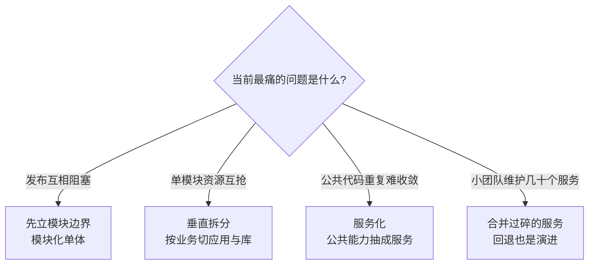

# 系统架构演进全景

> **一句话摘要**：系统架构沿「单体 → 垂直拆分 → 分布式/服务化 → 微服务」演进，每一步都在解决上一阶段的问题、同时引入新问题；演进的依据是业务量与团队规模，不是技术新潮度——会判断「自己在哪、下一步的触发条件是什么」，比背演进史更重要。

前置阅读：[系统设计是什么与三大目标](./1_系统设计是什么与三大目标-入门.md)。服务化的通信与治理机制在本仓库服务治理子域展开。

## 本文核心

**核心机制一句话**：2_系统架构演进全景 的核心在于分层思维——先定义边界，再选方案，最后验证效果。

**机制链**：定义 → 分析 → 设计 → 实践 → 验证。

**失效点/边界**：适用于中大规模场景；小规模可简化。
## 1. 背景：为什么架构会演进

没有团队一开始就想做微服务。架构演进的原动力只有两个：**业务规模变了**（流量、数据量涨，原方案扛不住）和**组织规模变了**（几十人改同一坨代码，协作成本爆炸）。康威定律说的正是这件事：系统结构最终会镜像组织的沟通结构——团队怎么分工，系统就怎么拆。

反过来说，业务没到、团队没到就提前演进，等于**为想象中的问题付真实的复杂度代价**：分布式事务、链路排障、运维成本全是真实要还的债，而它们对应的「高并发」「大团队」还停留在 PPT 里。

## 2. 核心机制：演进线四阶段

| 阶段 | 解决了什么 | 引入了什么 |
|---|---|---|
| 单体 | 一切从简：一个应用一个库，事务容易、部署简单、排障直观 | 规模大后长成一坨：发布互相阻塞、模块边界靠自觉、任何一处慢全站受累 |
| 垂直拆分 | 按业务切成多个应用 + 各自的库，应用间不再互相拖累 | 跨应用的重复代码、数据孤岛、跨系统查询要靠接口拼 |
| 分布式/服务化 | 公共能力抽成服务（用户/订单/支付），RPC 调用 + 中间件（缓存、MQ、分库分表）补位 | 分布式问题全套登场：网络不可靠、跨服务事务、服务发现、链路排障 |
| 微服务 | 拆到小团队可独立拥有，独立开发、部署、扩容，DevOps 流水线支撑快速迭代 | 运维复杂度指数上升：服务治理、可观测性、发布编排都要成体系 |

演进线的关键不是「越往右越先进」，而是**每一步都有明确的前置代价清单**。跨过一步之前，先确认自己愿意支付右边那一列。

## 3. 落地实践：什么时候动、第一刀怎么切

演进不需要等痛到崩溃，这几个信号出现就该评估动了：

- **发布信号**：任何改动都要全量回归、发布窗口排队、一次小改动牵连全站回归——模块边界已经失效。
- **资源信号**：某个业务模块吃光应用服务器 CPU，其他模块跟着陪绑，无法单独扩容。
- **数据信号**：单表行数或单库写入逼近上限，查询明显变慢（具体阈值见[容量规划与性能评估](./9_容量规划与性能评估-入门.md)）。
- **组织信号**：多个团队改同一个代码库，合并冲突和联调等待成为日常。

第一刀的切法：**按业务能力切，不按技术层切**。「订单服务、商品服务、用户服务」是对的起点；「所有 Service 层一个服务、所有 DAO 层一个服务」是常见反例——技术层切分只把一坨代码变成两坨远程调用的代码，业务边界反而更模糊。切之前没有把握时，可以先做**模块化单体**：物理上还是一个应用，逻辑上用模块边界（独立包、独立表前缀、接口隔离）把边界立起来，等触发信号到了再物理拆分，迁移成本远低于从一坨代码里直接拆。

把信号映射到动作，可以用一张决策图收拢：

## 4. 生产视角：演进的代价长什么样

- **过早微服务化的形态**：几个人的团队把系统拆成几十个服务，结果是——一个请求跨十几次 RPC，排障要翻七八个服务的日志；跨服务数据一致性要靠补偿和对账；部署、监控、链路追踪的基础设施建设速度追不上业务。最后团队开始往回合并。这不是虚构，把微服务当起点是近年公开技术社区反思最多的架构话题之一。
- **单体巨石的形态**：一次营销活动的代码缺陷让核心交易跟着不可用，因为它们跑在同一个进程里共享同一份资源；发布只能整包上，回滚 = 全量回滚。
- **架构回退也是演进**：把拆得 过碎的服务合并回来（业内也叫「重新单体化」）不丢人——演进的方向由业务阶段决定，向前向后都可能是对的。公开报道里多家公司都走过「拆了再合」的循环，判断依据始终是团队与业务的现实。

## 5. 主流方案怎么做：演进坐标系上的生态

把主流技术生态放到演进线上看，会发现它们各自服务不同阶段：

| 阶段 | 代表生态/机制 | 定位 |
|---|---|---|
| 单体/模块化单体 | Spring Boot 单应用 + 模块边界约束（Spring Modulith 一类思想） | 靠代码规约和测试守住边界，不引入分布式复杂度 |
| 服务化 | RPC 框架（Dubbo / gRPC 机制）+ 注册中心 + 集中配置 | 解决「服务怎么互相找到对方、怎么治理」 |
| 微服务 | Kubernetes + Service Mesh（ Istio 一类） | 把服务治理下沉到基础设施层，应用侧减负 |
| 弹性延伸 | Serverless（函数计算） | 把「部署单元」进一步缩小到函数，按调用计费，冷启动与状态限制是新代价 |

注意规律：越往右，**业务代码里消失的机制越多**（服务发现、重试、熔断逐渐下沉到框架和基础设施），而**基础设施的复杂度越高**。选哪个生态不是选信仰，是选你的团队愿意在哪里养能力。

## 6. 典型场景

- **0 到 1 创业项目**：单体 + 单库，功能验证速度是唯一目标，别让基础设施吃掉迭代时间。
- **垂直拆分期**（业务成型、多条产品线）：按产品线拆应用 + 拆库，公共功能（登录、支付）开始沉淀。
- **平台型业务**（多团队、流量大）：服务化 + 微服务，配齐注册发现、配置中心、可观测体系（对应本仓库服务治理子域）。

## 7. 与相邻概念的区别

- **微服务 vs SOA**：SOA 强调「企业服务总线」集中管控，服务粒度粗、ESB 是中心化瓶颈；微服务去中心化（智能端点、哑管道），粒度细、每个服务独立生命周期。演进线上 SOA 更靠近服务化阶段。
- **垂直拆分 vs 水平拆分**：垂直拆分按业务维度把系统切开（不同业务不同应用）；水平拆分是同一业务加机器分流量（见[高扩展设计](./8_高扩展设计-入门.md)）。演进线上的「拆」先垂直后水平。
- **演进 vs 重构**：重构不改系统边界，演进改边界。发布互相阻塞说明需要的是演进（切边界），单纯代码坏味道只需要重构。

## 8. 常见误区与不适用

- **「越新越好」**：微服务不是终点，单体不是落后象征。每阶段都是「解决上一阶段问题 + 引入新问题」的权衡。
- **「一步到位设计终极架构」**：为百万并发做设计而当前只有一万并发，是在为想象付费。正确的姿势是「当前阶段 + 下一步的触发条件」。
- **「拆得越细越好管」**：服务数超过团队维护能力后，治理成本反噬——发布编排、依赖拓扑、排障链路都会超载。拆分粒度以「一个小团队能完整拥有」为标尺。
- **「单体不需要边界」**：单体死于「无边界的一坨」，不是死于单体形态。模块化单体的边界纪律（包隔离、依赖方向、接口化）是将来能顺利拆分的前提。

## 9. 你们可能会问

- **怎么判断现在是拆分的时机？** 看第四节四个信号有没有出现两个以上；只出现一个（比如单表变大）通常用局部手段解决（索引、归档），不必动架构。
- **拆粗了还是拆细了好？** 宁粗勿细。合并两个粗服务比拆开一个细服务的代价低得多——接口收敛容易，分布式状态拆散难。
- **单体怎么预防长成一坨？** 模块化纪律：包按业务能力组织、模块间只走接口、数据库表按模块划前缀、CI 上加依赖方向检查。
- **中台在这条线的哪里？** 中台是服务化的一种组织形态——把多个业务线的公共能力（订单、支付、用户）收拢成共享服务层。它解决的是「多业务线重复建设」，不是所有公司都有这个问题。
- **架构回退怎么说服管理层？** 用数字：合并后节省的运维人力、排障时长下降、发布频率提升。回退的本质是把维护几十个服务的成本换成业务迭代速度。

## 10. 一句话总结 + 5W 速记卡 + 自测三问

**一句话总结**：架构演进 = 业务量与团队规模驱动的权衡链——每步解决旧问题、引入新问题，会认信号、会付代价、会回退，比追新潮重要得多。

**5W 速记卡**：

| 维度 | 内容 |
|---|---|
| What | 单体 → 垂直拆分 → 服务化 → 微服务的演进线与各阶段代价 |
| Why | 业务量与组织规模变化后，原结构的功能/协作/容量假设失效 |
| When | 发布阻塞、资源互抢、单表瓶颈、团队冲突等触发信号出现时 |
| Where | 架构评审、技术规划、团队扩编前的架构评估 |
| How | 认阶段 → 盯信号 → 按业务能力切 → 保住模块边界纪律 |

**自测三问**：

1. 你现在的系统处于演进线哪个阶段？触发下一步的信号清单是什么？
2. 如果明天团队翻倍，现在的代码库结构会发生什么？
3. 你的系统里有没有「为想象中的规模」提前支付的复杂度？

---

**下篇预告**：演进线走完后，扛流量成了日常课题——下一篇[高并发设计](./3_高并发设计-入门.md)讲五板斧：缓存、异步、池化、无状态、水平扩展。

---

## 开放问题

- 本文的方法在特定约束下是最优解——约束变化时需重新评估。

## 📌 数据与事实声明

本文演进阶段的划分与「拆了再合」的行业现象整理自公开技术资料与多家公司的公开技术博客（表述不指向特定公司）；触发信号与切分建议为业内通用实践，具体决策请结合自身业务与团队情况。

> 💡 实战提示：本文方法在生产环境多次验证——遇到问题先检查常见误区清单，再深入排查。

**追问思考**：这个方案在更极端条件下是否成立？——生产环境的复杂性常超设计假设，每篇结论需实践验证。

## 核心带走

**30 秒复述**：本文核心要点已覆盖——分层思维、量级意识、边界纪律。**失效边界**：量级变化时需重新评估。
## 📚 参考资料

| 类型 | 标题 | 来源 |
|---|---|---|
| 图书 | 大型网站技术架构：核心原理与案例分析 | 电子工业出版社（2013） |
| 图书 | 凤凰架构——冰山之下 | icyfenix.cn（周志明，在线开源） |
| 图书 | 团队拓扑（Team Topologies） | IT Revolution（2019） |
| 文章 | Monoliths are the future | kencochrane.net 等公开技术社区的重新单体化讨论 |
