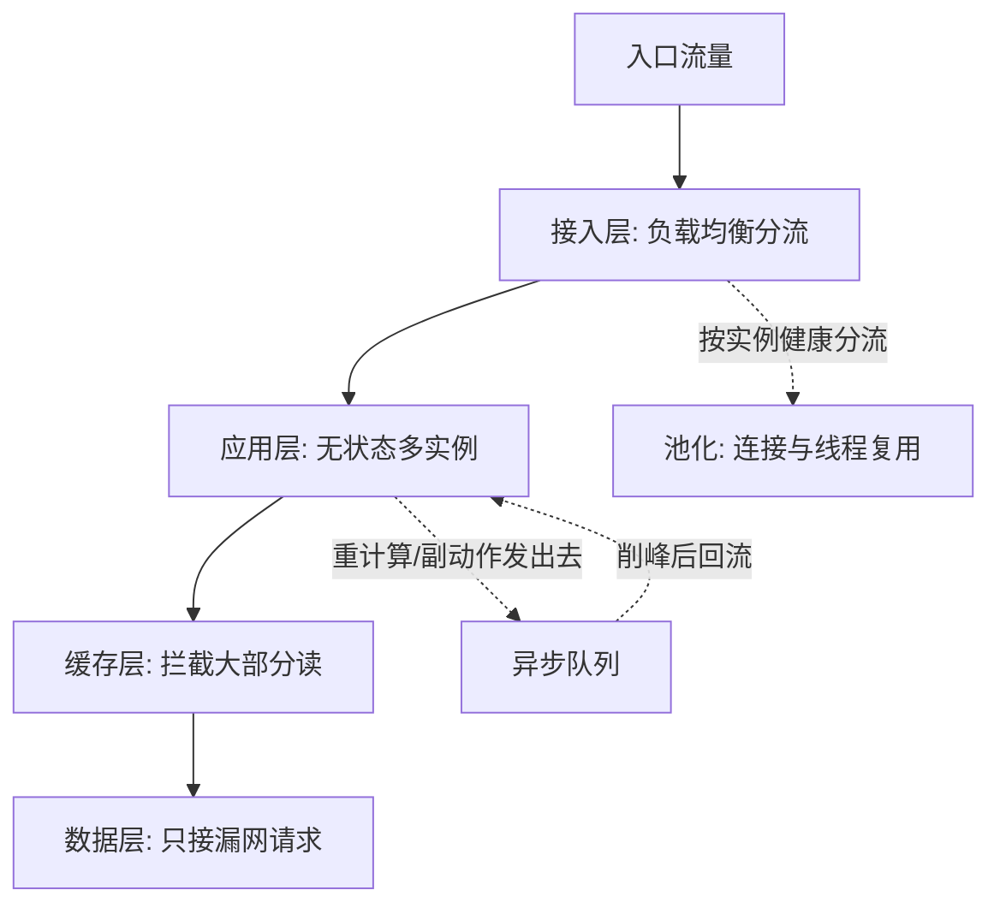
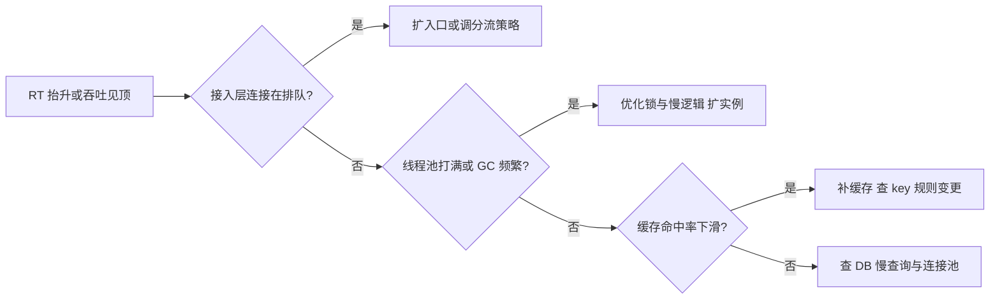

# 高并发设计

> **一句话摘要**：高并发设计的全部手段可以归纳为五板斧——缓存、异步、池化、无状态、水平扩展，每一板斧都在回答同一个问题：「怎么让一次请求更便宜，让一台机器能干更多事，让一百万台机器像一台一样」；但并发不是无限堆，它的上界由测量和容量规划说了算。

前置阅读：[系统设计是什么与三大目标](./1_系统设计是什么与三大目标-入门.md)。缓存与异步各有一篇专文：[缓存架构](./4_缓存架构-入门.md)、[异步削峰](./5_异步削峰-入门.md)。

## 本文核心

**核心机制一句话**：3_高并发设计 的核心在于分层思维——先定义边界，再选方案，最后验证效果。

**机制链**：定义 → 分析 → 设计 → 实践 → 验证。

**失效点/边界**：适用于中大规模场景；小规模可简化。
## 1. 背景：为什么需要专门的并发设计

单机的并发上限是物理现实：一台普通服务器，CPU 密集型应用受核数限制，IO 密集型应用受连接数和磁盘/网络带宽限制，一到几万的 QPS 就是常见的天花板量级（因业务形态差异巨大，为业内通用认知）。而业务的流量增长不会跟你商量——运营活动、爆款内容、节假日峰值，随时把流量推过这道墙。

高并发设计的本质不是「让机器更快」，是**让系统在资源不变的前提下，把每一分资源花在刀刃上**：减少不必要的计算（缓存）、推迟不紧急的计算（异步）、复用昂贵的资源（池化）、让机器可以被复制（无状态）、然后放心大胆地加机器（水平扩展）。

## 2. 核心机制：五板斧的原理

- **缓存**：让读请求不落到数据库。数据库 QPS 上限低而缓存 QPS 上限高出一到两个数量级（内存随机访问与磁盘 IO 的物理差距），把读压力从慢层挪到快层是性价比最高的手段——机制细节见[缓存架构](./4_缓存架构-入门.md)。
- **异步**：把「必须现在做完」缩短为「必须现在受理」。同步链路里每一环的耗时都会累加到用户等待上，把不紧急的动作扔进队列，主链路立刻变短——机制细节见[异步削峰](./5_异步削峰-入门.md)。
- **池化**：数据库连接、HTTP 连接、线程，创建和销毁都是昂贵操作（TCP 握手、TLS 协商、内存分配）。池化 = 预先创建、反复复用，把单次请求的开销摊薄。代价是要管理池的上限和借还纪律。
- **无状态**：应用实例不存会话数据（session 外移到 Redis 或改用令牌），任何实例都能服务任何请求。这是水平扩展的**前提**——状态在实例里，加机器就只是复制了「半个人」。
- **水平扩展**：无状态之后，加机器近似线性提升吞吐；负载均衡负责把流量摊到新实例上。

五板斧背后有一条理论线值得知道：**阿姆达尔定律**——系统加速比受「串行部分」限制。你的链路里那 5% 必须走数据库、必须加锁、必须单点的部分，决定了加多少机器都绕不开的上限。高并发设计一大半的工作，就是不断把「串行部分」找出来消掉。

## 3. 落地实践：先测量，再动斧子

性能优化有铁律：**先测量再优化**。凭直觉优化最常犯的错误是优化了不慢的地方。通用的瓶颈定位顺序：

1. **看入口**：网关/负载均衡的连接数、请求排队情况——接入层是不是先堵了。
2. **看应用**：线程池活跃度、GC 频率、锁等待——应用层是不是在排队。
3. **看下游**：数据库慢查询、缓存命中率、下游 RPC 耗时——数据层是不是瓶颈。
4. **定位到层之后再看单点**：慢 SQL、热点 key、大对象序列化。

这条定位链画成决策图：

分位值思维贯穿始终：**优化 P99 而不是平均值**。平均响应 50ms 而 P99 2 秒的服务，意味着每 100 个请求就有 1 个用户等 2 秒——而且前端和上游的超时通常按长尾设置，长尾会触发超时重试，重试又放大流量，这是生产环境最常见的恶性循环起点。

每板斧还有自己的关键参数要盯：连接池的**最大连接数**（配大了压垮数据库，配小了自己排队）、线程池的**队列长度与拒绝策略**、缓存的**命中率与 TTL**。这些数字不该拍脑袋——它们是[容量规划与性能评估](./9_容量规划与性能评估-入门.md)的输出。

## 4. 生产视角：并发出事时的样子

- **长尾引发的重试风暴**：下游 P99 抬升 → 上游超时重试 → 下游流量翻倍 → 进一步变慢。过去 5 年的公开事故复盘里，这类风暴几乎都是并发事故的第一主角；最后重启也没用，因为重启后流量全涌回来。解法在兜底侧：重试的退避与上限、限流与熔断的参数取舍都要成体系——机制归稳定性工程系列展开。
- **线程池/连接池打满**：监控上表现为活跃线程数贴着上限、队列堆积、RT 阶跃式上涨（从微秒级直接跳到队列等待时长）。排障先看池的活跃/排队曲线，而不是先看单请求耗时。
- **无状态假设被悄悄破坏**：某次迭代有人把限流计数器放进了实例内存——扩容后各实例限额不一致，本地缓存了一份本该走 Redis 的数据——实例间读到不同结果。这类「状态泄漏」不会立刻出事，在扩容或发布分批时集中爆发，是并发事故里最难排查的一类。
- **数据库是最终瓶颈**：五板斧把流量层层拦截后，最后漏到数据库的请求决定了系统真正的容量上限。这也是为什么并发设计的尽头永远是数据层设计（读写分离、分库分表——后文专篇）。

## 5. 主流方案怎么做：每层的机制级选择

| 层 | 主流机制 | 机制要点 |
|---|---|---|
| 接入层 | LVS（四层转发）/ Nginx（七层反代）/ 云负载均衡 | 四层快、七层功能多（路由、卸载 TLS）；云 LB 免运维但规则受限 |
| 无状态会话 | Redis 集中存 session / JWT 令牌 | 集中式可随时踢人下线；令牌无需中心存储但签发后难撤销 |
| 池化 | 各语言数据库连接池 / HTTP 连接池 | 核心参数都是：最小空闲、最大上限、借还超时、健康探测 |
| 异步 | Kafka（高吞吐顺序写）/ RocketMQ（事务与延迟消息机制） | 按吞吐、延迟、功能需求选，机制对比见[异步削峰](./5_异步削峰-入门.md) |
| 水平扩展 | Kubernetes HPA / 云弹性伸缩组 | 按 CPU 或自定义指标自动增减实例，配合提前扩容应对已知峰值 |

注意规律：五板斧在主流生态的演进里，正从「业务代码里的机制」下沉为「开箱组件」——但**参数与组合方式没有默认答案**——组件解决机制，容量数字解决配置。

## 6. 典型场景

- **大促网关**（流量级）：接入层限流 + 静态资源 CDN 卸载 + 核心接口缓存预热，把洪峰在入口削掉大半。
- **Feed 流刷新**（用户级）：内容聚合页多级缓存，个人时间线异步组装，刷新峰值靠缓存命中率扛。
- **报表导出**（数据级）：导出请求异步化（提交任务 → 后台生成 → 通知下载），避免长查询占住 Web 线程池拖垮在线流量。

## 7. 与相邻概念的区别

- **高并发 vs 高性能**：高性能追求单请求更快（降低 RT），高并发追求同时服务更多请求（提升吞吐）。两者常一起做，但手段不同——缓存提升两者，锁优化偏性能，水平扩展偏并发。
- **QPS vs TPS vs 在线用户数**：QPS 是每秒请求数（一次页面加载可能产生多个请求），TPS 是每秒事务数（一个业务事务含多个请求），在线用户数是系统里的会话规模——三者常差一个数量级，容量估算时不要混用。
- **并发量 vs 吞吐量**：并发量是「同一时刻正在处理的请求数」（Little's Law：并发 = QPS × 平均 RT），吞吐量是单位时间完成的请求数。RT 上涨时并发自然膨胀，这就是雪崩的数学根源。

## 8. 常见误区与不适用

- **「平均值达标就是没问题」**：平均值会掩盖长尾，而超时、重试、用户流失全由长尾决定。看 P95/P99，看最大值。
- **「不够就加机器」**：无状态应用层加机器有效；数据库、单点服务、串行段加机器无效。加机器前先确认瓶颈层可复制。
- **「在线用户 100 万 = 需要 100 万并发」**：并发是 QPS × RT 的结果。100 万在线用户若每人 10 秒一次请求、RT 50ms，并发只有几千。
- **「五板斧全上都上」**：每板斧都有代价（一致性问题、延迟可见、池参数调优、状态外移改造、成本）。流量没到量级先上全套，是负优化。

## 9. 你们可能会问

- **怎么估算我的系统最大能扛多少？** 压测找拐点：并发数上升、吞吐不再涨、RT 开始飙升的临界点就是当前容量——方法论见[容量规划与性能评估](./9_容量规划与性能评估-入门.md)。
- **为什么 P99 比平均值重要？** 因为超时与重试按分位值触发。平均值 50ms、P99 3s 的系统，重试流量由那 1% 决定，故障往往从长尾开始。
- **无状态真能完全做到吗？** 应用层可以（会话、缓存、文件全部外移），但监控埋点、本地配置这类「软状态」仍存在。关键是不存「影响正确性」的状态。
- **池越大越好？** 连接池上限超过数据库承受力反而全局变慢（上下文切换 + 锁竞争）。池大小要让「数据库的总连接预算」来定，不是让单机直觉来定。
- **缓存和异步先上哪个？** 看瓶颈画像：读多先缓存，写多/链路长先异步。两者不互斥，顺序由测量结果决定——这也是并发架构演进的基本节奏：先测量，后动手。

## 10. 一句话总结 + 5W 速记卡 + 自测三问

**一句话总结**：高并发 = 五板斧的组合拳——缓存减请求、异步减等待、池化减开销、无状态可复制、水平扩展兜总量；先测量定位瓶颈层，再让斧子落到瓶颈上。

**5W 速记卡**：

| 维度 | 内容 |
|---|---|
| What | 缓存 / 异步 / 池化 / 无状态 / 水平扩展五板斧及其适用层 |
| Why | 单机并发上限是物理现实，业务流量增长不会商量 |
| When | 流量上量、大促备战、RT 长尾抬升、扩容不奏效时 |
| Where | 接入层、应用层、数据层的每一级容量设计 |
| How | 测量定位瓶颈层 → 选板斧 → 参数由容量数字定 → 监控分位值 |

**自测三问**：

1. 你的系统当前瓶颈在哪一层？这个结论来自测量还是直觉？
2. 你的应用再扩一倍实例，吞吐能翻倍吗？什么在阻止它翻倍？
3. 最近一次性能优化，优化前后的 P99 分别是多少？

---

**下篇预告**：五板斧之首的缓存值得单独一篇——下一篇[缓存架构](./4_缓存架构-入门.md)讲多级缓存体系、穿透/击穿/雪崩与缓存一致性。

---

## 📌 数据与事实声明

本文单机 QPS 天花板、内存与磁盘的访问量级差为业内通用认知（具体数字随硬件与业务形态差异大，请以自身压测为准）；Little's Law 与阿姆达尔定律为公开排队论/并行计算结论；对标组件（LVS、Nginx、Kafka、RocketMQ、K8s HPA）仅做机制级定位，参数配置请以官方文档为准。

## 核心带走

**30 秒复述**：本文核心要点已覆盖——分层思维、量级意识、边界纪律。**失效边界**：量级变化时需重新评估。
## 📚 参考资料

| 类型 | 标题 | 来源 |
|---|---|---|
| 图书 | 数据密集型应用系统设计（DDIA） | O'Reilly（2017 中译） |
| 图书 | 大型网站技术架构：核心原理与案例分析 | 电子工业出版社（2013） |
| 论文 | The Talos Objection / Amdahl's Law 相关综述 | 公开学术资料（并行加速比） |
| 系列文章 | 缓存架构 / 异步削峰（本系列） | 本仓库同系列第 4、5 篇 |
