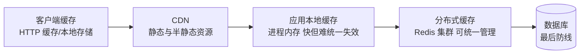
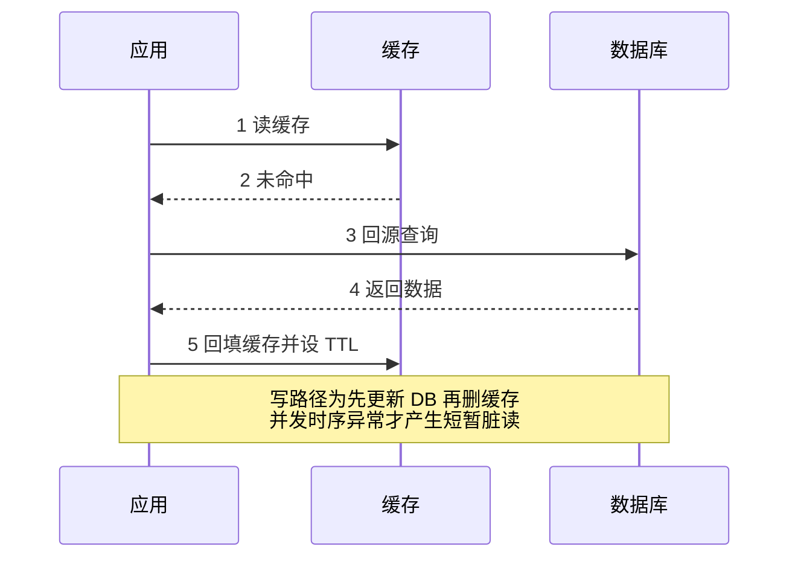
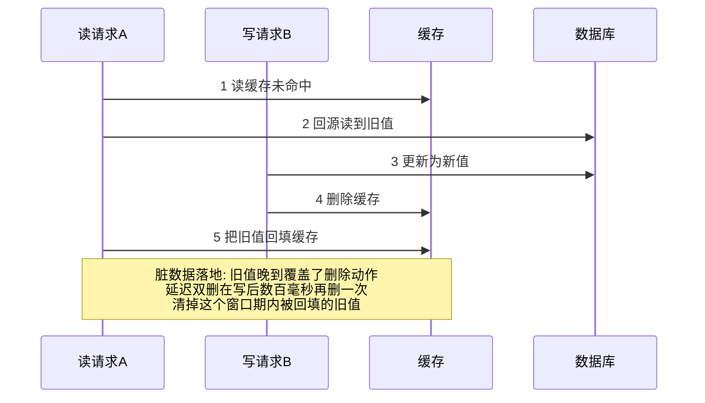

# 缓存架构

> **一句话摘要**：缓存是高并发第一手段——用「数据副本 + 一定的不一致容忍」换「快一到两个数量级的读性能」；本篇讲清多级缓存体系怎么分工、穿透/击穿/雪崩三大问题的原理与对策、以及缓存与数据库的一致性权衡，最后给「什么时候不该用缓存」的边界。

前置阅读：[高并发设计](./3_高并发设计-入门.md)。缓存实现细节（数据结构、淘汰算法、集群机制）归本仓库 Redis 系列深挖，本篇只讲架构机制。

## 1. 背景：为什么缓存是高并发第一手段

内存的随机访问在纳秒到微秒量级，磁盘 IO 在毫秒到十毫秒量级，中间隔着三到六个数量级（硬件常识量级，随介质不同有差异）。数据库的 B+ 树查询、行锁、日志落盘都要付出磁盘代价，而缓存把热数据放进内存——**同样一台机器，当缓存用比当数据库用，能扛的读请求高出一到两个数量级**。

所以高并发改造的第一刀几乎总是加缓存。但缓存的本质要认清：它不是「更快的数据库」，是**有损副本**——允许短暂过期、允许少量不一致、内存满了会淘汰。所有缓存设计问题，都是「这份有损副本怎么管」的问题。

## 2. 核心机制：多级缓存与三大经典问题

### 2.1 多级缓存体系

层级越靠前，离用户越近、越快，但**失效越难统一**（CDN 刷新有延迟、本地缓存各实例各自为政）；越靠后，管理越集中，但离用户越远。这套多级体系是缓存技术随业务规模演进的产物——每一层都是为了消解上一层的失效代价而长出来的。分工惯例：静态与半静态内容放 CDN；配置、元数据、热点小集合放本地缓存；用户态、交易态、高频热点数据放分布式缓存；数据库只接「必须最新的写路径」和漏网的读。

### 2.2 三大经典问题的原理与对策

| 问题 | 根因 | 现象 | 主流对策 |
|---|---|---|---|
| 穿透 | 查询的 key 在缓存和 DB 里都不存在，每次都打穿到 DB | 恶意请求/爬虫用随机 ID 轰炸 | 布隆过滤器拦截（可能误判但绝不漏放）；空值缓存（短 TTL） |
| 击穿 | 单个热点 key 过期的瞬间，并发请求同时回源 | 某爆款商品缓存到期瞬间 DB QPS 尖刺 | 互斥重建（只放一个请求回源，其余等结果）；逻辑过期（物理不过期、异步刷新） |
| 雪崩 | 大量 key 同时过期（或缓存集群整体故障），读请求集体涌向 DB | 凌晨批量预热的 key 同刻过期，DB 被打挂 | TTL 加随机抖动；多级兜底（本地缓存扛第二波）；DB 侧限流自保 |

三者共同的底层原理：**缓存层的可用性是瞬时波动的，设计必须假设「缓存会失守」**——失守的瞬间 DB 扛不扛得住，才是系统的真实容量。

### 2.3 缓存一致性：Cache Aside 与它的时序问题

主流读写模式是 **Cache Aside（旁路缓存）**：读——先读缓存，未命中读 DB 并回填；写——先更新 DB，再删除缓存（不是更新缓存）。

为什么写时「删」而不是「更」：更新缓存可能把旧值算进新值（并发写互相覆盖），且很多缓存的值是查询聚合的结果，写侧根本算不出来；删掉让下一次读来回填，简单且正确率高。但它仍有一致性窗口：写库成功、删缓存失败，或「读旧值回填」撞上「写库后删缓存」的并发时序，都会留下短暂脏数据。主流的补救是**延迟双删**（写后延迟数百毫秒再删一次）或**订阅 binlog 异步删**（把删除动作挂在数据库变更日志上，可靠性更高——机制见本仓库 MySQL 系列）。工程结论：**缓存一致性只能做到最终一致，方案选择是在「脏数据窗口时长」和「实现复杂度」之间取舍**。

把 Cache Aside 的读写时序画出来：

并发写覆盖具体怎么发生、延迟双删怎么兜，一张竞争时序图看清：

竞争只用一句话说清：读请求 A 在第 2 步拿到了旧值，写请求 B 抢在第 5 步之前完成了更新和删除——A 的回填晚到，把刚删干净的缓存又填回了旧值。读回填的耗时不可控（撞上慢查询就是几百毫秒），所以延迟双删的等待量级要按「最坏回填耗时」估，而不是按正常请求。

## 3. 落地实践：缓存怎么上、参数怎么定

落地顺序本身是无数系统演进出的一致节奏——先挑数据、再定规则、后配防御：

1. **先挑数据**：读多写少（读写比至少几位数比 1）、可容忍秒级不一致、单值不太大（字段裁剪，别把整行大对象扔进去）的数据适合缓存；强一致数据（余额、库存的扣减位）不适合直接缓存读。
2. **Key 设计**：带业务前缀防冲突、带版本号便于整体失效（`v2:product:123`）；大集合拆小 key，避免单 key 过大。
3. **TTL 策略**：按业务容忍度定基准值（内容类几十秒到几分钟，配置类可到小时级），**一律加随机抖动**（如基准 ±20%）防同时过期。
4. **三大问题的防御按需上**：ID 类查询有被轰炸风险 → 布隆过滤器；已知热点（活动商品）→ 逻辑过期或预热；批量灌缓存 → 错峰 TTL。
5. **命中率与回源比监控**：命中率突然下降（新版本改了 key 规则、批量失效）往往先于故障出现，是缓存层最重要的先行指标。

## 4. 生产视角：缓存失守长什么样

- **集群故障的连锁雪崩**：分布式缓存集群整体不可用，全部读流量压向 DB——原本 DB 只接 5% 的量，瞬间接 100%，连接打满、全站超时。这是公开事故报告里最经典的连锁故障形态。防线：DB 侧限流保命 + 本地缓存兜底 + 缓存集群自身高可用。
- **热点 key 打爆单分片**：分布式缓存按 key 分片，一个超级热点把某个分片的带宽/CPU 吃满，其他分片闲置。对策：热点 key 本地缓存化（应用内存挡一层）、key 加随机后缀分散存储。
- **缓存与 DB 不一致的排障**：业务反馈「改了但不生效」，排查顺序：改的是哪个库？删的是哪个缓存 key？key 规则两个团队是否不一致？延迟双删的延迟够不够？不一致类 bug 多数根因是**多套写路径**（不同服务、不同脚本写同一数据，只有一条删了缓存）。
- **大 key 与慢查询互相拖累**：百 KB 级的大 value 占满带宽，缓存本身的操作延迟上升，反过来拖慢所有读。生产纪律：value 大小上限纳入代码评审。

## 5. 主流方案怎么做：机制级对比

| 类别 | 主流方案 | 机制特点 | 适合 |
|---|---|---|---|
| 进程本地缓存 | Caffeine / Guava Cache 一类 | 内存 + 淘汰算法（W-TinyLFU 一类：频率优先、抗偶发扫描） | 配置、元数据、极热点小集合 |
| 分布式缓存 | Redis（主流）/ Memcached | Redis：数据结构丰富、单线程事件循环低延迟、支持持久化与复制；Memcached：纯 KV、多线程、更简单 | 用户态、热点交易数据、共享会话 |
| 两级组合 | 本地缓存 + 分布式缓存 | 本地挡极热点，分布式做统一事实源，靠短 TTL + 消息广播失效 | 超高并发读 + 可容忍秒级陈旧 |
| 边缘缓存 | CDN / 网关缓存 | 把静态与半静态内容推到离用户最近的节点 | 图片、JS、商品详情页骨架 |

组件选型的机制分界线很清晰：**需要统一失效和丰富结构 → 分布式；追求极致延迟、数据可重算 → 本地**。本地的极致快与分布式的统一管组合成两级缓存，是高并发场景近年最主流的演进方向。实现细节（持久化、主从、集群分片）归 Redis 系列深挖。

## 6. 典型场景

- **商品详情页**（流量级）：CDN 放页面骨架与图片，本地缓存放类目树，Redis 放价格库存快照，DB 只在缓存未命中时兜底。
- **配置/风控规则**（元数据级）：本地缓存为主、启动全量加载 + 订阅变更消息刷新——读极快，秒级生效可接受。
- **登录会话**（用户级）：Redis 集中存 session——任何实例可服务任何用户，天然配合无状态扩容；踢人下线也只需删一个 key。

## 7. 与相邻概念的区别

- **缓存 vs 缓冲（Buffer）**：缓存解决「重复读快一点」（数据会被多次读），缓冲解决「读写速度不匹配」（批量合并，如日志缓冲、写缓冲）。一次写多次读是缓存场景，多次写攒一批是缓冲场景。
- **缓存 vs 数据库只读副本**：副本是全量数据的另一份完整拷贝（一致性由复制机制保证，见[读写分离](./7_读写分离-入门.md)）；缓存只是热数据子集、可被淘汰。数据量大、查询模式分散用副本；热点集中、要求极快用缓存——大型系统两者都有。
- **本地缓存 vs 分布式缓存**：本地快（纳秒级）但各实例独立失效、总量受单机内存限制；分布式慢一个网络往返但全局一致、容量可扩展。判断标准是「失效要求」而非速度。

## 8. 常见误区与不适用

- **「什么慢就缓存什么」**：强一致数据（余额、库存扣减位）缓存读会直接导致超卖/超付。缓存的适用前提是业务能容忍窗口期不一致。
- **「缓存 = 第二数据库，数据放里面就丢不了」**：缓存会淘汰、会过期、集群故障时可能丢。持久化数据的事实源永远在 DB，缓存放的是「可重算的副本」。
- **「先更新缓存再更新 DB」**：缓存更新成功、DB 更新失败，脏数据要等到 TTL 才消失。主流顺序是先 DB 后删缓存，配合补偿手段收窄窗口。
- **「TTL 统一 30 分钟，整齐」**：整齐的 TTL = 集体过期的雪崩时刻表。任何批量灌入都要抖动。
- **「命中率越高越好」**：把长尾数据也缓存进来抬命中率，会挤占热点内存、降低整体收益。缓存的收益看「拦截了多少本会打挂 DB 的量」，不看绝对命中率。

## 9. 你们可能会问

- **为什么删缓存而不是更新缓存？** 并发写互相覆盖 + 写侧算不出聚合值 + 冷数据白写。删除把回填交给下一次读，按需计算。
- **延迟双删的「延迟」定多少？** 比一次主从同步延迟略长（数百毫秒量级起步，业内经验值），目的是清掉「在库更新后、从库同步前」这段窗口里被回填的旧值。
- **布隆过滤器误判了怎么办？** 布隆只会「误判存在」，不会「误判不存在」；拦截场景下误判的代价只是一次回源 DB 查空，可接受。要精确就换「空值缓存」组合。
- **缓存集群挂了怎么不雪崩？** 三层：DB 侧限流（保命）、本地缓存兜底（顶一段）、降级开关（非核心读直接返回默认值）。
- **命中率多少算健康？** 没有通用数字——看「回源量」是否在 DB 容量预算内。命中率 90% 但回源量翻倍的系统照样出事。

## 10. 一句话总结 + 5W 速记卡 + 自测三问

**一句话总结**：缓存用「可容忍的不一致」换「数量级的读性能」——多级分工、三大问题各配防御、一致性只求最终一致，并且永远要回答「缓存失守时 DB 扛不扛得住」。

**5W 速记卡**：

| 维度 | 内容 |
|---|---|
| What | 多级缓存体系 + 穿透/击穿/雪崩 + Cache Aside 一致性权衡 |
| Why | 内存与磁盘的数量级差距，让缓存成为高并发第一手段 |
| When | 读多写少、可容忍秒级不一致、读路径成为瓶颈时 |
| Where | CDN → 本地 → 分布式 → DB 的每一级读路径 |
| How | 挑对数据 → TTL 抖动 → 按风险配防御 → 监控命中率与回源比 |

**自测三问**：

1. 你系统里最热的三个 key 是什么？它们过期瞬间会发生什么？
2. 缓存集群整体不可用时，你的 DB 能撑住多久的全量读？
3. 有一条「改了不生效」的不一致反馈，你的排查步骤是什么？

---

**下篇预告**：缓存削掉的是读洪峰，写洪峰和长链路怎么办——下一篇[异步削峰](./5_异步削峰-入门.md)讲 MQ 削峰填谷、异步解耦与消息可靠性。

---

## 📌 数据与事实声明

本文内存/磁盘访问量级、缓存与 DB 的性能倍数量级为硬件与业内通用认知；三大问题对策（布隆过滤器、互斥重建、延迟双删、binlog 订阅失效）为公开技术社区的通行实践；组件（Caffeine、Redis、Memcached、CDN）仅作机制级定位，特性与参数以官方文档为准。

## 📚 参考资料

| 类型 | 标题 | 来源 |
|---|---|---|
| 图书 | 数据密集型应用系统设计（DDIA）第 3 章 | O'Reilly（2017 中译） |
| 图书 | 凤凰架构——冰山之下（缓存章节） | icyfenix.cn（周志明，在线开源） |
| 文档 | Caffeine Wiki（W-TinyLFU 淘汰算法） | github.com/ben-manes/caffeine |
| 系列文章 | Redis 系列（缓存实现细节） | 本仓库 docs/middleware/redis/ |
