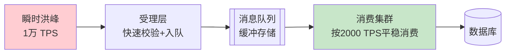
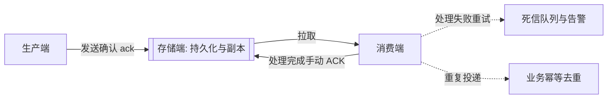

# 异步削峰

> **一句话摘要**：异步削峰用「队列 + 按能力消费」把瞬时洪峰摊平成平稳负载，用「消息解耦」把同步长链路拆短——代价是延迟可见和一套消息可靠性的新问题（丢失、重复、堆积）；本篇讲清什么能异步、什么不能、以及消息出事时怎么救。

前置阅读：[高并发设计](./3_高并发设计-入门.md)。消息丢失与重复的理论基础（至少一次/恰好一次、幂等）在[分布式理论系列](../../../distributed-theory/入门层/从零开始认识分布式理论系列/10_幂等与去重-入门.md)展开。

## 本文核心

**核心机制一句话**：5_异步削峰 的核心在于分层思维——先定义边界，再选方案，最后验证效果。

**机制链**：定义 → 分析 → 设计 → 实践 → 验证。

**失效点/边界**：适用于中大规模场景；小规模可简化。
## 1. 背景：为什么同步链路扛不住洪峰

业务流量天然有峰：秒杀开抢的几秒钟、账单日零点、爆款推送后的十分钟——瞬时流量可以是日常的十倍以上（行业认知）。同步架构里，每一笔请求都要「现场办完」，系统容量必须按峰值建：峰值 10 倍，机器 10 倍——而峰值每年只有那么几天，绝大部分时间机器在闲置烧钱。

队列提供了另一种可能：**把「立即办完」改成「立即受理、尽快办完」**。洪峰先存进队列（写队列的容量远大于处理容量），下游按自己的稳定处理能力慢慢消费——流量曲线被「削峰填谷」。容量按平均处理能力建，而不是按瞬时峰值建，这就是异步削峰的经济账。从「按峰值建容量」到「按处理能力消费」，是容量思路的一次关键演进。

## 2. 核心机制：削峰填谷与异步解耦

两件事在同时发生：

- **削峰填谷**：入口只做「校验 + 入队」这类轻动作，QPS 上万也不怕；队列缓冲洪峰，消费端按稳定速率（比如 2000 TPS）消化。用户拿到的是「受理成功，处理中」，几秒后可查结果——**两段式交互**是削峰的用户体验前提：没有「稍后可查」的设计，异步只会制造焦虑的轮询。
- **异步解耦**：同步链路 A→B→C 里任何一环慢或挂，全链路跟着慢和挂。改成 A 发消息、B 和 C 各自订阅消费后，下游的故障和扩容都不再直接影响主链路——B 挂了消息积压着，B 恢复后接着消费；C 要扩容，自己加消费者就好，上游完全无感。

## 3. 落地实践：什么能异步、什么坚决不能

异步改造前先过这张判断表：

| 判断维度 | 能异步 | 不能异步 |
|---|---|---|
| 用户是否在等这个结果 | 不等（通知、积分、日志、发货单） | 等（扣款回执、库存扣减确认、验证码） |
| 失败后能否重试/补偿 | 可重试可补偿 | 失败即事故，必须同步感知 |
| 一致性要求 | 最终一致够用 | 强一致（下游立即读到结果） |

「等结果」的动作不是绝对不能异步，而是要**改交互设计**：下单页改成「受理中 → 稍后查单」，本质是把强同步体验改造成两段式。改不了交互的（比如支付结果页），就老老实实同步，或者只把结果通知类的副动作异步出去。

实现纪律还有三条：**消息体只放标识**（下游按 ID 回查数据，别把大对象塞进消息）；**消费端必须幂等**（重试一定会带来重复投递，见下节）；**每条链路都有死信出口**（重试 N 次仍失败的消息落死信队列 + 告警人工介入，而不是无限重试堵住队列）。

## 4. 生产视角：消息出事的三种方式

出事点与防线的关系一张图收拢：

- **消息丢失**：可能发生在三个环节——生产端（网络失败没送达）、存储端（broker 落盘前宕机）、消费端（取到消息还没处理完就宕机）。主流 MQ 的对策是「至少一次」投递：生产确认 + 持久化 + 手动消费确认。**至少一次的必然代价是重复**，所以可靠性体系是成对的：防丢靠确认机制，防重靠幂等（按业务单号去重，而不是依赖消息 ID）。
- **消息堆积**：监控里的 lag（消费延迟）持续上涨，根因通常是三种——消费逻辑变慢（下游依赖慢查询）、消费能力不足（流量涨了消费者没扩）、下游故障（消费即失败，重试占满吞吐）。救火动作按序：降级非核心消费腾出吞吐 → 扩消费者（注意**队列/分区数是并行度上限**，队列 8 个开 16 个消费者没用）→ 极端时把消息转储到临时主题、修好再回放。堆积几百万条时，「先止血再治本」的顺序感决定恢复时长；长期则靠 lag 水位与自动伸缩联动——这是堆积治理从事后救火走向事前防控的演进。
- **顺序被打破**：同一单据的「创建 → 支付 → 发货」消息被并发消费，发货先于创建执行。主流解法是按业务键（订单号）路由到同一队列分区串行消费——代价是分区的热度和吞吐上限。不需要全局有序，只要「同一实体内有序」。

## 5. 主流方案怎么做：机制级选型

主流 MQ 的机制共性：**存储（追加写日志）+ 路由（主题/队列）+ 消费确认 + 重试与死信**。选型看机制侧重：

| 机制维度 | Kafka 路线 | RocketMQ 路线 | 云厂商队列 |
|---|---|---|---|
| 吞吐机制 | 顺序写 + 批量 + 零拷贝，吞吐天花板极高 | 存储结构均衡，吞吐充足 | 依赖托管服务规格 |
| 功能特性 | 精简（流式处理生态强） | 内置事务消息、延迟消息、死信管理 | 功能因厂商而异 |
| 适合 | 日志流、埋点、超高吞吐管道 | 交易类异步链路（要事务/延迟语义） | 快速接入、免运维优先 |

机制级一句话穿透：Kafka 的高吞吐来自「把随机 IO 变成顺序追加 + 让消费者自己拉取」；RocketMQ 的交易适配性来自「事务消息的半消息机制」（本地事务与消息发送的原子性）和「定时级别延迟」。选型的天平还会随业务演进移动：日志管道期偏 Kafka、交易链路期偏 RocketMQ 的分野，来自机制侧重而非绝对优劣。组件实现细节归本仓库 Kafka / RocketMQ 系列深挖。

## 6. 典型场景

- **秒杀下单**（流量级）：请求快速校验后入队即返回「排队中」，消费端按库存能力平稳扣减，前端轮询结果页——峰值 10 倍也只影响「排队时长」而不影响系统存活。
- **账单日出账**（任务级）：出账任务拆成消息投进队列，消费速率被压在数据库可承受的水位，跑完几小时而不是把 DB 打挂。
- **积分与通知**（副链路级）：下单主链路只写订单，积分、短信、推荐埋点全部走消息——主链路 RT 稳定，副链路挂了也不影响下单成功。

## 7. 与相邻概念的区别

- **异步 vs 并发**：并发是「同时处理多个」，异步是「不必立刻处理完」。异步不提升单笔速度，它提升的是「系统的节奏自主权」——什么时候消费、以多快消费，由消费端定。
- **削峰 vs 限流**：限流把超出容量的请求**直接拒绝**（快速失败），削峰把超出容量的请求**先存起来慢慢办**。可延迟的业务削峰，不可延迟的业务限流——两者常常组合：队列满了（积压超阈值）再触发限流。
- **MQ vs 定时任务**：MQ 是事件驱动（上游发生才处理），定时任务是时间驱动（到点扫一批）。削峰用 MQ（实时性高），批处理用定时任务（有明确的业务时刻）；两者也会组合——定时扫表补偿漏单。

## 8. 常见误区与不适用

- **「万物皆可异步」**：用户在等回执的强一致动作（扣款确认）硬异步化，制造的是客诉而不是性能。异步的前提是交互可以两段式。
- **「堆积了就加消费者」**：并行度上限是队列/分区数；且消费瓶颈常在下游（DB、下游 RPC），加消费者只是把压垮下游的速度加快。先看 lag 的根因再动。
- **「MQ 配了持久化 = 不丢」**：持久化只管存储环节；生产端不开确认照样在网络上丢。丢失防线是「三环节全配确认」的体系，不是单个开关。
- **「消费端重复执行没关系，业务上不会重复」**：重试与 rebalance 必然产生重复投递，这是机制保证的。没有幂等的消费端等于把防重责任交给运气。
- **「异步链路不用监控」**：恰恰相反——异步链路的失败是「延迟暴露」的，等用户投诉时已积压数小时。lag、消费失败率、死信量是异步架构的一等监控项。

## 9. 你们可能会问

- **用户非要实时结果怎么办？** 两条路：该动作保持同步，用缓存/池化/扩容硬扛；或者改产品交互为两段式（受理 + 查单）。技术上没有第三条「异步又能立即出结果」的路。
- **事务消息解决什么问题？** 「本地事务成功」和「消息发出去」这两步的原子性——先发半消息、执行本地事务、再提交消息。用于「订单创建成功但下游必须知道」这类强绑定场景，代价是下游仍是最终一致。
- **堆积几百万条怎么救？** 先降级非核心消费 → 定位根因（下游慢 or 消费者少）→ 扩消费者到分区上限 → 仍不够就把消息转储回放。整个期间 lag 曲线和死信告警是眼睛。
- **延迟消息和定时任务什么关系？** 延迟消息是「每条消息自己的触发时间」（订单 30 分钟未支付自动取消），定时任务是「固定周期扫一批」（每天对账）。前者粒度细、实时性好，后者适合批量补偿。
- **消息体放多大合适？** 只放业务标识 + 最小上下文，业务数据由消费端按 ID 回查。消息体大了拖慢存储与网络，还会让「改字段结构」变成跨团队的噩梦。

## 10. 一句话总结 + 5W 速记卡 + 自测三问

**一句话总结**：异步削峰用队列把「峰值容量问题」变成「延迟容忍问题」——能异步的过判断表，不能异步的守强一致；可靠性靠「确认防丢 + 幂等防重 + 死信兜底」三位一体，lag 是这套架构的心跳指标。

**5W 速记卡**：

| 维度 | 内容 |
|---|---|
| What | 削峰填谷 + 异步解耦 + 消息可靠性（丢失/重复/堆积/顺序） |
| Why | 瞬时洪峰按峰值建容量成本过高，同步长链路脆弱 |
| When | 流量有峰谷差、主链路被副动作拖慢、需要按能力消费时 |
| Where | 受理层与处理层之间的队列，主链路与副链路的分界 |
| How | 判断表定同步边界 → 两段式交互 → 确认+幂等+死信 → 监控 lag |

**自测三问**：

1. 你负责的链路里，哪些动作可以异步但现在同步着？哪些正在被异步但用户在等？
2. 消费端重复投递同一条消息两次，业务会发生什么？这个答案你验证过吗？
3. 现有队列的分区数是多少？消费者的并行度上限受谁限制？

---

**下篇预告**：扛住了洪峰还要扛住故障——下一篇[高可用设计](./6_高可用设计-入门.md)讲冗余、故障转移与兜底三件套。

---

## 📌 数据与事实声明

本文峰值倍数（十倍日常）、两段式受理等描述为业内通用实践的教学概括；Kafka 顺序写批量机制、RocketMQ 事务消息半消息机制为公开设计文档的机制级概括，实现细节以官方文档为准；削峰/限流的组合策略请结合自身业务延迟容忍度设计。

## 核心带走

**30 秒复述**：本文核心要点已覆盖——分层思维、量级意识、边界纪律。**失效边界**：量级变化时需重新评估。
## 📚 参考资料

| 类型 | 标题 | 来源 |
|---|---|---|
| 图书 | 数据密集型应用系统设计（DDIA）第 11 章（流处理） | O'Reilly（2017 中译） |
| 文档 | Kafka 核心设计（顺序写/批量/消费者拉取） | kafka.apache.org 官方文档 |
| 文档 | RocketMQ 事务消息与延迟消息设计 | rocketmq.apache.org 官方文档 |
| 系列文章 | 幂等与去重（分布式理论系列） | 本仓库 docs/architecture/system-design/distributed-theory/ |
