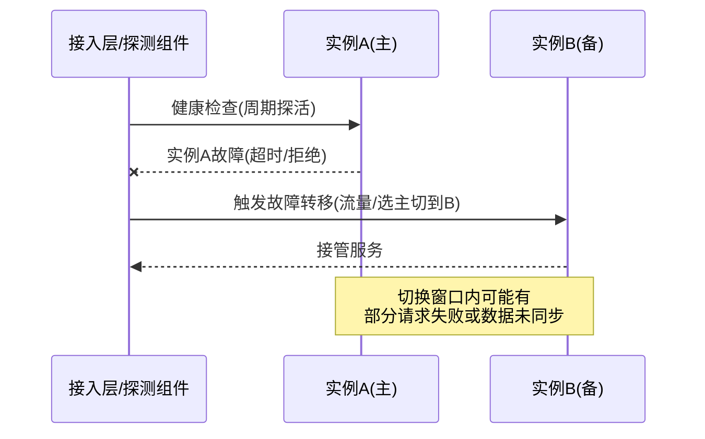
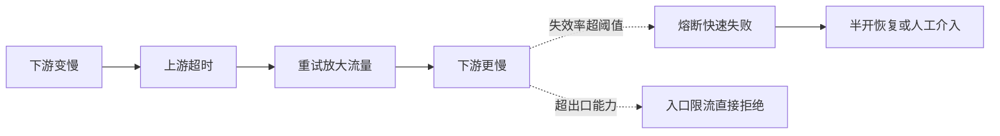

# 高可用设计

> **一句话摘要**：高可用不是「系统不坏」，是「坏了能被快速接管」——冗余消灭单点、故障转移自动接管、限流熔断兜住异常、幂等保证重试安全；可用性数字（SLA）的背后是成本曲线和恢复能力，本文讲清四层防线与它们的失效方式。

前置阅读：[系统设计是什么与三大目标](./1_系统设计是什么与三大目标-入门.md)。限流/熔断的完整机制在本仓库稳定性工程子域展开；幂等原理见[分布式理论系列](../../../distributed-theory/入门层/从零开始认识分布式理论系列/10_幂等与去重-入门.md)。

## 本文核心

> 量级分档意识：本文方法在十万级 QPS、千万级用户、亿级流量的场景下均需重新评估——量级变化时架构与参数需同步调整。

**核心机制一句话**：6_高可用设计 的核心在于分层思维——先定义边界，再选方案，最后验证效果。

**机制链**：定义 → 分析 → 设计 → 实践 → 验证。

**失效点/边界**：适用于中大规模场景；小规模可简化。
## 1. 背景：故障是常态，不是例外

硬件会坏（磁盘、交换机、整机都有出厂级故障率）、网络会抖（丢包、分区、延迟尖刺）、软件有缺陷（每次变更都是一次风险注入）、依赖会挂（第三方接口、机房、甚至整个云区域）。系统规模越大，组件越多，「任意时刻有东西在坏」就从概率题变成了必然题。

所以高可用的思路从一开始就和「消灭故障」分道扬镳：**假设故障必然发生，设计目标改为「故障发生时服务不中断或中断极短」**。这就是可用性工程的主线——冗余（坏一个还有别人）、转移（坏一个自动切）、兜底（过载时保命）、幂等（切换重试不出错）。

## 2. 核心机制：度量、冗余与故障转移

### 2.1 可用性怎么度量

可用性 = MTBF /（MTBF + MTTR）：平均故障间隔（坏得多不多）与平均恢复时间（恢复得快不快）共同决定。由此得出两条改进路径：**降低故障频率**（更好的代码、变更管控、容量冗余）和**缩短恢复时间**（自动切换、快速回滚、预案演练）——后者性价比往往更高，也是「高可用 ≠ 不坏」的数学依据。

SLA 的九进制换算要成为直觉：99.9% = 年停机 8.76 小时；99.99% = 52.6 分钟；99.999% = 5.26 分钟。每多一个 9，停机预算少一个数量级，对应的冗余层次、自动化程度、成本都要上一个台阶（成本远超线性增长，业内通用认知）。

### 2.2 冗余与故障转移

冗余的原则是**无单点**：每一层都要有「坏一个还能顶上」的备份——应用多实例、数据库主从、缓存集群、双机房。但冗余只是「有备胎」，让备胎无缝顶上靠**故障转移**三步：探测（健康检查发现异常）→ 决策（选主或路由切换，要防「双主」）→ 接管（流量切到备份，备份要已同步数据）。

切换机制本身也是故障点：探测太敏感会误切（抖动一下就切，来回震荡），太迟钝会拖延恢复；分布式环境下的经典陷阱是**脑裂**——网络分区时新旧主同时存活、各自接受写入，数据从此分叉。主流对策是「多数派仲裁」（拿不到多数票的主自动降级）或「资源隔离」（fencing：旧主被强制隔离，写不进去）——这两类对策都是分布式共识研究几十年演进出来的工程遗产。

## 3. 落地实践：单点排查与切换设计

高可用改造从一张**单点排查清单**开始，逐层问「这个组件挂了会怎样」：

- 接入层：负载均衡是否多实例？入口 DNS/VIP 有没有备份路径？
- 应用层：实例数是否跨机架/跨可用区？发布时是否滚动（始终有实例在服务）？
- 数据层：数据库主从是否就位？从库能否快速升主？缓存集群是否有副本？
- 依赖层：第三方接口挂了是全站不可用还是降级可用？有没有超时与降级开关？
- 机房级：单机房故障是否可接受？要不要同城双活？

切换设计的关键决策是**自动还是人工**：自动切换恢复快（秒级），但误切和脑裂风险要靠仲裁机制消化；人工切换稳妥，但 MTTR 以分钟到小时计。行业惯例是分场景混合——核心交易链路自动切换（配多数派仲裁），低频风险场景人工确认。此外，**切换必须演练**：没演练过的故障转移，等于没有故障转移——预案文档里的每一条切换路径，都应该在低峰期真实执行过。

## 4. 生产视角：可用性事故的典型形态

- **级联故障（重试风暴）**：下游变慢 → 上游超时重试 → 下游流量翻倍更慢 → 重试继续放大，最后整个依赖链拖垮。防线：重试配退避与上限 + 熔断（下游失败率超阈值就快速失败不等待）+ 限流（超出能力的请求直接拒绝，保住核心）。

这条放大链与三道防线画在一起：

- **冗余的假象**：应用部署了 4 个实例，但 4 个全在同一台宿主机/同一可用区——物理层的单点把逻辑层的冗余归零。冗余必须落在**故障域**层面（不同宿主机、不同机架、不同可用区）才成立，这是容量与部署评审最容易漏的一项。
- **变更引入的故障**：业内通行的认知是「多数线上事故由变更引发」。所以变更安全本身就是可用性工程：灰度发布（新版本先接小流量）、快速回滚（分钟级退回旧版本）、发布窗口避开高峰——这些「流程手段」对 SLA 的贡献不亚于任何架构机制。
- **降级预案的「最后一米」**：预案文档写了「下游挂了切降级」，真出事时没人敢按开关（不确定按下去会发生什么）。降级开关要提前演练、明确影响面、一键可回——**未验证过的预案在事故里等于不存在**。

## 5. 主流方案怎么做：每一层的可用性机制

| 层 | 主流机制 | 机制要点 |
|---|---|---|
| 接入层 | Keepalived + VIP / 云多可用区 LB | VIP 漂移秒级接管；云 LB 由厂商做多活，注意跨可用区配置 |
| 应用层 | 多实例 + 注册中心摘除 | 健康检查失败自动摘流量；优雅停机避免发布瞬间的请求失败 |
| 数据库 | 主从复制 + 自动选主（哨兵机制 / 共识协议选主） | 异步复制有丢数据窗口；半同步换数据安全；机制细节见[读写分离](./7_读写分离-入门.md) |
| 缓存 | 主从 + 集群分片 | 分片既扩容量又缩爆炸半径（一片故障不殃及全局） |
| 机房级 | 同城双活 / 异地多活 | 双活=两机房同时服务、互为备份；多活解决区域级故障，数据同步是核心难题 |

这张表同时也是可用性机制几十年的演进索引——从容灾形态的冷备、温备到双活、多活，每一代都在上一代的故障上长出来。

规律：**越往上层，自动化越成熟、切换代价越小；越往数据层，切换越谨慎**——因为数据层的误切代价是数据丢失，而应用层误切的代价只是一次请求重试。这也是「可用性机制要按层定价」的含义。

## 6. 典型场景

- **核心交易链路**（可用性最高优先）：接入层双活、应用跨可用区、数据库半同步复制 + 自动切换、全链路限流熔断兜底，SLA 目标 99.99%。
- **内部运营后台**（成本优先）：单机房部署 + 每日备份 + 工作时间人工恢复承诺即可——为低频内部系统建设异地多活是典型的过度设计。
- **全局配置服务**（小而关键）：自身极简（少依赖、小状态、多副本），宁可功能克制也要做到「几乎从不挂」——它挂了会让所有依赖它的系统一起挂。

## 7. 与相邻概念的区别

- **高可用 vs 容灾**：高可用处理「组件级故障」（坏一台切一台，秒到分钟级）；容灾处理「站点级灾难」（机房/区域不可用，RTO/RPO 以分钟到小时计）。容灾是高可用在地理维度上的延伸。
- **冗余 vs 备份**：冗余是「实时热备、随时接管」（可用性手段）；备份是「数据留底、用于恢复」（数据安全手段）。有备份不代表高可用——恢复要时间；有冗余也可能同时丢数据——切换窗口的数据没同步完。
- **可用性 vs 数据可靠性**：可用性说「服务在不在」（SLA），可靠性说「数据丢不丢」（ durability ，副本数、持久化）。两者可以牺牲一个保另一个——异步复制切换快（可用性高）但可能丢最后几秒数据（可靠性低），半同步反之。

## 8. 常见误区与不适用

- **「加了副本就高可用了」**：副本只解决「有备份」，探测、仲裁、切换链路中任何一环失效，副本就是摆设。可用性由整条转移链路决定，不由副本数决定。
- **「99.99% 靠运维人力兜」**：52 分钟的年预算里，人工响应（发现、定位、决策、执行）随便一步就是十几分钟。没有自动化切换与预案演练，多一个 9 就是空头支票。
- **「单点都是技术组件」**：人也是单点（只有一个人会操作某个系统）、流程也是单点（只有一条审批路径能触发恢复）。单点排查清单要包含组织和流程项。
- **「为了极端可用把系统做复杂」**：复杂度本身降低可用性（更多组件、更多失效模式）。低频内部系统、早期产品，够用可用性 + 快速恢复，比堆机制更划算。

## 9. 你们可能会问

- **SLA 到底定多少合适？** 从成本曲线反推：每提升一个 9 需要新增的冗余/自动化/演练成本，和停机造成的业务损失比较。核心交易 99.99%，边缘系统 99%~99.9%，是很常见的分布。
- **自动切换为什么不能全自动？** 可以，但仲裁机制必须先行（防脑裂），且切换动作要演练到位。「全自动但没有仲裁、没演练过」比人工切换更危险。
- **异地多活难在哪？** 难在数据同步：跨机房延迟让同步复制不可行，异步复制又引入不一致窗口——业务必须设计成「数据可分区归属」（用户按地域分片）才能真正多活。它是容灾形态演进链条上的最新一级，也是最难的一级。
- **怎么证明系统高可用？** 演练：故障注入（拔实例、断网络、打满依赖）、核对切换时长与数据一致性。SLA 是设计出来的，更是演练出来的。
- **兜底三件套里谁最重要？** 限流保命（没有它其他都白搭）、熔断止损（防止局部故障全局化）、幂等是前提（重试与切换都依赖它）。缺一不可，但资源有限时先有限流。

## 10. 一句话总结 + 5W 速记卡 + 自测三问

**一句话总结**：高可用 = 承认故障必然发生后的工程化应对——冗余消灭单点、转移自动接管、限流熔断兜住异常、幂等保证重试安全；SLA 每多一个 9，都是成本与自动化的真实台阶。

**5W 速记卡**：

| 维度 | 内容 |
|---|---|
| What | 度量（SLA/MTBF/MTTR）+ 冗余 + 故障转移 + 限流/熔断/幂等兜底 |
| Why | 硬件、网络、软件、依赖的故障是常态，「不坏」不可行 |
| When | 系统进入核心链路、SLA 有承诺、大促或变更密集期 |
| Where | 接入/应用/数据/依赖每一层的单点排查与切换设计 |
| How | 排查单点 → 定切换策略（自动/人工）→ 配兜底 → 演练验证 |

**自测三问**：

1. 你的系统现在最大的单点是什么？它挂了之后到恢复要多久，每一步靠谁？
2. 上一次真实故障，MTTR 是多少？其中多少时间花在「人做决策」上？
3. 你的故障转移预案，最近一次真实演练是什么时候？

---

**下篇预告**：冗余落到处处是副本，副本就有延迟——下一篇[读写分离](./7_读写分离-入门.md)讲主从复制机制与延迟下的一致性权衡。

---

## 📌 数据与事实声明

本文 SLA 停机换算为数学推算；「多数线上事故由变更引发」「成本随可用性非线性增长」为业内通用认知（来源为公开的运维与 SRE 实践资料）；脑裂仲裁（多数派/fencing）、哨兵与共识选主为公开机制的机制级概括，具体实现以各组件官方文档为准。

## 核心带走

**30 秒复述**：本文核心要点已覆盖——分层思维、量级意识、边界纪律。**失效边界**：量级变化时需重新评估。
## 📚 参考资料

| 类型 | 标题 | 来源 |
|---|---|---|
| 图书 | Site Reliability Engineering（Google SRE 书） | sre.google（在线开源） |
| 图书 | 凤凰架构——冰山之下（可用性章节） | icyfenix.cn（周志明，在线开源） |
| 图书 | 数据密集型应用系统设计（DDIA）第 8 章（不可靠性） | O'Reilly（2017 中译） |
| 系列文章 | 读写分离（本系列第 7 篇） | 本仓库同系列 |
