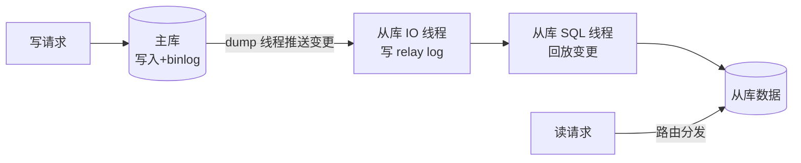
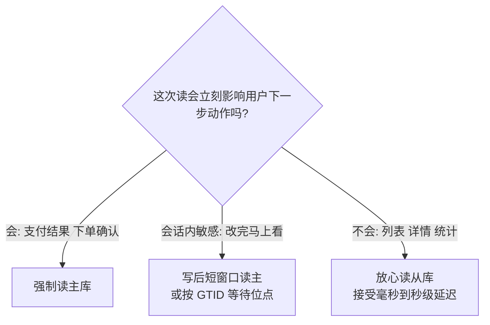

# 读写分离

> **一句话摘要**：读写分离把读流量摊到多个从库、写流量集中在主库，是数据层最早的扩展手段；它的核心权衡只有一个——复制延迟带来的读旧数据问题，什么时候能忍、什么时候必须读主，决定了整个方案的边界。

前置阅读：[高并发设计](./3_高并发设计-入门.md)。复制机制细节（binlog 格式、并行回放、GTID）归本仓库 MySQL 系列深挖，本篇只讲架构机制。

## 本文核心

> 量级分档意识：本文方法在十万级 QPS、千万级用户、亿级流量的场景下均需重新评估——量级变化时架构与参数需同步调整。

**核心机制一句话**：7_读写分离 的核心在于分层思维——先定义边界，再选方案，最后验证效果。

**机制链**：定义 → 分析 → 设计 → 实践 → 验证。

**失效点/边界**：适用于中大规模场景；小规模可简化。
## 1. 背景：为什么读写分离几乎是必经之路

多数互联网业务的读写比在 10:1 到 100:1 量级（行业认知：内容、商品、 profile 类场景尤其极端）——数据库的压力大头在读。而数据库扩容有一条硬边界：**读可以通过加副本水平扩展，写永远只有主库一个入口**。

读写分离因此成为数据层演进的第一个台阶：主库负责写（以及必须最新的读），若干从库通过复制机制保持数据副本，分摊读流量。它便宜（副本通常只读不写，搭建与运维成本低于分库分表）、透明（业务改个数据源路由就接入）、可逆（上分库分表前后的过渡态都靠它）——这些特点让它成为「单库扛不住读」之后的标准答案。

## 2. 核心机制：主从复制与延迟的必然性

机制链路（以 MySQL 机制为原型）：主库把变更写进 binlog，从库的 IO 线程拉取并落成本地 relay log，SQL 线程再回放——**「推送 → 落盘 → 回放」的每一环都花时间**，这就是复制延迟的机制根源。主流数据库默认异步复制：主库提交不等从库确认，延迟通常毫秒到秒级，但在大事务、从库负载高、网络抖动时会放大到秒级甚至更久。

延迟不是 bug，是异步复制的固有属性。于是读写分离的全部设计围绕一个问题展开：**哪些读能容忍旧数据、哪些不能？** 商品详情晚一秒可接受；「下单成功后查订单」不能接受（用户会以为下单失败再下一单）。

### 2.2 读写路由的三个层次

路由逻辑「读走从库、特殊读走主库」可以放在三层实现，取舍各不同：

| 路由层 | 机制 | 优劣势 |
|---|---|---|
| SDK/框架层 | 数据源封装 + 注解标记（如「本次强制读主」） | 零额外部署、延迟低；但每语言各一套，规则散在各应用 |
| 中间件/代理层 | 独立代理进程统一解析 SQL 路由 | 集中管控、业务无感；但多一跳网络与运维组件 |
| 数据库层 | 云 RDS 自带只读实例 + 连接代理 | 免自建、配好即用；灵活性受厂商功能限制 |

## 3. 落地实践：延迟来了怎么办

1. **给读分三级**：无所谓级（列表、推荐、统计）随便读从库；会话敏感级（改完设置马上看）用「写后短时间读主」；强一致级（支付结果页）强制读主。分级越细，主库压力越小。
2. **读己之写**（Read-your-writes）：同一用户写后 N 秒内的读固定路由到主库（会话维度记录时间戳），或者按 GTID 等待（读到从库已回放到指定事务位再返回）——后者更精确，机制依赖数据库的事务标识能力。
3. **从库分角色**：报表、搜索索引构建、数据导出这类重查询踢到专用从库，别让它们拖慢在线读的从库。
4. **延迟监控**：盯复制位点差与延迟秒数（比单看 `Seconds_Behind` 指标更可靠），给「延迟超过 N 秒自动把读全切回主库」留自动预案——从库延迟过大时读它反而害业务。

三级读的判定收敛成一张决策树：

## 4. 生产视角：延迟引发的事故形态

- **下单后查无此单**：写主库成功，立刻读从库没读到（延迟 2 秒），页面显示「下单失败」，用户再下一单——重复订单。这类事故的排查关键问一句：「这个读请求有没有可能读到刚写完的数据？」所有「写后立读」的接口都是嫌疑点。
- **大事务拖垮复制**：一次批量更新 50 万行，主库一个事务执行完，从库回放同一事务也要同样时长，期间所有后续变更排队——延迟尖峰从毫秒级跳到分钟级，且沿上下游传导，读链路每一层都拿到陈旧数据。生产纪律：批量操作拆小事务、避开高峰。
- **切换窗口的数据丢失**：主库宕机自动升主时，异步复制下最后一段 binlog 可能没来得及传到从库——已提交的事务消失。这是「可用性换数据安全」的真实代价，金融类业务用半同步复制（主库提交前至少一个从库确认收到）换安全，代价是写延迟上升与「从库不可用时写阻塞」的新风险。
- **「从库越挂越多读越慢」**：从库承担了报表任务后回放变慢，在线读的延迟跟着变大——从库不是无差别扩容资源，它们的负载结构必须隔离。

## 5. 主流方案怎么做：机制级对比

| 机制 | 主流形态 | 机制取舍 |
|---|---|---|
| 异步复制 | MySQL 默认模式 | 主库不等待，写延迟最低；有丢数据窗口 |
| 半同步复制 | MySQL semi-sync（提交前等从库 ACK） | 数据更安全；写延迟增加，从库故障时降级策略要预设 |
| GTID 全局事务标识 | MySQL GTID 模式 | 每个事务全局唯一标识，切换与「按位读」的基石 |
| 并行回放 | 基于 log 逻辑时钟/组提交的并行复制 | 缓解单线程回放瓶颈（老版本从库延迟的经典根因） |
| 代理层路由 | 数据库代理 / 分库分表中间件内置读写分离 | 统一收口路由规则，透明于业务 |

规律：**数据库自带机制管「复制得多快、丢多少」，中间件管「流量怎么分、特殊情况读哪」**——两层机制配齐，读写分离才算完整。并行回放、GTID、半同步这些机制本身，就是复制协议二十年演进的刻度。

## 6. 典型场景

- **内容详情页**（延迟容忍级）：文章、商品描述类读全走从库，晚一秒无感知，从库数量按读量线性加。
- **订单确认页**（强一致级）：支付完成后的订单状态查询强制读主，宁可主库多扛一点，也不能出现「付了钱查不到订单」。
- **BI 报表**（资源隔离级）：跑批与聚合查询全部走专用延迟从库，隔离在线业务；数据晚到几小时在报表场景完全可接受。

## 7. 与相邻概念的区别

- **读写分离 vs 分库分表**：读写分离扩展**读**能力（副本分担读流量），分库分表扩展**写**与**存储**能力（数据水平切开，见[高扩展设计](./8_高扩展设计-入门.md)）。写瓶颈只能靠后者，读写分离是它的前置台阶。
- **主从 vs 主主**：主从只有主库可写，冲突简单；双主（多写）理论上两边都可写，但同一行数据的并发修改要靠冲突解决机制——多数场景下双主的复杂度收益比不划算，主流还是单写多读。
- **复制 vs 双写（应用层）**：复制是数据库机制（binlog 驱动，可靠且对业务透明）；双写是业务代码同时写两个存储（跨存储场景如「DB + 缓存 + ES」）。能靠复制解决的不要用双写——双写的一致性要业务代码自己兜底。

## 8. 常见误区与不适用

- **「从库越多读能力越强」**：读能力上限受两个天花板约束——主库的写吞吐（所有变更要推给每个从库，从库越多主库复制负担越重）和主库容量（所有读流量最终仍会以「写后读主」的形式部分回落）。从库数量有经济拐点，不是线性堆料。
- **「读写分离是负载均衡」**：负载均衡假设任意实例等价；主从不等价（只有主能写），路由必须感知「读写语义 + 一致性要求」。把它当普通负载均衡配置，写请求被分到从库就是事故。
- **「延迟可以优化到零」**：物理上不可能——跨网络的复制至少有一个 RTT。工程上只做两件事：压小延迟（并行回放、拆大事务）和管住对延迟敏感的读（读主策略）。
- **「业务都升级成强一致读，全走主库」**：主库瞬间失去读写分离的收益。正确姿势是按接口分级，把「必须读主」的范围压到最小集合。
- **写密集场景照搬读写分离**：读写比接近 1:1 的场景（高频交易），从库分摊不了多少压力，直接考虑分库分表或换存储引擎，别在读写分离上空转。

## 9. 你们可能会问

- **延迟多大要警惕？** 看业务阈值：有「写后立读」的链路，几百毫秒就该有读主保护；整体延迟秒级持续出现说明从库或大事务有问题，按事故对待。
- **哪些读必须读主？** 判据一句话：这次读的结果会立刻影响用户的下一步动作吗？会（支付结果、下单确认、余额校验）就读主；只是展示（列表、详情、统计）就从库。
- **为什么不用「写完等 500ms 再读」代替读主？** 延迟尖峰时 500ms 不够，还是读旧；且给所有接口加 sleep 是反模式。读主路由是确定性方案，等待只是抖机灵。
- **主从切换期间数据怎么办？** 短窗口内：已提交未复制的事务可能丢失（异步复制）。重要业务要么半同步，要么在切换后用对账/回放补偿——切换策略和数据补偿要一起设计。
- **读写分离是不是过渡态？** 是演进路上的中间态，但这一站往往停得很久——多数系统的终态也就是「读写分离 + 分库分表」的组合，不会都走到 NewSQL。

## 10. 一句话总结 + 5W 速记卡 + 自测三问

**一句话总结**：读写分离用「读可滞后」换「读可扩展」——复制延迟是机制固有的，方案的核心不是消灭延迟，而是把读按一致性要求分级，让必须最新的读走主、能容忍的读摊给从库。

**5W 速记卡**：

| 维度 | 内容 |
|---|---|
| What | 主从复制 + 读写路由 + 复制延迟的分级应对 |
| Why | 读写比悬殊时，读是瓶颈而读可复制、写不可复制 |
| When | 单库读压力逼近上限、读多写少的业务形态 |
| Where | 数据源路由（SDK/代理层）与数据库复制机制两层 |
| How | 读分级 → 敏感读走主 → 从库分角色 → 监控延迟带预案 |

**自测三问**：

1. 你系统里所有「写后立读」的接口列得出来吗？它们现在读主还是读从？
2. 主库现在挂了，你的自动切换丢数据的窗口有多大？业务能接受吗？
3. 从库上跑过最重的一次查询是什么？它影响在线读了吗？

---

**下篇预告**：读扩完了，写和数据的上限还在——下一篇[高扩展设计](./8_高扩展设计-入门.md)讲无状态、分片与整个系统的扩展性原理。

---

## 📌 数据与事实声明

本文读写比量级、延迟时长均为业内通用认知（随业务与硬件差异大，以自身监控为准）；MySQL 复制机制（binlog/relay log/半同步/GTID）为公开文档的机制级概括，细节归本仓库 MySQL 系列与官方手册；云 RDS 只读实例等描述不指向特定厂商。

## 核心带走

**30 秒复述**：本文核心要点已覆盖——分层思维、量级意识、边界纪律。**失效边界**：量级变化时需重新评估。
## 📚 参考资料

| 类型 | 标题 | 来源 |
|---|---|---|
| 图书 | 数据密集型应用系统设计（DDIA）第 5 章（复制） | O'Reilly（2017 中译） |
| 文档 | MySQL Replication（异步/半同步/GTID） | dev.mysql.com 官方文档 |
| 图书 | 高性能 MySQL（复制章节） | O'Reilly |
| 系列文章 | MySQL 系列（复制实现细节） | 本仓库 docs/data/mysql/ |
