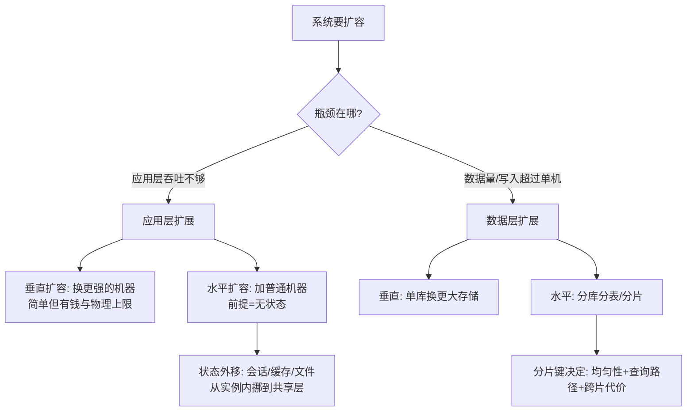
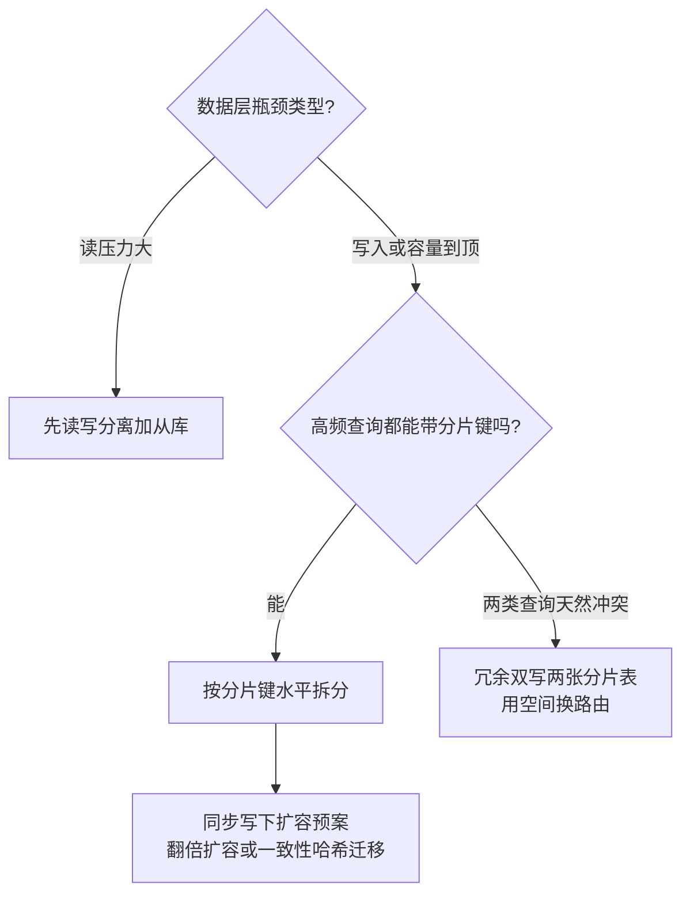

# 高扩展设计

> **一句话摘要**：高扩展回答的是「业务涨了，系统怎么跟着涨」——应用层靠无状态化实现水平扩展，数据层靠分片突破单机上限；扩展性的每一步都是「把绑在实例上的东西解开」，本文讲清三条扩展路线与分片键这个最贵的决策。

前置阅读：[系统架构演进全景](./2_系统架构演进全景-入门.md)、[读写分离](./7_读写分离-入门.md)。分库分表实现细节归本仓库 MySQL 系列深挖。

## 1. 背景：扩展性是被增长倒逼出来的能力

业务增长不可预期：运营活动、内容爆款、市场变化，都可能在几个月内把流量和数据推上新台阶。扩展性（Scalability）衡量的就是——**加资源时，系统能力跟着涨多少**：加一倍机器吞吐涨 90% 是好扩展性，涨 10% 说明有东西绑死了。

先分清三个常被混用的词：**扩展性**（Scalability，加资源加能力，本篇主角）、**弹性**（Elasticity，按负载自动伸缩，云原生时代的标配能力）、**灵活性**（Agility，业务变更时系统适应的速度，微服务的动机）。扩展性是弹性与灵活性的地基——手工加机器都扩不动的系统，自动化伸缩无从谈起。

## 2. 核心机制：两条扩展路线与状态外移

两条路线的机制差别：

- **垂直扩展（scale-up）**：换更强的机器（更多核、更大内存）。简单、零改造，但有两面天花板——物理上限（单机规格封顶）与经济上限（高端机的单价远超普通机加总的等效算力）。它适合作为过渡，不适合作为终点。
- **水平扩展（scale-out）**：加普通机器分摊负载。算力几乎无限、单价便宜，但有一个前提条件——**实例必须可复制**。可复制的前提是**无状态**：实例内存里不存「影响正确性」的东西。

### 2.2 无状态化：解开的清单

无状态不是「没有状态」，是「状态不在实例里」。典型改造清单：

- 会话（session）→ 外移到 Redis 集中存，或改无状态令牌（JWT 类，签发后自包含、无需中心查询）。
- 本地缓存 → 改分布式缓存，或降级为「可重算的加速副本」（见[缓存架构](./4_缓存架构-入门.md)）。
- 本地文件 → 对象存储。
- 定时任务/后台线程 → 从 Web 实例里拆出，独立部署或选主执行。

改造完成的验收标准：**随机杀掉任何一个实例，所有用户的请求都不受影响**。

### 2.3 数据层扩展：分片键是最贵的决策

应用无状态之后，瓶颈必然转移到数据层——单机的写入吞吐与存储容量有物理上限。数据水平扩展 = 分片（分库分表）：把数据按某个键的规则切开，落到多个独立存储实例。

分片键（sharding key）的选择是整个数据扩展里**最贵的一次决策**，因为它决定三件事：

1. **均匀性**：按 user_id 分片，大客户的数据集中一片就倾斜了；按时间分片，新分片独扛全部写入。
2. **查询路径**：查询条件带分片键 → 精确路由到一片（快）；不带 → 广播到所有分片再聚合（慢且贵）。常用查询模式倒逼分片键，反过来不成立。
3. **跨片代价**：跨片事务、跨片 JOIN、全局唯一 ID（见[分布式 ID 系列](../../../distributed-id/入门层/从零开始认识分布式ID系列/0_系列导读-全景.md)）、扩容时的数据搬迁——全都是分片引入的新税。

数据层的扩展决策画成一张图：

## 3. 落地实践：扩展性怎么一步步做

1. **先测扩展上限**：压测确认「现在加机器能不能线性涨」，找出阻止线性涨的那部分（有状态残留、串行依赖、单点服务）。
2. **应用层先无状态**：按上面的清单逐项外移，验收标准是「随机杀实例无感」。
3. **数据层按信号走**：单表行数、写入 QPS 逼近上限（具体阈值看[容量规划与性能评估](./9_容量规划与性能评估-入门.md)）才动分库分表——它是复杂度大杀器，能晚一年上就晚一年上。
4. **分片键按查询模式选**：列出最高频的 3 个查询，确保都能带上分片键；实在有两类查询天然冲突的，考虑冗余双写两张分片表（用空间换路由）。
5. **留扩容预案**：分片方案定稿时写下「数据再涨 N 倍时怎么再切」（翻倍扩容、一致性哈希迁移等），别让下一次扩容变成全量迁移。

## 4. 生产视角：扩展性事故的形态

- **扩容不均**：加了一倍实例，监控发现新实例流量上来了、老实例降不下去——网关用了会话保持（粘住老实例），或者新实例冷缓存命中率极低。扩容不均让水平扩展的收益打折，排查点是流量分配链路（负载均衡策略、缓存预热）。
- **有状态残留的爆发**：平时无状态假设都成立，直到某次发布按批次滚动——两个版本实例各持有自己内存里的限流计数，限流失效；或者本地缓存了一份本该共享的数据，用户请求在不同实例间跳，看到不同结果。这类问题在「扩容/发布/摘流」这些状态重分布的时刻集中爆发。
- **分片倾斜**：上线半年后某分片写入是其他分片的 5 倍（一个大商户/一个热点内容），单分片过载而其他闲置。倾斜的治理成本极高（迁移数据），所以分片键评审时要想好「最大的那 1% 用户怎么办」。
- **扩展的时间预算被忽略**：业务说流量下季度翻倍，而你的分片扩容流程（加节点 + 数据迁移 + 校验）要两个月——**扩展速度必须跑赢增长速度**，扩容耗时是和容量上限同等重要的扩展性指标。

## 5. 主流方案怎么做：机制级对照

| 需求 | 主流机制 | 机制要点 |
|---|---|---|
| 无状态会话 | Redis 集中存储 / JWT 类令牌 | 集中式可撤销、有中心依赖；令牌自包含、难撤销（用短有效期 + 黑名单补偿） |
| 自动伸缩 | Kubernetes HPA / 云弹性伸缩组 | 按 CPU/自定义指标自动增减实例——Elasticity 的落地形态 |
| 数据分片 | 分库分表中间件（ShardingSphere 一类） | 机制共性：SQL 解析 → 路由 → 改写 → 多分片执行 → 结果聚合 |
| 长连接扩展 | 一致性哈希 + 接入层会话保持 | 连接是有状态的，按连接 ID 哈希路由到网关节点，节点变更时只迁移相邻段 |
| 存储托管 | 云分布式数据库 / NewSQL（TiDB 一类） | 把分片透明化到存储层，业务按单库写——代价是运维体系与成本模型变化 |

规律：**分片机制的演进史，就是路由、迁移、聚合这些痛点的逐层下沉史**——从业务代码到中间件再到数据库内核。但下沉不免费：排障时多了一层黑盒，「它帮你分了片，也帮你藏了问题」。

## 6. 典型场景

- **API 服务**（无状态级）：会话外移后实例数随流量自由伸缩，配合 HPA 实现秒级弹性，是绝大多数 Web/API 服务的终态。
- **IM/长连接网关**（有状态级）：连接必须绑在接入节点上，用一致性哈希分摊连接、节点故障时连接漂移重连——扩展的单元从「请求」变成「连接」。
- **订单数据**（分片级）：按 user_id 分库分表，用户的订单永远在同一片（查询路径最优）；平台侧跨用户统计走异步聚合的报表库。

## 7. 与相邻概念的区别

- **水平 vs 垂直扩展**：垂直换更强的机器（简单、有上限、贵），水平加更多机器（便宜、几乎无限、要求无状态/分片）。生产里通常垂直打底救急、水平为主力。
- **分片 vs 副本 vs 分区**：分片（sharding）切数据的不同子集（扩容量）；副本（replica）是同一份数据的拷贝（扩读、保可用，见[读写分离](./7_读写分离-入门.md)）；分区（partitioning）在单实例内的数据划分（管理手段）。三者正交，大型存储常组合使用。
- **扩展性 vs 高可用**：扩展性解决「涨了怎么办」，高可用解决「坏了怎么办」。手段有重叠（多实例既是扩展也是冗余），目标不同——评审时分开检查，别用高可用架构自然推导出好扩展性。

## 8. 常见误区与不适用

- **「加机器就能扩」**：应用层成立的前提是无状态，数据层成立的前提是分片。两个前提没准备，加机器只是花钱买等号。
- **「无状态 = 没有状态」**：实例当然有运行时状态（线程、连接、堆内存），无状态指的是**不持有影响正确性的持久语义状态**（会话、计数、锁）。
- **「分片越早上越好，一步到位」**：分片的复杂度税（跨片查询、事务、扩容迁移）从上线第一天就开始收。单库 + 读写分离能扛的量级远比想象大，先用容量数据确认瓶颈再动。
- **「微服务 = 高扩展」**：服务拆分解决的是组织与部署边界；每个服务内部如果是「单库单点」，扩展性问题原样保留。扩展性在数据与状态层面，不在服务数量上。
- **「扩展性规划一次做完」**：扩展方案随业务形态变化（分片键会过时、热点会迁移）。正确的姿势是「当前方案 + 下一次扩展的触发条件与预案」。

## 9. 你们可能会问

- **怎么评估系统当前的扩展上限？** 压测加机器：吞吐增长曲线开始弯折的位置就是当前架构的上限，弯折原因（哪一层不随实例数增长）就是下一个要解的题。
- **存量有状态服务怎么改造？** 按状态类型逐个外移（会话→Redis、文件→对象存储、任务→独立部署），灰度验证「杀实例无感」后再下线旧路径。
- **分片键选错了怎么办？** 预防大于补救——上线前用数据画像验证均匀性与查询路径；真错了，只能双写迁移（新分片方案并行写、历史数据回灌、灰度切读），代价以月计。
- **一致性哈希解决什么？** 普通哈希取模在节点增减时几乎全量重映射，一致性哈希只迁移相邻段——它是长连接网关、分布式缓存这类「节点会动态增减」场景的路由基石。
- **扩展性什么时候算过度设计？** 留「下一步的触发条件」即可，不需要为五年后的量级写代码。扩展性设计的目标是「扩展时不用重写」，不是「永远不用扩展」。

## 10. 一句话总结 + 5W 速记卡 + 自测三问

**一句话总结**：高扩展 = 解绑的艺术——应用解绑状态（无状态化）、数据解绑单机（分片化）、组织解绑耦合（服务化）；分片键是最贵的决策，扩展速度与容量上限同样重要。

**5W 速记卡**：

| 维度 | 内容 |
|---|---|
| What | 水平/垂直扩展、无状态化清单、分片键决策、扩展时间预算 |
| Why | 业务增长不可预期，扩展性决定系统能不能跟着涨 |
| When | 流量上量、数据逼近单机上限、扩容收益开始弯折时 |
| Where | 应用层（状态外移）与数据层（分片）两条战线 |
| How | 测扩展上限 → 无状态验收 → 按查询模式定分片键 → 留扩容预案 |

**自测三问**：

1. 你的应用实例内存里现在存着哪些「影响正确性」的状态？列得出来吗？
2. 如果数据再涨 5 倍，现在的存储方案怎么扩？要停机吗？要多久？
3. 你负责系统里最热的那 1% 用户/数据，落在哪个分片、会不会倾斜？

---

**下篇预告**：扩展方案要不要启动，不该靠感觉——下一篇[容量规划与性能评估](./9_容量规划与性能评估-入门.md)讲怎么把设计变成数字：估算、压测与水位线。

---

## 📌 数据与事实声明

本文单机规格天花板、高端机经济性、扩容耗时量级为业内通用认知；JWT、HPA、一致性哈希、ShardingSphere 路由机制为公开文档的机制级概括；分片键决策方法为通用工程实践，具体选型请结合自身查询画像验证。

## 📚 参考资料

| 类型 | 标题 | 来源 |
|---|---|---|
| 图书 | 数据密集型应用系统设计（DDIA）第 6 章（分区） | O'Reilly（2017 中译） |
| 文档 | Kubernetes HPA（水平自动伸缩） | kubernetes.io 官方文档 |
| 文档 | Apache ShardingSphere（数据分片机制） | shardingsphere.apache.org |
| 系列文章 | 分布式 ID 系列 / MySQL 系列 | 本仓库 docs/architecture 与 docs/data |
