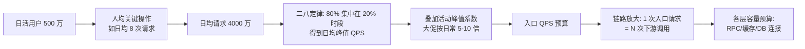
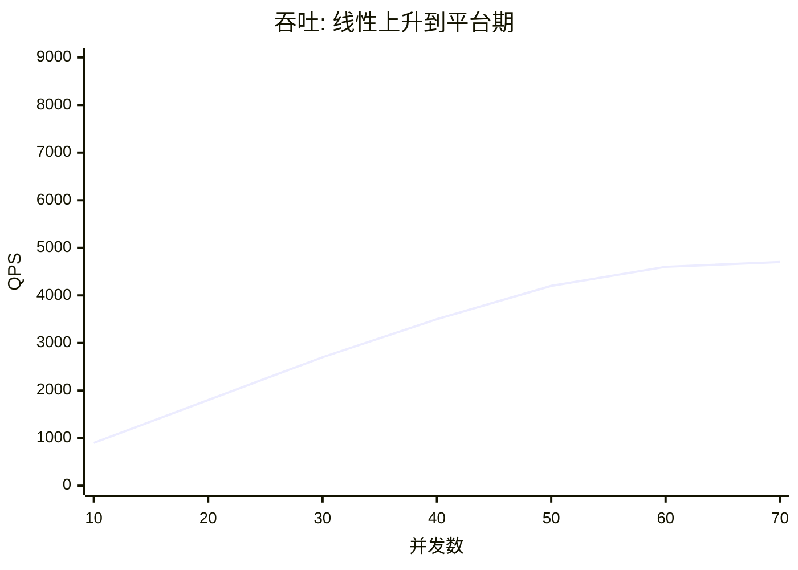
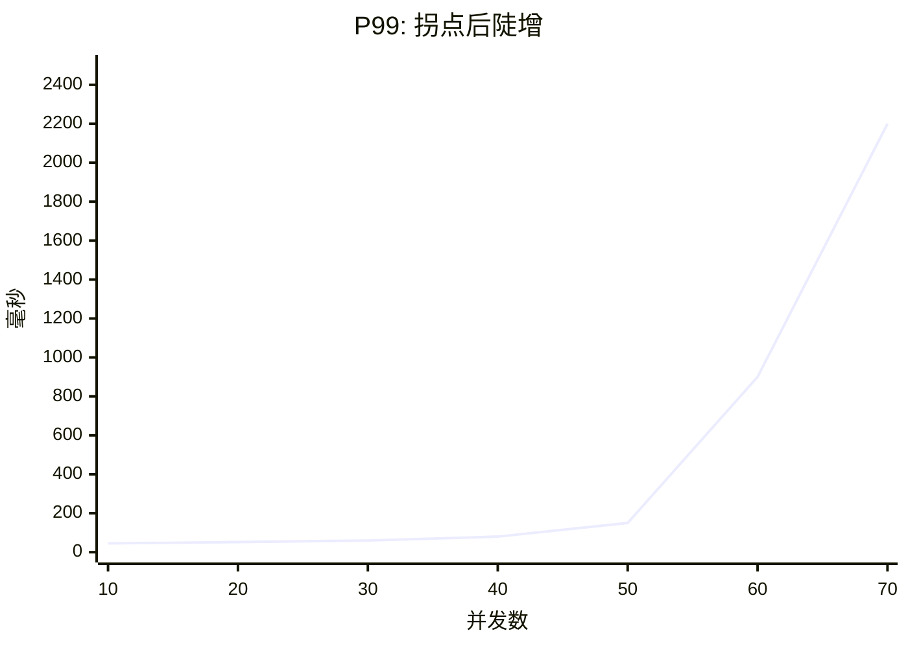

# 容量规划与性能评估

> **一句话摘要**：容量规划把「感觉能扛」变成「数字能扛」——从业务指标推导 QPS、用压测找到系统拐点、按水位线定扩容预案；它是三大目标从设计走向工程的收口动作，也是大促备战和新系统上线的必答题。

前置阅读：[高并发设计](./3_高并发设计-入门.md)、[高扩展设计](./8_高扩展设计-入门.md)。水位线告警与限流的联动在本仓库稳定性工程子域展开。

## 本文核心

> 量级分档意识：本文方法在十万级 QPS、千万级用户、亿级流量的场景下均需重新评估——量级变化时架构与参数需同步调整。

**核心机制一句话**：9_容量规划与性能评估 的核心在于分层思维——先定义边界，再选方案，最后验证效果。

**机制链**：定义 → 分析 → 设计 → 实践 → 验证。

**失效点/边界**：适用于中大规模场景；小规模可简化。
## 1. 背景：没有数字的方案是装饰画

架构评审里最常见也最危险的陈述是「这个方案应该能扛住」——应该，是多少？容量规划回答的就是这个「多少」：预估多少 QPS、需要多少实例、数据库多少连接、缓存多大、水位线红线画在哪。

它同时是成本问题的另一面：容量买多了平时烧钱，买少了峰值出事。容量规划的本质是**在不确定性里做资源决策**——业务量有预测误差、流量有突发、系统有隐性瓶颈，规划的价值不是算得绝对准，而是**让每个资源数字都有推导依据、每个误差都有预案兜底**。

## 2. 核心机制：从业务指标到水位线

### 2.1 流量估算的推导链

推导链上每一步都有可讨论的假设：人均请求数来自埋点或同类业务，二八定律把日均摊成峰值，活动系数来自运营计划，链路放大系数来自调用关系（一次下单 = 库存 1 次 + 订单 1 次 + 优惠 2 次 + …，全链路加总后入口 1 QPS 常放大到下游十几 QPS——这也是为什么下游容量不能只按入口量配）。**估算的产出不是那个最终数字，是这条可以被逐段质疑、逐段修正的链。**

### 2.2 压测：找到系统的真实拐点

估算给出的是「需求侧数字」，压测给出的是「供给侧数字」，两者对账才是容量结论。压测的标准动作：

1. **单接口基准**：逐个核心接口测出吞吐-并发曲线，摸清单点能力。
2. **全链路压测**：模拟真实业务比例（读写比、接口调用分布）对完整链路施压——因为系统容量由「最脆弱的那一环在真实流量分布下的表现」决定，单接口数字加不出来。
3. **找拐点**：并发数持续上升时，吞吐先是线性涨，随后进入平台期、RT 开始陡增——拐点位置就是当前架构的实际容量。**容量规划用「拐点的 70% 左右」做日常红线，而不是用极限值**（留出波动与部分故障的余量）。

拐点的两条曲线长这样（示意数字，看形态不看数值）：

两张图对齐看：吞吐在并发 50 附近进入平台期（再加并发也不涨了），RT 在同一个位置陡增——这个交汇点就是系统的诚实容量。日常水位线（拐点的七成）画在并发 35 上下，给波动、部分故障和扩容反应时间留出余量。

### 2.3 水位线：把容量变成日常运行的仪表

水位线 = 资源使用量与容量的比值阈值，业内常见的经验分档是 60% 预警、75% 扩容、85% 限流（行业惯例值，各系统按自身弹性速度调整）。背后的排队论直觉值得知道：资源利用率逼近 100% 时，排队延迟非线性暴涨——利用率 80% 的系统排队延迟可能是 50% 时的数倍。所以**高水位不仅是「快满了」，更是「正在变慢」**。也正因为如此，三档数字本质上是一组权衡：预警给谁、行动多快、保命线画在哪，每一档都是反应时间与业务损失的折中。

水位线要优先定义在**不可水平扩展的资源**上：数据库连接数、单表行数、单分片写入吞吐、第三方接口配额——这些是真正的硬顶。可水平扩展的资源（应用实例数）靠弹性扩容兜，不需要红线这么紧。

三档水位对应的动作链：

## 3. 落地实践：一次完整的容量评估

以「中型电商订单系统备战大促」为例走一遍（教学推演，数字为示意）：

1. **定目标**：大促峰值按日常 8 倍估，核心下单链路 SLA 99.99%。
2. **估流量**：日常下单峰值 2000 QPS → 大促 16000 QPS 入口。
3. **算放大**：一次下单内部调用库存 1 次、优惠券 2 次、用户 1 次 + DB 写 3 次 → 库存服务预算 16000 QPS、DB 写 48000 次/秒量级——第一直觉检查：单库写不动，必须分片（回指[高扩展设计](./8_高扩展设计-入门.md)）。
4. **压测对账**：全链路压测打到 20000 QPS 出现拐点（库存服务连接池排队）→ 扩容库存服务与连接池预算，复测拐点 ≥ 24000 QPS，留 50% 余量。
5. **定预案**：各层水位线挂监控（60% 预警 / 75% 扩容 / 85% 限流），写清楚「超过红线谁执行什么动作」，每一档的取舍都要落到 owner；对不可能水平扩展的项（如第三方支付接口配额）提前申请提额或备降级方案。
6. **留回看**：大促后用真实流量回填估算模型（人均请求数、峰值系数的真实值），下一轮规划从这里开始——**容量模型是越用越准的资产**。

## 4. 生产视角：容量评估的失真来源

- **「压测通过 ≠ 上线安全」**：压测环境与生产的差异无处不在——数据分布不同（测试库只有均匀数据，生产有倾斜热点）、缓存命中率不同（压测时缓存常全热，生产有冷启动）、调用比例失真（压测脚本漏了长尾接口）。全链路压测的意义就是尽量抹平这些差异，但**压测结论要打折使用，打折幅度靠历史对账校准**。
- **全链路压测的工程门槛**：要在生产或准生产环境安全施压，主流方案是**流量染色**（压测请求带特殊标识，全链路透传）+ **影子存储**（压测数据写影子表/影子库，与真实数据物理隔离）。这套机制的改造成本不低（存储中间件、缓存、MQ 都要识别染料），所以很多团队退而求其次用「低峰期 + 真实数据快照」的简化压测——需要明确它测不出生产级并发下的锁与热点行为。
- **水位线没人执行**：红线画在监控里，超过红线没人做动作——水位线就只是装饰。每一档水位线必须绑定「谁、做什么」（自动扩容 or 人工预案），并在演练中真实触发过。
- **只在备战大促时做容量**：容量是漂移的——数据在涨、代码在变（新接口引入新的放大系数）、依赖在换。低频的容量评审留不住数字，把水位线监控日常化、估算模型随版本更新，才是可持续的机制。容量管理也正在业内经历从「大促前突击」到「常态化运营」的演进，回填与重评就是这个演进的核心动作。

## 5. 主流方案怎么做：机制级工具链

| 环节 | 主流机制 | 机制要点 |
|---|---|---|
| 压测施压 | 开源压测框架（JMeter / wrk2 一类） | 机制差异在施压模型：按并发数施压 vs 按固定速率施压（后者更能模拟真实到达模式，避免「协调遗漏」掩盖长尾） |
| 全链路压测 | 流量染色 + 影子表/影子库 | 标识全链路透传、存储物理隔离，生产环境安全施压的通行方案 |
| 弹性容量 | K8s HPA / 定时伸缩 / 云 APM 联动 | 已知峰谷用定时伸缩（大促日程可预期），未知波动用指标驱动伸缩 |
| 水位监控 | Prometheus 一类指标体系 | 资源使用量/容量 的比值作为核心指标，绑定分档告警与预案动作 |

规律：**容量工具链成熟度高的团队，差异不在工具，在「数字的纪律」**——估算有模型、压测有对账、水位有 owner、大促后有回看。

## 6. 典型场景

- **大促备战**（峰值驱动）：提前 1-2 个月走完整推导链 + 全链路压测 + 扩容预案演练，产出物是「容量评审表 + 红线清单 + 应急预案」。
- **新系统上线**（基准确立）：上线前单接口基准压测建立性能基线，作为后续每次版本发布的回归对照——性能退化的第一道雷达。
- **成本优化**（反方向容量）：用水位数据找出长期低于 20% 的服务与实例，缩容或合并——容量规划不只算「够不够」，也算「是不是买多了」。这是容量方法论近年最重要的一次演进外延。

## 7. 与相邻概念的区别

- **容量规划 vs 性能优化**：容量规划回答「需要多少资源」（资源视角），性能优化回答「怎么用同样资源跑更快」（效率视角）。先优化明显的不合理损耗（慢 SQL、无谓放大），再按优化后的单机能力做容量，顺序不要反。
- **压测 vs 冒烟测试**：冒烟验证「功能通不通」，压测度量「能力有多大」。压测的核心产出是吞吐-RT 曲线和拐点，不是 pass/fail。
- **QPS vs 并发数 vs 线程数**：QPS 是到达速率，并发数是同时在处理的数量（= QPS × RT，Little's Law），线程数是处理资源的配置。压测报告里三者别混：施压参数是并发，观测指标是 QPS 与 RT。

## 8. 常见误区与不适用

- **「用日均 QPS 做规划」**：系统死在峰值不死在均值。用峰值（含活动系数）规划，用均值算成本。
- **「压测环境数据随便造」**：均匀数据的压测测不出热点倾斜、测不出索引选择性下降。数据分布尽量贴近生产画像。
- **「拐点数字直接当红线」**：拐点是极限值，生产要留余量应对波动与部分故障——按拐点的七成上下定红线是常见惯例。
- **「容量规划一次定终身」**：流量、代码、依赖都在漂移，容量结论有时效。绑定水位监控与定期重评，数字才有保鲜期。
- **「全链路压测一定要上」**：它的改造成本以人月计。流量小、链路短的系统，单接口基准 + 保守系数就够了——机制的投入要配得上业务的量级。

## 9. 你们可能会问

- **没有历史数据怎么估 QPS？** 借同类业务的人均指标 + 运营的传播计划定活动系数；上线后第一周用真实数据校准模型。第一次估算允许粗，但必须留「回填修正」这个动作。
- **全链路压测为什么难？** 难在三件事：染料透传要改所有中间件调用、影子存储要物理隔离、施压量级本身可能影响生产。它是一项工程能力，不是一次测试。
- **水位线为什么常是 60/75/85？** 行业经验值的成分居多——本质是按「预警 → 行动 → 保命」三档留反应时间。弹性扩容快的系统可以放宽，扩容慢的分片存储要收紧。
- **容量评审的产出物是什么？** 三件套：估算表（每个数字可溯源）、瓶颈层结论（压测对账）、扩容/限流预案（绑定水位线的执行动作）。只有结论没有推导过程的评审表过不了质询。
- **容量模型多久重算一次？** 大促级活动前必算；平时随水位监控漂移——连续一周运行在预测区间外就该触发重评。

## 10. 一句话总结 + 5W 速记卡 + 自测三问

**一句话总结**：容量规划把设计收口成数字——推导链定需求、压测拐点定供给、水位线定日常红线；数字必须可溯源、可对账、有 owner，否则等于没有规划。

**5W 速记卡**：

| 维度 | 内容 |
|---|---|
| What | 流量推导链、压测拐点、水位线与扩容预案 |
| Why | 没有数字支撑的架构方案无法验证也无法兜底 |
| When | 新系统上线、大促备战、架构演进、成本优化 |
| Where | 不可水平扩展的资源（DB 连接/单表行数/分片吞吐）优先 |
| How | 业务指标 → QPS → 链路放大 → 压测对账 → 水位线 + 预案 |

**自测三问**：

1. 你系统的大促峰值 QPS 是多少？这个数字的推导链能完整讲出来吗？
2. 你系统数据库的连接数上限是多少？当前水位多少？超过 75% 谁做什么？
3. 最近一次压测的拐点数字，和三年前（或上一版架构）比变了多少？

---

**下篇预告**：所有维度都铺完了——下一篇[系统设计方法论总结](./10_系统设计方法论总结-入门.md)用六步法把全系列收束成一套从需求到方案的可复用流程。

---

## 📌 数据与事实声明

本文的估算示例数字（日活 500 万、2000 QPS 等）均为教学示意，不代表任何真实系统；60/75/85 水位分档为业内经验惯例值，各系统应按自身弹性速度与业务代价调整；「协调遗漏」（coordinated omission）为公开的压测方法论概念；对标工具（JMeter、wrk2、Prometheus、HPA）仅作机制级定位。

## 核心带走

**30 秒复述**：本文核心要点已覆盖——分层思维、量级意识、边界纪律。**失效边界**：量级变化时需重新评估。
## 📚 参考资料

| 类型 | 标题 | 来源 |
|---|---|---|
| 图书 | Site Reliability Engineering（Google SRE 书·容量规划章节） | sre.google（在线开源） |
| 图书 | 大型网站技术架构：核心原理与案例分析 | 电子工业出版社（2013） |
| 文章 | Coordinated Omission 相关压测方法论讨论 | 公开技术社区（Gil Tene 原始讨论及衍生） |
| 系列文章 | 稳定性工程（水位线与限流联动） | 本仓库 docs/architecture/service-governance/stability/ |
