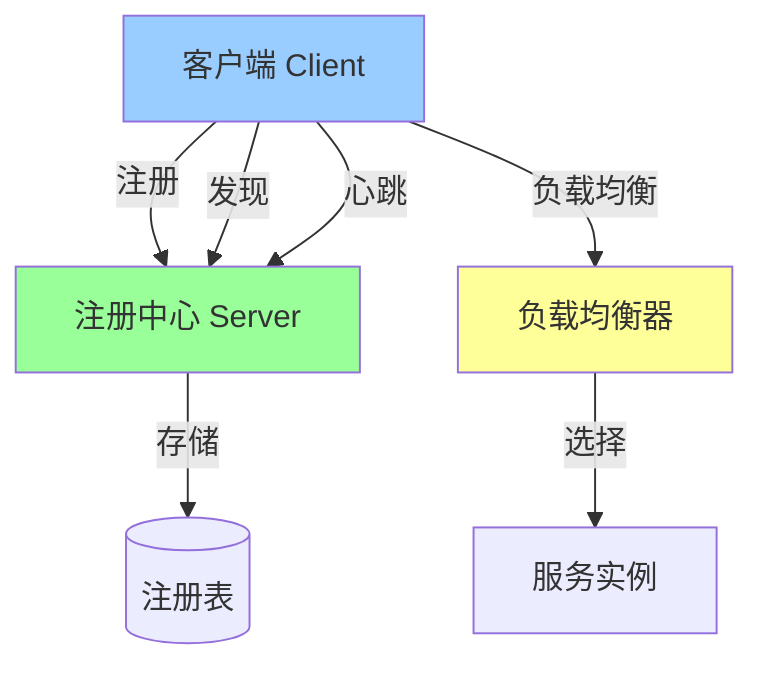

# 从零实现服务发现系统

> **一句话摘要**：用代码实现一个最小化服务发现系统——注册 + 发现 + 健康检查 + 负载均衡。
> **本文核心**：**实现 = 注册中心 + 客户端 + 心跳 + 负载均衡**。

前置阅读：[服务发现架构实战](./专题层/服务发现架构实战/1_服务发现架构实战-专题.md)。本篇将理论转化为可运行代码。

## 1. 背景：为什么要实现

看懂服务发现不等于会用——实现过程才能理解：

- 注册中心的本质
- 心跳机制的实现
- 负载均衡的策略

通过实现，掌握服务发现的工程实践。

## 2. 核心机制：架构设计

### 2.1 三组件架构



**三组件职责**：
- **Server**：存储服务实例列表，响应注册/发现/心跳
- **Client**：注册、发现、心跳
- **LB**：选择具体实例（轮询/随机/最少活跃）

### 2.2 数据结构

```java
// 服务实例
class ServiceInstance {
    String serviceName;      // 服务名
    String host;             // IP
    int port;                // 端口
    long lastHeartbeat;      // 最后心跳时间
    Status status;           // 状态: UP/DOWN
    Map<String, String> metadata; // 元数据
}

// 注册中心
class Registry {
    Map<String, List<ServiceInstance>> services = new ConcurrentHashMap<>();
    
    void register(String name, ServiceInstance instance) { ... }
    void deregister(String name, ServiceInstance instance) { ... }
    List<ServiceInstance> discover(String name) { ... }
    void heartbeat(String name, String instanceId) { ... }
}
```

## 3. 落地实践：注册中心实现

### 3.1 核心服务

```java
// 注册中心 Server
public class DiscoveryServer {
    private Registry registry = new Registry();
    private ExecutorService executor = Executors.newFixedThreadPool(10);
    
    // 注册接口
    public void register(ServiceInstance instance) {
        registry.register(instance.getServiceName(), instance);
    }
    
    // 发现接口
    public List<ServiceInstance> discover(String serviceName) {
        return registry.discover(serviceName);
    }
    
    // 心跳接口
    public void heartbeat(String serviceName, String instanceId) {
        registry.heartbeat(serviceName, instanceId);
    }
    
    // 健康检查
    public void healthCheck() {
        for (List<ServiceInstance> instances : registry.getAll()) {
            for (ServiceInstance instance : instances) {
                if (isExpired(instance)) {
                    instance.setStatus(Status.DOWN);
                }
            }
        }
    }
}
```

### 3.2 心跳机制

```java
// 心跳检测
public class HeartbeatChecker {
    private static final long EXPIRE_TIME = 30000; // 30秒
    
    public void check(Registry registry) {
        for (List<ServiceInstance> instances : registry.getAll()) {
            for (ServiceInstance instance : instances) {
                long now = System.currentTimeMillis();
                if (now - instance.getLastHeartbeat() > EXPIRE_TIME) {
                    instance.setStatus(Status.DOWN); // 标记为不可用
                }
            }
        }
    }
}
```

## 4. 落地实践：客户端实现

### 4.1 客户端注册与发现

```java
// 服务发现客户端
public class DiscoveryClient {
    private DiscoveryServer server;
    private String serviceName;
    private ServiceInstance localInstance;
    private Map<String, List<ServiceInstance>> cache = new ConcurrentHashMap<>();
    
    // 启动：注册 + 心跳
    public void start() {
        server.register(localInstance);
        scheduleHeartbeat();
        scheduleCacheRefresh();
    }
    
    // 发现服务
    public List<ServiceInstance> discover(String targetService) {
        List<ServiceInstance> instances = cache.get(targetService);
        if (instances == null) {
            instances = server.discover(targetService);
            cache.put(targetService, instances);
        }
        return instances;
    }
    
    // 心跳
    private void scheduleHeartbeat() {
        ScheduledExecutorService scheduler = Executors.newScheduledThreadPool(1);
        scheduler.scheduleAtFixedRate(() -> {
            server.heartbeat(serviceName, localInstance.getInstanceId());
        }, 0, 10, TimeUnit.SECONDS);
    }
    
    // 缓存刷新
    private void scheduleCacheRefresh() {
        ScheduledExecutorService scheduler = Executors.newScheduledThreadPool(1);
        scheduler.scheduleAtFixedRate(() -> {
            cache.clear(); // 强制刷新
        }, 0, 30, TimeUnit.SECONDS);
    }
}
```

### 4.2 负载均衡

```java
// 负载均衡器
public class LoadBalancer {
    // 轮询策略
    public ServiceInstance roundRobin(String serviceName) {
        List<ServiceInstance> instances = client.discover(serviceName);
        return instances.get((int) (System.currentTimeMillis() / 1000) % instances.size());
    }
    
    // 随机策略
    public ServiceInstance random(String serviceName) {
        List<ServiceInstance> instances = client.discover(serviceName);
        return instances.get(new Random().nextInt(instances.size()));
    }
    
    // 最少活跃策略
    public ServiceInstance leastActive(String serviceName) {
        List<ServiceInstance> instances = client.discover(serviceName);
        return Collections.min(instances, Comparator.comparingInt(ServiceInstance::getActiveCount));
    }
}
```

## 5. 落地实践：完整调用流程

```mermaid
sequenceDiagram
    Client[客户端] -->|注册| Server[注册中心]
    Server -->|存储| Registry[(注册表)]
    
    loop 心跳(每10秒)
        Client -->|心跳| Server
    end
    
    Client -->|发现| Server
    Server -->|返回实例列表| Client
    Client -->|负载均衡| LB[负载均衡器]
    LB -->|选择实例| Instance[服务实例]
    
    Client -->|调用| Instance
    Instance -->|响应| Client
```

## 6. 生产视角：实现踩坑

- **踩坑 1**：注册中心单点——需要集群
- **踩坑 2**：心跳频率过高——网络压力大
- **踩坑 3**：客户端缓存不一致——需要合适的刷新策略
- **踩坑 4**：负载均衡策略选择不当——需要适配场景

**生产最佳实践**：

1. 注册中心集群部署（3/5 节点）
2. 心跳间隔 10-15 秒
3. 客户端缓存 + 定时刷新
4. 多种负载均衡策略并存
5. 监控注册中心状态

## 7. 典型场景

| 场景 | 实现要点 |
|---|---|
| 小规模系统 | 单注册中心 + 客户端缓存 |
| 中规模系统 | 集群注册中心 + 多种 LB 策略 |
| 大规模系统 | 多注册中心 + 客户端本地缓存 |
| 大促场景 | 客户端缓存降级 + 注册中心扩容 |

## 8. 你们可能会问

- **实现需要多久？** 核心功能 1-2 天
- **和 Nacos 有什么区别？** Nacos 是成熟产品，实现是学习
- **需要自己实现吗？** 学习用实现；生产用 Nacos/Etcd
- **性能如何？** 取决于网络和实例数量

## 9. 一句话总结 + 5W 速记卡 + 自测三问

**一句话总结**：实现 = 注册中心 + 客户端 + 心跳 + 负载均衡。

**5W 速记卡**：

| 维度 | 内容 |
|---|---|
| What | 最小化服务发现系统 |
| Why | 理解服务发现本质 |
| When | 实现阶段 |
| Where | 所有分布式系统 |
| How | 注册 + 心跳 + 发现 + LB |

**自测三问**：

1. 你的注册中心怎么处理心跳超时？
2. 你的客户端有缓存吗？缓存多久刷新？
3. 你的负载均衡策略是什么？

---

**整合层完结**：从零实现服务发现系统的完整实践已建立。

**🎯 核心带走**：

- **核心一句话**：服务发现实现 = 注册中心 + 心跳 + 客户端缓存 + 负载均衡
- **链条复述**：注册 → 心跳 → 发现 → 负载均衡 → 调用
- **失效点与边界**：注册中心单点；心跳超时

💡 **实战提示**：学习用实现理解原理；生产用 Nacos/Etcd——不要重复造轮子。

**开放问题**：服务发现能无中心化吗？答案是：能——基于 DNS/P2P，但牺牲了动态性和一致性。

**决策（何时用）**：学习实现理解原理；生产用成熟方案。
