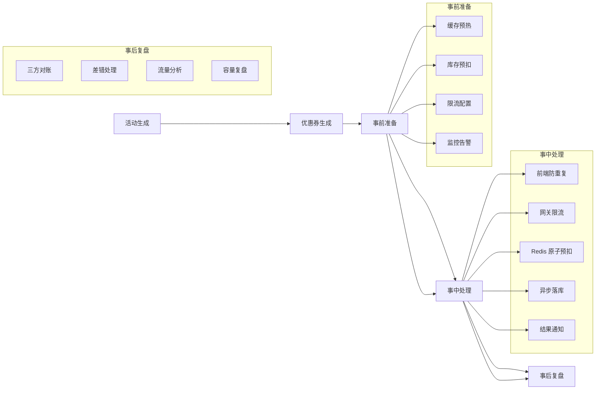
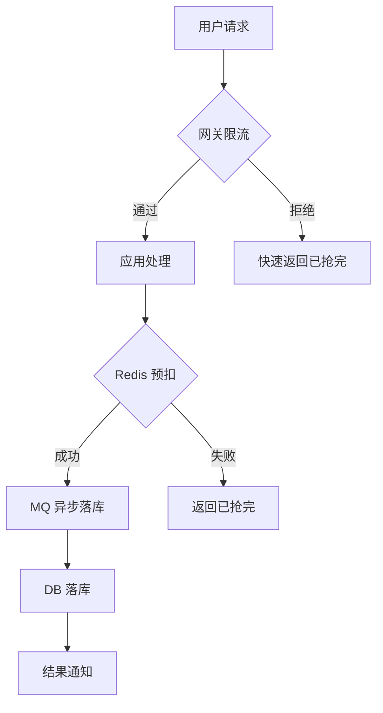
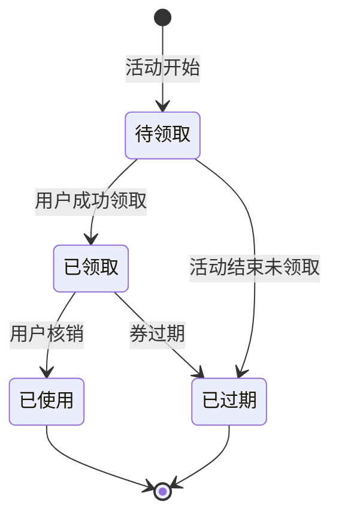
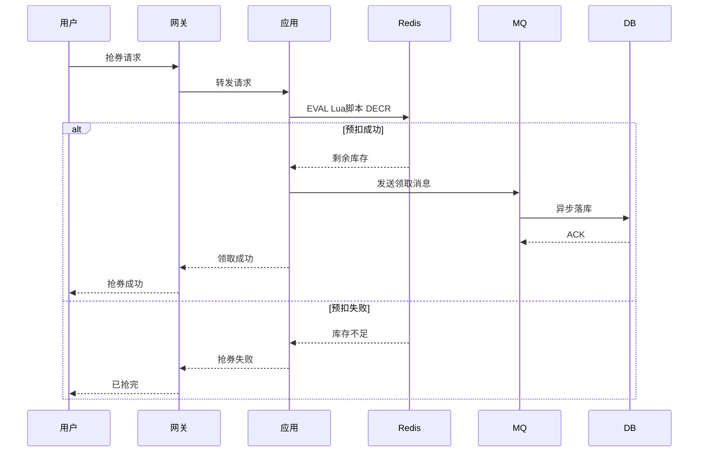
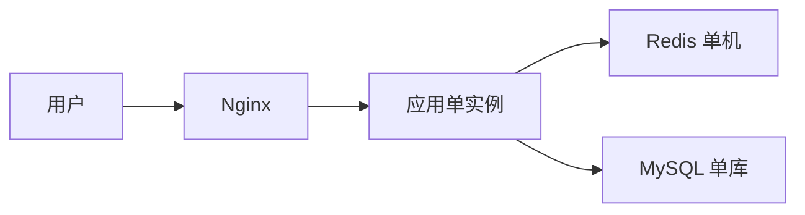
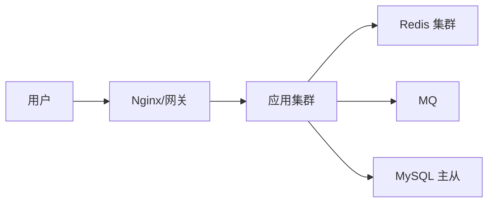
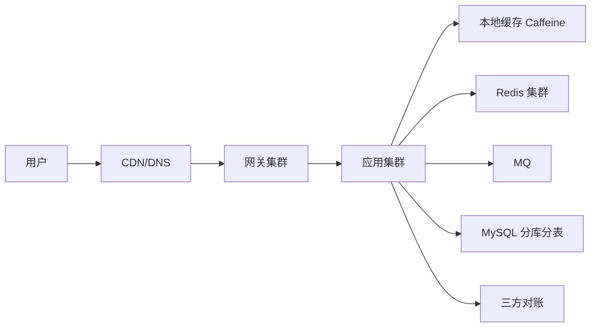
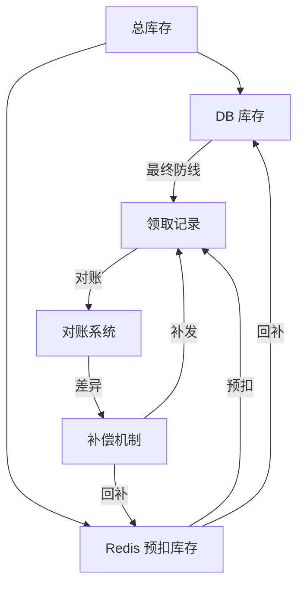

# 从零设计秒杀系统：端到端架构与量级分档

> 一张图讲透秒杀全链路：活动生成 → 优惠券生成 → 事前准备 → 事中处理 → 事后复盘。三个量级档位（小型/中型/大型），每个档位的部署架构、核心配置、trade-off 全列出来。**本文不讲机制原理，机制引用已有文章；只讲在这个场景下怎么选、怎么配、怎么验证。**

## 一句话摘要

秒杀 = 有限资源 + 瞬时脉冲 + 防超卖。核心矛盾不是技术，而是「量级决定架构」——同一套需求，万级和百万级用的是两套系统。

## 本文核心

**核心机制一句话**：秒杀系统的设计从三个量级出发——券库存、参与用户、峰值 QPS 三者共同决定技术选型；选型没有最优，只有 Trade-off。

**机制链**：业务量级 → 架构选型 → 部署方案 → 配置参数 → 验证闭环。

**失效点/边界**：本文的量级分档是通用认知，精确选型必须以压测数据为准。

**跨周期经验**：秒杀系统的量级分档不是静态的——随着业务增长，同一个活动可能从小型演进到大型。架构设计必须预留演进路径，而非一次性重做。

## 二、量级分档（按业务规模）

| 档位 | 券库存 | 参与用户 | 抢券窗口 | 峰值 QPS | 典型场景 |
|---|---|---|---|---|---|
| 小型 | 几千~1 万 | 1 万~10 万 | 秒级 | 1 万 | 内部福利券、会员活动 |
| 中型 | 10 万~100 万 | 100 万~1000 万 | 10~30 秒 | 10 万 | 电商大促、品牌券 |
| 大型 | 千万级 | 千万级 | 分钟级 | 100 万+ | 平台爆点、头排券 |

三个维度共同决定架构——券库存少但用户量大时，瓶颈在网关限流；库存大但用户量小时，瓶颈在 DB 写入。

**追问链 ①**：为什么「券库存少但用户量大」时瓶颈在网关而非 DB？因为网关是请求入口，所有请求必须经过网关；DB 只是最终存储，请求在网关层就被限流拦截，不会全部落到 DB。如果网关没有用户维度限流，10 万用户同时抢 1 万张券，网关会被打垮，DB 甚至还没来得及收到请求。

**追问链 ②**：为什么「库存大但用户量小」时瓶颈在 DB 写入？因为库存大意味着预扣成功率低（大部分请求发现库存不足），但每次请求仍然要落 DB 验证。如果 DB 写入能力不足，请求会排队，RT 飙升，用户体验差。解决方案：DB 写入前先走 Redis 预扣，只有预扣成功的请求才落 DB。

## 三、端到端全链路



### 3.1 活动生成

活动配置：券类型（满减/折扣/直减）、库存、抢券时间窗口、每人限领数、适用商品范围。

**量级差异**：
- 小型：运营后台手动配置，静态生效
- 中型：活动配置表 + 灰度发布（按用户群放量）
- 大型：活动配置平台化 + 自动灰度 + 一键暂停

**反方案分析**：为什么不直接改 DB 库存来秒杀？因为 DB 写入是单点瓶颈，高并发下 DB CPU 100%，请求超时，雪崩效应。更优方案是 Redis 预扣 + 异步落库，把写 DB 的压力从每请求一次降到预扣成功一次。

### 3.2 优惠券生成

券实例化：活动开始后，按库存批量生成券记录，状态为待领取。

**量级差异**：
- 小型：活动创建时同步生成，DB 事务写入
- 中型：MQ 异步生成 + 预加载 Redis
- 大型：分批生成 + 预热到多级缓存 + 生成进度监控

**反方案分析**：为什么不分批生成而要一次性生成？分批生成会增加复杂度（需要记录生成进度、处理失败重试）。但大型场景下一次性生成可能占满 DB 连接池（1000 万条记录插入），所以大型场景必须在分批生成和预热之间做权衡——先生成 10% 预热，剩余后台分批生成。

### 3.3 事前准备

| 准备项 | 小型 | 中型 | 大型 |
|---|---|---|---|
| 缓存预热 | 券库存预热到 Redis | 券库存 + 用户限流阈值预热 | 多级缓存预热 + 本地缓存 |
| 限流配置 | 网关简单限流 | 用户维度假限流 + 全局限流 | 多层限流 + 自适应限流 |
| 监控告警 | 基础 QPS 监控 | QPS + 库存 + 错误率 | 全链路监控 + 自动熔断 |
| 压测 | 不需要 | 必压（峰值 QPS） | 必压 + 混沌演练 |

**追问链 ③**：为什么全链路压测 + 混沌演练只在大型才需要？因为小型和中型的故障影响面有限，人工介入可以兜底；大型场景下任何一个组件的故障都可能级联放大（网关 → 应用 → Redis → DB → MQ），需要提前演练故障恢复流程，确保每个环节都有自动熔断和降级预案。

### 3.4 事中处理

核心链路：请求入口 → 限流 → 校验 → 预扣 → 落库 → 通知。

#### 3.4.1 前端设计

| 设计点 | 方案 | Trade-off |
|---|---|---|
| 防重复点击 | 按钮置灰 + loading | 体验好，但脚本可绕过 |
| 幂等键 | 用户 ID + 活动 ID | 需要后端配合校验 |
| 请求节奏 | 前端节流（1 秒 1 次） | 降低网关压力，但可能漏抢 |

前端只做体验层防护，真正的防重在后端。

**追问链 ④**：为什么前端节流不能完全防止重复点击？因为前端代码可以被绕过（浏览器控制台直接调用 API、Postman 模拟请求）。前端节流只是善意防护，真正的防重必须在后端做幂等校验——相同 claim_no 的请求只处理一次。

#### 3.4.2 流量设计

| 层级 | 小型 | 中型 | 大型 |
|---|---|---|---|
| 网关限流 | 全局 QPS 限制 | 用户维度限流 + 全局 | 用户 + 设备 + IP 三维 |
| 应用限流 | 不需要 | 令牌桶 | 自适应限流 + 热点隔离 |
| 异步解耦 | 不需要 | MQ 异步落库 | 全链路异步 + 削峰 |



#### 3.4.3 事中处理方案

**小型（单机方案）**：
1. Redis DECR 预扣库存（原子操作）
2. 预扣成功 → DB 唯一索引落库（activity_id + user_id 唯一）
3. 预扣失败 → 快速返回已抢完

Trade-off：简单可靠，但无扩展性——单点故障直接宕机。

**中型（集群方案）**：
1. Redis Lua 脚本原子执行（预扣 + SETNX 标记）
2. MQ 异步落库（本地消息表保证可靠性）
3. 网关限流（用户维度 10 QPS）
4. 熔断：库存为 0 时直接拒绝，不入 DB

Trade-off：可扩展、有冗余；但 MQ 失败时本地消息表可能堆积，需要定时补偿。

**大型（单元化方案）**：
1. 多级缓存：本地缓存 → Redis 集群 → DB
2. 单元化部署：按用户 ID 分片，不同单元独立处理
3. 异步全链路：MQ 削峰 + 消费端限流
4. 对账：活动结束后三方核对（发放量 = 库存扣减 = 券记录）

Trade-off：容量大、可扩展；但单元化改造难度高，需要重构分库分表逻辑。

### 3.5.1 秒杀状态机



### 3.5.2 库存预扣时序



### 3.5 事后复盘

| 复盘项 | 内容 | 量级差异 |
|---|---|---|
| 三方对账 | 发放量 = 库存扣减 = 券记录 | 小型手动，大型自动 |
| 差错处理 | 单边账补记/冲正 | 小型人工，大型自动+人工 |
| 流量分析 | 峰值 QPS、成功率、RT | 必做 |
| 容量复盘 | 压测 vs 实际对比 | 中型以上必做 |

**追问链 ⑤**：为什么对账是秒杀系统必不可少的环节？因为异步落库必然存在窗口期——Redis 预扣成功但 DB 落库失败时，库存已经扣减但用户没有收到券。如果不对账，这部分丢失的券永远无法被发现和补偿。对账的三个维度（Redis 扣减数 = DB 领取记录 = 券实例表）缺一不可，任何一个维度不一致都意味着系统存在资损风险。

## 四、部署架构（按量级）

### 4.1 小型部署



**部署详情**：

| 组件 | 规格 | 数量 | 说明 |
|---|---|---|---|
| Nginx | 1C 1G | 1 | 反向代理 + 静态资源 |
| 应用 | 2C 4G | 1 | 单实例，Spring Boot |
| Redis | 2G | 1 | 单机，无持久化 |
| MySQL | 4C 8G | 1 | 单库单表，无主从 |
| MQ | - | 0 | 不需要 |

Trade-off：
- 优点：成本低、部署简单、运维无压力
- 缺点：单点故障、无扩展性、无冗余
- 适用：内部活动、库存 < 1 万

### 4.2 中型部署



**部署详情**：

| 组件 | 规格 | 数量 | 说明 |
|---|---|---|---|
| Nginx/网关 | 2C 4G | 2 | 反向代理 + 限流 |
| 应用 | 4C 8G | 3 | 集群，无状态 |
| Redis | 4G | 3 主 3 从 | 集群，预扣库存 |
| MQ | - | 3 | RocketMQ 集群 |
| MySQL | 4C 8G | 1 主 2 从 | 读写分离 |
| 监控 | - | 1 | Prometheus + Grafana |

Trade-off：
- 优点：可扩展、有冗余、可灰度
- 缺点：运维复杂度上升、成本增加
- 适用：电商大促、库存 10 万~100 万

### 4.3 大型部署



**部署详情**：

| 组件 | 规格 | 数量 | 说明 |
|---|---|---|---|
| CDN/DNS | - | 多节点 | 静态资源 + 流量分发 |
| 网关 | 4C 8G | 5+ | 集群，三维限流 |
| 应用 | 8C 16G | 10+ | 单元化部署，多机房 |
| 本地缓存 | - | 应用内 | Caffeine/LRU |
| Redis | 8G | 多集群 | L1 本地 + L2 Redis |
| MQ | - | 5+ | Kafka + RocketMQ 混合 |
| MySQL | 8C 16G | 分库分表 | 按 user_id 分片 |
| 对账 | - | 独立平台 | 三方对账 |
| 监控 | - | 集群 | 全链路监控 + 自动熔断 |

Trade-off：
- 优点：容量大、可扩展、高可用
- 缺点：成本极高、运维复杂度极高、部署周期长
- 适用：平台爆点、千万级用户、亿级流量

## 五、核心配置项

### 5.1 通用配置

| 配置项 | 小型 | 中型 | 大型 | 说明 |
|---|---|---|---|---|
| Redis 连接池 | 50 | 200 | 500 | 根据实例数调整 |
| MQ 消费者数 | 1 | 5 | 20 | 并行度上限 = 分区数 |
| DB 连接池 | 20 | 50 | 100 | 根据实例数调整 |
| 限流阈值 | 1000 QPS | 10000 QPS | 100000 QPS | 按峰值 * 1.5 预留 |
| 缓存 TTL | 30 分钟 | 1 小时 | 2 小时 | 根据活动窗口定 |
| 熔断阈值 | 不需要 | 错误率 50% | 错误率 30% | 根据业务容忍度 |

### 5.2 关键配置

```yaml
# 秒杀活动配置模板
seckill:
  activity:
    id: <活动 ID>
    coupon_type: <券类型>
    stock: <库存数量>
    window_seconds: <抢券窗口>
    limit_per_user: <每人限领>

  redis:
    pre_deduct: true        # 启用 Redis 预扣
    lua_script: true        # 原子脚本
    expire_seconds: 3600    # 预扣标记过期时间

  mq:
    enabled: true           # 中大型启用
    topic: seckill_order
    consumer_group: seckill_group

  rate_limit:
    enabled: true
    per_user_qps: 10        # 单用户限流
    global_qps: 10000       # 全局限流

  db:
    unique_index: true      # 唯一索引防重
    shard_key: user_id      # 分库分表键
```

## 六、Trade-off 汇总

| 决策点 | 选 A | 选 B | Trade-off |
|---|---|---|---|
| 缓存策略 | 本地缓存（L1） | Redis（L2） | L1 快但一致性差；L2 慢但一致 |
| 库存预扣 | Redis DECR | DB 乐观锁 | Redis 性能高但可能超扣；DB 安全但性能差 |
| 落库方式 | 同步落库 | MQ 异步 | 同步强一致但 RT 高；异步低 RT 但可能丢 |
| 限流策略 | 固定阈值 | 自适应 | 固定简单但可能误杀；自适应精准但复杂 |
| 部署方式 | 单体 | 单元化 | 单体简单但扩展差；单元化扩展好但成本高 |
| 对账方式 | 人工 | 自动 | 人工便宜但慢；自动快但建设成本高 |

**追问链 ⑥**：为什么同步落库 vs MQ 异步是秒杀系统最关键的 Trade-off？因为同步落库强一致但 RT 高（用户要等 DB 写入完成才能返回），MQ 异步低 RT 但可能丢消息（MQ 故障时预扣了库存但没有落库）。这个选择的本质是一致性 vs 性能的权衡——没有最优解，只有根据量级做选择。小型场景选同步（数据量小、一致性要求高）；中大型选异步（性能要求高、一致性通过对账兜底）。

## 七、库存与优惠券数据模型

### 7.1 优惠券表（seckill_activity）

| 字段 | 类型 | 说明 | 量级差异 |
|---|---|---|---|
| id | BIGINT | 主键 | 通用 |
| activity_name | VARCHAR(128) | 活动名称 | 通用 |
| coupon_type | TINYINT | 券类型（满减/折扣/直减） | 通用 |
| stock_total | INT | 总库存 | 小型:单字段; 中型:分片字段; 大型:分库分表 |
| stock_remain | INT | 剩余库存 | Redis 缓存此字段 |
| start_time | DATETIME | 开始时间 | 通用 |
| end_time | DATETIME | 结束时间 | 通用 |
| limit_per_user | INT | 每人限领数 | 通用 |
| status | TINYINT | 状态（0-待开始 1-进行中 2-已结束） | 通用 |
| gray_percent | TINYINT | 灰度百分比 | 中大型 |
| creator | VARCHAR(64) | 创建人 | 通用 |
| created_at | DATETIME | 创建时间 | 通用 |
| updated_at | DATETIME | 更新时间 | 通用 |

**唯一索引**：无（活动配置是单条记录）

**Trade-off**：
- 小型：直接 DB 读写，不需要缓存
- 中大型：活动配置预热到 Redis，启动后只读 DB

### 7.2 券实例表（seckill_coupon）

| 字段 | 类型 | 说明 | 量级差异 |
|---|---|---|---|
| id | BIGINT | 主键（雪花 ID） | 通用 |
| activity_id | BIGINT | 活动 ID | 通用 |
| user_id | BIGINT | 领取用户 ID | 分库分表键（大型） |
| coupon_no | VARCHAR(32) | 券编号（唯一） | 通用 |
| coupon_type | TINYINT | 券类型 | 通用 |
| status | TINYINT | 状态（0-待领取 1-已领取 2-已使用 3-已过期） | 通用 |
| claimed_at | DATETIME | 领取时间 | 通用 |
| used_at | DATETIME | 使用时间 | 通用 |
| expire_time | DATETIME | 过期时间 | 通用 |
| created_at | DATETIME | 创建时间 | 通用 |

**唯一索引**：(activity_id, coupon_no) —— 防止重复生成
**普通索引**：(user_id, status) —— 用户查询自己的券

### 7.3 领取记录表（seckill_claim）

| 字段 | 类型 | 说明 | 量级差异 |
|---|---|---|---|
| id | BIGINT | 主键 | 通用 |
| activity_id | BIGINT | 活动 ID | 通用 |
| user_id | BIGINT | 用户 ID | 分库分表键（大型） |
| coupon_id | BIGINT | 券实例 ID | 通用 |
| claim_no | VARCHAR(32) | 领取编号（幂等键） | 通用 |
| status | TINYINT | 状态（0-待处理 1-成功 2-失败） | 通用 |
| claim_time | DATETIME | 领取时间 | 通用 |
| source | TINYINT | 来源（1-前端 2-后台 3-同步） | 通用 |
| created_at | DATETIME | 创建时间 | 通用 |

**唯一索引**：(activity_id, user_id) —— **核心约束：一人一券**
**幂等键**：claim_no —— 防止重复领取

### 7.4 订单表（seckill_order）

| 字段 | 类型 | 说明 | 量级差异 |
|---|---|---|---|
| id | BIGINT | 主键 | 通用 |
| order_no | VARCHAR(32) | 订单编号（唯一） | 通用 |
| activity_id | BIGINT | 活动 ID | 通用 |
| user_id | BIGINT | 用户 ID | 分库分表键（大型） |
| coupon_id | BIGINT | 券实例 ID | 通用 |
| order_amount | DECIMAL(10,2) | 订单金额 | 通用 |
| pay_amount | DECIMAL(10,2) | 实付金额 | 通用 |
| pay_status | TINYINT | 支付状态（0-未支付 1-已支付 2-已取消） | 通用 |
| pay_time | DATETIME | 支付时间 | 通用 |
| expire_time | DATETIME | 订单超时时间 | 通用 |
| created_at | DATETIME | 创建时间 | 通用 |

**唯一索引**：order_no —— 订单编号唯一
**普通索引**：(user_id, pay_status) —— 用户查询未支付订单

### 7.5 库存模型



**库存流转**：
1. Redis DECR stock_remain → 预扣
2. 预扣成功 → MQ 异步落库
3. 落库失败 → Redis 回补库存（防超扣）
4. 活动结束 → 对账（三方：Redis 扣减数 = DB 领取记录 = 券实例表）

**追问链 ⑧**：为什么库存模型需要「Redis 预扣 + DB 异步落库」的双写模式？因为纯 DB 写入在高并发下会成为瓶颈（每秒最多几千次写入），而纯 Redis 预扣在 Redis 故障时会丢失预扣记录。双写模式用 Redis 处理高并发预扣，用 DB 作为最终防线，两者互补——Redis 负责性能，DB 负责一致性。

**反方案分析**：为什么不直接用 DB 乐观锁代替 Redis 预扣？因为乐观锁需要每次读取库存 → 计算 → 更新 → 重试，高并发下重试次数会指数增长，DB 压力反而更大。Redis DECR 是原子操作，单次操作即可完成预扣，不需要重试。Trade-off：Redis 预扣性能高但可能超扣（Redis 故障时），DB 乐观锁安全但性能差——小型场景用 DB 乐观锁（数据量小，性能可接受），中大型用 Redis 预扣（性能优先，一致性通过对账兜底）。

### 7.6 库存一致性校验

| 校验项 | 校验时机 | 校验方式 | 量级差异 |
|---|---|---|---|
| Redis vs DB | 实时 | DECR 前后对比 | 小型：手动；中型：自动；大型：三方对账 |
| 领取记录 vs 券实例 | 定时（5min） | SQL 核对 | 小型：手动；中型：自动；大型：三方对账 |
| 订单 vs 券实例 | 定时（5min） | SQL 核对 | 小型：手动；中型：自动；大型：三方对账 |
| 活动结束全量对账 | 活动结束 | 三方核对 | 所有量级 |

**追问链 ⑨**：为什么活动结束后还要全量对账？因为活动期间的对账是实时的（只检查差异），活动结束后的对账是全面的（检查所有记录）。实时对账可能遗漏边界情况（如网络超时导致的单边账），全量对账可以发现这些遗漏。

## 八、步骤级操作：四阶段切流

**前置条件**：双写开启且对账连续 3 天差异为 0、新库容量压测达标、回切预案演练过一次。

- Step 1 读灰度：按用户尾号或白名单把读流量切到新库，从 1% 起步。验证点：新库读 P99 与老库持平，无路由错误导致的查不到单。
- Step 2 读全量：灰度无异常后读流量 100% 切新库，老库读保留但降级为备用。验证点：观察一个完整高峰，订单查询成功率不降。
- Step 3 写切换：写流量切新库，双写反转为「主写新库、异步补老库」。验证点：写入成功率与新库主从延迟达标，对账依然为零差异。
- Step 4 老库退役：写切换稳定 2-4 周后，老库转只读归档，到期下线。验证点：归档数据可查可恢复，下线评审通过。
- 回退：任何阶段触发回切线，执行反向切流（读先回、写后回），双写保持到回退稳定——这就是双写必须保留到最后一刻的原因：它是唯一让回退变成一条开关的机制。

**反方案分析**：为什么不能直接停写迁移？因为停写期间用户无法领取券，业务损失不可接受。双写 + 灰度切流虽然增加了临时运维成本（维护双写一致性），但保证了业务连续性。这是典型的用运维复杂度换业务可用性的 Trade-off。

## 九、各量级完整链路对比

| 环节 | 小型 | 中型 | 大型 |
|---|---|---|---|
| 活动生成 | 后台配置 | 配置表 + 灰度 | 平台化 + 自动灰度 |
| 优惠券生成 | 同步生成 | MQ 异步 + Redis 预热 | 分批生成 + 多级缓存预热 |
| 事前准备 | 基础配置 | 限流 + 监控 + 压测 | 全链路压测 + 混沌 + 自适应 |
| 流量入口 | Nginx 限流 | 网关 + 用户限流 | CDN + 网关 + 三维限流 |
| 库存预扣 | Redis DECR | Redis Lua 原子 | 多级缓存 + 单元化预扣 |
| 落库方式 | 同步 | MQ 异步 | MQ + 对账兜底 |
| 稳定性 | 无特殊 | 熔断 + 降级 | 单元化 + 混沌 + 自动熔断 |
| 事后复盘 | 手动对账 | 自动对账 + 人工 | 三方对账平台 + 自动差错处理 |

**追问链 ⑪**：为什么各量级的「事前准备」差异如此大？因为小型场景的故障影响面有限（最多几百个用户无法领取），人工介入可以兜底；中型场景的故障影响面扩大（可能影响数万个用户），需要自动熔断和降级来防止级联故障；大型场景的故障影响面极大（可能影响数百万用户），需要全链路压测 + 混沌工程来提前发现隐患。这是「故障影响面」和「预防成本」之间的 Trade-off——量级越大，预防成本越高，但故障成本更高，所以预防投入必须同步增加。

**反方案分析**：为什么不所有量级都做全链路压测 + 混沌工程？因为全链路压测需要搭建与生产环境相同的测试环境，成本极高。小型场景的业务损失有限（最多几百个用户），压测成本远高于故障损失；大型场景的业务损失巨大（数百万用户），压测成本远低于故障损失。正确的做法是按需投入——小型场景做基础压测即可，大型场景做全链路压测 + 混沌工程。

## 十、开放问题

- **黑产防护**：脚本抢券/账号农场/设备伪造——事中风控 + 事后封禁，需要接入风控系统
- **库存超卖兜底**：Redis 预扣失败时，DB 唯一索引是最终防线——但超卖已发生如何处理？
- **余量回收**：活动结束未领完的券——回池 vs 废弃 vs 二次发放
- **跨活动共享库存**：同一用户同时参加多个活动——库存是否共享？
- **压测与生产隔离**：压测流量如何标记、如何与生产流量隔离

## 开放问题

- 秒杀场景的压测方案如何设计？压测流量标记与生产隔离
- 黑产对抗的实时风控接入方式
- 跨活动库存共享的决策框架

### 补充思考：压测方案设计

| 压测维度 | 小型 | 中型 | 大型 |
|---|---|---|---|
| 压测环境 | 不需要 | 独立测试环境 | 全链路压测环境 |
| 压测数据 | 模拟数据 | 生产数据脱敏 | 生产数据脱敏 + 压测标记 |
| 压测流量 | 不标记 | 标记流量 | 标记流量 + 隔离路由 |
| 压测指标 | QPS + RT | QPS + RT + 错误率 | 全链路指标 + 自动告警 |
| 压测频率 | 不需要 | 每次大促前 | 每月一次 + 混沌演练 |

**追问链 ⑫**：为什么压测流量需要标记与隔离？因为压测流量会消耗生产资源（Redis 连接、DB 连接、MQ 消息），如果不隔离，压测流量可能影响生产用户。标记流量的方式是在请求头中加入 `X-Load-Test: true`，网关识别后路由到压测环境或丢弃。

**反方案分析**：为什么不直接在生产环境压测？因为生产环境压测可能影响真实用户（RT 升高、错误率上升）。压测环境虽然成本高（需要搭建与生产相同的架构），但可以安全地验证系统容量。Trade-off：压测环境成本高，但能提前发现容量瓶颈；生产环境压测成本低，但风险大。正确的做法是按量级选择——小型场景在生产压测（风险可控），中型以上用压测环境（安全第一）。

### 补充思考：量级演进路径

| 演进阶段 | 量级变化 | 架构变化 | Trade-off |
|---|---|---|---|
| 起步期 | 小型（1 万 QPS） | 单机 Redis + DB 唯一索引 | 简单但无扩展性 |
| 成长期 | 小型 → 中型（10 万 QPS） | 集群 + MQ 异步 + 网关限流 | 可扩展但运维复杂 |
| 成熟期 | 中型 → 大型（100 万+ QPS） | 单元化 + 多级缓存 + 混沌工程 | 容量大但成本极高 |
| 衰退期 | 活动结束 → 库存清 0 | 对账 + 归档 + 下线 | 资源回收但数据保留 |

**追问链 ⑦**：为什么量级演进路径不是线性的？因为业务增长可能是跳跃式的——一次大促就能从小型直接跳到大型。架构设计必须预留「弹性扩容路径」，而非按当前量级静态规划。这意味着网关必须支持水平扩展、Redis 必须支持集群化、DB 必须支持分库分表——这些「远期能力」在起步期就要预留接口，即使暂时用不到。

**反方案分析**：为什么不一开始就按大型架构设计？因为大型架构的成本极高（多机房 + 单元化 + 混沌工程），起步期业务量小，运维成本远高于业务收益。正确的做法是「按需演进」——先做简单的，等量级到了再升级。但升级不是推倒重来，而是「增量演进」——在现有架构上逐步添加集群、MQ、分库分表，每个阶段只做当前量级需要的部分。

> 量级分档意识：本文方法在十万级 QPS、千万级用户、亿级流量的场景下均需重新评估——量级变化时架构与参数需同步调整。

**追问链 ⑬**：为什么量级分档意识如此重要？因为秒杀系统的设计不是一次性的——随着业务增长，同一个活动可能从小型演进到大型。如果架构设计没有预留演进路径，每次量级变化都需要推倒重来，成本极高。正确的做法是「按需演进」——在架构设计时预留扩展点（如网关支持水平扩展、Redis 支持集群化、DB 支持分库分表），等到量级真正到了再升级。

**跨周期经验**：秒杀系统的量级分档是动态的——业务增长可能让一个小型活动在几个月内演进到大型。架构设计必须预留演进路径，而非一次性重做。

## 📌 数据与事实声明

- 写于 2026-09-21
- 量级分档为通用认知，精确阈值需压测验证
- 行业认知：Redis 预扣 + 唯一索引 + MQ 异步为电商秒杀公开实践

## 📚 参考资料

| 类型 | 标题 | 来源 |
|---|---|---|
| 现有文章 | 发券一致性 + 防资损体系 | 本仓库 docs/architecture/system-design/large-scale/ |
| 现有文章 | 缓存三大问题 + 热点 Key 治理 | 本仓库 docs/middleware/redis/ |
| 现有文章 | 限流熔断参数化 | 本仓库 docs/architecture/system-design/stability/ |