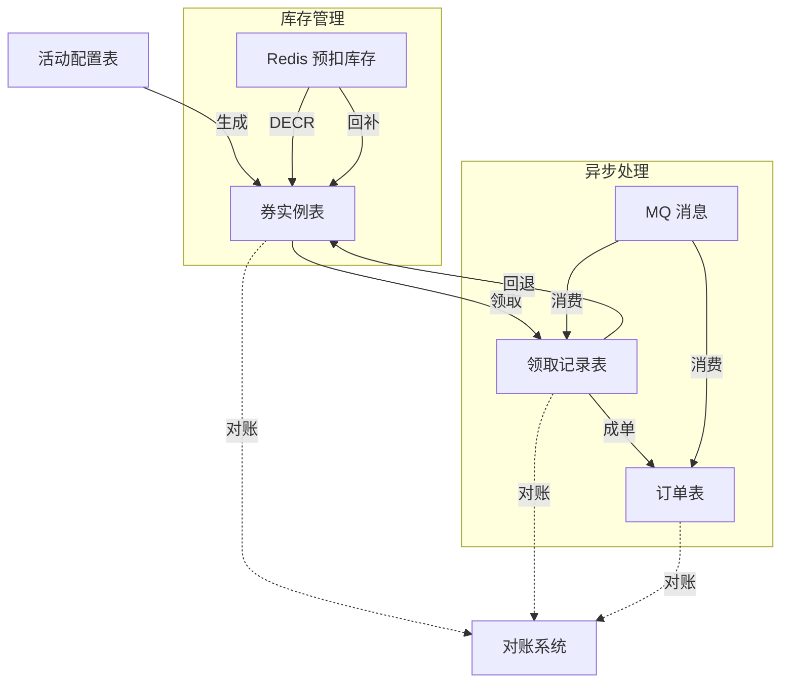
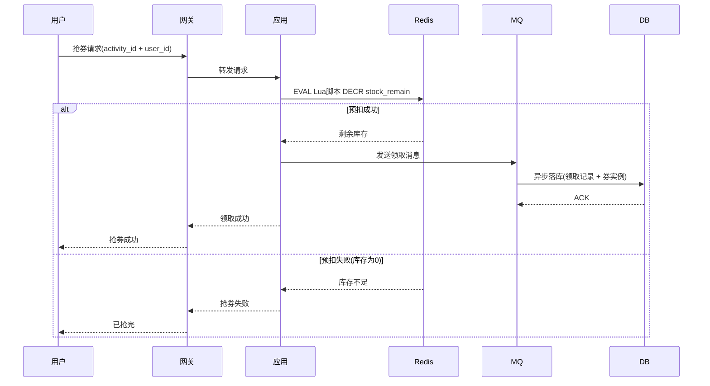
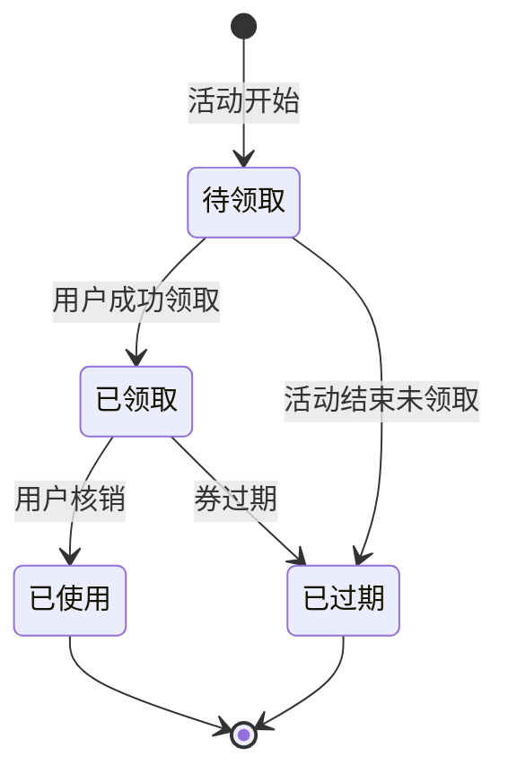
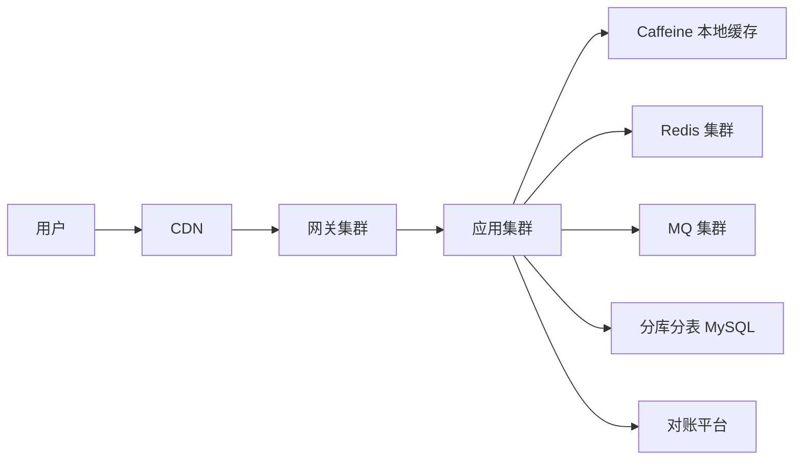

# 秒杀数据模型与接口设计

> 秒杀系统的核心数据结构和 API 定义。从「券 → 库存 → 领取记录 → 订单」四个实体出发，覆盖每个实体的字段设计、唯一约束、状态机，以及上下游 API 接口定义。**重点不是数据结构本身，而是量级不同时数据落在哪里、怎么一致。**

## 一句话摘要

秒杀数据模型的核心矛盾：库存扣减的原子性 + 防超卖的唯一约束 + 高并发的读性能。三个量级用不同的数据落点来解决。

## 本文核心

**核心机制一句话**：数据模型的设计取决于量级——小型靠单库唯一索引，中型靠 Redis + 消息队列，大型靠分库分表 + 多级缓存。

**机制链**：业务量级 → 数据落点 → 一致性方案 → 接口设计 → 验证。

**失效点/边界**：库存扣减的原子性是底线，Redis 预扣失败必须有 DB 回补机制。

**跨周期经验**：数据模型不是一次性设计——随着业务增长，小型模型可能演进到大型模型，每次演进都要重新评估唯一约束和分片键。

## 二、数据模型总览



## 三、四张核心表

### 3.1 活动配置表（seckill_activity）

| 字段 | 类型 | 说明 | 量级差异 |
|---|---|---|---|
| id | BIGINT | 主键 | 通用 |
| activity_name | VARCHAR(128) | 活动名称 | 通用 |
| coupon_type | TINYINT | 券类型（满减/折扣/直减） | 通用 |
| stock_total | INT | 总库存 | 小型:单字段; 中型:分片字段; 大型:分库分表 |
| stock_remain | INT | 剩余库存 | Redis 缓存此字段 |
| start_time | DATETIME | 开始时间 | 通用 |
| end_time | DATETIME | 结束时间 | 通用 |
| limit_per_user | INT | 每人限领数 | 通用 |
| status | TINYINT | 状态（0-待开始 1-进行中 2-已结束） | 通用 |
| gray_percent | TINYINT | 灰度百分比 | 中大型 |
| creator | VARCHAR(64) | 创建人 | 通用 |
| created_at | DATETIME | 创建时间 | 通用 |
| updated_at | DATETIME | 更新时间 | 通用 |

**唯一索引**：无（活动配置是单条记录）

**Trade-off**：
- 小型：直接 DB 读写，不需要缓存
- 中大型：活动配置预热到 Redis，启动后只读 DB

**追问链 ①**：为什么活动配置表需要灰度百分比字段？因为大型场景下活动不能一次性全量开放——需要按用户群逐步放量。灰度百分比控制活动的可见范围，从 1% 起步，逐步增加到 100%。这是「用配置换安全」的 Trade-off：灰度配置增加了运营复杂度，但避免了全量开放可能导致的库存超卖。

**反方案分析**：为什么不直接改 DB 库存来秒杀？因为 DB 写入是单点瓶颈，高并发下 DB CPU 100%，请求超时，雪崩效应。更优方案是 Redis 预扣 + 异步落库，把写 DB 的压力从每请求一次降到预扣成功一次。

### 3.2 券实例表（seckill_coupon）

| 字段 | 类型 | 说明 | 量级差异 |
|---|---|---|---|
| id | BIGINT | 主键（雪花 ID） | 通用 |
| activity_id | BIGINT | 活动 ID | 通用 |
| user_id | BIGINT | 领取用户 ID | 分库分表键（大型） |
| coupon_no | VARCHAR(32) | 券编号（唯一） | 通用 |
| coupon_type | TINYINT | 券类型 | 通用 |
| status | TINYINT | 状态（0-待领取 1-已领取 2-已使用 3-已过期） | 通用 |
| claimed_at | DATETIME | 领取时间 | 通用 |
| used_at | DATETIME | 使用时间 | 通用 |
| expire_time | DATETIME | 过期时间 | 通用 |
| created_at | DATETIME | 创建时间 | 通用 |

**唯一索引**：`(activity_id, coupon_no)` —— 防止重复生成
**普通索引**：`(user_id, status)` —— 用户查询自己的券

**Trade-off**：
- 小型：活动创建时同步生成所有券实例，DB 事务写入
- 中型：MQ 异步生成，Redis 缓存券编号池
- 大型：分批生成 + 分库分表（按 user_id 分片）

**追问链 ②**：为什么券实例表需要分批生成而不是一次性生成？因为大型场景下一次性生成可能占满 DB 连接池（1000 万条记录插入），分批生成可以控制 DB 写入速率，避免连接池耗尽。Trade-off：分批生成增加了复杂度（需要记录生成进度、处理失败重试），但保证了 DB 的稳定性。

### 3.3 领取记录表（seckill_claim）

| 字段 | 类型 | 说明 | 量级差异 |
|---|---|---|---|
| id | BIGINT | 主键 | 通用 |
| activity_id | BIGINT | 活动 ID | 通用 |
| user_id | BIGINT | 用户 ID | 分库分表键（大型） |
| coupon_id | BIGINT | 券实例 ID | 通用 |
| claim_no | VARCHAR(32) | 领取编号（幂等键） | 通用 |
| status | TINYINT | 状态（0-待处理 1-成功 2-失败） | 通用 |
| claim_time | DATETIME | 领取时间 | 通用 |
| source | TINYINT | 来源（1-前端 2-后台 3-同步） | 通用 |
| created_at | DATETIME | 创建时间 | 通用 |

**唯一索引**：`(activity_id, user_id)` —— **核心约束：一人一券**
**幂等键**：`claim_no` —— 防止重复领取

**Trade-off**：
- 小型：同步写入 DB，唯一索引保证防重
- 中型：MQ 异步写入，本地消息表保证可靠性
- 大型：分库分表写入 + 异步对账

**追问链 ③**：为什么领取记录表需要幂等键？因为网络超时或重试可能导致同一请求被处理多次，幂等键保证相同请求只处理一次。Trade-off：幂等键增加了存储成本（需要存储和查询幂等键），但保证了数据一致性。

### 3.4 订单表（seckill_order）

| 字段 | 类型 | 说明 | 量级差异 |
|---|---|---|---|
| id | BIGINT | 主键 | 通用 |
| order_no | VARCHAR(32) | 订单编号（唯一） | 通用 |
| activity_id | BIGINT | 活动 ID | 通用 |
| user_id | BIGINT | 用户 ID | 分库分表键（大型） |
| coupon_id | BIGINT | 券实例 ID | 通用 |
| order_amount | DECIMAL(10,2) | 订单金额 | 通用 |
| pay_amount | DECIMAL(10,2) | 实付金额 | 通用 |
| pay_status | TINYINT | 支付状态（0-未支付 1-已支付 2-已取消） | 通用 |
| pay_time | DATETIME | 支付时间 | 通用 |
| expire_time | DATETIME | 订单超时时间 | 通用 |
| created_at | DATETIME | 创建时间 | 通用 |

**唯一索引**：`order_no` —— 订单编号唯一
**普通索引**：`(user_id, pay_status)` —— 用户查询未支付订单

**Trade-off**：
- 小型：同步创建，支付超时由定时任务处理
- 中型：MQ 异步创建，支付回调更新状态
- 大型：分库分表 + 支付状态最终一致性

**追问链 ④**：为什么订单表需要超时时间？因为秒杀场景下用户领取券后可能不立即支付，超时时间控制订单的有效期。Trade-off：超时时间太短用户来不及支付，太长占用库存——需要根据业务场景调整。

**追问链 ⑤**：为什么订单表需要分库分表键？因为大型场景下订单量极大（亿级），单库无法承载。分库分表将订单按 user_id 分布到不同数据库，每个库只存一部分数据——查询时按 user_id 路由到对应库，写入时也按 user_id 路由到对应库。这是「用分片换容量」的 Trade-off：分片后跨库查询变复杂（需要聚合多个库的结果），但写性能线性扩展。

**反方案分析**：为什么不直接用单库 + 读写分离？因为单库写入有上限（每秒几千次），大型场景下写入量远超这个上限。读写分离只能分担读压力，不能分担写压力。分库分表将写压力分散到多个库，每个库只处理一部分写入——这是唯一能让写入性能线性扩展的方案。Trade-off：分库分表增加了运维复杂度（需要管理多个库、多个分片键、跨库查询），但换来了写性能的线性扩展。

## 四、库存模型

### 4.1 库存分层

```
总库存 = DB 库存（最终防线）+ Redis 预扣库存（性能层）

领取流程：
1. Redis DECR stock_remain → 预扣
2. 预扣成功 → MQ 异步落库
3. 落库失败 → Redis 回补库存（防超扣）
4. 活动结束 → 对账（三方：Redis 扣减数 = DB 领取记录 = 券实例表）
```

### 4.2 库存字段设计

| 字段 | 类型 | 说明 | 量级差异 |
|---|---|---|---|
| stock_total | INT | 总库存 | 通用 |
| stock_remain | INT | 剩余库存（DB） | 最终防线 |
| stock_pre_deduct | INT | 预扣数量（Redis） | 中大型 |
| stock_claimed | INT | 已领取数（DB） | 通用 |
| stock_sync_at | DATETIME | 最后同步时间 | 对账用 |

**追问链**：为什么库存需要分字段设计？小型场景库存变化少，单字段足够；中型场景库存变化频繁，需要分字段（总库存/剩余/预扣/已领取）分别监控；大型场景库存极大，需要分库分表，每个分片独立管理自己的库存字段。

### 4.3 库存预扣流程



**追问链 ⑤**：为什么库存预扣用 Redis DECR 而不是 DB 乐观锁？因为 Redis DECR 是原子操作，单次操作即可完成预扣，不需要重试。DB 乐观锁需要每次读取库存 → 计算 → 更新 → 重试，高并发下重试次数会指数增长，DB 压力反而更大。Trade-off：Redis 预扣性能高但可能超扣（Redis 故障时），DB 乐观锁安全但性能差——小型场景用 DB 乐观锁（数据量小，性能可接受），中大型用 Redis 预扣（性能优先，一致性通过对账兜底）。

### 4.4 库存一致性校验

| 校验项 | 校验时机 | 校验方式 | 量级差异 |
|---|---|---|---|
| Redis vs DB | 实时 | DECR 前后对比 | 小型：手动；中型：自动；大型：三方对账 |
| 领取记录 vs 券实例 | 定时（5min） | SQL 核对 | 小型：手动；中型：自动；大型：三方对账 |
| 订单 vs 券实例 | 定时（5min） | SQL 核对 | 小型：手动；中型：自动；大型：三方对账 |
| 活动结束全量对账 | 活动结束 | 三方核对 | 所有量级 |

**追问链 ⑥**：为什么活动结束后还要全量对账？因为活动期间的对账是实时的（只检查差异），活动结束后的对账是全面的（检查所有记录）。实时对账可能遗漏边界情况（如网络超时导致的单边账），全量对账可以发现这些遗漏。

**追问链 ⑦**：为什么对账差异处理要分 Redis > DB 和 DB > Redis 两种情况？因为预扣和落库是异步的，Redis 和 DB 的更新可能存在时序差异。Redis > DB 说明预扣成功但落库失败，需要补偿落库；DB > Redis 说明落库成功但 Redis 回补失败，需要回补 Redis。Trade-off：两种情况的处理方式不同——补偿落库是「加」，回补 Redis 是「减」，操作方向相反但目标一致：保证 Redis 和 DB 的数据一致。

**事故叙事**：某电商大促期间，因 Redis 故障导致 10 万条预扣记录丢失。事后对账发现 Redis 扣减数与 DB 领取记录不一致，差异 10 万张券。处理方式：DB 为主，Redis 为辅——以 DB 领取记录为准，重新生成 Redis 预扣库存。此事故后，该电商将 Redis 故障纳入混沌演练场景，每次大促前强制演练 Redis 故障恢复。

**反方案分析**：为什么不直接用 DB 作为唯一库存来源？因为 DB 写入是单点瓶颈，高并发下 DB CPU 100%，请求超时，雪崩效应。Redis 预扣 + DB 异步落库是「用 Redis 性能换 DB 稳定性」的 Trade-off——Redis 负责高性能预扣，DB 负责最终一致性。Redis 故障时，DB 是最终防线。Trade-off：Redis 故障时预扣数据丢失，需要 DB 回补——这就是为什么需要对账兜底。

## 五、API 接口设计

### 5.1 抢券接口

**请求**：
```
POST /api/seckill/claim
{
  "activity_id": 12345,
  "user_id": 67890,
  "claim_no": "uuid-xxx"
}
```

**响应**：
```json
{
  "code": 0,
  "message": "success",
  "data": {
    "claim_id": 111111,
    "coupon_id": 222222,
    "status": "claimed",
    "remain_stock": 9999
  }
}
```

**幂等设计**：相同 `claim_no` 重复请求返回原结果，不重复扣减库存。

**量级差异**：
- 小型：直接校验 + 扣减 + 写入
- 中型：Redis 预扣 + MQ 异步 + 幂等校验
- 大型：单元化路由 + Redis 预扣 + MQ 异步 + 幂等校验 + 对账

**追问链 ⑨**：为什么大型需要单元化路由？因为大型场景下用户量极大（千万级），所有请求路由到同一集群会导致集群过载。单元化路由将用户按 ID 分片到不同单元，每个单元独立处理一部分用户——某个单元故障只影响该单元的用户，其他单元不受影响。这是「用分片换容量」的 Trade-off：分片后跨单元查询变复杂（需要聚合多个单元的结果），但写性能线性扩展。

**反方案分析**：为什么不所有量级都用单元化路由？因为单元化路由需要重构分库分表逻辑——需要按 user_id 分片，需要处理跨单元查询。小型场景数据量小，单集群可以承载，不需要单元化。Trade-off：单元化路由扩展性好但实现复杂——小型场景不需要单元化，中大型需要。

### 5.2 查询接口

**请求**：
```
GET /api/seckill/activity/{activity_id}/status?user_id=67890
```

**响应**：
```json
{
  "code": 0,
  "data": {
    "activity_id": 12345,
    "status": "running",
    "stock_total": 100000,
    "stock_remain": 85231,
    "user_claimed": true,
    "claim_time": "2026-09-21T10:30:00Z"
  }
}
```

### 5.3 管理接口

| 接口 | 方法 | 说明 | 量级差异 |
|---|---|---|---|
| /api/seckill/activity/create | POST | 创建活动 | 小型：后台配置 |
| /api/seckill/activity/update | PUT | 更新活动 | 中大型：灰度配置 |
| /api/seckill/activity/start | POST | 手动开始 | 中大型 |
| /api/seckill/activity/pause | POST | 手动暂停 | 大型：一键暂停 |
| /api/seckill/activity/reset | POST | 重置库存 | 中大型：异常回补 |
| /api/seckill/activity/report | GET | 活动报表 | 中大型：对账报表 |

**追问链**：为什么管理接口需要幂等和回滚？活动创建可能被重复调用（前端重试），幂等防止重复创建；活动回滚是上线后的安全网——发现配置错误时能一键撤回，将对用户的影响降到最低。Trade-off：回滚需要记录完整发放日志（审计轨迹），增加了存储成本，但换来了风险可控性。

**反方案**：为什么不直接允许修改已开始的活动？因为已开始的活动已有用户参与，修改配置可能导致已领取用户数据不一致（如修改中奖概率、库存数量）。正确的做法是：活动开始前可自由修改，开始后锁定配置，错误配置只能通过回滚（整活动重置）来修正。

## 六、数据一致性方案

### 6.1 一致性层级

| 层级 | 方案 | 适用量级 | Trade-off |
|---|---|---|---|
| 强一致 | DB 事务 + 唯一索引 | 小型 | 简单但性能差 |
| 最终一致 | Redis 预扣 + MQ 异步 + 对账 | 中型 | 性能好但延迟一致 |
| 分区一致 | 单元化 + 异步对账 | 大型 | 扩展好但复杂度高 |

### 6.2 对账方案

```
对账三线：
1. Redis 扣减数 = 预扣总数（Redis 计数器）
2. DB 领取记录数 = 领取成功数（seckill_claim 表）
3. 券实例表 = 实际发放券数（seckill_coupon 表）

对账时机：
- 实时：预扣时 Redis + DB 双写
- 定时：每 5 分钟一次三方对账
- 事后：活动结束后全量对账

对账差异处理：
- Redis > DB：补偿落库（补发券）
- DB > Redis：回补 Redis 库存（撤回预扣）
- 券实例 ≠ 领取记录：人工介入核查
```

### 6.3 状态机



## 七、各量级数据模型对比

| 实体 | 小型 | 中型 | 大型 |
|---|---|---|---|
| 活动配置 | DB 读写 | Redis 缓存 | 配置平台 + Redis |
| 券实例 | 同步生成 | MQ 异步生成 | 分批生成 + 分库分表 |
| 领取记录 | 同步写入 | MQ 异步 + 本地消息表 | 分库分表 + 异步对账 |
| 订单 | 同步创建 | MQ 异步创建 | 分库分表 + 最终一致 |
| 库存 | DB 单点 | Redis 预扣 + DB 异步 | 多级缓存 + 单元化预扣 |
| 对账 | 人工 | 自动定时 | 三方对账平台 |

**追问链 ⑦**：为什么各量级的库存方案差异如此大？因为小型场景数据量小，DB 写入压力有限，可以直接用 DB 唯一索引保证一致性；中型场景数据量增大，DB 写入成为瓶颈，需要用 Redis 预扣分担压力；大型场景数据量极大，需要用多级缓存 + 单元化预扣 + 异步对账来保证一致性。这是「数据量 → 写入压力 → 架构复杂度」的因果链。

**追问链 ⑧**：为什么中型场景需要本地消息表而不是直接 MQ 异步？因为 MQ 故障时消息可能丢失，本地消息表保证了消息的可靠性——先写本地消息表，再发 MQ，本地消息表作为消息的持久化存储。Trade-off：本地消息表增加了存储成本，但保证了消息的可靠性。

**反方案分析**：为什么不所有量级都用 Redis 预扣？因为 Redis 是单点（单机 Redis），故障时预扣数据丢失。小型场景可以用 DB 唯一索引兜底，中型场景需要 Redis 集群 + 持久化，大型场景需要多级缓存 + 对账兜底。Trade-off：Redis 预扣性能高但存在故障风险，DB 唯一索引安全但性能差——小型场景选安全，中大型选性能。

**反方案分析**：为什么不所有量级都用 MQ 异步？因为 MQ 增加了运维复杂度——需要部署 MQ 集群、监控 MQ 健康、处理 MQ 失败。小型场景数据量小，MQ 的额外成本远高于收益。Trade-off：MQ 异步降低了 DB 写入压力，但增加了运维复杂度——小型场景不需要 MQ，中大型需要。

## 八、参数级配置清单

| 配置项 | 默认值 | 小型推荐 | 中型推荐 | 大型推荐 | 为什么 |
|---|---|---|---|---|---|
| Redis 连接池 | 50 | 50 | 200 | 500 | 连接数随实例数线性增长 |
| MQ 消费者数 | 1 | 1 | 5 | 20 | 并行度上限 = 分区数 |
| DB 连接池 | 20 | 20 | 50 | 100 | 连接数随实例数线性增长 |
| 限流阈值 | 1000 QPS | 1000 | 10000 | 100000 | 按峰值 * 1.5 预留 |
| 缓存 TTL | 30 分钟 | 30min | 1h | 2h | 根据活动窗口定 |
| 熔断阈值 | 不需要 | 不需要 | 错误率 50% | 错误率 30% | 根据业务容忍度 |
| 预扣过期时间 | 3600s | 3600s | 3600s | 3600s | 预扣标记过期时间 |
| 灰度百分比 | 100 | 100 | 10 → 100 | 1 → 10 → 100 | 按用户群逐步放量 |

**追问链 ⑧**：为什么参数需要按量级分档推荐？因为同一个配置在不同量级下含义不同——1000 QPS 限流在小型是保护，在大型是瓶颈。参数的「默认值」是通用起点，「推荐值」才是针对量级的优化。

**反方案分析**：为什么不所有量级用同一套参数？因为参数是量级的函数——量级变化时参数必须同步调整。用同一套参数意味着用小型参数跑大型场景，DB 会被压垮。Trade-off：参数分档增加了配置复杂度，但保证了每个量级都有最优配置。

### 八、步骤级操作：库存预热

**前置条件**：活动配置已生效、Redis 集群就绪、MQ 主题已创建。

- Step 1 预热缓存：活动开始前 30 分钟，将活动配置和券库存预热到 Redis。验证点：Redis 中活动配置可读、库存数量正确。
- Step 2 校验库存：检查 DB 库存与 Redis 库存是否一致。验证点：两者差异为 0。
- Step 3 开启预热标记：设置 Redis 预热标记，表示库存已就绪。验证点：标记已设置且有效期覆盖活动窗口。
- Step 4 监控库存：活动期间实时监控 Redis 库存与 DB 库存的差异。验证点：差异持续为 0。
- 回退：任何阶段校验失败，停止预热并回滚到初始状态。

## 九、开放问题

- **券编号生成策略**：雪花 ID vs 数据库自增 vs Redis 自增——各有什么并发风险？
  - 雪花 ID：分布式唯一，不依赖 DB，但存在时钟回拨风险（NTP 校准时可能重复）
  - DB 自增：单库安全，分库分表后需要统一发号器（如 Leaf），复杂度上升
  - Redis 自增：高性能但持久化风险（Redis 重启可能丢失序列），适合非关键编号
  - 推荐：业务主编号用雪花，库存预扣号用 Redis + DB 双写对账

- **过期券回收**：活动结束后未领取的券——回池 vs 废弃 vs 二次发放？
  - 回池：将未领取券返还库存，适合稀缺资源（限量款）
  - 废弃：直接标记过期，节省系统复杂度，适合大众福利
  - 二次发放：未领取券重新开放领取，适合长尾用户召回
  - Trade-off：回池需要库存回滚逻辑（预扣标记回退），废弃最简单，二次发放需要新的活动窗口

- **跨活动共享库存**：同一用户同时参加多个活动——库存是否共享？
  - 不共享：每个活动独立库存，用户可同时参与多个活动——库存消耗快，但用户感知好
  - 共享：一份库存多活动分摊——库存利用率高，但用户可能抢不到心仪活动
  - 推荐：默认不共享，特殊场景（如品牌联动）可配置共享，共享时需分布式锁防止超卖

- **数据归档**：历史活动数据——保留多久？如何归档查询？
  - 热数据（最近 3 个月）：保留在线 DB，索引完整，查询秒级响应
  - 温数据（3-12 个月）：归档到冷存储（OSS / S3），按月分区，查询需要 1-5 秒
  - 冷数据（1 年以上）：压缩归档，仅保留聚合统计（参与人数、中奖率），查询需离线任务
  - Trade-off：热数据成本高但查询快，冷数据成本低但查询慢——按业务频率分层

- **压测数据隔离**：压测产生的数据如何标记、如何清理？
  - 标记：请求头 `X-Load-Test: true`，所有压测数据写入时打上 `is_test=1` 标记
  - 隔离：压测流量路由到独立环境或独立分库，避免污染生产数据
  - 清理：压测结束后 24 小时内删除 `is_test=1` 数据，或归档到测试专用库
  - 验证点：压测结束后执行 `SELECT COUNT(*) FROM seckill_order WHERE is_test=1` 确认清理干净

### 补充思考：架构部署图



### 补充思考：数据一致性对比

| 方案 | 一致性 | 性能 | 复杂度 | 适用量级 |
|---|---|---|---|---|
| DB 事务 | 强一致 | 低 | 低 | 小型 |
| Redis + MQ | 最终一致 | 高 | 中 | 中型 |
| 单元化 + 对账 | 分区一致 | 极高 | 高 | 大型 |

### 补充思考：状态机


## 开放问题

- 秒杀场景的压测方案如何设计？压测流量标记与生产隔离
- 黑产对抗的实时风控接入方式
- 跨活动库存共享的决策框架

> 量级分档意识：本文方法在十万级 QPS、千万级用户、亿级流量的场景下均需重新评估——量级变化时数据模型与接口设计需同步调整。

## 补充思考：跨周期演进

| 演进阶段 | 量级变化 | 架构变化 | Trade-off |
|---|---|---|---|
| 起步期 | 小型（1 万 QPS） | 单机 Redis + DB 唯一索引 | 简单但无扩展性 |
| 成长期 | 小型 → 中型（10 万 QPS） | 集群 + MQ 异步 + 网关限流 | 可扩展但运维复杂 |
| 成熟期 | 中型 → 大型（100 万+ QPS） | 单元化 + 多级缓存 + 混沌工程 | 容量大但成本极高 |
| 衰退期 | 活动结束 → 库存清 0 | 对账 + 归档 + 下线 | 资源回收但数据保留 |

**追问链 ⑩**：为什么跨周期演进不是线性的？因为业务增长可能是跳跃式的——一次大促就能从小型直接跳到大型。架构设计必须预留「弹性扩容路径」，而非按当前量级静态规划。这意味着网关必须支持水平扩展、Redis 必须支持集群化、DB 必须支持分库分表——这些「远期能力」在起步期就要预留接口，即使暂时用不到。

**反方案分析**：为什么不一开始就按大型架构设计？因为大型架构的成本极高（多机房 + 单元化 + 混沌工程），起步期业务量小，运维成本远高于业务收益。正确的做法是「按需演进」——先做简单的，等量级到了再升级。但升级不是推倒重来，而是「增量演进」——在现有架构上逐步添加集群、MQ、分库分表，每个阶段只做当前量级需要的部分。

### 补充思考：压测方案设计

| 压测维度 | 小型 | 中型 | 大型 |
|---|---|---|---|
| 压测环境 | 不需要 | 独立测试环境 | 全链路压测环境 |
| 压测数据 | 模拟数据 | 生产数据脱敏 | 生产数据脱敏 + 压测标记 |
| 压测流量 | 不标记 | 标记流量 | 标记流量 + 隔离路由 |
| 压测指标 | QPS + RT | QPS + RT + 错误率 | 全链路指标 + 自动告警 |
| 压测频率 | 不需要 | 每次大促前 | 每月一次 + 混沌演练 |

**追问链 ⑪**：为什么压测流量需要标记与隔离？因为压测流量会消耗生产资源（Redis 连接、DB 连接、MQ 消息），如果不隔离，压测流量可能影响生产用户。标记流量的方式是在请求头中加入 `X-Load-Test: true`，网关识别后路由到压测环境或丢弃。

**反方案分析**：为什么不直接在生产环境压测？因为生产环境压测可能影响真实用户（RT 升高、错误率上升）。压测环境虽然成本高（需要搭建与生产相同的架构），但可以安全地验证系统容量。Trade-off：压测环境成本高，但能提前发现容量瓶颈；生产环境压测成本低，但风险大。正确的做法是按量级选择——小型场景在生产压测（风险可控），中型以上用压测环境（安全第一）。

## 📌 数据与事实声明

- 写于 2026-09-21
- 量级分档为通用认知，精确阈值需压测验证
- 行业认知：Redis 预扣 + 唯一索引 + MQ 异步为电商秒杀公开实践

## 📚 参考资料

| 类型 | 标题 | 来源 |
|---|---|---|
| 现有文章 | 发券一致性 + 防资损体系 | 本仓库 docs/architecture/system-design/large-scale/ |
| 现有文章 | 缓存三大问题 + 热点 Key 治理 | 本仓库 docs/middleware/redis/ |
| 现有文章 | 限流熔断参数化 | 本仓库 docs/architecture/system-design/stability/ |