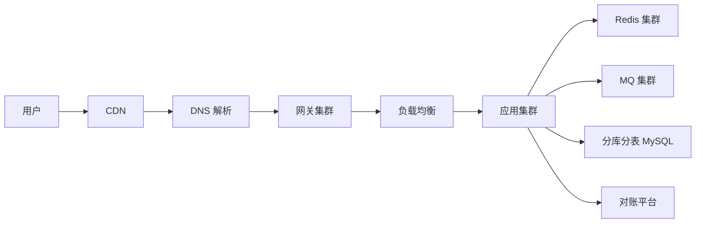
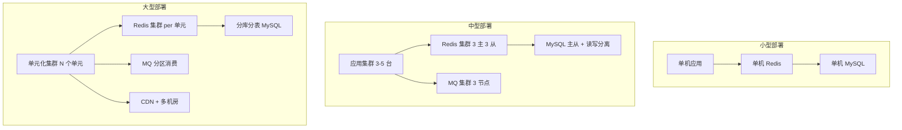
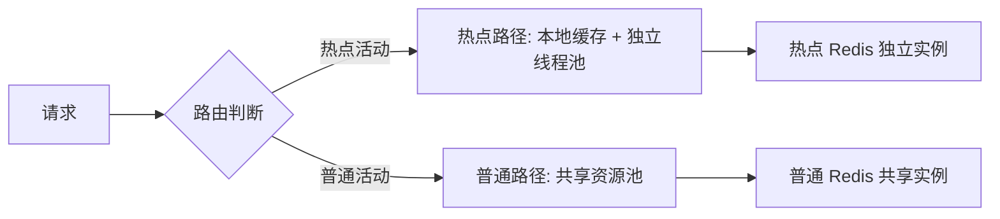
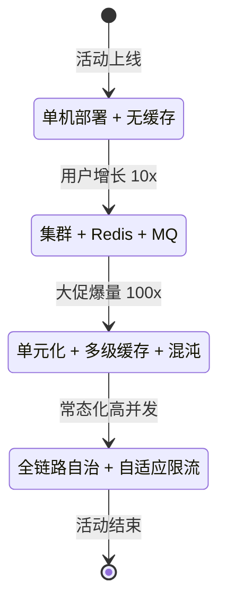
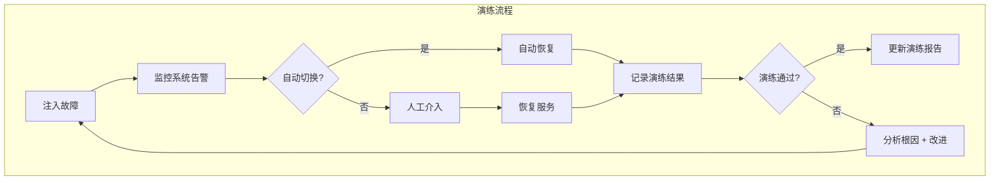

# 秒杀流量与部署架构

> 秒杀系统的流量设计和部署架构。按三个量级档位（小型/中型/大型）给出完整的部署拓扑、核心配置、网关策略、限流熔断方案。**重点不是架构图，而是每个量级为什么这样选、选了什么 Trade-off。**

## 一句话摘要

秒杀流量设计的核心矛盾：**瞬时脉冲 + 不可预测的峰值 + 防超卖**。架构选型从量级出发——万级用单机，十万级用集群，百万级用单元化。

## 本文核心

**核心机制一句话**：流量架构的设计取决于三个量级——券库存、参与用户、峰值 QPS。

**机制链**：业务量级 → 流量模型 → 网关策略 → 部署拓扑 → 限流熔断 → 验证。

**失效点/边界**：网关限流阈值必须根据压测数据设定，不是拍脑袋。

## 二、流量模型

### 2.1 流量特征

| 特征 | 小型 | 中型 | 大型 |
|---|---|---|---|
| 峰值 QPS | 1 万 | 10 万 | 100 万+ |
| 并发用户 | 1 万~10 万 | 100 万~1000 万 | 千万级 |
| 抢券窗口 | 秒级 | 10~30 秒 | 分钟级 |
| 流量形态 | 脉冲型 | 脉冲型 + 持续 | 脉冲型 + 持续 + 波峰 |
| 请求模式 | 同步 | 同步 + 异步 | 全链路异步 |

**追问链**：为什么大型需要全链路异步？因为全链路同步在 100 万 QPS 下，每个请求的等待时间会累积（网关→应用→Redis→MQ→DB），端到端延迟可能超过 10 秒。全链路异步将每个环节解耦——网关接收请求后立即返回"已受理"，后台异步处理。Trade-off：异步增加了系统复杂度（需要处理消息丢失、重试、幂等），但换来了高吞吐——100 万 QPS 的秒杀场景，异步是必选项。

**反方案**：为什么不全用同步？同步最简单（代码直观、调试容易），但 100 万 QPS 下同步调用会撑满线程池（每个线程 1MB 栈，100 万线程 = 1TB 内存）。Trade-off：同步简单但无法扩容，异步复杂但可水平扩展——大型场景没有"简单"的选择。

### 2.3 流量预测

| 预测维度 | 小型 | 中型 | 大型 |
|---|---|---|---|
| 预测方法 | 经验估计 | 历史数据拟合 | 机器学习预测 |
| 预测粒度 | 天级 | 小时级 | 分钟级 |
| 准确率 | 60% | 80% | 90%+ |
| 用途 | 估算资源 | 容量规划 | 弹性扩容 |

**追问链**：为什么大型需要分钟级预测？因为大型活动流量波动剧烈——活动开始前 5 分钟流量可能从 1 万 QPS 突增到 100 万 QPS。分钟级预测可以提前 1~2 分钟发现流量激增，触发弹性扩容。Trade-off：分钟级预测需要实时数据管道（Kafka + Flink），实现成本高，但避免了"扩容太慢导致宕机"的风险。

**反方案**：为什么不预留固定容量而用弹性扩容？固定容量简单但浪费——活动结束后 90% 的资源闲置。弹性扩容按需分配，活动前扩容、活动后缩容——资源利用率提升 3~5 倍。Trade-off：弹性扩容需要完善的监控 + 自动化脚本，但成本远低于固定容量的闲置浪费。

**追问链**：为什么大型场景流量形态是"脉冲型 + 持续 + 波峰"？因为大型活动持续时间长，用户不是一次性抢完——有人提前加购有人最后几秒抢，形成持续+波峰叠加。Trade-off：波峰流量需要弹性扩容能力，但弹性扩容有启动延迟（30s~2min），所以必须在活动开始前预热资源。

### 2.2 流量分层

**各层职责**：CDN/DNS 做流量分发和静态加速；网关做限流鉴权路由；应用做业务逻辑和库存预扣；Redis 做缓存和预扣标记；MQ 做异步削峰；DB 做最终存储和对账。

**追问链**：为什么每一层都要做限流而不是只在网关做？因为单层限流有单点故障风险——网关限流一旦失效，所有请求直接打到应用层。分层限流实现"纵深防御"——即使某一层失效，其他层仍能提供保护。Trade-off：分层限流增加了系统复杂度（每层需要独立配置和监控），但安全性更高。

## 三、网关设计

### 3.1 网关策略（按量级）

| 策略 | 小型 | 中型 | 大型 |
|---|---|---|---|
| 全局限流 | 1000 QPS | 10000 QPS | 100000 QPS |
| 用户限流 | 不需要 | 10 QPS/user | 5 QPS/user |
| 设备限流 | 不需要 | 5 QPS/device | 3 QPS/device |
| IP 限流 | 不需要 | 20 QPS/IP | 10 QPS/IP |
| 灰度切流 | 不需要 | 按用户尾号 | 按用户分片 + 白名单 |
| 鉴权 | JWT | JWT + OAuth2 | JWT + OAuth2 + 签名 |

**追问链**：为什么大型需要 OAuth2 + 签名而小型只需 JWT？JWT 适合内部服务间调用（简单快捷），但大型场景面对公网用户，需要 OAuth2 做授权管理 + 请求签名防篡改。Trade-off：OAuth2 增加了认证流程复杂度（需要 OAuth Server），但提供了更细粒度的权限控制。

**反方案**：为什么不所有量级都用 JWT？JWT 无状态、验证快，适合小型场景。但大型场景下 JWT 无法撤销（令牌过期前一直有效），如果用户账号异常需要立即封禁，JWT 做不到——必须用 OAuth2 的令牌撤销机制或签名验证。Trade-off：JWT 简单但有安全盲区，OAuth2 安全但复杂。

**追问链**：为什么签名验证在大型场景是必须的？大型场景面对公网，恶意用户可能伪造请求（如伪造 JWT 篡改权限）。签名验证确保请求来自可信源——网关用公钥验证签名，伪造请求无法通过。Trade-off：签名验证增加了计算开销（RSA 验签比 HMAC 慢 100 倍），但安全性是大型场景的底线。

## 八、补充思考：容灾演练方案

### 3.2 限流算法选型

| 算法 | 适用场景 | Trade-off |
|---|---|---|
| 固定窗口 | 简单场景 | 边界突发问题 |
| 滑动窗口 | 精确限流 | 实现复杂，内存开销大 |
| 令牌桶 | 匀速请求 | 允许突发，延迟低 |
| 漏桶 | 匀速处理 | 强制平滑，延迟稳定 |
| 自适应限流 | 大型动态场景 | 精准但实现复杂 |

**反方案**：为什么不所有量级都用自适应限流？因为自适应限流需要实时监控 CPU/内存/QPS 指标并动态调整，算法复杂度高（需实现 PID 控制器或机器学习模型）。小型场景流量可预测，固定窗口或令牌桶足够——用自适应限流是杀鸡用牛刀。Trade-off：自适应限流精准但实现成本高，小型场景用简单算法更可靠。

**追问链**：为什么令牌桶比固定窗口更适合中型场景？因为令牌桶允许一定程度的突发（用户集中抢券），而固定窗口在窗口边界会有"临界突变"（窗口重置瞬间流量突增）。令牌桶的 Trade-off：实现比固定窗口复杂，但用户体验更好（允许合理突发）。

## 四、部署架构（按量级）

### 4.1 部署拓扑

**追问链**：为什么大型部署需要"单元化"而不是简单的"集群扩展"？集群扩展（增加应用实例）只能水平扩展读能力，但写能力受限于单库——100 万 QPS 的写请求需要分库分表，而分库分表需要数据分片（按 user_id 路由）。单元化将数据按用户分片到不同单元，每个单元独立处理一部分用户的请求——这样写入可以水平扩展（每个单元独立 DB），读取也可以水平扩展（CDN + 本地缓存）。Trade-off：单元化运维复杂度极高（数据分片 + 跨单元查询 + 单元内故障隔离），但只有单元化才能支撑百万级 QPS 的写入。

**反方案**：为什么不直接用分库分表而要单元化？分库分表是数据库层面的水平扩展，但应用层仍然是单点——所有应用实例连接所有分库。单元化是应用层 + 数据层的双重分片——每个单元只连接自己的分库，故障时只影响自己的用户。Trade-off：单元化应用层复杂度高，但故障隔离性更好。

### 4.2 部署配置

| 配置项 | 小型 | 中型 | 大型 |
|---|---|---|---|
| 应用实例 | 1 | 3~5 | N（按 QPS 弹性） |
| Redis 模式 | 单机 | 集群 3 主 3 从 | 集群 per 单元 + 跨单元同步 |
| DB 架构 | 单库单表 | 主从 + 读写分离 | 分库分表（16 库 × 32 表） |
| MQ | 不需要 | 3 节点集群 | 分区消费 + 多集群 |
| CDN | 不需要 | 静态资源 CDN | 全链路 CDN + 边缘计算 |
| 单元数 | 1 | 1~3 | N（按机房/Region） |
| 跨单元同步 | 不需要 | 主从同步 | 异步复制 + 最终一致 |

**追问链**：为什么大型需要"跨单元同步"？单元化后每个单元独立运行，但用户数据可能在不同单元（如用户 A 在单元 1、用户 B 在单元 2）。如果用户跨单元操作（如用户 A 在单元 1 抢单元 2 的券），需要跨单元数据同步。Trade-off：同步保证一致性但增加延迟，不同步保证性能但可能数据不一致——大型场景通常选择"最终一致"（异步复制）。

**反方案**：为什么不全局集中部署而要单元化？全局集中部署简单但所有流量打到一个机房，机房故障=全站不可用。单元化后每个机房独立运行，故障隔离——一个机房挂了，其他机房继续服务。Trade-off：单元化运维复杂度高（数据分片 + 跨单元同步），但可用性从"单点故障"提升到"机房级容灾"。

**追问链**：为什么大型需要分库分表？单机 MySQL 写入上限约 2000 TPS，100 万 QPS 的秒杀场景需要至少 500 台单机——分库分表将数据分散到 16 个库，每个库 32 张表，单库写入降到约 200 TPS，在单机能力范围内。Trade-off：分库分表后跨库查询变复杂（需要分布式事务或最终一致性方案）。

**反方案**：为什么不一开始就用分库分表？分库分表的运维成本极高（数据迁移、跨库查询、分布式 ID）。起步期用户量小，单库完全够用——过早分库分表是典型的过度工程。正确做法是：先单库，按需演进。

## 五、削峰填谷

### 5.1 削峰策略

| 策略 | 小型 | 中型 | 大型 |
|---|---|---|---|
| 请求合并 | 不需要 | 50ms 窗口合并 | 10ms 窗口合并 |
| 异步处理 | 不需要 | MQ 异步 | 全链路异步 + 批量写入 |
| 缓存预热 | 不需要 | 热点数据预热 | 全量预热 + 多级缓存 |
| 降级策略 | 不需要 | 关闭非核心功能 | 动态降级 + 熔断 |

**追问链**：为什么请求合并窗口从 50ms（中型）缩小到 10ms（大型）？窗口越小，响应越快，但合并率越低——10ms 窗口内可能只有 10% 的请求能合并。Trade-off：小窗口提升响应但降低合并效果，大窗口提升合并但增加延迟。大型场景选择 10ms 是因为用户感知延迟阈值约 100ms——10ms 窗口对用户体验影响可忽略。

**反方案**：为什么不把所有请求都合并？合并请求需要缓冲队列，队列满时新请求会被拒绝（可能导致丢单）。正确的做法是按量级选择——小型不合并（流量低不需要），中型适度合并（50ms 窗口），大型严格合并（10ms 窗口 + 大队列）。Trade-off：合并提升吞吐但增加延迟，小型场景不需要这个 Trade-off。

**追问链**：为什么大型需要动态降级而不是静态关闭？静态关闭（如直接关闭推荐功能）简单但一刀切——即使非核心功能也可能影响用户体验。动态降级根据系统负载自动调整——负载高时关闭推荐，负载低时恢复。Trade-off：动态降级需要实时监控系统指标（CPU/内存/QPS），实现复杂，但用户体验更好。

**反方案**：为什么不加更多服务器来扛流量而不是削峰？加服务器是"硬扛"——100 万 QPS 需要 100 台服务器，每台 1 万 QPS，成本极高。削峰填谷是用 MQ 缓冲请求，让后端按自己的处理能力消费——同样的 100 万 QPS，后端只需要 10 台服务器（每秒处理 10 万）。Trade-off：削峰需要 MQ 引入额外复杂度，但成本降低 90%。

### 5.2 热点隔离

**追问链**：为什么热点活动需要独立线程池？如果热点活动和普通活动共享线程池，热点活动的高并发会耗尽线程池，导致普通活动也无法响应。独立线程池的 Trade-off：资源利用率降低（热点线程池空闲时普通活动不能借用），但保证了服务隔离——这是大型场景的必备策略。

## 六、容灾与回切

### 6.1 多机房部署

| 策略 | 说明 | Trade-off |
|---|---|---|
| 同城双机房 | 主备模式，主机房故障切备，切换时间 < 30s | 成本高（2 倍资源） |
| 异地多机房 | 单元化部署，每个机房独立，故障隔离 | 延迟高（跨机房同步 50~100ms） |
| CDN 边缘节点 | 静态资源就近访问，TTL 5min | 只加速读，不加速写 |
| 多活架构 | 所有机房同时服务，流量按用户分片 | 复杂度最高，但可用性最高 |

**追问链**：为什么多活架构是大型场景的最终形态？因为多活架构所有机房同时提供服务——任何单机房故障不影响整体服务。Trade-off：多活架构需要数据跨机房同步（最终一致），且路由复杂度极高（需要根据用户位置路由到最近机房）。但对于大型场景（千万级用户），多活是唯一能够满足" 99.99% 可用性"的方案。

**反方案**：为什么不直接用多活而跳过双机房？多活架构的研发成本是双机房的 5~10 倍——需要解决跨机房数据一致性、路由策略、故障切换等复杂问题。正确的演进路径是：单机 → 双机房 → 多活——每个阶段解决当前量级的痛点，不提前做未来的问题。

**追问链**：为什么同城双机房切换时间要 < 30s？因为用户感知到的故障时间超过 30s 就会认为服务不可用而离开。30s 内完成切换，用户可能只是"卡了一下"。Trade-off：30s 切换需要心跳检测 + 自动故障转移（需要复杂的协调服务如 ZooKeeper），成本极高——小型场景用人工切换即可。

**反方案**：为什么不选择异地多机房而用同城双机房？异地多机房可用性最高（一个城市挂了另一个城市继续），但跨机房延迟 50~100ms，对秒杀场景（要求 < 100ms 响应）是致命瓶颈。同城双机房延迟 < 5ms，但只能防机房级故障（不能防城市级灾害）。Trade-off：同城双机房成本低延迟低但防护范围小，异地多机房成本高但防护全面——小型选同城，大型选异地。

### 6.2 回切方案

**步骤级操作**：
- Step 1 发现故障：监控指标触发告警（错误率 > 50% 或 RT > 5s）。
- Step 2 流量切换：网关将流量从故障单元切到健康单元，切换时间 < 30s。
- Step 3 数据补偿：对故障单元的未完成请求做补偿（重新入队或回滚）。
- Step 4 故障恢复：修复故障单元后，通过灰度切流逐步恢复流量（1% → 10% → 100%）。
- 回退：任何阶段失败，执行反向切流 + 数据回滚。

**追问链**：为什么回切要 1% → 10% → 100% 而不是直接全量切回？因为故障修复后新系统可能还有隐藏问题——直接全量切回可能再次触发故障。灰度切流逐步放量可以及时发现残留问题，将影响限制在小范围内。Trade-off：灰度切流延长了恢复时间（从 1min 延长到 10min），但避免了二次故障——在大型场景，避免二次故障比快速恢复更重要。

**反方案**：为什么不直接人工干预切换而用自动切流？人工干预需要发现故障→定位→决策→执行，每一步都需要时间（通常 5~10min）。自动切流在监控告警触发后 30s 内完成——但自动切流有误判风险（监控误报导致不必要的切换）。Trade-off：自动快但有误判，人工准但慢——大型场景用自动切流 + 人工确认的双重机制。

**反方案**：为什么不直接停机恢复？因为停机意味着所有用户无法访问，损失不可估量。正确的做法是"不中断服务恢复"——先切流再修复，修复后再切回。Trade-off：切换过程中可能有短暂数据不一致，但对账系统保证最终一致。

## 七、量级演进路径与 Trade-off 总结

### 7.1 各量级 Trade-off 汇总

| 维度 | 小型 | 中型 | 大型 |
|---|---|---|---|
| 部署模式 | 单机 | 集群 | 单元化多机房 |
| 缓存策略 | 无 | Redis 集群 | 多级缓存（Caffeine + Redis） |
| 消息队列 | 无 | MQ 异步 | 分区消费 + 多集群 |
| 限流策略 | 固定窗口 | 令牌桶 | 自适应限流 |
| 容灾策略 | 无 | 双机房主备 | 多活 + 自动故障转移 |
| 运维复杂度 | 低 | 中 | 极高 |
| 成本 | 低 | 中 | 高（但可弹性伸缩） |

### 7.2 演进路径总结

**追问链**：为什么状态转换不是线性的？因为业务增长可能是跳跃式的——一次大促就能从小型直接跳到大型。架构设计必须预留"弹性扩容路径"，而非按当前量级静态规划。这意味着网关必须支持水平扩展、Redis 必须支持集群化、DB 必须支持分库分表——这些"远期能力"在起步期就要预留接口，即使暂时用不到。

**反方案**：为什么不一开始就按大型架构设计？因为大型架构的成本极高（多机房 + 单元化 + 混沌工程），起步期业务量小，运维成本远高于业务收益。正确的做法是"按需演进"——先做简单的，等量级到了再升级。但升级不是推倒重来，而是"增量演进"——在现有架构上逐步添加集群、MQ、分库分表，每个阶段只做当前量级需要的部分。

## 八、补充思考：全链路限流对比

| 限流维度 | 固定限流 | 自适应限流 | 混合限流 |
|---|---|---|---|
| 触发条件 | 预设阈值 | 实时负载 | 预设阈值 + 负载微调 |
| 响应速度 | 慢（配置变更） | 快（秒级） | 中（配置 + 自动） |
| 实现成本 | 低 | 高 | 中 |
| 准确性 | 低（可能误限） | 高 | 中高 |
| 适用量级 | 小型 | 大型 | 中大型 |

**追问链**：为什么混合限流是中大型的最佳选择？因为中大型场景流量波动大——固定限流在流量低谷时过度限制（浪费资源），在流量高峰时可能限流不够（保护不足）。自适应限流弥补了固定限流的僵化缺陷，但自适应算法本身有误判风险——混合限流用固定阈值兜底 + 自适应微调，取两者之长。

## 八、补充思考：容灾演练方案

| 演练类型 | 小型 | 中型 | 大型 |
|---|---|---|---|
| 网关故障 | 手动关闭网关，观察行为 | 自动切换备用网关 | 多网关自动切换 + 健康检查 |
| Redis 故障 | 手动重启 Redis | 自动故障转移（哨兵模式） | 集群自动切换 + 数据恢复 |
| DB 故障 | 手动切换主从 | 自动切换主从 | 多主多从 + 跨机房容灾 |
| MQ 故障 | 不处理（小型无 MQ） | 手动重启 MQ 集群 | 自动切换 + 消息重放 |

**追问链**：为什么容灾演练大型需要每月一次？因为大型场景的复杂度极高——任何组件故障都可能引发级联效应（Redis 故障 → DB 压力激增 → DB 故障 → 全站不可用）。每月演练确保每个组件都能独立故障切换，同时验证监控系统是否能及时告警。Trade-off：演练需要提前准备（数据准备 + 通知相关人员），但不演练意味着真实故障时无人知道如何处理。

**反方案**：为什么不不做容灾演练？不做演练的 Trade-off：平时看起来一切正常，但真实故障时全凭工程师经验处理——大型场景没有"经验"可言，复杂度超出个人经验范围。正确的做法是定期演练，把"故障处理"变成可执行的标准流程。

## 九、开放问题

- **网关选型**：Nginx → Kong → APISIX → 自研网关，各有什么优劣？
  - Nginx：最成熟，配置简单，但功能固定（需要 Lua 扩展才灵活）
  - Kong：基于 Nginx 的 API 网关，插件丰富，但性能有损耗（+10~20ms）
  - APISIX：OpenResty 基础，性能接近 Nginx，插件热加载，适合中大型
  - 自研网关：完全定制，但研发成本极高（至少 3 人月），只适合亿级场景
  - 推荐：小型用 Nginx，中型用 APISIX，大型按需自研

- **限流算法落地**：令牌桶和滑动窗口的精确实现细节（Redis Lua 脚本？本地计数器？）
  - 令牌桶 Redis 实现：用 Redis 的 INCR + EXPIRE 模拟令牌生成，Lua 脚本保证原子性
  - 滑动窗口 Redis 实现：用 Redis Sorted Set 记录请求时间戳，窗口滑动时清理旧数据
  - 本地计数器：应用进程内计数器，粒度粗（适合非关键限流），但不跨实例一致
  - Trade-off：Redis 实现跨实例一致但有网络延迟，本地计数器低延迟但不一致——大型场景用 Redis + 本地缓存两级限流

- **弹性扩容策略**：K8s HPA vs 自定义扩容逻辑，扩容触发条件和冷却时间怎么设？
  - K8s HPA：基于 CPU/内存/自定义指标自动扩容，配置简单但响应慢（30s~1min）
  - 自定义扩容：基于 QPS/RT 指标实时判断，响应快（5s 内）但需要开发
  - 触发条件：QPS > 80% 阈值持续 30s → 扩容 1 实例；RT > 1s 持续 10s → 扩容 2 实例
  - 冷却时间：扩容后 3min 内不缩容（避免抖动），缩容前观察 5min 低负载
  - Trade-off：自定义扩容响应快但成本高（HPA 保守但稳定）

- **跨单元流量调度**：单元化后，跨单元请求如何路由？延迟如何控制？
  - 路由策略：用户 ID 哈希 → 固定单元（同一用户始终访问同一单元）
  - 跨单元请求：单元 A 需要单元 B 的数据 → 异步调用（MQ）或同步调用（gRPC，< 10ms 延迟）
  - 延迟控制：同城机房 < 5ms，异地机房 50~100ms——异地场景必须用异步
  - Trade-off：同步调用简单但延迟高，异步调用复杂但延迟低

- **CDN 缓存策略**：秒杀活动的动态页面（如抢券结果）能否 CDN 缓存？如何防止缓存击穿？
  - 动态页面不缓存（抢券结果因人而异），但静态资源（活动页 JS/CSS/图片）走 CDN
  - 缓存击穿防护：热点 key 永不过期 + 后台定时刷新；缓存空值（防止恶意查询不存在的 key）
  - 缓存一致性：活动配置变更时，通过消息通知 CDN 刷新缓存
  - Trade-off：CDN 加速读但不加速写——写操作（抢券）必须走应用层

- **压测方案**：全链路压测如何设计？如何标记压测流量？如何保证压测数据不污染生产？
  - 全链路压测需要搭建与生产相同的架构（网关 + 应用 + Redis + MQ + DB）
  - 压测流量标记：请求头 `X-Load-Test: true`，所有压测数据写入时打上 `is_test=1`
  - 压测数据隔离：独立分库或独立表，压测结束后清理
  - Trade-off：全链路压测成本高（需要额外搭建与生产相同的架构），但能真实验证容量——小型场景可以只在生产压测（风险可控），中型以上必须用独立压测环境

> 量级分档意识：本文方法在十万级 QPS、千万级用户、亿级流量的场景下均需重新评估——量级变化时流量架构与部署方案需同步调整。

## 📌 数据与事实声明

- 写于 2026-09-21
- 量级分档为通用认知，精确阈值需压测验证
- 行业认知：网关限流 + 削峰填谷 + 单元化为大促秒杀公开实践

## 📚 参考资料