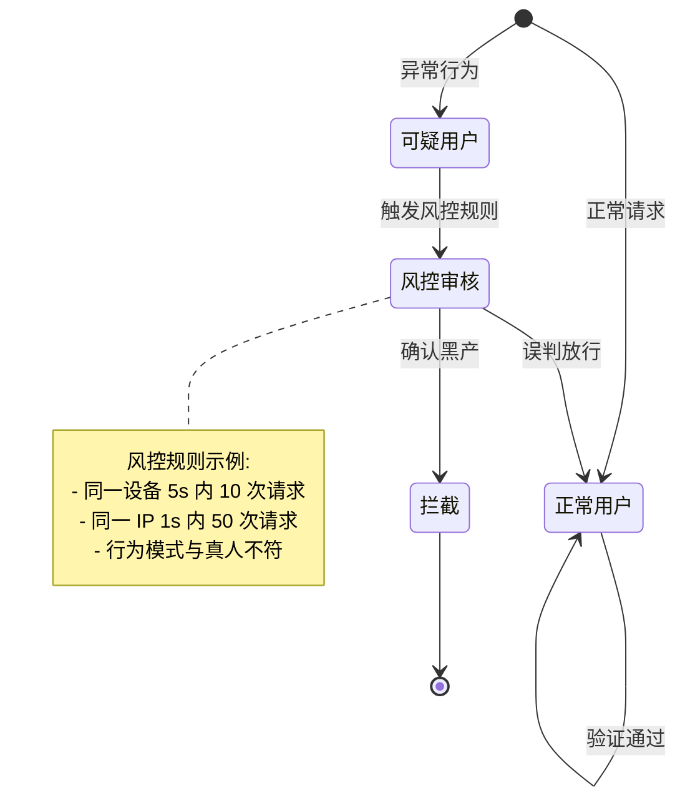
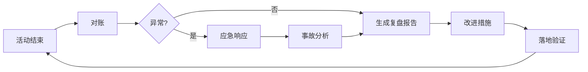
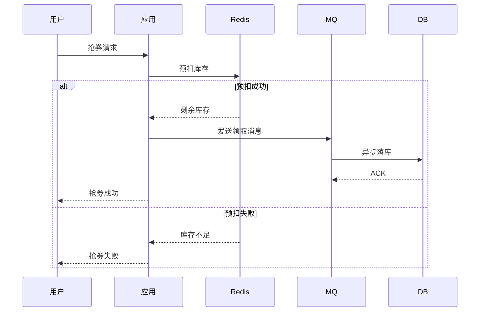
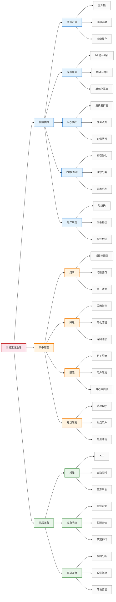
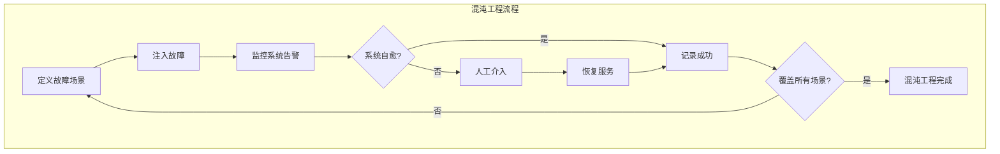

# 秒杀稳定性机制与隐患治理

> 秒杀系统的稳定性设计。从事前预防、事中处理、事后复盘三个维度，覆盖缓存击穿/库存超卖/MQ 堆积/DB 慢查询/黑产攻击等核心隐患的治理方案。**重点不是机制本身，而是每个隐患在什么量级下会变成生产事故、以及怎么防。**

## 一句话摘要

秒杀稳定性的核心矛盾：**「瞬间峰值」+「有限资源」+「不可重试」**。三个量级的稳定性策略完全不同——小型靠人工监控，中型靠自动熔断，大型靠单元化 + 混沌工程。

## 本文核心

**核心机制一句话**：稳定性设计从量级出发——小型靠监控告警 + 人工介入，中型靠熔断降级 + 自动恢复，大型靠单元化 + 混沌工程 + 自动容灾。

**机制链**：业务量级 → 隐患识别 → 治理方案 → 验证 → 复盘。

**失效点/边界**：缓存击穿和库存超卖是秒杀最常见的两个事故，必须前置预防。

## 二、事前预防

### 2.1 缓存击穿治理

**场景**：热点券的缓存 key 过期，大量请求同时穿透到 DB。

| 方案 | 小型 | 中型 | 大型 |
|---|---|---|---|
| 互斥锁 | Redis SETNX | Redis Lua 脚本 | 多级缓存 + 互斥锁 |
| 预热 | 活动前 10 分钟预热 | 活动前 30 分钟预热 + 定时续期 | 多级缓存 + 自动续期 |
| 逻辑过期 | 不需要 | 缓存逻辑过期（永不过期 + 异步刷新） | 多级缓存 + 逻辑过期 |
| 限流 | 网关简单限流 | 用户维度限流 | 多层限流 + 热点隔离 |

**Trade-off**：
- 互斥锁：简单可靠但性能差（只有一个请求能查 DB）
- 逻辑过期：性能好但可能不一致（缓存与 DB 有短暂差异）
- 多级缓存：性能最好但实现复杂（本地缓存 + Redis + DB 三级）

**追问链**：为什么大型需要多级缓存而不是仅用 Redis？因为单级 Redis 在百万 QPS 下会成为瓶颈（Redis 单机读 QPS 约 10 万，但百万 QPS 需要 10 台 Redis）。本地缓存（Caffeine）在应用进程内，延迟 < 1ms，不需要网络开销。Trade-off：本地缓存有内存限制（每个实例几百 MB），但大幅降低 Redis 压力。

**反方案**：为什么不缓存永不过期而要定时续期？永不过期会导致数据不一致（活动配置变更后缓存还是旧值）。定时续期定期从 DB 加载最新配置，保证缓存一致性。Trade-off：续期增加 DB 压力（每次续期都要查 DB），但一致性更好——中型场景用逻辑过期（永不过期 + 异步刷新），大型用多级缓存 + 自动续期。

**追问链**：为什么大型需要"多级缓存 + 互斥锁"而不是仅用互斥锁？互斥锁保证只有一个请求查 DB，但互斥锁在高并发下可能成为瓶颈（所有请求排队等锁）。多级缓存先用本地缓存（Caffeine）尝试读取——本地缓存命中直接返回，不命中再查 Redis。互斥锁只在 Redis 缓存失效时触发——减少锁竞争。Trade-off：多级缓存 + 互斥锁实现复杂，但性能和一致性兼顾。

### 2.2 库存超卖治理

**场景**：高并发下 Redis 预扣成功，但 DB 落库失败，导致库存不一致。

| 方案 | 小型 | 中型 | 大型 |
|---|---|---|---|
| DB 唯一索引 | (activity_id, user_id) | (activity_id, user_id) | 分库分表后唯一索引 |
| Redis 回补 | 预扣失败回补 | MQ 失败回补 | 异步对账 + 回补 |
| 事务 | DB 事务 | 本地消息表 | 分区事务 + 对账 |
| 幂等 | 不需要 | claim_no 幂等 | 单元化幂等 |

**Trade-off**：
- DB 唯一索引：简单可靠但性能差（高并发下唯一索引冲突多）
- 本地消息表：性能好但实现复杂（需要保证本地事务和 MQ 发送的一致性）
- 分区事务：扩展好但一致性弱（需要最终一致性 + 对账兜底）

**追问链**：为什么大型需要单元化幂等？单元化部署下，同一用户可能在不同单元重复领取（单元 A 处理了领取，单元 B 也收到了请求）。单元化幂等通过用户 ID 哈希确定归属单元——只有归属单元能处理该用户的领取请求。Trade-off：单元化幂等需要全局用户 ID 哈希映射，运维复杂，但保证了跨单元的幂等性。

**反方案**：为什么不直接用 DB 唯一索引而用 Redis 预扣？DB 唯一索引简单可靠，但高并发下唯一索引冲突多（多个请求同时插入同一 user_id + activity_id，只有一个成功，其余的报错）。Redis 预扣先检查库存（O(1) 操作），再异步落 DB——预扣阶段无冲突。Trade-off：Redis 预扣 + DB 异步落库增加了复杂度（需要保证 Redis 和 DB 的一致性），但并发性能远优于 DB 唯一索引。

### 2.3 MQ 堆积治理

**场景**：秒杀活动结束，MQ 消息大量堆积，消费端处理不过来。

| 方案 | 小型 | 中型 | 大型 |
|---|---|---|---|
| 消费者数 | 1 | 5 | 20+ |
| 批量消费 | 不需要 | 批量拉取（100 条/次） | 批量拉取（500 条/次） |
| 优先级队列 | 不需要 | 按 user_id 分区 | 按 user_id 分区 + 优先级 |
| 死信队列 | 不需要 | 死信队列 + 人工处理 | 死信队列 + 自动重试 + 人工 |
| 限流消费 | 不需要 | 消费端限流 | 自适应消费速率 |

**追问链**：为什么大型需要"自适应消费速率"而不是固定消费速率？因为大型场景消息量波动大——活动高峰期消息量大需要加速消费，低谷期消息量小需要减速消费以节省资源。自适应消费速率根据队列深度动态调整——队列深则加速，队列浅则减速。Trade-off：自适应消费实现复杂（需要实时监控队列深度 + 动态调整消费者数），但资源利用率更高。

**反方案**：为什么不加更多消费者来加速消费？加消费者是"硬扩"——消费者数越多，DB 写入压力越大（每个消费者都要写 DB）。正确的做法是先优化消费逻辑（批量写入 + 异步落库），再根据 DB 承载能力确定消费者上限。Trade-off：优化消费逻辑需要开发成本，但比硬扩更可持续。

### 2.4 DB 慢查询治理

**场景**：秒杀高峰期，DB 出现慢查询，导致请求超时。

| 方案 | 小型 | 中型 | 大型 |
|---|---|---|---|
| 索引优化 | (activity_id, user_id) | 复合索引 + 覆盖索引 | 分库分表 + 索引优化 |
| 读写分离 | 不需要 | 主从分离 | 分库分表 + 多主 |
| 连接池 | 默认 20 | 调整 50 | 调整 100 + HikariCP |
| 查询缓存 | 不需要 | Redis 缓存查询结果 | 多级缓存 + 查询缓存 |
| 分页优化 | 不需要 | 游标分页 | 游标分页 + 索引覆盖 |

**追问链**：为什么大型需要"多主"而不是主从？主从架构下所有写请求打到主库，主库成为瓶颈。多主架构将写请求分散到多个主库（按 user_id 分片），每个主库只处理一部分写入。Trade-off：多主架构数据一致性更难保证（需要冲突检测和合并），但写吞吐提升 N 倍（N = 主库数量）。

### 2.5 黑产攻击治理

**场景**：脚本/外挂批量抢券，导致正常用户无法参与。

| 方案 | 小型 | 中型 | 大型 |
|---|---|---|---|
| 验证码 | 不需要 | 图形验证码 | 滑块验证码 + 行为分析 |
| 设备指纹 | 不需要 | 设备指纹 | 设备指纹 + IP 黑名单 |
| 限流 | 网关限流 | 用户维度限流 | 多维限流 + 风控系统 |
| 风控接入 | 不需要 | 风控系统 | 实时风控 + 人工审核 |
| 账号农场 | 不需要 | 手机号绑定 | 手机号绑定 + 实名认证 |

**追问链**：为什么大型需要"行为分析"而不仅是验证码？验证码只能区分人和机器，但黑产使用模拟器可以绕过验证码。行为分析通过分析用户操作行为（点击频率、移动轨迹、操作间隔）判断是否为真人——模拟器无法完美模拟人类行为。Trade-off：行为分析需要收集和分析用户行为数据，隐私成本高，但防御效果更好。

**反方案**：为什么不直接用封 IP 的方式防黑产？封 IP 简单但误伤率高——同一 IP 下可能有多个正常用户（公司内网、校园网、NAT 共享）。设备指纹 + IP 黑名单组合——先用设备指纹识别可疑设备，再封禁设备关联的 IP。Trade-off：设备指纹需要前端采集（SDK），但精准度远高于 IP 封禁。

### 2.6 黑产对抗状态机

## 三、事中处理

### 3.1 熔断策略

| 熔断项 | 小型 | 中型 | 大型 |
|---|---|---|---|
| 错误率阈值 | 不需要 | 50% | 30% |
| 熔断窗口 | - | 30 秒 | 10 秒 |
| 半开请求 | - | 5 个 | 10 个 |
| 恢复时间 | - | 60 秒 | 30 秒 |

**追问链**：为什么大型的熔断窗口（10 秒）比中型（30 秒）更短？因为大型场景的流量基数大，30 秒内可能已经有 300 万请求失败——每多一秒都意味着更多用户受到影响。快速熔断 + 快速恢复（30 秒）是大型场景的必然选择。Trade-off：快速熔断可能误判（短暂的流量尖峰触发熔断），但大型场景宁可误判也不愿长时间不降级。

**追问链**：为什么大型半开请求（10 个）比中型（5 个）更多？半开请求是熔断恢复后试探性放行的请求数——半开请求越多，恢复验证越充分，但风险也越大（如果故障未恢复，半开请求会再次触发熔断）。大型场景流量基数大，10 个半开请求在 100 万 QPS 下占比极低（0.001%），可以承受更大的试探风险。Trade-off：更多半开请求加速恢复，但增加了再次故障的风险。

**反方案**：为什么不设置熔断而直接加服务器？加服务器是"硬扛"——100 万 QPS 下，即使加 100 台服务器，DB 仍然可能成为瓶颈。熔断是在瓶颈前主动降级——牺牲部分功能保证核心可用。Trade-off：熔断降低了用户体验（部分功能不可用），但避免了全站不可用。

### 3.2 降级策略

| 降级项 | 小型 | 中型 | 大型 |
|---|---|---|---|
| 关闭推荐 | 不需要 | 活动结束 | 高峰期关闭非核心 |
| 简化流程 | 不需要 | 跳过非必要校验 | 只保留核心链路 |
| 返回兜底 | 不需要 | 返回默认文案 | 返回缓存数据 |

**追问链**：为什么大型需要"只保留核心链路"而中型只需"跳过非必要校验"？中型的非必要校验对性能影响小（每个校验 < 10ms），跳过即可。大型每秒百万请求，每个校验 10ms 就是 1000 万 ms = 10000 秒的累计延迟——必须只保留核心链路（校验 + 预扣 + 写入）。Trade-off：核心链路意味着功能裁剪——用户可能无法获得完整体验，但系统可用。

### 3.3 限流策略

| 限流项 | 小型 | 中型 | 大型 |
|---|---|---|---|
| 网关 QPS | 1000 | 10000 | 100000 |
| 用户 QPS | - | 10 | 5 |
| 设备 QPS | - | 5 | 3 |
| IP QPS | - | 100 | 10 |
| 自适应限流 | 不需要 | 不需要 | 启用 |

### 3.4 热点隔离

| 热点项 | 小型 | 中型 | 大型 |
|---|---|---|---|
| 热点 Key | 不需要 | 单独缓存 | 多级缓存 + 热点隔离 |
| 热点用户 | 不需要 | 单独限流 | 单独限流 + 风控 |
| 热点活动 | 不需要 | 单独部署 | 单元化部署 |

**追问链**：为什么大型需要"单元化部署"而中型只需"单独部署"？单独部署是将热点活动放在独立的应用实例上（与普通活动隔离），但所有实例仍然共享同一个数据库。单元化部署是将热点活动的数据和流量完全隔离到独立单元——独立的数据库、独立的应用实例、独立的消息队列。Trade-off：单元化部署成本极高（每个单元都需要完整的应用 + DB + MQ），但故障隔离性最好——一个热点活动的故障不会影响其他活动。

## 四、事后复盘

### 4.1 复盘清单

| 复盘项 | 小型 | 中型 | 大型 |
|---|---|---|---|
| 三方对账 | 人工 | 自动定时 | 三方对账平台 |
| 差错处理 | 人工 | 自动 + 人工 | 自动 + 人工 |
| 流量分析 | QPS + 成功率 | QPS + 成功率 + RT | 全链路 + 自动告警 |
| 容量复盘 | 不需要 | 压测 vs 实际 | 压测 vs 实际 + 混沌 |
| 事故复盘 | 不需要 | 重大事故 | 重大事故 + 根因分析 |

**追问链**：为什么大型需要"三方对账平台"而中型只需"自动定时"？中型自动定时对账是系统自动执行（每天凌晨跑对账任务）。三方对账平台是对账能力平台化——支持多种对账维度（按用户/按活动/按时间）、支持可视化对账结果、支持自动生成差错单。Trade-off：平台化对账研发成本高，但每次对账效率提升 10 倍以上。

### 4.2 复盘流程

## 七、事故叙事：缓存击穿生产事故

**背景**：某次大促，热门活动 A 的 Redis 缓存 key 在活动开始后 5 分钟过期。此时有 50 万用户同时请求该活动，所有请求穿透到 DB。

**故障链**：
1. 缓存 key 过期（TTL 30min 到期）
2. 50 万请求同时查 DB（DB 连接池 200，瞬间占满）
3. DB CPU 100%，所有请求超时
4. 应用线程池占满，网关返回 502
5. 熔断触发，整个活动降级

**影响**：活动下线 20 分钟，50 万用户无法抢券，客诉 3000+。

**根因**：缓存 key 过期时间相同（同时过期），没有加随机偏移。

**改进措施**：
- 缓存 key 加随机 TTL（30min ± 5min），避免同时过期
- 热点 key 永不过期 + 后台异步刷新
- DB 连接池熔断 + 热点降级（返回缓存旧值而非 DB 空结果）

**追问链**：为什么缓存 key 同时过期是典型事故模式？因为缓存 key 的 TTL 是统一的（如统一设 30min），所有 key 在同一时刻过期。正确的做法是加随机偏移——每个 key 的 TTL = 基础 TTL + random(0, 偏移范围)。Trade-off：随机偏移增加了缓存不一致窗口（部分 key 提前刷新），但避免了"雪崩效应"。

**反方案**：为什么不直接用永不过期？永不过期避免了过期问题，但缓存数据永远不更新——活动配置变更后，缓存还是旧值。Trade-off：永不过期一致性差，随机 TTL 一致性好但需要管理过期逻辑。

## 八、参数级配置清单

| 参数 | 默认值 | 小型 | 中型 | 大型 | 推荐值 |
|---|---|---|---|---|---|
| 缓存 TTL | 30min | 30min | 30min ± 随机 | 永不过期 + 异步刷新 | 根据活动窗口定 |
| 熔断错误率 | 不需要 | 50% | 30% | 20% | 根据业务容忍度 |
| 熔断窗口 | - | - | 30s | 10s | 根据恢复时间定 |
| 降级开关 | 关闭 | 手动 | 自动 | 自动 + 人工确认 | 根据故障类型 |
| 限流 QPS | 网关 1000 | 1000 | 10000 | 100000 | 按峰值 * 1.5 |
| 消费者数 | 1 | 1 | 5 | 20+ | 并行度 = 分区数 |
| 连接池 | 20 | 20 | 50 | 100 | 根据实例数线性增长 |

**追问链**：为什么熔断错误率大型比中型更低（20% vs 30%）？因为大型场景流量基数大，30% 错误率意味着 30 万请求失败——影响范围远大于中型（30% * 10万 = 3万）。Trade-off：低错误率阈值更敏感（可能误判），但大型场景宁可误判也不愿大面积故障。

**反方案**：为什么不所有量级用同一套参数？因为参数是量级的函数——量级变化时参数必须同步调整。用同一套参数意味着用小型参数跑大型场景，DB 会被压垮。Trade-off：参数分档增加了配置复杂度，但保证了每个量级都有最优配置。

## 九、补充思考：跨周期演进

**时间线**：
- T+0：活动结束，开始对账
- T+1 小时：对账完成，异常告警
- T+2 小时：应急响应，事故初步分析
- T+24 小时：复盘报告输出
- T+7 天：改进措施落地

**追问链**：为什么改进措施需要 T+7 天落地？因为改进措施可能涉及架构变更（如增加 MQ 集群、新建对账平台），需要开发 + 测试 + 灰度发布。7 天是合理的改进落地周期——太短可能引入新问题，太长可能遗忘事故教训。Trade-off：快速改进（3 天）可能引入新问题，缓慢改进（14 天）可能遗忘——7 天是平衡点。

### 4.3 复盘指标

| 指标 | 小型 | 中型 | 大型 |
|---|---|---|---|
| 领取成功率 | > 90% | > 95% | > 99% |
| 库存准确率 | > 99% | > 99.9% | > 99.99% |
| 平均 RT | < 500ms | < 200ms | < 100ms |
| P99 RT | < 2000ms | < 500ms | < 200ms |
| 错误率 | < 5% | < 1% | < 0.1% |

**追问链**：为什么大型的库存准确率要求 > 99.99%？大型场景库存量极大（百万级券），0.01% 的不准确意味着 100 张券的差异——100 张券的差异在大促场景下就是" 秒杀系统超卖"的生产事故。99.99% 的准确率意味着每 10000 张券最多 1 张差异，这是大型场景的底线。Trade-off：99.99% 的准确率需要完善的对账系统 + 实时监控，建设成本高，但没有对账系统 = 生产事故。

**追问链**：为什么稳定性治理不是"一次性建设"而是持续演进？因为业务量级在增长——小型场景的稳定性方案（人工监控）无法支撑中型场景（需要自动熔断），中型方案也无法支撑大型场景（需要单元化 + 混沌工程）。Trade-off：每次升级都增加复杂度，但量级变化时停滞不前 = 事故隐患。

**跨周期视角**：稳定性治理的演进路径——单机监控 → 集群监控 → 全链路监控 → 混沌工程 → 自愈系统。每个阶段都是上一阶段的"必选项"而非"可选项"——跳过的阶段会在后续量级中暴露为事故。

## 五、各量级稳定性方案对比

| 环节 | 小型 | 中型 | 大型 |
|---|---|---|---|
| 缓存击穿 | 互斥锁 | 逻辑过期 + 互斥锁 | 多级缓存 + 逻辑过期 |
| 库存超卖 | DB 唯一索引 | Redis 预扣 + MQ 异步 | 多级缓存 + 单元化 + 对账 |
| MQ 堆积 | 不需要 | 批量消费 + 死信队列 | 批量消费 + 优先级 + 死信 |
| DB 慢查询 | 索引优化 | 读写分离 + 连接池 | 分库分表 + 多主 |
| 黑产攻击 | 网关限流 | 验证码 + 设备指纹 | 实时风控 + 人工审核 |
| 熔断 | 不需要 | 基础熔断 | 自动熔断 + 混沌 |
| 降级 | 不需要 | 基础降级 | 多级降级 |
| 复盘 | 人工 | 自动定时 | 三方对账平台 |

## 六、Trade-off 汇总

| 决策点 | 选 A | 选 B | Trade-off |
|---|---|---|---|
| 缓存策略 | 互斥锁 | 逻辑过期 | 互斥锁简单可靠但性能差；逻辑过期性能好但可能不一致 |
| 库存方案 | DB 唯一索引 | Redis 预扣 | DB 安全但性能差；Redis 快但可能超扣 |
| 消息队列 | RocketMQ | Kafka | RocketMQ 简单但吞吐有限；Kafka 吞吐高但运维复杂 |
| 限流策略 | 固定阈值 | 自适应 | 固定简单但可能误杀；自适应精准但实现复杂 |
| 部署方式 | 单体 | 单元化 | 单体简单但扩展差；单元化扩展好但成本高 |
| 监控方案 | 基础 QPS | 全链路 | 基础成本低但定位慢；全链路成本高但定位快 |
| 对账方式 | 人工 | 自动 | 人工便宜但慢；自动快但建设成本高 |

**追问链**：为什么"对账方式"从人工到自动是必由之路？因为人工对账在小型场景可行（每天几百单），但在中型场景不可行（每天几万单），在大型场景完全不可行（每天百万单）。自动化对账是量级的函数——量级变化时，对账方式必须同步升级。Trade-off：自动化对账建设成本高，但避免了人工对账的遗漏和延迟——在大型场景，人工对账本身就是生产事故的隐患。

## 七、步骤级操作：应急响应

**前置条件**：监控系统就绪、告警规则已配置、应急联系人已通知。

- Step 1 发现异常：监控告警触发（错误率 > 50% 或 RT > 5s）。验证点：告警已发送，响应人员已收到。
- Step 2 初步研判：根据告警类型判断影响范围（网关/应用/DB/MQ）。验证点：影响范围确认，故障根因初步定位。
- Step 3 应急处理：执行对应预案（熔断/降级/限流/切流）。验证点：预案已执行，错误率开始下降。
- Step 4 恢复验证：确认系统恢复正常（错误率 < 1%，RT 正常）。验证点：系统稳定，监控指标正常。
- Step 5 复盘输出：输出事故复盘报告（根因 + 影响 + 改进措施）。验证点：复盘报告已输出，改进措施已排期。
- 回退：任何阶段处理失败，执行上一级预案（如熔断失败则降级）。

## 八、参数级配置清单

| 参数 | 默认值 | 小型 | 中型 | 大型 | 推荐值 |
|---|---|---|---|---|---|
| 缓存 TTL | 30min | 30min | 30min ± 随机 | 永不过期 + 异步刷新 | 根据活动窗口定 |
| 熔断错误率 | 不需要 | 50% | 30% | 20% | 根据业务容忍度 |
| 熔断窗口 | - | - | 30s | 10s | 根据恢复时间定 |
| 降级开关 | 关闭 | 手动 | 自动 | 自动 + 人工确认 | 根据故障类型 |
| 限流 QPS | 网关 1000 | 1000 | 10000 | 100000 | 按峰值 * 1.5 |
| 消费者数 | 1 | 1 | 5 | 20+ | 并行度 = 分区数 |
| 连接池 | 20 | 20 | 50 | 100 | 根据实例数线性增长 |

**追问链**：为什么熔断错误率大型比中型更低（20% vs 30%）？因为大型场景流量基数大，30% 错误率意味着 30 万请求失败——影响范围远大于中型（30% * 10万 = 3万）。Trade-off：低错误率阈值更敏感（可能误判），但大型场景宁可误判也不愿大面积故障。

**反方案**：为什么不所有量级用同一套参数？因为参数是量级的函数——量级变化时参数必须同步调整。用同一套参数意味着用小型参数跑大型场景，DB 会被压垮。Trade-off：参数分档增加了配置复杂度，但保证了每个量级都有最优配置。

## 九、补充思考：跨周期演进

| 演练类型 | 小型 | 中型 | 大型 |
|---|---|---|---|
| 网关故障 | 手动关闭网关，观察行为 | 自动切换备用网关 | 多网关自动切换 + 健康检查 |
| Redis 故障 | 手动重启 Redis | 自动故障转移（哨兵模式） | 集群自动切换 + 数据恢复 |
| DB 故障 | 手动切换主从 | 自动切换主从 | 多主多从 + 跨机房容灾 |
| MQ 故障 | 不处理（小型无 MQ） | 手动重启 MQ 集群 | 自动切换 + 消息重放 |
| 应用故障 | 不处理 | 重启实例 | 自动迁移 + 扩容 |

**追问链**：为什么混沌工程在大型场景是必选项？因为大型场景的复杂度极高——任何组件故障都可能引发级联效应（Redis 故障 → DB 压力激增 → DB 故障 → 全站不可用）。混沌工程通过在生产环境注入故障，验证系统的自愈能力——如果不演练，真实故障时无人知道系统能否自愈。Trade-off：混沌工程有风险（注入故障可能影响生产用户），但大型场景必须做——不做的风险更大。

**反方案**：为什么不全部在预发环境做混沌工程？因为预发环境的流量模型与生产不同（生产有真实用户行为模式，预发是模拟流量），在预发环境验证通过不代表生产环境能扛住。Trade-off：生产混沌工程有风险但更真实，预发混沌工程安全但可能遗漏生产特有的问题——大型场景需要在生产做受控的混沌实验（小流量注入 + 自动回滚）。

## 九、开放问题

- **跨机房容灾**：多机房部署——如何保证跨机房数据一致性？
- **弹性伸缩**：自动扩缩容——触发条件是什么？缩容时机如何把握？
- **蓝绿部署**：秒杀活动更新——如何做到零停机发布？
- **灰度策略**：灰度放量——灰度粒度多大？放量节奏如何控制？
- **压测与生产**：压测流量隔离——如何标记压测流量？如何防止压测污染生产？
- **数据归档**：历史活动数据——保留多久？如何归档查询？
- **跨活动共享库存**：同一用户同时参加多个活动——库存是否共享？
- **自动化应急**：应急响应能否完全自动化？哪些环节必须人工介入？
- **事故根因分析**：如何快速定位事故根因？有哪些常见的根因模式？
- **稳定性预算**：稳定性建设投入多少才够？如何量化稳定性投入的 ROI？

> 量级分档意识：本文方法在十万级 QPS、千万级用户、亿级流量的场景下均需重新评估——量级变化时稳定性策略与治理方案需同步调整。

## 📌 数据与事实声明

- 写于 2026-09-21
- 量级分档为通用认知，精确阈值需压测验证
- 行业认知：Redis 预扣 + 唯一索引 + MQ 异步为电商秒杀公开实践

## 📚 参考资料

|| 类型 | 标题 | 来源 |
|---|---|---|---|
|| 现有文章 | 发券一致性 + 防资损体系 | 本仓库 docs/architecture/system-design/large-scale/ |
|| 现有文章 | 缓存三大问题 + 热点 Key 治理 | 本仓库 docs/middleware/redis/ |
|| 现有文章 | 限流熔断参数化 | 本仓库 docs/architecture/system-design/stability/ |