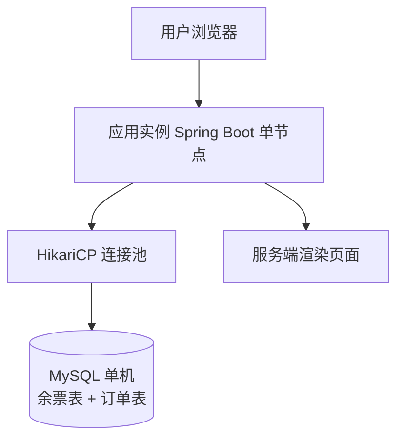
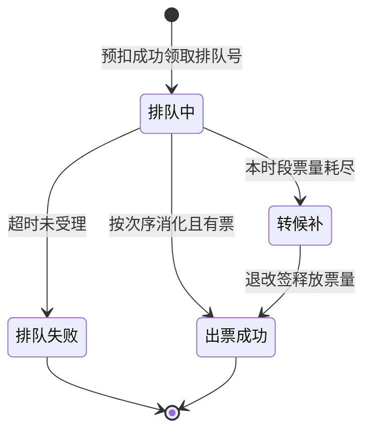
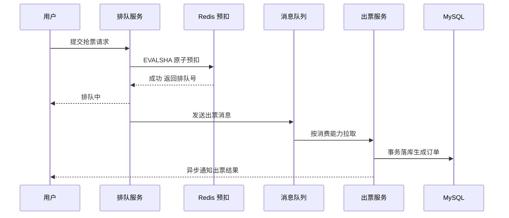
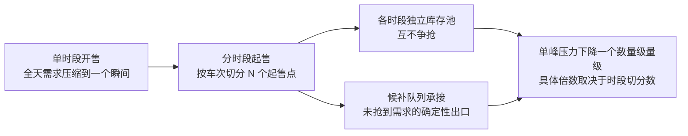
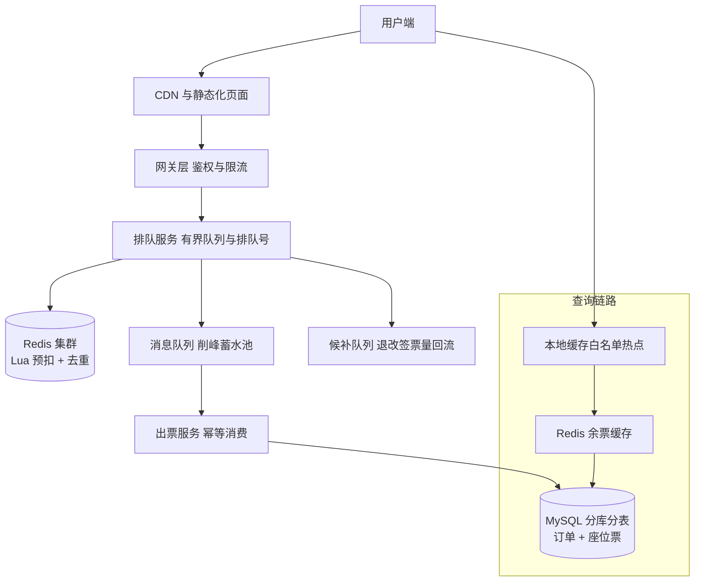

# 实战推演一：国家级抢票场景从零演进

> 本系列前 4 篇讲的是设计原则——端到端架构看[篇 1](1_秒杀系统端到端设计-整合.md)、数据模型看[篇 2](2_秒杀数据模型与接口设计-整合.md)、流量与部署看[篇 3](3_秒杀流量与部署架构-整合.md)、稳定性机制看[篇 4](4_秒杀稳定性机制与隐患治理-整合.md)。从本篇开始进入**实战推演**：拿一个真实案例，好比读者自己从零开发，按版本演进逐版讲——每一版都给可运行的核心代码、可执行的验证命令、以及它在真实流量下怎么坏、怎么修。
>
> 案例原型 = 业内公开报道的**国家级票务场景**（不点名任何公司/平台，下文统一用「国家级票务场景」表述；涉及规模的数字均为**公开报道口径**，架构推演部分为本文假设推演）。

## 一句话摘要

国家级抢票场景的从零演进路径是一条「**被流量逼出来的架构升级链**」：单机直扣（v0.1）→ 缓存前置 + 排队（v0.2）→ 异步削峰 + 分时段 + 多级查询缓存（v0.3）。每一版的存在理由都不是「更高级」，而是**上一版在真实洪峰下坏在了哪里**——读懂「怎么坏的」，比背终态架构图有用得多。

## 设计前的一个模型辨析：这不是「金融级一致性」问题

从零开发最容易犯的方向性错误：把秒杀当转账做。两者长得像（都要「减库存/减余额、防重复」），但模型相反——**金融转账的敌人是「不一致」（一分钱都不能差），可以接受串行化排队；秒杀的敌人是「热点」（百万人抢同一行），追求的是把串行变并行**，少量边缘不一致靠对账兜底。所以转账做法（DB 串行 + 强一致事务）照搬到秒杀 = 行锁热点 + 吞吐崩塌；秒杀做法（Redis 预扣 + 异步落单 + 对账）照搬到转账 = 灾难。**先辨模型，再选手段**——这个辨析决定了后面每一版的走向：我们的所有演进都在「把一致性从『实时强一致』放宽到『窗口内最终一致』」，换取并行度。

## 🎯 本文核心

**核心机制一句话**：抢票系统的架构演进，本质是把「瞬时不可能满足的需求」逐步**塑形**成「系统在时间维度上可以消化的负载」——扣减前置到内存、峰压摊到时段、出票延后到队列。

**机制链**：量级假设 → 单机直扣暴露 DB 极限 → 缓存前置拦截写压 → 排队削平到达曲线 → 异步解耦出票速率 → 分时段摊平需求 → 多级缓存拦截查询 → 对账兜底最终一致。

**失效点/边界**：这条链的每一环都有代价——缓存引入不一致、排队引入延迟、异步引入「先排队号后出票」的体验变化。量级不到就预支这些复杂度，是推演中最常见的过度设计。

## 一、第 0 步：需求与量级假设

### 1.1 这是一个什么量级的问题

从零开发的第一步不是建工程，是把量级假设写下来——**量级决定架构，架构不决定量级**。按公开报道口径，国家级票务场景的春运态大致是：

| 维度 | 口径 | 来源标注 |
|---|---|---|
| 日活跃用户 | 亿级（访问/查询口径） | 公开报道口径 |
| 峰值查询 | 每秒数十万到百万次 | 公开报道口径 |
| 业务节奏 | 春运开售即瞬时洪峰，全天多波次 | 公开报道口径 |
| 可用性要求 | 全国性公共服务，出票不可错、不可丢 | 公开报道口径 |

这四个数字里最关键的不是「大」，而是**读写比与瞬时性**：查询远多于下单（业内认知：抢票场景查询与下单请求比常在数十倍量级），且需求在开售瞬间集中到达。这两点决定了后面所有版本要解决的问题排序。

### 1.2 实名制：一个降低复杂度的关键约束

国家级票务场景有一个普通秒杀没有的约束——**实名制、一人一票**。直觉上它像是在增加复杂度，实际恰恰相反：

- **幂等键天然存在**：「身份证号 + 车次 + 席别」就是天然唯一键，一人一票的防刷约束直接落到数据库唯一索引上，不需要额外的业务去重逻辑；
- **刷单复杂度被压低**：一个身份只能买一张，黑产批量刷票的成本结构从「多账号多订单」变成「多真实身份」，攻击面收窄到身份维度；
- **退改签语义清晰**：票和人绑定，回补库存的对象明确，超卖后的资损追溯有据可依。

**设计思想**：把业务约束转译成数据完整性约束（唯一键），让数据库替业务挡住第一层错误——这是整个推演里性价比最高的一次「架构设计」，成本一条 DDL，收益是防重防刷的底层兜底。

### 1.3 从零开发的推演基线

本文推演的技术基线（均为假设，方便复现）：Spring Boot 单应用、MySQL 单机、JMeter 压测；车次以「G103 次二等座 2000 张」为样例。目标不是复刻真实系统，而是**每一版都能在你笔记本上跑起来、压起来、坏出来**。

## 二、v0.1 最小可行版：单机直扣

### 2.1 架构与数据模型



建表两句话就够——余票表和订单表，实名制唯一键直接建在订单表上：

```sql
CREATE TABLE ticket_stock (
  id        BIGINT PRIMARY KEY AUTO_INCREMENT,
  train_no  VARCHAR(16) NOT NULL COMMENT '车次',
  seat_type VARCHAR(16) NOT NULL COMMENT '席别',
  remain    INT         NOT NULL DEFAULT 0 COMMENT '余票数',
  UNIQUE KEY uk_train_seat (train_no, seat_type)
) ENGINE = InnoDB COMMENT '车次余票表';

CREATE TABLE ticket_order (
  id        BIGINT PRIMARY KEY AUTO_INCREMENT,
  train_no  VARCHAR(16) NOT NULL COMMENT '车次',
  seat_type VARCHAR(16) NOT NULL COMMENT '席别',
  id_no     VARCHAR(32) NOT NULL COMMENT '乘车人身份标识',
  status    VARCHAR(16) NOT NULL DEFAULT 'PAID' COMMENT '订单状态',
  UNIQUE KEY uk_train_seat_id (train_no, seat_type, id_no)
) ENGINE = InnoDB COMMENT '购票订单表';
```

### 2.2 核心代码：一个会超卖的 Controller

从零开发的第一版，绝大多数人会这么写——**先查余票，再减库存**：

```java
@RestController
@RequestMapping("/ticket")
public class TicketController {

    private final JdbcTemplate jdbc;

    public TicketController(JdbcTemplate jdbc) {
        this.jdbc = jdbc;
    }

    @PostMapping("/buy")
    public String buy(@RequestParam String trainNo,
                      @RequestParam String seatType,
                      @RequestParam String idNo) {
        // 第一步：先查余票（雷点一：查与扣之间没有任何原子性保证）
        Integer remain = jdbc.queryForObject(
            "SELECT remain FROM ticket_stock WHERE train_no = ? AND seat_type = ?",
            Integer.class, trainNo, seatType);
        if (remain == null || remain <= 0) {
            return "已售罄";
        }
        // 第二步：减库存 + 写订单（雷点二：减库存无条件，靠先查后扣的间隙赌运气）
        jdbc.update("UPDATE ticket_stock SET remain = remain - 1 " +
                    "WHERE train_no = ? AND seat_type = ?", trainNo, seatType);
        jdbc.update("INSERT INTO ticket_order (train_no, seat_type, id_no, status) " +
                    "VALUES (?, ?, ?, 'PAID')", trainNo, seatType, idNo);
        return "出票成功";
    }
}
```

### 2.3 demo 验证点：v0.1 怎么跑、怎么坏

**前置**：本地起 MySQL + 应用（默认端口 8080），导入建表 SQL，给 G103 二等座灌入 `remain = 2000`。

| 验证项 | 命令 | 预期输出 |
|---|---|---|
| 单发购票 | `curl -X POST 'http://127.0.0.1:8080/ticket/buy?trainNo=G103&seatType=二等座&idNo=TEST0001'` | `出票成功`，`remain` 减 1 |
| 压测 | `jmeter -n -t v01.jmx -l r01.jtl`（500 并发，2000 张票，20000 请求） | 汇总报告里 error 率异常偏高 |
| 超卖观察 | `SELECT remain FROM ticket_stock WHERE train_no='G103';` 与 `SELECT COUNT(*) FROM ticket_order;` | **remain 为负、订单数远超 2000**——超卖实锤 |
| 连接池观察 | `SHOW STATUS LIKE 'Threads_connected';` | 连接数逼近甚至打满上限 |

**常见报错与读法**：
- `HikariPool-1 - Connection is not available, request timed out after 30000ms`——连接池耗尽的标志性报错，意味着 DB 连接成了全局瓶颈；
- `Duplicate entry 'G103-二等座-TEST0001' for key 'uk_train_seat_id'`——唯一索引在拦截重复购票，这一条报错恰恰是**对的**（实名制约束在工作）；
- `Deadlock found when trying to get lock; try restarting transaction`——热点行锁冲突，并发上来后的必现故障。

## 三、首次洪峰：压测暴露的三个问题

v0.1 在单发请求下一切正常，第一次压测就把三个问题全部炸了出来。这一节按**症状 → 排查 → 根因 → 修复**完整走一遍——真实线上排查就是这个顺序。

### 3.1 问题一：连接池打满，接口集体超时

- **症状**：压测开始 30 秒后，购票接口与无关的管理后台接口**同时**超时；应用日志刷 `Connection is not available`。
- **排查**：`SHOW PROCESSLIST` 看到大量查询堆积在 `UPDATE ticket_stock` 上，状态多为 `update` 与锁等待；应用侧 HikariCP 活跃连接数长时间等于 `maximumPoolSize`（默认 10）。
- **根因**：所有请求的减库存都在竞争**同一热点行**的行锁，单行更新串行化；每个请求又占着一个连接等锁——锁等待把连接池也拖垮，故障从购票接口扩散到了全应用。**穿透到底层看，这是「热点行锁 + 连接池耦合」的复合故障**：锁等待不只是慢，它把全局连接资源也消耗掉了。
- **修复**：①把扣票请求的超时与连接占用收窄（快速失败，不在数据库里排队）；②读写连接池分离，管理后台走独立池；③更重要的是承认**单机 MySQL 对热点行的更新能力有物理上限**（业内认知：单行热点更新在每秒千次量级就会明显排队）——这个上限直接催生了 v0.2 的缓存前置。
- **追问链**：为什么不把连接池调大？调大连接池只是让更多请求**排队等锁**而不是排队等连接，锁竞争本身没有缓解，反而增加上下文切换开销——连接池大小的本质是「数据库能同时处理多少事务」，不是「能挂多少请求」。

### 3.2 问题二：超卖——先查后扣的原子性漏洞

- **症状**：压测结束后 `remain = -37`，订单 2037 条，票只有 2000 张。这是资损级缺陷，上线即事故。
- **排查**：复现最小用例：两个并发请求同时通过第一步的 `remain > 0` 检查，然后各自执行无条件减库存。
- **根因**：「查」与「扣」是两个独立语句，间隙里余票可以被其他请求修改——检查结果在执行扣减时已经过期。**这不是代码写错，是「检查-执行」模式在并发下的必然失效**。
- **修复**：把检查和扣减合并成一条**条件原子更新**，用影响行数判断成败：

```sql
UPDATE ticket_stock
   SET remain = remain - 1
 WHERE train_no = ?
   AND seat_type = ?
   AND remain > 0;
-- 影响行数 = 0 即售罄，绝不写订单
```

再叠加订单表唯一索引兜底重复请求——即使上游重试，`Duplicate entry` 也会把第二次插入挡掉。修复后验证：压测同样 20000 请求，`remain` 恰好归零、订单数恰好 2000，一条不多一条不少。
- **反方案**：为什么不用 `SELECT ... FOR UPDATE` 悲观锁？它同样能保证原子性，但显式锁把并发请求串行化在数据库里排队——回到 3.1 的连接池困局。条件原子更新把「排队」交给 InnoDB 行锁本身，持锁时间最短。
- **追问链**：唯一索引冲突会不会误伤正常请求？不会——冲突只发生在「同一身份重复请求」，这正是要拦的；不同身份之间互不冲突。实名制唯一键在这里第二次体现价值。

### 3.3 问题三：查询打垮库——被忽略的主流量

- **症状**：购票接口还扛得住，**余票查询**先把数据库 CPU 打满了——压测脚本里查询与下单按真实比例（数十比一，业内认知口径）混入后，数据库先死在查询上。
- **排查**：`SHOW GLOBAL STATUS LIKE 'Innodb_rows_read'` 增速远超写入；慢查询日志里全是余票 SELECT。
- **根因**：抢票场景的本质是「**亿级人围观，少数人成交**」——查询流量天然比下单高一到两个数量级，却和下单共用同一个数据库。v0.1 把主流量当成了附属流量，这是量级假设没做足的代价。
- **修复**：v0.1 内先做两件轻量的事——余票查询加 1 秒短缓存、页面静态化兜底；根治则交给 v0.3 的多级查询缓存。
- **踩坑教训**：评估容量时只按 TPS 算下单量是抢票系统最常见的立项失误——**QPS 口径必须按最重的读流量算**。

**复盘 v0.1**：三个问题指向同一个结论——单机直扣的架构上限，由「热点行更新能力」和「共享数据库的读放大」两堵墙决定。墙不搬走，加机器没用；这就是 v0.2 的存在理由。

## 四、v0.2：缓存前置 + 排队机制

### 4.1 Redis 预扣：把热点行搬进内存

v0.2 的核心动作只有一个：**把扣减从 MySQL 热点行搬到 Redis**。库存开售前预热进 Redis，扣减用一段 Lua 脚本原子完成——校验、去重、扣减一气呵成，不存在「先查后扣」的间隙：

```lua
-- decr_stock.lua
-- KEYS[1] = 库存 key  KEYS[2] = 已购去重 set  ARGV[1] = 乘车人身份标识
-- 返回：1 = 预扣成功进入排队；0 = 售罄；-1 = 重复请求
if redis.call('SISMEMBER', KEYS[2], ARGV[1]) == 1 then
    return -1
end
local remain = tonumber(redis.call('GET', KEYS[1]) or '-1')
if remain <= 0 then
    return 0
end
redis.call('DECR', KEYS[1])
redis.call('SADD', KEYS[2], ARGV[1])
return 1
```

```java
// 预扣入口：脚本用 EVALSHA 执行，避免每次传输脚本体
DefaultRedisScript<Long> script = new DefaultRedisScript<>("decr_stock_sha", Long.class);
Long r = stringRedisTemplate.execute(script,
        List.of("stock:G103:二等座", "bought:G103:二等座"), idNo);
if (r == null || r == 0) { return "已售罄"; }
if (r == -1)            { return "请勿重复提交"; }
String queueNo = queueService.enqueue(trainNo, seatType, idNo);  // 进入排队
return "排队中，排队号 " + queueNo;
```

注意返回语义的变化：预扣成功返回的是**排队号而不是票**——这是 v0.2 最重要的接口语义变更，为 v0.3 的异步出票铺路。

**demo 验证点**：
- **前置**：Redis 预热 `SET stock:G103:二等座 2000`，脚本经 `SCRIPT LOAD` 加载；
- **验证**：`redis-cli EVAL "return redis.call('GET', 'stock:G103:二等座')" 0` 观察递减；压测后比对 `GET stock:...` 与 DB `SELECT remain`，允许短暂差异、要求对账后一致；
- **预期输出**：`(integer) 1999`（单发预扣后）；压测汇总 QPS 相比 v0.1 提升一个数量级（具体倍数以压测为准，业内认知：内存扣减对热点行直扣常有数十倍提升空间）；
- **常见报错**：`NOSCRIPT No matching script. Please use EVAL`——脚本未先 `SCRIPT LOAD` 或 Redis 发生了主从切换，处理方式是客户端捕获后降级重试 `EVAL`；集群模式下报 `MOVED`——key 没落到该节点，预扣的库存 key 与去重 key 必须用 hash tag（如 `{G103}`）固定在同一 slot。

### 4.2 为什么是排队，而不是拦截

**反方案**：更常见的做法是把超出容量的请求直接拒绝（快速失败）。单看技术指标它更简单，但国家级场景选择**排队**而不是拦截，公开报道口径下该类系统也以排队/候补为核心能力，理由有三层：

1. **需求总量是确定的，只是到达时间不确定**——2000 张票总有人买到，排队只是把「谁在什么毫秒到达」的运气问题，转成「谁先提交」的次序问题；拦截则把大量**本可成功**的需求直接弹走；
2. **排队是确定性的用户体验**——「前面还有 5 万人」比「请求失败请重试」的焦虑感低得多，且天然抑制了失败重试带来的二次洪峰（拦截模式最大的隐藏成本就是失败重试风暴）；
3. **排队的出口速率可控**——后端按自己的能力消化队列，到达曲线与处理曲线解耦，这正是削峰的底层机制。



**设计思想**：排队状态机里最关键的设计是「排队 → 候补」的转化——候补把「没抢到」从终态变成**等待态**，退票释放的票量自动流转给候补队列。这已经不只是技术削峰，而是把削峰做成了产品能力。

**追问链**：排队队列会不会太长导致体验崩坏？会的，所以队列长度是核心参数——按「出票速率 × 可接受等待时长」反推上限，超出的部分引导进候补或明确告知无票。排队不是无限缓冲，是一个有界的、出口速率受控的蓄水池。

## 五、v0.3：异步削峰 + 分时段售票 + 多级查询缓存

### 5.1 异步出票：MQ 把「受理」和「出票」解耦

v0.2 还剩一个别扭：预扣在 Redis，落库在 MySQL，若同步等待落库完成再返回，MySQL 的写入能力又成了瓶颈——**预扣挡住了到达洪峰，落库却要匹配出票的真实能力**。解法是消息队列：预扣成功只发一条消息，出票服务按自己的节奏消费：



出票消费端必须**幂等**：唯一索引 `uk_train_seat_id` 在这里第三次出场——消息重复投递时，第二次落库被唯一键挡掉，不需要任何额外的幂等表。消费并发数按「下游 MySQL 写入容量」设定（业内认知：消费速率上限 = 消费者数 × 单条落库速率，配多了只会把数据库压垮）。

**demo 验证点**：压测中观察队列堆积深度（RabbitMQ 用 `rabbitmqctl list_queues name messages`，RocketMQ 用 `mqadmin consumerProgress -g ticket-group`），**预期输出**是堆积先涨后平稳回落、出票订单数最终等于预扣成功数；**常见报错**是消费端 `Duplicate entry` 刷屏——这不是故障，是幂等兜底在工作，但若刷屏比例异常高则要查消息重复投递的根因（生产端重发或消费超时重试）。

**反方案**：为什么不用线程池在应用内异步就算了？应用内异步把「受理」和「出票」绑在同一个进程的生命周期上——发布、重启、故障都会丢掉在途请求；独立 MQ 至少保证消息不丢，且出票能力可以独立扩缩。代价是多一套中间件与最终一致的复杂度，这笔 Trade-off 在百万级以上量级是值得的。

### 5.2 分时段售票：把一个巨峰切成多个小峰

公开报道口径下，国家级票务场景的真实演进方向之一就是**分时段起售**：不同车次/区间的票分配到一天中多个起售时间点，把「开售瞬间一个巨峰」切成「全天多个小峰」。



分时段的本质是**需求侧塑形**：前两版都在供给侧做文章（更快的扣减、更稳的出口），分时段第一次直接改需求的时间分布。它与排队/候补配合成完整闭环——没抢到的需求不消失，而是进入候补等待退改签释放。

**追问链**：为什么公开报道口径下这类系统宁可改运营规则也不无限扩容？因为春运峰值的瞬时性太极端——为每年几十个瞬间建全年闲置的容量，成本结构完全不合理；把需求在时间轴上摊平，是唯一「用规则换资源」的解法。**这也是整个推演里最重要的战略判断：国家级量级的峰值问题，最终解不在技术层，而在需求塑形层。**

### 5.3 多级查询缓存：拦截主流量

回到 3.3 的查询洪峰——终态方案是多级缓存：**本地缓存（进程内）→ Redis → MySQL**，余票数这类「强热点、可短时容忍偏差」的数据放最外层。

- 本地缓存只放**白名单热点车次**（每实例几百 MB 上限，业内认知量级），容量纪律防止缓存本身变成故障源；
- Redis 层做全量余票缓存，TTL 1-2 秒加随机抖动，防同批过期击穿；
- 缓存更新由出票事件驱动刷新 + 短 TTL 兜底，接受秒级不一致——查询场景「看到 1 秒前的余票」是可接受的产品语义，购票扣减才要求强一致。

**反方案**：为什么不追求查询强一致？让查询每次穿透到 DB 拿实时值，等于把主流量直连数据库——3.3 已经演示过结局。**读写分离的一致性等级**是抢票系统架构设计的核心权衡：写链路强一致（扣减），读链路最终一致（查询），两条链路分开定标准。

## 六、终态架构与版本演进总表



| 版本 | 承载量级（假设推演） | 暴露的瓶颈 | 核心解法 | 给下游的接口语义 |
|---|---|---|---|---|
| v0.1 | 日常售票（十万级 PV 以下） | 热点行锁 / 超卖 / 读放大 | 条件原子更新 + 唯一索引 | 同步出票 |
| v0.2 | 节假日高峰（百万级 QPS 查询口径） | DB 写入物理上限 | Redis 预扣 + 有界排队 | 返回排队号 |
| v0.3 | 春运级（亿级日活、数十万至百万 QPS，公开报道口径） | 需求瞬时集中 | MQ 异步 + 分时段 + 多级缓存 | 异步通知出票结果 |

### 步骤级操作：三版升级与回退手册

**前置**：每一版上线前完成基线压测并记录数字；所有切换必须有开关，所有开关必须演练过回退。

| 步骤 | 前置 | 命令/动作 | 验证 | 回退 |
|---|---|---|---|---|
| 1. v0.1 基线压测 | 建表 + 应用就绪 | `jmeter -n -t v01.jmx -l r01.jtl` | 记录 QPS 与错误率基线 | 停止压测 |
| 2. 修超卖 | 备份 ticket_stock | 上线条件原子扣减 + 唯一索引 | 并发压测后 remain = 0 且订单数 = 票数 | 恢复旧代码，drop 新索引 |
| 3. Redis 预热切换 | Redis 集群就绪 | `SCRIPT LOAD` 后开预扣开关 | redis-cli 与 DB 对账一致 | 关开关切回 DB 直扣 |
| 4. 排队服务上线 | 预扣稳定运行 | 发布排队服务，配置队列上限 | 排队号发放速率 ≤ 出票消化速率 | 关闭排队开关直连预扣 |
| 5. MQ 异步出票 | MQ 集群就绪 + 幂等验证 | 上线生产/消费两端 | 堆积回落、订单数 = 预扣数 | 开关切回同步出票 |
| 6. 分时段售票 | 运营排期确认 | 配置时段表 + 库存分桶 | 各起售点峰值独立可观测 | 合并回单时段配置 |
| 7. 多级查询缓存 | 热点车次白名单确认 | 发布本地缓存层 | 查询 DB QPS 下降一个量级 | 摘除本地缓存层 |

### 参数级配置清单

| 配置项 | 默认值 | 分档推荐 | 为什么 |
|---|---|---|---|
| HikariCP maximumPoolSize | 10 | 十万级 20-50；百万级以上读写分离池 | 连接池上限本质是数据库并发事务容量，调大只转移排队位置 |
| 余票查询缓存 TTL | 无 | 查询链路 1-2 秒 + 随机抖动 | 秒级偏差可接受；抖动防同批过期击穿 |
| 本地缓存容量 | 无 | 每实例 256MB 内、白名单热点 | 本地缓存无失效广播，容量失控即内存事故 |
| 排队队列上限 | 无 | 出票速率 × 可接受等待时长反推 | 排队是有界蓄水池，无限队列 = 延迟事故 |
| 网关限流阈值 | 无 | 按下游最短板（预扣或出票）压测定 | 没有压测数字的限流是装饰 |
| MQ 消费并发数 | 1 | 百万级按 DB 写入容量设定 | 消费速率上限决定出票吞吐，盲目调大压垮 DB |
| 分时段数量 | 1 | 高峰日 8-12 个起售点（公开报道口径量级） | 时段越多单峰越平，但运营与用户认知成本上升 |
| 对账周期 | 无 | 秒级增量 + 分钟级全量比对 | 缓存/异步引入的一切不一致，最终靠对账收敛 |
| 预扣脚本执行方式 | EVAL | EVALSHA + 失败降级 EVAL | 省带宽且原子；主从切换后 NOSCRIPT 需降级重试 |

## 七、不同量级的思考：架构约束驱动解法

量级不是数字标签，是架构约束的边界——每一档的解法完全不同，因为**约束来源**完全不同：

- **十万级（日常售票，单城单线路）**：约束来源是单机容量——MySQL 单机热点行更新与连接数上限（业内认知：热点行千次/秒量级即排队）决定一切；思考方式是「**直扣驱动**」——条件原子更新 + 唯一索引就是全部，这一档的核心问题是「扣减对不对」，而不是「架构花不花」
- **百万级（节假日高峰，查询数十万 QPS）**：约束来自读放大与写上限的分离——查询流量比下单高一到两个数量级，共享数据库必然先死于查询；思考方式是「**缓存前置驱动**」——把写扣减搬进内存、把读查询挡在缓存，这一档的核心问题是「主流量落在哪一层」，而不是「机器加多少台」
- **千万级（春运临界态，开售瞬间洪峰）**：约束来自到达曲线与处理曲线的错配——哪怕每一层都够快，瞬时就绪需求也远超系统消纳速率；思考方式是「**削峰驱动**」——有界排队 + 异步出票把到达曲线整形后再消化，这一档的核心问题是「峰值怎么摊平」，而不是「单点扛多强」
- **亿级（国家级票务场景日常，公开报道口径：日活亿级、峰值每秒数十万到百万次查询）**：约束来自需求本身的时间分布与物理规律——瞬时峰值极端到建全年匹配容量不经济，跨地域时延不可压缩；思考方式是「**需求塑形驱动**」——分时段改需求时间分布、候补改需求失败语义、单元化按用户切分流量与数据，这一档的核心问题是「需求能不能被规则重塑」，而不是「技术扛不扛得住」

思考方式总结：十万级靠「直扣驱动」把正确性做实，百万级靠「缓存前置驱动」分离读写，千万级靠「削峰驱动」整形流量曲线，亿级靠「需求塑形驱动」改变问题本身——每一档的思考方式必须匹配它的约束来源（单机容量/读写错配/曲线错配/需求分布），解法是思考的产物，不是参数的排列。

**自下而上与触发升级**：先实测档位再选思考方式——峰值 QPS、读写比、热点集中度三个实测值决定你真实站在哪一档，不预支上一档的复杂度，也不滞留在下一档的侥幸里。触发升级的信号：连接池持续打满、查询 DB 命中率跌穿基线、队列堆积回落时间超过可接受等待——任一信号出现，思考方式必须随档升级（直扣驱动 → 缓存前置驱动 → 削峰驱动 → 需求塑形驱动）。锚点永远是约束来源：物理层或需求分布变了，解法才跟着变；业务数字翻倍只是信号，约束迁移才是升级依据。

## 八、什么时候用/不用这条演进路径

**什么时候用**：
- 需求**可预估、库存有限、瞬时集中**——票务、限量券、名额类活动，v0.1 → v0.3 的路径与组件选型直接适用；
- 实名或准实名约束可用唯一键表达时，优先用数据完整性约束兜底防刷，本推演的幂等设计可直接复用。

**什么时候不用**：
- 库存无限或语义为「登记意向」的场景（报名、预约登记）——直接普通表单 + 队列即可，排队与预扣全是过度设计；
- 峰值平缓、读写比正常的日常交易——标准电商下单链路足够，别为想象中的洪峰预支异步一致性复杂度。

**明确推荐**：严格按 v0.1 → v0.2 → v0.3 演进，每一版由真实瓶颈触发升级，**不要跳版**。跨周期看（未来 5 年回头看依然成立），这条路径的价值不在终态架构，而在「每次升级都有压测数字支撑」的决策纪律——跨系统架构能力的积累来自版本间的因果链，不是终态图。

## 九、Trade-off 总账

| 决策 | 收益 | 代价 | 量级适配 |
|---|---|---|---|
| 条件原子扣减 | 原子性正确、持锁最短 | 热点行吞吐仍受 DB 物理上限 | 全档必做 |
| Redis 预扣 | 写压与 DB 解耦、提升数十倍空间（业内认知） | 缓存与 DB 短暂不一致，需对账收敛 | 百万级起 |
| 有界排队 | 拦截变次序、抑制重试风暴、体验确定 | 实时性下降、需排队页与通知链路 | 千万级起 |
| MQ 异步出票 | 受理与出票解耦、故障域隔离 | 「先排队号后出票」的语义变化、最终一致 | 百万级起 |
| 分时段售票 | 单峰降一个数量级量级（取决于切分数） | 运营约束、用户需记忆起售时间 | 亿级首选 |
| 多级查询缓存 | 查询成本趋近于零 | 一致性窗口与缓存治理复杂度 | 千万级起 |

## 💡 实战提示

💡 **超卖修复别只改代码，先补唯一索引**。条件原子更新解决并发扣减，唯一索引解决重复请求——两者缺一，任何一次上游重试都可能穿透。这是成本最低的资损防线，第一版就该有。

💡 **每个版本上线前先跑同一套压测脚本**。v0.1 到 v0.3 的所有「提升一个数量级」都必须是同一脚本同一场景下的对比数字——换了脚本的对比没有意义，没有基线的优化无法证明。

💡 **排队队列必须设上限并演练溢出**。队列打满时的行为（转候补/明确告知无票）要写进代码而不是临场决定——无限排队是延迟事故的温床，有界蓄水池才是削峰。

💡 **预扣 key 用 hash tag 固定 slot**。Redis 集群模式下库存 key 与去重 key 必须同 slot（如 `{G103}:stock`、`{G103}:bought`），否则 Lua 脚本直接报 `MOVED`——这是预扣方案上集群的第一坑。

💡 **回退开关是版本的一部分**。每版一个开关、每个开关演练一次回退——「能回退的升级」和「不能回退的升级」是两种风险等级，推演里所有步骤级操作都建立在开关存在的前提上。

## 你们可能会问

**问：既然终态是 v0.3，为什么不直接按终态开发，要走三版？**
答：因为终态里的每个组件都在回答一个你还没遇到的问题——没有压过 v0.1 的超卖，你对唯一索引的敬畏是抽象的；没见过连接池打满扩散到全应用，你不会理解「快速失败」四个字的分量。直接开发终态的最大风险不是慢，是**每个组件都配了、每个参数都不会调**——参数来自故障，不来自文档。

**问：Redis 预扣成功了但后续落库失败，票不是少了一张吗？**
答：会短暂少一张，靠两级机制收敛：消费失败的消息进重试与死信，人工或自动补偿后回补库存；定时对账（秒级增量 + 分钟级全量）兜底发现一切漏网差异。这是异步化的标准代价——用对账体系换同步事务的强一致，最终一致不等于放任不一致。

**问：排队和限流有什么本质区别？都让一部分请求等/走不行吗？**
答：限流回答「系统只接得住多少」，排队回答「接住之后按什么次序兑现」。限流拒绝的请求需要用户重试（重试风暴是隐藏成本），排队把请求**保留**下来按序处理——国家级场景需求总量确定，保留比拒绝更合理；而排队自身的入口仍需要限流保护，两者是上下游关系不是二选一。

**问：分时段售票把需求推给候补，用户体验是不是变差了？**
答：对比对象不是「秒抢到」，而是「抢不到且无任何确定性」——候补给出的是明确承诺（有退票按次序兑现），比无限重试的体验确定得多。公开报道口径下这类系统候补兑现已成为重要出票渠道，说明用户用行为投了票。

**问：这套推演能直接搬到我司的秒杀活动吗？**
答：路径可搬，参数不可搬。v0.1 → v0.3 的因果链（热点行 → 预扣 → 排队 → 削峰 → 塑形）是量级约束的通用映射，但每一档的阈值、队列长度、时段切分都依赖你自己的压测数字与业务节奏——照抄数字是最常见的落地事故来源。

## 开放问题

- 排队次序的公平性与防作弊如何兼得？进队列时间可伪造（脚本提前占位），真实系统在「先到先得」与「按身份/设备风控加权」之间如何取舍，业内并无定论，值得结合具体业务讨论；
- 分时段的时段切分是运营问题还是算法问题？公开报道口径只确认了「切」，切几段、按什么粒度切（车次/区间/席别）缺乏公开的量化方法，本文按 8-12 段假设，欢迎补充实测口径；
- 候补兑现率能否建模？退改签释放的票量分布决定了候补承诺的可信度，这个预测问题（本质是运力退票率的时间序列预测）本文未展开，留作后续专题。

## 🎯 核心带走

- **核心一句话**：抢票系统的版本演进，本质是把「瞬时不可能满足的需求」逐级塑形成「时间维度上可消化的负载」——扣减进内存、出票进队列、需求进时段。
- **链条复述**：量级假设 → 原子直扣（唯一索引兜底）→ 缓存前置（预扣挡写压）→ 有界排队（拦截变次序）→ 异步出票（受理与兑现解耦）→ 分时段塑形（改需求分布）→ 多级缓存（拦截主流量）→ 对账兜底（最终一致收敛）。
- **失效点/边界**：每一环都有代价——预扣引入不一致、排队引入延迟、异步引入语义变化；量级不到就预支复杂度 = 过度设计。升级必须由实测瓶颈触发，参数必须来自自家压测，回退开关必须先于上线存在。

## 📌 数据与事实声明

- 写于 2026-09-23；案例为业内公开报道的国家级票务场景推演，**不点名任何公司/平台**
- 规模数字（日活亿级、峰值每秒数十万到百万次查询、候补/分时段机制）均为**公开报道口径**
- 技术阈值（热点行千次/秒量级排队、本地缓存容量、查询与下单数十倍比等）为**业内认知**，精确数字必须以自家压测为准
- v0.1 → v0.3 的版本划分、代码与配置为本文假设推演，非任何真实系统源码

## 📚 参考资料

| 类型 | 标题 | 来源 |
|---|---|---|
| 系列前作 | 秒杀系统端到端设计（设计原则总纲） | 本系列篇 1 |
| 系列前作 | 秒杀数据模型与接口设计 | 本系列篇 2 |
| 系列前作 | 秒杀流量与部署架构 | 本系列篇 3 |
| 系列前作 | 秒杀稳定性机制与隐患治理 | 本系列篇 4 |
| 现有文章 | 缓存三大问题 + 热点 Key 治理 | 本仓库 docs/middleware/redis/ |
| 现有文章 | 限流熔断参数化 | 本仓库 docs/architecture/system-design/stability/ |
| 行业实践 | 国家级票务平台候补与分时段售票机制 | 公开报道 |
| 行业实践 | 大促削峰与异步化公开技术分享 | 公开报道 |
