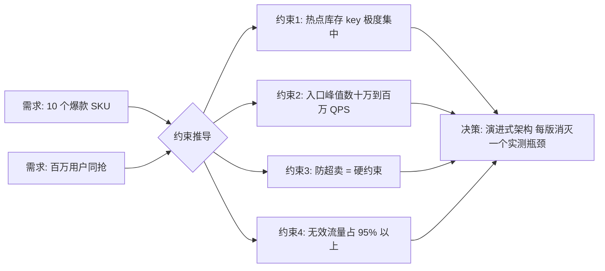
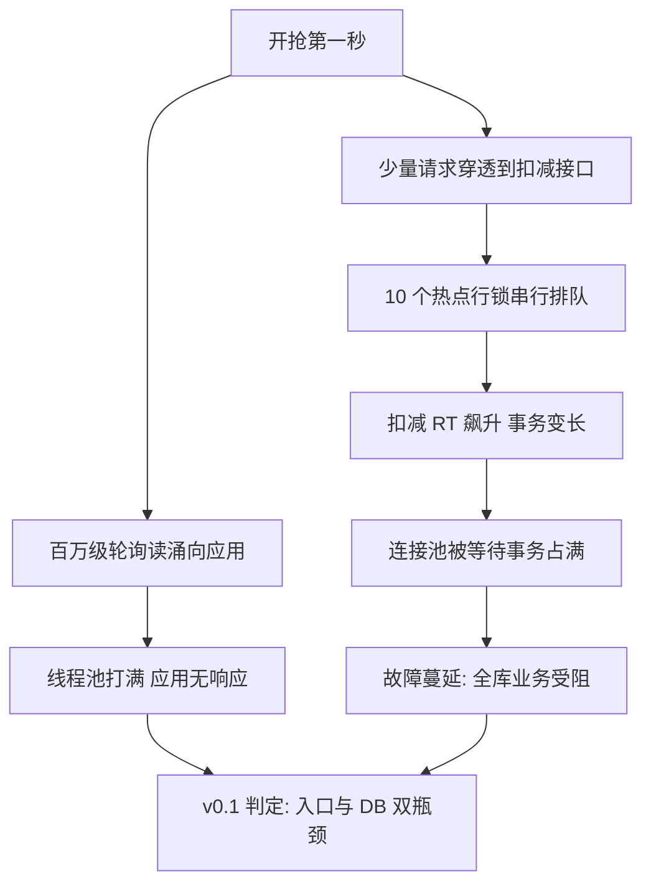
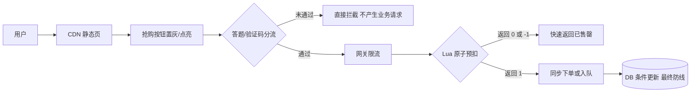
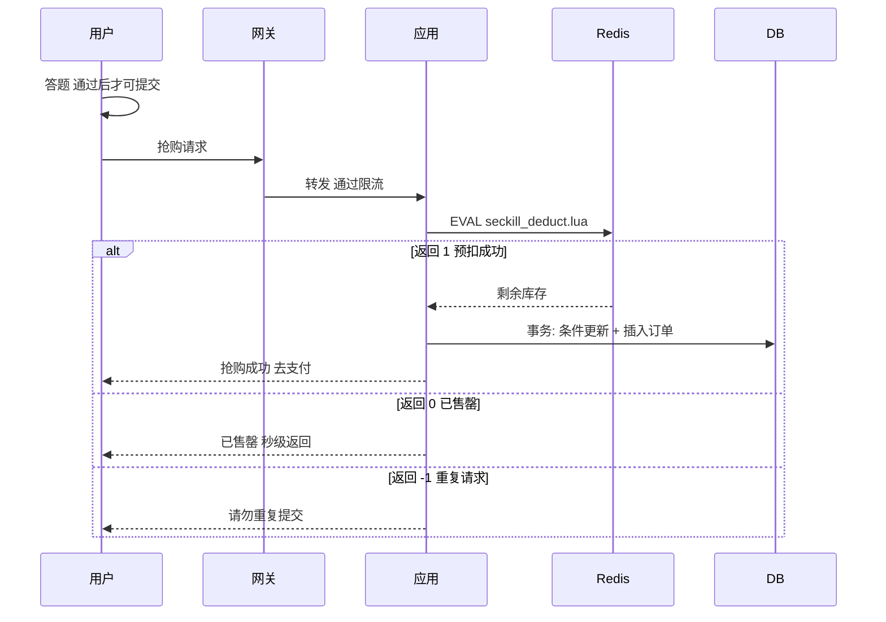
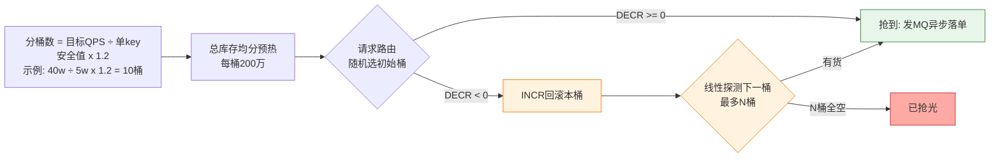
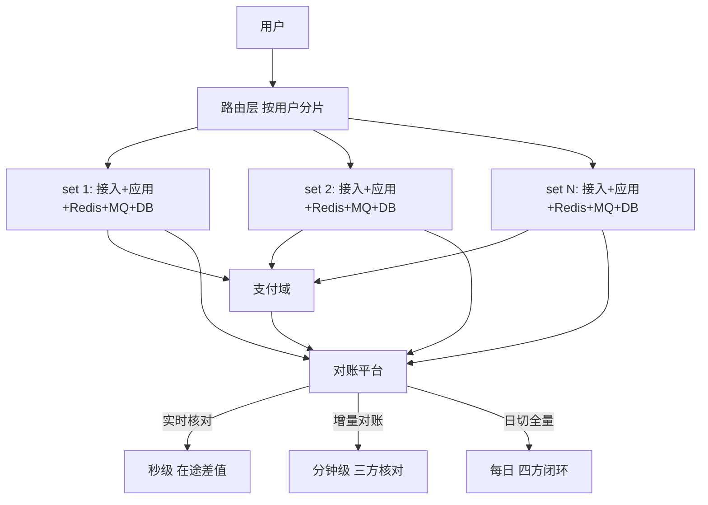
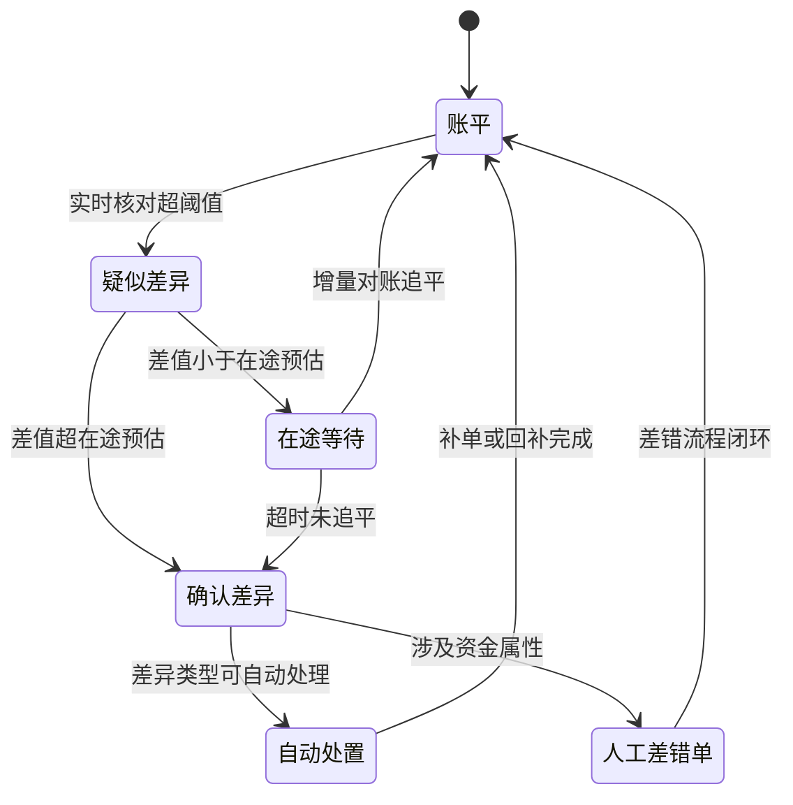

# 实战推演二：头部电商大促秒杀从零演进

> 系列第二个「真实案例从零开发全程推演」。案例原型 = 业内公开报道口径的头部电商大促秒杀/抢购场景（热点商品库存、答题分流、单元化部署均有大量公开技术分享），**不点名任何公司**，全文以「公开报道口径」「业内认知」标注数字来源。与[篇 5 实战推演一](5_实战推演一：国家级抢票场景从零演进-整合.md)（国家级抢票场景从零演进）的分工：篇 5 讲抢票场景的排队放行与分时段售票演进，本篇推演电商大促场景——10 个爆款 SKU 的热点商品库存、真实下单转化（下单 + 支付 + 履约，超卖即资损），从 v0.1 的单服务直连 DB，一步步演进到 v0.4 的单元化终态，每一版都给出核心代码、暴露的问题和代价账单。机制原理不在本篇展开：库存模型见[篇 2](2_秒杀数据模型与接口设计-整合.md)，部署规格见[篇 3](3_秒杀流量与部署架构-整合.md)，熔断参数见[篇 4](4_秒杀稳定性机制与隐患治理-整合.md)，端到端全景见[篇 1](1_秒杀系统端到端设计-整合.md)。

## 一句话摘要

大促秒杀从零演进的核心逻辑：**每一版只为消灭上一版实测暴露的那个瓶颈而生**——v0.1 暴露行锁热点，v0.2 用漏斗 + Redis 原子扣减挡住流量，v0.3 用异步 + 分桶解开耦合与热点，v0.4 用单元化 + 对账控制爆炸半径并守住资金底线。

## 🎯 本文核心

**核心机制一句话**：大促秒杀的架构不是设计出来的，是在「无效流量占比 95% 以上（业内认知）」这个前提下，用漏斗逐层过滤 + 热点拆分 + 异步化 + 单元化四步演进出来的——每一步的依据都是上一版的压测数据，不是经验拍板。

**机制链**：需求量化 → v0.1 直连（暴露行锁热点）→ v0.2 漏斗 + 原子预扣（挡流量）→ v0.3 异步 + 分桶 + 链路隔离（解耦合拆热点）→ v0.4 单元化 + 资金级对账（控爆炸半径）→ 代价复盘。

**失效点/边界**：本篇的演进路径依赖「量级驱动」假设——如果业务量级停在十万级，v0.2 就是终态，继续往下走是过度设计；对账能兜的是「最终一致」，兜不了「超卖后的资损善后」，所以 v0.2 起防超卖就是硬约束而非优化项。

**跨周期经验**：回顾业内公开分享的大促架构演变（公开报道口径），从单体到单元化普遍经历了多年迭代——这条路径上没有一步是「提前设计好」的，都是量级逼近瓶颈时被迫升级。预留扩展点（分桶 key 结构、MQ topic 规划、按用户分片的路由标识）但不预支复杂度，是跨多个大促周期沉淀下来的取舍纪律。

## 第 0 步：需求与约束（一场大促的原始问题）

一切从一份需求开始：**一场平台级大促，10 个爆款 SKU 限量抢购，预计百万用户同一时间涌入，且是真实下单转化**——用户抢到的是商品库存，要创建真实订单、走支付、发货履约，不是发一张无资金属性的券。

先把需求翻译成可推导的约束：

| 维度 | 数值（口径标注） | 推导出的约束 |
|---|---|---|
| 爆款 SKU | 10 个，单品库存千级到万级（公开报道口径） | 热点极度集中：10 个库存 key 承接全部写流量 |
| 参与用户 | 预计百万级同时抢（需求方口径） | 入口峰值 QPS 达数十万到百万级（业内认知：按瞬时并发折算） |
| 转化形态 | 真实下单 + 支付 | 超卖 = 资损 + 履约违约；订单链路必须与支付对账 |
| 无效流量 | 95% 以上的请求注定抢不到（业内认知） | 入口带宽和缓存读是第一瓶颈，先于库存写 |
| 活动窗口 | 秒级开抢、分钟级结束 | 峰值是脉冲形态，弹性扩容来不及，只能事前备容 |



**追问链 ①**：为什么「无效流量占比 95% 以上」是第一约束而不是「库存写入」？因为 1 万件库存面对百万级请求，无论后端多强，99% 的请求注定失败——如果把它们全部放进业务链路，每一层都在为注定失败的请求消耗容量。所以第一优先级不是「把扣减做快」，而是「让注定失败的请求尽早离开」：在离用户最近的地方就给出「已售罄」，这决定了后续所有版本的方向。

**反方案分析 ①**：为什么不一开始就按终态设计单元化架构？因为单元化的改造成本极高（接入层路由改造、数据分片、跨单元对账），而 v0.1 阶段连「瓶颈到底在哪一层」都没有实测数据——先用最小架构压测出真实瓶颈，再针对性升级，避免为不存在的瓶颈付费。这也是业内公开分享中反复出现的教训：为想象中的峰值建设的容量，大促后 90% 闲置（业内认知）。

## v0.1：单服务 + DB 扣减 + 前端轮询（能跑，但跑不过开抢第一秒）

v0.1 的形态：一个 Spring Boot 服务 + 单库 MySQL，前端每秒轮询库存接口，扣减直接操作 DB。这是任何团队从零起步都会写的版本——先让它正确，再让它扛得住。

扣减接口核心代码：

```java
@PostMapping("/seckill/execute")
public Result execute(@RequestParam Long skuId, @RequestParam Long userId) {
    // 1. 校验是否已抢到（幂等，防同一用户重复下单）
    if (orderMapper.countByUserAndSku(skuId, userId) > 0) {
        return Result.fail("重复请求");
    }
    // 2. 扣库存：条件更新，影响行数为 0 即售罄
    int affected = stockMapper.deduct(skuId);
    if (affected == 0) {
        return Result.fail("已售罄");
    }
    // 3. 创建订单（同一事务）
    orderMapper.insert(buildOrder(skuId, userId));
    return Result.ok();
}
```

扣库存的 SQL（条件更新式乐观扣减，不依赖版本号列）：

```sql
UPDATE seckill_stock
SET remain = remain - 1, updated_at = NOW()
WHERE sku_id = #{skuId}
  AND remain > 0;
-- affected_rows = 0 表示已售罄；业务语义上不会扣成负数
```

这个 SQL 本身是**正确的**——`remain > 0` 的条件更新在数据库语义上保证不超卖。问题不在正确性，在吞吐：v0.1 压测推演（数据为业内认知口径的典型量级）暴露出三个致命瓶颈。

### v0.1 的三个瓶颈

| 瓶颈 | 现象 | 底层原因 |
|---|---|---|
| DB 行锁热点 | 开抢瞬间扣减 RT 从 2ms 飙到秒级 | 同一 SKU 的 UPDATE 全部竞争同一行锁，InnoDB 行内串行化，单行更新吞吐上限约几百到千级 TPS（业内认知） |
| 无效流量占满入口 | 轮询读流量把应用线程池和带宽打满 | 百万用户 × 1 秒 1 次轮询 = 百万级 QPS 读，全是「注定失败」的查询 |
| 应用与 DB 连锁拖垮 | 扣减变慢 → 事务变长 → 连接池耗尽 → 订单查询也挂 | 热点行锁等待队列里的事务占着连接不放，故障从热点 SKU 蔓延到全库 |



**事故叙事 1（行业通病推演，公开报道口径）**：业内公开复盘过多次同型事故——某次大促开抢 10 秒内，扣减接口 RT 从毫秒级恶化到秒级，DB 连接池 200 个连接全部被等待热点行锁的事务占住；随后订单查询、支付回调等共享同一连接池的业务全部超时，故障面从「秒杀不可用」扩大到「全站交易受阻」，最终人工把秒杀应用下线才恢复主站。根因链条值得记住：**不是扣减太慢，而是扣减的等待把共享资源（连接池）拖死，进而拖死无辜业务**。这正是 v0.3「链路隔离」要解的问题，也是[篇 4](4_秒杀稳定性机制与隐患治理-整合.md) 事中处理一章的机制基础。

**追问链 ②**：为什么条件更新已经防超卖，吞吐还是上不去？因为防超卖靠的是「数据库串行化对同一行的修改」——10 个爆款 SKU 的所有扣减在各自行上排队，吞吐天花板 = 单行更新 TPS，约几百到千级（业内认知），与集群里有多少台应用服务器无关。加应用机器加的是「排队的人数」，不是「柜台的办理速度」。要突破这个天花板，只有两条路：把扣减挪到能并行的地方（Redis/Lua，v0.2），或者把一个热点行拆成多个可并行的行（分桶，v0.3）。

**反方案分析 ②**：为什么不用 `SELECT ... FOR UPDATE` 悲观锁 + 事务？悲观锁把「先查后改」变成原子，代码更直观，但锁持有时间覆盖整个事务（含订单插入），热点行锁持有时间变长，排队更严重；且查出来的库存值对下游是「时刻快照」，容易诱发用内存值做二次判断的错误写法。条件更新一行 SQL 结束战斗，锁持有时间最短——两害相权，条件更新是 v0.1 阶段的最优解。

## v0.2：漏斗削峰 + Redis 原子预扣（把请求峰值削掉，把扣减搬出 DB）

v0.2 对症下药：入口瓶颈用「漏斗」解决，扣减瓶颈用「Redis + Lua 原子预扣」解决。这一版是十万级到百万级流量的分水岭。

### 2.1 漏斗第一层：静态化 + 按钮置灰

商品详情页、活动页全部静态化推到 CDN，开抢前用户看到的是纯静态页——百万级轮询读不再触达应用。抢购按钮置灰 + 开抢时才点亮，防手抖重复点击；点击后立即置灰并锁定，防连点。前端只能防「善意的手抖」，防不了脚本——真正的防线在后端，前端防重的定位是「把 90% 的无意识重复流量挡在外面」（业内认知口径的效果评估）。

### 2.2 漏斗第二层：答题/验证码分流

这是业内公开分享中被反复验证的做法（公开报道口径）：开抢前弹出答题或滑块验证，答对才能提交请求。它的本质不是防脚本，而是**削峰**——用户的答题速度有天然分布，同一秒的脉冲请求被拉长到几秒到十几秒，峰值直接被削掉一半以上（公开报道口径的效果口径）。验证难度刻意设计成「人 3-5 秒能完成」：太简单削峰无效，太难伤转化。

### 2.3 核心层：Redis 预扣 + Lua 原子扣减

库存开抢前预热到 Redis，扣减用 Lua 脚本原子完成「查重 + 查库存 + 扣减 + 记录」四步：

```lua
-- seckill_deduct.lua
-- KEYS[1] = 库存 key  KEYS[2] = 已购用户 set
-- ARGV[1] = 用户 ID
-- 返回: 1=预扣成功  0=已售罄  -1=重复请求
if redis.call('SISMEMBER', KEYS[2], ARGV[1]) == 1 then
    return -1
end
local stock = tonumber(redis.call('GET', KEYS[1]) or '-1')
if stock <= 0 then
    return 0
end
redis.call('DECR', KEYS[1])
redis.call('SADD', KEYS[2], ARGV[1])
return 1
```

为什么必须 Lua 而不是应用层「先 GET 再 DECR」：两步之间存在时间窗，并发下 100 个请求同时 GET 到 `stock=1`，然后 100 个 DECR 全部执行，扣成 -99——**检查与执行分离的竞态**。Lua 脚本在 Redis 单线程模型内整体执行，检查和扣减之间不可能插入其他命令，这是原子性的来源。预扣成功的请求进入下单队列；DB 侧仍保留 v0.1 的条件更新作为最终防线，两层防超卖互为冗余。





**设计思想 1（漏斗思想）**：v0.2 真正沉淀的设计思想是「每一层只放行下一层能承受的量」——CDN 挡读、置灰挡手抖、验证码挡脉冲、限流挡超量、Lua 挡超卖，流量每穿过一层就小一个数量级，最终到达 DB 的写入量回归 DB 能力范围。漏斗的层数不是固定的，由「入口峰值 / 核心层吞吐」的比值决定：比值越大，需要的层数越多。

**追问链 ③**：验证码削峰「一半以上」为什么可信？公开报道口径的多家头部平台分享过同型做法：脉冲请求的到达时间高度集中（用户盯表准点点击），而人工答题耗时呈 3-10 秒的自然分布——把「同一时刻」变成「一个时间带」，峰值自然摊薄。它同时带来一个副作用：刷题脚本会拉高无效流量占比，所以验证码必须与设备指纹、行为风控配合（机制见[篇 4](4_秒杀稳定性机制与隐患治理-整合.md) 黑产治理一节），本篇不重复展开。

**反方案分析 ③**：为什么不用分布式锁（同一 SKU 一把锁）替代 Lua？分布式锁把应用层的并发请求串行化，但锁服务本身成为新热点：百万级请求竞争一把锁，锁服务的网络往返和重试风暴会把锁服务自己打垮；且锁粒度是「整个 SKU 的扣减过程」，串行化范围比 Redis 单线程执行 Lua 更大、更慢。Redis 单线程天然就是「免费的无锁串行化」——用对内建原子性，就不要外挂锁。

## v0.3：MQ 异步下单 + 库存分桶 + 链路隔离（解耦合、拆热点）

v0.2 解决了「挡」，但压测推演暴露出新的两级瓶颈：一是「同步下单」让抢购请求的 RT 里包含订单事务，扣减成功但下单阻塞时用户端表现为卡死；二是单库存 key 在 Redis 集群上成为单分片热点。v0.3 三件事：异步下单、库存分桶、链路隔离。

### 3.1 MQ 异步下单

预扣成功后不再同步落单，而是发一条下单消息进 MQ，立即向用户返回「排队中」，前端跳转结果页轮询最终状态。用户感知 RT 从「秒级」降到「百毫秒级」，订单创建速率由消费端按 DB 能力匀速拉取——削峰填谷。可靠性用本地消息表兜底：预扣成功与消息发送在同一「准事务」里登记，发送失败由定时任务补偿补发（本地消息表机制细节见[篇 2](2_秒杀数据模型与接口设计-整合.md) 数据一致性一章）。订单插入仍用唯一索引 `(sku_id, user_id)` 防重，消费端天然幂等。

### 3.2 库存分桶：把一个热点 key 拆成 N 个可并行 key

单 SKU 库存一个 key，在 Redis 集群上落在单分片，扣减吞吐受限于单分片单线程。分桶做法（公开报道口径的大厂常用手法）：把总库存预先拆到 N 个桶 key 上，请求按用户 ID 哈希路由到某个桶，桶内独立扣减——单 key 热点变成 N 个 key 的并行扣减，吞吐近似线性放大。

**分多少桶、怎么路由、不均怎么办——一张图讲完：**



图上四件事，文字只补取舍：

- **分桶数按公式不拍脑袋**：安全值取实测的六到八折（5 万而非极限 8 万）——余量留给突发，不给极限数字好看
- **随机起点**：解决按用户哈希的倾斜问题——哈希路由会让某些桶被打爆时其他桶还有货
- **线性探测而非纯随机**：只剩一个桶有货时，纯随机有 90% 概率白打空桶；线性探测最多 N 次必扫到有货的桶
- **容量验证留一倍窗口**：理论发完时间 × 1.5-2 才是真实值（Redis CPU 时间 + 网络 RTT + 应用校验都要摊进去）

**双防线：快防线失效，慢防线兜底。**Redis 预扣是快防线，但极端场景（预热漏桶/脚本 bug/主从切换丢数据）下快防线可能多放人进来——DB 层 `UPDATE stock SET stock = stock - 1 WHERE stock >= 1` 是慢防线：affected_rows = 0 就是不发货返回失败。**快防线管体验（挡掉 99% 流量），慢防线管正确性（超卖的最后一道闸）**——两道都在，才敢说「不超卖」。「不少卖」则是另一条对账链：Redis 剩余 + 已发券数 = 总库存，定时比对发现「Redis 少扣了」就回补。

**容量验证：理论极限 ≠ 实际可用。**理论能发完（QPS × 时长 = 库存量）只是数量对得上；实际要加上 Redis 单命令耗时 × 总量的 CPU 时间（多节点分摊）、网络 RTT、应用层校验 1-2ms——真实发完时间通常是理论的 1.5-2 倍。容量验证的结论永远留一倍安全窗口。

```mermaid
flowchart TD
    S[总库存 10000] -->|预热时均分| B0[桶0 key: sku:1001:b0 库存 1250]
    S --> B1[桶1 库存 1250]
    S --> B2[桶2 库存 1250]
    S --> B7[桶7 库存 1250]
    R1[请求 hash(uid) % 8] -->|路由| B0
    R2[请求] -->|路由| B1
    R3[请求] -->|路由| B2
    B0 -->|桶空 且 未到重试上限| NB[换下一桶重试]
    B7 --> NB
    NB --> R[全空 才返回售罄]
```

分桶引入两个新问题，必须在设计时回答：

- **桶间不均**：哈希路由理论均匀，但「抢不到就重试」的用户行为会让部分桶先空。策略：请求侧桶空后换桶重试 1-2 次（重试会带来少量读放大，可接受），活动中后期后台监测桶间差值，差值过大时由运营触发手动再平衡（把富余桶的库存迁移到枯竭桶）。
- **总量监控变复杂**：售罄判断从「一个 key 等于 0」变成「所有桶之和等于 0」。监控侧聚合 N 个桶的值做大盘，告警阈值按总库存余量百分比设置。

**追问链 ④**：分桶数 N 怎么定，为什么不是越大越好？N 的下限由「单分片扣减吞吐 × N ≥ 目标峰值扣减 QPS」给出（业内认知口径：Redis 单分片 Lua 扣减实测数千到万级 QPS，目标 10 万级扣减则 N 取几十量级）；上限由「空桶重试带来的读放大」约束——桶越多，单桶库存越少，越容易提前打空，重试率越高。公开分享口径中常见两位数分桶，具体值必须用预扣链路压测标定，不能拍脑袋。

**反方案分析 ④**：为什么不用应用本地内存扣减（每台应用实例分一部分库存）？本地内存扣减没有网络开销、极快，但集群扩缩容时「实例 → 库存」的分配要重新洗牌，宕机实例未扣完的库存暂时丢失；且库存状态散落在各实例，对账与再平衡都要跨实例聚合，故障排查复杂度陡增。Redis 集中扣减 + 分桶已经给出足够的并行度，本地内存的额外收益不值得它的一致性代价——这是「性能提升幅度 vs 运维复杂度」的典型取舍。

### 3.3 链路隔离：秒杀独立集群，不拖累主站

v0.1 的事故教训在 v0.3 落地：秒杀链路整体搬出主站共享资源——独立应用集群、独立 Redis 集群、独立 MQ topic 与消费组、独立 DB 库（秒杀库只放秒杀订单与库存流水）。主站交易与秒杀互不共享连接池与容量，秒杀被打穿时主站交易照常。隔离粒度与部署规格按[篇 3](3_秒杀流量与部署架构-整合.md) 中型/大型部署档执行，本篇只记录决策依据：**隔离的收益 = 爆炸半径从「全站」缩到「秒杀域」**，代价 = 一套独立资源的成本 + 跨库数据同步（秒杀订单要回流主站订单域）的复杂度。

**事故叙事 2（MQ 堆积推演）**：v0.3 形态的典型事故是消费能力标定失误——业内公开复盘出现过同型案例：压测时消费端按峰值消费速率标定，但大促当天支付回调变慢拖住订单状态更新，消费 TPS 跌到标定值的一半，队列积压百万级消息，「排队中」页面停留时间从秒级涨到分钟级，用户反复刷新触发重复查询，读流量反噬入口。处置动作：消费端扩容 + 订单创建批量化 + 队列深度告警前移。沉淀的规则是：**消费速率的标定值必须按「峰值 × 冗余系数」预留，且队列深度是第一优先级告警**——堆积不是消费端自己的事，它会变成入口的读风暴。[篇 4](4_秒杀稳定性机制与隐患治理-整合.md) 的 MQ 堆积治理一节给了分档参数表。

## v0.4：单元化与对账（终态：set 化部署 + 资金级对账）

v0.3 之后系统已经能扛住大促，但公开报道口径显示头部平台的演进并未停止，原因有二：其一，同城单机房在机房级故障面前仍是单点；其二，百万级订单的资金属性要求「每一笔都能核对」。v0.4 做两件事：set 化部署与资金级对账。

### 4.1 set 化部署（单元化）

按用户 ID 分片把流量和数据划成 N 个 set，每个 set 内接入层、应用、Redis、MQ、DB 完整闭环：用户的请求从接入层起就被路由到归属 set，抢购、下单、库存扣减全程不跨 set。收益：容量线性扩展（加 set 即扩容）；故障爆炸半径 = 1/N（一个 set 故障只影响其归属用户，可切流到健康 set）。成本：接入层改造（路由规则）、跨 set 数据合并（全局大盘）、set 间库存不共享（每个 set 独立持有一部分总库存，逻辑上等于「分桶思想在机房粒度的复用」）。

**设计思想 2（分桶与单元化是同一个思想的两级实现）**：桶拆的是「单分片热点」，set 拆的是「单机房容量与故障域」——本质都是「把不可并行的整体切成可并行的局部」。理解了这一点，就理解了公开报道口径中头部平台架构演进的内在一致性：热点治理的手段在每一层都是「拆」，区别只在拆的粒度。

### 4.2 资金级对账

真实下单转化意味着每一笔订单都有资金含义，对账从「技术校验」升级为「资金级核对」，三层结构：

| 层级 | 频率 | 核对内容 | 差异处置 |
|---|---|---|---|
| 实时核对 | 秒级 | Redis 扣减总量 vs 成功下单数（允许在途差值） | 超阈值告警，人工介入 |
| 增量对账 | 分钟级 | 订单表 vs 库存流水 vs 支付单 三方核对 | 自动补单/回补库存 |
| 日切全量对账 | 每日 | T-1 全量：扣减 = 订单 = 支付 = 履约四方闭环 | 差错单流程，资损级别上报 |

对账机制与差异处理规则沿用[篇 2](2_秒杀数据模型与接口设计-整合.md) 的对账三线设计，本篇强调大促场景特有的两点：其一，对账必须在压测阶段就跑通——用压测流量验证对账规则本身，否则大促当晚首次运行的对账脚本本身就是风险；其二，「允许在途差值」的阈值要按消费延迟的 P99 设定，阈值过紧会造成告警风暴，过松会漏掉真实超卖。





**追问链 ⑤**：单元化为什么放在 v0.4 而不是 v0.3 之前？单元化的前提是「链路已隔离、扣减已分桶」——set 内部就是一套 v0.3 架构，先有可复制的单元内闭环，才有 set 化的复制动作。顺序颠倒意味着在共享集群上直接做路由改造，改造成本翻倍且无法灰度（没有独立单元可以先行验证）。这也是演进式路径的普适纪律：**每一版的产出是下一版的地基，跳版 = 在没有地基的地方施工**。

**设计思想 3（对账是最终一致性的兜底哲学）**：从 v0.2 起，系统就放弃了「每一笔实时强一致」的目标（代价是吞吐不可接受），转向「Redis 预扣的快 + DB 与支付侧的准，中间差异由对账收敛」。这个思想的完整表述：**异步化不是放弃一致性，而是把一致性从「请求路径上」移到「请求路径外」**——路径上只留防超卖硬约束，路径外用对账把其余维度收敛到一致。对账平台的建设成本不低，但没有它，异步化就是在裸奔。


### 4.3 支付失败的快速回滚：三条链路，不用分布式事务

支付超时/失败后要同时退三样：订单状态 → CANCELLED（状态机流转）、Redis 库存 → INCR 秒级恢复（别人立刻能抢）、已发券 → INCR 回桶 + 券退回事件走 MQ。为什么不用 TCC 把三个服务绑成一个事务？实现成本与 Try/Confirm/Cancel 的空回滚治理远超收益——秒杀回滚的正确姿势是**最终一致 + 定时补退**：99% 的回滚由 MQ 秒级完成，1% 靠定时任务扫「订单已取消但券未退回」的记录补偿。**回滚的时效直接决定库存利用率**——退得慢一秒，就少一个人抢到。
## 步骤级操作：大促前 72 小时检查单

**前置条件**：v0.x 目标版本代码已封版、全链路压测报告达标、应急预案评审通过、对账平台在压测环境跑通过全量核对。

- Step 1 容量复核（T-72h）：核对各层容量余量 ≥ 峰值预估 × 1.5（连接池/线程池/Redis 内存/MQ 磁盘/DB 容量）。验证点：容量核对表逐项签字，无红线项。
- Step 2 库存预热与分桶校验（T-24h）：总库存按分桶/分 set 策略预载，核对「各桶之和 = 总库存」。验证点：聚合脚本输出差值为 0，预热后抽样读各桶值正常。
- Step 3 链路隔离演练（T-24h）：在预发对秒杀域注入故障（应用宕机/Redis 主从切换），确认主站交易零感知。验证点：演练报告显示主站核心接口错误率无波动。
- Step 4 对账空跑（T-12h）：用预发全量压测数据跑一次日切全量对账。验证点：对账报告差异为 0（在途差值除外），差错单流程可走通。
- Step 5 开抢值守（T-0）：按预案开放大盘（入口 QPS/扣减成功率/队列深度/对账差值四个核心指标），异常按预案升降级处置。验证点：开抢后 5 分钟内四指标全部在阈值内。
- 回退：Step 2 校验失败则清空 Redis 库存重预热；Step 3 演练失败则大促延后（硬红线：隔离未验证不得开抢）；活动进行中出现不可定位故障，执行一键降级——关闭抢购入口、静态页展示「活动结束」，保主站。

## 不同量级的思考：约束驱动每一版的选择

量级不是数字标签，是约束的来源——同一套演进路径，在不同量级下「该停在哪一版」完全不同：

- **十万级（峰值扣减数千 QPS）**：约束来源是单行更新的串行化天花板——条件更新单行吞吐约几百到千级 TPS（业内认知），十万级流量靠漏斗 + Redis 预扣即可覆盖；思考方式是「最小正确架构」——v0.2 就是终态，分桶与单元化都是为不存在的瓶颈付费。这一档的核心问题是「扣减搬出 DB 没有」，而不是「部署拓扑够不够先进」
- **百万级（入口峰值数十万 QPS）**：约束来源变成热点 key 的单分片吞吐与同步链路的 RT 叠加——单 key 扣减数千到万级 QPS（业内认知）必须靠分桶放大，同步下单的 RT 必须靠异步化砍掉；思考方式是「拆热点 + 异步化」——v0.3 为这一档而生。这一档的核心问题是「热点拆开了没有」，而不是「机器加够了没有」
- **千万级（多爆款并行 + 多机房）**：约束来源是机房容量上限与故障爆炸半径——单机房电力/网络/容量有物理上限（业内认知口径：大型机房承载的峰值有限），且机房级故障要求损失可控；思考方式是「单元化切分故障域」——v0.4 的 set 化把容量与故障都按用户分片。这一档的核心问题是「爆炸半径圈住了没有」，而不是「单集群性能调多高」
- **亿级（全平台级脉冲）**：约束来源是跨地域网络延迟与全局数据一致的矛盾——跨地域专线延迟几十毫秒（物理约束），强一致同步在地理尺度上不可行；思考方式是「分区容忍优先 + 异地多活 + 全局对账」——接受分区的短暂不一致，用资金级对账收敛最终一致，热点调度从「机房内拆桶」升级为「地域间流量调度」。这一档的核心问题是「不一致的边界划在哪里」，而不是「延迟再压低多少」

思考方式总结：十万级靠「最小正确架构」，百万级靠「拆热点 + 异步化」，千万级靠「单元化切分故障域」，亿级靠「分区容忍 + 全局对账」——每一档的约束来源不同（单行串行化/单分片吞吐/机房容量与故障域/光速延迟），思考方式必须跟着约束换，v0.1 到 v0.4 的演进只是这些约束依次显形的过程。

**自下而上与触发升级**：先实测档位再选思考——入口峰值 QPS、单 key 扣减吞吐、机房容量水位三个实测值决定站在哪一档，不预支上一档的单元化复杂度，也不滞留在下一档的直连侥幸里。触发升级的信号：扣减 RT 持续抬升（单行/单 key 天花板逼近）、队列深度常态性增长（异步链路饱和）、机房容量水位超线或发生过一次跨业务故障蔓延（爆炸半径失控）——任一信号出现，架构必须随档升级。锚点始终是约束来源：约束没变就不动架构，业务翻倍只是信号，瓶颈实测才是升级的依据。

## 复盘：每一版的代价账单

演进的每一步都不是免费的——复盘四版架构的完整代价账单，是「从零推演」最重要的一步：

| 版本 | 新增能力 | 复杂度代价 | 资金成本 | 一致性风险 | 适合量级 |
|---|---|---|---|---|---|
| v0.1 | 正确性基线 | 低（单体 + 单库，人人能懂） | 低 | 无（DB 串行化天然不超卖） | 千级并发以内 |
| v0.2 | 漏斗 + Redis 预扣 | 中（多级过滤链 + Lua 维护 + 预扣/落库双库存对齐） | 中（Redis 集群 + CDN） | Redis 与 DB 短暂不一致窗口，需对账兜底 | 十万级 |
| v0.3 | 异步 + 分桶 + 隔离 | 高（消息可靠性 + 桶再平衡 + 独立资源池运维 + 跨库回流） | 高（独立集群一套资源） | 在途订单窗口 + 桶间不均，依赖监控与对账收敛 | 百万级 |
| v0.4 | 单元化 + 资金对账 | 极高（路由改造 + set 运维 + 全局数据合并 + 对账平台建设） | 极高（N 套 set 资源 + 对账平台研发） | 分区间最终一致，对账平台成为关键路径 | 千万级以上 |

**Trade-off（取舍总述）**：这张账单揭示的规律是——**每一版都在用「复杂度 + 成本」换「容量 + 爆炸半径」**，而一致性风险不是被消灭的，是被「移位」的：v0.1 一致性由 DB 串行化免费提供；v0.2 起一致性移到对账；v0.4 起一致性移到对账平台 + 差错流程。所以「要不要升级到下一版」的判断标准从来不是「下一版更先进」，而是：当前版本的一致性移位成本（对账与监控建设）是否低于升级容量收益。量级没到就升级，是把一致性风险白白买回家；量级到了不升级，是把资损风险留在账上。

## demo 验证点

### Redis + Lua 扣减原子性验证

**前置条件**：本地或测试 Redis 可用，`seckill_deduct.lua` 已就位，`ab` 或简易并发脚本可用。

1. 先复现「不原子」的错法：写一个「先 GET 判库存、再 DECR」的两步版脚本，库存设为 10，用 50 并发各请求一次。验证点：观察 `GET stock` 结果为负数（如 -40），且 `SCARD 已购 set` 大于 10——竞态导致的超卖被复现，这是 Lua 方案存在价值的直接证据。
2. 切换到 Lua 版：`redis-cli --eval seckill_deduct.lua seckill:stock:1001 seckill:bought:1001 , 1001`（注意 redis-cli 参数分隔用逗号，逗号前后留空格）。验证点：单次执行返回 `(integer) 1`，库存 key 减 1，set 元素加 1。
3. 并发压 Lua 版：清空 key 重新预热（库存 10），50 并发重放。验证点：**成功数恰好等于 10**（脚本侧统计返回 1 的次数），`GET stock` 结果为 0 而非负数，`SCARD` 恰为 10——原子性达标。
4. 幂等验证：同一用户 ID 连发两次。验证点：第二次返回 -1，set 元素数不变。
5. 集群模式附加验证：`CLUSTER KEYSLOT seckill:stock:1001` 与对应 bought key 的 slot 必须一致。验证点：两者落同一 slot（必要时用 hash tag `{1001}` 约束），否则 Lua 报 `CROSSSLOT` 错误。

### jmeter 压测脚本要点

- 线程组：并发数按目标 QPS × 平均 RT 折算（如目标 5000 QPS、RT 100ms → 500 线程），ramp-up 1 秒模拟脉冲；秒杀场景禁用平稳递增——要压的就是脉冲。
- 参数化：CSV Data Set Config 加载百万级用户 ID 池，避免全部请求命中同一用户被幂等拦截，压不出真实扣减。
- 断言：对响应 JSON 的业务码断言（成功/售罄/重复三类码），只断言 HTTP 200 会把业务失败算成成功，压测结论失真。
- 监听：聚合报告看吞吐与 P99、后端监听器（InfluxDB + Grafana）看时序曲线；压测中同步观察 Redis `instantaneous_ops_per_sec` 与 DB `Threads_running`，瓶颈层的指标先越线才说明压到了真实瓶颈。
- 压测数据隔离：请求头打 `X-Load-Test: true` 标记，压测订单入库打 `is_test=1`，压后按标记清理并核对清理干净（机制见[篇 1](1_秒杀系统端到端设计-整合.md) 压测方案一节）。

### 常见报错速查表

| 报错/现象 | 高发版本 | 根因 | 处置 |
|---|---|---|---|
| Lua 执行报 `CROSSSLOT` | v0.3 分桶后 | 库存 key 与去重 set 落在不同 slot | 库存与 set 的 key 加同一 hash tag |
| `BUSY Redis is busy running a script` | v0.2 起 | Lua 脚本死循环或过重阻塞单线程 | `SCRIPT KILL`；脚本只做扣减不做循环查询 |
| `JedisConnectionException: Could not get a resource` | v0.2 起 | 连接池小于并发或泄漏 | 池容量按并发标定 + 复用连接 + 泄漏检测 |
| `Duplicate entry` 唯一索引冲突 | v0.3 异步后 | 消息重复投递，消费端重复插单 | 属预期防重：捕获冲突按成功处理（幂等） |
| DB `Threads_running` 飙升 + 扣减超时 | v0.1 直连 | 热点行锁排队 + 连接池耗尽 | 立即限流降级；中期升级 v0.2 |
| MQ `RemotingTimeoutException` 发送超时 | v0.3 起 | MQ 集群过载或网络抖动 | 本地消息表兜底补偿重发，告警查集群水位 |
| 桶间库存差值持续扩大 | v0.3 分桶后 | 哈希不均 + 用户重试行为 | 桶空换桶重试 + 中后期手动再平衡 |

## 参数级配置清单

| 配置项 | 默认值 | 十万级推荐 | 百万级推荐 | 千万级推荐 | 为什么 |
|---|---|---|---|---|---|
| Redis 连接池（单实例） | 50 | 100 | 200 | 300+ | 连接数 ≈ 并发线程 × 1.5，过大反增上下文切换 |
| 库存分桶数 N | 1（不分桶） | 不分桶 | 16~64（压测标定） | 64~256 | 下限由单 key 吞吐 × N ≥ 目标 QPS 给出，上限受空桶重试放大约束 |
| 验证码/答题窗口 | 无 | 可选 | 必开 | 必开 + 风控联动 | 削峰一半以上的主力手段，量级越大脉冲越陡 |
| 网关用户级限流 | 关 | 10 QPS/用户 | 5 QPS/用户 | 3 QPS/用户 | 按真人手速上界设定，超界即脚本 |
| MQ 消费并发 | 1 | 2 | 8~16 | 32+ | 消费速率 ≥ 峰值下单 QPS × 1.5 冗余 |
| 本地消息表扫描间隔 | 60s | 60s | 10s | 5s | 补偿越快，在途窗口越小，对账差值越稳 |
| 预扣标记 TTL | 3600s | 3600s | 1800s | 900s | 覆盖下单+支付窗口即可，越短幂等集合越小 |
| 未支付订单取消时间 | 30min | 30min | 15min | 15min | 大促库存稀缺性高，尽快回笼超时订单 |
| 对账差值告警阈值 | 手动 | 0.1% | 0.05% | 0.01% | 资金敏感度随单量上升，阈值收紧 |

> 量级提醒：上表参数在十万级、百万级、千万级三档间不可混用——用十万级参数跑百万级流量，分桶与消费并发双瓶颈同时爆；用千万级参数跑十万级流量，运维成本白白翻倍。

## 💡 实战提示

💡 **先压 v0.1 再谈架构**：不要跳过「正确但不扛」的第一版——用最低成本拿到「瓶颈在哪一层」的实测数据（行锁排队时长、无效流量占比、连接池耗尽时刻），后续每一版的投入才有依据。跳过 v0.1 直接上 v0.3 的团队，最后往往在「分桶数该多大」这种必须靠压测回答的问题上抓瞎。

💡 **Lua 脚本里只做扣减**：把查优惠券、查风控、写日志都塞进 Lua 是常见反模式——Redis 单线程被脚本占用时所有请求排队，脚本越重全局越慢。脚本保持「查重 + 查库存 + 扣减 + 记录」四步以内，其余逻辑移到应用层。

💡 **验证码窗口要演练「答不过来」**：答题分流上线前必须压测「全部用户同时开始答题」的峰值——题目下发本身也是一次读脉冲，题目接口被打挂等于没有分流。静态化题目资源 + 题目接口独立限流，是两个必查项。

💡 **分桶上线先跑「桶间差值」监控一周**：分桶的最大隐患不是超卖而是「部分桶提前空、用户明明有余量却被告知售罄」。先在灰度活动上观察桶间差值的分布，确认重试策略能抹平不均，再上大促。

💡 **对账脚本要当作生产代码管理**：对账 SQL 的质量决定资金安全，但它常被当作运维脚本散落在跳板机——纳入代码仓库、走评审、在压测环境定期执行，是公开报道口径中头部平台的通用纪律。

## 你们可能会问

**Q1：v0.2 之后 DB 里还保留条件更新扣减，Redis 和 DB 两份库存会不会打架？**
会短暂不一致，设计上就接受：Redis 是准实时口径（预扣成功即成功），DB 是最终口径（对账基准）。冲突场景三类——预扣成功落库失败（回补 Redis）、落库成功预扣未记录（对账补记）、Redis 故障（以 DB 为准重建）。机制细节见[篇 2](2_秒杀数据模型与接口设计-整合.md) 库存一致性一节，本篇不重复。关键是纪律：**判超卖永远以 DB 为准，Redis 差值只告警不改正单**。

**Q2：分桶之后「总量还有余但用户路由到的桶空了」，算超卖还是少卖？**
是少卖（库存积压），不是超卖——桶空只代表该桶扣尽，总量口径不会超。这正是分桶策略把风险从「资损方向」（超卖）挪到「体验方向」（少卖）的取舍：少卖可以靠换桶重试与再平衡补救，超卖的资损无法追回。风险换到体验方向，是安全的选择。

**Q3：单元化成本这么高，能不能只做「逻辑 set」不独立部署？**
小量级可以（同集群内按流量标记隔离），但它只隔离流量不隔离故障——共享 Redis/DB 挂了照样全站受影响。v0.1 的事故叙事已经演示过「共享连接池让故障跨业务蔓延」，逻辑 set 复现同型风险。资源不独立，隔离就是纸面文章。

**Q4：答题分流会不会误伤正常用户，转化损失怎么估？**
公开报道口径的通用做法是灰度验证：先 10% 流量开验证码，对比转化率与放弃率的差值，再全量。题目难度卡「人 3-5 秒可完成」的线，并把「答题失败重试」做得足够顺滑。误伤的量化指标是「验证码放弃率」，大促前用灰度数据标定，超过预设线就回调难度。

**Q5：如果大促只办一届，还要按这套演进吗？**
不办第二届就按「一次性峰值」处理：v0.2 + 独立集群隔离即可，v0.3 的分桶与 v0.4 的单元化都不要做——一次性活动的架构债没有偿还周期，能租的容量不自建，能静态化的不下沉。演进的每一步都要问「这个能力后续还用吗」。

## 什么时候用 / 不用：演进版本的选型推荐

**推荐路径**：

- 并发千级以内：v0.1 直接上，条件更新 + 唯一索引足够，不要加 Redis——这是明确的推荐，不是保守。
- 并发万级到十万级：v0.2（漏斗 + Redis 预扣 + DB 终防线），配实时对账。
- 并发十万到百万级：v0.3（异步下单 + 分桶 + 独立集群），配队列深度告警与桶间监控。
- 平台级、千万级以上、有异地容灾要求：v0.4（set 化 + 资金级对账），且必须提前一个大促周期建设对账平台。

**不用 / 缓用的场景**：

- 日均请求万级以内、无脉冲特征的活动：整套秒杀架构都不用，普通下单链路 + 库存校验即可，上了反而是负担。
- 库存充足（转化率近 100%）的促销：没有「抢」的语义，漏斗与防超卖的意义骤降，重点是订单链路容量而非扣减热点。
- 无资金属性的券类发放：可以省掉资金级对账（降为技术对账），但防超发底线不放松。

## 开放问题

- 跨 set 的全局库存调度：set 间库存完全隔离会放大少卖，全局共享会引入跨单元调用——动态调度（低水位 set 向高水位 set 借库存）的触发时机与一致性代价如何平衡，公开资料口径尚无统一答案。
- 验证码与风控的边界：风控决策耗时（几十毫秒）放在同步链路会抬高 RT，异步拦截又会造成「成功了又被取消」的体验问题，同步/异步的切分线仍在演进。
- 对账平台的实时化：日切对账发现差异已是 T+1，资金风险窗口偏大；分钟级对账的算力成本与误报率的平衡是当前公开分享中的活跃议题。

## 🎯 核心带走

**核心一句话**：大促秒杀架构是演进出来的——v0.1 正确但不扛（行锁热点 + 无效流量占入口），v0.2 漏斗削峰 + Redis/Lua 原子预扣，v0.3 MQ 异步 + 库存分桶 + 链路隔离，v0.4 set 化 + 资金级对账；每一版只为消灭上一版实测暴露的瓶颈。

**机制链复述**：需求量化出约束（热点集中/峰值脉冲/防超卖硬约束/95% 无效流量）→ 漏斗逐层过滤（CDN 静态化 → 置灰 → 验证码分流 → 限流）→ Lua 原子预扣挡超卖 → 异步化把一致性移出请求路径 → 分桶/set 化把不可并行的整体切成可并行的局部 → 对账平台在路径外收敛最终一致。

**失效点/边界**：演进路径依赖量级驱动假设，十万级停在 v0.2 即可，跳级 = 为不存在的瓶颈付费；异步化与单元化都把一致性风险「移位」而非「消灭」——对账平台缺位时，v0.2 之后的架构在资金安全上是裸奔；所有参数与分桶数必须压测标定，本篇数字均为公开报道口径/业内认知的量级参考。

**跨周期经验**：什么随时间变——峰值量级、桶数、参数阈值；什么不变——漏斗思想、拆热点思想、一致性移位思想。预留下一版的地基（分桶 key 结构、独立 topic、路由标识），但只为当前档位买单。

## 📌 数据与事实声明


- 写于 2026-09-23；案例原型为业内公开报道口径的头部电商大促秒杀场景，全文不点名任何公司
- 峰值 QPS、无效流量占比、单行/单分片吞吐、削峰效果等数字均为「公开报道口径」或「业内认知」的量级描述，非任何特定系统的实测值；具体阈值必须以本团队压测数据为准
- 事故叙事 1、2 为行业公开复盘常见模式的推演复述，用于讲解故障链条，不指向任何真实公司或具体事件
- v0.1~v0.4 代码为教学推演的最小示例，生产使用需补齐校验、监控、配置化管理

## 📚 参考资料

| 类型 | 标题 | 来源 |
|---|---|---|
| 系列文章 | [篇 1 秒杀系统端到端设计](1_秒杀系统端到端设计-整合.md) | 本仓库 整合层/从零设计秒杀系统 |
| 系列文章 | [篇 2 秒杀数据模型与接口设计](2_秒杀数据模型与接口设计-整合.md) | 本仓库 整合层/从零设计秒杀系统 |
| 系列文章 | [篇 3 秒杀流量与部署架构](3_秒杀流量与部署架构-整合.md) | 本仓库 整合层/从零设计秒杀系统 |
| 系列文章 | [篇 4 秒杀稳定性机制与隐患治理](4_秒杀稳定性机制与隐患治理-整合.md) | 本仓库 整合层/从零设计秒杀系统 |
| 系列文章 | [篇 5 实战推演一：国家级抢票场景从零演进](5_实战推演一：国家级抢票场景从零演进-整合.md) | 本仓库 整合层/从零设计秒杀系统 |
| 相关文章 | 缓存三大问题 + 热点 Key 治理 | 本仓库 docs/middleware/redis/ |
| 相关文章 | 限流熔断参数化 | 本仓库 docs/architecture/system-design/stability/ |
| 公开口径 | 头部电商大促秒杀架构公开技术分享（热点库存、答题分流、单元化） | 公开报道口径，多家平台公开博客/峰会分享，本篇不点名 |
