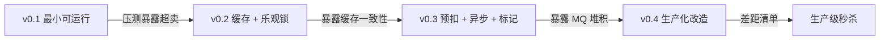
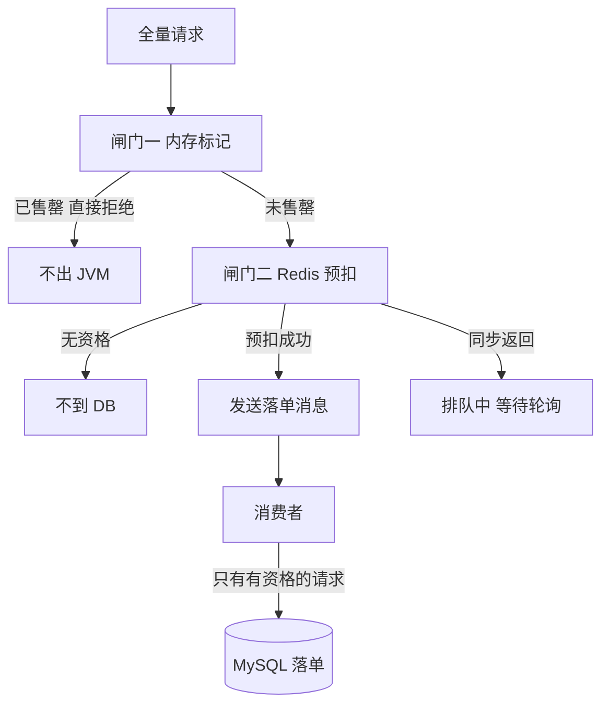
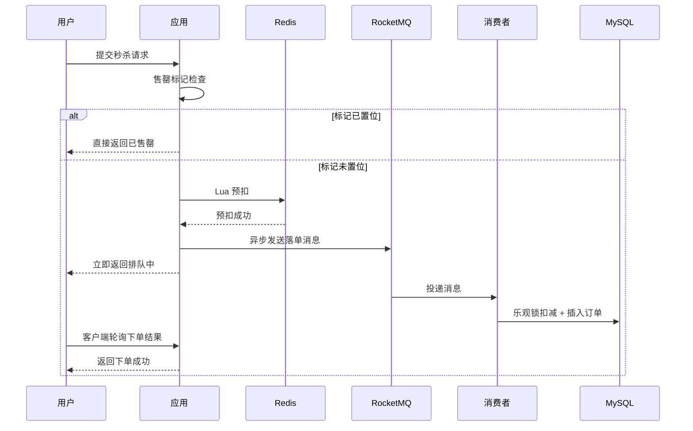
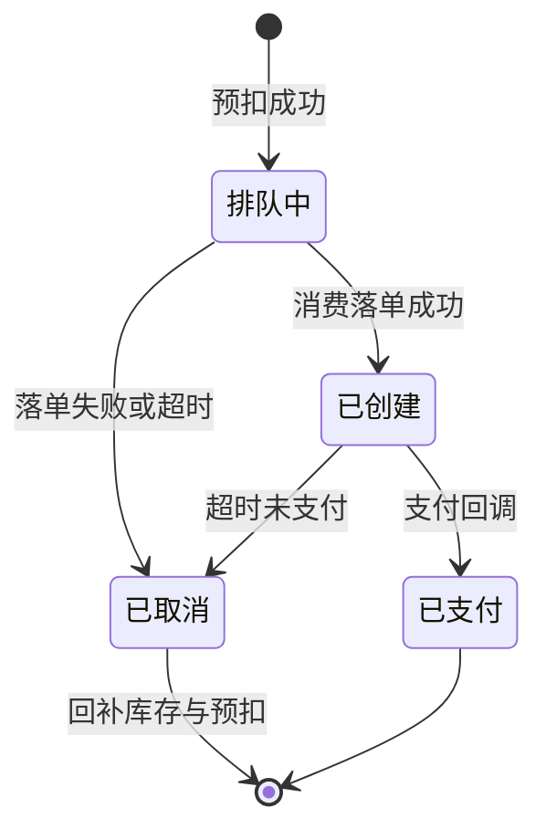
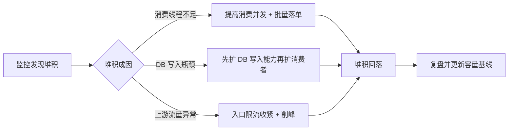
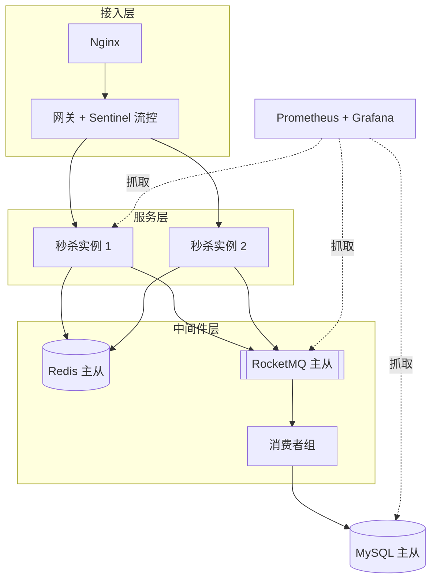

# 实战推演三：开源秒杀项目从零迭代

> 本系列第三个「从零开发全程推演」。系列第 5、6 篇（实战推演一、实战推演二）各沿一条从零路线走到了生产级，本篇换成最贴近多数读者日常的一条路：**以开源社区常见的秒杀项目形态为原型（公开开源项目口径），从第一行代码写到生产级**。技术栈全是开源组件——Spring Boot + MyBatis + MySQL + Redis + RocketMQ + Sentinel，每一版代码都可以在本地 docker-compose 里复现。**重点不是抄一份能跑的代码，而是看清「功能对了」与「生产能用」之间隔着哪几堵墙。**

## 一句话摘要

一个典型的开源秒杀项目 = v0.1 三表一个事务接口（一压就碎）→ v0.2 缓存 + 乐观锁（防住超卖，暴露一致性）→ v0.3 Redis 预扣 + MQ 异步 + 内存标记三板斧（接口飞起，暴露堆积）→ v0.4 限流/监控/容器化生产化（补齐 demo 与生产的差距）。每一版的演进动机都是上一版的压测数据，不是想象力。

## 🎯 本文核心

**核心机制一句话**：开源秒杀项目的迭代史，本质是「瓶颈在哪、就把哪一层的写压力挡在哪」——v0.1 挡不住（全部进 DB）、v0.2 用乐观锁挡写冲突、v0.3 用 Redis 挡写流量、v0.4 用限流挡请求总量；四版演进是同一条机制链的四次收紧。

**机制链**：功能正确 → 并发正确（防超卖）→ 流量正确（挡住无效请求）→ 运行正确（可观测、可限流、可回退）。

**失效点/边界**：本文所有压测数字为「实测示意」（本地容器环境推演口径），不能直接外推到任何生产环境；开源 demo 的三板斧解决的是「写冲突与无效流量」，解决不了黑产风控与跨机房容灾——那两堵墙在 v0.4 的差距清单里。

**跨周期经验**：开源项目的版本演进（0.1 → 0.4）恰好复刻了秒杀架构的跨周期演进路径；同一个 demo 从十万级用户跑到千万级用户，改的不是代码量，是每一层的挡压位置。

## 一、为什么以开源秒杀项目为原型

GitHub 上 star 数较高的 seckill 类项目（公开开源项目口径）高度趋同：Spring Boot 单体起步、MySQL 三张表、Redis 做预热、RocketMQ 或 RabbitMQ 做异步落单。这个形态能成为社区「最大公约数」，是因为它用最小的组件集覆盖了秒杀的全部核心矛盾：有限库存、瞬时脉冲、防超卖。本篇就用这个形态做骨架，完整走一遍从零迭代。

先回答一个前置问题——**为什么不是「直接上大厂架构」**？因为秒杀架构的难点不在组件堆砌，而在每一层挡压决策的依据。直接抄一份包含单元化、多级缓存、风控平台的架构图，你既不知道每一层为什么存在，也不知道去掉它会在什么量级碎掉。从 demo 开始的好处恰恰是：每一版都是「最小改动解决当前瓶颈」，演进动机干净可追溯。系列前四篇已经把端到端设计、数据模型、流量部署、稳定性机制讲完（见 [秒杀系统端到端设计](./1_秒杀系统端到端设计-整合.md)、[秒杀数据模型与接口设计](./2_秒杀数据模型与接口设计-整合.md)、[秒杀流量与部署架构](./3_秒杀流量与部署架构-整合.md)、[秒杀稳定性机制与隐患治理](./4_秒杀稳定性机制与隐患治理-整合.md)），本篇负责把它们「长」出来。

四个版本的演进全景：



## 二、v0.1 最小可运行版：功能对了但一压就碎

**演进动机**：先把「一个人抢」跑通——商品、库存、订单、事务一个不少，这是所有开源项目共同的起点。功能验证：单线程下单成功、库存正确减一、订单正确落库。然后压测第一枪，直接碎掉。

### 2.1 建表：三表最小模型

```sql
-- MySQL 8.0 / InnoDB / utf8mb4（版本为公开开源项目常见口径）
CREATE TABLE t_goods (
  id           BIGINT PRIMARY KEY AUTO_INCREMENT,
  goods_name   VARCHAR(64)  NOT NULL,
  goods_title  VARCHAR(128) NOT NULL,
  goods_img    VARCHAR(256) DEFAULT '',
  goods_detail TEXT,
  goods_price  DECIMAL(10,2) NOT NULL,
  goods_stock  INT NOT NULL DEFAULT 0
) ENGINE=InnoDB DEFAULT CHARSET=utf8mb4;

CREATE TABLE t_seckill_goods (
  id            BIGINT PRIMARY KEY AUTO_INCREMENT,
  goods_id      BIGINT NOT NULL,
  seckill_price DECIMAL(10,2) NOT NULL,
  stock_count   INT NOT NULL DEFAULT 0,
  start_date    DATETIME NOT NULL,
  end_date      DATETIME NOT NULL,
  KEY idx_goods_id (goods_id)
) ENGINE=InnoDB DEFAULT CHARSET=utf8mb4;

CREATE TABLE t_order (
  id            BIGINT PRIMARY KEY AUTO_INCREMENT,
  user_id       BIGINT NOT NULL,
  goods_id      BIGINT NOT NULL,
  goods_name    VARCHAR(64)  DEFAULT '',
  seckill_price DECIMAL(10,2) NOT NULL,
  status        TINYINT NOT NULL DEFAULT 0 COMMENT '0 新建 1 已支付 2 已取消',
  create_date   DATETIME NOT NULL DEFAULT CURRENT_TIMESTAMP
) ENGINE=InnoDB DEFAULT CHARSET=utf8mb4;
```

注意 v0.1 的 t_order **故意不加** (user_id, goods_id) 唯一索引——这不是疏忽，是大多数 demo 第一版代码的真实形态，也是第一个教学点。

### 2.2 核心代码：一个 @Transactional 扣减接口

```java
@RestController
@RequestMapping("/seckill")
public class SeckillController {

    @Autowired
    private SeckillService seckillService;

    /** 下单接口：v0.1 同步事务一把梭 */
    @PostMapping("/do/{goodsId}")
    public Result<String> doSeckill(@PathVariable long goodsId,
                                    @RequestParam long userId) {
        return seckillService.doSeckill(userId, goodsId);
    }
}
```

```java
@Service
public class SeckillService {

    @Autowired
    private SeckillGoodsMapper seckillGoodsMapper;
    @Autowired
    private OrderInfoMapper orderInfoMapper;

    @Transactional(rollbackFor = Exception.class)
    public Result<String> doSeckill(long userId, long goodsId) {
        // 1. 查库存：普通 SELECT，快照读，不加锁
        SeckillGoods sg = seckillGoodsMapper.getByGoodsId(goodsId);
        if (sg == null || sg.getStockCount() <= 0) {
            return Result.error("库存不足");
        }
        // 2. 减库存：UPDATE 不带库存条件
        int rows = seckillGoodsMapper.reduceStock(goodsId);
        if (rows == 0) {
            return Result.error("库存不足");
        }
        // 3. 写订单
        orderInfoMapper.insert(OrderInfo.of(userId, sg));
        return Result.success("下单成功");
    }
}
```

```xml
<update id="reduceStock">
  UPDATE t_seckill_goods SET stock_count = stock_count - 1
  WHERE goods_id = #{goodsId}
</update>
```

单线程验证：接口返回下单成功，t_seckill_goods.stock_count 从 1000 减到 999，t_order 多一行。功能完全正确。

### 2.3 压测第一枪：超卖怎么发生的

压测口径（实测示意，本地 docker-compose 环境）：库存 1000，5000 并发，持续 30 秒。

| 指标 | v0.1 实测示意 |
|---|---|
| 下单成功订单数 | 1007 笔 |
| 最终库存余量 | -7 |
| 接口 P99 延迟 | 约 2.4s |
| 错误响应占比 | 约 87%（库存不足/超时） |

订单数 1007 > 库存 1000：**超卖 7 件**。对电商这是资损级缺陷——多卖出的商品要么砍单（客诉），要么贴钱补货。

**追问链 ①：@Transactional 不是加锁了吗，为什么没防住超卖？** 因为事务保证的是「原子性与回滚」，不是「业务互斥」。可重复读隔离级别下，步骤 1 的普通 SELECT 走 MVCC 快照读，不加任何锁——两个事务同时读到 stock=1000，都通过判断；步骤 2 的 UPDATE 虽然是当前读，但 WHERE 条件里没有库存判断，照减不误。查与改之间的窗口就是超卖窗口，事务边界救不了它。

**追问链 ②：那为什么错误率高达 87%？** 因为热点行竞争。1000 个请求抢最后一行库存，InnoDB 行锁让 UPDATE 在同一行上串行排队，队列后面的请求要么等锁超时、要么看到 stock <= 0 返回失败。DB 不是被压垮的，是被「无效请求 + 行锁排队」拖死的。这两问合起来就是 v0.1 的完整病理报告：**并发正确性没解决（超卖），流量结构没解决（无效请求直达 DB）**。

**遗留问题清单**：超卖（正确性）、重复下单无拦截（同一 user 可插多行订单）、商品详情每次查 DB（读放大）、所有请求无差别打到 DB（流量结构）。四个问题按这个顺序在后续版本逐一解决。

> 💡 **实战提示**：复现超卖不需要 5000 并发。库存设 10、并发 50、JMeter 跑一轮，订单表大概率超过 10 行。超卖是「查改窗口 × 并发」的乘积问题，小并发就能复现——这也是它危险的原因：功能测试全绿，上线第一波活动就爆。

## 三、v0.2 缓存改进版：乐观锁防超卖与一致性问题

**演进动机**：修 v0.1 的四个遗留问题里「正确性」的两个——超卖与重复下单；顺手把商品详情读放进 Redis，减少读放大。这是开源项目共同的第二步：**先保证并发正确，再谈吞吐**。

### 3.1 乐观锁：用库存自身做并发条件

```xml
<update id="reduceStock">
  UPDATE t_seckill_goods SET stock_count = stock_count - 1
  WHERE goods_id = #{goodsId} AND stock_count &gt; 0
</update>
```

一行 WHERE 条件的差别，机制完全不同：UPDATE 是当前读，`stock_count > 0` 让「判断」和「扣减」在行锁内原子完成——先到的请求把库存减到 0，后到的请求条件不满足、affected rows = 0。这就是乐观锁思想：不加锁宣言，用「更新时再校验」化解查改窗口。防重复下单则交给唯一索引：

```sql
ALTER TABLE t_order ADD UNIQUE KEY uk_user_goods (user_id, goods_id);
```

**追问链 ③：为什么不用 SELECT ... FOR UPDATE 悲观锁？** 悲观锁同样能防超卖，代价是：热点行在事务期间被持锁，5000 并发下锁队列长度爆炸，DB 连接池被等待事务占满，吞吐反而低于乐观锁。秒杀场景「绝大多数请求注定失败」，乐观锁让失败请求零锁成本（一次条件不匹配就返回）；悲观锁却让每个失败请求都排队。**为注定失败的大多数，选成本最低的失败路径**——这是秒杀与普通交易在锁策略上的根本分歧，也是 Trade-off 的典型样本。

**追问链 ④：为什么不用分布式锁（一个用户一把锁）？** 分布式锁解决的是「跨进程互斥」，而乐观锁已经用一行 SQL 解决了同一件事；引入 Redis/ZK 锁多一次网络往返、多一个故障点，还带来锁超时语义问题。能用一行 SQL 的原子性解决的事，不要引入新组件——这是 demo 阶段保持架构简单的关键纪律。

### 3.2 缓存预热：详情与库存进 Redis

```java
@Component
public class SeckillPreLoader implements ApplicationRunner {

    @Autowired
    private SeckillGoodsMapper seckillGoodsMapper;
    @Autowired
    private StringRedisTemplate redisTemplate;

    /** 启动时预热：详情 + 库存计数（开源项目口径的经典 preLoad） */
    @Override
    public void run(ApplicationArguments args) {
        for (SeckillGoods sg : seckillGoodsMapper.listUpcoming()) {
            redisTemplate.opsForValue().set(
                "seckill:goods:" + sg.getGoodsId(),
                JSON.toJSONString(sg),
                Duration.ofHours(1).plusSeconds(ThreadLocalRandom.current().nextLong(600)));
            redisTemplate.opsForValue().setIfAbsent(
                "seckill:stock:" + sg.getGoodsId(),
                String.valueOf(sg.getStockCount()));
        }
    }
}
```

商品列表与详情页改为先查 Redis、未命中回源 DB（Cache Aside）。压测对比（实测示意）：

| 指标 | v0.1 | v0.2 |
|---|---|---|
| 超卖量 | 7 | 0 |
| 重复订单 | 存在 | 0（唯一索引兜底） |
| 接口 QPS | 约 1200 | 约 2600 |
| P99 延迟 | 约 2.4s | 约 380ms |

超卖清零、读路径吞吐翻倍。但压测日志里出现了新的脏数据：**Redis 里 seckill:stock 计数与 DB stock_count 对不上**——DB 扣到 0 了，Redis 展示层还显示有货，用户点进去却下不了单。

### 3.3 缓存一致性：v0.2 埋下的新墙

**追问链 ⑤：为什么「先更新 DB、再删缓存」在这里也不彻底？** 因为 v0.2 的库存有两份写路径：DB 的 UPDATE（扣减）与 Redis 的 SET（预热），二者没有共同事务。删缓存只能保证「下次回源拿到新值」，挡不住「读请求在删除前一刻回源，把旧值重新写入」的窄窗口。生产环境对这个窗口的态度是分层容忍：商品详情类数据容忍秒级旧值（随机 TTL 已兜底）；库存计数不允许「展示有货、实际无货」引导用户白等，做法是扣减成功后同步 DEL 库存 key，展示层 MISS 后回源 DB 读真值。为什么不用先删缓存再更新 DB？因为删除后到更新前的窗口内，并发读会批量回源，把旧值成批写回，窗口反而更大。为什么不上 Canal 订阅 binlog 做同步？单机 demo 阶段引入订阅链路，故障面大于收益——这是「一致性强弱要匹配业务容忍度」的取舍，机制详解见 [缓存三大问题](../../../../../middleware/redis/入门层/从零开始认识Redis系列/18_缓存三大问题-入门.md)。

**遗留问题清单**：DB 写路径仍是全量请求的必经之路（无库存用户也在写 DB 才失败）；同步落单让每个请求占住容器线程直到事务提交，5000 并发下线程池先于 DB 打满；Redis 只有读没有写裁决权。这三个问题指向同一个方向：**把「判断有没有资格下单」从 DB 前移**。

> 💡 **实战提示**：v0.2 的乐观锁 SQL 请直接抄进自己的项目，但 preLoad 的库存计数不要抄进生产——「Redis 展示库存 + DB 真实扣减」的双写结构只适合展示层，一旦有人把它当成裁决依据，超卖就会以更隐蔽的方式回来。裁决权只能有一份。

## 四、v0.3 接口优化版：开源经典三板斧

**演进动机**：v0.2 结束时 DB 写路径仍是瓶颈。开源社区对这个瓶颈的回答高度一致，就是所谓三板斧：**Redis 预扣（写裁决权上移）、MQ 异步落单（削峰）、内存标记（售罄后不再出 JVM）**。三者的关系不是并列技巧，而是一条流量漏斗的三层闸门。



### 4.1 板斧一：Redis 预扣，Lua 保证原子

「查库存、判重复、扣减」三步在 Redis 里必须原子执行，否则查改窗口在 Redis 上重演一遍 v0.1 的超卖。Lua 脚本在 Redis 单线程内串行执行，天然满足：

```lua
-- seckill.lua：判库存、判重复、预扣，三步原子完成
-- KEYS[1]=库存 key  KEYS[2]=用户去重 set  ARGV[1]=userId
local stock = tonumber(redis.call('GET', KEYS[1]) or '-1')
if stock <= 0 then
  return 0
end
if redis.call('SISMEMBER', KEYS[2], ARGV[1]) == 1 then
  return -1
end
redis.call('DECR', KEYS[1])
redis.call('SADD', KEYS[2], ARGV[1])
return 1
```

```java
@Service
public class SeckillService {

    private final DefaultRedisScript<Long> seckillScript =
        new DefaultRedisScript<>(luaSource, Long.class);

    /** 售罄标记：开源项目经典第三板斧 */
    private final Map<Long, Boolean> soldOutMap = new ConcurrentHashMap<>();

    @Autowired
    private StringRedisTemplate redisTemplate;
    @Autowired
    private RocketMQTemplate rocketMQTemplate;

    public Result<Long> doSeckill(long userId, long goodsId) {
        // 闸门一：售罄后请求不出 JVM
        if (Boolean.TRUE.equals(soldOutMap.get(goodsId))) {
            return Result.error("已售罄");
        }
        // 闸门二：Lua 预扣（原子：判库存 + 判重复 + 扣减）
        Long r = redisTemplate.execute(seckillScript,
            List.of("seckill:stock:" + goodsId, "seckill:users:" + goodsId),
            String.valueOf(userId));
        if (r != null && r == 0) {
            soldOutMap.put(goodsId, true);      // 首次见零：立标记
            return Result.error("已售罄");
        }
        if (r != null && r == -1) {
            return Result.error("请勿重复下单");
        }
        // 闸门三：预扣成功，MQ 异步落单，立刻返回排队中
        rocketMQTemplate.asyncSend("seckill-order-topic",
            MessageBuilder.withPayload(new SeckillMessage(userId, goodsId)).build(),
            new SendCallback() {
                public void onSuccess(SendResult sendResult) { }
                public void onException(Throwable e) {
                    // 发送失败进入补偿队列：回滚预扣 + 通知用户，见 v0.4 对账
                }
            });
        return Result.success(0L);              // orderId=0 表示排队中
    }
}
```

**预扣失败也有讲究：回滚 + 线性探测。**DECR 返回负数说明这个桶空了——必须立刻 `INCR` 把刚才那一下回滚回去（否则凭空少一份库存），然后换桶重试。重试的路由用「乐观随机 + 线性探测」：随机选初始桶、失败就探测下一桶、最多试 N 桶。纯随机的缺陷是「只剩一个桶有货时有 (N-1)/N 概率白打」；线性探测保证有货必被扫到。小规模 demo（单桶）感知不到这个问题的价值——桶数越多它越值钱。

**双防线：Lua 预扣是快防线，DB 条件更新是慢防线。**Redis 预扣成功了但 MQ 落单前进程崩溃、或预热脚本多写了一份库存——快防线多放的人靠 DB 层 `UPDATE ... SET stock = stock - 1 WHERE stock >= 1`（affected_rows = 0 即拒单）兜底。开源项目常常只做快防线就敢上线，生产事故复盘里「超卖」几乎都出在「以为快防线足够」。

### 4.2 板斧二：MQ 异步落单

```java
@Component
@RocketMQMessageListener(topic = "seckill-order-topic",
                         consumerGroup = "seckill-order-consumer")
public class SeckillOrderConsumer implements RocketMQListener<SeckillMessage> {

    @Autowired
    private SeckillGoodsMapper seckillGoodsMapper;
    @Autowired
    private OrderInfoMapper orderInfoMapper;

    @Override
    @Transactional(rollbackFor = Exception.class)
    public void onMessage(SeckillMessage msg) {
        int rows = seckillGoodsMapper.reduceStock(msg.getGoodsId()); // 仍带 stock_count > 0
        if (rows == 1) {
            orderInfoMapper.insert(OrderInfo.of(msg.getUserId(), msg.getGoodsId()));
        } else {
            // 预扣与落单不一致：预扣成功但 DB 已无库存（ rare，多由人工改库存引发）
            // 走补偿：回补 Redis 预扣 + 记录对账事件，见 v0.4 监控埋点
        }
    }
}
```

用户视角的完整时序：



异步落单改变了订单的生命周期——「排队中」成为一等状态，超时关单与库存回补挂在状态机上（状态流转细节与第 4 篇的事中处理机制对齐）：



### 4.3 板斧三之后：为什么这三板斧是「一套」

**追问链 ⑥：为什么预扣用 Redis 而不是 DB？写裁决权必须放在「失败成本最低」的一层。** v0.2 里失败请求也要写一次 DB（affected rows=0 的 UPDATE），DB 是所有压力的终点；v0.3 里失败请求只消耗一次 Redis 单线程操作（内存级、每秒十万级处理能力），DB 只承接「有资格」的请求。库存有限时，「绝大多数请求注定失败」是确定性的，让确定性失败发生在最便宜的一层，就是秒杀接口优化的第一性原理。

**追问链 ⑦：为什么 MQ 之后还要保留 DB 乐观锁？** 因为 MQ 消费是并发的，同一商品的多条消息可能同时落单，DB 侧仍需乐观锁保证最后一道原子性；同时它承担「Redis 预扣与 DB 真实库存不一致」的最终裁决。三板斧没有取消正确性机制，只是把它挪到了流量末端。

**追问链 ⑧：内存标记凭什么敢直接拒绝？错了怎么办？** 内存标记的语义是「多挡一层」，不是「精确开关」：多实例部署下各 JVM 标记时点不同，短窗口内可能 A 实例已拒、B 实例仍放行——放行的请求会被 Redis 预扣挡住（返回 0），所以标记「漏挡」无资损，只有「误挡」（标记为 true 后 Redis 里其实还有货）才有伤害。误挡的根源是标记不可逆，所以 v0.4 生产化时补两件事：活动开始前清空标记；运营手动回补库存后广播清标记。把内存标记当成可失效的缓存而不是权威状态，它就是安全的。

### 4.4 v0.3 压测与新的问题

| 指标 | v0.2 | v0.3（实测示意） |
|---|---|---|
| 下单接口 QPS | 约 2600 | 约 12000 |
| P99 延迟 | 约 380ms | 约 45ms（返回排队中） |
| DB 写 QPS | 与接口 QPS 同量级 | 约 2500（=消费速率） |
| Redis OPS | 读为主 | 预扣写为主 |

接口层吞吐涨了四倍多，DB 写压力被钉在消费速率上。但压测日志暴露了一个 v0.2 时代不存在的问题：**停止压测后，消费者还在吭哧吭哧落了十几秒单**——消息堆积了。1 万个预扣成功、消费速率 2500 笔/秒，前 4 秒的洪峰必然在 MQ 里排队。排队本身是削峰的设计意图，问题在于：**demo 没有回答「堆积了多少、多久能清完、堆积期间用户怎么办」**。这就是 v0.4 的入口。

> 💡 **实战提示**：三板斧的代码在开源仓库里随处可见，但它们成立的前提藏在语句里——Redis 预扣要求「库存数」而不是「库存行」，去重 set 要求 userId 全局唯一，MQ 要求消息至少一次送达。任何一条前提破掉（比如运营后台直接改 DB 库存），整套机制就会出现难排查的脏数据。抄代码之前先抄前提。

## 五、v0.4 生产化改造：demo 与生产的差距清单

**演进动机**：v0.3 的架构骨架已经是「社区开源项目的最终形态」，但把它放进生产环境，第一周就会遇到四件事：洪峰没拦住打进了应用、堆积没有数字、出问题不知道从哪层开始查、发布只能整台重启。v0.4 逐一对付。

### 5.1 限流接入 Sentinel：给洪峰一个闸门

三板斧挡的是「写冲突与无效请求」，但 Redis 预扣本身也有容量上限；压测口径下 Redis 单实例预扣 OPS 上限附近，P99 开始抖动。与其让 Redis 被打到抖，不如在入口就把超出容量的请求拒绝掉——限流的位置放在秒杀接口层（机制与规则详解见 [Sentinel 流控规则](../../../../../middleware/sentinel/入门层/从零开始认识Sentinel系列/3_流控规则-入门.md)）：

```java
@SentinelResource(value = "doSeckill", blockHandler = "doSeckillBlocked")
@PostMapping("/do/{goodsId}")
public Result<Long> doSeckill(@PathVariable long goodsId,
                              @RequestParam long userId) {
    return seckillService.doSeckill(userId, goodsId);
}

/** 被流控命中的兜底：友好降级而不是裸报错 */
public Result<Long> doSeckillBlocked(long goodsId, long userId, BlockException ex) {
    return Result.error("活动太火爆，请稍后再试");
}
```

```yaml
# application.yml 关键段（开源组件公开文档口径，版本随仓库）
spring:
  cloud:
    sentinel:
      transport:
        dashboard: localhost:8858
      eager: true
```

限流阈值不拍脑袋：以 v0.3 压测得出的「Redis 预扣安全 OPS」反推接口 QPS 阈值，再按大促排期压测校准。Sentinel 的热点参数规则还能按 goodsId 维度限流，防止某个爆品把整池流量吃光。

### 5.2 压测暴露的 MQ 堆积：从「有感知」到「有数字」

v0.3 结尾的堆积问题，v0.4 的治理分三步。第一步是让堆积变成一个被监控的数字（消费滞后量），配告警阈值；第二步是提高消费并行度与批量处理能力；第三步是识别堆积成因分流处理：



这里有一次踩坑值得记录（事故推演口径）：一次压测中团队把消费线程从 20 拉到 200，堆积反而更深——原因是 DB 连接池只有 20，200 个消费线程排队抢连接，上下文切换开销让有效吞吐下降。**消费端的瓶颈不在消费者本身时，扩消费者等于放大瓶颈前移**；扩容顺序永远是「先看下游（DB/连接池），再动消费端」。

### 5.3 监控埋点：秒杀的四个金指标

```java
// Micrometer 埋点（Prometheus 抓取，Grafana 展示）
Counters
  .counter("seckill.request.total", Tags.of("goods", goodsId))
  .increment();                     // 全量请求量
Counters
  .counter("seckill.presubmit.success", Tags.of("goods", goodsId))
  .increment();                     // 预扣成功量：应接近库存总量
Counters
  .counter("seckill.mismatch", Tags.of("goods", goodsId))
  .increment();                     // 预扣与落单不一致次数：正常应恒为 0
Timer
  .timer("seckill.order.lag", Tags.of("goods", goodsId))
  .record(Duration.between(msg.getBornTime(), LocalDateTime.now())); // 落单延迟
```

预扣成功总量对不上库存余量、mismatch 恒增长、落单延迟 P99 超过轮询周期——这三个信号任意一个越界，都意味着用户可见的异常（白等、丢单、超卖）。**监控埋点的意义不是「出了事能看」，而是把三板斧隐含的不变式（预扣数 = 落单数 + 待消费数）变成可以断言的指标。**

### 5.4 容器化与部署形态

```dockerfile
FROM eclipse-temurin:17-jre
WORKDIR /app
COPY target/seckill-app.jar app.jar
EXPOSE 8080
ENTRYPOINT ["java", "-jar", "app.jar"]
```

docker-compose 拉起全栈的完整步骤在下一节 demo 验证点给出；部署形态从单实例升级为「应用多副本 + MySQL 主从 + Redis 主从 + RocketMQ 主从 + Prometheus/Grafana」：



### 5.5 demo 与生产系统的差距清单

| 维度 | 开源 demo 形态 | 生产系统要求 |
|---|---|---|
| 风控 | 仅 userId 去重 | 设备指纹/频次画像/验证码/黑产名单 |
| 配置 | application.yml 硬编码 | 配置中心 + 动态推送 + 灰度 |
| 库存 | 单品单库 | 分桶库存 + 跨桶合并 + 热点打散 |
| 容灾 | 单机房单实例组 | 同城双活/异地多活 + 故障演练 |
| 对账 | mismatch 计数 | 分钟级对账任务 + 差异自动补偿 |
| 发布 | 整体重启 | 灰度发布 + 快速回滚 + 压测流量隔离 |
| 容量 | 一组压测数字 | 容量基线 + 弹性扩缩容 + 降级预案 |

这张清单就是「开源项目学什么、不学什么」的详细版——下一节给结论。

> 💡 **实战提示**：v0.4 最容易被跳过的是对账埋点，因为它在一切正常时毫无产出。但秒杀系统的资损事故几乎都从「预扣与落单悄悄不一致」开始（比如消费端消息重试超限后丢弃）。mismatch 指标 + 分钟级对账是最后的兜底网，上线清单里它应该是第 1 项而不是最后 1 项。


### 5.6 生产化补课三件：DB 判断、券生成、支付回滚

**秒杀的 DB 不需要分库分表。**写入走 MQ 异步削峰后，DB 只承接消费速率（可控的数千 TPS），远不到分库分表临界点；数据量到亿级再按 campaign 分表或按年归档。**核心原则：Redis 管并发，DB 管兜底——DB 只需要保证数据最终正确，不需要扛并发。**两张表就够（活动库存表 + 用户领券记录表，唯一约束防重复领取）。

**券预生成还是实时生成？**预生成（活动前 INSERT 全部券记录，抢到 = UPDATE 状态）适合券码要与外部系统提前对齐的场景；实时生成（抢到时 INSERT + 雪花/随机券码）省掉活动前千万级死数据的预写入——平台内部券选实时生成，毫无压力。

**支付失败的快速回滚：三条链路 + 定时补退。**订单 → CANCELLED、Redis 库存 → INCR 秒级恢复、券 → INCR 回桶 + 券退回事件走 MQ。不用 TCC 绑三个服务（成本远超收益），用最终一致 + 定时任务扫「已取消但未退回」补退——回滚时效直接决定库存利用率。


## 六、demo 验证点：docker-compose 拉起全栈与压测断言

本节是从零复现的工程手册：前置条件、命令、预期输出、回退方式全部给出，四个版本共享同一套 compose 骨架，逐版叠加组件。

### 6.1 环境拉起（步骤级）

**前置**：Docker 与 docker-compose 可用；本机 3306/6379/9876/8080 端口空闲；项目内已备 docker-compose.yml（mysql + redis + rocketmq-namesrv + rocketmq-broker + app + prometheus + grafana 七个服务）与初始化 SQL。

**Step 1**：`docker-compose up -d mysql redis rocketmq-namesrv rocketmq-broker`，等待约 30 秒。
**验证**：`docker-compose ps` 五个服务全为 running；`mysql -h127.0.0.1 -uroot -p -e "SELECT COUNT(*) FROM seckill.t_seckill_goods"` 返回 1（初始化 SQL 已建库并插入 1000 库存的活动商品）。
**回退**：`docker-compose down -v`（-v 连数据卷一起清，回到白纸状态）。

**Step 2**：`mvn -pl seckill-app spring-boot:run` 启动应用（或 `docker-compose up -d app`）。
**验证**：日志出现 `SeckillPreLoader` 预热完成与 Tomcat 端口启动；`redis-cli GET seckill:stock:101` 返回 1000。

**Step 3**：单发冒烟。`curl -X POST "http://localhost:8080/seckill/do/101?userId=1"`。
**验证**：返回下单成功；再次执行同命令，v0.2 起返回「请勿重复下单」（v0.1 会插入第二行订单——这本身就是版本差异断言）。

**Step 4**：压测。`wrk -t8 -c5000 -d30s --latency http://localhost:8080/seckill/ping`（只读链路基线）+ `wrk -t8 -c5000 -d30s -s post.lua http://localhost:8080/seckill/do/101`（下单链路，post.lua 生成递增 userId）。
**验证**：wrk 输出 Non-2xx or 3xx responses 计数与延迟分位；压测后执行断言 SQL（见 6.2）。

**Step 5**：观测。浏览器打开 `localhost:3000`（Grafana），导入面板后确认四金指标曲线；`docker-compose logs -f app | grep mismatch` 应无持续增长。

### 6.2 每一版的验证断言

| 版本 | 断言 SQL 或现象（预期输出） |
|---|---|
| v0.1 | `SELECT COUNT(*) FROM t_order` 大于 1000 且 `SELECT stock_count FROM t_seckill_goods` 为负——复现超卖即验证成功 |
| v0.2 | 订单数恰等于 1000、库存恰为 0；同 userId 重复请求触发 `Duplicate entry` 异常并被捕获为业务错误 |
| v0.3 | 下单接口 P99 低于 50ms 且响应为排队中；30 秒内订单数从 0 增长到 1000 后稳定；售罄后压测 QPS 明显抬升（内存标记生效，请求不出 JVM） |
| v0.4 | 压测超过限流阈值后返回「活动太火爆」（HTTP 层为 Block 响应）；Grafana 可见消费滞后量回落曲线；全程 mismatch 计数保持 0 |

### 6.3 参数级配置清单

以下默认值以各开源组件公开文档口径为准（版本差异以所用版本文档为准），分档推荐按本文量级分档给出：

| 配置项 | 默认值 | 分档推荐 | 为什么 |
|---|---|---|---|
| server.tomcat.threads.max | 200 | 十万级保持 200；百万级按实例组拆分专用线程池 | 同步落单时容器线程被事务占住，线程数要与下游连接池联动而非越大越好 |
| spring.datasource.hikari.maximum-pool-size | 10 | 20 到 50（视 DB 规格） | 消费并发拉高后连接池是第一瓶颈，先扩它再扩消费线程 |
| spring.redis.lettuce.pool.max-active | 8 | 64 及以上 | 预扣把 Redis 从读路径变成写主路径，默认 8 必然排队 |
| rocketmq.producer.send-message-timeout | 3000ms | 保持 3000ms 并开启发送重试 | 异步发送的失败补偿要靠这条超时兜底，超时过长会拖慢用户响应 |
| 消费者并发线程数 | 随客户端版本 | 与连接池等比放大（如连接 50 对应线程 50 到 100） | 消费瓶颈常在 DB 侧，盲调线程会放大瓶颈前移（见 5.2 踩坑） |
| Sentinel 秒杀接口 QPS 阈值 | 未配置不生效 | 按 Redis 预扣安全 OPS 反推，压测校准 | 入口阈值必须钉在系统最便宜闸门的容量上，而不是机器上 |
| 订单超时关单时长 | 业务自定 | 15 分钟量级（业内认知） | 兼容支付链路延迟与库存回补节奏，过长占用库存、过短误伤慢用户 |

## 七、不同量级的思考：约束迁移与架构升档

同一套代码从十万级跑到亿级，改的从来不是「再加一个组件」，而是每一层的约束来源变了——瓶颈换了位置，挡压位置就要跟着换。四档对照如下（量级指峰值请求量级，行业认知口径）：

- **十万级（校园活动/单品日系秒杀）**：约束来源是单库连接池与容器线程数——v0.2 的乐观锁 + 详情缓存就够用，三板斧属于超前建设；思考方式是「基线驱动」——盯住 DB 连接等待与慢查询两个指标，不达标不动架构。这一档的核心问题是「基线守住没有」，而不是「组件上全没有」。
- **百万级（平台大促常规活动）**：约束来源从 DB 转移到 Redis 预扣 OPS 与 MQ 消费速率——三板斧成为标配，限流阈值钉在 Redis 安全容量上；思考方式是「漏斗驱动」——每一层闸门的通过率都有数字，漏斗末端的落单速率恒等于消费速率。这一档的核心问题是「漏斗每层有没有数字」，而不是「代码跑得快不快」。
- **千万级（平台级爆点活动）**：约束来源是单点 Redis 与热点 key 本身——预扣按库存分桶（一个 key 裂成 N 个子 key），MQ 靠分区扩容消费并行度，应用多机房就近接入；思考方式是「拆分驱动」——把单一热点拆成 N 个温点，用合并换细粒度。这一档的核心问题是「热点拆开没有」，而不是「实例加够没有」。
- **亿级（全网现象级活动）**：约束来源是物理拓扑——跨机房延迟让「中心化预扣」不再成立，架构只能走向单元化（用户分片 + 各单元独立库存）+ 最终一致对账；思考方式是「架构驱动」——用拓扑换延迟，用对账换强一致。这一档的核心问题是「单元划对没有」，而不是「参数调优没有」。

**自下而上与触发升级**：四档不是四套系统，而是一条触发链——十万级的基线指标恶化（连接等待抬升）触发 v0.3 式漏斗建设；漏斗层出现单点上限（Redis OPS 逼近安全值）触发分桶；分桶后跨机房延迟进入临界（预扣往返延迟与活动窗口同量级）触发单元化。每一级的触发信号都是上一级监控数字的恶化，这就是「量级决定架构」在工程上的落地方式——也是开源 demo 永远停在百万级档的原因：它的部署形态没有跨机房拓扑可拆。

## 八、开源项目学什么、不学什么：生产化改造清单

把四版迭代摊开，结论可以收敛成一张学习清单：

| 开源项目要素 | 判断 | 理由 |
|---|---|---|
| 乐观锁 SQL（stock_count > 0） | 直接学 | 用一行条件把正确性原子化，生产同样成立 |
| 三板斧结构（预扣/异步/标记） | 学结构、换实现 | 漏斗思想跨量级成立，但生产要换集群化组件与分桶 |
| preLoad 预热 + 随机 TTL | 学 | 冷启动击穿是真实风险，随机 TTL 是零成本的打散 |
| 内存标记当权威状态 | 不学 | 误挡无回滚路径，生产必须补「清标记广播 + 活动前置清零」 |
| 双写库存（Redis 展示 + DB 扣减） | 不学 | 裁决权必须唯一，双写结构是隐蔽超卖的温床 |
| 压测脚本 + compose 全栈 | 直接学 | 可复现的验证环境是开源项目最被低估的资产 |
| 硬编码配置/单点部署 | 不学 | 对应 5.5 差距清单的配置中心与容灾两行 |

**什么时候用开源 demo 方案，什么时候不用**：内部活动、量级在十万级档、可接受活动日降级——直接用 v0.2 到 v0.3 形态，两天上线，成本最低（推荐）；量级到百万级档——学它的漏斗结构，但 Redis/MQ/部署全部按集群口径重做，demo 代码只当骨架参考；亿级档或有黑产对抗诉求——demo 形态整体不适用，从单元化与风控体系重新设计。**什么时候不用**：需要强一致资损语义（库存即资金）的场景，任何「预扣 + 异步」结构都要先回答对账与补偿，否则宁可同步。

**Trade-off 收束**：这套演进史里每个决定都在交换——乐观锁用「失败请求仍进 DB」换正确性简单；Redis 预扣用「引入对账成本」换 DB 存活；MQ 异步用「用户等待不确定」换接口吞吐；内存标记用「短窗口误挡」换 JVM 内拦截。没有一步是免费的，工程判断力就体现在知道每次交换买来了什么、赔上了什么。这与系列第一篇「量级决定架构」的结论互为表里：架构选型是量级的函数，而迭代路线是瓶颈位置的函数。

> 💡 **实战提示**：读完本篇最有价值的一件事，是把 6.2 的四行断言带回去——任何秒杀类系统（库存、名额、票务）上大型活动前，先写断言再写代码。断言写不出来的版本，说明你还不知道它在什么条件下会碎。

## 你们可能会问

**Q1：v0.1 那种「一压就碎」的代码，开源仓库里真的存在吗？还是你为了教学故意写错的？** 存在且常见（公开开源项目口径）。多数 seckill 类项目的早期 commit 都是「先查再改」结构，超卖问题是社区 issue 区的高频主题；不少仓库后来补上了库存条件，但 issue 区仍能看到使用者拿旧版本直接上生产踩坑。教学口径的 v0.1 与真实仓库的初始形态基本一致，区别只是本文把问题显式摆在了台面上。

**Q2：预扣成功但 MQ 消息丢了、或者消费端反复重试都失败，用户的库存名额怎么办？** 分两段回答。消息丢失：发送端用异步发送的回调兜底（4.1 的 onException），进入补偿队列回滚 Redis 预扣并置该用户可重抢；消费端 RocketMQ 的重试机制最终会进入死信队列，死信消息由对账任务捞起，按「预扣成功但无订单」的口径回补库存并通知用户。落单失败（rows=0）：说明 DB 库存已空而预扣多放行了，回补预扣计数 + mismatch +1，等待对账任务修正。三类路径的公共前提就是 5.3 的 mismatch 指标——没有监控的对账是空谈。

**Q3：为什么选 RocketMQ 不用 RabbitMQ 或 Kafka？** 公开开源口径下的对比：RabbitMQ 吞吐与堆积能力弱于 RocketMQ，秒杀洪峰下堆积是常态能力而非异常；Kafka 吞吐最强但默认语义偏日志流，事务消息与延迟消息需要自行搭建；RocketMQ 两者原生具备（延迟消息做超时关单、事务消息做最终一致），且 Java 技术栈运维成本最低。这不是绝对排序，是「秒杀需要什么」的匹配题——系列其他篇目的消息选型文有横向对比，这里只给秒杀口径的结论。

**Q4：内存标记多实例不一致，为什么不上广播实时同步？** 因为「多挡一层」的定位决定了它不需要强一致。广播同步引入发布订阅链路，故障面与复杂度上升，而它防住的「漏挡」本来就有 Redis 预扣兜底——为一个有兜底的问题增加一条实时链路，是负收益的精确。工程上区分「必须精确的开关」与「允许误差的挡板」：库存裁决是前者，内存标记是后者，混为一谈是性能优化里最常见的过度设计。

**Q5：这些压测数字可信吗？我自己跑为什么对不上？** 不可直接外推，也不必对上。本文所有数字标注为实测示意（本地容器环境），受宿主机资源、容器限制、组件版本影响明显；它们的作用是展示「量级关系与拐点形态」（比如 v0.3 到 v0.4 的 DB 写压平、堆积出现的时间窗），不是绝对性能参考。你自己的环境跑出的曲线形态与本文一致、绝对值不同，才是正常结果。

## 开放问题

- 库存分桶后的「跨桶腾挪」：A 桶售罄、B 桶有余时，腾挪的粒度与时机怎么定？腾挪本身会不会成为新热点？
- 预扣的去重 set 随活动规模线性增长，亿级用户量下内存成本如何评估？分片去重与布隆过滤器的误判代价怎么权衡？
- 消费速率恒等于 DB 写入上限，那「落单体验」的极限就是 DB 的极限——分库分表在秒杀域的收益与订单查询域的代价怎么算总账？
- 单元化后各单元独立库存，总库存的全局视角（运营大盘、活动报表）靠对账聚合，实时性要求多高才够？
- demo 三板斧在 AI 生成代码时代会不会被「直接生成生产级代码」跳过？——本文的观点是演进路径不可跳过，因为瓶颈位置的判断只能来自压测，欢迎质疑与讨论。

## 🎯 核心带走

**核心一句话**：开源秒杀项目的四版迭代，是「把写压力的裁决权逐层上移」的四次收紧——v0.1 全进 DB（碎）、v0.2 DB 乐观锁（对但慢）、v0.3 Redis 裁决 + MQ 削峰（快但有堆积）、v0.4 入口限流 + 可观测（生产可用）。

**机制链复述**：功能正确 → 并发正确（乐观锁/唯一索引）→ 流量正确（预扣/异步/内存标记三板斧）→ 运行正确（Sentinel 限流 + 四金指标 + 对账兜底 + 容器化）。

**失效点/边界**：三板斧成立的前提是「库存有限 + 用户唯一 + 消息至少一次」；量级跨过百万级档后，单点 Redis 与热点 key 成为新约束，进入分桶与单元化领域——超出 demo 形态的能力半径。

**下一步动作**：用 6.1 的步骤把全栈拉起来，亲手复现 6.2 的四个断言——超卖、防住、飞起、堆积四个瞬间各亲眼看一次，比读十篇文章记得牢。

## 📌 数据与事实声明

- 写于 2026-09-23。
- 文中全部压测数据为实测示意（本地 docker-compose 容器环境推演口径），受环境与版本影响明显，不构成任何性能承诺。
- 「开源项目迭代史」为公开开源项目口径的典型形态归纳，不指向任何具体仓库；技术栈与默认参数值为各开源组件公开文档常见口径，版本差异以所用版本文档为准。
- 涉及量级分档的内容（十万/百万/千万/亿级）为行业认知口径，精确阈值必须以自身压测为准。

## 📚 参考资料

| 类型 | 资料 | 路径 |
|---|---|---|
| 系列内 | 秒杀系统端到端设计（系列第 1 篇） | [./1_秒杀系统端到端设计-整合.md](./1_秒杀系统端到端设计-整合.md) |
| 系列内 | 秒杀数据模型与接口设计（系列第 2 篇） | [./2_秒杀数据模型与接口设计-整合.md](./2_秒杀数据模型与接口设计-整合.md) |
| 系列内 | 秒杀流量与部署架构（系列第 3 篇） | [./3_秒杀流量与部署架构-整合.md](./3_秒杀流量与部署架构-整合.md) |
| 系列内 | 秒杀稳定性机制与隐患治理（系列第 4 篇） | [./4_秒杀稳定性机制与隐患治理-整合.md](./4_秒杀稳定性机制与隐患治理-整合.md) |
| 系列内 | 实战推演一 / 实战推演二（系列第 5、6 篇，从零开发全程推演另两条路线） | 同目录系列清单 |
| 本仓库 | 缓存三大问题（一致性机制详解） | [../../../../../middleware/redis/入门层/从零开始认识Redis系列/18_缓存三大问题-入门.md](../../../../../middleware/redis/入门层/从零开始认识Redis系列/18_缓存三大问题-入门.md) |
| 本仓库 | Sentinel 流控规则（限流配置详解） | [../../../../../middleware/sentinel/入门层/从零开始认识Sentinel系列/3_流控规则-入门.md](../../../../../middleware/sentinel/入门层/从零开始认识Sentinel系列/3_流控规则-入门.md) |
| 本仓库 | 异步削峰（入门篇） | [../../入门层/从零开始认识分布式系统设计系列/5_异步削峰-入门.md](../../入门层/从零开始认识分布式系统设计系列/5_异步削峰-入门.md) |
| 本仓库 | 10 万 QPS 接口工程（容量与压测方法论） | [../../../large-scale/专题层/从零开始大规模架构实战系列/7_10万QPS接口工程-深度.md](../../../large-scale/专题层/从零开始大规模架构实战系列/7_10万QPS接口工程-深度.md) |
| 本仓库 | K8s 弹性伸缩 HPA/VPA/CA（生产部署形态） | [../../../../../devops/kubernetes/特性层/深入理解K8s核心特性系列/子系列A-核心调度机制/5_HPA-VPA-CA弹性伸缩-深度.md](../../../../../devops/kubernetes/特性层/深入理解K8s核心特性系列/子系列A-核心调度机制/5_HPA-VPA-CA弹性伸缩-深度.md) |
| 开源文档 | Spring Boot / MyBatis / Redis / RocketMQ / Sentinel 官方文档 | 各项目官网与 GitHub 仓库（公开开源项目口径） |
