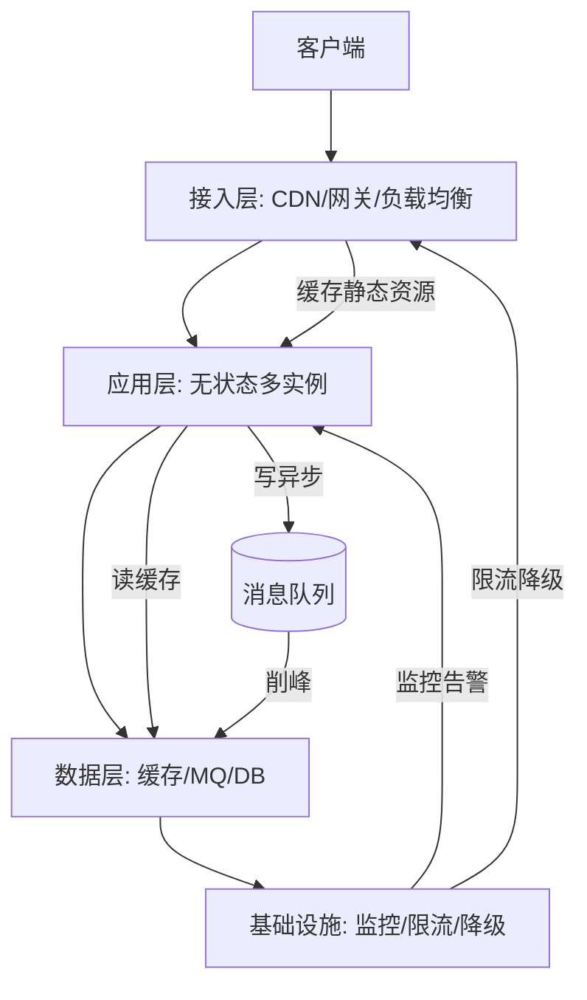
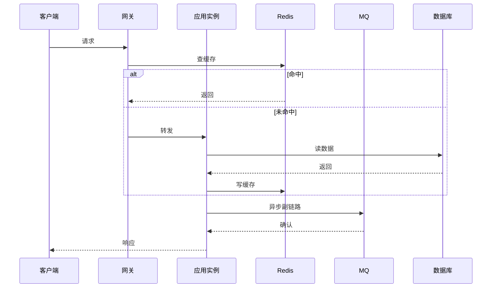
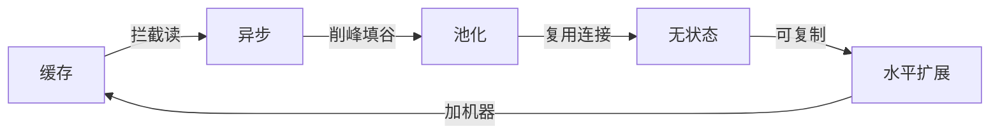
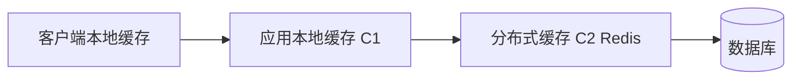
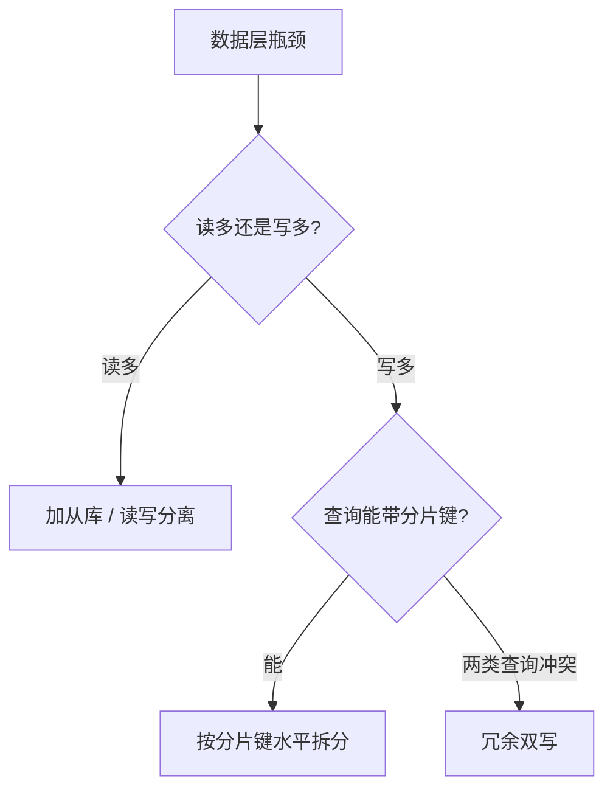
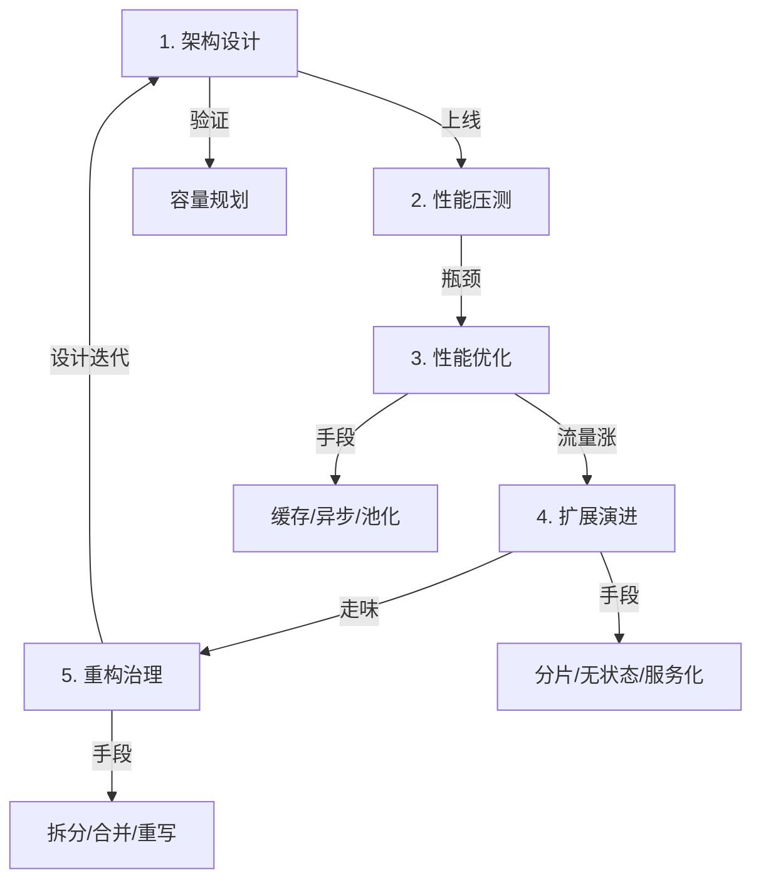
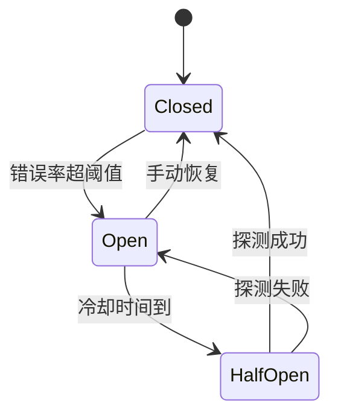

# 从零设计高性能可扩展系统

> **一句话摘要**：高性能 + 高并发 + 高扩展 + 重构 = 同一套设计的四个时刻——从无到有做对架构（设计），扛量级时加手段（高性能/并发），业务涨时扩边界（扩展），走味时回退重构（重构）。本文用一张架构图 + 一套决策表 + 一段可跑代码，把这四个时刻串成闭环。

前置阅读：[系统设计是什么与三大目标](../../入门层/从零开始认识分布式系统设计系列/1_系统设计是什么与三大目标-入门.md)、[高并发设计](../../入门层/从零开始认识分布式系统设计系列/3_高并发设计-入门.md)、[高扩展设计](../../入门层/从零开始认识分布式系统设计系列/8_高扩展设计-入门.md)。[秒杀系统实战](./从零设计秒杀系统/) 是本文的落地对照。

## 本文核心

**核心机制一句话**：8_从零设计高性能可扩展系统 的核心在于分层思维——先定义边界，再选方案，最后验证效果。

**机制链**：架构设计 → 性能压测 → 扩展演进 → 重构治理。

**失效点/边界**：适用于中大规模场景；小规模可简化。重构的触发条件是"走味"而非"变慢"——变慢是性能问题，走味是架构问题。

## 1. 背景：为什么需要这一篇

入门层（1-10）回答了"是什么"和"为什么"，特性层回答了"怎么做"，专题层回答了"选什么"。但真实世界里你面对的不是单一问题，而是一组**连锁问题**：

1. 系统刚上线，架构对不对？（设计）
2. 流量上来，扛不扛得住？（性能/并发）
3. 业务变了，扩不扩得动？（扩展）
4. 代码走味了，拆不拆得开？（重构）

这四个问题不是并行的，是**同一套架构在不同量级、不同阶段的四个时刻**。本文把它们收束到一张图里，让你在任何时刻都能定位自己该做什么。

## 2. 架构设计：高性能系统的骨架

### 2.1 高性能架构四层



四层职责：

| 层 | 职责 | 关键技术 | 量级分档 |
|---|---|---|---|
| 接入层 | 分流、鉴权、限流 | CDN / 网关 / LB | 10w: 单网关 / 100w: 多网关 + DNS 负载 |
| 应用层 | 业务逻辑、无状态 | 多实例 / 池化 / 异步 | 10w: 单应用 / 100w: 多应用 + 服务网格 |
| 数据层 | 持久化、缓存、消息 | Redis / MQ / 分库分表 | 10w: 单库 + 本地缓存 / 100w: 分库分表 + 多级缓存 |
| 基础设施 | 监控、告警、降级 | 指标 / 链路追踪 / 熔断 | 10w: 基础监控 / 100w: 全链路追踪 + 自适应降级 |

接入层是系统的"咽喉"：网关不仅做路由，还要做限流、鉴权、协议转换。量级到 100w QPS 时，单网关成为瓶颈，需要多网关 + DNS 负载均衡。接入层的降级策略是"最后一道防线"——当后端全部不可用时，网关直接返回兜底数据，避免级联故障。



### 2.2 高并发叠加五板斧

在四层骨架上叠加高并发手段：



五板斧的叠加顺序有讲究：**先缓存（成本最低）→ 再异步（解耦最彻底）→ 再池化（复用最直接）→ 再无状态（扩展前提）→ 最后水平扩展（代价最高）**。每加一层都要回答：这一层解决了什么、引入什么代价。

#### 2.2.1 缓存：让读请求不落到数据库

缓存是最高性价比的并发手段——内存随机访问比磁盘 IO 快 1000 倍以上。多级缓存架构：



C1 防 Redis 故障，C2 防数据库故障。每一层都有 TTL，过期后回源查下一层。

#### 2.2.2 异步：把必须现在做完的缩短为必须现在受理

同步链路里每一环的耗时都会累加到用户等待上。把不紧急的动作扔进队列，主链路立刻变短。异步的代价是延迟增加 + 消息丢失风险，需要幂等 + 重试 + 死信队列兜底。

#### 2.2.3 池化：预先创建，反复复用

数据库连接、HTTP 连接、线程，创建和销毁都是昂贵操作（TCP 握手、TLS 协商、内存分配）。池化 = 预先创建、反复复用，把单次请求的开销摊薄。代价是要管理池的上限和借还纪律——池配大了压垮下游，配小了自己排队。

#### 2.2.4 无状态：让实例可复制

无状态不是"没有状态"，是"状态不在实例里"。典型改造：会话外移 Redis、本地缓存改分布式缓存、本地文件改对象存储。改造完成的验收标准：**随机杀掉任何一个实例，所有用户的请求都不受影响**。

#### 2.2.5 水平扩展：加机器近似线性提升吞吐

无状态之后，加机器近似线性提升吞吐。负载均衡负责把流量摊到新实例上。水平扩展的代价是成本翻倍 + 一致性维护，所以要在确认单实例确实扛不住时才做。

### 2.3 高扩展叠加分片

高并发解决的是"同一个请求更快"，高扩展解决的是"更多请求能加机器"。数据层扩展 = 分片：



分片键选择的三原则：均匀性（数据不倾斜）、查询路径（常用查询带分片键）、跨片代价（跨片事务/JOIN 的代价）。

### 2.4 架构 Trade-off 总览

| 设计决策 | 收益 | 代价 | 何时选 |
|---|---|---|---|
| 加缓存 | 读 QPS 提升 10x+ | 一致性复杂度 + 运维成本 | 读多写少 / 热点明确 |
| 加异步 | 响应时间↓ / 吞吐↑ | 延迟增加 / 消息丢失风险 | 不要求实时返回 |
| 分库分表 | 写入/存储容量↑ | 跨片事务 / 搬迁成本 | 单库写入 > 5000 QPS |
| 无状态化 | 水平扩展自由 | 会话外移 / 状态管理复杂度 | 需要弹性伸缩 |
| 冗余部署 | 可用性↑ | 成本翻倍 / 一致性维护 | 核心链路 SLA > 99.9% |

## 3. 实现方案：从零到一的代码实践

### 3.1 从零实现：高性能缓存层

下面是一个最小化的本地缓存 + 分布式缓存双层实现，演示高并发系统的缓存层怎么写。

```python
"""
从零实现高性能缓存层
演示：本地缓存(C1) + 分布式缓存(C2) 双层缓存
"""
import time
import threading
from typing import Optional, Callable, Any


class LocalCache:
    """本地缓存 - C1 层，内存级速度，TTL 自动过期"""

    def __init__(self, default_ttl: int = 60):
        self._cache: dict[str, tuple[Any, float]] = {}
        self._default_ttl = default_ttl
        self._lock = threading.RLock()

    def get(self, key: str) -> Optional[Any]:
        """获取缓存项，过期自动删除"""
        with self._lock:
            entry = self._cache.get(key)
            if entry is None:
                return None
            value, expire_at = entry
            if time.time() > expire_at:
                del self._cache[key]
                return None
            return value

    def put(self, key: str, value: Any, ttl: Optional[int] = None):
        """写入缓存项"""
        with self._lock:
            expire_at = time.time() + (ttl or self._default_ttl)
            self._cache[key] = (value, expire_at)

    def invalidate(self, key: str):
        """失效缓存项"""
        with self._lock:
            self._cache.pop(key, None)


class DistributedCache:
    """分布式缓存 - C2 层，Redis 抽象，演示接口

    设计要点：
    - C1 本地缓存：内存级速度，TTL 自动过期，防 Redis 故障
    - C2 分布式缓存：集中存储，一致性由 TTL + 主动失效保证
    - 回填策略：C2 未命中时才查 DB，回填 C1 避免缓存击穿
    - 失效策略：C1 + C2 同时失效，防止脏读

    def get(self, key: str) -> Optional[Any]:
        """C1 -> C2 逐层查找"""
        # 1. 先查本地缓存
        value = self._local.get(key)
        if value is not None:
            return value
        # 2. 再查分布式缓存
        value = self._get_remote(key)
        if value is not None:
            self._local.put(key, value)  # 回填 C1
        return value

    def put(self, key: str, value: Any, ttl: int = 300):
        """写入 C2 + 回填 C1"""
        self._set_remote(key, value, ttl)
        self._local.put(key, value, ttl)

    def invalidate(self, key: str):
        """失效 C1 + C2"""
        self._del_remote(key)
        self._local.invalidate(key)

    # 以下为简化接口，实际使用时替换为 Redis 命令
    def _get_remote(self, key: str) -> Optional[Any]:
        if self._backend:
            return self._backend.get(key)
        return None

    def _set_remote(self, key: str, value: Any, ttl: int):
        if self._backend:
            self._backend.set(key, value, ex=ttl)

    def _del_remote(self, key: str):
        if self._backend:
            self._backend.delete(key)
```

### 3.2 框架实现对比：缓存层

| 维度 | 从零实现 | Redis + 本地缓存 | 对比结论 |
|---|---|---|---|
| 灵活度 | 完全可控 | 受框架约束 | 从零适合学习 / 特殊场景 |
| 性能 | Python dict O(1) | Redis 内存 + 本地 C1 | 框架多路复用更优 |
| 一致性 | 应用层维护 | Redis 集中 + 本地 TTL | 框架一致性强 |
| 生产就绪 | ❌ 需补集群/持久化/监控 | ✅ 开箱 | 生产用框架 |

#### 3.2.1 从零 vs 框架：何时选哪种

- **从零实现**：学习原理、特殊场景（极端低延迟、强一致性要求）、原型验证。代价是：要自己补集群、持久化、监控、故障转移。
- **框架方案**：生产环境首选。Redis Cluster 开箱即用，本地缓存用 Caffeine/Guava 一行配置。代价是：受框架约束、版本兼容、运维依赖。

选择原则：**学习用从零，生产用框架**。不要在生产环境重复造轮子，除非有明确的性能/一致性需求驱动。

| 维度 | 从零实现 | Redis + 本地缓存 | 对比结论 |
|---|---|---|---|
| 灵活度 | 完全可控 | 受框架约束 | 从零适合学习 / 特殊场景 |
| 性能 | Python dict O(1) | Redis 内存 + 本地 C1 | 框架多路复用更优 |
| 一致性 | 应用层维护 | Redis 集中 + 本地 TTL | 框架一致性强 |
| 生产就绪 | ❌ 需补集群/持久化/监控 | ✅ 开箱 | 生产用框架 |

### 3.3 从零实现：重构检测脚本

重构的触发条件是"走味"，下面是一个最小化的代码异味检测脚本，演示怎么用程序化手段发现重构时机。

#### 3.3.1 代码异味与重构时机的对应关系

| 异味 | 触发阈值 | 重构动作 | 代价 |
|---|---|---|---|
| 函数过长 | > 50 行 | 拆函数 / 提取类 | 改动范围可控 |
| 参数过多 | > 5 个 | 封装参数对象 | 调用方同步改 |
| 圈复杂度高 | > 10 | 拆分条件 / 多态 | 需覆盖测试 |
| 重复代码 | 出现 3 次+ | 提取公共方法 | 需确认语义一致 |
| 耦合度过高 | 模块互相依赖深 | 引入接口层 | 架构调整 |

#### 3.3.2 重构的触发条件

重构不是代码变慢才做的事，是架构走味时做的。三个信号触发重构：

1. **发布频率下降**：原来一周发布一次，现在两周一次——代码耦合度高，改一处动全身。
2. **新人上手慢**：新人看懂一个模块需要 2 小时以上——模块边界不清晰。
3. **修改影响范围大**：改一个功能影响 3+ 个模块——模块耦合度高。

```python
"""
重构检测脚本
检测：函数过长 / 参数过多 / 重复代码 / 圈复杂度高
触发重构的阈值可配置
"""
import ast
import os
from collections import defaultdict
from typing import List, Dict


class CodeSmellDetector(ast.NodeVisitor):
    """AST 级别的代码异味检测器"""

    def __init__(self, max_func_lines: int = 50, max_params: int = 5, max_complexity: int = 10):
        self.max_func_lines = max_func_lines
        self.max_params = max_params
        self.max_complexity = max_complexity
        self.smells: List[Dict] = []
        self._current_func = None
        self._func_start = 0
        self._complexity = 0

    def visit_FunctionDef(self, node: ast.FunctionDef):
        """进入函数时记录起始行"""
        self._current_func = node.name
        self._func_start = node.lineno
        self._complexity = 1  # 基础复杂度

        # 检查参数数量
        param_count = len(node.args.args) + len(node.args.posonlyargs)
        if param_count > self.max_params:
            self.smells.append({
                "type": "参数过多",
                "function": node.name,
                "line": node.lineno,
                "detail": f"{param_count} 个参数 (阈值: {self.max_params})"
            })

        self.generic_visit(node)

        # 检查函数长度
        func_lines = node.end_lineno - self._func_start + 1
        if func_lines > self.max_func_lines:
            self.smells.append({
                "type": "函数过长",
                "function": node.name,
                "line": node.lineno,
                "detail": f"{func_lines} 行 (阈值: {self.max_func_lines})"
            })

        # 检查圈复杂度
        if self._complexity > self.max_complexity:
            self.smells.append({
                "type": "圈复杂度高",
                "function": node.name,
                "line": node.lineno,
                "detail": f"复杂度 {self._complexity} (阈值: {self.max_complexity})"
            })

        self._current_func = None

    def visit_If(self, node):
        self._complexity += 1
        self.generic_visit(node)

    def visit_For(self, node):
        self._complexity += 1
        self.generic_visit(node)

    def visit_While(self, node):
        self._complexity += 1
        self.generic_visit(node)


def scan_file(filepath: str, **kwargs) -> List[Dict]:
    """扫描单个 Python 文件的代码异味"""
    with open(filepath, "r", encoding="utf-8") as f:
        source = f.read()
    tree = ast.parse(source)
    detector = CodeSmellDetector(**kwargs)
    detector.visit(tree)
    return detector.smells


def scan_directory(dirpath: str, **kwargs) -> Dict[str, List[Dict]]:
    """扫描目录下所有 Python 文件"""
    results = defaultdict(list)
    for root, _, files in os.walk(dirpath):
        for fname in files:
            if fname.endswith(".py"):
                filepath = os.path.join(root, fname)
                smells = scan_file(filepath, **kwargs)
                if smells:
                    results[filepath] = smells
    return dict(results)


# --- 使用示例 ---
if __name__ == "__main__":
    # 扫描当前目录
    target_dir = "."
    results = scan_directory(target_dir, max_func_lines=30, max_params=4, max_complexity=8)

    if not results:
        print("✅ 未检测到代码异味")
    else:
        print(f"⚠️  检测到 {sum(len(v) for v in results.values())} 个代码异味:\n")
        for filepath, smells in results.items():
            print(f"  📄 {filepath}")
            for smell in smells:
                print(f"     [{smell['type']}] {smell['function']}:{smell['line']} — {smell['detail']}")
            print()
```

### 3.4 重构触发决策表

| 异味 | 触发阈值 | 重构动作 | 代价 |
|---|---|---|---|
| 函数过长 | > 50 行 | 拆函数 / 提取类 | 改动范围可控 |
| 参数过多 | > 5 个 | 封装参数对象 | 调用方同步改 |
| 圈复杂度高 | > 10 | 拆分条件 / 多态 | 需覆盖测试 |
| 重复代码 | 出现 3 次+ | 提取公共方法 | 需确认语义一致 |
| 耦合度过高 | 模块互相依赖深 | 引入接口层 | 架构调整 |

### 3.5 参数配置清单

| 参数 | 默认值 | 分档推荐 | 为什么 |
|---|---|---|---|
| 本地缓存 TTL | 60s | 10w QPS: 30s / 100w QPS: 10s | 热点数据 TTL 越短一致性越好 |
| 分布式缓存 TTL | 300s | 10w QPS: 300s / 100w QPS: 60s | 高频读可接受更短 TTL |
| 心跳间隔 | 10s | 10w QPS: 15s / 100w QPS: 5s | 间隔越长故障发现越慢 |
| 连接池大小 | 100 | 10w QPS: 200 / 100w QPS: 500 | 按并发量线性调整 |
| 熔断阈值 | 错误率 50% | 10w QPS: 50% / 100w QPS: 30% | 高流量下阈值更严格 |

### 3.6 步骤级操作

| 步骤 | 前置 | 命令/操作 | 验证 | 回退 |
|---|---|---|---|---|
| 加缓存 | 确认热点 key | 配置 C1 + C2 双层 | 命中率 > 80% | 关闭 C1 回退 C2 |
| 异步化 | 确认副链路 | 消息队列接入 | 延迟 < 500ms | 关 MQ 回同步 |
| 分库分表 | 确认分片键 | 迁移数据 + 路由层 | 无跨片查询 | 回滚路由配置 |
| 重构 | 覆盖测试 | 小步重构 + 灰度 | 发布频率回升 | 回滚版本 |

## 4. 架构 + 性能 + 扩展 + 重构 的闭环

真实系统的演进路径不是线性的，是循环的：



闭环的每个节点都有**触发条件**：

| 节点 | 触发条件 | 验证标准 | 量级分档 |
|---|---|---|---|
| 架构设计 | 新系统 / 大版本 | 方案可质询（数字有推导、手段有代价） | 所有量级 |
| 性能压测 | 上线前 / 大促前 | P99 RT / 吞吐 / 错误率达标 | 10w+ QPS 必做 |
| 性能优化 | 压测不达标 | 瓶颈层定位 + 优化后复测 | 所有量级 |
| 扩展演进 | 容量超 70% 水位 | 加机器后吞吐线性增长 | 100w+ QPS |
| 重构治理 | 代码异味 / 发布阻塞 | 异味指标下降 / 发布频率回升 | 所有量级 |

#### 4.1 闭环的反馈机制

闭环不是一次性循环，是持续迭代。每个节点的输出是下一个节点的输入：

- **架构设计 → 性能压测**：设计阶段确定的容量目标，压测阶段验证是否达标。
- **性能压测 → 性能优化**：压测发现的瓶颈，驱动优化方向。
- **性能优化 → 扩展演进**：优化后仍不达标的节点，需要扩展。
- **扩展演进 → 重构治理**：扩展后代码走味，需要重构。
- **重构治理 → 架构设计**：重构后的架构，可能需要重新设计。

#### 4.2 闭环的常见断点

- **只做优化不做压测**：凭直觉优化，优化了错误的地方。
- **只做扩展不做重构**：机器加到上限，代码走味无法扩展。
- **只做重构不做设计**：重构没有目标，改完更乱。
- **只做设计不做验证**：设计再美，不压测就是纸上谈兵。

## 5. 生产视角：四维事故

### 5.1 架构设计事故
- **没做容量规划就上线** → 流量一上来全挂。解法：上线前必做压测 + 水位线预演。
- **案例**：某电商大促前没做容量规划，流量翻倍后数据库连接打满，全链路超时。事后补压测+水位线预演才解决。

### 5.2 性能事故
- **缓存击穿** → 热点 key 过期，瞬间流量打到数据库。解法：本地缓存 + 降级 + 限流。
- **慢查询** → 数据库慢查询未命中索引，连锁超时。解法：慢查询日志 + 索引优化。
- **连接池打满** → 连接数达到上限，新请求排队。解法：连接池监控 + 动态扩容。

### 5.2.1 熔断器状态机



### 5.3 扩展事故
- **分片键选错** → 数据倾斜 → 个别分片扛全部流量。解法：上线前做分片键均匀性预检。
- **案例**：按用户 ID 分片，某大客户数据集中一片，该分片写入压力是其他分片的 10 倍。

### 5.4 重构事故
- **没测试就重构** → 改坏线上。解法：重构前补测试 + 灰度发布 + 回滚预案。
- **案例**：某团队重构订单服务，没补回归测试，上线后订单状态流转异常，回滚恢复。

#### 5.4.1 重构的灰度策略

重构不能大爆炸式重写，要小步迭代：

1. **补测试**：先给要改的代码补回归测试，确保改不坏。
2. **小步重构**：每次只改一个模块，改完就跑测试。
3. **灰度发布**：先放 10% 流量验证，无问题再全量。
4. **回滚预案**：准备好回滚脚本，发现问题立刻回滚。

#### 5.4.2 重构与扩展的优先级

| 场景 | 优先做什么 | 为什么 |
|---|---|---|
| 发布频率下降 | 重构 | 代码耦合度高，改一处动全身 |
| 吞吐见顶 | 扩展 | 单实例扛不住，需要加机器 |
| 代码走味 + 容量不足 | 先重构再扩展 | 走味时扩展 = 在烂代码上加机器 |

## 6. 典型场景

| 量级档 | 架构形态 | 缓存策略 | 数据层 | 治理 | Trade-off |
|---|---|---|---|---|---|
| 10w QPS | 单体 + 单库 | 本地缓存 | 单库主从 | 基础监控 | 简单但上限低 |
| 100w QPS | 多实例 + 读写分离 | 多级缓存 | 分库分表 | 限流熔断 | 一致性复杂度↑ |
| 1000w+ QPS | 单元化 + 多活 | 全链路缓存 | 分布式存储 + 异步写入 | 自适应弹性 | 成本翻倍 |

量级分档的核心逻辑：每升一档，架构复杂度指数增长。10w → 100w 是"加机器"的问题，100w → 1000w 是"改架构"的问题。单元化和多活不是技术选型，是组织能力——需要运维、监控、容灾全链路就绪。

## 7. 与相邻系列的区别

- **vs 高并发设计**：高并发聚焦"扛流量"，本文聚焦"架构 + 性能 + 扩展 + 重构"的闭环。高并发是本文的一个维度，不是全部。
- **vs 高扩展设计**：高扩展聚焦"加机器"，本文额外覆盖"重构"——扩展不是唯一出路，走味时重构比强行扩展更治本。扩展解决的是容量问题，重构解决的是代码质量问题。
- **vs 秒杀系统实战**：秒杀系统是端到端案例，本文是方法论收束——先懂方法论，再看案例。秒杀系统是本文的落地对照，本文是秒杀系统的理论支撑。

#### 7.1 三篇整合层文章的关系

| 文章 | 视角 | 落地点 |
|---|---|---|
| 从零实现服务发现系统 | 实现视角 | 代码怎么写 |
| 从零设计秒杀系统 | 实战视角 | 完整案例 |
| 从零设计高性能可扩展系统 | 方法论视角 | 闭环迭代 |

三篇文章覆盖"实现 → 实战 → 方法论"三个层次，由浅入深。

## 8. 你们可能会问

- **重构和扩展哪个优先？** 走味优先重构，容量不足优先扩展。判断标准：发布频率下降 → 重构；吞吐见顶 → 扩展。
- **什么时候该重构？** 三个信号：代码修改一次影响范围 > 3 个模块、发布前需要改 10+ 文件、新人看懂一个模块 > 2 小时。
- **重构会不会引入事故？** 会——所以重构必须带测试 + 灰度 + 回滚。小步重构 > 大爆炸式重写。
- **性能优化和架构设计冲突吗？** 不冲突，但顺序有讲究：先定架构再优化，先测量再动手。

**一句话总结**：高性能可扩展系统 = 架构设计定骨架 + 性能压测找瓶颈 + 扩展演进加机器 + 重构治理保走味。

**追问链**：

1. 为什么先加缓存而不是先加机器？→ 缓存成本是机器的 1/10，但缓存引入一致性复杂度——追问"缓存一致性怎么保证"。
2. 为什么分片键选错是扩展事故的第一主角？→ 分片键决定数据路由，选错后数据倾斜无法在线修复，只能迁移——追问"分片键均匀性怎么预检"。
3. 为什么重构必须带测试？→ 无测试的重构 = 蒙眼改代码，改坏不知道——追问"重构前怎么保证回归安全"。

**5W 速记卡**：

| 维度 | 内容 |
|---|---|
| What | 高性能 + 高并发 + 高扩展 + 重构四维闭环 |
| Why | 单一维度无法应对真实系统的连锁问题 |
| When | 设计阶段 / 压测阶段 / 扩展阶段 / 走味阶段 |
| Where | 架构评审 / 压测报告 / 容量规划 / 重构计划 |
| How | 架构图 → 压测 → 扩展 → 重构的循环迭代 |

**自测三问**：

1. 你现在的系统处于哪个阶段？下一个触发条件是什么？
2. 你的缓存层有 C1 + C2 双层吗？C1 的 TTL 多少？
3. 最近一次重构的触发条件是什么？做了什么改动？

---

**下篇预告**：整合层完结。下一篇将转向专题层/特性层的补齐。

**🎯 核心带走**：

- **核心一句话**：高性能可扩展系统 = 架构 + 性能 + 扩展 + 重构四维闭环
- **链条复述**：设计 → 压测 → 优化 → 扩展 → 重构 → 再设计
- **失效点与边界**：重构无测试 = 线上事故；扩展无规划 = 数据倾斜

💡 **实战提示**：先定架构再优化，先测量再动手。重构是小步迭代，不是大爆炸重写。

**开放问题**：架构设计怎么做到"可质询"？答案是：每个决策都要有数字推导和代价说明。

**决策（何时用）**：新系统设计 / 大版本重构 / 容量升级时必看。

> **演进视角**：本文的方法论将持续迭代，随着项目演进补充更多实践案例。

## 数据与事实声明

本文中的性能数据（如缓存 QPS 提升 10x+、分库分表阈值 5000 QPS）来自行业通用认知和公开技术文献，非内部实测数据。容量规划的阈值（如 70% 水位线）为通用实践参考，实际系统需根据压测结果调整。

## 参考资料

- [凤凰架构 - 系统设计篇](https://github.com/me115/phoenix_architecture)
- [DDIA - Designing Data-Intensive Applications](https://dataintensive.net/)
- Redis 官方文档 - 数据结构与持久化
- RocketMQ / Kafka 官方文档 - 消息模型与可靠性