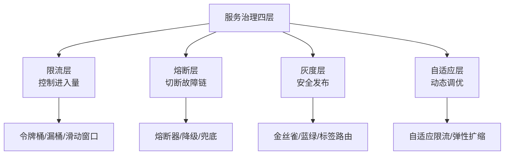

# ⬡ 服务治理深化系列

> 从「能跑」到「能扛」——服务治理四层：限流/熔断/灰度/自适应。

## 系列导航（8 篇）

|| # | 篇目 | 一句话定位 |
|---|---|---|---|
| 0 | 系列导读 | 治理 = 管控 + 韧性 |
| 1 | 限流算法深度解析 | 令牌桶/漏桶/滑动窗口 |
| 2 | 熔断机制与降级策略 | 状态机/降级/容灾 |
| 3 | 灰度发布全流程 | 金丝雀/蓝绿/标签路由 |
| 4 | 自适应限流原理 | 动态调优/弹性扩缩 |
| 5 | 服务降级与容灾 | 降级策略/故障隔离 |
| 6 | 热点数据处理 | 热点Key/热点隔离 |
| 7 | 服务治理架构总结 | 全链路治理闭环 |

## 心智模型

## 四层关系

| 层次 | 角色 | 时机 | 保护对象 |
|---|---|---|---|
| 限流 | 预防 | 流量到达前 | 系统整体 |
| 熔断 | 止损 | 故障发生时 | 调用方 |
| 灰度 | 安全网 | 版本发布时 | 用户体验 |
| 自适应 | 进化 | 运行时 | 长期稳定性 |

## 阅读路径

- 先读入门层（服务发现基础）
- 再按需深入特性层某一篇
- 最后读 7_服务治理架构总结（全链路串联）