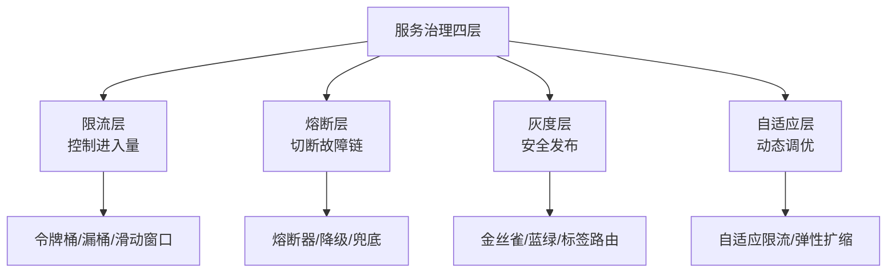
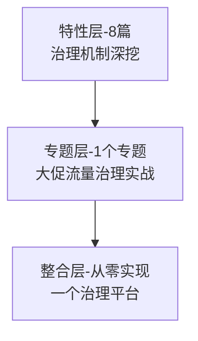

# 服务治理深化系列导读 · 从「能跑」到「能扛」

> 📖 本系列共 8 篇（0_导读 + 7 正文），覆盖服务治理从基础到深入的完整知识面。
> 本篇是第 0 篇导读：先建立「治理 = 管控 + 韧性」的心智模型，再决定读哪条路。

## 一、为什么需要这套系列

> 量级分档意识：本文方法在十万级 QPS、千万级用户、亿级流量的场景下均需重新评估——量级变化时架构与参数需同步调整。

入门层的服务发现解决了「找到谁」的问题，但真实生产中还有更多挑战：

- 服务 A 调用服务 B，B 的响应越来越慢但不报错——怎么感知？
- 大促流量突然翻倍，如何自动保护系统不被压垮？
- 新版本上线，如何安全地验证效果而不影响全部用户？
- 一个服务挂了，如何防止连锁反应导致整个系统崩溃？

服务治理就是解决这些问题的——**让系统从「能跑」变成「能扛」**。

## 二、全局心智模型：服务治理四层

理解这个模型的三个要点：

1. **限流是预防**：在系统被压垮之前限制进入量——保护的是系统整体。
2. **熔断是止损**：当下游故障时切断调用链——保护的是调用方不被拖垮。
3. **灰度是安全网**：新版本先小流量验证——保护的是用户体验。
4. **自适应是进化**：系统根据实时状态自动调整——保护的是长期稳定性。

> tips：(治理是兜底) 没有治理的系统上线就像没有刹车的车——能跑但不安全。治理不是负担，是系统的安全气囊。

## 三、系列导航表（8 篇）

| 序号 | 篇目 | 深度 | 一句话定位 | 对标参考 |
|---|---|---|---|---|
| 0 | 系列导读 | 全景 | 四层治理模型 + 阅读路径 | - |
| 1 | 限流算法深度解析 | 特性 | 令牌桶/漏桶/滑动窗口原理 | 《分布式系统》 |
| 2 | 熔断机制与降级策略 | 特性 | 熔断三态 + 降级方案设计 | 《微服务设计》 |
| 3 | 灰度发布全流程 | 特性 | 金丝雀/蓝绿/全量切换 | 生产实践 |
| 4 | 自适应限流原理 | 特性 | 实时感知 + 动态调优 | Sentinel 源码 |
| 5 | 服务降级与容灾 | 特性 | 主动降级 vs 被动降级 | 生产事故案例 |
| 6 | 热点数据处理 | 特性 | 缓存击穿/热点Key/限流 | 生产实践 |
| 7 | 服务治理架构总结 | 特性 | 治理选型决策树 + 落地清单 | 综合应用 |

## 四、从点到面：四层进阶路径

| 层级 | 定位 | 规模 | 适合 |
|---|---|---|---|
| 特性层 | 点 × 深：治理机制拆到原理级 | 8 篇 | 按兴趣挑重点 |
| 专题层 | 面：大促流量治理实战 | 1 个专题 | 解决实际场景 |
| 整合层 | 体系：从零实现治理平台 | 1 个 demo | 动手派 |

## 五、入门读者最容易踩的 3 个认知误区

### 误区 1：以为「限流就是设个阈值」

限流不只是设 QPS 阈值——还包括预热、排队、告警、动态调整。固定阈值无法应对流量突发。

### 误区 2：以为「熔断了就完了」

熔断是保护机制不是故障——熔断后自动恢复（半开探测），降级方案兜底，熔断是安全网不是终点。

### 误区 3：以为「灰度就是 50/50」

灰度比例应逐步递增（1%→5%→20%→50%→100%），一步到位的灰度不是灰度，是全量发布。

---

**开放问题**：自适应限流和固定阈值限流能结合吗？答案是：能——平时用自适应（更精确），大促切固定阈值（更可预期）。

**决策（何时用）**：所有生产服务必须有限流；依赖下游必须有熔断；发版必须灰度。

> **演进视角**：系列导读 的实践经历了持续演进。

## 📌 数据与事实声明

- 写于 2026-09-11
- 免责：以官方文档为准

## 📚 参考资料

| 类型 | 标题 | 来源 |
|---|---|---|
| 官方文档 | 官方文档 | 官方站点 |
