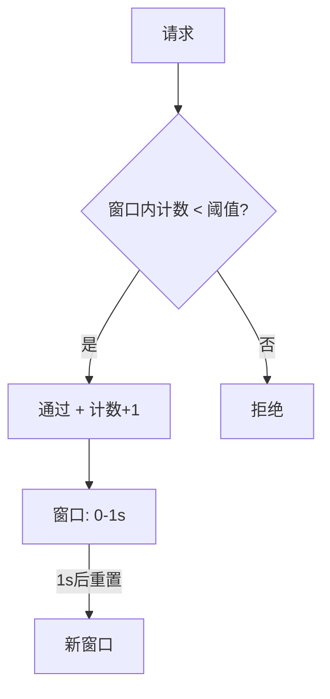
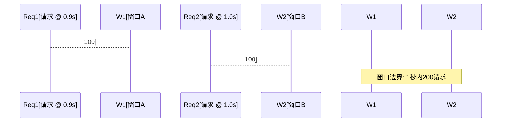
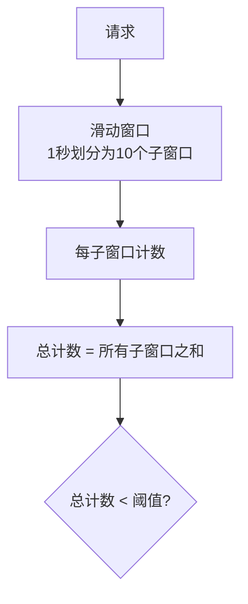
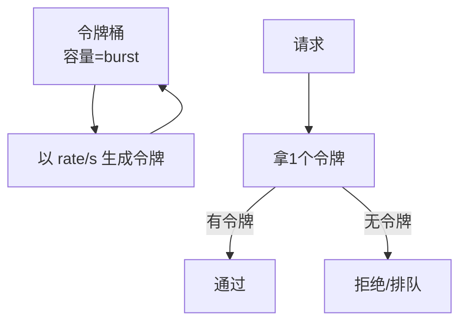
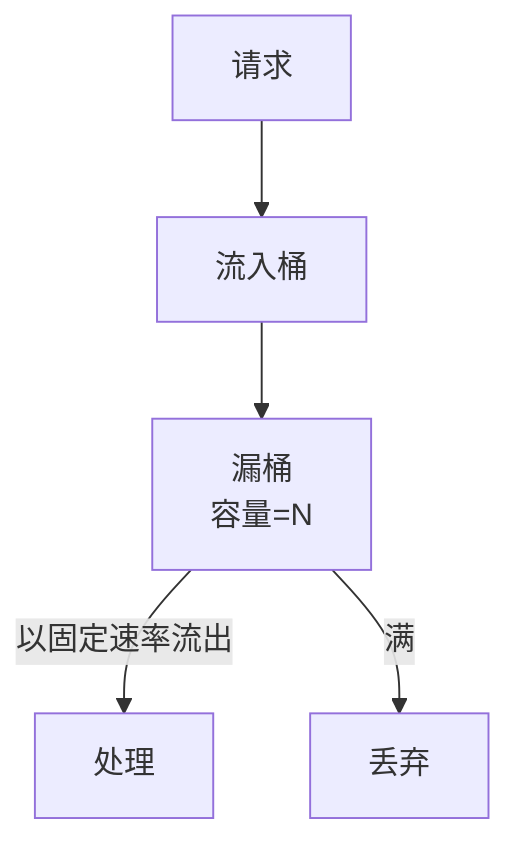
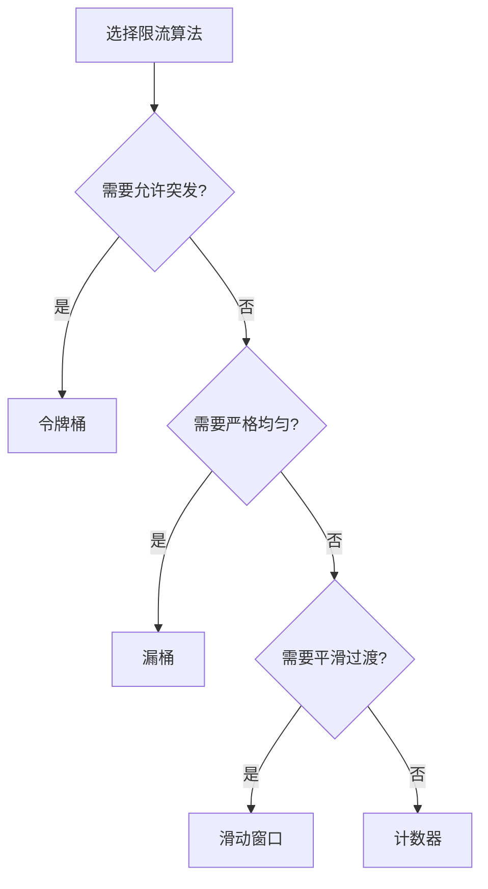

# 限流算法深度解析

> **一句话摘要**：限流的核心是「控制进入量」——令牌桶允许突发、漏桶强制均匀、滑动窗口平滑过渡；选择合适的算法才能精准保护系统。
> **本文核心**：**限流 = 算法 + 阈值 + 策略**——算法决定了流量的形状。

前置阅读：[流量治理与路由](../入门层/从零开始认识分布式系统服务发现系列/6_流量治理与路由-入门.md)。本篇深入限流算法的原理和实现细节。


## 源码与实现原理

限流算法深度解析 的底层实现机制涉及多个关键路径——从入口到核心处理逻辑，代码设计反映了性能与可维护性的权衡。
## 1. 背景：为什么需要深入算法

> 量级分档意识：本文方法在十万级 QPS、千万级用户、亿级流量的场景下均需重新评估——量级变化时架构与参数需同步调整。


入门层讲了「限流是什么」，本篇回答「限流怎么精确控制」：

- 同样的 QPS 阈值，为什么系统表现不同？
- 突发流量应该怎么处理？
- 限流的「窗口」怎么选？

算法选择直接影响系统的**吞吐量和响应时间**——选错算法要么浪费资源，要么误拒正常请求。

## 2. 核心机制：四种限流算法

### 2.1 计数器法（固定窗口）

最简单的限流：在固定时间窗口内计数。



- **实现**：`count++ if time < window_end`
- **优点**：简单
- **缺点**：窗口边界突发（窗口末尾和窗口开头各来一批请求，在 2 秒内实际流量翻倍）



### 2.2 滑动窗口

将窗口划分为更小的子窗口，平滑过渡：



- **实现**：环形数组，每个格子记录时间戳和计数
- **优点**：解决了固定窗口的边界突发
- **缺点**：实现稍复杂

### 2.3 令牌桶

系统按固定速率生成令牌，桶满则丢弃，请求需要拿令牌：



- **参数**：
  - `rate`：令牌生成速率（QPS 上限）
  - `burst`：桶容量（允许的最大突发）
- **优点**：允许突发流量，适合有突发场景
- **缺点**：桶满时突发流量仍可能压垮系统

### 2.4 漏桶

请求流入桶中，以固定速率流出：



- **优点**：流量均匀
- **缺点**：不允许突发

### 2.5 四种算法对比

| 算法 | 突发 | 均匀性 | 实现复杂度 | 适用场景 |
|---|---|---|---|---|
| 计数器 | 允许（边界） | 差 | 低 | 简单限流 |
| 滑动窗口 | 允许（平滑） | 中 | 中 | 通用限流 |
| 令牌桶 | 允许（可控） | 中 | 中 | 有突发场景 |
| 漏桶 | 不允许 | 好 | 低 | 严格均匀 |

## 3. 落地实践：Sentinel 限流配置

Sentinel 支持多种限流模式：

```java
// QPS 限流
@SentinelResource(value = "stock", blockHandler = "block")
@RestController
public class StockController {
    public String getStock() { return "ok"; }
}

// 预热模式（冷启动）
@SentinelResource(value = "order", blockHandler = "block",
    properties = {
        @Property(name = "grade", value = "1"),  // QPS
        @Property(name = "count", value = "100"), // QPS 阈值
        @Property(name = "controlBehavior", value = "1") // 预热模式
    })
```

**Sentinel 限流模式**：

| 模式 | 参数 | 适用场景 |
|---|---|---|
| 直接 | QPS / 线程数 | 基础限流 |
| 关联 | 关联资源限流 | A 慢则限 B |
| 链路 | 调用链限流 | 入口级限流 |
| 热点参数 | 参数级限流 | 某个参数值限流 |

## 4. 落地实践：选择哪种算法



**实际选择**：

| 场景 | 推荐算法 | 理由 |
|---|---|---|
| API 接口限流 | 令牌桶 | 允许突发且可控 |
| 流式处理 | 漏桶 | 严格均匀 |
| 大促入口 | 令牌桶 + 预热 | 防止冷启动被打满 |
| 简单服务 | 计数器/滑动窗口 | 够用即可 |

## 5. 生产视角：限流踩坑

- **踩坑 1**：限流阈值 = 预估峰值——但实际峰值超过预估，限流成了「误杀」
- **踩坑 2**：令牌桶 burst = 1——不允许任何突发，用户体验差
- **踩坑 3**：限流和熔断配合不当——限流拒绝后触发熔断，熔断后恢复又触发限流
- **踩坑 4**：多实例限流不统一——每个实例独立限流，总 QPS 超标

**生产最佳实践**：

1. 限流阈值 = 压测 P99 时的 QPS × 1.5
2. 令牌桶 burst = 正常 QPS 的 2 倍
3. 多实例集群限流（Sentinel Cluster Mode）
4. 限流 + 熔断配合，限流拒绝后走降级
5. 告警通知（限流触发时通知运维）

## 6. 典型场景

| 场景 | 策略 | 理由 |
|---|---|---|
| API 网关 | 令牌桶 | 允许突发但可控 |
| 数据库写入 | 漏桶 | 严格均匀，保护 DB |
| 大促入口 | 预热 + 令牌桶 | 冷启动保护 |
| 下游服务保护 | 关联限流 | A 慢则限 B |
| 热点数据 | 热点参数限流 | 按参数值限流 |

## 7. 与相邻概念的区别

- **限流 vs 熔断**：限流是「限制进入量」，熔断是「停止调用」
- **限流 vs 排队**：限流是「拒绝或放行」，排队是「等待处理」
- **限流 vs 降级**：限流是自动防护，降级是主动放弃功能

## 8. 常见误区与不适用

- **「QPS 阈值 = CPU 最大值」**：应该是 P99 时的 QPS，不是理论最大值
- **「限流越严格越好」**：过于严格导致正常请求被拒，用户体验差
- **「一种算法通吃」**：不同场景需要不同算法
- **不适用场景**：内部非关键服务（不需要限流）

## 9. 你们可能会问

- **令牌桶和漏桶的根本区别？** 令牌桶允许突发（桶内有令牌就放行），漏桶强制均匀（按固定速率流出）
- **Sentinel 和 Guava RateLimiter 区别？** Sentinel 是分布式限流，RateLimiter 是单机限流
- **多实例怎么统一限流？** Sentinel Cluster Mode 或 Redis 集中计数
- **限流后怎么处理被拒请求？** 排队、重试、降级、返回兜底数据

## 10. 一句话总结 + 5W 速记卡 + 自测三问

**一句话总结**：限流算法 = 令牌桶（允许突发）/ 漏桶（严格均匀）/ 滑动窗口（平滑）——选对算法才能精准保护。

**5W 速记卡**：

| 维度 | 内容 |
|---|---|
| What | 四种算法：计数器/滑动窗口/令牌桶/漏桶 |
| Why | 控制流量形状，保护系统 |
| When | 流量进入系统前 |
| Where | 网关/服务/方法级 |
| How | 根据场景选算法 → 配阈值 → 设策略 |

**自测三问**：

1. 你的系统用的是什么限流算法？为什么选这个？
2. 你的令牌桶 burst 设了多少？为什么？
3. 多实例限流时，总 QPS 怎么控制？

---

**下篇预告**：熔断三态 + 降级方案——[熔断机制与降级策略](./2_熔断机制与降级策略-特性.md)。

**🎯 核心带走**：

- **核心一句话**：令牌桶允许突发，漏桶严格均匀——算法决定流量形状
- **链条复述**：请求 → 算法判断 → 通过/拒绝/排队 → 降级兜底
- **失效点与边界**：阈值设置不当；多实例限流不统一

💡 **实战提示**：生产用令牌桶 + 预热——允许突发但冷启动不被打满。

**开放问题**：限流和排队能结合吗？答案是：能——令牌桶拒绝时进入排队队列，延后处理。

**决策（何时用）**：有突发场景用令牌桶；严格均匀用漏桶；平滑过渡用滑动窗口。


> **演进视角**：限流算法深度解析 的实践经历了持续演进。

## 📌 数据与事实声明

- 写于 2026-09-11
- 免责：以官方文档为准

## 📚 参考资料

| 类型 | 标题 | 来源 |
|---|---|---|
| 官方文档 | 官方文档 | 官方站点 |
